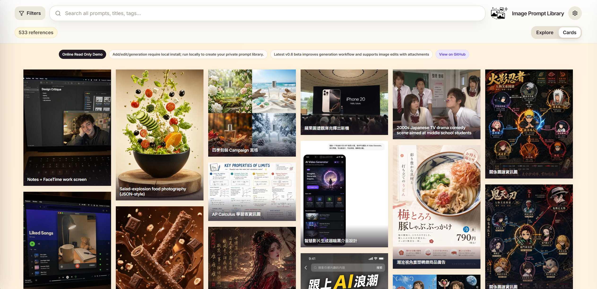

# Image Prompt Library

[](https://github.com/EddieTYP/image-prompt-library/actions/workflows/ci.yml)
[](https://github.com/EddieTYP/image-prompt-library/actions/workflows/pages.yml)
[](https://github.com/EddieTYP/image-prompt-library/releases/latest)
[](LICENSE)

<p align="center">
  <strong>Language:</strong>
  <strong>English</strong> |
  <a href="README_zh-TW.md">繁體中文</a> |
  <a href="README_zh-CN.md">简体中文</a>
</p>

**Image Prompt Library** is a local-first visual library for generated images and the prompts behind them. Save useful image results, preserve the prompt and source metadata, organize references into collections and tags, and find them again as an image-first catalogue.

Your private library stays on your machine: local SQLite, local image files, no hosted database, no built-in cloud sync, and no account required.


## Introduction

Image Prompt Library is built for the moment when image-generation prompts become reusable knowledge rather than one-off chat messages.

**Browse the read-only online demo:** <https://eddietyp.github.io/image-prompt-library/>

The public demo is a browsable catalogue of **533 prompt/image references** gathered from two generous upstream galleries: [`wuyoscar/gpt_image_2_skill`](https://github.com/wuyoscar/gpt_image_2_skill) (**CC BY 4.0**) and [`freestylefly/awesome-gpt-image-2`](https://github.com/freestylefly/awesome-gpt-image-2) (**MIT**). It covers UI and interface design, posters and typography, product and e-commerce imagery, charts and infographics, technical diagrams, photography, character portraits, architecture, storytelling scenes, and illustration styles. Each reference is shown as an image-first card, with English, Traditional Chinese, and Simplified Chinese prompt variants where available.

<p align="center">
  
</p>

Use the online demo as a visual prompt catalogue: search for ideas, inspect prompt structure, copy public sample prompts, and compare how different prompt styles map to different image outputs. The GitHub Pages demo is intentionally static and read-only: Add/Edit, private library management, and image generation are local-install features.

If you want to manage your own private prompt/image library, install the app locally. Local installs let you add and edit your own images and prompts, organize them into collections and tags, search them later, and optionally generate new images through ChatGPT / Codex OAuth while keeping your SQLite database and image files on your own computer.

Current stable release: [GitHub Latest](https://github.com/EddieTYP/image-prompt-library/releases/latest). It includes native Windows installation, structured search and sorting, batch reference management, cleanup tools, versioned install/update/rollback, a calmer first-run experience, and hardened OAuth session recovery for optional local generation.

## Quick start

### Windows (v0.8.0+)

Native Windows support begins with [`v0.8.0`](https://github.com/EddieTYP/image-prompt-library/releases/tag/v0.8.0). Windows 10/11, PowerShell 5.1+, and **Python 3.10+** are required; the installer does not install Python.

```powershell
irm https://raw.githubusercontent.com/EddieTYP/image-prompt-library/main/scripts/install.ps1 | iex
```

A successful install starts the app in the background and opens your browser. Stop it with `image-prompt-library stop`; see the [installation guide](docs/INSTALLATION.md) for updates, rollback, diagnostics, private-data locations, and the inspect-first install path.

The installed bare command is a `.cmd` shim and remains usable from Windows PowerShell under the `Restricted` execution policy; its internal PowerShell delegate is launched with an explicit per-command bypass.

### macOS, Linux, and WSL

Normal release installs require **Python 3.10+** and `curl`. They do **not** require Node.js. Windows users can also use this Unix path through WSL 2.

```bash
curl -fsSL https://raw.githubusercontent.com/EddieTYP/image-prompt-library/main/scripts/install.sh | bash
image-prompt-library start
```

`image-prompt-library start` runs the Unix/WSL local server in the current terminal. Keep it open, then visit <http://127.0.0.1:8000/> in your browser. Press `Ctrl-C` in that terminal to stop the server.

A fresh local library starts empty. Use `+ Add` in the app to create your first private prompt card, or import an optional starter sample pack if you want demo references first:

```bash
image-prompt-library sample-data en       # English collection names
image-prompt-library sample-data zh_hans  # Simplified Chinese collection names
image-prompt-library sample-data zh_hant  # Traditional Chinese collection names
```

The starter sample pack can be installed with localized collection names in English, Simplified Chinese, or Traditional Chinese. The underlying sample references keep their source titles/prompts and available prompt variants; this choice mainly affects the imported collection labels and default sample-pack language metadata.

For the larger Traditional Chinese `awesome-gpt-image-2` sample pack:

```bash
image-prompt-library sample-data zh_hant awesome-gpt-image-2
```

For a quick local check:

```bash
image-prompt-library status
image-prompt-library doctor
```

For update, rollback, service mode, uninstall, WSL, and source-development setup, see [Documentation](#documentation).

## What you can do

- **Browse visually:** scan prompt references in Cards view or Explore view.
- **Search and filter:** search titles, prompts, tags, collections, sources, and notes; combine search with collection filters.
- **Preserve prompt provenance:** keep original/source prompt variants and translated or converted variants side by side.
- **Manage a private library:** add/edit your own prompt cards, result images, optional reference images, tags, notes, source URLs, and collections.
- **Copy reusable prompts:** open an item, choose the prompt language/source variant, and copy it with one click.
- **Generate locally:** connect optional ChatGPT / Codex OAuth in a local install with a ChatGPT subscription that has image-generation access, generate from new or saved prompts, fill `{{variables}}` before sending template prompts, review results, then attach to the current item or save as a new item.
- **Stay local-first:** your database and image files remain in your local library directory.

## Searching the library

Use the search box at the top of the app to narrow visible references. Search combines plain keywords across item titles, prompt text, tags, collection names, source metadata, and notes with lightweight structured filters.

Examples:

```text
apple
poster design tag:poster
product photo collection:Ideas
source:awesome model:gpt-image-2
favorite:true has:image created:30d updated:7d
```

Use structured search filters such as `tag:poster`, `collection:Ideas`, `source:awesome`, `model:gpt-image-2`, `favorite:true`, `has:image`, `created:30d`, and `updated:7d` alongside plain keywords. Use the visible sort control to order references by updated date, created date, title, source, or model.

Search also works with collection filters: choose a collection from **Filters**, then type a keyword or structured filter to search inside that collection.

Select multiple cards to favorite, move, archive, restore, or delete references together; use `archived:true` to review archived references before restoring them. In local **Config**, preview cleanup before removing broken image records or unreferenced media stored in the local library folder.

## Local generation

Local installs can optionally connect ChatGPT / Codex OAuth and generate images without adding an OpenAI API key to the app. You will need a ChatGPT account/subscription with access to image generation.

Basic flow:

1. Start the local app and open **Config**.
2. Connect **ChatGPT / Codex OAuth** and approve the device-login flow in your browser.
3. Return to Image Prompt Library and generate from a new prompt or from an existing saved reference. Prompts can include variables such as `{{subject}}` or `{{style}}`; the composer asks for values before sending the final prompt.
4. Review generated results in the local inbox.
5. Attach the result to the current item, or save it as a new item with editable metadata.

<p align="center">
  
</p>

The public GitHub Pages demo never performs live generation and does not expose mutation controls.

For current generation behavior, limitations, and benchmark notes, see [`docs/GENERATION.md`](docs/GENERATION.md).

## Sample data and attribution

For first-time setup, Image Prompt Library can import optional sample bundles so you have real prompt/image references to explore right away. These samples come from upstream open projects and are included with clear links, thanks, and license notes. They are not presented as original Image Prompt Library artwork or prompts; they remain connected to their original creators and licenses.

| Sample source | License | Notes |
| --- | --- | --- |
| [`wuyoscar/gpt_image_2_skill`](https://github.com/wuyoscar/gpt_image_2_skill) | CC BY 4.0 | First public sample package and default starter sample library. |
| [`freestylefly/awesome-gpt-image-2`](https://github.com/freestylefly/awesome-gpt-image-2) | MIT | Larger Chinese prompt/image gallery used by the current public demo and optional sample pack. |

Thank you to both upstream projects for making these galleries available. Their prompts and images keep their own source links, attribution, and license terms. Image Prompt Library only provides the local app, import workflow, and browsing/management interface around them; the app code remains licensed separately under AGPL-3.0-or-later.

For sample package details and checksums, see [`sample-data/README.md`](sample-data/README.md).

## Documentation

- [`docs/INSTALLATION.md`](docs/INSTALLATION.md) — install, update, rollback, service mode, uninstall, platform notes.
- [`docs/GENERATION.md`](docs/GENERATION.md) — ChatGPT / Codex OAuth generation workflow, result review, current limitations, benchmark link.
- [`docs/BACKUP_AND_RESTORE.md`](docs/BACKUP_AND_RESTORE.md) — portable backup payload, credential boundary, validation, and safe restore behavior.
- [`docs/DEVELOPMENT.md`](docs/DEVELOPMENT.md) — source setup, dev mode, configuration, data layout, backups.
- [`docs/TROUBLESHOOTING.md`](docs/TROUBLESHOOTING.md) — common runtime and setup issues.
- [`CONTRIBUTING.md`](CONTRIBUTING.md) — contributor setup, tests, and project structure.
- [`ROADMAP.md`](ROADMAP.md) — planned work and project direction.

## License, privacy, and allowed use

Image Prompt Library's core application code is open source under **AGPL-3.0-or-later**. Copyright (C) 2026 Edward Tsoi. See [`NOTICE`](NOTICE) and [`LICENSE`](LICENSE).

Commercial licenses are available for organizations that want to use, modify, or host Image Prompt Library under terms outside the AGPL. Contact the maintainer if you need proprietary hosted-product terms or other non-AGPL licensing.

Privacy model:

- The app is local-first and stores data on your device.
- There are no hosted user accounts or built-in cloud sync.
- Binding to `127.0.0.1` keeps the app local to your machine. Only change the host if you understand LAN exposure.

## Project status

The local-first library, versioned install/update/rollback workflow, read-only online demo, and optional ChatGPT / Codex OAuth generation are stable and available today. If the upstream OAuth or generation service changes, compatibility updates will be handled as maintenance releases. The `v0.9.0` milestone adds portable backup and safe restore; later work remains limited to evidence-led Explore, theme, batch, and multi-image improvements.
