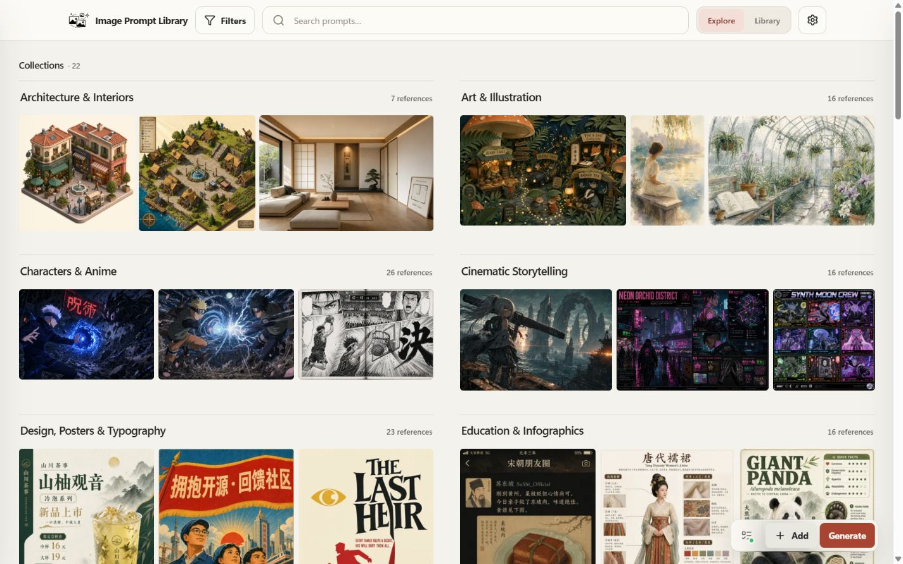

# Image Prompt Library

[](https://github.com/EddieTYP/image-prompt-library/actions/workflows/ci.yml)
[](https://github.com/EddieTYP/image-prompt-library/actions/workflows/pages.yml)
[](https://github.com/EddieTYP/image-prompt-library/releases/latest)
[](LICENSE)

<p align="center">
  <strong>语言：</strong>
  <a href="README.md">English</a> |
  <a href="README_zh-TW.md">繁体中文</a> |
  <strong>简体中文</strong>
</p>

**Image Prompt Library** 是一个本地优先的图片与提示词收藏库。它帮你把好用的生成图片、背后的 prompt、来源和备注一起保存起来，再用 collection、tag 和搜索慢慢整理成自己的视觉资料库。

你的私人 library 会留在自己的电脑：本地 SQLite、本地图片文件，没有 hosted database，没有内置云端同步，也不需要注册账号。

<p align="center">
  
</p>
<p align="center"><sub>本地 Library 集中保存图片、prompt、collection 和 tag。</sub></p>

## 为什么做这个

生成图片多了之后，最麻烦的往往不是再生一张，而是找回之前哪个 prompt 好用、哪张图适合参考、当时用了什么来源和变体。

Image Prompt Library 就是为这件事而做：把分散在聊天记录、文件夹和截图里的 prompt/image references，整理成一个可浏览、可搜索、可追溯来源的本地 library。你可以把它当成自己的 prompt catalogue。

当前 stable release：[GitHub Latest](https://github.com/EddieTYP/image-prompt-library/releases/latest)。版本包括 structured search 与 sorting、batch reference management、cleanup tools、versioned install/update/rollback、原生 Windows 安装、更清晰的首次使用流程，以及 optional local generation 的 OAuth session recovery hardening。

## 快速开始

### Windows（v0.8.0+）

原生 Windows 支持从 [`v0.8.0`](https://github.com/EddieTYP/image-prompt-library/releases/tag/v0.8.0) 开始提供。需要 Windows 10/11、PowerShell 5.1+ 和 **Python 3.10+**；安装程序不会自动安装 Python。

```powershell
irm https://raw.githubusercontent.com/EddieTYP/image-prompt-library/main/scripts/install.ps1 | iex
```

安装成功后会在后台启动 app 并打开浏览器。使用 `image-prompt-library stop` 停止；更新、rollback、诊断、私有数据位置和先检查再执行的步骤请见[安装说明](docs/INSTALLATION.md)。

### macOS、Linux 和 WSL 2

Windows 用户也可以通过 WSL 2 使用下面的 Unix 安装方式。

普通 Unix/WSL release 安装只需要 **Python 3.10+** 和 `curl`，不需要 Node.js。

```bash
curl -fsSL https://raw.githubusercontent.com/EddieTYP/image-prompt-library/main/scripts/install.sh | bash
image-prompt-library start
```

`image-prompt-library start` 会在当前 terminal 启动本地 server。保持 terminal 打开，然后在浏览器打开 <http://127.0.0.1:8000/>。要停止 server，在同一个 terminal 按 `Ctrl-C`。

可选：如果想让新的本地 library 先有一批 demo references，可以导入 starter sample pack。

```bash
image-prompt-library sample-data en       # English collection names
image-prompt-library sample-data zh_hans  # Simplified Chinese collection names
image-prompt-library sample-data zh_hant  # Traditional Chinese collection names
```

Starter sample pack 可以用英文、简体中文或繁体中文的 collection name 导入。这不是把所有原始 prompt/title 全部翻译一次；sample 仍会保留来源 title、prompt 和已有的 prompt variants，语言选项主要影响导入后的 collection label 和 sample-pack metadata。

如果想导入较大的中文 `awesome-gpt-image-2` sample pack：

```bash
image-prompt-library sample-data zh_hant awesome-gpt-image-2
```

更新、rollback、service mode、uninstall、WSL 和 source-development setup，请看 [文件](#文件)。

## 功能概览

- **图片优先浏览：** 在 Explore 按 Collections 探索自然比例图片，或在 Library 完整管理 prompt references。
- **选择浅色配色：** 可在浏览器本地切换朱红、松绿及茄紫三种配色，不会改动 library data。
- **搜索和筛选：** 搜索 title、prompt、tag、collection、source 和 note，也可以配合 collection filter 使用。
- **保存来源脉络：** 原始 prompt、来源资料、翻译或转换后的 variant 可以放在同一张卡片。
- **管理私人 library：** 新增 / 编辑自己的 prompt card、结果图、reference image、tag、note、source URL 和 collection。
- **一键复制 prompt：** 打开 item，选择语言或来源 variant，直接复制。
- **本地生成：** 本地安装版可选择连接 ChatGPT / Codex OAuth，一次生成 1、3、5 或 10 张图片，再连续检查每个结果并选择保存、丢弃或重试；如果结果来自未修改的已保存参考，也可以附加回原参考。
- **保持 local-first：** database 和图片文件都留在本地 library directory。

<p align="center">
  
</p>
<p align="center"><sub>在 Explore 按 collection 浏览已保存的 references。</sub></p>

## 搜索 library

App 顶部的 search box 可以筛选当前看到的 references。当前版本是普通 keyword search，会搜索 title、prompt、tag、collection name、source metadata 和 note。

例子：

```text
apple
poster design
product photo
awesome-gpt-image-2
电商
```

搜索可以配合 collection filter：先在 **Filters** 选 collection，再输入 keyword，就可以只在这个 collection 里找。

<p align="center">
  
</p>
<p align="center"><sub>打开 reference，查看图片、prompt、tag 和来源。</sub></p>

## 本地生成

本地安装版可以选择连接 ChatGPT / Codex OAuth，不需要在 app 里放 OpenAI API key。你需要一个有图片生成权限的 ChatGPT account/subscription。

基本流程：

1. 启动本地 app，打开 **Config**。
2. 连接 **ChatGPT / Codex OAuth**，在浏览器完成 device-login approval。
3. 回到 Image Prompt Library，由新 prompt 或已保存 reference 开始生成。Prompt 可以用 `{{主体}}` 或 `{{风格}}` 这类变量；composer 会先要求填值。
4. 在 **工作队列** 查看已完成的结果。
5. 选择 **另存为新参考**；如果结果来自未经修改的已保存参考，也可以用 **附加到当前参考**。另存前可以先编辑 metadata。

公开 GitHub Pages demo 不会执行 live generation，也不会开放新增 / 编辑等修改操作。

当前生成行为、限制和 benchmark notes，请看 [`docs/GENERATION.md`](docs/GENERATION.md)。

## 线上只读 demo

公开 demo：<https://eddietyp.github.io/image-prompt-library/>。其中收录 **533 个带来源与授权信息的 prompt/image references**，来自 [`wuyoscar/gpt_image_2_skill`](https://github.com/wuyoscar/gpt_image_2_skill)（**CC BY 4.0**）和 [`freestylefly/awesome-gpt-image-2`](https://github.com/freestylefly/awesome-gpt-image-2)（**MIT**）。如上游提供，也会显示不同语言的 prompt variants。

<p align="center">
  
</p>
<p align="center"><sub>线上 demo 只供浏览；编辑和生成需要本地安装。</sub></p>

你可以用 demo 浏览 collections、搜索案例、查看 prompt 结构和复制公开 sample prompts。它不会开放编辑、私人 library 管理或图片生成。

## Sample data 与 attribution

第一次 setup 时，可以导入可选 sample bundles，先有一批真实 prompt/image references 可以浏览和试用。这些 samples 来自开放的上游项目，导入时会保留来源链接、致谢和 license notes。它们不是 Image Prompt Library 原创 artwork 或 prompt；原始 creator 和 license 都会清楚保留。

| Sample source | License | Notes |
| --- | --- | --- |
| [`wuyoscar/gpt_image_2_skill`](https://github.com/wuyoscar/gpt_image_2_skill) | CC BY 4.0 | 第一个公开 sample package，也是默认 starter sample library。 |
| [`freestylefly/awesome-gpt-image-2`](https://github.com/freestylefly/awesome-gpt-image-2) | MIT | 较大的中文 prompt/image gallery，用于当前公开 demo 和可选 sample pack。 |

感谢两个上游项目开放这些 gallery。Image Prompt Library 提供的是本地 app、导入流程、浏览和管理界面；sample prompt 和图片仍然保留各自的 source link、attribution 和 license terms。App code 另外以 AGPL-3.0-or-later 授权。

Sample package details 和 checksums 请看 [`sample-data/README.md`](sample-data/README.md)。

## 文件

- [`docs/INSTALLATION.md`](docs/INSTALLATION.md) — install、update、rollback、service mode、uninstall、platform notes。
- [`docs/GENERATION.md`](docs/GENERATION.md) — ChatGPT / Codex OAuth generation workflow、result review、当前限制、benchmark link。
- [`docs/BACKUP_AND_RESTORE.md`](docs/BACKUP_AND_RESTORE.md) — portable backup payload、credential boundary、验证及 safe restore 行为。
- [`docs/DEVELOPMENT.md`](docs/DEVELOPMENT.md) — source setup、dev mode、configuration、data layout、backup。
- [`docs/TROUBLESHOOTING.md`](docs/TROUBLESHOOTING.md) — 常见 runtime 和 setup 问题。
- [`CONTRIBUTING.md`](CONTRIBUTING.md) — contributor setup、tests 和 project structure。
- [`ROADMAP.md`](ROADMAP.md) — planned work 和 project direction。

## License、privacy 与 allowed use

Image Prompt Library 的核心 application code 以 **AGPL-3.0-or-later** 开源。Copyright (C) 2026 Edward Tsoi。详情请看 [`NOTICE`](NOTICE) 和 [`LICENSE`](LICENSE)。

如果组织想在 AGPL 以外的条款下使用、修改或 host Image Prompt Library，可以联系 maintainer 洽谈 commercial license。

Privacy model：

- App 是 local-first，资料储存在你的设备上。
- 没有 hosted user account，也没有内置 cloud sync。
- 默认绑定 `127.0.0.1`，只允许本机访问；除非你清楚理解 LAN exposure，否则不建议修改 host。

## Project status

`v0.10.1` 已是当前 stable release。除了包含 `v0.10.0` 的 Explore Collections、三种界面配色、批次生成结果查看流程和本地数据保护，也修复 GitHub 公开查询次数用尽时更新检查会失败的问题。需要上一个版本时，仍可从 GitHub Releases 下载 `v0.10.0`。
