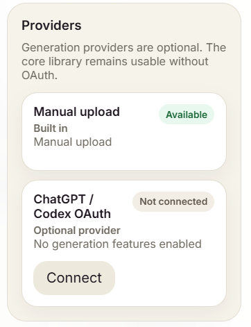
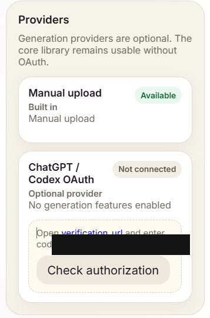
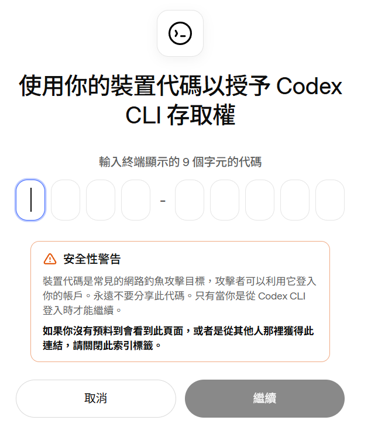
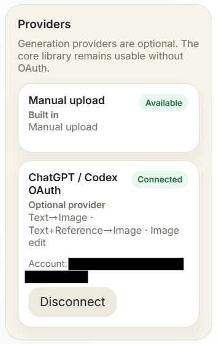
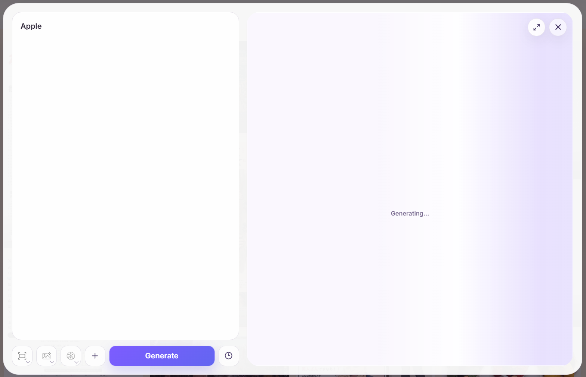
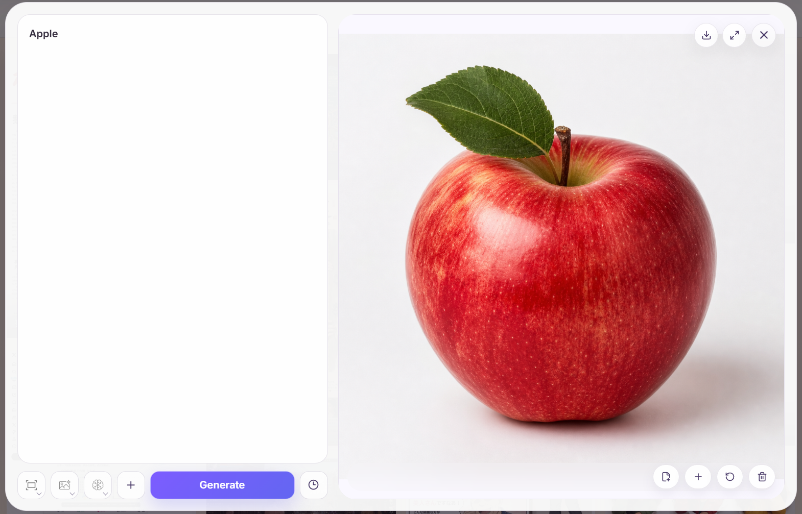
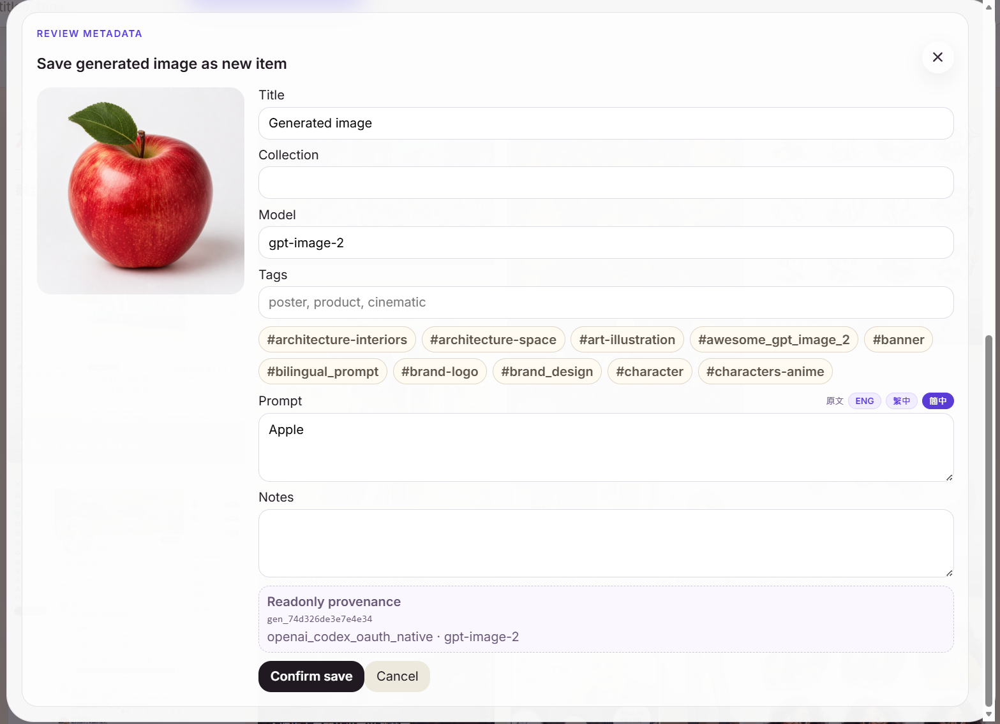

# Local Generation Guide

Local installs can optionally connect **ChatGPT / Codex OAuth** for image generation. The GitHub Pages Online Read Only Demo stays read-only and does not expose generation or mutation controls.

## What the local generation flow does

Once connected, you can:

- Generate a new image from a fresh prompt.
- Queue a `Generation set` of 3, 5, or 10 independent variations from the same prompt and settings.
- Generate a variant from an existing reference.
- Review generated results before saving them into the library.
- Attach a result to the current item.
- Save a result as a new item with editable metadata.
- Keep generated-output provenance such as provider, model, source item, generation job, and timestamps.
- Use prompt variables such as `{{subject}}`, `{{style}}`, or `{{主體}}` in reusable template prompts and fill them before each generation.

No OpenAI API key is required by the app for the ChatGPT / Codex OAuth path. Advanced provider configuration is available for users who need it, but the normal flow is handled from the Config drawer.

## Privacy boundary

Generation is local-install only. The public GitHub Pages demo does not perform live imports or generation and does not expose Add/Edit/private-library controls.

The app-owned OAuth store and local provider config must resolve outside the active library. If `IMAGE_PROMPT_LIBRARY_AUTH_PATH` or `IMAGE_PROMPT_LIBRARY_CONFIG_PATH` resolves to the library itself or any child path, startup stops before the database or credential files are read. Library-managed media roots (`originals`, `thumbs`, `previews`, `generation-results`, and `generation-references`) must also resolve inside the library; external symlink or junction targets are rejected so they cannot alias app-owned state. The app does not move or delete an unsafe file automatically.

For an existing unsafe override, move the file manually to `~/.image-prompt-library/auth.json` or `~/.image-prompt-library/config.json`, update or unset the override, then restart. Treat any older backup that may contain the file as sensitive; reconnect the provider if the credential may have been exposed. Tokens must never be committed to git, sample bundles, backups, or GitHub Pages exports.

## Connect the provider

Open **Config → Providers**. The in-app generation provider is **ChatGPT / Codex OAuth**. Manual upload is an internal fallback for existing library import paths, not a selectable generation provider.

<p align="center">
  
</p>

Choose **Connect**. The app opens a device-login step: follow the verification link, enter the displayed user code, and then return to Image Prompt Library to check authorization.

<p align="center">
  
</p>

The browser approval page may say **Codex CLI** because the current provider uses the Codex OAuth device flow behind the scenes. Only approve it if you started the flow yourself from your local Image Prompt Library app.

<p align="center">
  
</p>

After approval, the provider card should show **Connected** and list the available generation modes. Account details should be treated as private; the screenshot below is redacted.

<p align="center">
  
</p>

## Generate and review results

Open the local generation composer, type a prompt, choose the desired controls, and run **Generate** for one image. The adjacent choice offers **Generate ×3**, **Generate ×5**, and **Generate ×10**; each option states how many generation requests it will use. Manual result upload remains single-image. Use double braces for reusable fields, for example `A portrait of {{subject}} in {{style}}`; the composer shows fields for each variable and previews the resolved prompt before sending.

A multi-image choice is created atomically: either the whole `Generation set` is queued or none of it is. The composer and Generation queue show exact finished, running, queued, ready, failed, and cancelled counts. **Cancel remaining** cancels only queued or running members. During review, Save as new, Attach, Discard, and Retry move to the next unreviewed result while keeping the original batch position. **Use as draft** pauses the review and **Resume review** returns to the remaining results. The final summary shows saved, attached, discarded, retrying, failed, and cancelled outcomes. Failed members are retried individually rather than with a set-wide retry.

This review session is browser-local. If Generation is closed or the page is refreshed, unfinished and replacement jobs remain available through the existing Work Queue rather than a new backend review record.

Deleting a source reference does not cancel its queued or running jobs. Those jobs become detached; completed results remain in the Generation queue and can be saved as new references.

<p align="center">
  
</p>

When the result appears, you can inspect the generated image, download it, attach it to the current item, create another variant, or delete the result.

<p align="center">
  
</p>

If you save a result as a new library item, review and edit the metadata first. The save screen shows a short generation record with the provider, model, source item, and batch position. Internal job and item identifiers remain stored for provenance but are not shown as normal user-facing text.

<p align="center">
  
</p>

## When generation fails

The composer and Generation queue use the job's classified `metadata.error_kind` rather than trying to infer a new category from provider text:

- `policy_violation`: edit the prompt, or retry the unchanged job if appropriate.
- `rate_limited`: the failed job stays failed for manual retry, while the app pauses that provider's queue and later continues untouched queued jobs automatically.
- `provider_unavailable`: retry shortly; the existing prompt and references remain with the job.
- `auth_required`: open **Config → Providers**, reconnect, then retry.
- `unknown`: retry, or edit the prompt before creating another job.

The composer can show the sanitized provider error under **Provider details** as secondary diagnostic text. The queue intentionally shows only the classified guidance. Neither surface displays credentials or unsanitized provider responses.

## Current provider notes

The current stable release includes the `openai_codex_oauth_native` provider path labelled in the UI as **ChatGPT / Codex OAuth**. Compatibility maintenance may be needed if the upstream OAuth or generation service changes.

The current local composer supports attached input images for reference/edit-style generation jobs. Current operational notes include:

- The persisted queue has no artificial submission cap. A single local app process runs up to five native-provider jobs concurrently; the 10-worker live experiment is QA-only and does not change this production limit.
- On HTTP 429, the provider queue honours a valid `Retry-After` delay up to five minutes. Without one, it uses 60, 120, 240, then at most 300 seconds across repeated incidents. The failed request is not retried automatically.
- Generation requests ask only for the final image (`partial_images: 0`); partial previews are intentionally deferred.
- Normal OAuth token renewal is coordinated locally and should not interrupt Config or generation. If the provider is temporarily unreachable, try again shortly; reconnect only when the app explicitly says OAuth needs attention.
- Failed-job retry, stalled-job recovery, and backend-restart recovery preserve their existing semantics.
- Final live-provider QA remains useful for fresh OAuth onboarding, an expired/revoked session, a temporary provider outage, and one low-cost generation request.

Maintainers can run the separate, opt-in 10-worker experiment against an isolated QA library without changing the product limit:

```powershell
.\.venv\Scripts\python.exe scripts\codex_native_oauth_smoke.py experiment-10 --library <isolated-qa-library> --prompt "A simple blue circle on white" --quality low --confirm-live
```

This sends 10 real generation requests. Its worker count measures only the local test harness; provider-side scheduling and rate-limit behaviour remain authoritative.

## Benchmark note

While building Image Prompt Library's Image 2.0 generation workflow, the project also benchmarked which Codex/ChatGPT backend tool-calling model and quality setting worked best for this app. The test covered GPT-5.5, GPT-5.4, and GPT-5.3-Codex across Low, Medium, and High quality.

The practical beta default is **GPT-5.4 + High**: acceptable speed with the strongest visual quality in those tests. Users can still change both the tool-calling model and quality setting manually.

See the benchmark notes and images in [`generation-matrix-chatgpt-codex-impasto-florals-2026-05-01.md`](generation-matrix-chatgpt-codex-impasto-florals-2026-05-01.md).
