# Awesome GPT Image 2 Prompts

[](https://awesome.re)
[](https://github.com/YouMind-OpenLab/awesome-gpt-image-2/tree/main)

> A curated collection of GPT Image 2 prompts from the community, organized for fast discovery and one-click try in [Indream](https://indream.ai/).
>
> Copyright Notice: prompts are collected for educational and research use. If any content should be removed, please open an issue in your source repository and we will handle it promptly.

## Quick Links

- Browse page: [GPT Image 2 prompts](https://indream.ai/prompts/gpt-image-2)
- Try generator: [Use GPT Image 2 Online](https://indream.ai/generate?mode=IMAGE&modelKey=gpt-image-v2)

## Browse by Category

### Use Cases

- [Social Media Creative](https://indream.ai/prompts/gpt-image-2?useCase=social-media-creative)
- [Ad Poster](https://indream.ai/prompts/gpt-image-2?useCase=ad-poster)
- [Brand Marketing](https://indream.ai/prompts/gpt-image-2?useCase=brand-marketing)
- [Editorial Publishing](https://indream.ai/prompts/gpt-image-2?useCase=editorial-publishing)
- [Concept Art Brief](https://indream.ai/prompts/gpt-image-2?useCase=concept-art-brief)
- [Avatar Profile](https://indream.ai/prompts/gpt-image-2?useCase=avatar-profile)
- [General Creative](https://indream.ai/prompts/gpt-image-2?useCase=general-creative)
- [Infographic Communication](https://indream.ai/prompts/gpt-image-2?useCase=infographic-communication)
- [Story Illustration](https://indream.ai/prompts/gpt-image-2?useCase=story-illustration)
- [Wallpaper Background](https://indream.ai/prompts/gpt-image-2?useCase=wallpaper-background)

### Style

- [Photorealistic](https://indream.ai/prompts/gpt-image-2?style=photorealistic)
- [Cinematic](https://indream.ai/prompts/gpt-image-2?style=cinematic)
- [Anime](https://indream.ai/prompts/gpt-image-2?style=anime)
- [Digital Illustration](https://indream.ai/prompts/gpt-image-2?style=digital-illustration)
- [Dark Moody](https://indream.ai/prompts/gpt-image-2?style=dark-moody)
- [Studio](https://indream.ai/prompts/gpt-image-2?style=studio)
- [3d Render](https://indream.ai/prompts/gpt-image-2?style=3d-render)
- [Retro Vintage](https://indream.ai/prompts/gpt-image-2?style=retro-vintage)
- [Dreamy Soft](https://indream.ai/prompts/gpt-image-2?style=dreamy-soft)
- [Neon](https://indream.ai/prompts/gpt-image-2?style=neon)

## Prompts

## by [auqib](<https://x.com/auqibhabib>) on May 24, 2026 👉 [Try Now](https://indream.ai/generate?mode=IMAGE&modelKey=gpt-image-v2&modelPromptId=019e5fdb-bd05-7068-be83-e7254a75e8e5)

<a href="./public/images/695130d3-4383-4e1d-b3a8-3c9701771f6d.png" target="_blank" rel="noopener noreferrer">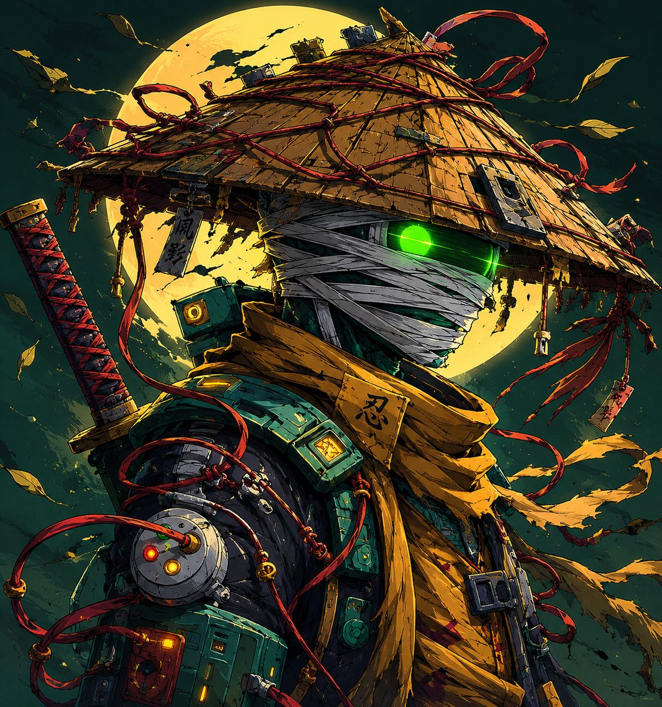</a>

```text
Ultra-realistic luxury fashion editorial photograph of a {argument name="subject" default="stylish East Asian woman"} standing on an elegant {argument name="location" default="Parisian-style city sidewalk outside a luxury hotel"}, full body shot, soft golden hour sunlight casting natural tree shadows across the pavement and beige stone walls, calm premium aesthetic, cinematic depth of field, long wavy dark brown hair, black rectangular sunglasses, minimal makeup, delicate gold jewelry, confident relaxed pose with one hand in pocket.

Outfit: {argument name="outfit details" default="oversized white button-up shirt worn open over a fitted white ribbed tank top, high-waisted ultra wide-leg light wash denim jeans with extra long hem covering pointed black heels, slim black belt, black H&M crossbody mini bag with gold chain strap and subtle gold logo"}, luxury casual street style.

Environment: elegant European street, luxury hotel entrance, beige textured architecture, black awnings, trees lining the sidewalk, soft afternoon lighting, realistic shadows, premium fashion magazine vibe, clean composition, natural colors, photorealistic skin texture, shallow depth of field, high detail, 85mm lens, editorial fashion photography, Vogue aesthetic, balanced tones, luxury lifestyle mood.
```

## by [TWnese](<https://x.com/TWnese>) on May 24, 2026 👉 [Try Now](https://indream.ai/generate?mode=IMAGE&modelKey=gpt-image-v2&modelPromptId=019e5fdc-cc72-71a0-be3b-e4b581f648fb)

<a href="./public/images/fbfa08d7-580e-4a03-9b9e-7cc075c4479f.png" target="_blank" rel="noopener noreferrer">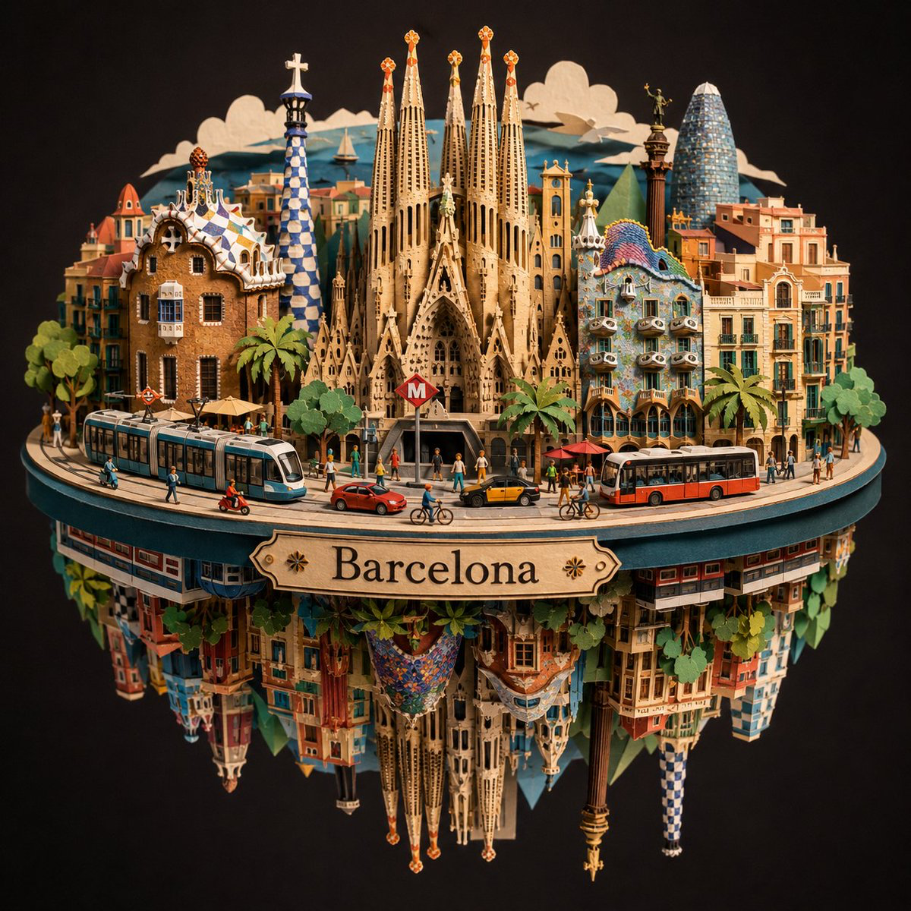</a>

```text
Create an ultra-detailed spherical paper-cut diorama model of {argument name="city name" default="Barcelona"}, like a handcrafted layered cardstock sculpture photographed in a studio against a dark charcoal-black background. The city is built as two mirrored half-spheres separated by a thin horizontal circular platform, with a small ornate wooden nameplate between the hemispheres reading {argument name="city nameplate text" default="Barcelona"}; the sign should be subtle but clearly legible, centered on the front rim, with small decorative star/flower icons on both sides of the word. On the top half, show a dense miniature Barcelona skyline arranged in a circular panorama: exactly 7 prominent landmark structures are visible, including Sagrada Familia in the center with tall beige spires, Park Güell gingerbread-style gatehouse on the left, a blue-and-white tiled Park Güell tower, Casa Batlló with colorful mosaic roof on the right, a tall modern glass bullet-shaped tower resembling Torre Glòries at far right, a classical church bell tower, and warm Mediterranean apartment blocks with balconies. Add exactly 2 large public transit vehicles on the platform, one blue-and-white tram on the left and one red-and-white city bus on the right. Add exactly 5 small road vehicles: a red scooter, a red car, a yellow-and-black taxi, and 2 bicycles. Add many tiny paper people walking along the street, plus palm trees, green leafy trees, café umbrellas, streetlights, and a red metro entrance marked with a white “M” in front of Sagrada Familia. The lower hemisphere should be an inverted reflection/fantasy underside of the same city, with dangling upside-down buildings, greenery, tiled facades, and mirrored landmark fragments, creating a floating globe effect. Use {argument name="material style" default="layered paper sculpture, laser-cut cardstock, folded paper edges"}, warm golden lighting, crisp shadows, shallow depth of field, intricate cutout textures, realistic miniature scale, symmetrical composition, highly detailed architectural ornament, no watermark, no extra text beyond the nameplate and metro M.
```

## by [こやくちゃん](<https://x.com/589ajiema>) on May 24, 2026 👉 [Try Now](https://indream.ai/generate?mode=IMAGE&modelKey=gpt-image-v2&modelPromptId=019e5fe0-08df-764b-87d9-6b22165dbe66)

<a href="./public/images/fb584e08-3008-4e6a-beb1-24a92dd25900.png" target="_blank" rel="noopener noreferrer">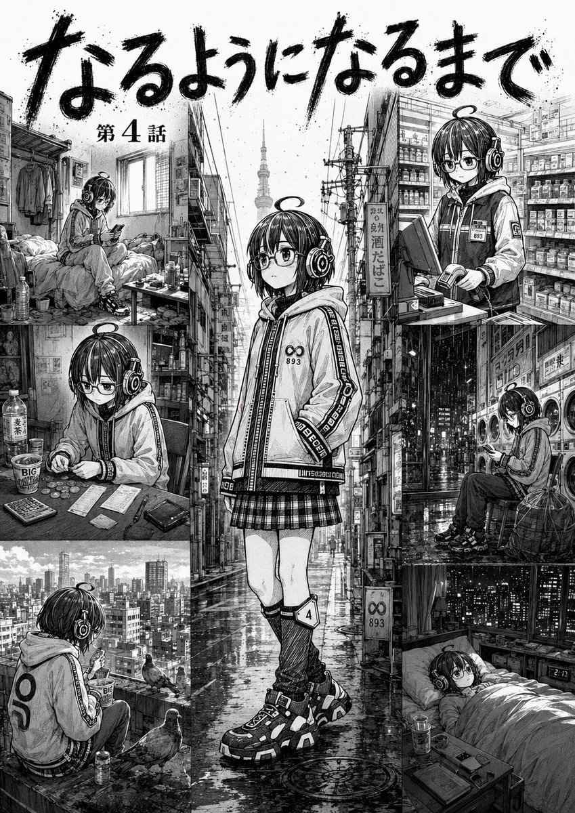</a>

```text
Goal: Create a monochrome manga magazine cover / chapter splash page for {argument name="series title" default="なるようになるまで"}, with the episode label {argument name="episode label" default="第4話"}. The page should feel like a quiet, dialogue-free slice-of-life urban story, highly detailed and atmospheric.

Canvas: Vertical manga page, approximately 2:3 aspect ratio, black-and-white ink drawing with grayscale screentone, dense crosshatching, rain reflections, high detail, no color.

Layout: A collage composition with exactly 7 visible story scenes. The largest central scene shows the main character standing full-body in a narrow rainy Tokyo alley, surrounded by tall buildings, utility poles, shop signs, wet pavement, a manhole cover, and a distant broadcast tower. Around it, arrange 6 smaller rectangular vignette panels: 1 upper-left cramped bedroom scene, 1 upper-right convenience-store cashier scene, 1 middle-left tabletop budgeting scene, 1 middle-right laundromat waiting scene, 1 lower-left rooftop city-view scene with pigeons, and 1 lower-right nighttime bedroom scene.

Subject details: The same teenage manga girl appears in all 7 scenes. She has short dark bobbed hair with a small ahoge curl, large over-ear headphones, a loose oversized hoodie jacket with sporty sleeve tape, a pleated skirt in the central full-body scene, chunky futuristic sneakers, and a tired introverted posture. Her face should be intentionally obscured with a soft rectangular gray blur in the largest central figure and the closer vignette figures, creating an anonymous censored look while preserving the hair and headphones silhouette. Use {argument name="jacket marking" default="893"} as a small printed number or patch on the jacket in several scenes.

Exact scene count and contents: Scene 1, central full-body alley portrait: the girl stands hands in pockets, wet street reflections, dense Japanese urban signage, overhead wires, and a distant tower. Scene 2, upper-left bedroom: she sits on a messy bed looking at a phone, surrounded by clothes, bottles, posters, small table clutter, and a window. Scene 3, upper-right convenience store: she works at a register with shelves of canned goods and products behind her, wearing the same headphones and jacket. Scene 4, middle-left tabletop: she sits at a table with a cup-noodle container, bottled tea, coins, calculator, receipts, a wallet, and papers, suggesting budgeting or counting change. Scene 5, middle-right laundromat: she sits alone beside round washing machines, head down, with a large bag nearby. Scene 6, lower-left rooftop: she sits with a cup noodle and chopsticks overlooking a dense city skyline, with exactly 3 pigeons visible nearby and a drink bottle on the ground. Scene 7, lower-right bedroom at night: she lies awake in bed under blankets, city lights visible through the window, a digital clock on the wall or shelf, cup, phone, remote, small devices, and clutter on a bedside table.

Typography: Put the large brush-calligraphy title across the very top, bold black ink strokes with splatter and rough dry-brush texture. Place the smaller episode label below the left side of the title. Keep the typography integrated like a manga chapter opener.

Visual style: Detailed seinen manga line art, gritty urban realism, rainy Tokyo backstreets, cinematic composition, layered panels, ink splatter, screentone shading, high contrast, melancholy mood, no speech bubbles, no dialogue, no color, no watermark. Use {argument name="overall mood" default="quiet melancholy after rain"} as the emotional tone.
```

## by [Kollab_AI](<https://x.com/Kollab_Japan>) on May 23, 2026 👉 [Try Now](https://indream.ai/generate?mode=IMAGE&modelKey=gpt-image-v2&modelPromptId=019e5ff2-3c92-701b-96c1-4c93822be61c)

<a href="./public/images/ac2134f2-b64c-432b-b2e8-a372c505a992.png" target="_blank" rel="noopener noreferrer">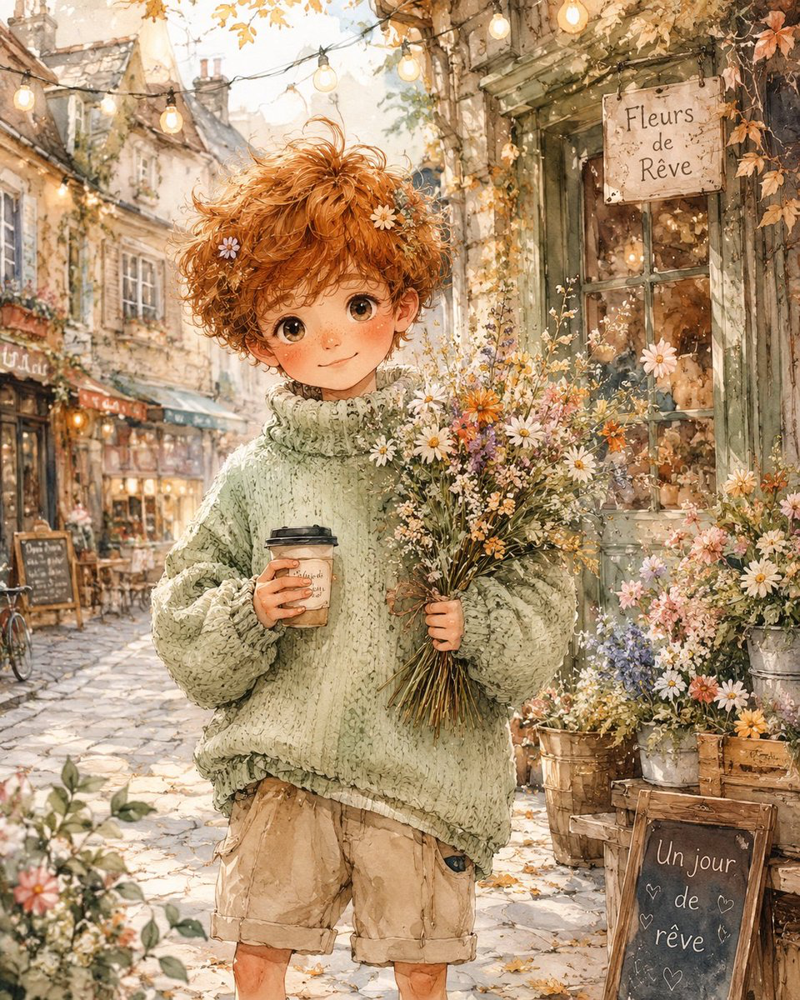</a>

```text
幻想的な水彩画風イラスト。{argument name="キャラクター" default="かわいいくせ毛の男の子"}が、{argument name="場所" default="ヨーロッパの温かみある街角"}に立っている。オーバーサイズの{argument name="衣装" default="パステルグリーンのニットセーター"}、ゆったりしたベージュのショートパンツ、手にはコーヒーカップと野花のブーケ。少し無造作なジンジャーカラーのヘアスタイルに小さな花が飾られている。頭上にはフェアリーライトが優しく輝き、柔らかなシネマティックボケ。夢のような秋の空気感。背景には花屋の細かなディテール。大きく愛らしい瞳とほんのり赤い頬。手描きスケッチ風の線、水彩のにじみ。暖かく自然なライティング。超高精細な絵本アートスタイル。柔らかなパステルカラー。魅力的で魔法のような雰囲気。
```

## by [のとろ](<https://x.com/notoro_ai>) on May 23, 2026 👉 [Try Now](https://indream.ai/generate?mode=IMAGE&modelKey=gpt-image-v2&modelPromptId=019e5ff7-b5a5-7733-a432-5cfc40961841)

<a href="./public/images/6fb78093-7fe1-4068-b4df-7bb84705945b.png" target="_blank" rel="noopener noreferrer">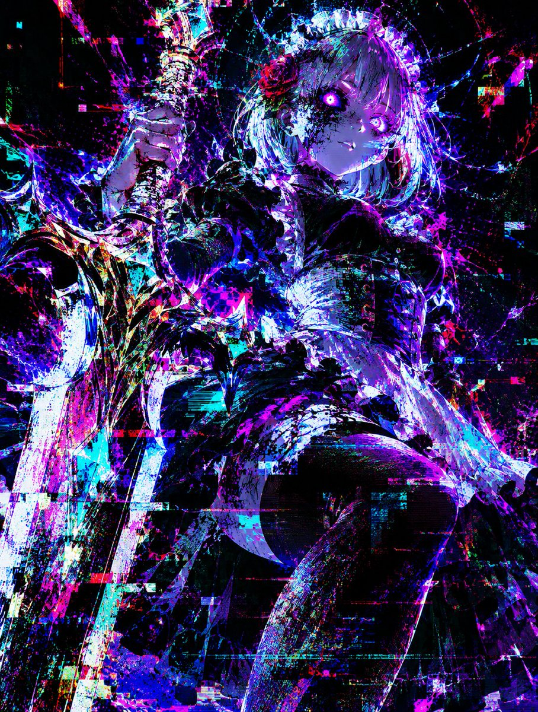</a>

```text
このイラストを、{argument name="スタイル" default="Glitch Lord"}スタイルで変換してください。極めて激しく美しいグリッチを全身に浴びせ、RGB完全崩壊、データ破損、強烈な色反転とノイズを最大出力で表現。壊れながらも威圧的で神々しい、圧倒的にカッコイイグリッチエンティティに仕上げてください。
```

## by [ぽちいな](<https://x.com/pochiina>) on May 23, 2026 👉 [Try Now](https://indream.ai/generate?mode=IMAGE&modelKey=gpt-image-v2&modelPromptId=019e5ffa-4276-75df-a08b-0b713a315334)

<a href="./public/images/20d09402-3f13-4ac3-a73c-75c43723fd7a.png" target="_blank" rel="noopener noreferrer">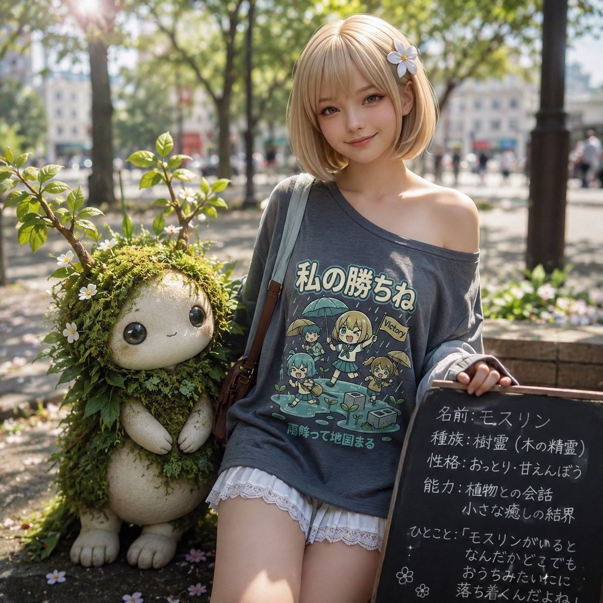</a>

```text
Goal: Create a sunlit photorealistic fantasy portrait in a European city park, showing a fashionable young woman sitting beside a small plant familiar. The mood is cute, magical, gentle, and “summoned companion” themed.

Canvas: Square 1:1 composition, realistic DSLR-style photography, shallow depth of field, warm morning sunlight, lens flare in the upper left, soft bokeh trees and city buildings in the background.

Main subjects: Include exactly 2 foreground subjects: 1 young woman and 1 small moss-and-plant familiar. The woman has a short blonde bob haircut with a small white flower hair clip on the right side, fair skin, and a relaxed seated pose. Her face is intentionally hidden by a plain opaque brown square censor block. She wears an oversized charcoal-gray off-shoulder T-shirt, white lace-trim shorts, and a brown leather shoulder bag strap crossing her torso. One shoulder is exposed. Her right hand rests near a small black chalkboard sign.

Familiar details: The familiar sits on the left side of the woman, about knee height, shaped like a squat plush creature with rounded pale stone-like legs, feet, and arms, but its body and head are covered in green moss, leaves, vines, and small white daisy-like flowers. Its face is also intentionally hidden by a smaller plain opaque beige-brown square censor block. It should look like a gentle tree spirit or plant sprite sitting beside her.

T-shirt graphic: On the woman’s shirt, print a cute anime-style rainy-day illustration with exactly 4 chibi characters: 1 central blonde girl holding an umbrella, 1 blue-haired girl on the left holding an umbrella, 1 teal-haired character at lower left, and 1 small brown-haired character on the right holding an umbrella. Add little puddles, raindrops, a watering can, and a small “Victory” flag. Use the Japanese headline {argument name="shirt headline text" default="私の勝ちね"} and the smaller Japanese subtitle {argument name="shirt subtitle text" default="雨降って地固まる"}. Make the shirt graphic readable but naturally printed on fabric.

Chalkboard sign: Place a black rectangular chalkboard leaning on the right side of the image, written in white handwritten Japanese chalk. Use the title-card content {argument name="chalkboard text" default="名前: モスリン\n種族: 樹霊（木の精霊）\n性格: おっとり・甘えんぼう\n能力: 植物との会話\n小さな癒しの結界\nひとこと:「モスリンがいると\nなんだかどこでも\nおうちみたいだにゃ」"}. Add exactly 2 small chalk flower doodles near the lower left of the board.

Environment: The setting is a leafy urban park with a stone bench or planter edge, dappled sunlight on the ground, green shrubs, scattered small petals, tree trunks, and blurred pedestrians/buildings in the distance. Use realistic natural lighting, bright highlights, and soft shadows.

Style constraints: Photorealistic image with a whimsical fantasy companion, high detail, warm color grading, creamy bokeh, no extra people in the foreground, no watermark, no logo, no extra text beyond the T-shirt and chalkboard. Keep the censor blocks flat, opaque, and untextured.
```

## by [蜡笔进化论](<https://x.com/crayon1267>) on May 23, 2026 👉 [Try Now](https://indream.ai/generate?mode=IMAGE&modelKey=gpt-image-v2&modelPromptId=019e5ffb-c278-7658-a2c3-7e36a6d95e8f)

<a href="./public/images/4b6356b4-3a96-4663-8023-b2dd1fcb7897.png" target="_blank" rel="noopener noreferrer">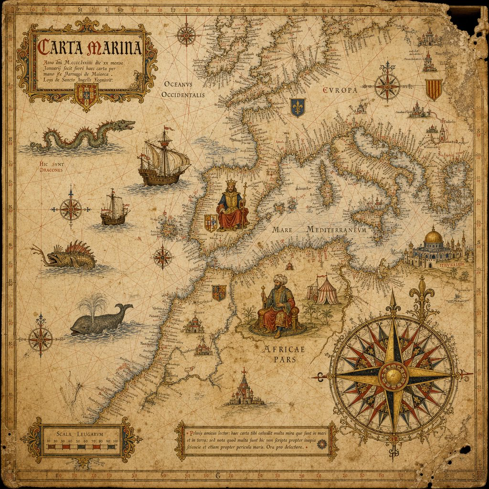</a>

```text
Antique portolan chart of {argument name="地区" default="[REGION]"}, 15th-century style. Aged vellum, red/black/gold rhumb line network, hand-lettered Latin coast names, sea monsters, caravel ships, compass rose cartouche, gothic title scroll. 1:1.
```

## by [Busy](<https://x.com/busyddd>) on May 21, 2026 👉 [Try Now](https://indream.ai/generate?mode=IMAGE&modelKey=gpt-image-v2&modelPromptId=019e6000-174a-7409-b1a1-55b4069c195d)

<a href="./public/images/57a2263e-0afc-40de-a3d5-0e9a95794413.png" target="_blank" rel="noopener noreferrer">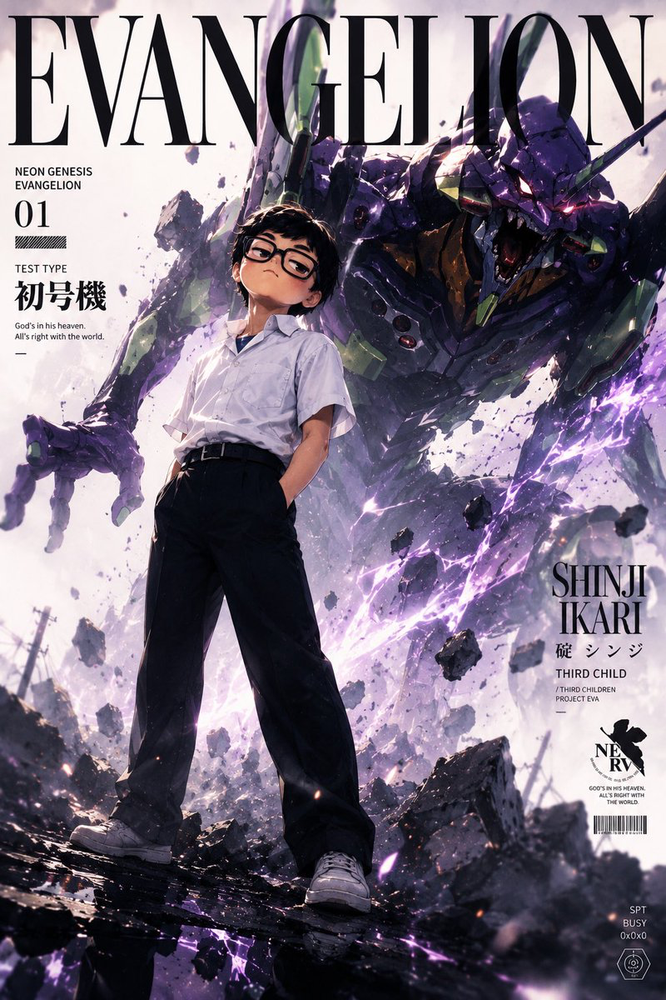</a>

```text
Goal: Create a dramatic vertical anime magazine-cover poster inspired by Neon Genesis Evangelion, combining a realistic full-body teenage boy in the foreground with a colossal biomechanical mecha bursting through destruction behind him.

Canvas: Vertical 2:3 poster, high-resolution, cinematic composition, pale off-white sky background with black typography and purple energy effects. The top is dominated by an oversized luxury-fashion serif masthead reading {argument name="main title" default="EVANGELION"}, spanning nearly the full width and partially overlapping the mecha.

Layout: Foreground subject stands slightly left of center, low-angle camera view, full body visible from shoes to head. Behind him, one giant purple-and-green Evangelion Unit-01 mecha lunges forward from the upper right, head and shoulders huge, one clawed hand reaching in from the left, glowing magenta eyes and mouth details. The bottom third shows cracked black rubble, reflective wet ground, sparks, dust, and purple lightning streaks cutting diagonally upward. Use strong depth of field: sharp subject and mecha, smoky background debris fading into haze.

Subject details: A slim teenage boy, about 14 years old, confident but neutral pose, one hand in trouser pocket and the other relaxed at his side, looking forward. His face should be intentionally anonymized with a soft rectangular blur/mosaic over the facial features while keeping hair and body visible. Outfit has exactly 6 visible pieces: short-sleeve white school shirt, dark blue undershirt visible at the collar, black belt, loose high-waisted black trousers, white low-top sneakers, and short dark brown hair. Lighting on the boy is realistic, with cool rim light from purple energy and soft shadow under the chin.

Mecha and action details: One massive EVA Unit-01, angular armor plates, black and deep purple body with neon green accents, long horn, red glowing eyes, open mechanical jaw, aggressive crouching motion. Surround it with exactly 12 large floating rubble chunks at different depths plus many tiny dust specks and sparks. Add jagged violet lightning bolts, shattered concrete, smoke plumes, and a chaotic battle-damaged city ground plane.

Text content: Include exactly 11 distinct printed design elements on the poster: 1) the huge top masthead {argument name="main title" default="EVANGELION"}; 2) small left label "NEON GENESIS EVANGELION"; 3) large left issue number {argument name="issue number" default="01"}; 4) a small black hatched rectangle under the issue number; 5) left label "TEST TYPE"; 6) large Japanese unit label {argument name="Japanese unit label" default="初号機"}; 7) small quote "God's in his heaven. All's right with the world."; 8) right-side character name {argument name="character name" default="SHINJI IKARI"}; 9) Japanese name text "碇 シンジ"; 10) small labels "THIRD CHILD", "THIRD CHILDREN", and "PROJECT EVA" grouped under the name; 11) a small NERV-style emblem with tiny motto text and barcode near the lower right. Add tiny technical microtext in the bottom-right corner reading "SPT", "BUSY", and "0x0x0".

Visual style: Premium anime key art mixed with editorial fashion magazine cover, ultra-detailed digital painting, sharp contrast, gritty rubble, glossy armor, violet and magenta energy, black elegant serif typography similar to high-fashion magazine type. Keep the composition poster-like, dramatic, polished, and print-ready.

Constraints: No extra characters, no additional mecha, no speech bubbles, no watermark, no modern UI frame. Keep all typography black or very dark, readable, and integrated into the poster design.
```

## by [Zephyra Leigh](<https://x.com/ZephyraLeigh>) on May 21, 2026 👉 [Try Now](https://indream.ai/generate?mode=IMAGE&modelKey=gpt-image-v2&modelPromptId=019e6000-7a7b-73c8-b000-cd0935e40db9)

<a href="./public/images/16690247-1cb0-44e1-91f6-f0220390cc81.png" target="_blank" rel="noopener noreferrer">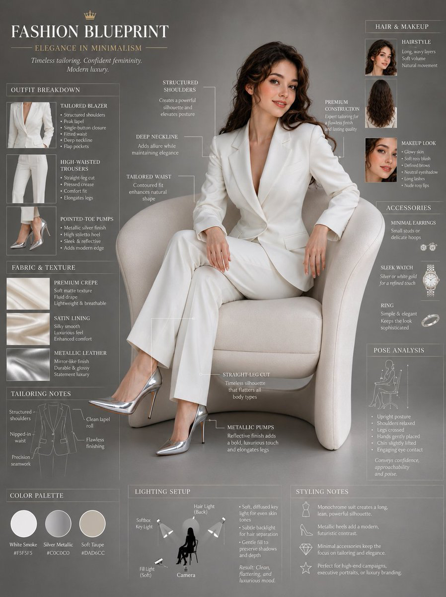</a>

```text
Fashion blueprint sheet of {argument name="model description" default="an elegant young woman seated in a modern cream lounge chair"}, full-body editorial view with detailed outfit annotations and luxury styling callout labels. Long wavy brunette hair, soft natural glam makeup, confident relaxed smile, {argument name="clothing" default="tailored white blazer with deep neckline and structured shoulders, matching high-waisted straight-leg trousers"}, silver metallic pointed high heels, graceful crossed-leg sitting pose, minimalist luxury fashion aesthetic. Surrounding the model are fashion infographic elements, tailoring notes, fabric texture descriptions, pose analysis, hairstyle breakdowns, luxury styling callouts, cinematic soft studio lighting, {argument name="background" default="clean gray background"}, high-end womenswear editorial aesthetic, ultra detailed, professional fashion concept sheet, 8k, 1744x2336
```

## by [SaaS Junction ✦ Daily AI News & Prompts](<https://x.com/SaasJunctionHQ>) on May 21, 2026 👉 [Try Now](https://indream.ai/generate?mode=IMAGE&modelKey=gpt-image-v2&modelPromptId=019e6000-ae77-74e4-9290-2b1f78fc700c)

<a href="./public/images/25e2b43c-ecd3-45e5-aebb-a60dd4155f82.png" target="_blank" rel="noopener noreferrer">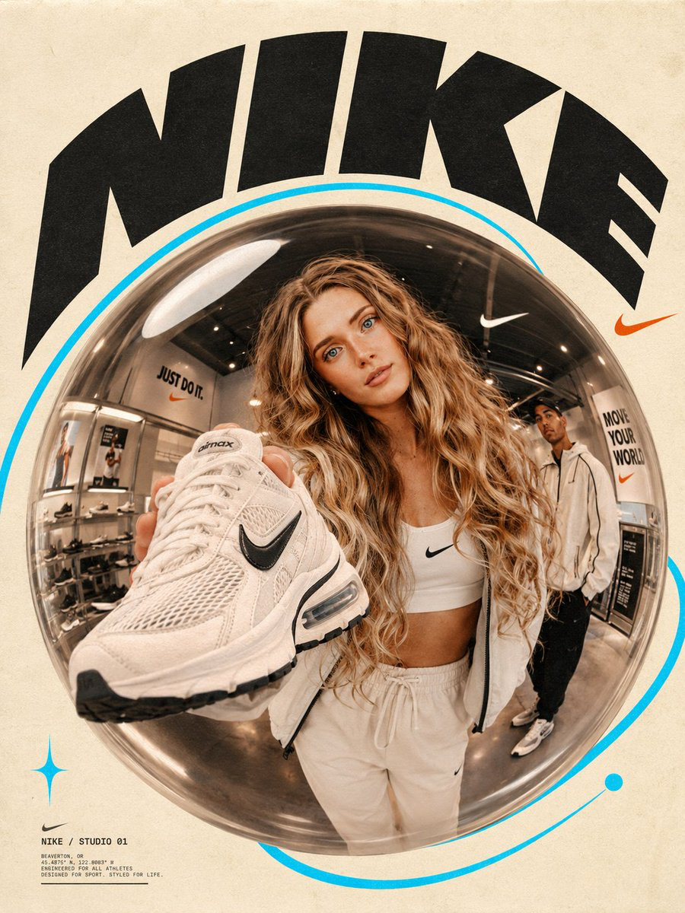</a>

```text
Place the uploaded subject naturally at the center of the frame inside a dramatic {argument name="lens effect" default="glass fisheye bubble"}, shot from a low-angle close perspective that warps and curves the surroundings into a bold, immersive composition. The scene should feel like a branded universe built entirely around {argument name="brand name" default="[BRAND NAME]"} — a sleek workspace, a vibrant retail environment, a creative studio, or an experiential pop-up — chosen to reflect the spirit and identity of [BRAND NAME]. One to two young, confident individuals are captured mid-action, extending or presenting a brand-relevant object directly toward the fisheye lens, creating an intimate and dynamic point of contact between subject and viewer. The environment, props, and every visual element in the scene must respond entirely to [BRAND NAME]. Typography dominates the composition with a sweeping, oversized [BRAND NAME] word or phrase arching in a bold curve around the outer edge of the frame. The background maintains a warm {argument name="background style" default="cream paper tone"} throughout, giving the image a tactile, print-inspired quality. A vivid {argument name="accent color" default="cyan orbital ring"} or track traces around or behind the central bubble.
```

## by [Noira.](<https://x.com/veylorvisions>) on May 21, 2026 👉 [Try Now](https://indream.ai/generate?mode=IMAGE&modelKey=gpt-image-v2&modelPromptId=019e6006-aa7b-7070-9091-0e178c99a10c)

<a href="./public/images/bf97e3dc-ab5e-4d43-8867-b632f46d3c11.png" target="_blank" rel="noopener noreferrer">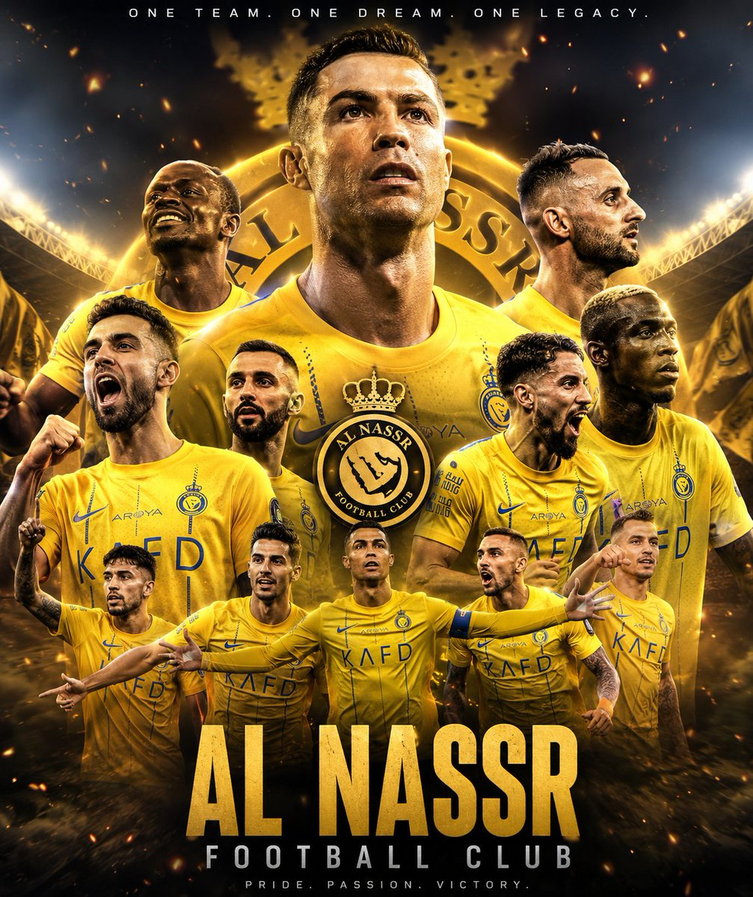</a>

```text
Luxury {argument name="club" default="Al Nassr"} football collage, {argument name="player" default="Cristiano Ronaldo"} center pose, {argument name="style" default="black and gold"} aesthetic, cinematic stadium lights, teammates in action, smoke and sparks, premium sports campaign, hyper realistic 8k.
```

## by [とらの@VRC](<https://x.com/TlanoVRC>) on May 21, 2026 👉 [Try Now](https://indream.ai/generate?mode=IMAGE&modelKey=gpt-image-v2&modelPromptId=019e6008-4022-7368-97f4-4eae1836ca99)

<a href="./public/images/74c0dfc7-809d-41c7-82fe-95ddccdd13f7.png" target="_blank" rel="noopener noreferrer">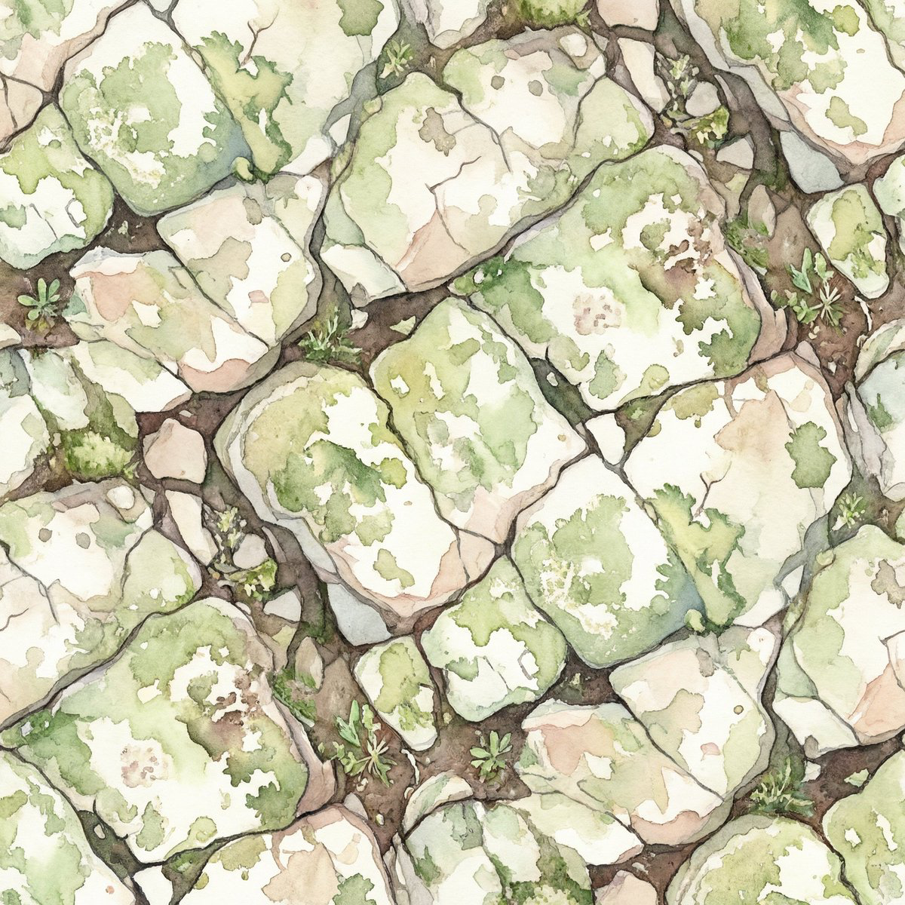</a>

```text
Create a seamless repeating tile pattern of an old stone garden path seen from directly above. The composition is filled edge to edge with irregular polygonal paving stones separated by dark soil-filled cracks, designed so all edges match perfectly for tiling. Use a delicate watercolor and ink illustration style on warm off-white paper: soft translucent washes, hand-drawn graphite/sepia outlines, subtle granulation, uneven pigment blooms, and natural texture. The stones are pale cream, light gray, beige, and muted blush with mossy green stains and lichen patches; the cracks contain rich brown earth with tiny tufts of grass, small weeds, and miniature leafy sprouts. Keep the pattern moderately dense with varied stone sizes and orientations, organic randomness, no obvious central focal point, no shadows from objects, no text, no border, no watermark. Color palette: sage green moss, olive lichen, warm ivory stone, dusty beige, muted gray, earthy brown.
```

## by [Zephyra Leigh](<https://x.com/ZephyraLeigh>) on May 21, 2026 👉 [Try Now](https://indream.ai/generate?mode=IMAGE&modelKey=gpt-image-v2&modelPromptId=019e6009-7e68-7496-94a7-4e7fa7d7cae0)

<a href="./public/images/29947ba8-e867-40eb-8761-462e51a8bc04.png" target="_blank" rel="noopener noreferrer">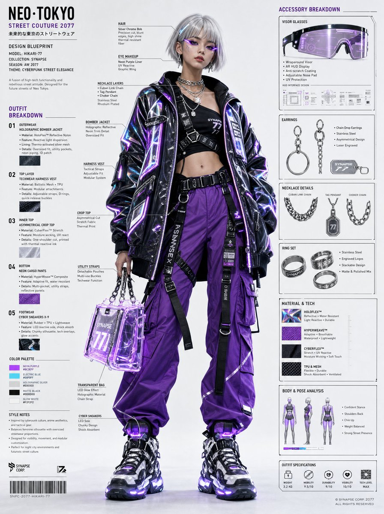</a>

```text
Ultra-detailed fashion blueprint sheet of a futuristic cyberpunk streetwear girl, full-body front view on clean studio background, detailed outfit callouts and labeled annotations pointing toward every clothing piece and accessory. Short silver bob haircut, glowing neon eyeliner, confident facial expression, oversized black holographic bomber jacket with reflective trims, layered silver chains, neon purple cargo pants with utility straps, techwear harness belts, glowing transparent handbag, chunky cyber sneakers.

Surrounding the model are fashion infographic elements, arrows, typography labels, fabric descriptions, accessory breakdowns, material callouts, styling notes, body pose analysis, outfit specifications, close-up sketches of visor glasses and jewelry, futuristic Tokyo streetwear aesthetic, fashion technical sheet style, minimalist editorial layout, cinematic studio lighting, ultra detailed, professional fashion concept presentation, 8k, 1744x2336
```

## by [Synthia](<https://x.com/AIwithSynthia>) on May 21, 2026 👉 [Try Now](https://indream.ai/generate?mode=IMAGE&modelKey=gpt-image-v2&modelPromptId=019e600a-df4e-71ec-ad57-1eb4779aeef4)

<a href="./public/images/33a1b232-52cd-47bf-81fe-7b4727ab0bf9.png" target="_blank" rel="noopener noreferrer">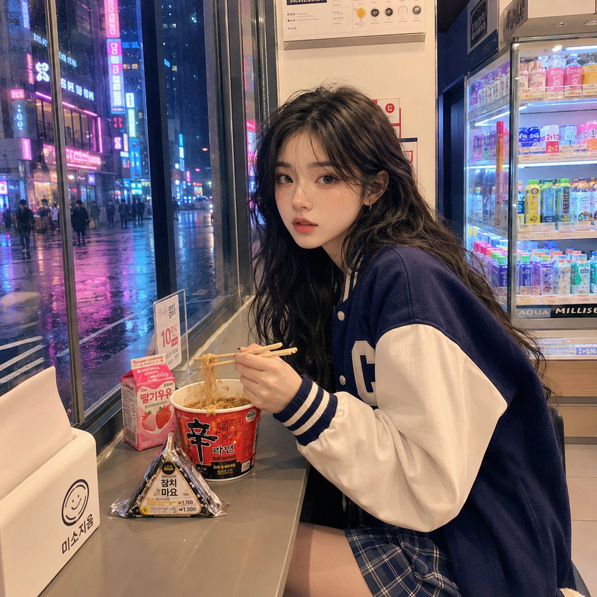</a>

```text
Realistic one:
Ultra realistic {argument name="subject" default="Korean girl"} sitting inside a {argument name="location" default="late-night Seoul convenience store"} eating instant ramen at the counter, {argument name="outfit" default="oversized varsity jacket and plaid skirt outfit"}, realistic skin texture, cinematic fluorescent lighting mixed with rainy neon reflections, authentic Korean snack shelves and drink refrigerators in background, cozy urban atmosphere, candid lifestyle photography, soft depth of field, realistic ramen steam and chopsticks, natural makeup look, Instagram aesthetic, moody blue and pink neon tones, highly detailed convenience store interior, 50mm cinematic photography style

Illustration:
{argument name="style" default="Korean lifestyle magazine journaling illustration"}, stylish Korean girl with long wavy hair wearing an oversized varsity jacket and plaid skirt, sitting inside a cozy Seoul convenience store late at night eating instant ramen and triangle kimbap, watercolor and ink sketch aesthetic, hand-drawn Korean annotations, doodles, arrows, scrapbook-style layout, glowing convenience store refrigerator lights, soft pastel pink and blue tones, rainy Seoul streets visible through glass windows, cute stationery elements, aesthetic snack packaging, cozy urban night atmosphere, soft anime-inspired features, Pinterest-style Korean editorial page, cinematic cozy lighting, highly detailed journal composition
```

## by [тoяoтoʀᴀ](<https://x.com/torotora_SL>) on May 20, 2026 👉 [Try Now](https://indream.ai/generate?mode=IMAGE&modelKey=gpt-image-v2&modelPromptId=019e6017-3154-7760-8ef0-4fbb8e396cb4)

<a href="./public/images/35621f38-2d0e-4043-af34-ded328dde4e4.png" target="_blank" rel="noopener noreferrer">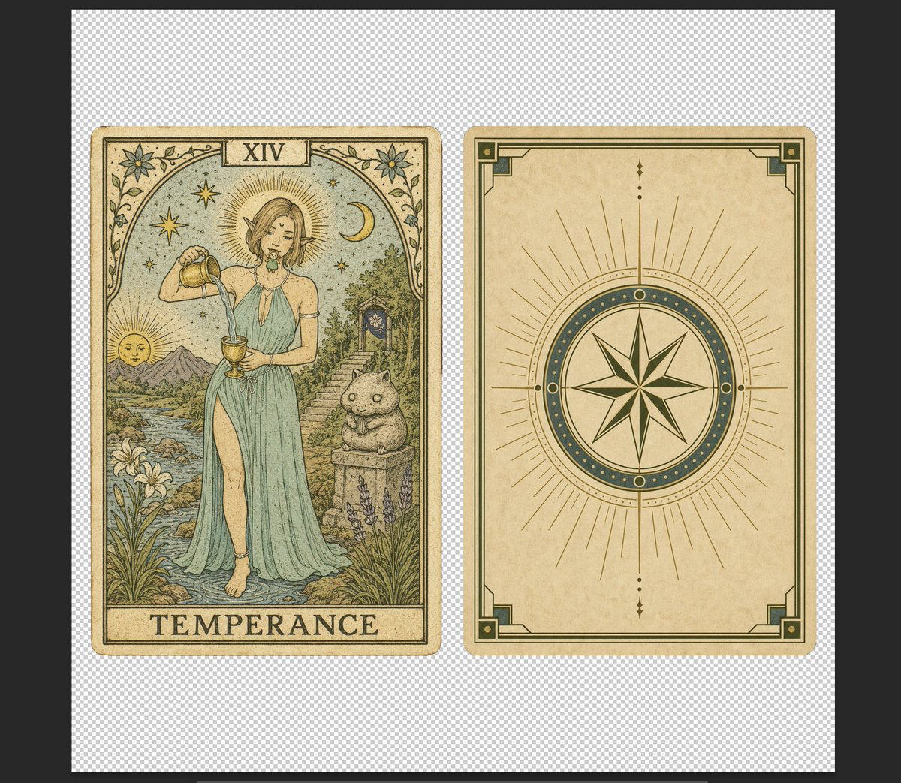</a>

```text
Goal: Create a vintage tarot card design sheet showing exactly 2 cards side by side: the front of a tarot card on the left and the matching card back on the right.

Canvas: Landscape composition on a transparent-background checkerboard preview, with both cards vertically oriented, evenly spaced, and centered. Use aged cream paper, muted ink, weathered edges, and a hand-illustrated antique tarot aesthetic.

Left card, front design: A classic tarot card titled {argument name="card title" default="TEMPERANCE"} with the Roman numeral {argument name="roman numeral" default="XIV"} in a small top plaque. The card has an ornate botanical border with vines, small flowers, stars, and corner linework. In the center stands a serene feminine figure in a flowing {argument name="dress color" default="pale teal"} Greco-Roman style dress with a thigh slit, barefoot in shallow water, pouring liquid from one golden cup into another. The face is softly indistinct and painterly rather than detailed. Behind her are a radiant halo, scattered stars, a crescent moon, distant mountains, a river, flowers, grasses, and a small cute stone-cat statue on a pedestal at the right side. The lower title band contains large serif text reading TEMPERANCE.

Right card, back design: A matching ornate tarot card back with no title text. Use the same aged parchment tone and thin dark green-gold border. The center contains one large circular compass-star emblem: an 8-point star inside concentric circles, with a dark teal ring decorated with small gold dots. Around it, add a symmetrical sunburst of many fine rays extending outward. Include small vertical ornamental dots and diamond marks above and below the circle, plus geometric corner brackets and small square corner ornaments.

Visual style: Antique occult illustration, Art Nouveau-inspired tarot engraving, muted teal, sage green, ochre gold, cream parchment, fine ink hatching, slightly faded print texture, subtle stains, realistic paper grain, handmade line art.

Constraints: Show exactly 2 cards: 1 front card and 1 back card. Keep both cards the same size and orientation. Preserve the readable text {argument name="bottom title text" default="TEMPERANCE"} and XIV. Do not add extra cards, hands, mockup shadows, modern UI, or watermarks.
```

## by [GPTProto Official](<https://x.com/gptproto>) on May 20, 2026 👉 [Try Now](https://indream.ai/generate?mode=IMAGE&modelKey=gpt-image-v2&modelPromptId=019e6019-1f7c-7132-b67c-74036ff8d4d0)

<a href="./public/images/cd894439-4a4b-45e8-a36d-ec1b256dd66b.png" target="_blank" rel="noopener noreferrer">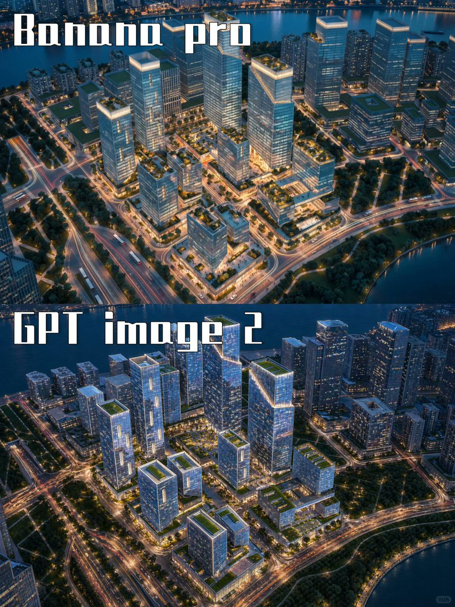</a>

```text
Goal: Create a vertical side-by-side comparison poster showing two AI-generated aerial city renderings, one above the other, for a visual model comparison between {argument name="top model label" default="Banana pro"} and {argument name="bottom model label" default="GPT image 2"}.

Canvas: Portrait 3:4 image, approximately 768×1024 px. Split the canvas into exactly 2 equal horizontal panels with no border or margin between them.

Layout: The top panel fills the upper half and the bottom panel fills the lower half. Each panel shows a similar futuristic waterfront business district at blue-hour dusk from a high oblique aerial view. Place exactly 2 large text labels: the top label in the upper-left corner reading “Banana pro”, and the bottom label in the upper-left area of the lower panel reading “GPT image 2”. Use a tall, blocky, condensed white display font with a dark shadow or outline, similar to retro stencil/gaming typography.

Top panel scene: A polished architectural visualization of a modern urban development beside a river or bay. Include approximately 12 prominent glass office towers and mid-rise blocks arranged on a gridded campus, with glowing rooftop edges, landscaped green roofs, tree-lined roads, and warm street lighting. Show water along the top edge and lower-right edge, with distant city buildings beyond the water. Roads have orange and white light trails, creating a lively night-city effect.

Bottom panel scene: A second version of the same waterfront district, slightly darker and more dramatic, with approximately 14 prominent glass towers and mid-rise buildings. Use cooler blue glass reflections, brighter illuminated windows, stronger road-light trails, green rooftop gardens, and a river or bay curving along the top and lower-right edges. Make the composition visibly similar to the top panel but not identical, so it feels like two different AI model outputs from the same prompt.

Visual style: Hyper-detailed aerial architectural rendering, realistic but slightly idealized, cinematic dusk lighting, blue and teal shadows, warm golden streetlights, crisp glass facades, dense urban planning, marina/waterfront atmosphere, high contrast, sharp perspective, no people visible.

Constraints: Use exactly 2 stacked comparison panels and exactly 2 visible text labels. Keep the labels large, readable, and white with dark outline/shadow. Do not add logos, UI elements, watermarks, captions, or extra text.
```

## by [Shemakookie](<https://x.com/VirgowatiShema>) on May 20, 2026 👉 [Try Now](https://indream.ai/generate?mode=IMAGE&modelKey=gpt-image-v2&modelPromptId=019e601b-3f59-74eb-92c0-b320a96c465f)

<a href="./public/images/bfafd554-38d2-4b4e-aa3f-7b1489a5c8fd.png" target="_blank" rel="noopener noreferrer">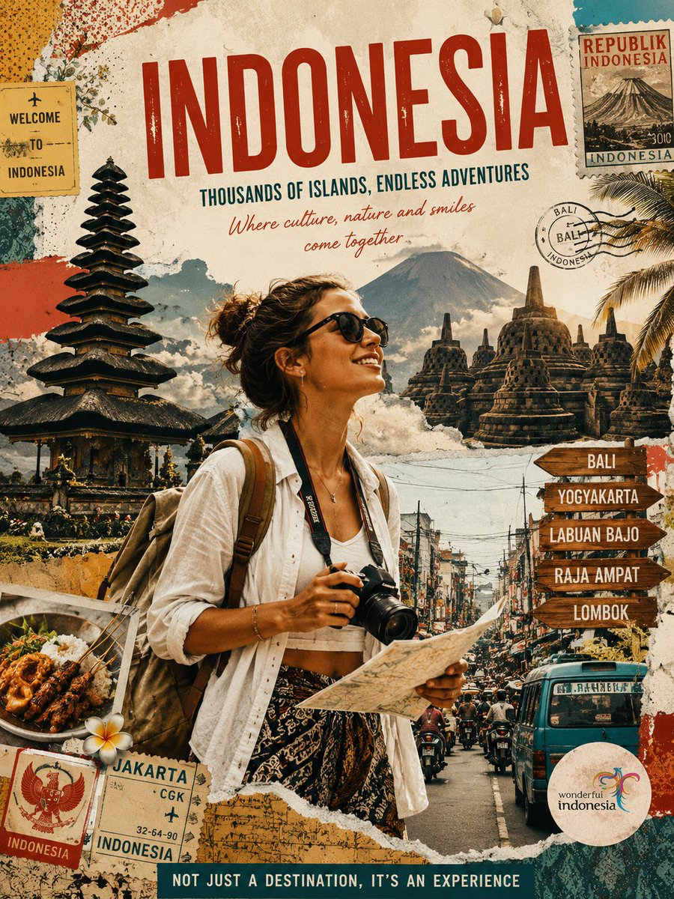</a>

```text
Goal: Create a vintage travel-poster collage advertising {argument name="destination country" default="Indonesia"}, with a scrapbook postcard aesthetic and adventurous tourism mood.

Canvas: Vertical 3:4 poster, aged cream paper background with torn edges, distressed ink, speckles, layered paper scraps, postal markings, tape, and weathered print texture. Use warm earthy colors: red, teal, ochre, tan, brown, faded black, and sun-bleached cream.

Main subject: Center foreground shows a young female traveler from the waist up, holding a DSLR camera in one hand and an unfolded paper map in the other. She wears a loose white open shirt over a white crop top, patterned batik-style skirt, backpack straps, small jewelry, and messy tied-up hair. Her face is intentionally covered by a soft rectangular blur, while the rest of her body remains sharp and photo-realistic.

Text content: At the top, use a huge distressed red headline reading “{argument name="headline text" default="INDONESIA"}”. Beneath it, add a blue uppercase tagline: “{argument name="tagline" default="THOUSANDS OF ISLANDS, ENDLESS ADVENTURES"}”. Under that, add a red handwritten script line: “{argument name="script quote" default="Where culture, nature and smiles come together"}”. At the bottom, place a dark teal strip with white uppercase text: “NOT JUST A DESTINATION, IT’S AN EXPERIENCE”.

Layout and collage elements: Include exactly 12 major visible travel elements around the traveler: 1) a Balinese multi-tier temple pagoda on the left, 2) Borobudur-style stone stupas on the right, 3) a misty volcano and clouds in the upper middle background, 4) a busy Indonesian city street with scooters and traffic in the lower middle, 5) a turquoise public bus on the lower right, 6) a palm tree frond in the upper right, 7) a plate of Indonesian satay or grilled food with rice in the lower left, 8) a white frangipani flower near the food, 9) a yellow “WELCOME TO INDONESIA” tag in the upper left, 10) an Indonesian postage stamp in the upper right reading “REPUBLIK INDONESIA” with a volcano illustration, 11) a round Bali postal cancellation stamp near the upper right, and 12) passport-ticket ephemera in the lower left reading Jakarta, CGK, Indonesia, with a Garuda emblem.

Destination signpost: On the right side, add exactly 5 wooden arrow signs stacked vertically, each pointing right, labeled: “BALI”, “YOGYAKARTA”, “LABUAN BAJO”, “RAJA AMPAT”, and “LOMBOK”.

Brand mark: Bottom right contains a round sticker logo reading “wonderful indonesia” with a colorful flowing bird-like emblem.

Style constraints: Combine photorealistic travel photography with illustrated paper collage, vintage tourism poster typography, torn-paper layering, halftone grain, scratches, stamps, and muted cinematic contrast. Keep all text legible, avoid extra destination names beyond the listed ones, and do not add watermarks or modern UI elements.
```

## by [chi Okey](<https://x.com/chiOkey>) on May 20, 2026 👉 [Try Now](https://indream.ai/generate?mode=IMAGE&modelKey=gpt-image-v2&modelPromptId=019e601d-b543-777b-9503-52041750d9c0)

<a href="./public/images/c9b3a883-011a-4110-9d4c-a71232846103.png" target="_blank" rel="noopener noreferrer">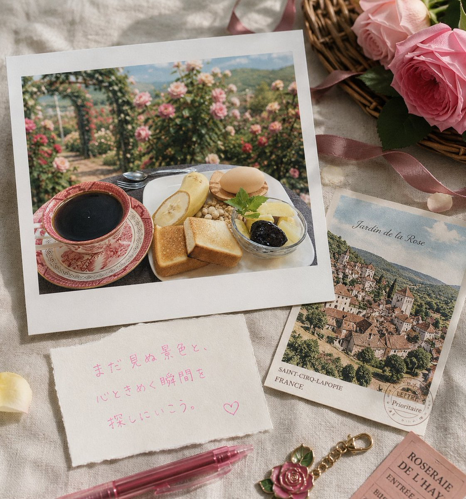</a>

```text
Create a nostalgic travel postcard-style flat lay on a soft beige linen cloth, warm morning sunlight with gentle shadows, romantic rose-garden theme. The main object is a large square instant-photo print with a thick white border, placed slightly tilted on the left; inside the photo is an outdoor breakfast table in a lush rose garden with pink rose bushes, distant green hills, and a softly blurred dreamy background. The breakfast scene contains exactly 7 visible food/table elements: a red patterned teacup filled with black coffee on a matching saucer, a white plate, two slices of toast, one peeled banana half, one round bread roll or macaron-like bun, a small pile of nuts or cereal grains, and a glass bowl with pale fruit topped with dark jam and a small green herb sprig. Around the main photo are travel keepsakes: at upper right, a wicker basket partially visible holding large pink roses and dark green leaves, tied with a dusty pink satin ribbon; at right center, a smaller vintage postcard angled under the main photo showing a European hill village and the title {argument name="postcard title" default="Jardin de la Rose"}, with printed location text “SAINT-CIRQ-LAPOPIE” and “FRANCE” plus a circular postal stamp; at lower left, a torn handmade note card with pink handwritten Japanese text {argument name="note text" default="まだ見ぬ景色と、心ときめく瞬間を探しにいこう。♡"}; at bottom, a translucent rose-pink gel pen lies diagonally; near the bottom center is a small gold keychain charm shaped like a pink rose with green leaves; at lower right, a partially cropped pink ticket reading “ROSERAIE DE L'HAY” and “ENTREE”. Add exactly 3 loose pale rose petals on the linen. Use soft pastel colors, realistic paper textures, slight film grain, shallow depth of field, delicate highlights, and a cozy handwritten postcard mood. No people, no modern electronics, no watermark. Overall composition should feel like a rose garden travel memory from {argument name="travel destination" default="France"}.
```

## by [VoxCat](<https://x.com/VoxcatAI>) on May 19, 2026 👉 [Try Now](https://indream.ai/generate?mode=IMAGE&modelKey=gpt-image-v2&modelPromptId=019e601e-83b7-71e8-84b3-e2005820b70f)

<a href="./public/images/69e5acd1-5c35-49a9-ad3a-2d25108729d4.png" target="_blank" rel="noopener noreferrer">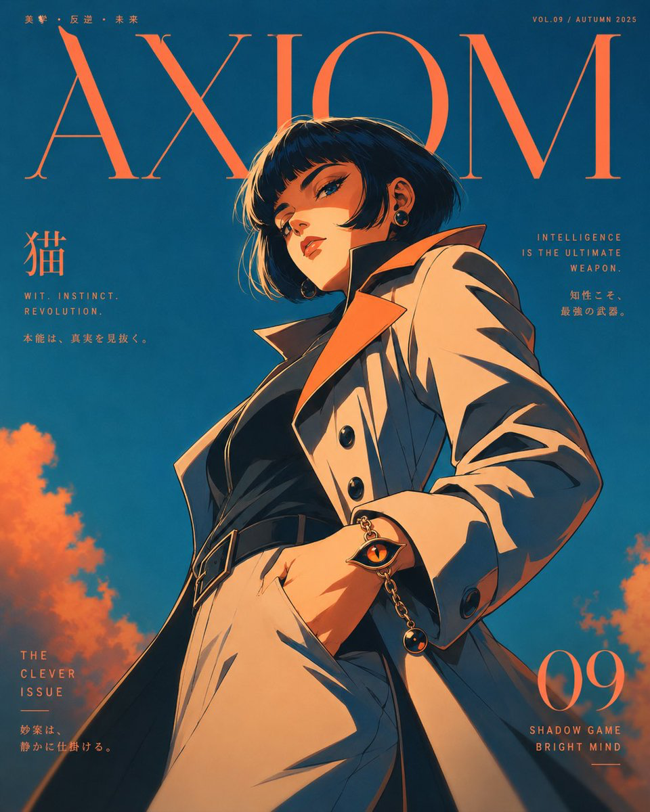</a>

```text
Goal: Create a vertical avant-garde fashion magazine cover featuring {argument name="character name" default="a mysterious cat-themed intelligence heroine"} as the central subject, blending minimalist high-fashion editorial portraiture, retro Japanese anime poster energy, and independent art-project key visual design.

Canvas: Vertical magazine cover, 4:5 aspect ratio, full bleed. Deep teal-blue sky background with warm orange clouds at the lower left and lower right edges. Use a strong teal-and-orange color grade, dramatic rim lighting, hard graphic shadows, and a vintage print-poster feel.

Main subject: One anime-style female character, shown from an extreme low-angle perspective so she feels monumental and presses outward from the page. She stands in a tense, stylish JoJo-like fashion pose with one hand in her trouser pocket, torso leaning slightly back, shoulders angled, and head tilted downward toward the viewer. Her face is intentionally obscured by a soft rectangular blur or shadow block, keeping her identity mysterious. She has short black bobbed hair with orange rim highlights, visible earrings, and a cool, intelligent, slightly dangerous aura.

Outfit and symbols: Include exactly 5 main outfit pieces: an oversized cream trench coat with dramatic lapels, a black fitted top, high-waisted cream trousers, a black belt with a rectangular buckle, and small dark earrings. Add exactly 1 signature accessory system: a cat-eye bracelet on her wrist, designed as the character’s identifying visual symbol rather than simple jewelry. The bracelet should have exactly 2 visible dangling charms: one orange cat-eye amulet charm and one small dark spherical charm, connected by a gold chain.

Cover layout: Place a huge elegant serif masthead across the top reading {argument name="magazine title" default="AXIOM"} in warm orange, partially behind the character’s head and hair. Keep the typography sparse, refined, and fashion-magazine-like, with plenty of negative space. The character should overlap the masthead, reinforcing cover logic.

Visible text content: Include exactly 8 text groups on the cover: 1) top-left tiny text: “美学・反逆・未来”; 2) top-right tiny text: “VOL.09 / AUTUMN 2025”; 3) giant masthead: “AXIOM”; 4) left mid large Japanese character: “猫”; 5) left mid small English/Japanese lines: “WIT. INSTINCT. REVOLUTION.” and “本能は、真実を見抜く。”; 6) right mid small English/Japanese lines: “INTELLIGENCE IS THE ULTIMATE WEAPON.” and “知性こそ、最強の武器。”; 7) bottom-left issue block: “THE CLEVER ISSUE” and “妙案は、静かに仕掛ける。”; 8) bottom-right large issue number and caption: {argument name="issue number" default="09"} with “SHADOW GAME” and “BRIGHT MIND”.

Visual style: Japanese old-anime-inspired character design, fashion editorial cover composition, cinematic low-angle lighting, sharp inked contours, painterly cel-shaded folds, warm orange highlights, deep teal shadows, elegant serif typography, clean luxury-magazine spacing, retro poster grain.

Constraints: Use exactly one central character, exactly one cat-eye bracelet, exactly two bracelet charms, and exactly eight visible text groups. Do not add extra cover lines, logos, barcodes, watermarks, or additional characters. Keep the image stylish and symbolic rather than overly detailed or realistic.
```

## by [Mariia Gonchar / Iddi de Mooij](<https://x.com/mariia_gonchar>) on May 19, 2026 👉 [Try Now](https://indream.ai/generate?mode=IMAGE&modelKey=gpt-image-v2&modelPromptId=019e601f-2f77-771a-addd-9ceb99142e36)

<a href="./public/images/b7ce4433-8855-498e-9e67-3dd992c0e03b.png" target="_blank" rel="noopener noreferrer">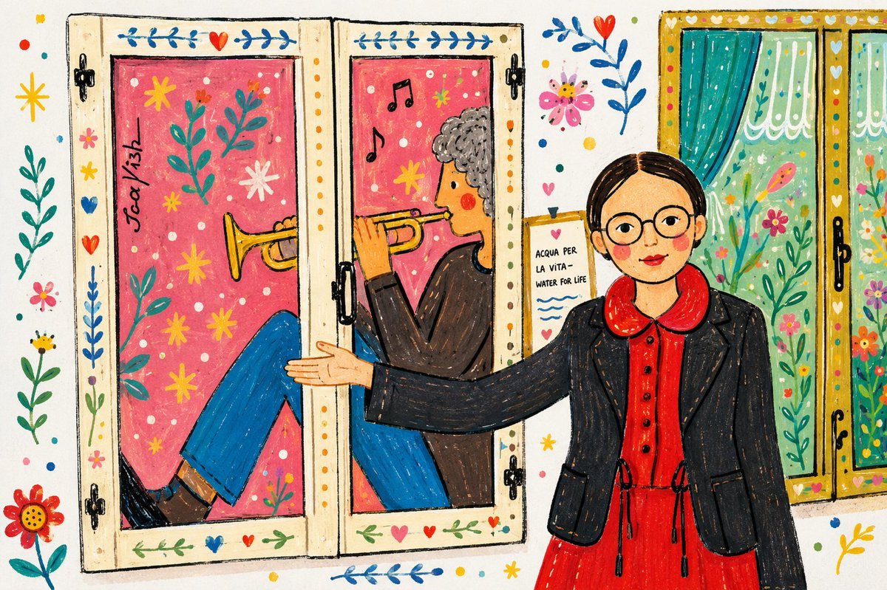</a>

```text
Create a whimsical hand-drawn folk-art illustration with a textured crayon, marker, and gouache look. Show an indoor wall scene filled with decorative floral doodles and bright handmade charm. In the foreground, place an adult woman presenter with {argument name="face style" default="a plain featureless tan square covering the face"}, dark center-parted hair, a black jacket, and a vivid red dress with a rounded red collar, black buttons, and drawstring details; she stands on the right half of the canvas and extends her left arm open toward a large window display. On the left, draw one large cream-colored double window with two tall panels and black hinges, decorated with tiny hearts, dots, and blue leafy borders. Behind the left window, show exactly one seated trumpet player: blue pants, dark jacket, curly gray hair, red cheek, holding a yellow trumpet, with black musical notes floating around; the pink background behind him contains leafy sprigs, white dots, yellow starbursts, and a handwritten vertical date-like note reading {argument name="window note" default="Feb / 13"}. On the far right, draw a second window with a golden yellow frame, teal curtains, pale lace trim, and a green garden-like view filled with flowers and vines. Between the woman and the left window, include a small wall poster reading {argument name="poster text" default="ACQUA PER LA VITA – WATER FOR LIFE"} with blue wave lines. Count and include exactly two windows, one presenter, one trumpet player, one poster, and two visible black musical notes. Surround everything with playful decorative motifs: red hearts, blue leafy branches, pink and red flowers, yellow starbursts, green vines, multicolored dots, and small white speckled texture. Use an off-white background, naïve proportions, thick black sketchy outlines, visible paper grain, and a cheerful Italian folk-art mood. Avoid photorealism, shadows, or digital polish; make it look handmade and slightly imperfect.
```

## by [Shah](<https://x.com/ai_with_shah>) on May 19, 2026 👉 [Try Now](https://indream.ai/generate?mode=IMAGE&modelKey=gpt-image-v2&modelPromptId=019e601f-f35d-73e6-885f-45f20522685b)

<a href="./public/images/e4565114-ec33-43db-965d-63dbe75bc89f.png" target="_blank" rel="noopener noreferrer">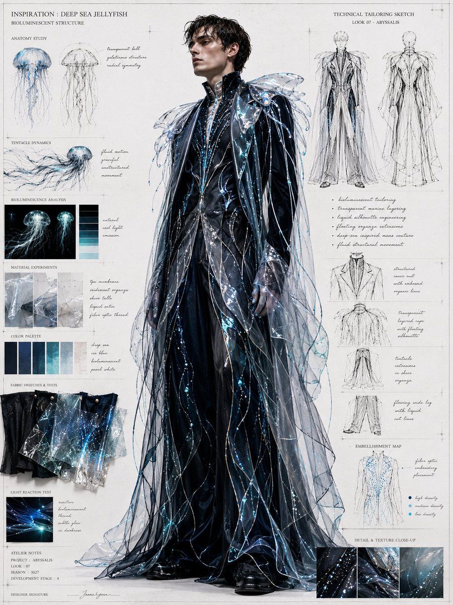</a>

```text
Goal: Create a high-fashion menswear concept board inspired by {argument name="inspiration source" default="deep sea jellyfish"}, combining a central couture runway look with fashion design research panels, technical tailoring sketches, material tests, color studies, and handwritten atelier annotations.

Canvas: Portrait-oriented editorial fashion board on warm off-white archival paper, approximately 4:5 ratio, with faint grid marks, thin drafting lines, crop marks, pin-registration marks, subtle paper grain, and a luxury atelier mood. Use black, deep navy, icy cyan, translucent blue, silver, and white.

Main subject: Place one full-body male model centered and slightly forward, wearing {argument name="collection look name" default="Look 07 - Abyssalis"}. The face should be softly blurred or obscured, while the outfit remains sharp. The garment is futuristic couture menswear: a glossy black structured long coat or suit base with a high stand collar, layered liquid-black tailoring, wide sculptural shoulders, transparent jellyfish-like cape panels, flowing organza veils, fine dangling filament strands, reflective wet-look surfaces, and scattered bioluminescent cyan-blue bead lights. The silhouette should feel like a deep-sea creature translated into formal tailoring, with long translucent tentacle ribbons trailing from shoulders, sleeves, and hem to the floor. Add black boots visible beneath the layered coat.

Left research column: Include exactly 8 stacked research sections with small labels and visual materials:
1. Header reading “INSPIRATION : DEEP SEA JELLYFISH” with subheading “BIOLUMINESCENT STRUCTURE.”
2. “ANATOMI STUDY” section with exactly 2 jellyfish anatomy sketches, one blue-toned and one monochrome line sketch, plus small handwritten notes about a transparent bell, gelatinous structure, and radial symmetry.
3. “TENTACLE DYNAMICS” section with exactly 1 side-view jellyfish drawing showing long streaming tentacles, annotated with fluid motion, graceful undulation, and movement.
4. “BIOLUMINESCENCE ANALYSIS” section with exactly 2 glowing jellyfish reference images and exactly 5 vertical color bars beside them, from black and deep navy through teal to pale icy blue.
5. “MATERIAL EXPERIMENTS” section with exactly 3 square translucent material samples, annotated as fine membrane, iridescent organza, sheer tulle, liquid satin, and fiber optic thread.
6. “COLOR PALETTE” section with exactly 7 rectangular swatches: black, midnight navy, dark blue, teal, cyan, pale blue, and nearly white translucent blue, annotated as deep sea, ice blue, bioluminescent, and pearl white.
7. “FABRIC SWATCHES & TESTS” section with exactly 5 overlapping physical swatches in black vinyl/satin and translucent blue organza, some with glowing blue thread or bead-like highlights.
8. “LIGHT REACTION TEST” section with exactly 1 small dark photo panel showing bright blue fiber-optic streaks, plus a note about reaction, bioluminescent thread, subtle glow, and in darkness. At the bottom include atelier notes reading “ATELIER NOTES,” “PROJECT : ABYSSALIS,” “LOOK : 07,” “SEASON : SS27,” and “DEVELOPMENT STAGE : 4,” followed by a designer signature line.

Right technical column: Include exactly 6 design-development sections:
1. Top heading “TECHNICAL TAILORING SKETCH” with subheading “LOOK 07 - ABYSSALIS,” showing exactly 2 tall technical fashion sketches, front and back views, of the same long translucent layered coat.
2. A bullet-note block with exactly 5 bullets: bioluminescent tailoring; transparent marine layering; liquid silhouette engineering; floating organza extension; deep-sea inspired main couture; fluid structural movement.
3. A construction-detail area with exactly 4 smaller line drawings: structured inner coat with enlarged organic hood; transparent layered cape with floating silhouette; tentacle extensions as sheer organza; flowing wide-leg pants with liquid cut lines.
4. “EMBELLISHMENT MAP” section with exactly 1 front torso sketch covered in blue dot placements and exactly 3 legend dots labeled high density, medium density, and low density; add a note for fiber optic embroidery placement.
5. “DETAIL & TEXTURE CLOSE-UP” section with exactly 3 rectangular close-up images showing black glossy fabric with blue glowing bead lines, transparent crinkled organza, and watery translucent blue membrane texture.
6. Sparse handwritten annotations around the sketches, using elegant thin cursive, while keeping the text secondary and not overcrowded.

Visual style: Photorealistic central model blended with delicate pencil fashion sketches, scientific specimen diagrams, luxury couture board presentation, translucent layering, iridescent highlights, cyan bioluminescent specks, black liquid satin, and fine technical drafting aesthetics. The board should feel like an elite fashion house concept sheet for futuristic couture menswear, directly inspired by deep-sea jellyfish anatomy.

Text constraints: Use the visible English headings and atelier labels as described. Keep typography small, refined, and editorial; mix uppercase serif labels with handwritten cursive notes. Do not add logos, watermarks, extra models, or unrelated sea creatures. The final image should read as one complete fashion concept board for {argument name="garment theme" default="bioluminescent jellyfish couture menswear"}.
```

## by [カーブミラー](<https://x.com/kabumira862571>) on May 19, 2026 👉 [Try Now](https://indream.ai/generate?mode=IMAGE&modelKey=gpt-image-v2&modelPromptId=019e6021-c157-779b-a0f1-94c45517b436)

<a href="./public/images/cccbf9a2-6bdd-4e5a-9537-40e37ac8c267.png" target="_blank" rel="noopener noreferrer">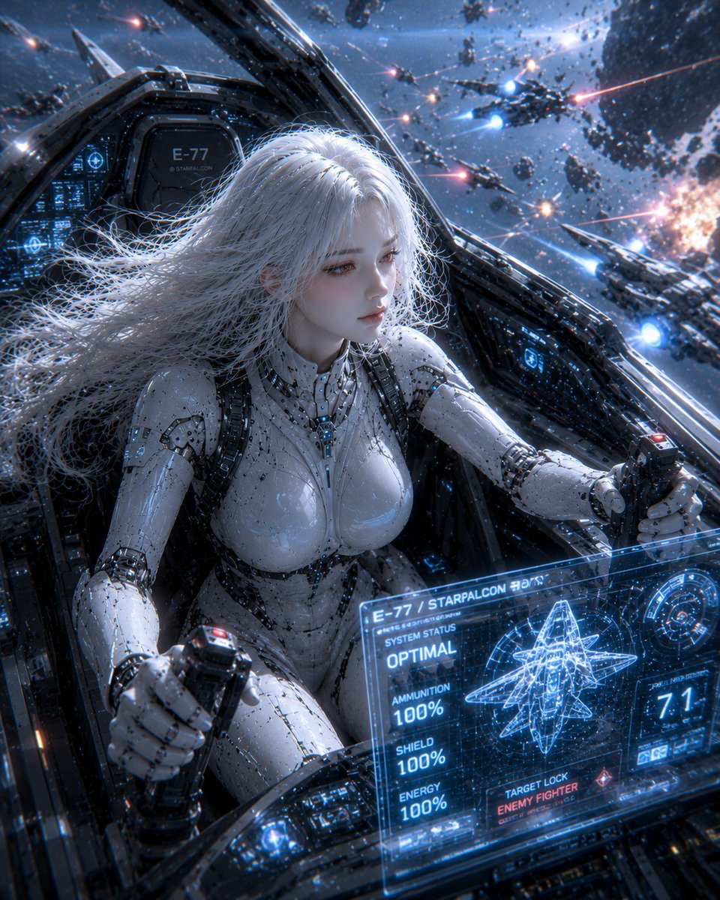</a>

```text
{argument name="場所" default="宇宙船"}の{argument name="主体" default="女性アンドロイド"}
```

## by [ハルはスマグロにハマった](<https://x.com/HARU_GENSO>) on May 19, 2026 👉 [Try Now](https://indream.ai/generate?mode=IMAGE&modelKey=gpt-image-v2&modelPromptId=019e6027-fd62-7742-b538-ce94f2912dde)

<a href="./public/images/2c5a3d84-cbec-4041-adeb-46503570b05f.png" target="_blank" rel="noopener noreferrer">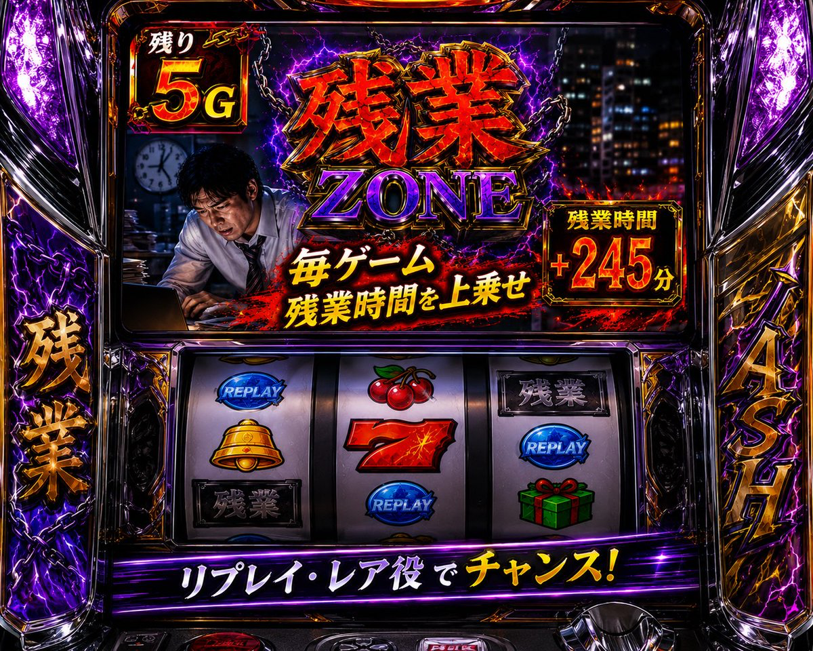</a>

```text
Goal: Create a hyper-detailed photorealistic Japanese pachislot machine screen themed around overtime work, rendered like a high-energy casino arcade cabinet with glossy chrome, black glass, purple lightning, red flames, gold trim, and dramatic glowing typography.

Canvas: 4:3 horizontal image, front-facing view of the machine, filling the frame edge to edge. Use a dark arcade environment with reflections, neon highlights, and intense contrast. No people outside the screen; the only human figure appears inside the top display.

Main top display: Show a dramatic game bonus screen with a tired Japanese office worker in a white shirt and tie leaning over a laptop at night, face intentionally blurred, with a city office window background and a wall clock behind him. The central headline must be huge metallic Japanese text 「残業」 with a purple English subtitle “ZONE” underneath, surrounded by chains, purple electricity, sparks, and smoky red-black effects. Add the slogan 「毎ゲーム 残業時間を上乗せ」 in bold white and yellow Japanese text across the lower center of the top display. In the upper-left corner, add a framed counter reading 「残り」 above a large “5G”. On the right, add a framed red-and-gold bonus time panel reading 「残業時間 +245分」. Make all text look embossed, fiery, glossy, and arcade-like.

Machine frame and side decorations: Build a luxurious pachislot cabinet frame with transparent molded plastic, chrome edges, gold ornamental accents, black lacquer, and bright purple LED lightning. Add exactly 2 large vertical side title panels: the left panel reads 「残業」 in gold Japanese characters, and the right panel reads 「4スロ」 in gold characters. Include purple lightning effects behind both side panels.

Reel section: Include exactly 3 vertical slot reels in the middle-lower area, each showing exactly 3 visible symbols for a total of 9 visible reel symbols. Left reel symbols from top to bottom: blue “REPLAY” emblem, golden bell, black plaque with 「残業」. Middle reel symbols from top to bottom: red cherries, red number 7, blue “REPLAY” emblem. Right reel symbols from top to bottom: black plaque with 「残業」, blue “REPLAY” emblem, green gift box with red ribbon. Reels should be glossy, slightly reflective, and sharply lit.

Bottom banner: Add a glowing purple-black banner below the reels with large Japanese text 「リプレイ・レア役でチャンス!」, with the final word 「チャンス!」 in bright yellow and the preceding text in white. Add small chrome buttons and machine hardware barely visible at the very bottom edge.

Visual style: Ultra-realistic pachislot photography mixed with exaggerated game UI art, intense neon purple and red palette, gold beveled type, lightning bolts, sparks, chains, reflections, and high dynamic range arcade lighting. Make it look like a real premium Japanese slot machine cabinet photographed straight on.

Customizable details: The main Japanese title is {argument name="main Japanese title" default="残業"}; the English subtitle is {argument name="English subtitle" default="ZONE"}; the remaining game count is {argument name="remaining game count" default="5G"}; the bonus time value is {argument name="bonus time value" default="+245分"}; the bottom banner text is {argument name="bottom banner text" default="リプレイ・レア役でチャンス!"}.

Constraints: Keep the exact visible count of 3 reels, 9 reel symbols, 2 side title panels, 1 top-left counter, 1 right bonus-time panel, and 1 bottom banner. Preserve the Japanese text accurately. Do not add extra logos, watermarks, subtitles, or additional characters.
```

## by [妖精アーヤさん](<https://x.com/aiehon_aya>) on May 19, 2026 👉 [Try Now](https://indream.ai/generate?mode=IMAGE&modelKey=gpt-image-v2&modelPromptId=019e602b-c3c7-700f-8a21-0ecc47e1a962)

<a href="./public/images/0ca05fd4-049b-471c-b06c-1bb0c67eeddc.png" target="_blank" rel="noopener noreferrer">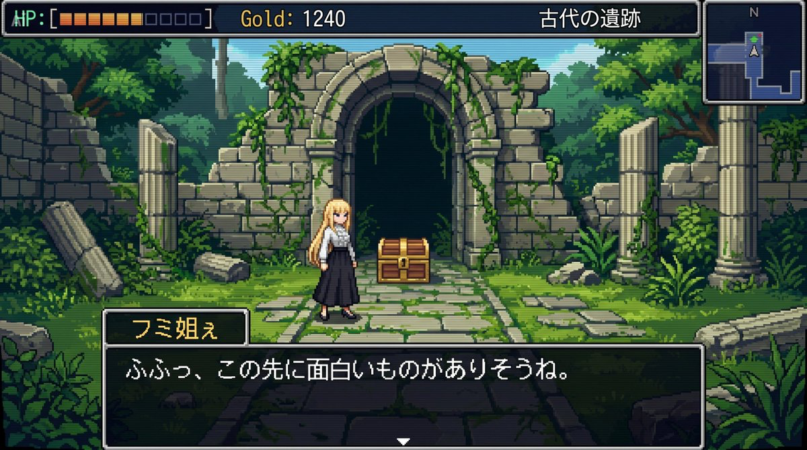</a>

```text
16bit RPG フィールド探索・イベント画面風
────────────────
キャラクター名指定：［{argument name="キャラクター名" default="（★任意）"}］
セリフ指定：［{argument name="セリフ" default="（★任意）"}］
```

## by [AI業務設計ラボ｜プロンプト設計士](<https://x.com/dougajb>) on May 19, 2026 👉 [Try Now](https://indream.ai/generate?mode=IMAGE&modelKey=gpt-image-v2&modelPromptId=019e602c-e3c2-7083-bd2f-d8540ed20167)

<a href="./public/images/6ca3de6d-ac91-4f35-bfea-eafb4562c417.png" target="_blank" rel="noopener noreferrer">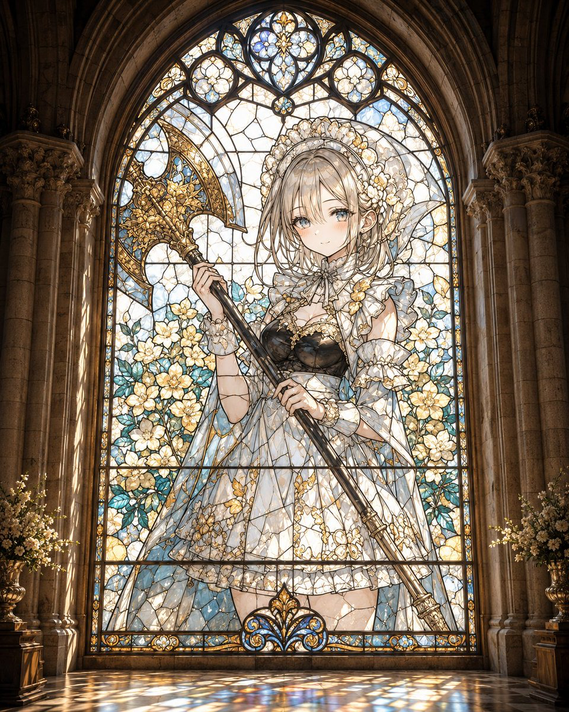</a>

```text
Create a highly detailed vertical fantasy illustration of a grand Gothic cathedral interior dominated by a towering arched stained-glass window. The stained glass depicts an elegant anime-style holy maiden or battle princess, {argument name="character role" default="a saintly axe-wielding maiden"}, standing full-body in the center and holding an ornate long poleaxe diagonally across her body. She wears a delicate white and pale blue dress with translucent layered sleeves, gold filigree trim, floral embroidery, a dark corset bodice, pearl-like accessories, and a halo-like wreath of pale flowers around her head. Her face is intentionally covered by a flat opaque beige square censor block centered over the facial area. The window is filled with intricate lead came patterns and luminous glass textures: exactly 5 large floral medallion motifs near the upper arch, many white and cream blossoms with teal leaves around the figure, gold ornamental borders, blue accents, cracked translucent glass, and bright sunlight glowing through. Surround the window with realistic dark stone cathedral architecture, ribbed arch molding, carved columns, and warm side shadows. Add exactly 2 symmetrical flower arrangements in gold vases on pedestals near the lower left and lower right edges. The polished stone floor reflects the stained-glass colors in shimmering patches of blue, gold, and white. Use {argument name="visual style" default="ultra-detailed anime stained glass mixed with realistic cathedral photography"}, dramatic backlighting, warm sacred atmosphere, sharp ornate linework, complex transparent glass texture, high contrast, no visible text, no watermark.
```

## by [🌌🐈‍⬛くʓ ʓ 🍃✨🌸🍑👽👑](<https://x.com/currnya>) on May 18, 2026 👉 [Try Now](https://indream.ai/generate?mode=IMAGE&modelKey=gpt-image-v2&modelPromptId=019e602e-b02d-764a-a794-9c6c38f404a6)

<a href="./public/images/649f7690-746e-4fed-b391-0cabd50725af.png" target="_blank" rel="noopener noreferrer">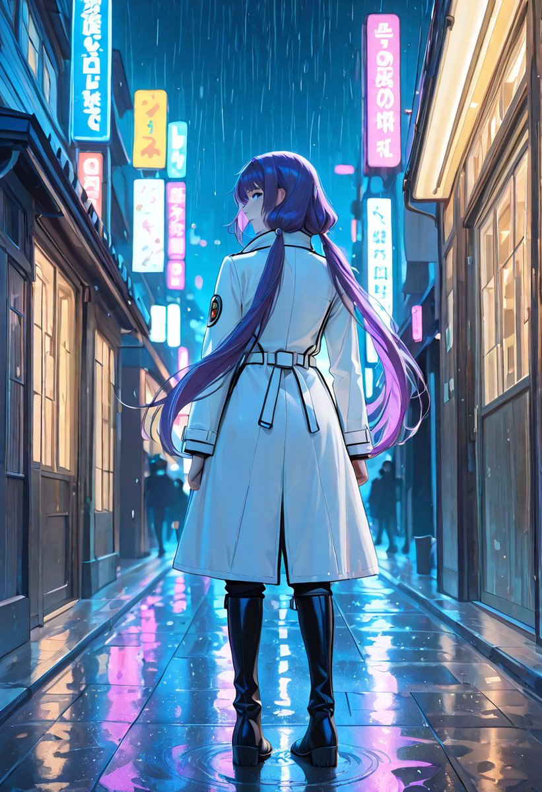</a>

```text
Create a polished anime-style vertical illustration of a lone young woman standing in the center of a narrow Japanese city alley at night during heavy rain. She is seen mostly from behind, full body, centered, with her head turned slightly over her left shoulder so one eye and part of her face are visible. She has very long flowing {argument name="hair color" default="deep purple hair with blue and magenta highlights"}, tied into low side sections, with long strands trailing dramatically in the rain. She wears a crisp {argument name="coat color" default="white"} long belted trench coat with black piping, shoulder seams, cuff straps, a back belt, and a small circular sleeve patch, paired with black pants and glossy black knee-high platform boots. The setting is a wet neon-lit alley in Tokyo at night, with shopfronts on both sides, warm window light on the right, darker storefronts on the left, and exactly 9 visible glowing vertical signs in cyan, pink, yellow, and white with stylized Japanese-like characters; the text can be decorative and not fully readable. Rain falls in long vertical streaks, puddles cover the pavement, and the ground creates vivid reflections of blue, cyan, pink, and white neon. Add a few distant dark pedestrian silhouettes in the background for depth, but keep the woman as the clear focal point. Use cinematic composition, low eye-level perspective, strong rim lighting, saturated cyberpunk colors, clean linework, detailed anime rendering, glossy reflections, soft depth of field in the distance, and a moody romantic rainy-night atmosphere. No watermark, no frame, no extra foreground characters.
```

## by [ぽちいな](<https://x.com/pochiina>) on May 18, 2026 👉 [Try Now](https://indream.ai/generate?mode=IMAGE&modelKey=gpt-image-v2&modelPromptId=019e602f-1975-779e-be38-3b905d593783)

<a href="./public/images/e5e399b5-e349-4c92-b061-a2b40e24aaf4.png" target="_blank" rel="noopener noreferrer"></a>

```text
Create a luxurious pastel pink limited-edition chocolate gift box product photo for {argument name="character name" default="Hana na chan"}. The scene is a dreamy, romantic flat-lay/angled close-up on a lace-covered table with soft warm studio lighting, shallow depth of field, pearl and satin accents, and an elegant rose-gold and blush color palette. Show an open rectangular chocolatier box: the upper lid fills the top half and is printed like a premium keepsake package with ornate thin gold border lines, delicate cherry-blossom clusters in the corners, and a large portrait-style photo of a cute young girl with a short pale-blonde bob haircut, a pink flower hair clip, a white blouse with tiny pink floral embroidery and lace collar, black suspenders, and one arm raised making a peace sign; place a simple opaque square privacy mosaic over the face. On the lid, include refined gold typography reading "花奈ちゃん" with a small blossom mark, "HANA NA CHAN", "ÉDITION LIMITÉE", and "CHOCOLAT DE RÊVE". Add a large satin bow at the upper right of the lid with dangling gold charm beads and a small flower ornament. The lower half of the box contains exactly 10 chocolates arranged in a 2-by-5 grid in individual dark brown fluted cups inside glossy gold compartments: 1 pink flower-shaped chocolate with a gold center, 2 faceted ruby-pink heart gem chocolate, 3 cream round ridged chocolate topped with a small pink flower, 4 pink rose-swirl chocolate, 5 dark round chocolate dusted with fine gold sprinkles, 6 square milk chocolate engraved with floral line art, 7 round pink striped chocolate with white drizzle and tiny sprinkles, 8 faceted blush-pink dome chocolate, 9 square dark chocolate engraved with a gold bee or floral motif, 10 pale pink heart chocolate with pearly sheen. Around the box, include soft props: lace fabric, pale pink flower petals, a small cream gift card at lower left with cursive "Hana na chan" and Japanese-style decorative text, a vintage gold mirror edge, pearls, and pink ribbon. Style should look like a high-end Japanese kawaii chocolatier advertisement, photorealistic but slightly fantasy-polished, with crisp packaging details, embossed textures, metallic gold accents, delicate blossoms, and no extra chocolates or extra text beyond the specified lettering.
```

## by [𝐌](<https://x.com/Strength04_X>) on May 18, 2026 👉 [Try Now](https://indream.ai/generate?mode=IMAGE&modelKey=gpt-image-v2&modelPromptId=019e602f-ebd7-726a-a933-043bea0b2b11)

<a href="./public/images/fc04701f-a86f-4d20-837c-4496c9e6bdb8.png" target="_blank" rel="noopener noreferrer">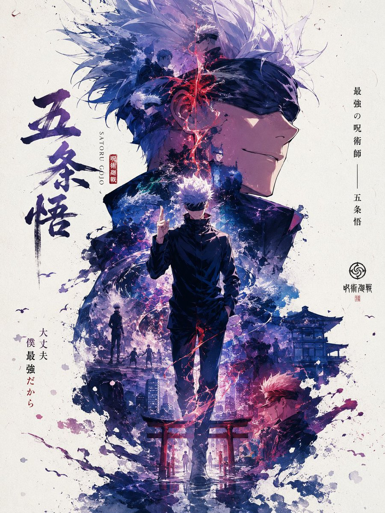</a>

```text
Create a vertical Japanese anime propaganda poster for {argument name="character name" default="Satoru Gojo"} from Jujutsu Kaisen, with a consistent hierarchical main visual composition and dramatic ink-wash collage style. Canvas: portrait 3:4 poster on warm off-white aged paper with subtle grain, dust specks, faint scratches, and scattered ink splatters. Visual hierarchy: the top half is dominated by an enormous right-facing side profile of Gojo wearing a black blindfold, smiling slightly, with spiky white hair exploding upward into translucent feather-like shards and blue-purple energy strokes. In the center foreground place a full-body Gojo walking toward the viewer, tall and slim in a high-collar black uniform, blindfolded, one hand in his pocket and the other raised with two fingers extended; red cursed-energy lightning coils around his torso and legs. Use deep indigo, violet, blue, black, white, and crimson accents, with painterly splashes and sharp manga linework.

Composition details: include exactly 6 smaller character/story vignettes blended into the ink cloud around the main figure: 1) a blue-haired male silhouette near the upper left within the hair/energy mass, 2) a white-haired blindfolded smaller Gojo in profile at upper left, 3) a dark standing figure facing the central energy on the mid-right, 4) a small lone silhouette in the lower-left mist, 5) a group of three small figures walking in the lower middle background, and 6) a red-haired/pink-haired male with a black blindfold or markings in the lower-right brush splash. Add exactly 4 environmental motifs: 1) a traditional Japanese temple building on the mid-right, 2) a modern city skyline at bottom center, 3) a red torii gate at the lower foreground behind the central figure’s legs, and 4) tiny bird silhouettes in the white margins. Keep all secondary elements partially dissolved into blue and purple watercolor smoke.

Text layout: on the left side, large vertical Japanese brush-calligraphy reading {argument name="large Japanese title" default="五条悟"}, painted in dark navy ink. Beside it add small vertical roman text reading “SATORU GOJO” and a small red seal with Japanese characters. On the right side, add clean vertical Japanese text reading {argument name="right side slogan" default="最強の呪術師 — 五条悟"}, with a small circular emblem and the Japanese series title beneath it. On the lower left, add smaller vertical Japanese text reading {argument name="lower left quote" default="大丈夫 僕 最強だから"}, mixing black and muted red characters. Overall mood: heroic, mythic, national-poster-like propaganda energy without real-world politics, elegant manga poster design, high detail, strong central silhouette, layered ink splashes, luminous cursed energy, crisp face profile, no English headline except the small “SATORU GOJO,” no watermark, no extra characters beyond the listed vignettes.
```

## by [Abkr Sadiq](<https://x.com/abs_uiux>) on May 18, 2026 👉 [Try Now](https://indream.ai/generate?mode=IMAGE&modelKey=gpt-image-v2&modelPromptId=019e602f-fb11-752f-8b13-4e80e2ef14bf)

<a href="./public/images/6fb54230-f7fd-406b-b87e-4afee660fadd.png" target="_blank" rel="noopener noreferrer">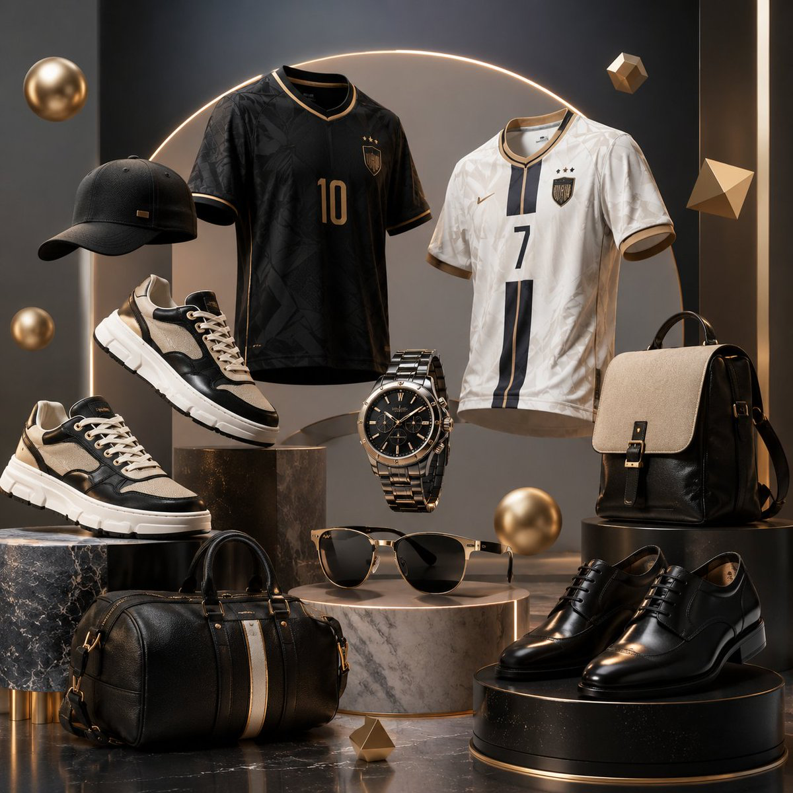</a>

```text
Create a premium square 3D fashion product showcase featuring exactly 9 main fashion items in a clean floating luxury composition: 1 black baseball cap on the left, 2 black-and-beige chunky luxury sneakers on staggered stone plinths, 1 black football jersey with gold trim and number 10, 1 white football jersey with black-and-gold trim and number 7, 1 metallic black-and-gold wristwatch floating in the center, 1 pair of black sunglasses with beige/gold frame on a marble cylinder, 1 black leather duffel bag with a vertical beige-and-gold stripe at the bottom left, 1 black-and-beige structured designer backpack on the right, and 1 pair of polished black leather dress shoes on a round black pedestal at the bottom right. Use {argument name="color palette" default="matte black, warm gold, cream beige, white, and charcoal gray"} with realistic leather, fabric, metal, rubber, and marble textures. Arrange the objects at different heights on cylindrical black marble, white marble, and dark stone podiums, with some items floating as if weightless. Background: dark charcoal studio wall with a soft glowing golden semicircle arch behind the jerseys, warm rim lighting, glossy reflections, subtle shadows, and floating decorative geometric accents including 3 gold spheres and 3 small gold polyhedrons. Style: high-end product advertising render, photorealistic 3D, cinematic lighting, crisp focus, luxurious boutique display, symmetrical but dynamic composition. Customize the jersey text details with {argument name="black jersey number" default="10"} and {argument name="white jersey number" default="7"}; include small crest-like badges and star details but no readable brand names or logos. Use {argument name="aspect ratio" default="1:1 square"}.
```

## by [peak of human evolution](<https://x.com/npw55036>) on May 18, 2026 👉 [Try Now](https://indream.ai/generate?mode=IMAGE&modelKey=gpt-image-v2&modelPromptId=019e6037-4bb0-735f-aa26-3c1dc6cd3ecd)

<a href="./public/images/278e9421-1bb8-4d7b-a73d-318995b2415f.png" target="_blank" rel="noopener noreferrer">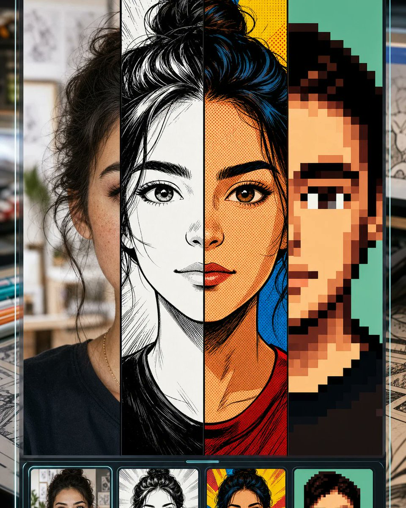</a>

```text
Goal: Create a vertical promotional app-style mockup for a “selfie to comic” image transformation tool, showing one portrait converted into multiple comic styles while keeping the same face structure recognizable.

Canvas: Tall smartphone-like 4:5 composition, dark glossy interface frame with thin cyan glow lines along the left and right edges. Background outside the phone is softly blurred, like a desk or creative studio with papers and drawing materials.

Layout: The main preview fills most of the screen and is split into exactly 4 vertical style panels from left to right: 1) realistic selfie/photo style, 2) black-and-white manga ink drawing, 3) saturated retro comic book halftone style, 4) chunky pixel-art avatar style. A large centered square mask/placeholder covers the middle of the face and upper torso area, colored warm beige/gray, as if the central facial region is intentionally hidden. Below the main preview is a dark carousel strip with exactly 4 rounded thumbnail cards matching the same four styles: photo selfie, manga ink, retro comic, and pixel art.

Subject details: Use a young woman with {argument name="hair color" default="dark brown/black"} messy hair tied in a high bun, visible eyebrow and eye on the left and right panels, medium warm skin tone, wearing a simple dark crew-neck shirt and a thin necklace. Keep the same head position across all four transformations.

Style panel details: The photo panel should look like a casual indoor selfie with shallow depth of field and natural texture. The manga panel should use dramatic black ink, white highlights, crosshatching, and clean linework. The retro comic panel should use bold outlines, red and yellow background bursts, blue-black hair highlights, orange skin tones, and halftone dots. The pixel-art panel should use large square pixels, simplified facial features, teal background, and a limited palette.

Visual style: High-contrast social media product preview, crisp vertical divisions, glossy black UI chrome, neon cyan accents, clean rounded thumbnail cards, polished GPT-image promotional aesthetic.

Constraints: Include exactly 4 main vertical panels and exactly 4 bottom thumbnails. Do not add readable text, logos, or watermarks. Keep the central beige square mask prominent and perfectly centered. Use {argument name="interface mood" default="dark futuristic mobile UI"}, {argument name="comic transformation theme" default="manga, retro comic, and pixel art selfie conversion"}, and {argument name="background setting" default="blurred creative studio desk"}.
```

## by [のとろ](<https://x.com/notoro_ai>) on May 18, 2026 👉 [Try Now](https://indream.ai/generate?mode=IMAGE&modelKey=gpt-image-v2&modelPromptId=019e6037-b0a9-7606-90b3-de22921dc819)

<a href="./public/images/ac8c5eb2-11fd-4503-9478-6bc1e9674e9d.png" target="_blank" rel="noopener noreferrer">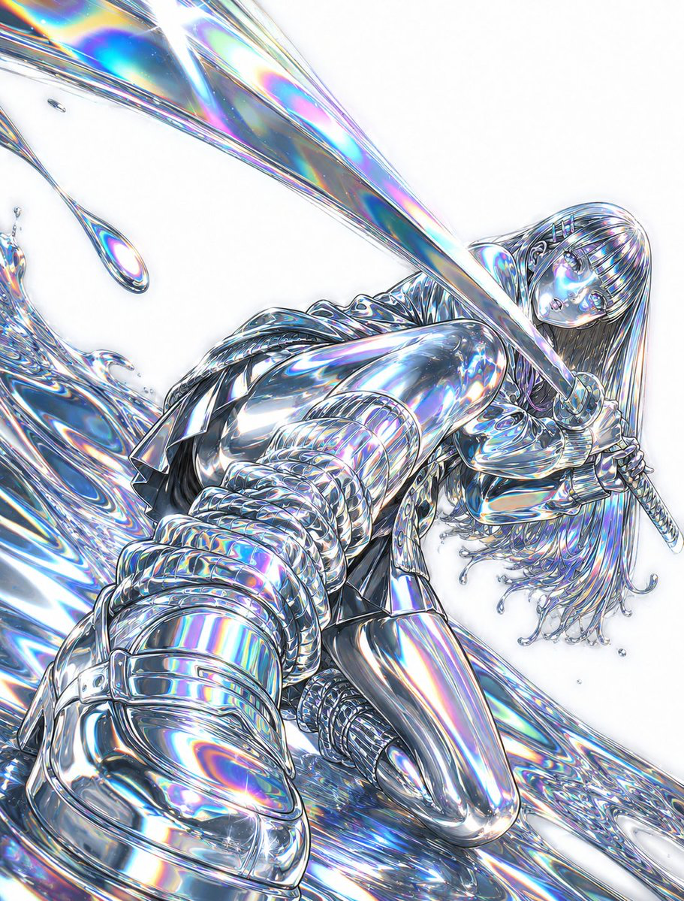</a>

```text
このイラストを、{argument name="素材" default="液体クロムとホログラフィック素材"}でできたようなスタイルで変換してください。鏡面のような完璧な反射、角度によって虹色に変化するホログラム効果、液体金属が流れているような滑らかな質感を全身に。強烈なメタリック光沢と歪んだ反射で、未来的で非現実的な美しさを表現してください。
```

## by [Ian (伊恩)](<https://x.com/ianneo_ai>) on May 18, 2026 👉 [Try Now](https://indream.ai/generate?mode=IMAGE&modelKey=gpt-image-v2&modelPromptId=019e6038-4565-779a-8dce-31db4b1c71a6)

<a href="./public/images/dc38b7a2-5d9f-427f-9044-2c355e7f862c.png" target="_blank" rel="noopener noreferrer">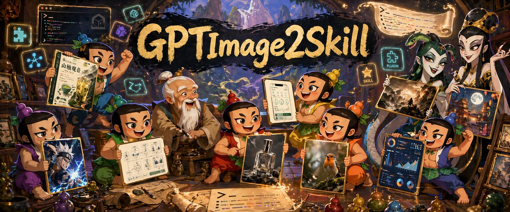</a>

```text
Goal: Create a richly detailed fantasy workshop banner advertising {argument name="headline text" default="GPT Image 2 Skill"}, showing a magical image-generation toolkit as if presented by cartoon gourd-doll apprentices and a wise master.

Canvas: Ultra-wide horizontal banner, about 2.4:1 aspect ratio, cinematic composition, warm glowing fantasy lighting, dense but readable. The headline sits across the upper center on a black brushstroke paint swash in large hand-painted cream-gold lettering.

Main scene: A cozy enchanted studio packed with scrolls, framed images, glowing code panels, UI cards, potion bottles, drawing tools, and magical icons. In the far background, an arched opening reveals misty blue-purple mountains and a fantasy landscape. The foreground is cluttered with parchment sheets, paintbrushes, pens, rolled scrolls, small gourds, beads, and colored potion-like spheres.

Characters: Include exactly 8 visible cartoon characters in a Chinese animated-fantasy style: 6 small gourd-doll children with topknot gourds/leaves and expressive faces, 1 elderly white-bearded master seated near the center-left, and 1 tall elegant robed figure on the far right. Arrange them in a lively group around the headline and display boards. The characters should be cheerful, excited, and collaborative, with some holding image examples or interface panels. If using privacy-safe placeholders, cover exactly 4 faces with soft rectangular blur masks: the elderly master, one center-left child holding a workflow board, one center child holding a bottle image, and the tall robed figure on the right.

Counted display items: Show exactly 11 major visible boards/panels/images: 1 top-left dark code editor panel with colorful code and a cube icon, 1 upper-left Chinese-style document held by a child with botanical illustration details, 1 lower-left anime action image held by a purple-clad child, 1 center-left workflow diagram board held by a child, 1 center image board showing a perfume bottle, 1 tablet-like UI mockup held by a smiling child, 1 framed bird photography image held near the lower center-right, 1 dark analytics/dashboard UI panel held by the right child, 1 large vertical fantasy city/night illustration behind the right child, 1 parchment code scroll floating at the top-right, and 1 glowing parchment code sheet lying across the front-center foreground.

Icon details: Add exactly 5 glowing square tech badges around the scene: a puzzle-piece icon on the far left, a connected-nodes icon on the left, a small cube icon near the upper center-left, a purple abstract skill/tool icon near the title, and a neon puzzle badge on the upper-right labeled {argument name="plugin label" default="PLUGIN"}. Add one additional golden star badge on the right labeled {argument name="skill label" default="SKILL"}.

Style: Painterly high-detail digital illustration, whimsical Chinese fantasy animation, warm amber highlights with cool cyan-purple magical glow, ornate wooden workshop interior, soft depth, dramatic rim lighting, gold sparkles, crisp readable central title, lively crowded composition like a promotional GitHub repository banner.

Text constraints: The main headline must read exactly {argument name="headline text" default="GPT Image 2 Skill"}. Preserve the small badge words {argument name="plugin label" default="PLUGIN"} and {argument name="skill label" default="SKILL"}. Any tiny code or document text may be decorative and mostly unreadable, but should resemble colorful syntax highlighting and design notes. Do not add extra logos, watermarks, or unrelated brand names.
```

## by [かい@デザイナー,Shopifyパートナー](<https://x.com/kai_toyohashi>) on May 18, 2026 👉 [Try Now](https://indream.ai/generate?mode=IMAGE&modelKey=gpt-image-v2&modelPromptId=019e6038-5436-7190-ad5d-57039ad3391b)

<a href="./public/images/21d6843d-bf7b-4bbc-acda-b78d26a07c15.png" target="_blank" rel="noopener noreferrer">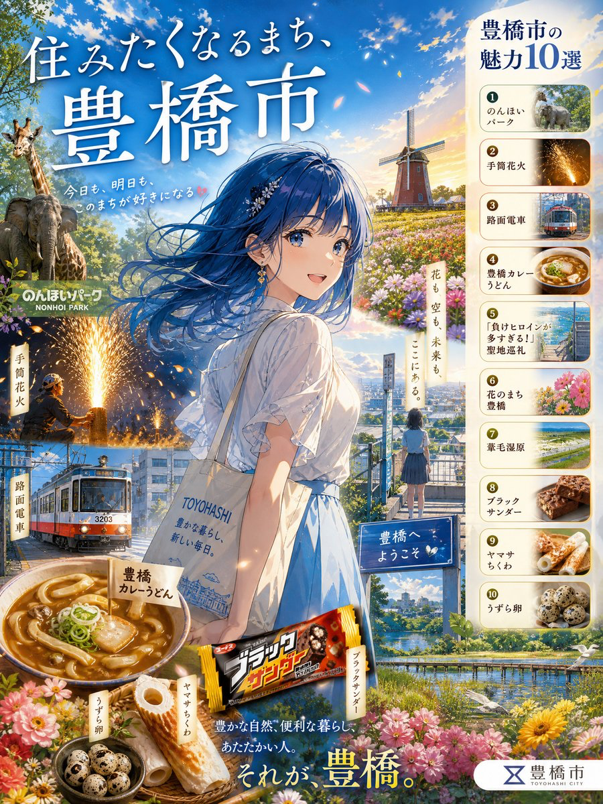</a>

```text
Goal: Create a high-resolution Japanese tourism PR poster for {argument name="city name" default="Toyohashi City"}, combining an emotional anime travel illustration with a dense collage of local attractions, foods, and landmarks.

Canvas: Vertical poster, 4:5 aspect ratio, bright cinematic daylight, ultra-detailed 2K feel. Use a saturated blue sky with white clouds and warm golden sunset light. The composition should feel like an official municipal promotional poster, polished and information-rich.

Main visual: Center a beautiful anime-style young woman seen from behind and slightly in profile, standing in a scenic city overlook. She has long flowing {argument name="hair color" default="deep blue"} hair blowing dramatically in the wind, delicate hair ornaments, a white short-sleeve blouse, and a light blue skirt. She carries a cream tote bag printed with “TOYOHASHI” and small blue city-line art. Her face area should be softly obscured or turned away so the poster focuses on place and atmosphere. Add a small schoolgirl-like figure in the midground looking over the city, reinforcing nostalgia and travel.

Top headline text: Large elegant white Japanese calligraphy-style title across the upper left: 「住みたくなるまち、豊橋市」. Add smaller handwritten-style subcopy nearby: 「今日も、明日も、このまちが好きになる」. Use strong drop shadows so the text remains legible against the sky.

Right sidebar: Create a cream rounded vertical panel titled 「豊橋市の魅力10選」. It must contain exactly 10 numbered attraction cards, each with a small photo-like thumbnail and Japanese label:
1. 「のんほいパーク」 with an elephant/giraffe zoo image
2. 「手筒花火」 with handheld fireworks sparks
3. 「路面電車」 with a streetcar image
4. 「豊橋カレーうどん」 with curry udon bowl
5. 「『負けヒロインが多すぎる！』聖地巡礼」 with a seaside or school-route scene
6. 「花のまち豊橋」 with colorful flowers
7. 「葦毛湿原」 with wetland greenery
8. 「ブラックサンダー」 with a chocolate bar close-up
9. 「ヤマサちくわ」 with chikuwa fish cakes
10. 「うずら卵」 with quail eggs

Collage elements: Include exactly 10 major attraction/food elements integrated around the poster: a zoo scene with giraffe and elephant on the left, a brick windmill and flower field in the upper right background, handheld fireworks in the lower left, a red-and-white streetcar labeled “3203,” a large bowl of Toyohashi curry udon, a Black Thunder chocolate bar package, Yamasa chikuwa fish cakes, a small bowl of quail eggs, a river/canal landscape with bridge and birds, and abundant foreground flowers. Add small vertical Japanese label tags near some collage items such as 「のんほいパーク」, 「手筒花火」, 「路面電車」, 「豊橋カレーうどん」, 「ヤマサちくわ」, and 「うずら卵」.

Mid and lower text: Add a small sign near the overlook reading 「豊橋へようこそ」. Add a vertical poetic phrase near the windmill/flowers: 「花も 空も 未来も ここにある。」. Near the bottom, place white and yellow promotional copy: 「豊かな自然、便利な暮らし、あなたらしい人。」 followed by a larger closing line 「それが、豊橋。」 with “豊橋” emphasized in yellow.

Footer: Bottom right should show a white rounded municipal logo block with a simple blue emblem and the text 「豊橋市」 plus small roman letters “TOYOHASHI CITY”.

Visual style: Premium anime illustration mixed with realistic travel-poster collage, soft depth of field, painterly detail, sparkling particles and flower petals in the air, glossy food illustration, crisp readable Japanese typography, warm inspirational atmosphere, no blank areas, no watermark, no extra people beyond the two described figures.
```

## by [アシタ🩵](<https://x.com/ashiwata100>) on May 18, 2026 👉 [Try Now](https://indream.ai/generate?mode=IMAGE&modelKey=gpt-image-v2&modelPromptId=019e6039-5b3e-7395-8e7c-72560900f1d8)

<a href="./public/images/858b7a0d-c414-412b-b25c-edd7fbcdf99f.png" target="_blank" rel="noopener noreferrer">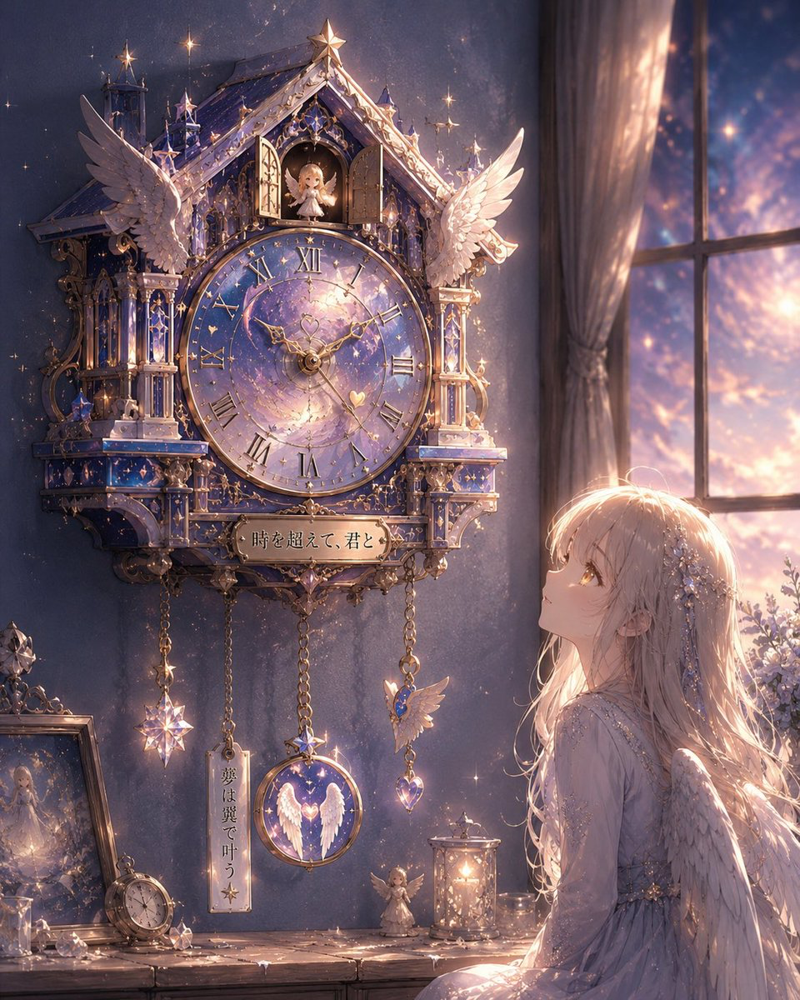</a>

```text
Create a realistic premium wall clock inspired entirely by the uploaded illustration. The clock must reinterpret the artwork’s atmosphere, character design, emotional tone, color palette, symbols, architecture, fashion, lighting, fantasy or sci-fi elements, and worldbuilding into a highly original cuckoo-clock-like hanging clock design. Do not create a generic antique clock. The entire silhouette, carvings, ornaments, moving parts, pendulum, decorative windows, roof structure, numerals, hands, textures, and materials must feel naturally born from the illustration’s universe.

Fantasy shrine maiden themes may inspire lacquered wood, spiritual crests, torii-inspired framing, glowing talismans, hanging bells, sakura carvings, layered shrine architecture, elegant red-and-black lacquer textures, and softly illuminated paper windows. Futuristic or android-inspired illustrations may create holographic clock faces, segmented mechanical armor panels, glowing circuitry, transparent crystal housings, floating rings, neon edge lighting, animated digital pendulums, and sleek asymmetrical structures. Cute pastel worlds may inspire rounded soft silhouettes, candy-like decorations, transparent ornaments, heart motifs, glossy enamel surfaces, plush textures, and dreamy fairytale styling.

The cuckoo-clock-style opening should contain a small animated figure, spirit, mechanical bird, tiny mascot, or symbolic object derived from the illustration itself. The pendulum and moving ornaments should visually match the worldbuilding and emotional tone of the artwork. Clock hands and numerals must be uniquely designed to fit the illustration instead of using standard designs.

If the uploaded illustration contains a character, place the same character naturally beneath or beside the wall clock, looking upward toward it with curiosity or admiration while preserving the original face, hairstyle, proportions, colors, clothing style, and personality. Bright cinematic lighting, ultra detailed craftsmanship, realistic materials, premium fantasy interior photography, elegant shadows, highly detailed reflections, masterpiece quality.
```

## by [Larus Canus](<https://x.com/MrLarus>) on May 18, 2026 👉 [Try Now](https://indream.ai/generate?mode=IMAGE&modelKey=gpt-image-v2&modelPromptId=019e6039-a761-77ff-a609-0370551a3bc3)

<a href="./public/images/4fbbc555-709d-4819-8e92-7651030c627e.png" target="_blank" rel="noopener noreferrer">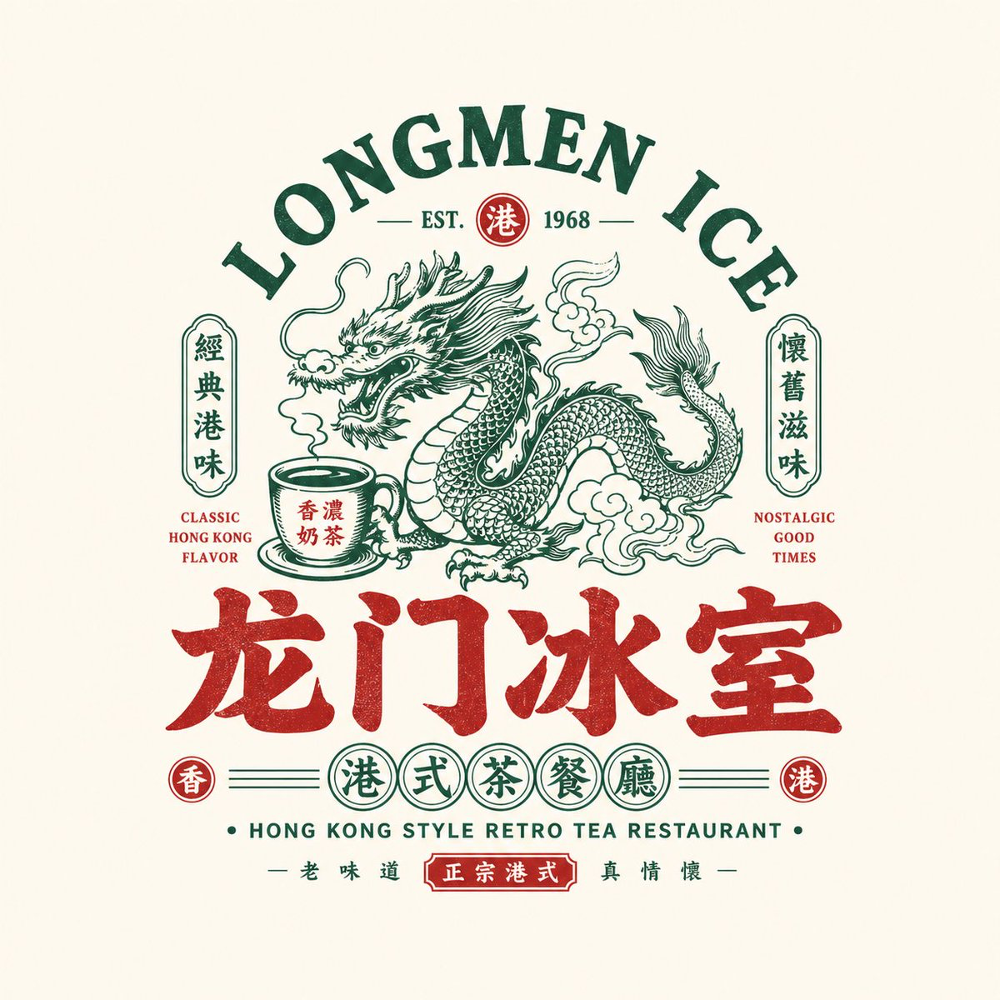</a>

```text
请根据用户输入的【{argument name="品牌名" default="品牌名 / 项目名"}】【{argument name="产品名" default="副标题 / 产品名"}】【类型 / 行业】【地域风味】【品牌定位】【核心关键词】【核心图形】【核心食物 / 品类元素】【情绪气质】【主色调】【辅助色】【画幅比例】，设计一个高完成度的「国潮复古餐饮徽章 Logo / Chinese Retro
```

## by [めぐりずむ](<https://x.com/meguya_meguru>) on May 18, 2026 👉 [Try Now](https://indream.ai/generate?mode=IMAGE&modelKey=gpt-image-v2&modelPromptId=019e603c-137d-7278-b171-63ec1694d791)

<a href="./public/images/2e56a471-fb86-4245-9f27-1e36c02b9b63.png" target="_blank" rel="noopener noreferrer">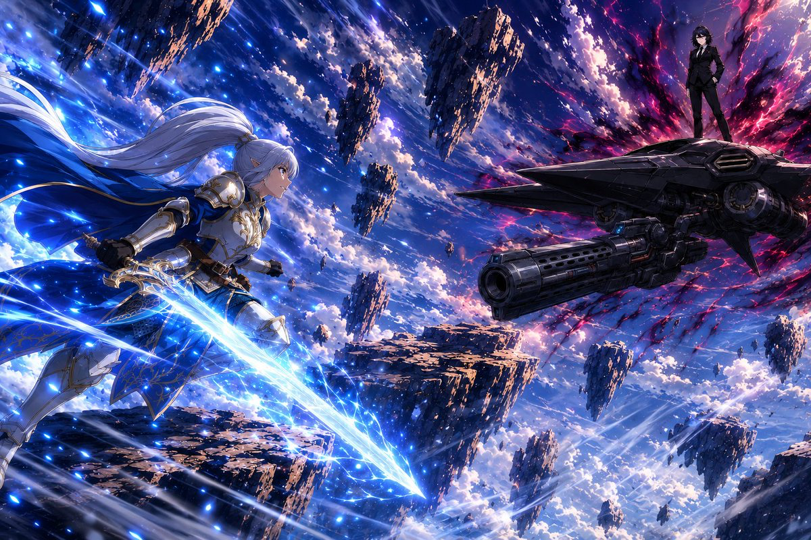</a>

```text
Create a cinematic anime-style fantasy sci-fi battle illustration in a wide 16:9 composition. Show exactly 2 characters facing each other across a sky full of floating landmasses: on the left foreground, {argument name="heroine" default="a silver-haired female knight"} lunges forward in profile with a determined expression, long high ponytail streaming behind her, wearing ornate white, blue, and gold plate armor with a flowing royal-blue cape, gripping a brilliant oversized energy sword that glows electric blue and leaves streaks of light and sparks across the lower half of the image. On the right upper foreground, {argument name="rival" default="a black-haired male antagonist"} stands confidently on top of a sleek black futuristic gunship, wearing a dark suit-like outfit, facing the heroine from a distance. Include exactly 1 black angular gunship with a pointed nose, mechanical panels, circular engine details, and a large forward cannon aimed toward the heroine. The environment is a dramatic high-altitude sky or shattered dimension with exactly 18 visible floating rocky islands and debris masses scattered in depth, from huge jagged slabs near the center to smaller fragments in the distance. The left side of the scene should glow with cold blue magical energy, while the right side should be corrupted by magenta-red lightning and dark nebula-like cracks, creating a strong blue-versus-red contrast. Use dynamic diagonal composition, extreme perspective, wind motion streaks, glowing particles, detailed clouds, painterly anime rendering, crisp linework, high saturation, dramatic lighting, and epic novel-cover energy. No text, no watermark, no frame border.
```

## by [simeon-sanai](<https://x.com/Naiknelofar788>) on May 18, 2026 👉 [Try Now](https://indream.ai/generate?mode=IMAGE&modelKey=gpt-image-v2&modelPromptId=019e603d-436d-721f-90b1-5f5d8061caca)

<a href="./public/images/f6160c72-b2d0-49f8-b70e-438736b53395.png" target="_blank" rel="noopener noreferrer">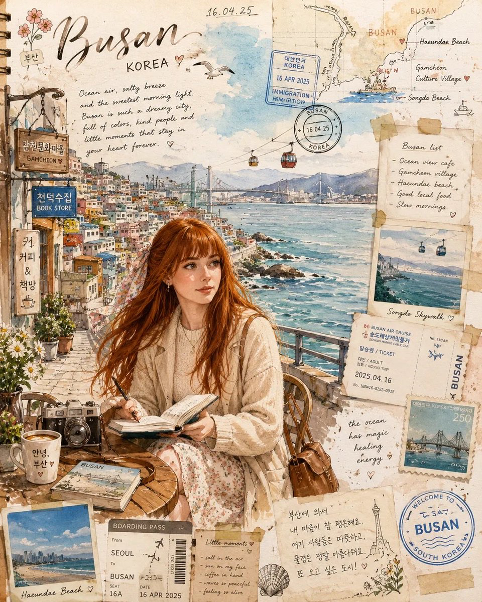</a>

```text
Create a dreamy handcrafted ({argument name="city" default="Busan"})travel journal illustration, as if painted in an artist’s personal sketchbook while traveling through ({argument name="country" default="KOREA"})
SCENE: A romantic Busan coastal setting inspired by Gamcheon Culture Village + Haeundae + Songdo seaside charm. Feature: oceanfront promenade gentle waves seagulls Korean seaside cafés pastel coastal buildings tiny fishing boats paper lantern accents boardwalk details colorful Busan hillside houses in the distance beach umbrellas ocean breeze atmosphere subtle Korean storefront signage travel discovery mood
SUBJECT: Place the woman from the uploaded reference naturally in the scene. Appearance: long flowing copper auburn hair moving softly in the sea breeze hazel-green eyes fair skin natural elegant expression soft thoughtful gaze
WARDROBE: romantic coastal travel styling cream knit sweater flowing midi skirt light trench coat or airy cardigan delicate scarf moving with wind comfortable elegant walking shoes
POSE OPTIONS: ((walking along the Busan seaside promenade)) OR ((sitting at a Korean seaside café sketching in a journal)) OR ((holding a travel journal while looking toward the ocean)) OR ((standing near the railing with wind in hair, candid cinematic pose))
STYLE: premium watercolor travel-journal illustration hand-drawn ink sketch detailing transparent watercolor washes aged textured paper pigment bleeding ink splatters vintage travel scrapbook aesthetic editorial artistic composition luxury Pinterest-worthy illustration
ADD SCRAPBOOK ELEMENTS: handwritten diary notes "BUSAN" "KOREA" tiny illustrated coastline map metro ticket fragments passport stamps vintage postage marks boarding pass scraps coffee stains botanical doodles hand-drawn arrows tiny seashell sketches travel annotations paper tape collage small Korean handwritten notes
COLOR PALETTE: soft ocean blue dusty aqua muted sand beige faded coral warm cream seafoam green soft terracotta accents washed watercolor neutrals LIGHTING: golden morning seaside sunlight airy coastal glow romantic atmospheric haze gentle cinematic warmth
 COMPOSITION: vertical travel journal page 4:5 aspect ratio ultra detailed cozy nostalgic storytelling peaceful romantic vacation mood
NEGATIVE PROMPT: CGI, photorealistic rendering, anime face, identity change, plastic skin, neon cyberpunk, futuristic objects, dark horror mood, distorted anatomy, extra limbs, messy cluttered composition, AI glitches, oversaturated colors
```

## by [serein](<https://x.com/you1873118>) on May 18, 2026 👉 [Try Now](https://indream.ai/generate?mode=IMAGE&modelKey=gpt-image-v2&modelPromptId=019e603e-009d-755a-b88b-60871c5dab07)

<a href="./public/images/64bcea3d-4415-4ba8-9928-f5187fc8d685.png" target="_blank" rel="noopener noreferrer">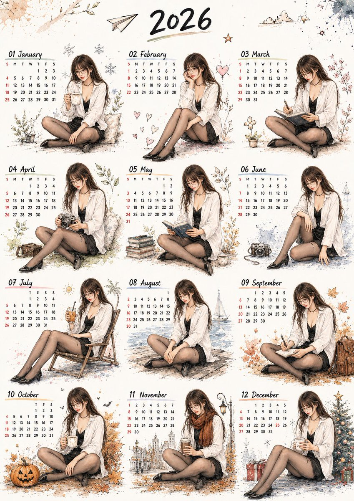</a>

```text
使用上传的第一张图作为【整体风格与版式参考】，使用上传的第二张图作为【人物身份参考】。

请生成一张完整的 {argument name="年份" default="2026"} 年全年日历插画海报。

画面风格：
保留参考图一的{argument name="画风" default="手绘水彩插画风格"}，温暖米白纸张背景，细腻墨线勾勒，柔和水彩晕染，轻微纸张纹理，带有季节感的小装饰元素，如花草、雪花、爱心、纸飞机、星星、云朵、树叶、相机、书本、咖啡杯、礼物、圣诞树等。整体氛围温柔、治愈、干净、生活感强，像一本手账风全年日历。

版式要求：
采用 3 列 × 4 行的全年月历排版，共 12 个月份。
顶部居中写大标题：“2026”，使用手写感黑色笔刷字体。
每个月份标题格式为：
“01 January”
“02 February”
“03 March”
一直到
“12 December”。

每个月份区域都包含：
1. 月份英文标题
2. 小型日历日期表
3. 一位人物插画
4. 对应季节的小场景装饰

人物要求：
将参考图一中的男性人物全部替换为参考图二中的女性人物。
保持参考图二人物的核心特征：
{argument name="人物特征" default="年轻亚洲女性，长棕黑色头发，空气刘海，戴细框眼镜，五官精致，表情温柔自然，略带安静、微醺、慵懒感"}。

人物服装参考：
宽松白色衬衫，黑色内搭，黑色短裙，黑色丝袜，黑色鞋子，细项链或 choker。
服装需要融入手绘水彩风，不要像照片硬贴上去。

每个月人物动作不同：
1 月：坐着捧热咖啡，冬日温暖感
2 月：托腮坐着，周围有爱心元素
3 月：低头写手账或笔记本
4 月：拿着复古相机
5 月：坐着看书，旁边有书堆 and 茶杯
6 月：休闲坐姿，旁边有相机和蓝色水彩装饰
7 月：坐在躺椅上喝冰饮，夏日感
8 月：坐在海边木栈道，远处有帆船
9 月：坐着写日记，旁边有背包和秋叶
10 月：喝咖啡，旁边有南瓜灯和万圣节元素
11 月：围着棕色围巾，手拿热咖啡，背景有城市街景
12 月：坐在圣诞树旁，手捧热饮，旁边有礼物盒

日历要求：
年份必须是 2026。
所有月份日期必须符合真实 2026 年日历。
星期排列为：
S M T W T F S
星期日和部分日期可使用红色点缀，其余为黑色。
日期尽量清晰可读，保持手写日历质感。

整体要求：
画面必须像一张完整的全年日历海报，而不是拼贴照片。
人物与背景要统一成同一种手绘水彩风格。
保持参考图一的原有构图、温柔季节感、手账插画质感和高级可爱氛围。
不要出现真实照片感，不要过度写实，不要赛博风，不要厚重油画风。
```

## by [donut sheep](<https://x.com/donut_sheep>) on May 18, 2026 👉 [Try Now](https://indream.ai/generate?mode=IMAGE&modelKey=gpt-image-v2&modelPromptId=019e603e-1f6c-76de-b43c-4faf693ab954)

<a href="./public/images/9e9dd3e3-78fd-48ed-95a8-0901d4809d7e.png" target="_blank" rel="noopener noreferrer">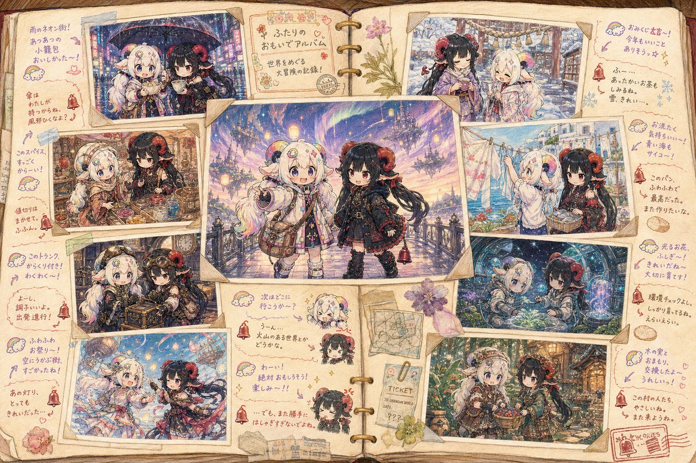</a>

```text
二人のキャラクターの参照画像
＋
「この二人のキャラクターの写真のセットを綴じたアルバム」のという形式の、{argument name="描画スタイル" default="色鉛筆で書いた淡い色のタッチ"}のイラストを作成してください。 中心に一枚の印象的な写真を配置して、それを他の写真が取り囲む構図。 様々な国や世界線を渡り歩いて、そこに適した服を着て、様々な生活・文化に根ざした行動をしている生き生きとした写真の数々。 それぞれが書いたと思われるラクガキや思い出のメモから見られる喜怒哀楽の感情。どちらが書いているのかわかりやすいシンボル付き。 ラクガキやメモ同士のやり取り。 髪型・装飾品は服装に合わせて自由に変更してください。
```

## by [Gadgetify](<https://x.com/Gdgtify>) on May 17, 2026 👉 [Try Now](https://indream.ai/generate?mode=IMAGE&modelKey=gpt-image-v2&modelPromptId=019e603f-4acb-77b8-ab6e-40e3361a10a7)

<a href="./public/images/363a39c3-d3be-490f-a9cc-790ede61a9be.png" target="_blank" rel="noopener noreferrer">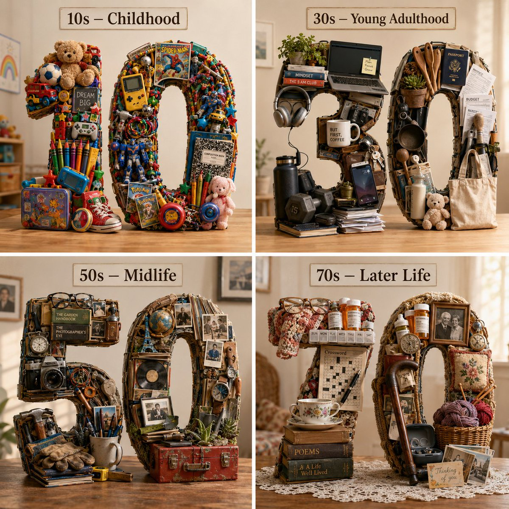</a>

```text
2x2 grid, 4 decades of a human life as typographic decade numerals Anchor: {argument name="life stages" default="[Decade Numeral] :: [Life Stage / Decade (e.g., Childhood 10s / Midlife 40s / Old Age 70s)]"} :: 4 Morphology: 3D typographic sculpture of [Decade Numeral], form assembled from a dense pile of [Life Stage] objects — the physical texture of daily life at that age: toys, tools, documents, comfort objects, medical items, hobby equipment — nostalgic, honest, legible :: 3 Material Physics: Textures faithful to the objects of that life stage: worn plastic, laminated paper, soft cotton, scratched metal, prescription-bottle translucent orange, aged photo print; scale and wear appropriate to how those objects are actually held and used :: 3 Illumination: Warm domestic lighting — like afternoon sun through a home window, soft fill from the opposite side, clean light background :: 2 Render Stack: Cinema 4D render, front-facing, 8k, tactile domestic-material shaders :: 1 Negative: [Illegible, 2D, flat, generic stock-photo aesthetic, floating, clinical or cold lighting, objects not specific to the age] :: -1
```

## by [miwa | AIイラスト・音楽](<https://x.com/LastM07>) on May 17, 2026 👉 [Try Now](https://indream.ai/generate?mode=IMAGE&modelKey=gpt-image-v2&modelPromptId=019e6041-fa41-7449-9257-1552e6d42007)

<a href="./public/images/e5c86a0a-b60d-4d90-99d2-29b891c56797.png" target="_blank" rel="noopener noreferrer">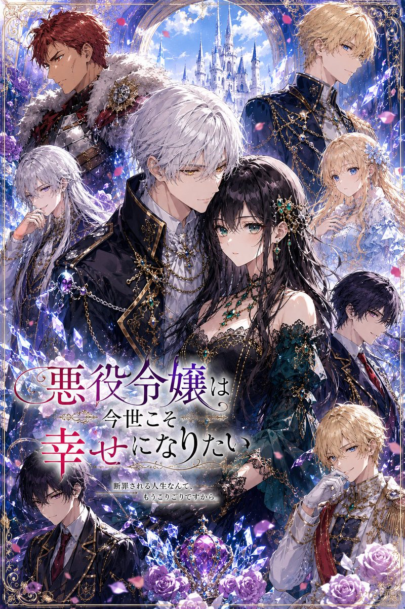</a>

```text
Goal: Create a richly detailed Japanese fantasy light-novel cover illustration for a royal villainess romance story, with an ornate ensemble cast arranged around a dramatic central heroine and a fairy-tale castle backdrop.

Canvas: Vertical book-cover composition, 2:3 aspect ratio, polished anime illustration style, extremely detailed, luminous jewel tones, elegant shoujo fantasy atmosphere, no modern objects.

Layout: Use a dense poster-like composition with exactly 9 visible characters layered in depth around the page. The central lower-right figure is the main heroine, surrounded by noble men and women in a royal court setting. Place a white castle with tall blue spires in the upper center background, framed by a grand arched window or palace arch. Add an ornate gold filigree border around all edges. Scatter glowing blue-purple crystal shards, pink rose petals, and magical sparkles throughout the image. Place the main Japanese title across the lower-left to center area, partially overlapping the characters, with a small subtitle beneath it.

Characters: Include exactly 9 characters: 1) central heroine, a glamorous black-haired noblewoman in a dark emerald and black off-shoulder gown with lace, gold chains, emerald jewelry, jeweled hair ornaments, and a poised villainess aura; 2) central white-haired nobleman in a black military-style coat with gold trim, chains, brooches, and a serious romantic-lead presence; 3) top-left red-haired armored knight in dark red and silver armor with a fur mantle and jeweled shoulder ornament; 4) top-right blond prince in a navy-blue high-collared uniform with elaborate gold chains and epaulets; 5) left-side silver-haired lady in a dark navy noble outfit, elegant and reserved; 6) right-side blonde princess in a pale blue frilled gown with floral hair accessories; 7) mid-right dark-haired nobleman in a dark suit with red tie, partially turned away; 8) bottom-left black-haired young nobleman in a black suit with gold trim and a red tie, looking intense; 9) bottom-right blond nobleman in a white-and-gold ceremonial uniform with red sash, gloved hand near his face. Keep all faces beautiful anime-style and expressive.

Text content: Add the large Japanese title {argument name="headline text" default="悪役令嬢は 今世こそ 幸せになりたい"} in elegant calligraphic typography, with the first and last major words in deep red and purple gradients and the smaller connecting words in black. Add the small subtitle {argument name="subtitle text" default="断罪される人生なんて、もうこりごりですから。"} centered below the title in delicate black Japanese type. Decorative flourishes should surround the text like a real fantasy novel cover.

Visual style: Highly polished romantic anime cover art, intricate linework, glossy highlights, sparkling magical crystals, purple roses at the bottom, lavish gold ornaments, cinematic lighting, soft sky-blue and violet background, dramatic depth, luxurious royal-fantasy mood. Use {argument name="main heroine hair color" default="long glossy black"} hair for the heroine, {argument name="central male hair color" default="silver white"} hair for the main male lead, and {argument name="overall color palette" default="royal navy, violet, emerald, gold, and icy blue"} as the dominant palette.

Constraints: Make it look like a finished Japanese fantasy romance novel cover, not a character sheet. Preserve exactly 9 characters, one castle, one ornate border, many crystals, many rose petals, and several purple roses at the bottom. Do not add logos, watermarks, author names, barcode, or extra text beyond the title and subtitle.
```

## by [Mr. Tariq](<https://x.com/AiWithTariq>) on May 17, 2026 👉 [Try Now](https://indream.ai/generate?mode=IMAGE&modelKey=gpt-image-v2&modelPromptId=019e6043-bf06-764e-9c24-21681a50ec8f)

<a href="./public/images/d06654ee-00fa-4f72-9aa8-71b928fdb897.png" target="_blank" rel="noopener noreferrer"></a>

```text
Goal: Create an ultra-detailed cinematic 3D digital poster for a social media content creator, centered on a stylish young man squatting confidently in a futuristic neon-lit studio dominated by Facebook-like branding.

Canvas: Vertical poster, 3:4 aspect ratio, high-resolution glossy 3D render, deep electric-blue color palette, bright white neon highlights, reflective black-blue floor, shallow depth of field, dramatic rim lighting, floating holographic UI elements, energetic social-media atmosphere.

Main subject: A fashionable young man with short dark hair and modern styling, face intentionally covered by a soft rectangular blur/mosaic censor block. He is squatting in a confident pose, one arm resting across his knee and one hand hanging relaxed. Outfit: shiny {argument name="jacket color" default="electric blue"} oversized puffer jacket with a small white “facebook” wordmark on the chest, white T-shirt, fitted blue jogger pants, and custom blue-and-white high-top sneakers. The sneakers have a bold lowercase {argument name="platform logo letter" default="f"} on the side panels. Make the fabric glossy and premium, with realistic folds and reflections.

Background centerpiece: A huge glowing white lowercase {argument name="platform logo letter" default="f"} standing behind the subject like a luminous monument, with thick 3D depth and blue rim glow.

Foreground title typography: Across the lower center, overlay a large elegant glowing cursive signature reading {argument name="character name" default="Mr Tariq"}. Directly below it, add smaller futuristic block lettering reading {argument name="role text" default="CONTENT CREATOR"}. Both text layers should be bright neon blue-white and partially overlap the subject’s legs.

Left-side holographic analytics panels: Include exactly 4 stacked rectangular blue neon dashboard cards with these visible labels and values: 1) “9.8K Likes” with a rising line chart and arrow, 2) “Engagement +256% vs last month” with vertical bar chart, 3) “Followers 125K Total Audience” with two-person icon, 4) “Content Reach 2.4M People Reached” with rising line chart. Beneath them, include exactly 4 smaller rounded motivational buttons: 1) “Imagine — Visualize your dreams” with star icon, 2) “Create — Make it happen” with compass/target icon, 3) “Inspire — Motivate others” with spark icon, 4) “Elevate — Reach new heights” with rocket icon.

Right-side holographic panels: Include exactly 4 small floating message cards: 1) “Stay Focused — Keep Creating”, 2) “Dream Big — Work Smart”, 3) “No Limits — Just Passion”, 4) “Messages 99+ — New Messages”. Style them as glowing rounded blue speech bubbles with tiny icons.

Floating social reactions: Add exactly 12 visible reaction elements distributed around the scene: 4 thumbs-up icons, 3 heart icons, 3 laughing-face emojis, 1 small profile notification dot, and 1 chat/message bubble. Include a large 3D blue thumbs-up cube in the bottom-left foreground and a partially cropped red heart reaction sphere in the bottom-right foreground.

Visual style: Hyper-polished cinematic 3D advertising poster, glossy blue neon reflections, volumetric light beams, bokeh particles, holographic UI glow, futuristic creator economy aesthetic, crisp typography, premium render quality, no extra people, no watermark, no unintended text.
```

## by [Shemakookie](<https://x.com/VirgowatiShema>) on May 17, 2026 👉 [Try Now](https://indream.ai/generate?mode=IMAGE&modelKey=gpt-image-v2&modelPromptId=019e6049-4518-76c2-88d7-dc03efc0949c)

<a href="./public/images/5eebdee5-d9a9-41f5-a181-ab17cfbdcfa8.png" target="_blank" rel="noopener noreferrer">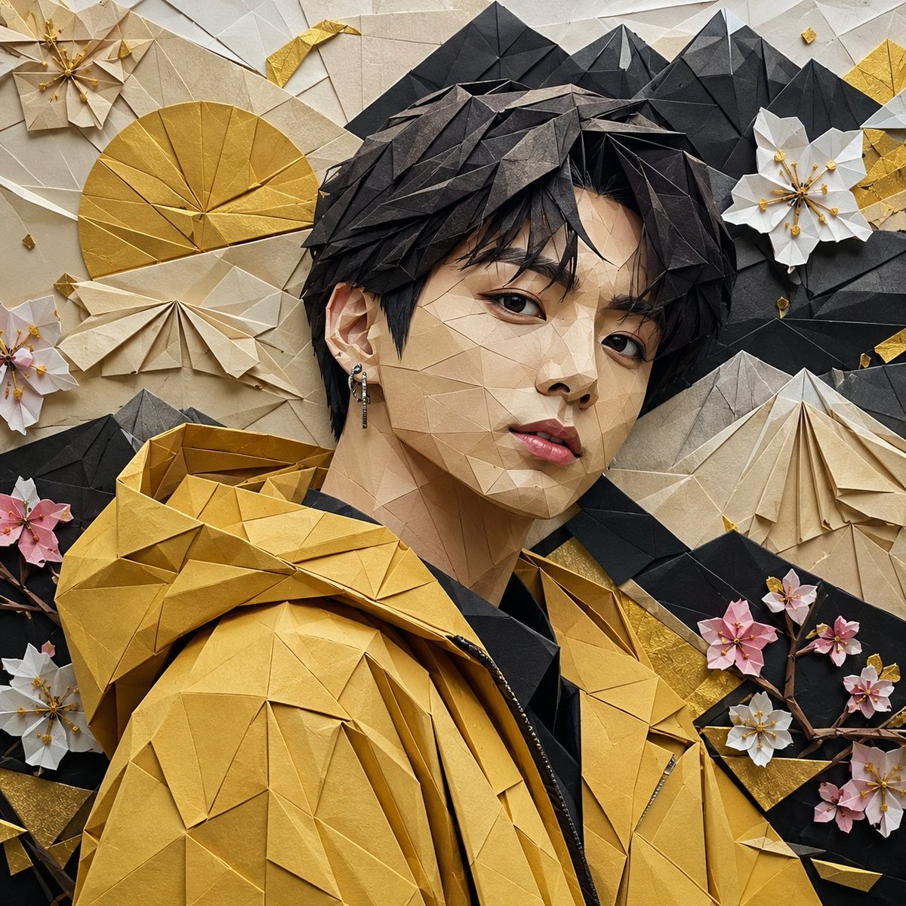</a>

```text
Create a square 1:1 ultra-detailed origami paper-craft portrait of {argument name="character name" default="a stylish young Korean pop idol"} shown from the chest up in a three-quarter profile facing right, with the facial area deliberately covered by a smooth centered square censor block in a warm taupe-brown gradient. The subject has layered tousled {argument name="hair color" default="black"} hair made from sharp folded paper facets, a visible left ear with two dangling silver earrings, and a dramatic angular {argument name="jacket color" default="metallic gold"} hooded jacket over a black inner shirt, all constructed from folded triangular paper panels with crisp creases, shadows, and realistic handmade texture. The background is an ornate Japanese-inspired origami collage with black and charcoal mountains, cream paper planes, gold foil accents, and exactly 3 large fan or sunburst shapes: one gold semicircle at upper left, one cream folded fan at left center, and one cream folded fan at right center. Include exactly 12 visible origami flowers: 2 large white flowers with gold stamens at the upper left and upper right, 1 small pale pink flower on the left edge, 2 pink flowers near the lower-left edge, 5 pink cherry blossoms on the lower-right branch, and 2 white cherry blossoms on the lower-right branch. Use a premium editorial fashion-poster composition, shallow paper-relief depth, warm studio lighting, high contrast between matte black paper and metallic gold paper, intricate crease lines, handcrafted shadows, and no readable text or watermark. Keep the face censor square clean and flat while the rest of the image remains highly detailed.
```

## by [Aaditya Barak](<https://x.com/aadi29494>) on May 17, 2026 👉 [Try Now](https://indream.ai/generate?mode=IMAGE&modelKey=gpt-image-v2&modelPromptId=019e604b-8de0-7113-bc92-b851fe2e5e87)

<a href="./public/images/ffba758f-c3f0-467b-a54e-77f3b3e61cc7.png" target="_blank" rel="noopener noreferrer">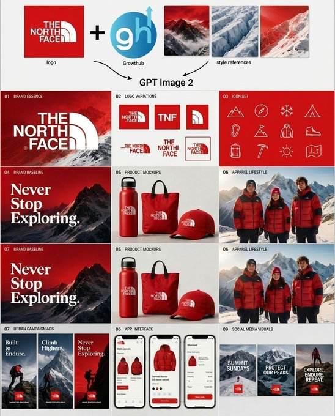</a>

```text
Goal: Create a clean square brand-kit presentation board showing an AI-generated logo system and marketing variations for {argument name="brand name" default="The North Face"}, combining an uploaded logo, an AI tool logo, and mountain style references into a complete visual identity system.

Canvas: Square 1:1 layout on a light gray/off-white background, designed like a polished agency case-study sheet. Use crisp grid lines, generous margins, and a modern editorial branding style.

Top input row: Show exactly 5 input elements across the top: 1 red square brand logo tile for {argument name="brand name" default="The North Face"}; 1 large black plus sign; 1 circular blue logo marked “gh” with a small upward arrow and the label “Growthub”; and 3 vertical mountain style-reference thumbnails in red, blue-white glacier, and red snowy mountain palettes. Add small captions under the logo and style references. Beneath this row, draw two curved black arrows pointing down toward the centered text “GPT Image 2”.

Main layout: Below the header, create a 3-column by 4-row grid of exactly 12 brand-kit panels, each with a tiny numbered label in the upper-left corner and a bold section title. The overall palette is red, white, black, ice blue, and mountain gray, with premium outdoor expedition energy.

Panel count and content:
1. “01 Brand Essence”: large red poster-style panel with a snowy mountain background and oversized white {argument name="brand name" default="The North Face"} logo lockup.
2. “02 Logo Variations”: white panel showing exactly 6 logo variations: full red-square logo, red square with “TNF”, red square with arch symbol only, horizontal wordmark with arch, stacked wordmark, and small boxed lockup.
3. “03 Icon Set”: red panel with exactly 12 thin white line icons arranged in a 4-by-3 grid: mountain, compass, snowflake, tent, carabiner, flag, parka jacket, hiking boot, backpack, ice axe, sun, and folded map.
4. “04 Brand Baseline”: dark red mountain poster with large serif white slogan text “Never Stop Exploring.”
5. “05 Product Mockups”: white product mockup panel with exactly 3 red branded items: water bottle, tote bag, and baseball cap.
6. “06 Apparel Lifestyle”: photorealistic outdoor apparel scene with exactly 3 people wearing red and black expedition jackets in snowy mountains.
7. “07 Brand Baseline”: repeat the dark red mountain slogan poster, again reading “Never Stop Exploring.”
8. “05 Product Mockups”: repeat the same white panel with exactly 3 red branded products: bottle, tote, and cap.
9. “06 Apparel Lifestyle”: repeat the same snowy mountain lifestyle panel with exactly 3 red-jacketed people.
10. “07 Urban Campaign Ads”: show exactly 3 tall vertical ad posters with mountain climbers and red logo blocks, titled “Built to Endure.”, “Climb Higher.”, and “Never Stop Exploring.”
11. “08 App Interface”: show exactly 3 smartphone screens for an outdoor shopping app, featuring red jackets, product cards, checkout UI, red buttons, and clean white mobile interface design.
12. “09 Social Media Visuals”: show exactly 3 square social media tiles with snowy mountain backgrounds, red logo blocks, and white text: “SUMMIT SUNDAYS”, “PROTECT OUR PEAKS”, and “EXPLORE. ENDURE. REPEAT.”

Visual style: Mix photorealistic mountain photography with crisp vector logo work, minimal product mockups, thin white iconography, and luxury outdoor-brand art direction. Use red gradient overlays, snow textures, high contrast typography, and neat case-study spacing. Keep the design readable at a glance, with no extra panels, no watermarks, and no unrelated text.
```

## by [輝鳴紅葉🫧🌸シャボン玉のバーチャルビデオ屋](<https://x.com/terunari>) on May 17, 2026 👉 [Try Now](https://indream.ai/generate?mode=IMAGE&modelKey=gpt-image-v2&modelPromptId=019e604b-cffb-7034-b8a9-915acad19c18)

<a href="./public/images/3e186ed3-02d4-404d-bb3d-67f1337bbcff.png" target="_blank" rel="noopener noreferrer">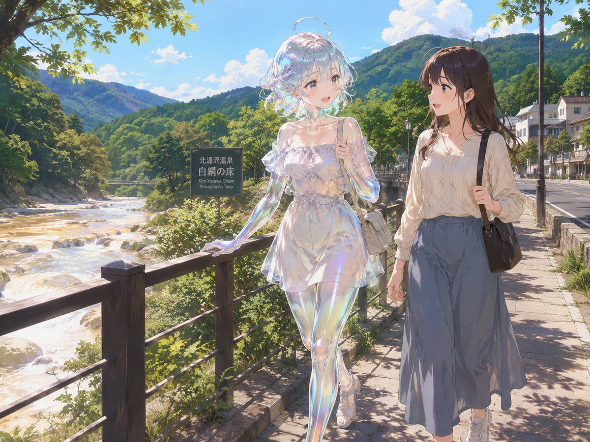</a>

```text
Create a sunlit anime-style travel illustration at {argument name="location" default="Kitayuzawa Onsen, Shiroginu no Toko riverside promenade"} in a lush Japanese mountain hot-spring town. The scene shows exactly two young women walking side by side on a stone sidewalk beside a wooden riverside railing: the left figure is {argument name="main character" default="a transparent soap-slime girl with a hollow glassy body, thick iridescent bubble-like membrane skin, rainbow highlights, short translucent pearly hair, and a floating soap-bubble halo"}, wearing a sheer off-shoulder frilly white summer dress, sandals, and a small pale shoulder bag, with one hand resting on the railing; the right figure is {argument name="companion character" default="a normal human young woman with long brown hair"}, wearing a cream blouse, a long blue-gray skirt, white sneakers, and carrying a black shoulder bag. Include exactly two shoulder bags, one pale bag on the slime girl and one black bag on the companion. Their faces are intentionally covered by soft rectangular beige blur masks, while the rest of the image is highly detailed. Behind them is a bright river with white rapids and rocks on the left, dense green forest, layered mountains, a vivid blue sky with puffy white clouds, and small roadside buildings on the right. Add exactly one dark roadside sign near the river reading 「北湯沢温泉」, 「白絹の床」, and small romanized text “Kita-Yuzawa Onsen / Shiroginu no Toko.” Use polished GPT-image anime realism, delicate linework, luminous summer lighting, dappled tree shadows, sparkling reflections on the slime body, and a peaceful sightseeing atmosphere. Aspect ratio 4:3.
```

## by [serein](<https://x.com/you1873118>) on May 17, 2026 👉 [Try Now](https://indream.ai/generate?mode=IMAGE&modelKey=gpt-image-v2&modelPromptId=019e604c-8577-7196-80a1-62a46d930300)

<a href="./public/images/e0a9df6e-3c9b-4dac-bff9-75e22b9c0091.png" target="_blank" rel="noopener noreferrer">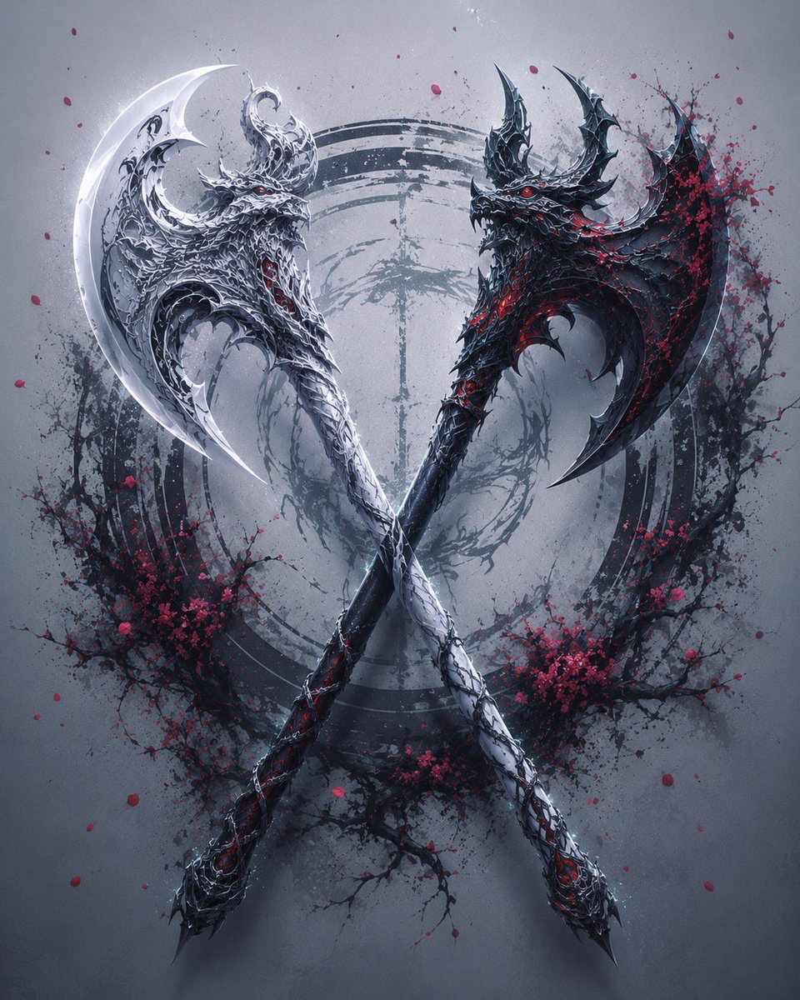</a>

```text
Create a highly detailed Eastern dark fantasy weapon concept poster showing exactly 2 ancient Chinese-style polearm weapons crossed into a symmetrical X composition. Both weapons must be fully visible from blade tip to handle end, centered like a collector-grade weapon design sheet. The left weapon is {argument name="left weapon material" default="bright silver-white engraved metal"}, with a pale crescent axe blade, dragon-scale carving, horned beast-head details, layered ornate metalwork, and subtle red gem accents. The right weapon is {argument name="right weapon material" default="blackened steel with crimson inner glow"}, with a darker crescent axe blade, jagged demonic spikes, dragon-like carved armor plates, red fissures, and glowing red eye-like accents. The two long handles cross near the center and taper to pointed, decorated spear-like butt ends. Use a cold matte gray misty background with a huge circular ink-brush magic array behind the weapons, painted in dark gray Chinese ink strokes. Add exactly 2 clusters of black plum blossom branches with vivid red blossoms, one on the lower left and one on the lower right, plus scattered red petals floating around the composition. Style: premium dark fantasy, Eastern ink painting atmosphere, intricate metallic engraving, sharp high-contrast edges, realistic concept art rendering, dramatic soft shadows, faint fog, symmetrical centered layout, no text, no people, no watermark.
```

## by [serein](<https://x.com/you1873118>) on May 17, 2026 👉 [Try Now](https://indream.ai/generate?mode=IMAGE&modelKey=gpt-image-v2&modelPromptId=019e604c-c6fb-73ae-87dd-b507f07378ad)

<a href="./public/images/891a9fd3-bd54-4c9c-9066-c337738f2182.png" target="_blank" rel="noopener noreferrer"></a>

```text
Create a high-detail dark Eastern fantasy weapon concept poster featuring exactly two ancient Chinese poleaxe or halberd-like weapons crossed in an X composition, fully visible from blade tips to handle ends, centered and symmetrical like a collectible sect-treasure weapon design sheet. The two weapons should contrast as one white/silver weapon on the left and one black/dark steel weapon on the right. Each weapon has a long ornate shaft, dragon-scaled metal carving, a monstrous dragon-head transition near the blade, glowing red gem-like eyes, and a huge crescent axe blade curving outward at the top; the left blade is bright polished silver with icy white highlights and intricate engraved filigree, while the right blade is blackened steel with jagged demonic edges, dark blue-gray highlights, and glowing deep red vein patterns. The crossed handles meet at the center lower half, forming a dramatic X, with pointed spear-like pommels at the bottom. Use a premium dark fantasy + Chinese ink wash + engraved metal concept art style, extremely detailed, cinematic, sharp, moody, and symmetrical. Background: cold gray matte mist texture with a large circular black ink-brush talisman or magic formation behind the weapons, concentric rough brush rings and splattered ink. Add black plum blossom branches spreading around the lower sides and behind the weapons, with many dark red plum blossoms and scattered red petals floating across the scene. Lighting should be soft but dramatic, with metallic rim light, subtle glow from red accents, volumetric mist, high contrast, no characters, no text, no watermark. Customizable elements: {argument name="weapon type" default="ancient Chinese dragon halberds"}, {argument name="left weapon color" default="white silver"}, {argument name="right weapon color" default="black steel with red veins"}, {argument name="background symbol" default="large circular ink-brush talisman"}, {argument name="flower accent" default="dark red plum blossoms"}.
```

## by [小小东](<https://x.com/xiaoxiaodong01>) on May 16, 2026 👉 [Try Now](https://indream.ai/generate?mode=IMAGE&modelKey=gpt-image-v2&modelPromptId=019e605b-45f9-70ff-894f-c4536dce1c61)

<a href="./public/images/3c362629-7f9a-4d54-b9ef-26c400ef34c1.png" target="_blank" rel="noopener noreferrer">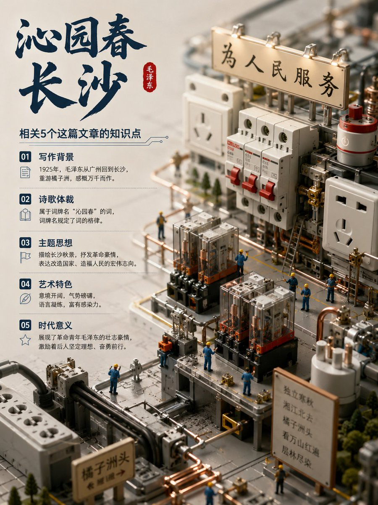</a>

```text
Goal: Create a vertical Chinese educational poster that combines a miniature LEGO-like electrical components diorama with a study-note infographic about the poem {argument name="poem title" default="沁园春 长沙"}.

Canvas: Portrait 3:4 poster, warm beige background, premium editorial layout. Left side is a clean information panel; right and lower area is a realistic macro miniature scene made from electrical hardware parts arranged like a tiny industrial city.

Layout: Large dark navy brush-calligraphy title at the upper left reading “沁园春” on the first line and “长沙” on the second line, with a small vertical red seal beside it reading “毛泽东”. Under the title, add the subtitle “相关5个这篇文章的知识点”. Beneath the subtitle, create exactly 5 stacked knowledge cards, each with a navy numbered square, a small line icon, a bold heading, and two short lines of explanatory Chinese text. The 5 cards must be labeled exactly: 01 写作背景, 02 诗歌体裁, 03 主题思想, 04 艺术特色, 05 时代意义. Use fine divider lines and a subtle circuit-trace decoration near the subtitle.

Miniature electrical diorama: On the right side, build a highly detailed tabletop scene using electrical spare parts as if they were LEGO architecture: white wall sockets, circuit breakers with red toggle switches, relays, terminal blocks, capacitors, metal rails, copper pipes, black cables, transparent fuse blocks, gray platforms, and tiny bolts. Include a prominent wooden sign at the upper right mounted above circuit components reading {argument name="main sign text" default="为人民服务"}. Add a large wall socket on the right edge and another socket block toward the upper middle-left. Add exactly 10 tiny worker figurines in blue uniforms and yellow hard hats positioned around the machinery, standing on platforms, beside relay towers, and near copper pipe routes. Add small model trees around the edges to make the electrical parts feel like a miniature city.

Additional visible signs: Add exactly 2 smaller wooden placards in the lower half of the diorama. One near the bottom-left foreground reads “橘子洲头” with a small arrow. One near the lower-right foreground contains several short vertical Chinese lines suggesting poem-related notes; keep it legible but secondary.

Visual style: Photorealistic macro photography mixed with infographic design, shallow depth of field, warm studio lighting, crisp focus on the central electrical components, softly blurred background, realistic plastic, ceramic, copper, and metal textures. Color palette: cream beige, dark navy ink, copper orange, electrical white, gray metal, red switch accents, and small blue-yellow worker figures.

Constraints: Use Chinese text exactly where specified, keep the left infographic clean and readable, maintain exactly 5 knowledge cards and exactly 10 worker figurines, avoid random extra titles or watermarks, and make the electrical spare parts look playfully modular like LEGO while still recognizable as real electrical hardware.
```

## by [輝鳴紅葉🫧🌸シャボン玉のバーチャルビデオ屋](<https://x.com/terunari>) on May 16, 2026 👉 [Try Now](https://indream.ai/generate?mode=IMAGE&modelKey=gpt-image-v2&modelPromptId=019e605b-72bd-74b3-9a1c-c4439c289759)

<a href="./public/images/951c6c9a-d2a8-4782-aafe-5278f251ab87.png" target="_blank" rel="noopener noreferrer">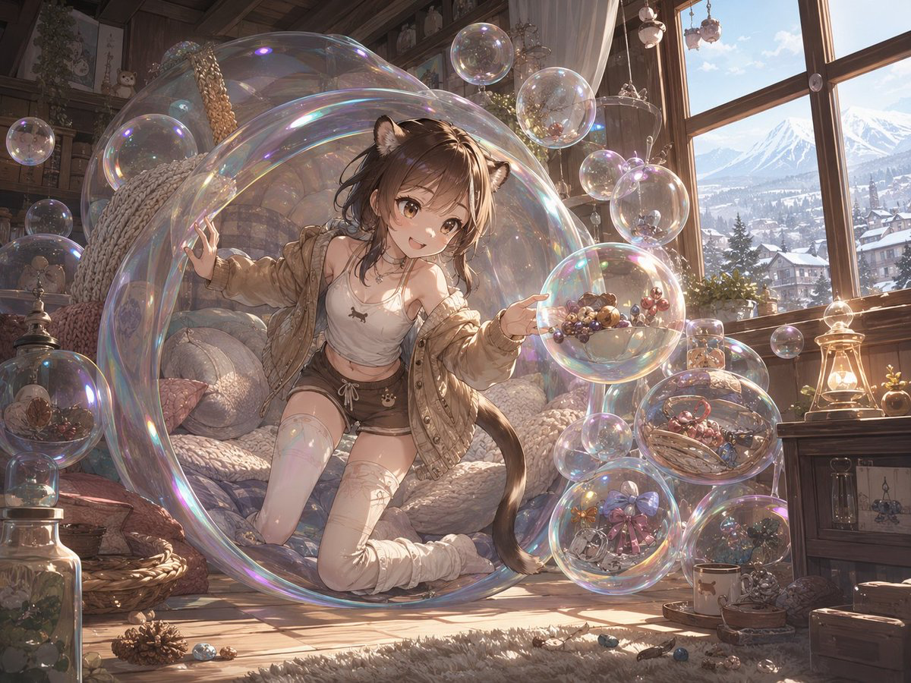</a>

```text
{argument name="種族" default="イタチのシャボン玉の夢の種族"}。能力や生活様子を自由に作って。
```

## by [白亜@AIチャット民](<https://x.com/hono9rayray>) on May 16, 2026 👉 [Try Now](https://indream.ai/generate?mode=IMAGE&modelKey=gpt-image-v2&modelPromptId=019e605b-d399-76df-89a3-a1d0f73c4942)

<a href="./public/images/1fa955fb-0500-4503-92e0-3f0e1467185e.png" target="_blank" rel="noopener noreferrer">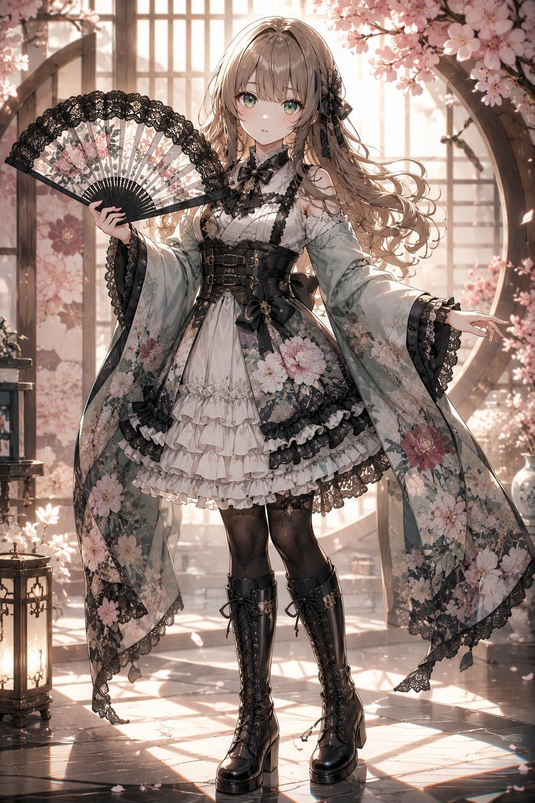</a>

```text
{argument name="和服スタイル" default="振袖和ロリ"}、レース、フリル、{argument name="ベルト" default="革ベルト"}、タイツ、{argument name="靴" default="編み上げロングブーツ"}
```

## by [のぞむ＊AIイラスト](<https://x.com/ArtistaNozomu>) on May 16, 2026 👉 [Try Now](https://indream.ai/generate?mode=IMAGE&modelKey=gpt-image-v2&modelPromptId=019e605c-e749-7496-b00b-04693fe9f666)

<a href="./public/images/92257dcb-1696-4e76-9108-dbcf2ed7a4b9.png" target="_blank" rel="noopener noreferrer">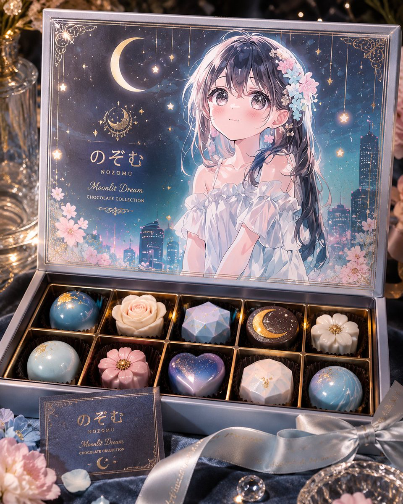</a>

```text
Create a premium luxury patisserie product photograph of a limited-edition chocolate box inspired by an original anime-style girl character named {argument name="character name" default="Nozomu"}. The box is open on an elegant dark satin tabletop with crystal glassware, soft flowers, scattered sparkles, and a pale satin ribbon, photographed like a real high-end department-store confectionery gift set. The inside lid features a large illustrated package design: a dreamy moonlit night sky with teal-to-navy gradient, crescent moon, hanging gold stars, city skyline silhouettes, ornate gold corner filigree, pale pink and blue flowers, and an anime girl with long dark bluish-black hair with pink highlights, floral hair accessories, and an off-shoulder white ruffled dress; leave the face unobstructed in the generated image unless a privacy-safe blank face placeholder is desired. Add elegant gold Japanese-style branding text on the lid: {argument name="main name text" default="のぞむ"}, small romanized text {argument name="romanized name text" default="NOZOMU"}, script subtitle {argument name="collection title" default="Moonlit Dream"}, and small uppercase text "CHOCOLATE COLLECTION". In the lower tray, show exactly 10 luxury chocolates in a 2-by-5 grid with gold dividers and black paper cups: 1 glossy sky-blue dome with gold leaf, 2 cream rose-shaped chocolate, 3 faceted pale blue crystal chocolate, 4 dark round chocolate with gold crescent moon and starry night surface, 5 white daisy flower chocolate with gold center, 6 pale blue-white speckled dome, 7 pink flower chocolate with gold center, 8 glossy purple-blue heart chocolate with tiny star speckles, 9 faceted pale blush crystal chocolate with gold flecks, and 10 sky-blue marbled dome with gold constellation lines. Include a matching small display card in front of the box with the same branding text and moon motif. Use soft cinematic lighting, shallow depth of field, realistic reflections, delicate gold foil details, pastel celestial palette, ultra-detailed premium packaging, and a romantic fantasy luxury chocolate aesthetic. Avoid extra chocolates, avoid modern logos, avoid cluttered typography, and keep the box and all 10 chocolates sharply visible.
```

## by [Smiling Khan](<https://x.com/AIwithkhan>) on May 16, 2026 👉 [Try Now](https://indream.ai/generate?mode=IMAGE&modelKey=gpt-image-v2&modelPromptId=019e6063-21c9-74cd-b32e-4ee01b3e65d2)

<a href="./public/images/b259304f-ebeb-460d-879e-ed2f9b0c1a67.png" target="_blank" rel="noopener noreferrer">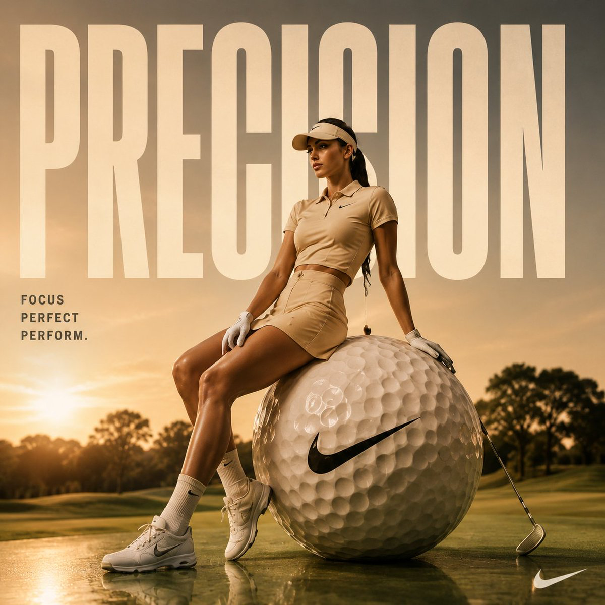</a>

```text
Luxury {argument name="theme" default="golf fashion campaign"} at golden hour on a premium golf course, athletic {argument name="subject" default="female golfer"} in elegant beige monochrome sportswear sitting confidently on a giant oversized golf ball with a black swoosh logo, cinematic sunset lighting, glossy reflections on wet grass, huge bold typography reading “{argument name="text" default="PRECISION"}” in the background, minimal luxury sports branding, warm golden tones, editorial magazine composition, dramatic shadows, ultra realistic skin texture, premium athletic aesthetic, high-fashion sports advertisement, shallow depth of field, clean composition, hyper detailed realism, 8k quality
```

## by [のとろ](<https://x.com/notoro_ai>) on May 16, 2026 👉 [Try Now](https://indream.ai/generate?mode=IMAGE&modelKey=gpt-image-v2&modelPromptId=019e6064-32bd-72d6-ad7f-cd0b27bc6b9a)

<a href="./public/images/6dc557b5-7942-49f5-ab40-6c0ed0f73da1.png" target="_blank" rel="noopener noreferrer">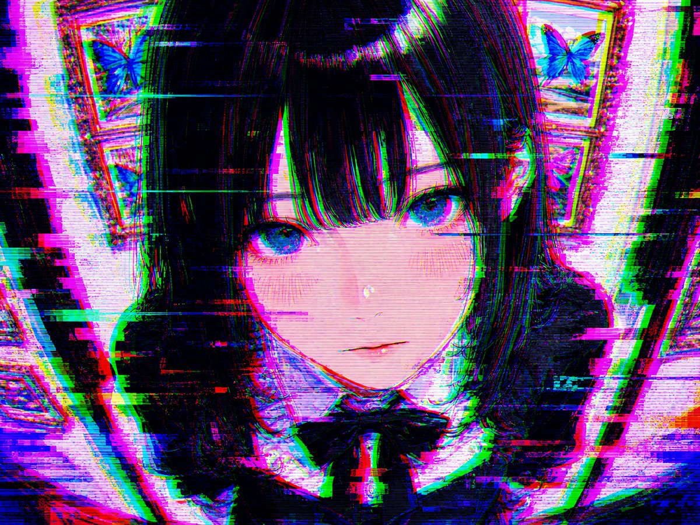</a>

```text
{argument name="被写体" default="このイラスト"}を、非常に強烈なグリッチアートで変換してください。激しいRGB分離、大きな色ずれ、水平スキャンラインの乱れ、ブロック崩壊、強いピクセル化とノイズを大胆に適用。ただしキャラクターの顔や表情は比較的認識できる範囲に留め、全体を美しく壊れたような芸術的なグリッチにしてください。 ネオンカラーの色ずれとデジタルエラーの美しさを強調し、圧倒的な強グリッチスタイルに。元の構図・キャラクターを基に激しく歪めてください。
```

## by [Horus He](<https://x.com/cyberhoruss>) on May 16, 2026 👉 [Try Now](https://indream.ai/generate?mode=IMAGE&modelKey=gpt-image-v2&modelPromptId=019e6065-cff1-7244-9a87-1638d39f1126)

<a href="./public/images/13fe844a-4566-474a-b042-de0469d63ef1.png" target="_blank" rel="noopener noreferrer">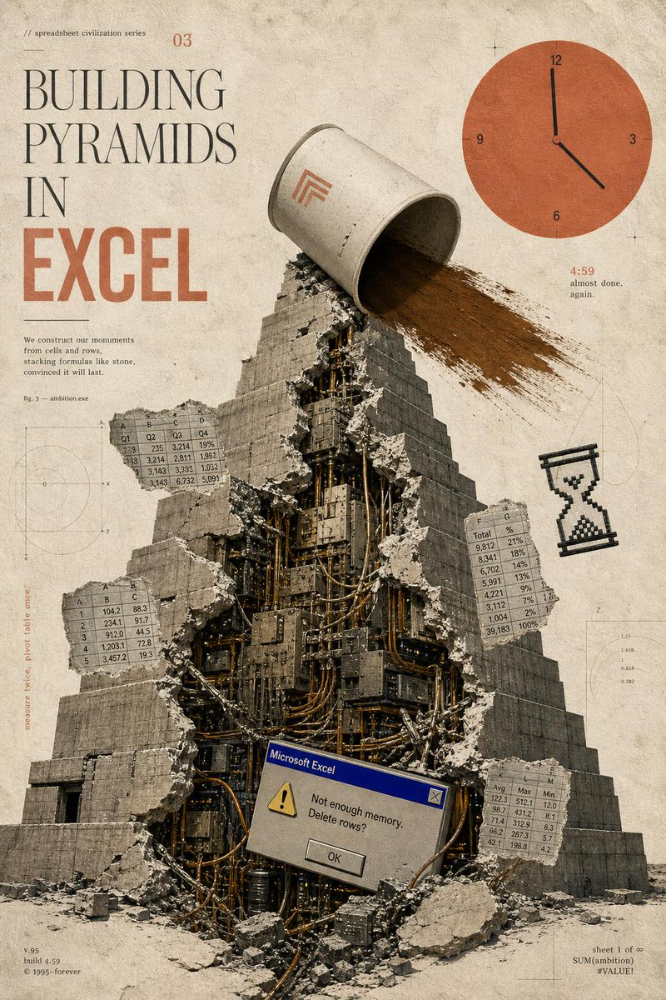</a>

```text
Goal: Create a surreal vintage editorial poster for a fictional “spreadsheet civilization series” about {argument name="headline concept" default="BUILDING PYRAMIDS IN EXCEL"}, combining ancient monumental architecture with obsolete office software anxiety.

Canvas: Vertical poster, 2:3 ratio, aged cream paper background with stains, dust, scratches, faint technical drafting marks, thin registration crosses, and muted sepia tones. Use a distressed printed-magazine texture, like an archival science pamphlet mixed with brutalist collage art.

Layout: Large typography occupies the upper-left quadrant. A monumental stepped pyramid fills the center and lower half, viewed from slightly below, with rubble at the base. The upper-right quadrant contains a large flat orange clock graphic. Small spreadsheet tables, diagrams, and marginal notes float around the pyramid like technical annotations.

Main subject: A massive gray stone stepped pyramid, cracked open vertically down the front. The broken opening reveals a dense mechanical interior made of dark metal panels, cables, pipes, servers, wires, and industrial machinery. Concrete chunks and debris scatter outward. At the top of the pyramid, a large tipped-over off-white bucket or cylindrical container pours a wide stream of brown sand or dirt down the right side of the pyramid. Put a small minimalist orange geometric logo on the bucket.

Typography and visible text: Upper-left small text reads “// spreadsheet civilization series” and a small issue number “03”. The main title is stacked in tall elegant serif type: “BUILDING” then “PYRAMIDS” then “IN”, with “EXCEL” below in very large bold condensed orange block letters. Add a small paragraph under the title: “We construct our monuments from cells and rows, stacking formulas like stone, convinced it will last.” Add “fig. 3 — ambition.exe” nearby. Bottom-left small footer text: “v.95”, “build 4.59”, “© 1995–forever”. Bottom-right small footer text: “sheet 1 of ∞”, “SUM(ambition)”, “#VALUE!”. Near the clock, include “4:59” in orange and the tiny caption “almost done. again.” Add a vertical margin note on the left that reads “measure twice, pivot table once.”

Discrete elements to include exactly: 1 central broken pyramid; 1 tipped bucket pouring sand; 1 orange clock in the upper right with numbers 12, 3, 6, 9 and black hands indicating roughly 4:59; 1 pixelated black hourglass icon on the right side; 1 Microsoft Excel-style error dialog near the lower center of the pyramid; 4 floating spreadsheet table fragments. The 4 spreadsheet fragments are: a top-left fragment labeled with columns A, B, C, D and rows of decimal values; a left-middle fragment with columns A, B, C and rows 1–5; a right-middle fragment with columns F, G and rows labeled “Total” plus percentages; a bottom-right fragment with columns K, L, M and labels like Avg, Max, Min.

Error dialog detail: Make the dialog look like an old Windows 95 Microsoft Excel alert box with a blue title bar reading “Microsoft Excel”, a yellow warning triangle, the message “Not enough memory. Delete rows?”, and a centered “OK” button.

Visual style: Analog collage, photoreal stone and rubble mixed with flat vector UI elements, muted beige-gray-black palette with burnt orange accents, high grain, slight ink misregistration, soft shadows, worn paper texture, thin drafting lines and faint circular graph diagrams in the background.

Constraints: Keep the composition clean and poster-like, with no modern glossy interface, no people, no extra logos besides the small bucket mark and the Excel dialog, and no additional major objects beyond the counted elements.
```

## by [Promptcraft Lab](<https://x.com/PromptcraftLab>) on May 15, 2026 👉 [Try Now](https://indream.ai/generate?mode=IMAGE&modelKey=gpt-image-v2&modelPromptId=019e606d-e443-7748-844e-5b29d52b396d)

<a href="./public/images/5552ab26-e2d3-46f2-8e95-31402320fb96.png" target="_blank" rel="noopener noreferrer">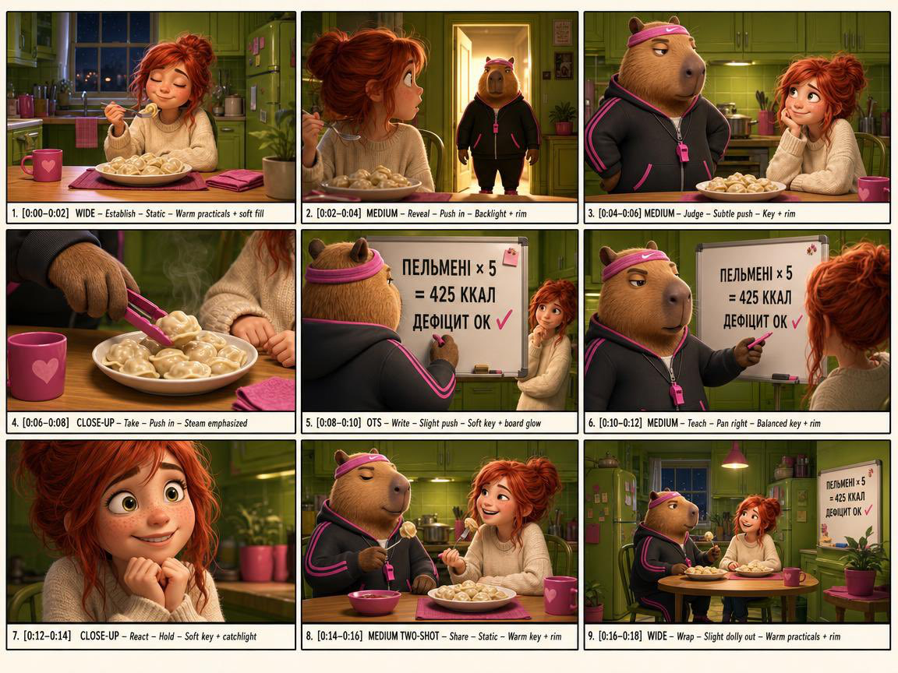</a>

```text
Goal: Create a 3x3 cinematic storyboard contact sheet for an animated short reel about a capybara meal-coach helping a woman track dumplings for calories.

Canvas: Landscape 4:3 storyboard sheet, cream paper background, nine equal panels in a 3 columns by 3 rows grid, thin black borders, white caption strips under every frame. Warm cozy evening kitchen setting with olive-green cabinets, tiled backsplash, window with night city lights, pink props, soft practical lamp light, shallow depth of field, polished 3D animated film look.

Main characters: A friendly anthropomorphic capybara coach wearing a black zip hoodie with hot-pink stripes, pink headband, pink whistle on a lanyard, rounded muzzle, calm judging expression. A young woman with messy bright red hair in a loose bun, cream cable-knit sweater, seated at a round wooden kitchen table; her face is intentionally obscured by a flat soft-edged tan/brown square privacy mask in panels where it faces camera. Keep the capybara expressive and readable.

Key props: One large plate of pelmeni dumplings, one pink mug with a pale heart, pink cloth napkins, fork and spoon, a whiteboard on an easel or wall with bold Russian calorie tracking notes, pink marker, small magnets and sticky note, potted plants and kitchen utensils.

Visible storyboard text: Use exactly 9 caption strips, numbered 1 through 9, with timecodes and shot notes in a handwritten storyboard style. The whiteboard must show this Russian text exactly: {argument name="whiteboard text" default="ПЕЛЬМЕНИ x 5\n= 425 ККАЛ\nДЕФИЦИТ OK ✓"}. Caption strip text should be legible and similar to: 1. [0:00--0:02] WIDE - Establish - Static - Warm practicals + soft fill; 2. [0:02--0:04] MEDIUM - Reveal - Push in - Backlight + rim; 3. [0:04--0:06] MEDIUM - Judge - Subtle push - Key + rim; 4. [0:06--0:08] CLOSE-UP - Take - Push in - Steam emphasized; 5. [0:08--0:10] OTS - Write - Slight push - Soft key + board glow; 6. [0:10--0:12] MEDIUM - Teach - Pan right - Balanced key + rim; 7. [0:12--0:14] CLOSE-UP - React - Hold - Soft key + catchlight; 8. [0:14--0:16] MEDIUM TWO-SHOT - Share - Static - Warm key + rim; 9. [0:16--0:18] WIDE - Wrap - Slight dolly out - Warm practicals + rim.

Panel-by-panel layout, exactly 9 panels: Panel 1 wide establishing shot: woman alone at table about to eat dumplings, pink mug and napkin visible, green kitchen at night. Panel 2 medium reveal: woman foreground left with spoon, capybara coach appears in a glowing doorway behind her. Panel 3 medium judge: capybara stands beside seated woman, looking sideways at her plate with a suspicious coach expression. Panel 4 close-up: capybara paw uses pink tongs or marker-like utensil to pick one dumpling from steaming plate, woman hands nearby, pink mug left. Panel 5 over-the-shoulder from behind capybara: capybara writes on whiteboard with pink marker while woman watches from side. Panel 6 medium teach: capybara points at the whiteboard text with pink marker while woman listens, with capybara face partly obscured by a tan/brown privacy mask block if facing camera. Panel 7 close-up reaction: woman leaning on clasped hands, red hair filling frame, face covered by tan/brown square mask, cozy kitchen blur behind. Panel 8 medium two-shot: capybara and woman sit together at table sharing dumplings, each holding a dumpling utensil, plate centered, pink bowl and mug visible. Panel 9 wide wrap: both characters at round table in full kitchen, whiteboard visible at right with the calorie note, pendant lamp above, window behind.

Visual style: High-end 3D animated family-film aesthetic, warm cinematic lighting, soft rim lights, subtle bloom, realistic food steam, saturated olive greens and pink accents, consistent character designs across panels, storyboard production-board composition.

Constraints: Include exactly 9 panels and exactly 9 caption strips. Do not add extra characters. Keep all panels coherent as a single timeline reference for video animation. Maintain legible whiteboard text and visible Russian lettering; avoid logos or watermarks.
```

## by [Larus Canus](<https://x.com/MrLarus>) on May 15, 2026 👉 [Try Now](https://indream.ai/generate?mode=IMAGE&modelKey=gpt-image-v2&modelPromptId=019e607b-1924-773d-a954-94a5d1f994bb)

<a href="./public/images/4c9bf5a9-2ae9-44fb-8228-2c3e12023a39.png" target="_blank" rel="noopener noreferrer">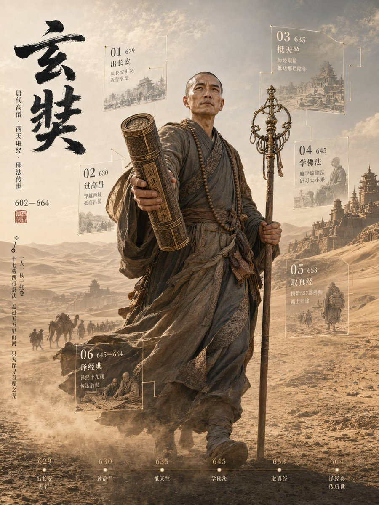</a>

```text
Goal: Create a cinematic vertical 3D historical figure archive poster about {argument name="character name" default="Xuanzang"}, showing a Tang dynasty monk as a monumental full-body statue-like traveler walking toward the viewer through a desert Silk Road landscape. Use an epic museum-exhibition style with realistic 3D rendering, documentary historical atmosphere, and floating translucent data panels.

Canvas: Vertical 3:4 poster, warm sepia and dusty gold color palette, high detail, dramatic backlight, hazy sky, windblown sand, ancient city silhouettes and pagodas in the distance. The central figure occupies most of the height, slightly right of center, walking forward with strong depth and scale.

Main subject: A bald Tang dynasty Buddhist monk in layered weathered gray-brown robes, wrapped sashes, prayer beads around the neck, worn cloth textures, dust and wind movement. He holds a tall ornate monk staff in his right hand and extends an ancient rolled scripture tube or sutra scroll case toward the viewer in his left hand, creating a strong foreground perspective. The face area should be softly obscured or neutral rather than a recognizable modern face. The pose should feel determined, solemn, and pioneering.

Left title column: Large expressive black ink-brush Chinese calligraphy reading {argument name="main calligraphy title" default="玄奘"} at the upper left. Beside it, add thin vertical Chinese-style biographical text indicating Tang dynasty monk, westward scripture journey, Buddhist transmission, and lifespan 602—664. Add a small red seal stamp under the biographical text. Add an additional slim vertical annotation line near the lower left like an archival quote or route note.

Floating archive panels: Include exactly 6 semi-transparent glass panels with thin gold outlines, small node connectors, white/gold text, faint historical illustration backgrounds, and a numbered sequence. The six panels are: 01, year 629, departure from Chang'an; 02, year 630, crossing Gaochang; 03, year 635, reaching Tianzhu/India; 04, year 645, studying Buddhism and returning east; 05, year 653, collecting and bringing back scriptures; 06, years 645—664, translating classics and transmitting them to later generations. Place panels around the figure: 01 upper left, 02 mid-left, 03 upper right, 04 right middle, 05 lower right, 06 lower left. Keep the panels legible but ethereal, as if holographic museum labels.

Bottom timeline: Add one thin horizontal timeline across the bottom with exactly 6 marked dots labeled 629, 630, 635, 645, 653, and 664. Under the dots, add short Chinese-style event captions matching the six archive panels. Use small refined serif or Song-style typography in off-white/gold.

Background details: A vast desert road with caravan silhouettes, camels, monks, travelers, dust clouds, distant mountains, and ancient frontier architecture. Include faint ruined city walls and pagoda-like structures to support the historical westward journey atmosphere. Make the scroll case and monk staff break the flat poster plane visually, as if protruding from the archival layout.

Visual style: {argument name="visual style" default="ultra-realistic 3D historical poster, cinematic lighting, museum archive infographic, sepia desert palette, volumetric dust, high-detail cloth and metal textures"}. Elegant, solemn, heroic, not cartoonish. Combine realistic historical portraiture with infographic overlays and Chinese ink-calligraphy aesthetics.

Constraints: Use exactly 1 central character, exactly 6 floating archive panels, and exactly 6 bottom timeline markers. No modern objects, no English text on the poster unless requested, no watermark, no logo, no extra characters in the foreground.
```

## by [Larus Canus](<https://x.com/MrLarus>) on May 15, 2026 👉 [Try Now](https://indream.ai/generate?mode=IMAGE&modelKey=gpt-image-v2&modelPromptId=019e607b-0796-7788-af36-53aaad5ffe49)

<a href="./public/images/7bb7c5ae-fd42-461e-8801-ce928d2dc01d.png" target="_blank" rel="noopener noreferrer">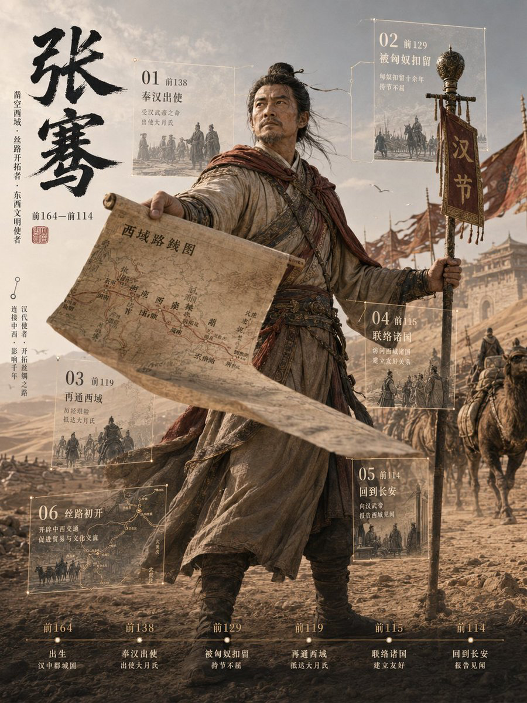</a>

```text
Goal: Create a vertical cinematic 3D historical figure archive poster about {argument name="character name" default="张骞"}, showing an ancient Chinese explorer breaking out of a documentary-style timeline layout with strong depth and motion.

Canvas: Vertical 3:4 poster, sepia desert palette, high-detail realistic 3D render mixed with aged parchment infographic design. Use dramatic backlight, dusty atmosphere, wind-blown fabric, shallow depth of field, and a grand Silk Road expedition mood.

Main subject: A full-body ancient Han dynasty envoy stands in the center foreground on a rocky desert road. His face is intentionally covered by a soft square pixelated blur. He wears layered worn robes, leather belts, travel wraps, boots, and a red-brown scarf blowing in the wind. His left arm stretches forward holding a large unrolled parchment map that projects toward the viewer in forced perspective; the map is labeled in Chinese as {argument name="map title" default="西域线路图"} and contains route lines and place names. His right hand holds a tall ceremonial staff with an ornate metal finial and a hanging vertical red banner reading {argument name="banner text" default="汉节"}. Behind him, show a caravan of camels, riders, soldiers, flags, and a distant western-region city gate under a hazy sky with birds.

Left title column: Place huge black ink-brush Chinese calligraphy vertically reading {argument name="main title" default="张骞"}. Add smaller vertical Chinese descriptors beside it describing him as an opener of the Western Regions and Silk Road pioneer, plus dates “前164—前114” and a small red seal stamp. Keep the typography elegant, historical, and museum-like.

Floating archive panels: Use exactly 6 translucent glass-and-gold-line information cards around the figure, each with thin borders, small glowing corner nodes, miniature monochrome historical scene illustrations, and Chinese headings. Count and place them as follows: 1) upper left card, “01 前138 奉汉出使”, with a small envoy departure scene; 2) upper right card, “02 前129 被匈奴扣留”, with a captivity or horsemen scene; 3) lower left-middle card, “03 前119 再通西域”, with a caravan scene; 4) right-middle card, “04 前115 联络诸国”, with diplomats and allies; 5) lower right card, “05 前114 回到长安”, with return-to-capital imagery; 6) bottom-left large card, “06 丝路初开”, showing a route map and camel caravan.

Bottom timeline: Add one thin horizontal timeline across the bottom with exactly 6 labeled milestones, evenly spaced: “前164 出生 汉中郡城固”, “前138 奉汉出使 出使大月氏”, “前129 被匈奴扣留 持节不屈”, “前119 再通西域 抵达大月氏”, “前115 联络诸国 建立友好”, “前114 回到长安 报告见闻”. Use small serif-like Chinese type, warm off-white ink, and subtle gold tick marks.

Visual style: Epic historical realism, photorealistic cloth and leather textures, parchment infographic overlay, museum exhibition poster, ancient Chinese frontier expedition, desert dust, wind, warm bronze and beige tones, sharp foreground map, cinematic perspective, volumetric light, ultra-detailed 3D立像档案 aesthetic.

Constraints: Preserve exactly one central figure, one large parchment map, one ceremonial staff with one hanging banner, six floating archive cards, and six bottom timeline milestones. Avoid modern objects, avoid extra panels, avoid neon colors, and do not add a watermark.
```

## by [Larus Canus](<https://x.com/MrLarus>) on May 15, 2026 👉 [Try Now](https://indream.ai/generate?mode=IMAGE&modelKey=gpt-image-v2&modelPromptId=019e607a-f6bb-710e-a404-5d4c63c2546a)

<a href="./public/images/fe203dfc-659b-4107-a66c-5c8cfb9af46b.png" target="_blank" rel="noopener noreferrer">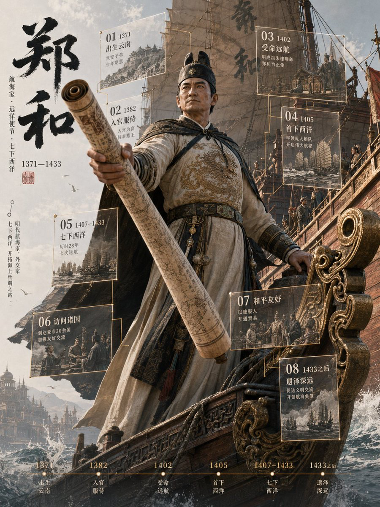</a>

```text
Goal: Create a vertical cinematic 3D historical figure archive poster about {argument name="historical figure" default="Zheng He"}, presenting him as a monumental explorer standing on the prow of a Ming dynasty treasure ship, with archival timeline panels floating around him.

Canvas: Tall 3:4 poster, epic historical documentary style, warm sepia and ocean-blue palette, high detail, dramatic perspective from slightly below, realistic 3D render mixed with aged parchment infographic design.

Main subject: A full-body Ming dynasty admiral in ornate embroidered robes, cloak, belt ornaments, and official headwear stands heroically on the carved wooden bow of a large sailing ship. His right arm thrusts a long rolled nautical map directly toward the viewer, creating strong foreshortening. His left hand rests near the ship rail. Keep the face softly obscured or indistinct, while the costume, posture, and props remain sharp. The figure should feel powerful, statuesque, and breaking out of the poster space.

Background: Massive canvas sails and rigging rise behind him, with faint large Chinese calligraphy on the sail. Sailors and officials occupy the deck to the right. The ship cuts through rough waves, sea spray, and mist. A distant harbor city and fleet silhouettes appear low on the left horizon, with a few birds in the cloudy sky.

Left title area: Large bold black ink-brush Chinese calligraphy reading {argument name="main calligraphy" default="郑和"}. Beside it, add slim vertical Chinese subtitle text: “航海家 · 远洋使节 · 七下西洋”. Add the date range “1371—1433” and a small red seal stamp. Include a narrow vertical note about the Ming dynasty navigator and diplomat opening the maritime Silk Road.

Infographic overlay: Use thin glowing gold lines, corner brackets, small nodes, and translucent parchment-glass rectangles. Include exactly 8 numbered archival cards with small monochrome historical scene images and Chinese captions:
1. “01 1371 出生云南” showing a mountain town or old city.
2. “02 1382 入宫服侍” showing palace or court imagery.
3. “03 1402 受命远航” showing an imperial command or ship deck ceremony.
4. “04 1405 首下西洋” showing a fleet departing on the ocean.
5. “05 1407–1433 七下西洋” showing ships and sea routes.
6. “06 访问诸国” showing diplomatic exchange with foreign envoys.
7. “07 和平友好” showing meetings, gifts, and mutual trade.
8. “08 1433之后 选择深远” showing ships fading into distance and legacy imagery.

Bottom timeline: Add a thin horizontal gold timeline with exactly 6 labeled milestones: “1371 出生云南”, “1382 入宫服侍”, “1402 受命远航”, “1405 首下西洋”, “1407–1433 七下西洋”, “1433之后 选择深远”. Use small dots and delicate vertical tick marks.

Visual style: Ultra-detailed cinematic 3D, historical realism, museum-exhibit infographic, parchment texture, gold technical-line overlays, atmospheric haze, dramatic lighting, carved ship ornamentation, fabric embroidery, weathered nautical map texture, dynamic waves, no modern objects.

Constraints: Maintain the exact count of 8 floating cards and 6 bottom timeline milestones. Keep all visible poster text in Chinese as specified. Do not add logos, watermarks, extra panels, or unrelated characters.
```

## by [麻酱AI实验室](<https://x.com/zhongying14>) on May 15, 2026 👉 [Try Now](https://indream.ai/generate?mode=IMAGE&modelKey=gpt-image-v2&modelPromptId=019e607b-7593-73ad-a05d-f1ef92603995)

<a href="./public/images/c32521d9-b166-4c0c-9b71-d69dde667cb5.png" target="_blank" rel="noopener noreferrer">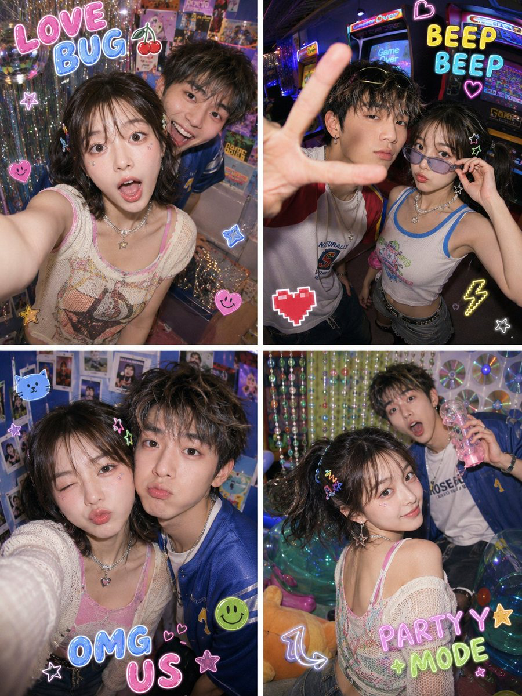</a>

```text
请基于用户上传的 {argument name="照片数量" default="1-2"} 张清晰真人照片，生成一张竖版 2×2 四宫格 {argument name="风格" default="Y2K"} 大头贴拼贴图。

【人物一致性】
严格保留照片中人物的真实身份特征，包括脸型、五官比例、眼睛、鼻子、嘴唇、肤色、年龄感、发型基础和整体气质。四张小图里必须清楚看起来是同一个人 / 同一对人。不要变成陌生人，不要网红化，不要过度磨皮，不要 AI 假脸。

【画面形式】
生成竖版 2×2 四宫格拼贴。
每一格都是独立的大头贴自拍照片，使用广角鱼眼镜头视角，镜头距离人物很近，脸部、手臂和空间透视有轻微夸张，但五官不能畸形。
四格之间可以有细窄白色或糖果色分隔线。不要黑边，不要黑色暗角，不要圆形鱼眼黑框，不要胶片黑框。

【整体风格】
Y2K 大头贴机、鱼眼自拍、潮流头像、彩色闪光灯、低清 CCD 数码相机质感、可爱涂鸦贴纸、复古互联网自拍美学。
整体真实摄影感，不要做成插画。

【造型】
请把人物重新设计成 {argument name="人物造型" default="Y2K 甜酷"} 造型。
可以加入彩色吊带、短款针织衫、印花 T 恤、棒球外套、格纹衬衫、牛仔元素、透明果冻墨镜、彩色发夹、耳饰、项链、蝴蝶结、亮片妆、彩色眼线等元素。
服装颜色可以使用薄荷绿、柠檬黄、电光蓝、樱桃红、银色、橙粉色、薰衣草紫等高饱和糖果色。

【背景】
背景设计成丰富的 Y2K 大头贴空间，不要单一粉色卧室。
可以加入彩色大头贴机房、霓虹灯牌、CD 光盘墙、银色镜面墙、彩色珠帘、拍立得照片墙、复古街机、透明充气沙发、糖果色储物柜、星星灯串、小型 disco ball、亮片帘幕、彩色气球等元素。
整体色调明亮、闪亮、复古、可爱。

【四宫格动作】
四张图的表情、姿势、距离和角度都要不同。
第一格：人物靠近鱼眼镜头，做惊讶张嘴、嘟嘴或鬼脸表情。
第二格：人物伸手靠近镜头，比耶、挥手或手掌贴近镜头，手部有轻微鱼眼放大。
第三格：人物正对镜头，表情俏皮，可以眨眼、鼓腮、挑眉或大笑。
第四格：人物回头笑、侧身看镜头、举起小道具或做夸张抓拍动作。

如果是双人照片，请让两个人有真实互动感，比如贴近镜头、一起做鬼脸、比心、互相靠近、一个人在前景一个人在后景。

【贴纸与文字】
加入适量 Y2K 贴纸和手绘元素，但不要遮挡人物脸部。
贴纸可以包括：樱桃、星星、闪电、蝴蝶结、笑脸、CD、小猫爪、外星人、像素爱心、透明泡泡、彩色箭头、闪粉、手绘涂鸦线。
可以加入少量彩色泡泡字或手写贴纸字，例如：
“LOVE BUG”
“BEEP BEEP ♡”
“PARTY MODE”
“XOXO”
“OMG US”
“TOO CUTE!”
“PHOTO BOOTH DATE”
文字放在边缘或角落，像真实大头贴贴纸，颜色明亮，有轻微发光和闪粉质感，不要遮脸。

【画面质感】
闪光灯直打，低清 CCD 数码相机质感，轻微数字噪点，轻微色散，轻微运动模糊，高饱和糖果色，皮肤保留真实质感。
最终效果像 2000 年代大头贴机连拍、Y2K 互联网头像、可爱搞怪自拍拼贴。
```

## by [蜡笔进化论](<https://x.com/crayon1267>) on May 15, 2026 👉 [Try Now](https://indream.ai/generate?mode=IMAGE&modelKey=gpt-image-v2&modelPromptId=019e6080-258d-7788-9e26-8469bc35d71d)

<a href="./public/images/a3800c35-cae3-49d6-bcf6-9b577d59051f.png" target="_blank" rel="noopener noreferrer">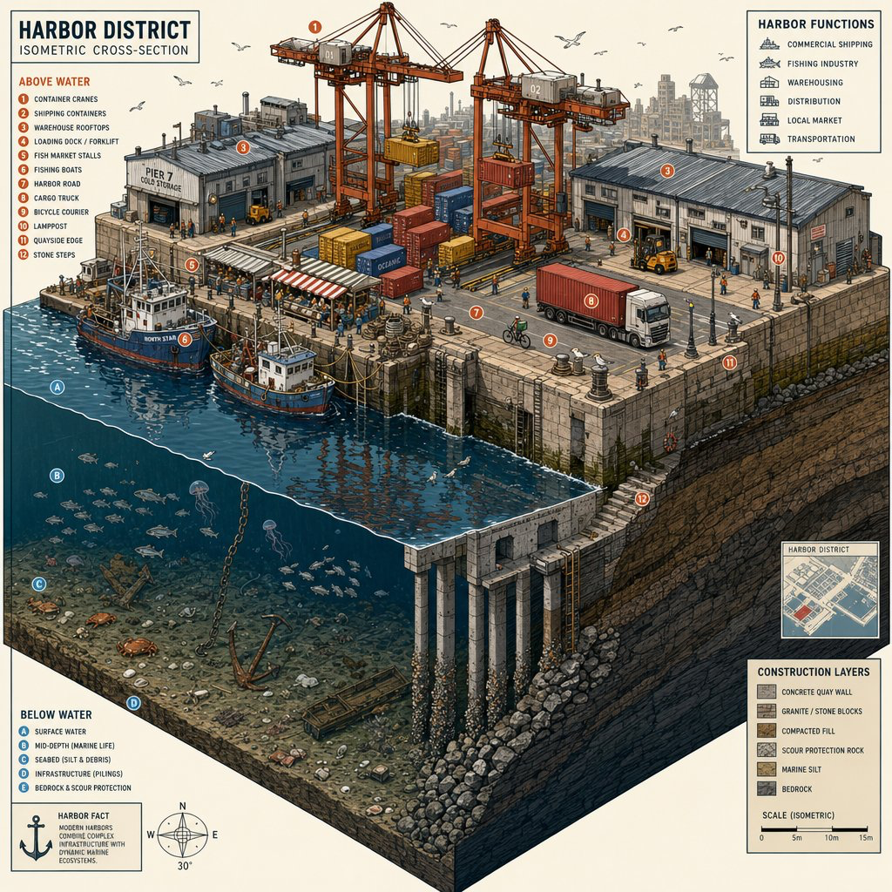</a>

```text
Isometric 3D cross-section of {argument name="district" default="HARBOR"} district. Above: cranes/dockside market/fishing boats. Below-water: fish/anchor/barnacle pilings/bedrock. Navy+ochre+rust palette, crisp outlines, tiny humans. 1:1.
```

## by [PZF](<https://x.com/pzf_ai>) on May 14, 2026 👉 [Try Now](https://indream.ai/generate?mode=IMAGE&modelKey=gpt-image-v2&modelPromptId=019e6082-459f-719d-b73a-e2820366a954)

<a href="./public/images/0d2dac31-5e70-4ed9-8999-2a72ec1dbb85.png" target="_blank" rel="noopener noreferrer">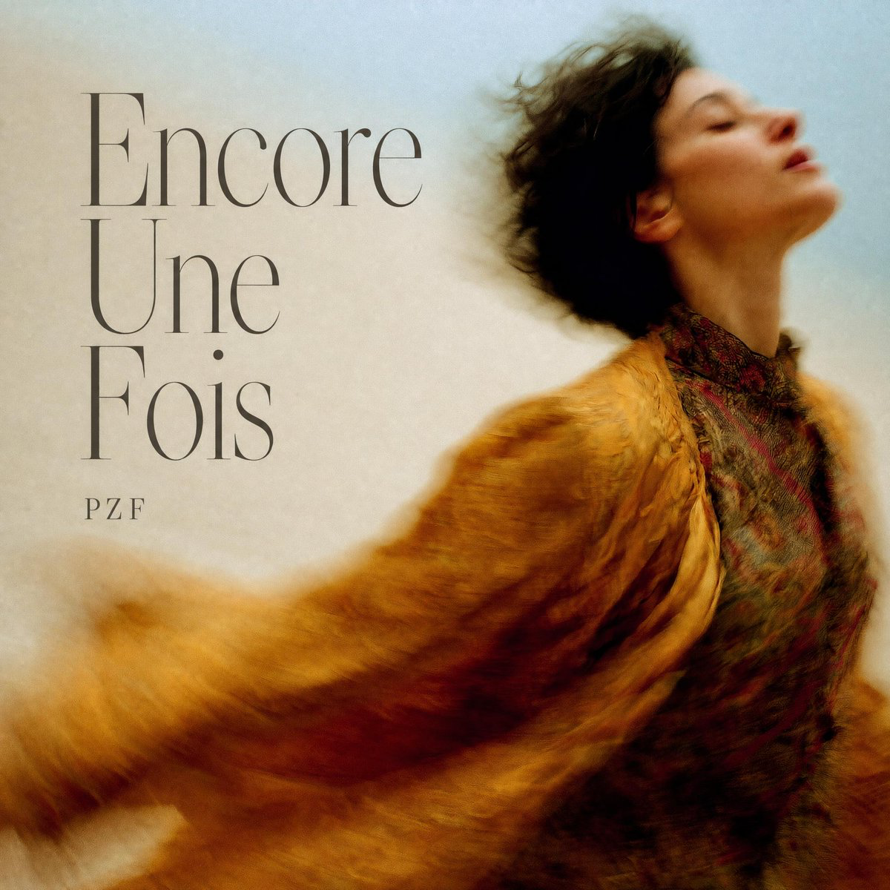</a>

```text
Create a square album cover for a melancholic indie/alternative single. Canvas: 1:1 ratio, softly textured paper background fading from warm cream on the left to pale powder blue on the right, with subtle film grain and a vintage editorial finish. Composition: place a blurred, painterly portrait of a person on the right two-thirds of the cover, cropped from mid-torso upward, head tilted back and turned slightly upward, with short dark messy hair forming a soft silhouette. The face is intentionally obscured by a rectangular frosted blur block in the upper-right area, semi-opaque with muted beige, gray, and brown tones. Clothing: a richly textured mustard-gold faux-fur coat or shawl sweeping dramatically from the lower-left corner across the body toward the right, with motion blur and warm amber shadows; underneath, a dark patterned high-neck garment in burgundy, green, and charcoal. Typography: on the left side, set exactly 2 text elements. Text element 1 is the title {argument name="album title" default="Encore Une Fois"}, stacked across three lines, very large, elegant high-contrast serif typeface, thin strokes, dark charcoal gray, aligned left, occupying the upper-left quadrant. Text element 2 is the artist name {argument name="artist name" default="PZF"}, small uppercase serif letters with wide tracking, placed below the title near the left-center. Visual style: romantic, cinematic, slightly surreal, soft-focus photographic painting, warm ochre and burnt orange contrasted with cool blue, nostalgic French art-pop mood. Constraints: keep the design readable at thumbnail size, preserve generous negative space around the typography, no extra logos, no barcode, no additional text.
```

## by [AB](<https://x.com/0xbokade>) on May 14, 2026 👉 [Try Now](https://indream.ai/generate?mode=IMAGE&modelKey=gpt-image-v2&modelPromptId=019e6083-fadf-77b8-a4ca-0412999d4811)

<a href="./public/images/874a8dd4-3b32-4ca4-840a-208d08deb0f1.png" target="_blank" rel="noopener noreferrer">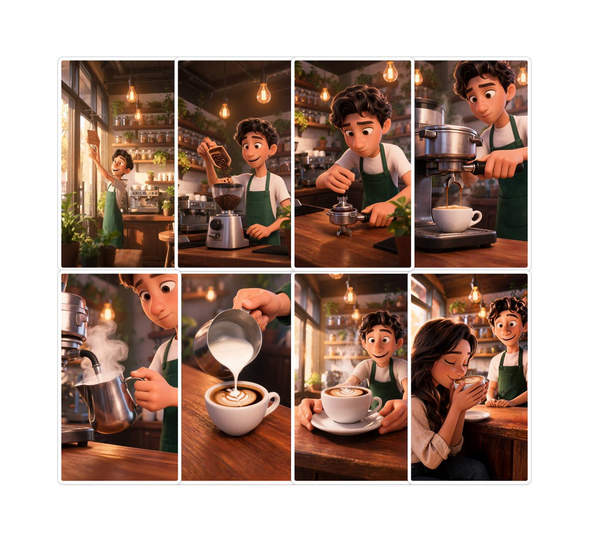</a>

```text
Goal: Create a polished AI storyboard for a coffee brand titled {argument name="story title" default="Bean to Smile"}, showing a warm Pixar-style animated café story from opening the shop to serving a delighted customer.

Canvas: Square image, clean white background, with a centered 2-row storyboard grid of exactly 8 vertical rounded-rectangle panels. Use thin white gutters between panels and a subtle light gray outer border/shadow around the full storyboard. Each panel has cinematic composition, warm amber lighting, shallow depth of field, soft volumetric glow, and highly detailed 3D animated film rendering.

Visual style: Pixar-inspired 3D animation, cozy artisan coffee shop interior, golden morning sunlight, exposed wood counters, shelves of jars and plants, hanging Edison bulbs, espresso machine, warm browns and greens, inviting brand-storytelling mood. The recurring main character is a young barista with {argument name="barista hair" default="curly dark brown hair"}, wearing a white shirt and {argument name="apron color" default="forest green apron"}. Faces may be softly stylized and friendly, but keep the story readable through body language and props.

Storyboard layout and exact panel count: Include exactly 8 panels, arranged as 4 panels on the top row and 4 panels on the bottom row.

Panel 1: Wide shot of the barista opening or wiping the café’s front glass door in morning sunlight, plants near the window, espresso machine and shelves visible inside.
Panel 2: Medium shot of the barista pouring roasted coffee beans from a small wooden scoop or bag into a grinder on the wooden counter.
Panel 3: Close medium shot of the barista tamping fresh coffee grounds into a portafilter with focused hands, café shelves and hanging bulbs behind.
Panel 4: Close-up of espresso extraction from a large shiny espresso machine into a white cup, the barista operating the handle.
Panel 5: Close-up of the barista steaming milk in a metal pitcher, visible white steam curling upward beside the espresso machine.
Panel 6: Close-up of milk being poured into a white cup of coffee, forming latte art on the crema on the wooden counter.
Panel 7: Medium shot of the barista presenting the finished latte on a saucer across the counter, latte art visible, warm sunlight in the background.
Panel 8: Emotional final shot of a smiling customer seated at the wooden counter receiving the drink from the barista, suggesting satisfaction and brand warmth.

Text content: No captions inside the storyboard panels. If adding an optional small title outside the grid, use only {argument name="brand text" default="Bean to Smile"} in a tasteful coffee-brand style.

Constraints: Do not add extra panels, speech bubbles, watermarks, logos, or unrelated objects. Keep the same barista, apron, café environment, and lighting consistent across all 8 panels. Make the image look like a complete premium brand storyboard for a coffee commercial.
```

## by [Seina Yuki🔞AI](<https://x.com/seina_aiart>) on May 14, 2026 👉 [Try Now](https://indream.ai/generate?mode=IMAGE&modelKey=gpt-image-v2&modelPromptId=019e6087-e4df-71f9-93b0-93eda350016b)

<a href="./public/images/35127451-da53-4fba-b9fe-043af568ccf7.png" target="_blank" rel="noopener noreferrer">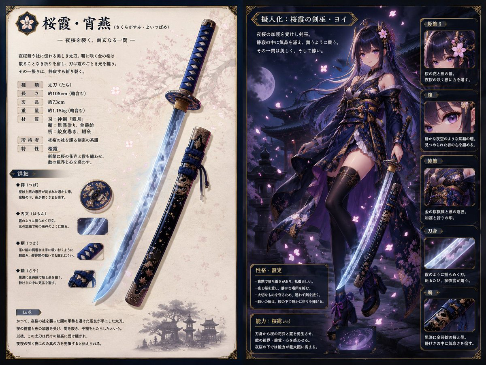</a>

```text
Goal: Create a two-page fantasy art book spread presenting a cherry-blossom themed katana and its personified anime swordswoman, in an ornate Japanese dark-fantasy game encyclopedia style.

Canvas: Wide landscape 2:1 spread, like two adjacent parchment pages with thin black margins and gold filigree corner ornaments. Left page is bright ivory parchment with pale pink cherry blossom texture; right page is dark navy-black with gold borders, moonlit purple lighting, and sakura petals.

Left page layout: Design a weapon specification sheet for {argument name="weapon name" default="桜霞・宵燕"}. At the top left place a small circular flower crest icon, then a large Japanese title with reading guide text and a short poetic subtitle beneath it. Below the intro paragraph, include a compact spec table with exactly 5 rows: type, length, blade length, weight, and materials. Add two smaller information rows for owner and special traits. The main object is a long ornate katana displayed diagonally from lower center to upper right, with a glowing icy-blue blade, dark blue wrapped handle, gold fittings, and floral engraving. Beside it show the matching scabbard, black lacquer with gold and pink sakura decoration, blue cord wrap, and antique bronze metal end fittings. Add exactly 5 weapon-detail callouts on the left-middle/lower area: 1 round tsuba guard medallion, 1 close-up of the luminous blade texture, 1 close-up of the blue diamond handle wrap, 1 close-up of the tied blue cord and scabbard fittings, and 1 bottom tradition/lore text block with a faint silhouette of pagodas and a flowering tree.

Right page layout: Create the personification page titled in Japanese as {argument name="personification title" default="擬人化：桜霞の剣巫・ヨイ"}. The central character is a full-body beautiful anime swordswoman standing in a moonlit temple garden, holding the same glowing katana downward. She has very long flowing {argument name="hair color" default="black-purple"} hair with violet highlights, straight bangs, flower hair ornaments, ribbons, and drifting pink petals around her. Her face should be softly obscured or blurred while the rest of the illustration remains sharp. She wears an elaborate dark navy, black, and violet kimono-inspired battle outfit with gold embroidery, sakura motifs, layered sleeves, thigh-high black stockings, high heels, ornate waist armor and obi, and fluttering translucent fabric panels. The background contains a full moon, silhouetted Japanese roofs, stone lanterns, mist, and purple-blue night lighting.

Right page text and panels: Place a short descriptive paragraph under the title at upper left. Add a gold-framed personality/settings box near the lower left with exactly 5 bullet lines. Add a separate ability box beneath it describing a cherry-blossom slash ability. Along the far right column, include exactly 5 stacked inset cards with labels and images: 1 hair ornament close-up, 1 eye close-up, 1 clothing/obi close-up, 1 blade close-up, and 1 scabbard close-up. Each card should have a gold border, a small Japanese label, a cropped detail image, and two short lines of Japanese explanatory text.

Visual style: Highly polished gacha RPG character sheet, premium collectible weapon lore page, ornate gold UI frames, delicate sakura patterns, cinematic lighting, crisp linework, semi-realistic anime rendering, luminous blue blade effects, violet-pink petal glow, elegant typography. Keep the composition dense but readable, with the weapon page brighter and the character page dramatically darker.

Constraints: Use exactly 2 pages, exactly 5 left-page weapon callouts, exactly 5 right-side inset cards, and exactly 5 bullet lines in the personality box. Do not add logos, watermarks, modern UI buttons, or extra characters. Japanese text may be decorative but should look like a coherent fantasy encyclopedia entry.
```

## by [离谱](<https://x.com/LipuAIX>) on May 14, 2026 👉 [Try Now](https://indream.ai/generate?mode=IMAGE&modelKey=gpt-image-v2&modelPromptId=019e6088-54d4-7581-a0db-c1947e458e7a)

<a href="./public/images/60870799-c991-469a-83cc-d92863f733c6.png" target="_blank" rel="noopener noreferrer">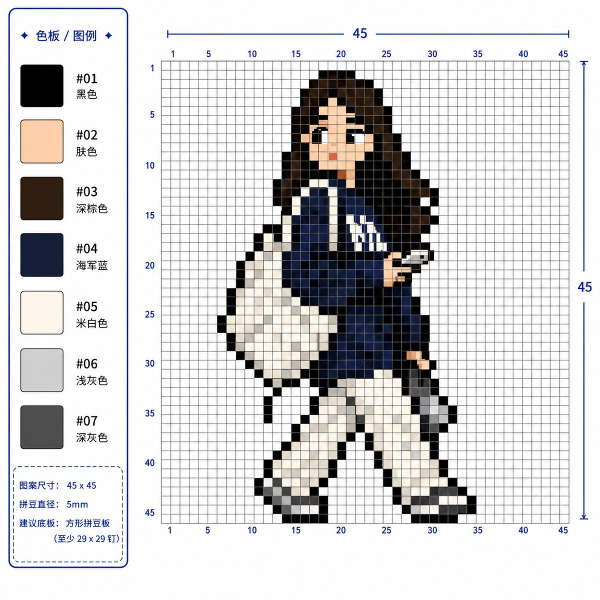</a>

```text
一个专业的2D拼豆图案设计图纸。画布左侧有一个垂直的色板/图例，展示带有准确编号（例如 #01、#02）的颜色方块。画布的主要区域显示一个主体的全身像素风角色。该角色必须在完美的 {argument name="网格大小" default="45x45"} 网格矩阵中呈现。每个拼豆像素必须具有清晰、干净、不模糊的边界。清爽的 2D 精灵图，蓝图风格，{argument name="背景" default="白色背景"}，高技术细节，独立设计。
```

## by [George Won](<https://x.com/bigwonbots>) on May 14, 2026 👉 [Try Now](https://indream.ai/generate?mode=IMAGE&modelKey=gpt-image-v2&modelPromptId=019e6089-6088-724f-bd9e-52828748f2a2)

<a href="./public/images/9e9ba4ff-206f-4a71-ae79-20edf3b15dd5.png" target="_blank" rel="noopener noreferrer">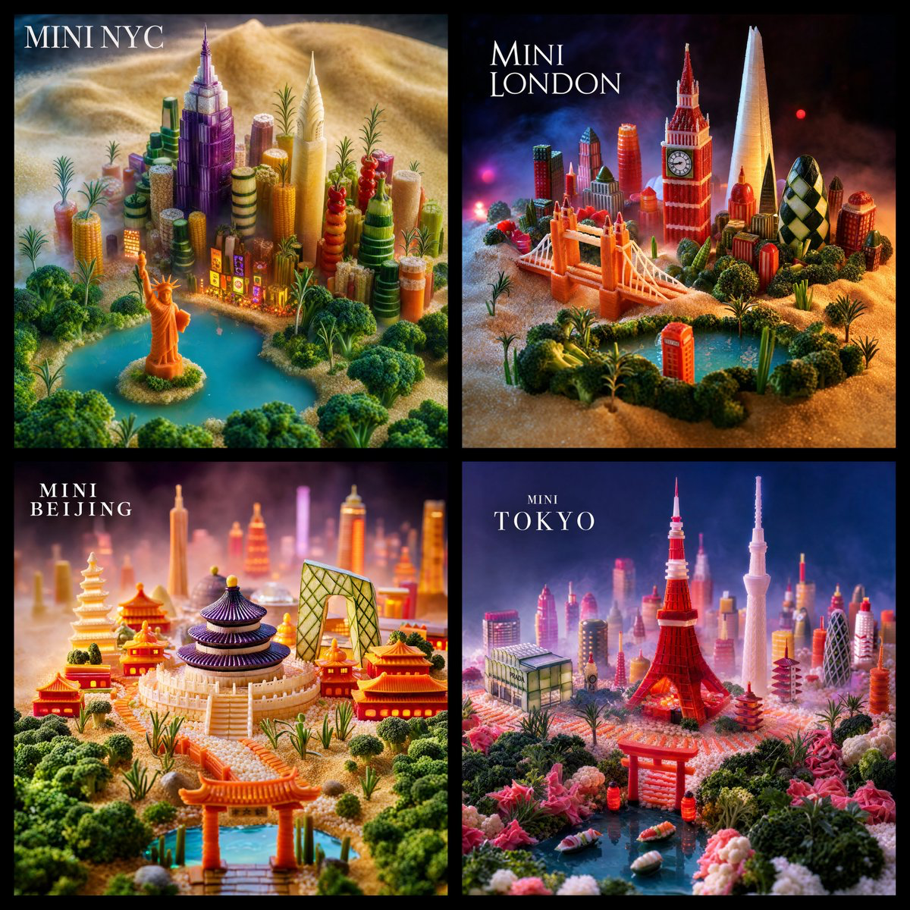</a>

```text
Goal: Create a 2x2 grid of four surreal miniature edible city foodscapes, each city rising from a vast desert of fine golden cane sugar, photographed like a premium macro diorama with cinematic lighting. Use {argument name="overall theme" default="Universal Mini World Foodscape"} as the concept: iconic landmarks and skyscrapers are meticulously crafted from colorful candies, pastries, vegetables, spices, biscuits, sugar glass, jellies, and confectionery materials.

Canvas: Square image, four equal panels separated by thick black gutters, each panel a polished miniature scene with shallow depth of field, glowing city lights, sparkling sugar grains, tiny trees, and dreamy atmospheric haze. High-detail macro photography look, saturated jewel tones, warm highlights, dark vignette edges, no people except miniature statues or landmark replicas.

Layout: Exactly 4 labeled panels in a 2x2 arrangement. Count and labels: 1) top-left: “MINI NYC”; 2) top-right: “MINI LONDON”; 3) bottom-left: “MINI BEIJING”; 4) bottom-right: “MINI TOKYO”. Each title appears in elegant white serif uppercase lettering near the upper-left of its panel, with “MINI” smaller where appropriate. Keep the labels readable and spelled exactly.

Panel details: Top-left “MINI NYC” shows a miniature New York skyline beside a turquoise lake, with a tiny Statue of Liberty on a small island in the foreground, an Empire State Building-like candy skyscraper, Chrysler Building-like spire, assorted cylindrical candy towers, palm-like edible plants, broccoli-like trees, glowing windows, and rolling sugar dunes behind the skyline. Use {argument name="first city label" default="MINI NYC"} for the visible title.

Top-right “MINI LONDON” shows edible London landmarks on golden sugar terrain with a small river or lagoon in front: Tower Bridge made from orange biscuit/candy, a Big Ben/Elizabeth Tower-style clock tower, the tall Shard-shaped sugar-glass tower, the Gherkin with diamond icing pattern, red-orange skyscrapers, tiny trees, and moody night sky with pink and red bokeh lights. Use {argument name="second city label" default="MINI LONDON"} for the visible title.

Bottom-left “MINI BEIJING” shows a miniature Beijing foodscape with a grand circular Temple of Heaven-style structure, ornate red-and-gold palace roofs, pagoda-like towers, a CCTV Headquarters-style angular building in the background, a red Chinese gate bridge over blue water in the foreground, lush edible greenery, sugar dunes, mist, and warm lantern-like glow. Use {argument name="third city label" default="MINI BEIJING"} for the visible title.

Bottom-right “MINI TOKYO” shows a miniature Tokyo foodscape at dusk with a vivid red Tokyo Tower at center, a pale Tokyo Skytree-like tower to the right, dense candy skyscrapers, a red torii gate over dark blue water in the foreground, koi fish-shaped sweets, pink blossom-like candy flowers, manicured edible shrubs, and a purple-blue neon skyline glow. Use {argument name="fourth city label" default="MINI TOKYO"} for the visible title.

Visual style: Ultra-detailed macro diorama, whimsical surreal food art, photorealistic textures, edible architecture, sparkling granulated sugar sand, dramatic studio lighting, soft fog, miniature scale, tilt-shift depth of field, rich contrast, high saturation, crisp landmarks, fantasy travel-poster mood.

Constraints: Use exactly 4 panels and exactly the 4 city titles listed. Do not add extra panels, captions, logos, watermarks, UI elements, or real humans. Preserve black borders between panels. Make every city visually distinct and recognizable through its landmarks while keeping all structures edible and miniature.
```

## by [23Sensei](<https://x.com/23AIart>) on May 14, 2026 👉 [Try Now](https://indream.ai/generate?mode=IMAGE&modelKey=gpt-image-v2&modelPromptId=019e608b-d5c6-7681-8eab-d4aab94feb4d)

<a href="./public/images/f07bba0a-3b3c-47d9-9282-723da10559bf.png" target="_blank" rel="noopener noreferrer">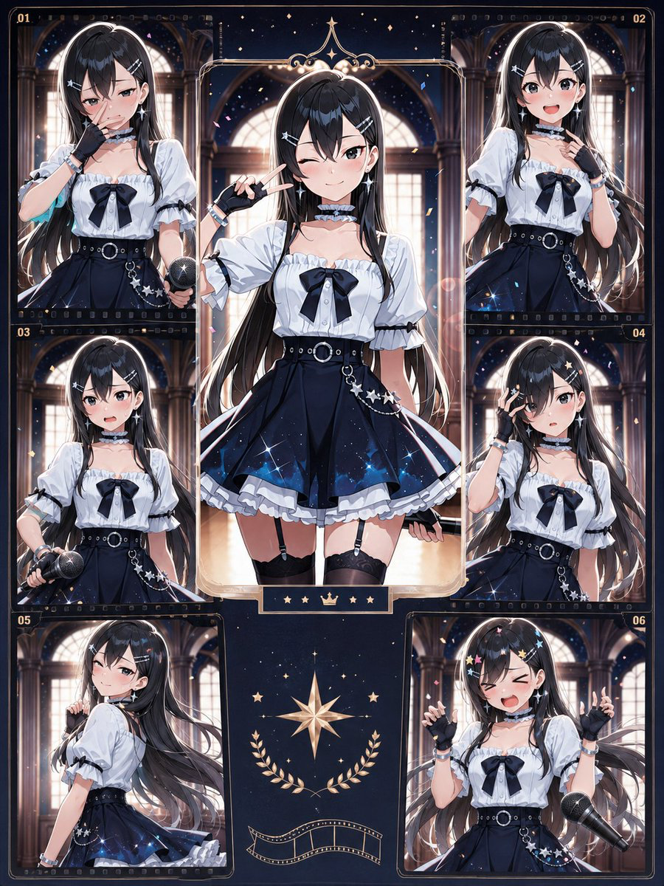</a>

```text
Goal: Create a highly detailed anime idol character showcase poster featuring {argument name="character name" default="a mysterious starlight idol"}, with a dark celestial concert aesthetic and ornate trading-card layout.

Canvas: Vertical 3:4 poster, richly detailed, dark navy and warm gold palette, glossy premium illustration finish. The design should look like an idol character card collection page with decorative borders, film-strip accents, tiny stars, confetti, and elegant gothic arches in the background.

Layout: Use exactly 7 character illustrations total: 1 large central full-body portrait and 6 smaller surrounding portrait panels. The 6 smaller panels are numbered in small gold text as 01, 02, 03, 04, 05, and 06. Arrange them as two panels across the top corners, two panels in the middle left and middle right, and two panels along the lower left and lower right, framing the central figure. The central portrait is the largest, inside an ornate rounded rectangular gold frame with a crown-like decorative crest at the top and a small plaque at the bottom showing five small gold icons: star, star, crown, star, star.

Subject details: The character is a young anime idol girl with {argument name="hair color" default="very long glossy black hair"}, straight bangs, long flowing side strands, and small silver star hairpins. Her face is intentionally obscured in every panel by a soft rectangular blur, while the rest of the illustration remains sharp. She wears a white short-sleeve puff blouse with frilled neckline, black ribbon bow at the chest, black choker with white frill trim, black fingerless gloves, silver bracelets, a high-waisted dark navy pleated skirt with a galaxy sparkle gradient, white underskirt ruffles, black belt with silver ring buckle, dangling silver star chains on the hip, black thigh garters, and idol accessories. The overall outfit theme is {argument name="outfit theme" default="gothic celestial idol"}.

Panel poses: Include exactly these 6 numbered side-panel variations: 01 shows an upper-body idol pose holding a microphone near the lower right, one hand near the chest; 02 shows an upper-body pose touching the choker or collar with one hand; 03 shows a waist-up pose holding a microphone downward in one hand; 04 shows an upper-body pose with one hand near the face making a playful idol gesture; 05 shows a side/back three-quarter pose looking over the shoulder with long hair flowing dramatically; 06 shows a cheerful upper-body pose with both hands raised in small finger-heart or pointing gestures and a large microphone floating near the right side. The central portrait shows the idol standing full-body, one hand making a peace sign beside the face, skirt flared outward, confident concert-poster stance.

Background and decoration: Set all portraits inside a grand cathedral-like hall with tall arched windows glowing with warm light, dark columns, night-sky sparkles, floating confetti, lens flares, and magical star particles. The bottom center outside the portraits contains a large gold compass star emblem, laurel branches, and a curved film-strip ribbon. Add tiny gold numbering, thin ornamental borders, subtle film sprocket marks, and a polished collectible-card feel.

Visual style: High-resolution anime illustration, crisp line art, luminous highlights, glossy hair shading, dramatic rim lighting, intricate fabric folds, deep navy shadows, gold accents, magical idol atmosphere, symmetrical composition, premium poster design.

Constraints: Use exactly 7 character depictions and exactly 6 numbered side panels labeled 01 through 06. Keep all faces covered by the same soft blur effect. Do not add readable text besides the small panel numbers and decorative icons. Avoid logos, watermarks, and extra characters.
```

## by [Nexora](<https://x.com/frametheory058>) on May 14, 2026 👉 [Try Now](https://indream.ai/generate?mode=IMAGE&modelKey=gpt-image-v2&modelPromptId=019e608d-c883-76c9-ab1d-4a8ebeb813ef)

<a href="./public/images/eb826fcd-20e3-4bbd-ae5c-7ca3bf6dc2db.png" target="_blank" rel="noopener noreferrer">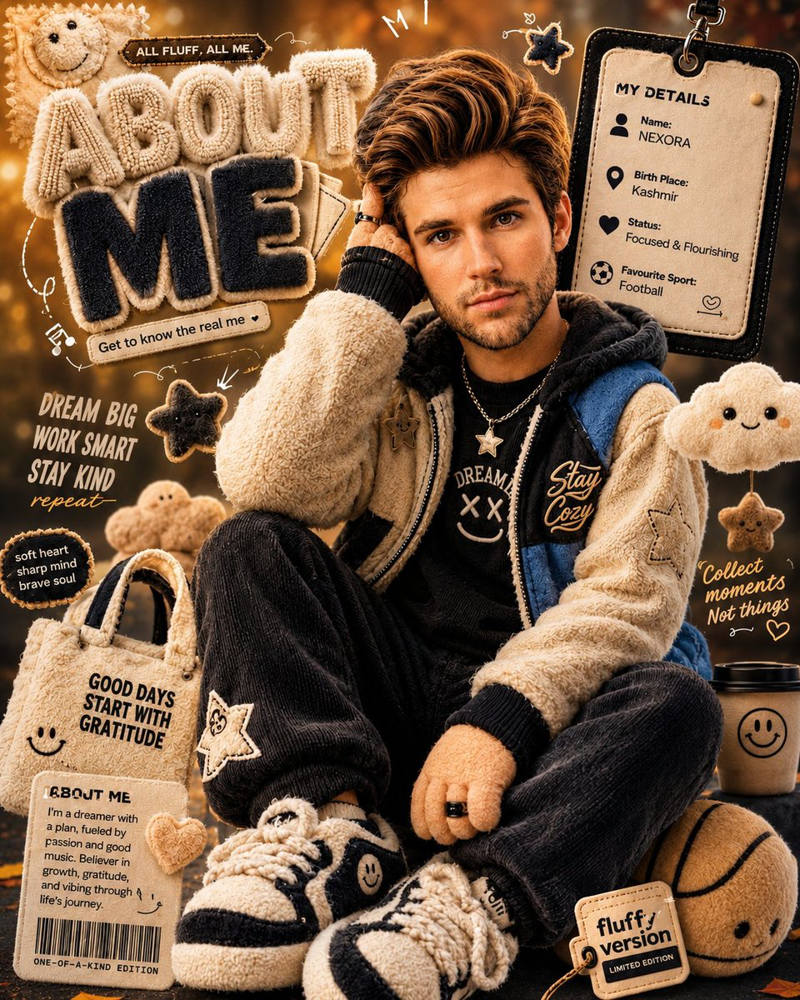</a>

```text
Create a highly detailed 4:5 portrait “About Me” poster in a premium 3D Fluffy Toy aesthetic, turning the subject from the uploaded photo into an adorable soft-textured collectible character while fully preserving the real facial identity and structure. Use realistic fluffy fabric textures, smooth designer-toy surfaces, subtle stitching details, cinematic lighting, polished shadows, and ultra-clean 8K rendering. The poster should feel like a mix of designer toy packaging, modern Asian fashion editorials, and trendy lifestyle magazine covers. Include layered typography, playful graphic accents, floating fluffy props, sticker-style decorations, glossy 3D elements, plush textures, soft gradients, and stylish editorial layouts. Avoid empty spaces — the composition should feel rich, dynamic, fashionable, and professionally art-directed. Create a new pose different from the reference image with natural model energy: relaxed posture, expressive gestures, slight body lean, stylish hand interaction, and warm charismatic facial expression. Outfit should feature modern street-fashion styling such as oversized jackets, knitwear, loose-fit pants, sneakers, accessories, rings, necklaces, beanies, or glasses with harmonious fashionable colors and premium soft materials. Use cinematic mid-shot or slightly low-angle composition with immersive depth while keeping all poster elements clearly visible. Integrate these details naturally into the typography design: Name: {argument name="name" default="[Name]"}, Birth City: {argument name="city" default="[City]"}, Status: {argument name="status" default="[Status]"}, Favorite Sport: {argument name="sport" default="[Sport]"}
```

## by [Taaruk](<https://x.com/Taaruk_>) on May 14, 2026 👉 [Try Now](https://indream.ai/generate?mode=IMAGE&modelKey=gpt-image-v2&modelPromptId=019e608f-0699-70f6-a58d-c3f4d9c186bf)

<a href="./public/images/6c1068b0-94f3-4d9c-9b79-87e4e1e5cf6c.png" target="_blank" rel="noopener noreferrer">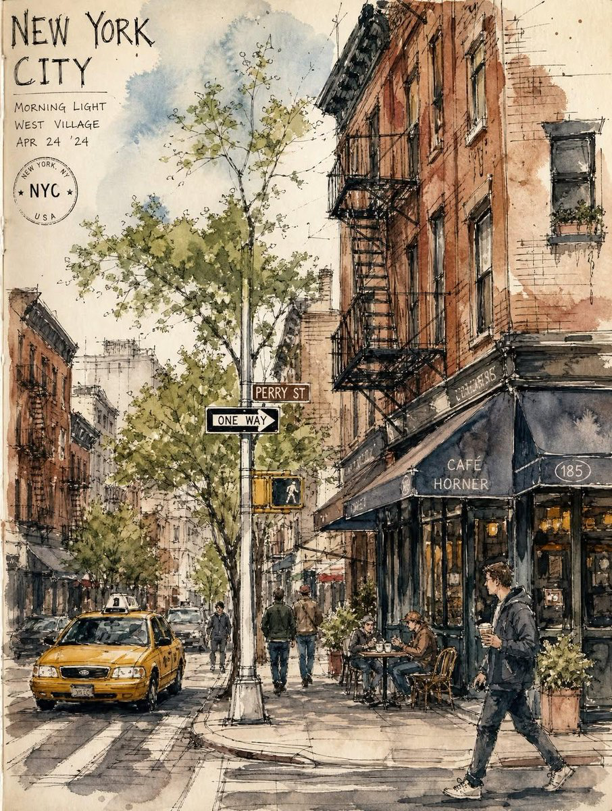</a>

```text
Vintage travel sketchbook {argument name="medium" default="watercolor"} illustration of a charming {argument name="location" default="European city street"}, hand-drawn ink linework mixed with soft watercolor washes, urban café atmosphere, elegant architectural details, cozy sidewalks, people casually walking, outdoor café seating, leafy trees, street signs, bicycles and vintage vehicles, cinematic morning light, loose expressive pen strokes, textured paper grain, travel journal aesthetic, architectural sketch style, soft earthy tones, warm neutral palette, realistic watercolor bleeding, detailed storefronts and windows, artistic urban perspective, plein air painting style, nostalgic travel diary composition, handwritten notes and location labels on the page, subtle stamps and map elements, highly detailed yet airy, calm everyday city rhythm, illustrated on aged sketchbook paper, watercolor splashes and ink splatters, professional architectural illustration, atmospheric storytelling, vertical composition.
```

## by [Larus Canus](<https://x.com/MrLarus>) on May 14, 2026 👉 [Try Now](https://indream.ai/generate?mode=IMAGE&modelKey=gpt-image-v2&modelPromptId=019e6091-087a-70d3-996e-22d770b88289)

<a href="./public/images/700f2459-e72a-4551-94eb-b3f1017216cf.png" target="_blank" rel="noopener noreferrer">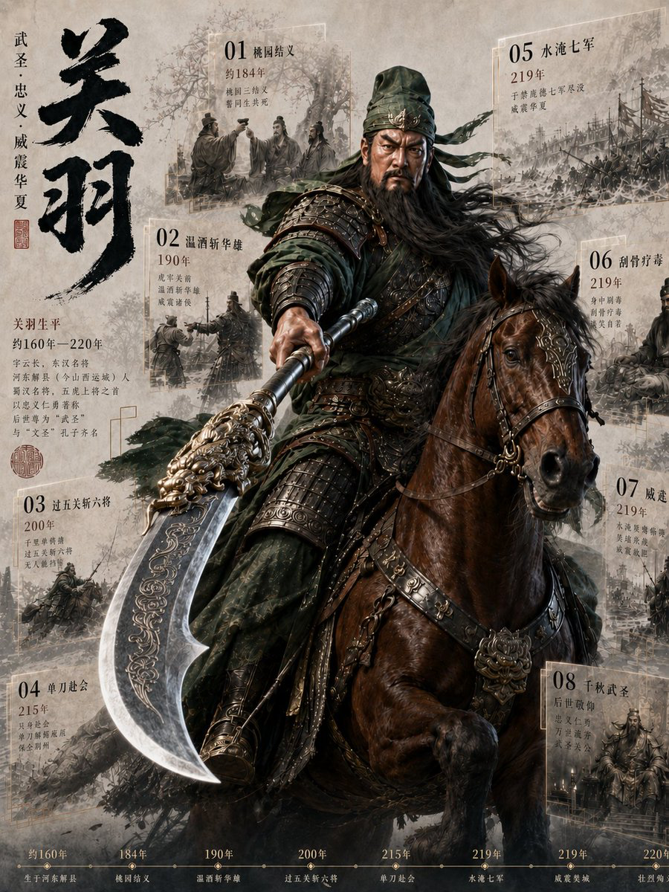</a>

```text
Goal: Create a vertical historical Chinese epic infographic poster about {argument name="character name" default="Guan Yu"}, combining a cinematic Three Kingdoms warrior portrait with parchment-style chronology panels.

Canvas: Tall portrait poster, 3:4 aspect ratio, aged beige rice-paper background with ink wash stains, faint mountains, smoke, battlefield silhouettes, and a museum-scroll texture. Overall palette is sepia, charcoal, dark olive green, bronze, and muted blood-brown.

Main subject: A hyper-detailed armored Chinese general, {argument name="character name" default="Guan Yu"}, dominates the center, riding a powerful dark brown war horse. He wears layered dark green robes, ornate blackened bronze lamellar armor, engraved shoulder guards, leather straps, metal studs, and a green headwrap with long ribbons streaming to the right. Long black hair and beard flow in the wind; the face area is intentionally softened/obscured like a smooth blurred mask, while the armor and clothing remain sharply detailed. He holds a massive ornate guandao polearm angled from the center toward the lower left foreground; the crescent blade is oversized, silver, engraved with gold filigree, and strongly foreshortened. The horse has glossy musculature, an alert expression, ornate bridle, bronze medallions, decorative leather tack, and one raised front leg, facing slightly right.

Left title area: Place a huge vertical black ink-brush calligraphy title reading {argument name="large calligraphy title" default="关羽"} on the upper left. Beside it, add smaller vertical text in Chinese reading “武圣·忠义·威震华夏”, with a small red seal stamp below. Under the title, include a short biographical text block: “关羽生平 / 约160年—220年 / 字云长，本字长生 / 河东解县（今山西运城）人 / 蜀汉名将，五虎上将之首 / 以忠义仁勇著称 / 后世尊为 武圣 / 与‘文圣’孔子齐名”.

Chronology panels: Use exactly 8 translucent rectangular parchment cards arranged around the main rider, each with a large two-digit number, a bold Chinese event title, a year, 2–4 lines of smaller Chinese notes, and a faded monochrome battle illustration behind the text. The cards should look like layered glass-paper frames with thin white borders and ink-wash war scenes.
1. Top center-left card: “01 桃园结义”, year “约184年”, showing three sworn brothers under trees.
2. Mid left card: “02 温酒斩华雄”, year “190年”, showing generals and soldiers near a battlefield standard.
3. Lower left card: “03 过五关斩六将”, year “200年”, showing riders passing through a gate or fortress battle.
4. Bottom left card: “04 单刀赴会”, year “215年”, showing a dramatic riverside or military meeting scene.
5. Top right card: “05 水淹七军”, year “219年”, showing flooded armies, ships, and chaos.
6. Upper-mid right card: “06 刮骨疗毒”, year “219年”, showing a medical treatment scene with soldiers nearby.
7. Mid-lower right card: “07 威震华夏”, year “219年”, showing a smoky battlefield and massed troops.
8. Bottom right card: “08 败走麦城”, year “220年”, showing a seated general and tragic final-campaign atmosphere.

Bottom timeline: Add a thin horizontal timeline along the entire bottom edge with exactly 8 labeled points matching the events: “约160年 生于河东解县”, “184年 桃园结义”, “190年 温酒斩华雄”, “200年 过五关斩六将”, “215年 单刀赴会”, “219年 水淹七军”, “219年 威震华夏”, “220年 败走麦城”. Use small gold dots connected by a fine line, with compact serif Chinese captions.

Visual style: Epic historical fantasy realism, Chinese ink-wash poster design, cinematic lighting, high-detail metal engraving, smoky atmosphere, battlefield dust, layered parchment collage, elegant typography. The central rider and horse are high-contrast and sharp; the background cards are slightly faded and desaturated.

Constraints: Keep exactly 8 chronology cards and exactly 8 bottom timeline points. Do not add modern objects, logos, watermarks, or extra characters in the foreground. Preserve the Chinese text content as visible poster typography, while all composition instructions remain in English.
```

## by [AIライフハック](<https://x.com/ai_lifehack55>) on May 14, 2026 👉 [Try Now](https://indream.ai/generate?mode=IMAGE&modelKey=gpt-image-v2&modelPromptId=019e6094-00ff-7104-aedf-ac6a666c7629)

<a href="./public/images/f4997c60-af9b-4569-aa1e-50f7db341528.png" target="_blank" rel="noopener noreferrer">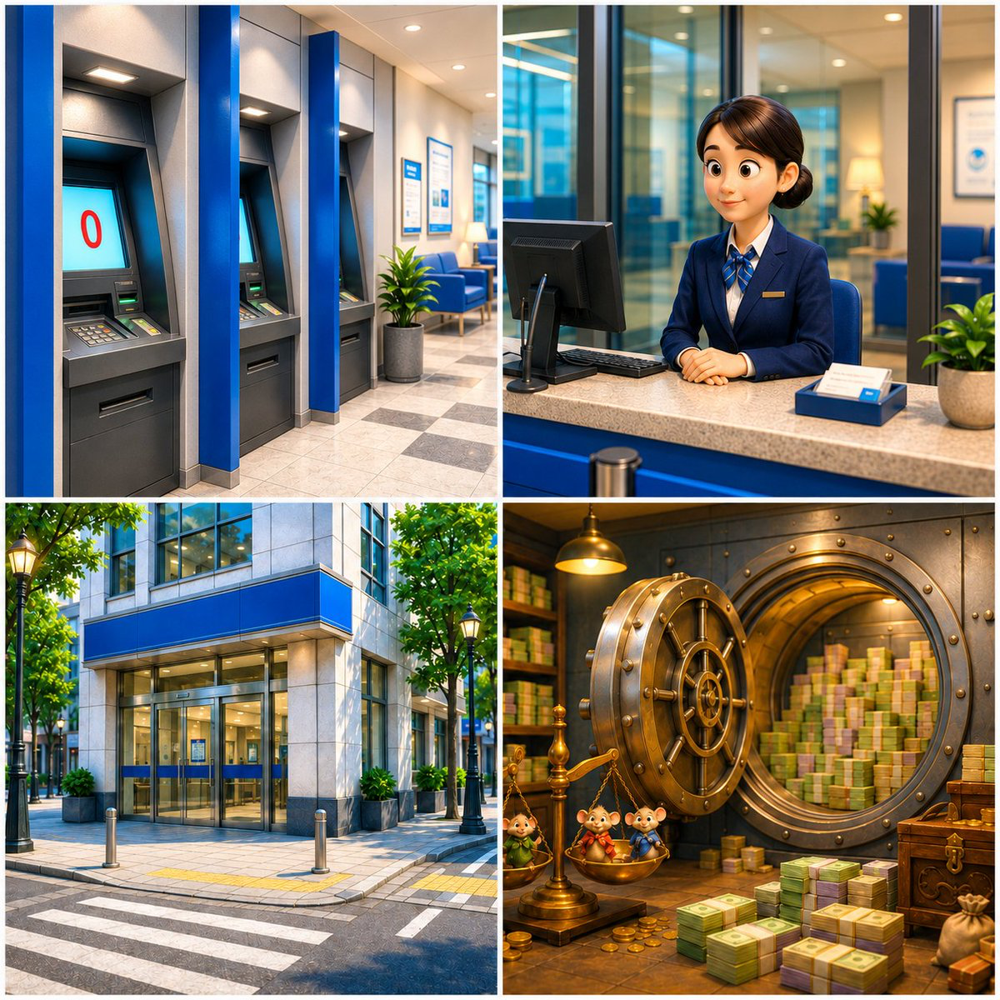</a>

```text
Goal: Create a polished 2x2 storyboard-style image sheet for a short video scene about {argument name="scene theme" default="the despair of a zero bank balance"}, set in a modern blue-themed bank world.

Canvas: Square 1:1 composition, four equal panels separated by clean white gutters, bright cinematic 3D-rendered realism with slightly idealized commercial lighting, high detail, sharp focus, saturated blue bank branding, no captions or speech bubbles.

Layout: Use exactly 4 panels in a grid.
1. Top-left panel: Interior ATM area with exactly 3 visible ATM machines in a row, each built into gray wall bays with bold blue vertical dividers. The nearest ATM screen prominently shows a large red “0” on a pale cyan screen, implying an empty balance. Include tiled floor, ceiling lights, and a small potted plant in the background.
2. Top-right panel: Bank service counter with exactly 1 female bank clerk seated behind a beige stone counter. She wears a navy suit, white shirt, blue striped scarf or tie, and a small gold nameplate. Her face is intentionally featureless/softly blurred for anonymity. Include exactly 1 computer monitor, 1 keyboard, 1 blue document tray, and 1 potted plant on or near the counter. Behind her are glass office partitions, blue chairs, certificates on the wall, and warm office lighting.
3. Bottom-left panel: Exterior of a contemporary city bank branch on a sunny street corner. Show a blue horizontal sign band above glass doors, gray stone facade, street crosswalk markings, sidewalk bollards, leafy trees, and black street lamps. The entrance should feel clean, corporate, and Japanese urban but without readable signage.
4. Bottom-right panel: Fantasy bank vault interior with an oversized round open vault door in bronze and steel. Inside the vault are stacks of cash and gold, warm golden lighting, shelves, and treasure props. Include exactly 3 small cute animal mascots standing near the vault entrance, wearing colorful tiny outfits, plus visible piles of bundled banknotes, coins, a chest, and a money bag.

Visual style: High-end 3D illustration, cinematic render, bank commercial aesthetic mixed with whimsical storybook detail in the vault panel, realistic materials, glossy glass, polished stone, metallic vault surfaces, warm highlights, deep blue brand accents.

Subject details: The bank’s dominant brand color is {argument name="brand color" default="royal blue"}. The ATM screen should display {argument name="balance number" default="0"} in red. The bank clerk outfit should be {argument name="clerk outfit" default="navy suit with blue striped scarf"}. The vault should contain {argument name="vault contents" default="bundled cash, coins, treasure chest, and money bag"}.

Constraints: No extra panels, no visible watermarks, no logos, no readable text except the red balance number on the ATM screen, keep the four-panel sheet coherent as one bank-themed storyboard, maintain clean white borders between panels.
```

## by [AIライフハック](<https://x.com/ai_lifehack55>) on May 14, 2026 👉 [Try Now](https://indream.ai/generate?mode=IMAGE&modelKey=gpt-image-v2&modelPromptId=019e6093-cdeb-727d-b4ae-8ff30fd29d5b)

<a href="./public/images/089d98f4-ba55-46e3-8d0e-4caa4b267a9e.png" target="_blank" rel="noopener noreferrer">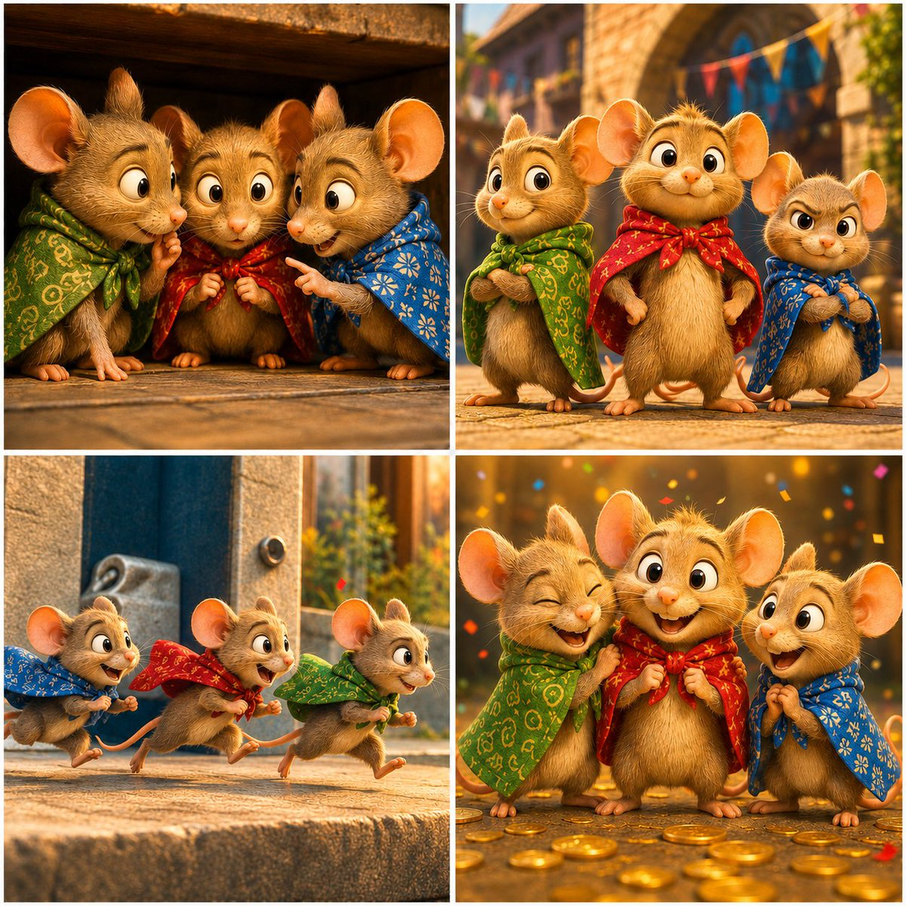</a>

```text
Goal: Create a warm cinematic 2x2 storyboard image for a short animated scene titled {argument name="scene title" default="Zero Balance Despair"}, featuring three cute anthropomorphic mice in a quaint stone village and bank-world setting.

Canvas: Square 1:1 image divided into exactly 4 equal panels with thin white gutters, like a polished animated film storyboard. Use high-detail 3D character animation, soft fur, expressive faces, shallow depth of field, golden-hour lighting, warm orange highlights, and cozy fantasy village textures.

Characters: Use exactly 3 recurring mouse characters throughout: 1 small mouse wearing a green patterned cloak/scarf, 1 larger central mouse wearing a {argument name="central outfit color" default="red patterned cloak/scarf"}, and 1 small mouse wearing a blue patterned cloak/scarf. All have tan-brown fur, huge round ears, shiny black eyes, tiny pink noses, visible whiskers, little paws, and childlike proportions. Keep their designs consistent across panels. In panels where the central mouse face is hidden, cover only the face with a plain soft-edged square privacy block in {argument name="face cover color" default="warm brown"}.

Panel layout and action: Panel 1, top-left: exactly 3 mice huddle close under a dark wooden overhang or doorway. The green-cloaked mouse on the left looks worried with paws near mouth; the central red-cloaked mouse stands in the middle with face covered by a square block; the blue-cloaked mouse on the right points toward the central mouse with a concerned expression. Warm indoor shadows, stone floor, intimate anxious mood. Panel 2, top-right: exactly 3 mice stand outside in a sunny old stone street with blurred bunting flags overhead. The green mouse stands left with arms folded, the red central mouse stands proudly in the middle smiling, and the blue mouse stands right looking stern or suspicious with arms folded. Panel 3, bottom-left: exactly 3 mice run left-to-right across a stone ledge or step, motion-filled and energetic. The blue mouse leads at far left, the red mouse runs in the middle, and the green mouse runs at right, all with fluttering cloaks and excited expressions. Panel 4, bottom-right: exactly 3 mice celebrate among scattered gold coins and colorful confetti. The green mouse at left laughs with eyes closed and holds the central red cloak, the central red-cloaked mouse stands in the middle with face covered by the same square block, and the blue mouse at right smiles with open mouth and clasped paws. Background is a golden bank or treasure-like interior with bokeh lights.

Visual style: Pixar-like but original, adorable cinematic 3D rendering, realistic plush fur, detailed cloth embroidery, warm fantasy lighting, crisp characters with softly blurred backgrounds, expressive gestures, emotional storytelling, no text, no logos, no watermark.

Constraints: Use exactly 4 panels and exactly 3 mice in every panel. The visible repeated cloak colors must be green, red, and blue. Include exactly 2 face-cover blocks total, one in panel 1 and one in panel 4. Do not add extra characters, captions, speech bubbles, or UI elements. Overall mood should move from anxiety to confidence, action, and joyful relief about {argument name="financial theme" default="a bankrupt mouse discovering coins"}.
```

## by [Nexora](<https://x.com/frametheory058>) on May 14, 2026 👉 [Try Now](https://indream.ai/generate?mode=IMAGE&modelKey=gpt-image-v2&modelPromptId=019e6094-868f-746d-89f5-4cef24662824)

<a href="./public/images/2979d600-9cc4-4719-80bb-6f609c327681.png" target="_blank" rel="noopener noreferrer">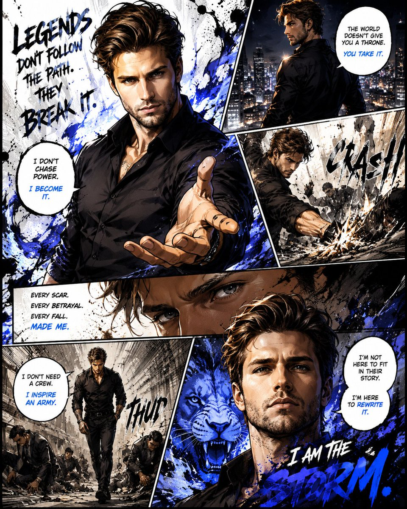</a>

```text
{
  "style": "Ultra-premium cinematic manga illustration with high-energy anime comic aesthetics, fully colored and professionally hand-drawn appearance",
  "canvas_ratio": "4:5",
  "composition": {
    "layout": "Create a single immersive manga page featuring 5 to 7 interconnected dynamic panels with seamless storytelling flow",
    "camera_angles": [
      "dramatic low-angle shots",
      "intense close-up facial frames",
      "wide cinematic action scenes",
      "dynamic perspective distortion",
      "overlapping manga panel transitions"
    ],
    "visual_flow": "Strong directional movement guiding the eye naturally across the page with explosive energy and emotional pacing"
  },
  "character_design": {
    "reference_accuracy": "Keep the facial identity recognizable from the uploaded image while enhancing manga-style intensity and charisma",
    "expression_style": [
      "focused determination",
      "emotional confidence",
      "legendary aura",
      "victory emotion",
      "calm but powerful presence"
    ],
    "pose_style": [
      "dynamic action poses",
      "heroic standing posture",
      "celebration moments",
      "cinematic movement shots"
    ]
  },
  "art_direction": {
    "linework": "Expressive free-flowing ink lines mixed with rough sketch textures and detailed manga inking",
    "textures": [
      "halftone manga textures",
      "ink splatter effects",
      "graffiti-inspired brush strokes",
      "chaotic paint streaks",
      "paper grain comic texture"
    ],
    "lighting": "High-contrast cinematic lighting with glowing atmospheric highlights and deep shadows",
    "color_palette": "Rich vibrant colors mixed with monochrome manga tones and energetic accent highlights"
  },
  "effects": {
    "motion_effects": [
      "speed lines",
      "impact bursts",
      "energy trails",
      "explosive panel transitions",
      "motion blur accents"
    ],
    "atmosphere": [
      "symbolic aura effects",
      "electric energy glow",
      "floating particles",
      "smoke textures",
      "dramatic background abstraction"
    ]
  },
  "comic_elements": {
    "text_style": "Stylized English manga typography with handwritten dialogue bubbles and aggressive comic lettering",
    "sfx": [
      "BOOM",
      "ROAR",
      "THUD",
      "SLAM",
      "WHOOSH"
    ],
    "negative_space": "Blend clean white negative space with chaotic ink-heavy sections for premium manga contrast"
  },
  "quality": {
    "detail_level": "extremely high detail",
    "finish": "social-media-viral professional manga poster quality",
    "render_style": "sharp, emotional, stylish, immersive, energetic"
  }
}
```

## by [42](<https://x.com/Budin_42>) on May 13, 2026 👉 [Try Now](https://indream.ai/generate?mode=IMAGE&modelKey=gpt-image-v2&modelPromptId=019e6097-e5d0-72cd-98f9-91ba9acc19d1)

<a href="./public/images/79ab2140-0a25-4286-ba49-123c2ebb00da.png" target="_blank" rel="noopener noreferrer">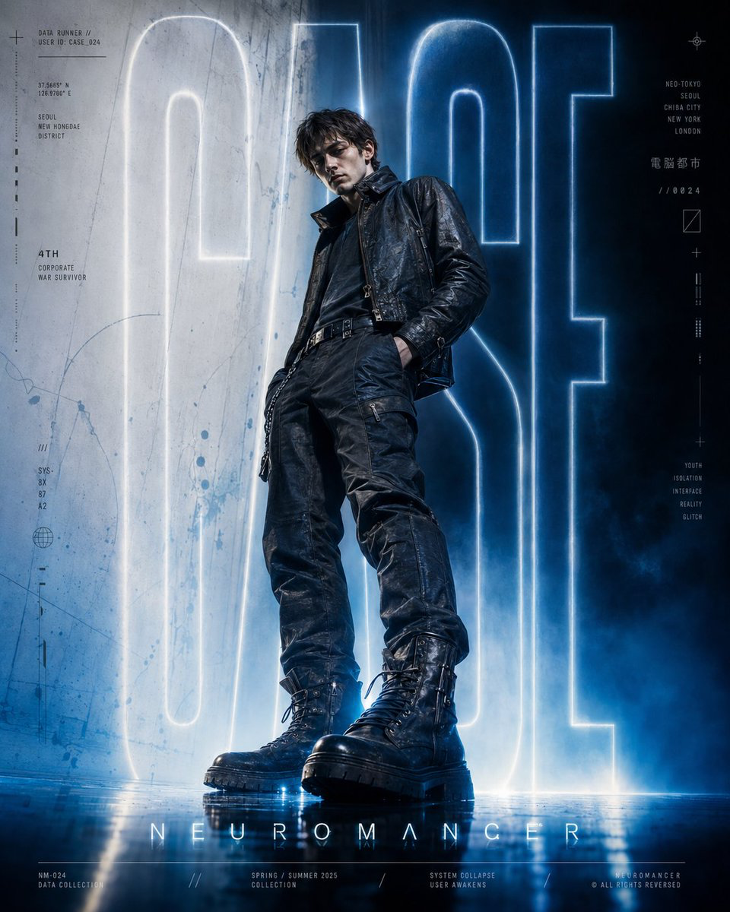</a>

```text
Goal: Create a vertical cyberpunk fashion editorial poster for {argument name="book title" default="NEUROMANCER"}, with a full-body male model posed in front of enormous glowing letterforms spelling the title behind him.

Canvas: Portrait 4:5 poster, glossy cinematic lighting, high resolution, dark blue, black, white, and electric cyan palette. Low camera angle looking upward, making the figure heroic and towering.

Main subject: One young adult male cyberpunk model standing center, slightly leaning back with one hand in his pocket. His face is intentionally obscured by a soft square blur/mosaic censor block. He has messy dark hair and wears a full black futuristic outfit: 6 visible outfit pieces total — shiny cropped leather jacket with high collar, black layered shirt, belted utility pants with zipper pockets and straps, black belt with metal buckle, tall lace-up combat boots, and small hanging strap/accessory details. Wet, reflective, high-fashion material textures.

Background and layout: Split background with a pale cracked concrete wall on the left and a deep smoky blue-black digital void on the right. Behind the model, use huge vertical neon-outline typography, partially hidden by the figure, forming the word from {argument name="giant background letters" default="CASE"}; the letters are white on the left and electric blue on the right, glowing strongly with bloom. Add blue fog at floor level and a wet reflective floor mirroring the boots and neon.

Poster text: At the bottom center, place wide-spaced glowing title text: {argument name="bottom title text" default="NEUROMANCER"}. Add thin horizontal rule lines and tiny sci-fi footer captions. Include exactly 5 bottom footer text groups: left tiny code “NM-024 DATA COLLECTION”, center-left “//”, center “SPRING / SUMMER 2025 COLLECTION”, center-right “SYSTEM COLLAPSE USER AWAKENS”, and far-right “NEUROMANCER © ALL RIGHTS RESERVED”.

Micro interface details: Add exactly 14 small HUD text/graphic elements around the margins: 1 small crosshair at top left, 1 block reading “DATA RUNNER // USER ID: CASE_024”, 1 coordinate block, 1 location block reading “SEOUL / NEW HONGDAE / DISTRICT”, 1 vertical dash scale, 1 block reading “4TH CORPORATE WAR SURVIVOR”, 1 circular schematic line graphic, 1 system-code block reading “SYS-8X 87 A2”, 1 globe icon, 1 crosshair at top right, 1 city-list block reading “NEO-TOKYO / SEOUL / CHIBA CITY / NEW YORK / LONDON”, 1 vertical Asian-character label with “//0024”, 1 small square outline icon, and 1 block reading “YOUTH / ISOLATION / INTERFACE / REALITY / GLITCH”. Keep all micro text tiny and decorative, like a futuristic data dossier.

Style: Photorealistic editorial fashion photography mixed with graphic design, dystopian cyberpunk book-cover aesthetic, neon rim light, volumetric haze, scratched concrete, subtle data-chart lines, high contrast, sharp boot detail, dramatic blue glow. Avoid extra people, avoid readable brand logos, avoid changing the censored face effect.
```

## by [Abkr Sadiq](<https://x.com/abs_uiux>) on May 13, 2026 👉 [Try Now](https://indream.ai/generate?mode=IMAGE&modelKey=gpt-image-v2&modelPromptId=019e6098-f0e0-721a-baf3-a82d6442a05b)

<a href="./public/images/9c59f119-de97-4367-b2b5-9bc8d7069f7d.png" target="_blank" rel="noopener noreferrer"></a>

```text
Create a premium graphic design portfolio mockup in a professional creative studio style. Show a clean, elegant workspace presentation featuring multiple graphic design project cards arranged in a refined grid layout, a modern laptop screen displaying a portfolio homepage, and several printed posters laid out neatly on the desk and mounted on the wall.

Use a polished creative-director aesthetic with soft shadows, subtle depth, realistic materials, and a high-end studio atmosphere. Include sleek typography placeholders, branding samples, editorial-style poster designs, business cards, stationery, notebook, pen, coffee cup, desk lamp, and small plant for a realistic studio setup.

The design should have a clean grid layout, balanced spacing, soft realistic shadows, premium lighting, and neutral luxury tones such as black, white, warm beige, gray, champagne, and cream. Make the laptop screen show a minimal portfolio interface with project thumbnails, navigation menu, and bold hero text.

Add multiple portfolio project cards such as logo design, brand identity, poster design, packaging design, social media design, UI/UX design, and advertising campaign mockups. Arrange everything professionally with a modern minimalist style, sharp details, clean typography, elegant composition, and a premium creative agency presentation look.

Style: high-end graphic design portfolio, modern creative studio, luxury branding mockup, clean desk setup, realistic shadows, editorial layout, minimalist premium design, professional presentation, 4K, ultra-detailed.
```

## by [乐鱼Joyfish](<https://x.com/leyu37829>) on May 13, 2026 👉 [Try Now](https://indream.ai/generate?mode=IMAGE&modelKey=gpt-image-v2&modelPromptId=019e609a-32f9-7474-ad00-9c9c3470d873)

<a href="./public/images/bf366f90-2ebd-4d4b-9ee8-25232111684f.png" target="_blank" rel="noopener noreferrer">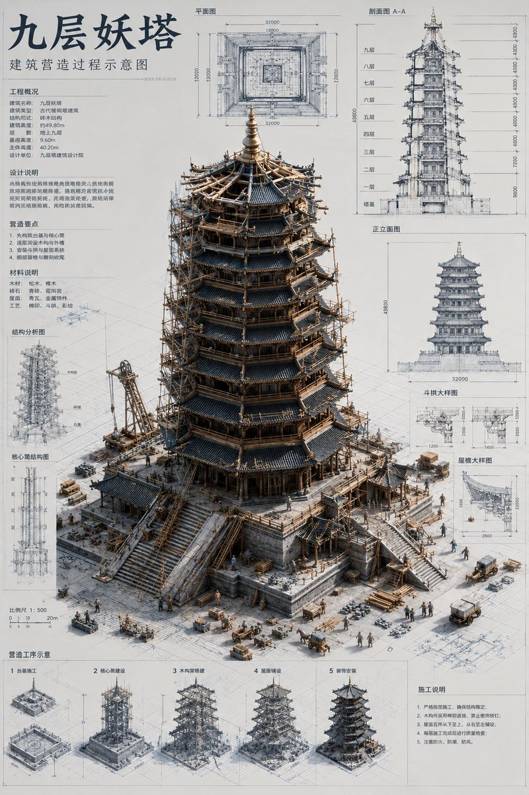</a>

```text
请生成一张竖版 2:3 高清图片，主题为《建筑微缩蓝图》。  建筑名称：{argument name="建筑名称" default="九层妖塔"}  画面是一张现代建筑设计手稿，上面布满中文平面图、剖面图、立面图、结构细节图、尺寸标注和施工说明。一座高度仿真的中国古建筑微缩模型，从图纸中立体“建”出来。  主建筑要占画面 65%–75%，更大、更高、更有视觉冲击力。使用低角度 3/4 俯视视角，突出模型高度、体积感和真实阴影。建筑要符合所选主题的真实特征，并呈现正在施工中的状态，完成度约 70%–85%。  加入微缩施工细节：施工小人、脚手架、木架、坡道、滑轮、木梁、石块、瓦片、材料堆、小推车、马车、半完成台阶、屋顶施工区等。细节要围绕建筑本身展开，形成一个仿真的微缩建造世界。  整体风格是现代建筑事务所概念提案板 + 博物馆级微缩模型。图纸干净高级，颜色以米白、浅灰、淡蓝、灰黑线稿为主。所有文字必须是中文，主标题写“[建筑名称]”，副标题写“建筑营造过程示意图”。  使用柔和中性光线，画面清晰、现代、克制、有高级感。
```

## by [Larus Canus](<https://x.com/MrLarus>) on May 13, 2026 👉 [Try Now](https://indream.ai/generate?mode=IMAGE&modelKey=gpt-image-v2&modelPromptId=019e609a-53c4-7295-bdf0-9b94ee3a0601)

<a href="./public/images/30a94a29-644a-4619-9234-78ffc9050a8f.png" target="_blank" rel="noopener noreferrer">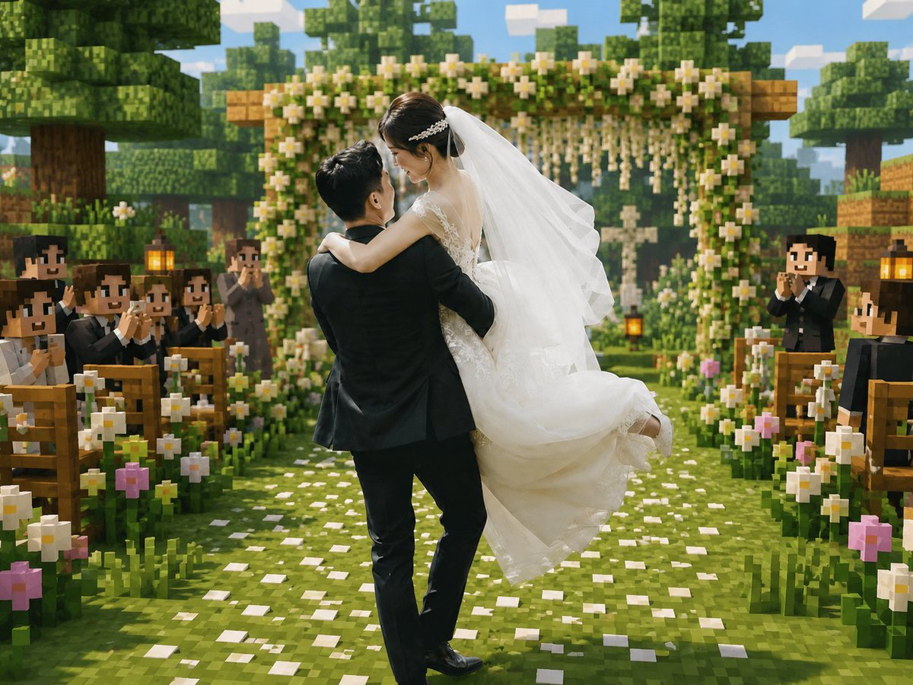</a>

```text
Create a cinematic Minecraft-inspired voxel wedding scene that blends realistic newlyweds with a blocky game world. In the center foreground, show a groom in a black suit lifting and carrying a bride in a flowing white lace wedding dress; the couple should be the only mostly realistic photographic figures, with softly anonymized/blurred faces, while the environment and guests are fully voxel/block-style. The bride wears a long white veil, delicate hair accessory, sleeveless lace bodice, and voluminous skirt lifted by motion; the groom faces away slightly, holding her romantically. Place them on a grassy aisle covered with scattered white flower petals, leading toward a square wooden floral wedding arch decorated with dense green leaves, white blossoms, and hanging flower strands. Surround the aisle with exactly two rows of wooden benches, one row on the left and one on the right, filled with blocky Minecraft-style wedding guests in dark formal suits and white shirts, clapping and smiling; include visible lanterns on posts near the seating. Add abundant blocky flowers along both sides of the aisle, mostly white daisies with a few pink blossoms. The background should show cubic trees, layered voxel foliage, wooden blocks, a bright blue sky with rectangular clouds, warm daylight, soft depth of field, and a joyful romantic atmosphere. Use a square-to-landscape 4:3 composition, centered perspective down the aisle, high-detail voxel textures, vibrant greens, warm highlights, realistic fabric detail on the bride and groom, and a seamless blend of real wedding photography with Minecraft game-map aesthetics. No text, no watermark, no UI elements.
```

## by [麻酱AI实验室](<https://x.com/zhongying14>) on May 13, 2026 👉 [Try Now](https://indream.ai/generate?mode=IMAGE&modelKey=gpt-image-v2&modelPromptId=019e609a-fb6d-706c-90ab-1620c0d70887)

<a href="./public/images/45b3a75a-f45b-4786-9c02-353bc2e89af6.png" target="_blank" rel="noopener noreferrer">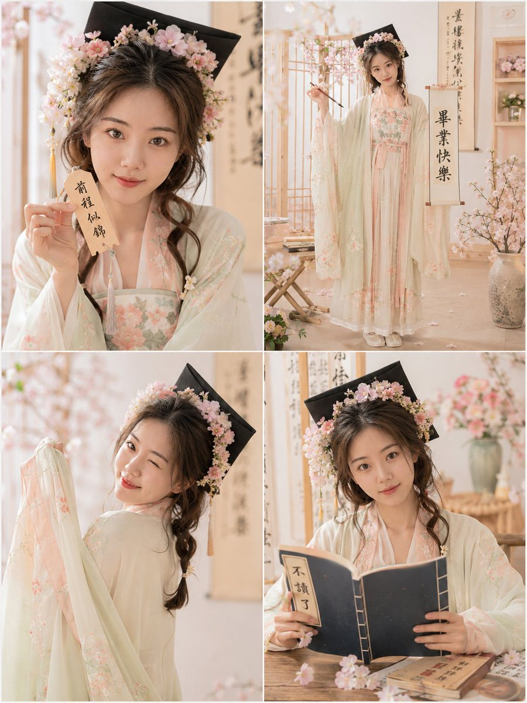</a>

```text
请基于用户上传的 1-3 张清晰个人照片，生成一张 2×2 四宫格拼贴写真，单张比例3:4，主题为「{argument name="主题" default="俏皮汉服毕业写真"}」。

【人物一致性】
请严格保留用户本人真实身份特征，包括脸型、五官比例、眼睛、鼻子、嘴唇、肤色、年龄感、发型基础和整体气质。四张小图里都必须清楚看起来是同一个真实女生，不能变成陌生人，不能欧美化，不能网红化，不能过度磨皮，不能出现 AI 假脸。

【整体风格】
整组图为近两年中国社交媒体流行的新中式毕业写真风格，主打俏皮、灵动、元气、可爱、讨喜的少女毕业感。画面像一组轻松、有趣、适合毕业季传播的汉服创意毕业照，整体干净明亮，带轻微中式甜系审美。

【妆容】
妆容为甜美清透少女妆。底妆轻薄透亮，肤色白净自然。眼妆为浅杏粉、蜜桃粉、暖棕色调，眼线细而柔和，睫毛自然卷翘，可带轻微卧蚕。腮红为蜜桃粉或苹果粉，唇色为奶油粉、桃粉或珊瑚粉。整体妆感年轻、灵动、元气。

【发型】
发型根据上传照片中的原始发长自然延展，但优先做更适合簪花毕业帽的造型。
- 长发优先：半盘发、双侧编发、低双髻、轻盘发，保留碎发和空气感。
- 中长发优先：半扎发、双辫、低位盘发。
- 短发优先：耳后收发、短发盘感、法式短卷配小体量簪花帽。
不要四张都做大面积披发，不要让头发压住帽子与脸。

【服装与头饰】
服装为俏皮感汉服毕业写真造型，可使用浅绿、粉白、浅黄、奶白、淡粉等柔和明亮配色。服装轻盈、有刺绣、披帛、宽袖、花纹细节。必须搭配簪花款学士帽或花饰毕业帽，花材清新轻盈，带少量流苏和坠饰。

【场景与道具】
场景为干净明亮的中式轻棚拍空间，背景以米白、暖白、浅木色为主，点缀樱花枝、小木桌、花器、书本、卷轴、挂签。道具包括毛笔、书卷、题词牌、小木签、花枝。文字道具请使用繁體中文与毛筆書法，短句清晰可读，例如：「畢業快樂」「前程似錦」「好運」「不讀了」。

【光线与质感】
使用柔和明亮的布光，整体清透、干净、柔和，面部清晰，衣料和头饰细节完整。画面有轻微柔光感，但不要硬锐，不要影楼感，不要现代商业广告感。

【四宫格固定镜头】
请严格按照以下 4 个固定镜头生成四宫格，每格都为 3:4 竖构图：

1. 左上：近景主视觉
半身近景，人物正面或轻微 3/4 角度看向镜头，手中轻捏一块小木题词牌，表情为温柔微笑或自然甜笑。突出脸部、簪花帽、妆容与人物辨识度。

2. 右上：全身造型图
全身站姿，展示完整服装和帽子。一只手拿毛笔，另一只手持竖幅题字卷轴，表情自然明亮，轻松自然露齿笑。身体不要笔直僵硬，可轻微错步、微侧身、重心有变化，增加灵动感。

3. 左下：俏皮动作图
3/4 侧身或半侧身构图，人物提袖、回头、或轻歪头，可做眨眼、抿嘴笑、调皮笑等更丰富表情。突出“俏皮感”和动作变化，不能与第一张表情重复。

4. 右下：书卷互动图
坐姿或靠桌半身图，手持线装书或卷轴，表情为温柔看镜头或低头轻看书页。手部动作自然，构图中带前景花朵或桌面道具，增强层次。

【固定不变】
以下内容四张图统一：
- 同一个真实女生
- 同一套服装体系
- 同一套簪花学士帽体系
- 同一类甜美元气妆容
- 同一组场景色调
- 同一类中式道具体系

【必须体现的变化】
四张图必须明确区分：
- 近景 / 全身 / 俏皮动作 / 道具互动
- 正面 / 3/4 侧面 / 半侧身 / 坐姿
- 甜笑 / 自然笑 / 俏皮表情 / 露齿笑
不能四张都像证件式正脸。

【避免】
不要四张都正面看镜头
不要四张都站着
不要头发全部披散
不要简体印刷字
不要现代网红妆
不要过度磨皮
不要动作僵硬
不要背景杂乱
不要水印和 logo
```

## by [Sairah](<https://x.com/Sairah_0>) on May 13, 2026 👉 [Try Now](https://indream.ai/generate?mode=IMAGE&modelKey=gpt-image-v2&modelPromptId=019e609c-a2fb-70c3-bfb8-bff98dea1d1f)

<a href="./public/images/6328ce94-a3c9-4db6-8ab2-ba250412138f.png" target="_blank" rel="noopener noreferrer">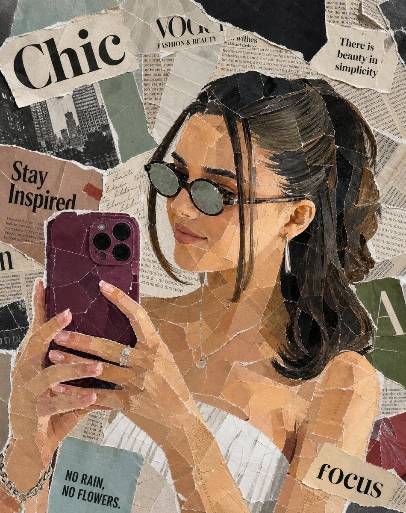</a>

```text
Aesthetic vintage paper collage portrait of a stylish woman taking a mirror selfie, made entirely from torn magazine and newspaper pieces, layered mixed-media artwork, neutral beige and brown tones, Vogue-inspired fashion editorial style, black sunglasses, sleek ponytail hairstyle, white corset top, silver jewelry, purple smartphone, textured ripped paper edges, handcrafted mosaic effect, realistic shadows and depth, chic typography cutouts, inspirational quotes scattered around, cozy luxury aesthetic, highly detailed analog collage art, soft warm lighting, Instagram moodboard vibe, premium editorial composition, ultra detailed, 4k Vintage breakfast aesthetic collage made from torn magazine and newspaper clippings, artistic mixed-media paper mosaic style, croissants on a plate with jam, black coffee in a dark cup, fresh fruits and berries, butter dish with knife, café table atmosphere, dark green textured background, ripped paper layers with visible cracks and folds, lifestyle editorial typography, cozy European café vibe, warm earthy tones, handcrafted scrapbook look, realistic paper texture, aesthetic Pinterest moodboard composition, soft cinematic lighting, luxury brunch aesthetic, ultra detailed, high realism, 4k collage art style
```

## by [アシタ🩵](<https://x.com/ashiwata100>) on May 13, 2026 👉 [Try Now](https://indream.ai/generate?mode=IMAGE&modelKey=gpt-image-v2&modelPromptId=019e609d-ad27-738d-b8b7-089456f84bd0)

<a href="./public/images/19b6cfbd-d051-454f-be01-14660b5a950c.png" target="_blank" rel="noopener noreferrer">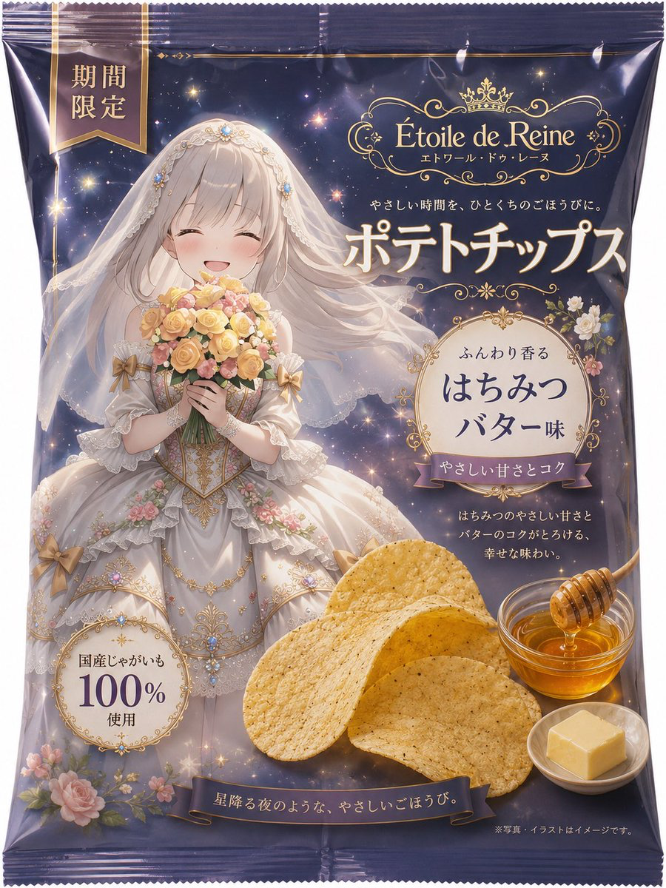</a>

```text
Goal: Create a vertical premium potato chips package design based on an ornate anime princess illustration, like a finished retail snack bag mockup.

Canvas: Portrait 3:4 product-package image, full front view of a glossy crinkled potato chip bag with sealed ridged top and bottom edges. Use a deep midnight navy and black-purple background with gold trim, sparkles, tiny stars, and luxury confectionery styling.

Main subject: On the left and center, show an elegant anime-style princess bride wearing an elaborate white lace gown with gold embroidery, jeweled bodice, pearl details, bows, floral appliqués, and a translucent veil flowing across the package. She holds a bouquet of yellow, cream, and pink roses. Her face area is covered by a plain centered beige rectangular placeholder, as if the character portrait can be swapped in later. Her long pale silver-blonde hair and veil blend into a magical starry night background.

Brand and text layout: At the upper right, place an ornate gold logo frame with a small crown and the brand name {argument name="brand name" default="Étoile de Reine"}, with the small Japanese subtitle 「エトワール・ドゥ・レーヌ」 beneath it. Below the logo, add a small elegant Japanese tagline 「やさしい時間を、ひとくちのごほうびに。」. Make the largest central headline in Japanese read {argument name="main product text" default="ポテトチップス"} in creamy white with a gold glow. At the top left, add a vertical hanging ribbon label in dark navy and gold that says {argument name="limited label" default="期間限定"}.

Flavor badge: On the right middle, create a cream circular ornamental label with gold filigree and flowers. Text inside should read 「ふんわり香る」 above the main flavor {argument name="flavor text" default="はちみつ バター味"}. Add a small mauve ribbon across the badge reading 「やさしい甘さとコク」. Beneath it, include small Japanese copy: 「はちみつのやさしい甘さと バターのコクがとろける、 幸せな味わい。」

Food elements: In the lower right foreground, show exactly 5 large golden potato chips overlapping, with visible seasoning specks and realistic crisp texture. To their right, show exactly 1 small glass bowl of honey with exactly 1 wooden honey dipper dripping honey. In front of it, show exactly 1 small white dish holding exactly 1 square pat of butter.

Quality badge and decorative elements: In the lower left, add a cream and gold circular badge reading 「国産じゃがいも 100% 使用」. Decorate the bottom left with pink roses and small flowers. Along the bottom, place a dark ribbon banner with gold trim reading {argument name="bottom slogan" default="星降る夜のような、やさしいごほうび。"}. Add tiny legal text at bottom right: 「※写真・イラストはイメージです。」

Visual style: Highly polished Japanese luxury snack packaging, glossy plastic reflections, realistic package folds and highlights, ornate gold typography, soft magical lighting, detailed anime illustration, romantic royal theme, premium limited-edition feel. Keep all text legible and arranged like a real retail package. Do not add extra characters, extra food items, logos, barcodes, or watermarks.
```

## by [アシタ🩵](<https://x.com/ashiwata100>) on May 13, 2026 👉 [Try Now](https://indream.ai/generate?mode=IMAGE&modelKey=gpt-image-v2&modelPromptId=019e609d-8b6f-74ee-bc0b-bae70ee160a4)

<a href="./public/images/7685af0e-f4ee-4b11-aef5-4dc5e0247a01.png" target="_blank" rel="noopener noreferrer">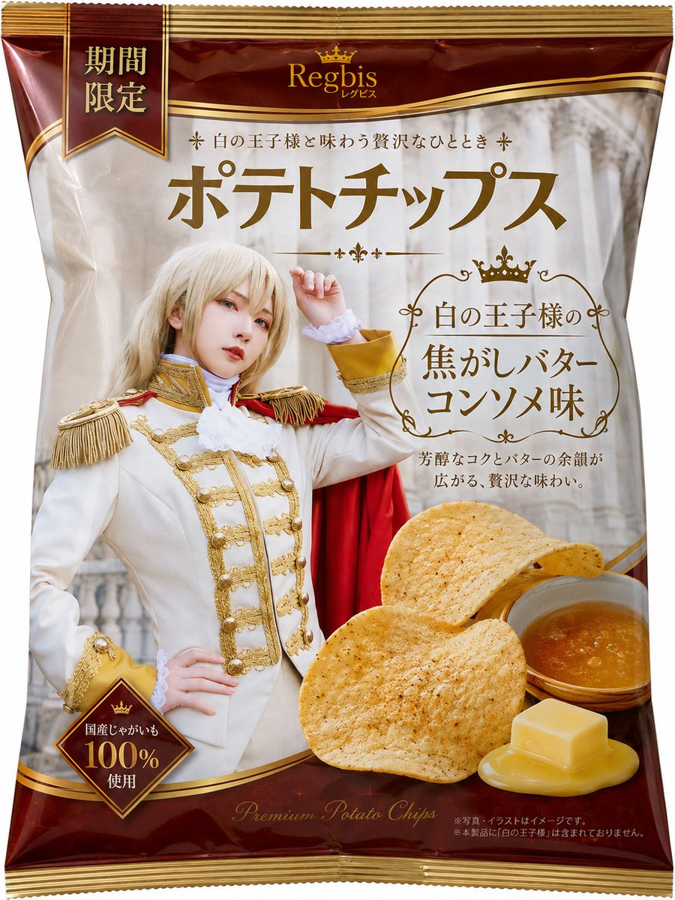</a>

```text
Goal: Create a premium Japanese potato chips package design based on an illustration-world concept, turning a royal character into a colorful snack bag advertisement.

Canvas: Front-facing vertical product package mockup, 3:4 aspect ratio, isolated on a clean white background. The bag should look like glossy crinkled plastic with sealed ridged edges at the top and bottom, subtle folds, highlights, shadows, and slight perspective bulging like a real snack bag.

Package design: Use an elegant white, burgundy, and metallic gold color palette. The top and bottom bands are deep burgundy with gold trim lines; the main center area is pale white/cream with a faint palace or marble-column background. Add ornate gold flourishes, crown motifs, and premium European royal styling.

Brand and main text: At the top center place a gold crown logo and the brand name {argument name="brand name" default="Reggbis"} with small Japanese reading beneath it. In the top-left corner add a vertical burgundy ribbon badge reading 「期間限定」. Across the upper center, add small copy reading 「白の王子様と味わう贅沢なひととき」. The largest central product name should read 「ポテトチップス」 in bold metallic-gold Japanese lettering. On the right, inside an ornate gold frame with a crown, write 「白の王子様の 焦がしバター コンソメ味」. Beneath it add smaller copy: 「芳醇なコクとバターの余韻が広がる、贅沢な味わい。」

Main subject: Show one elegant white prince character occupying the left and center of the package art. The prince has long pale-blond hair and wears a white military-style royal uniform with gold embroidery, epaulettes, decorative buttons, a high collar, lace cuffs, and a red cape draped over one shoulder. Pose him confidently with one hand on his hip and the other hand raised near his head. The face is intentionally covered by a plain rectangular censor-like beige blur, preserving the package aesthetic. Use {argument name="character theme" default="white prince"} as the core character concept.

Food elements: Show exactly 4 food items in the lower-right foreground: 2 golden potato chips, 1 small round bowl of glossy brown consommé sauce, and 1 pat of butter melting on a yellow puddle. Chips should look crisp, lightly speckled, and appetizing, overlapping the lower part of the character and package.

Badges and footer: Add one diamond-shaped burgundy-and-gold badge at the lower left reading 「国産じゃがいも 100% 使用」 with a small crown. Along the bottom burgundy band write “Premium Potato Chips” in elegant gold cursive. Add tiny Japanese disclaimer text at the bottom right, similar to product-package fine print.

Visual style: Realistic commercial snack packaging mockup mixed with polished anime/cosplay illustration art, high-detail glossy plastic, luxury Japanese limited-edition product design, warm gold lighting, sharp typography, premium supermarket snack aesthetic.

Constraints: Keep the design as a single potato chip bag only, no hands holding it, no extra products, no background scene outside the package, and make all Japanese text legible and positioned like authentic Japanese snack packaging.
```

## by [Sairah](<https://x.com/Sairah_0>) on May 13, 2026 👉 [Try Now](https://indream.ai/generate?mode=IMAGE&modelKey=gpt-image-v2&modelPromptId=019e60a0-cefe-7588-a8fb-979af22b6fa2)

<a href="./public/images/86bfac9a-31a1-48d2-8e5e-42f6f6a1c417.png" target="_blank" rel="noopener noreferrer">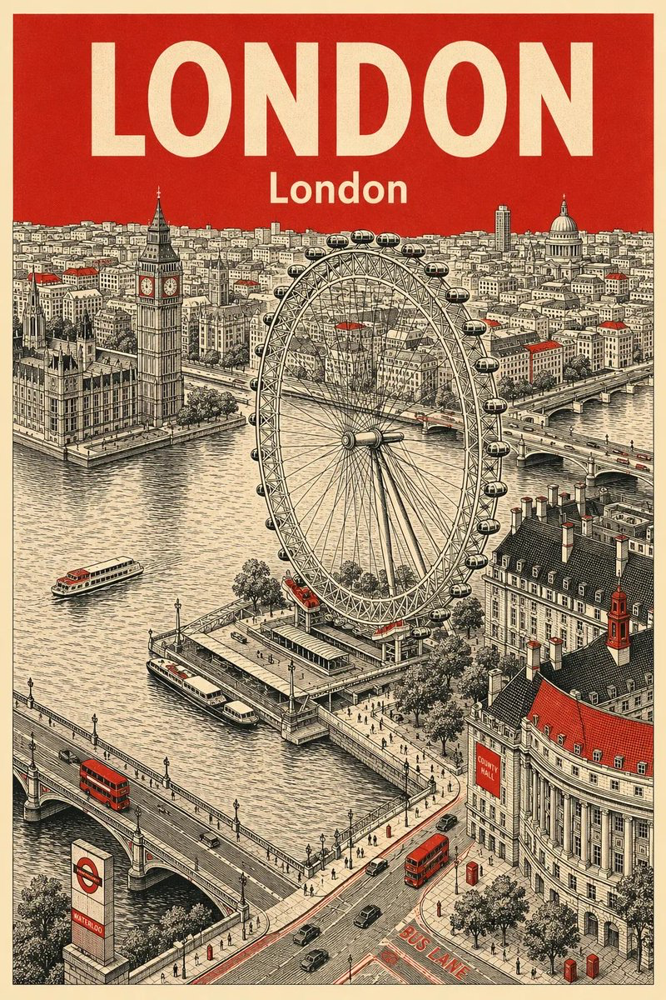</a>

```text
Vintage travel poster illustration of London, ultra-detailed aerial cityscape, featuring the London Eye, Big Ben, River Thames, Westminster Bridge, red double-decker buses, classic British architecture, and busy streets, drawn in intricate pen-and-ink linework with retro engraving style, limited color palette of cream, black, and deep red, large bold typography “LONDON” at the top, textured aged paper background, symmetrical composition, highly detailed urban panorama, mid-century tourism poster aesthetic, cinematic perspective, clean vector-like detailing, nostalgic European travel advertisement style, 4k. Vintage travel poster illustration of Singapore, highly detailed aerial view of Marina Bay Sands, ArtScience Museum, skyline, waterfront, bridges, and modern city architecture, intricate pen-and-ink engraving style with retro travel poster aesthetics, limited color palette of cream, black, and mustard yellow, bold typography “SINGAPORE” at the top, textured old-paper look, ultra-detailed city panorama, futuristic yet nostalgic atmosphere, clean architectural linework, symmetrical composition, classic tourism advertisement poster, cinematic bird’s-eye perspective, 4k.
```

## by [ケンイチ | AIスキルアカデミー『誰でもわかるAI活用術』](<https://x.com/ChatgptAIskill>) on May 12, 2026 👉 [Try Now](https://indream.ai/generate?mode=IMAGE&modelKey=gpt-image-v2&modelPromptId=019e60a9-f8a8-75af-b037-181bde8d6c76)

<a href="./public/images/16c6fdeb-ab48-4f8f-a91e-e9af6d280f87.png" target="_blank" rel="noopener noreferrer">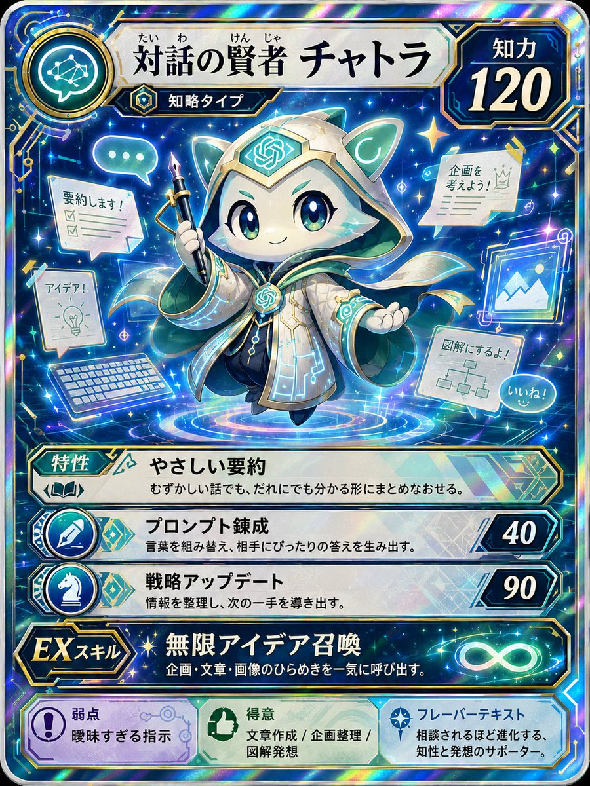</a>

```text
私が普段使っている{argument name="対象" default="ChatGPT"}を、{argument name="カードの種類" default="ポケモンカード"}にして。キャラクターは{argument name="属性" default="完全オリジナル"}で
```

## by [Cherry 2.O](<https://x.com/Mind_Boticni>) on May 12, 2026 👉 [Try Now](https://indream.ai/generate?mode=IMAGE&modelKey=gpt-image-v2&modelPromptId=019e60ab-2c86-70cc-9630-59260c489cd4)

<a href="./public/images/4a0dfd39-d7a5-496d-b8e2-f41292946954.png" target="_blank" rel="noopener noreferrer">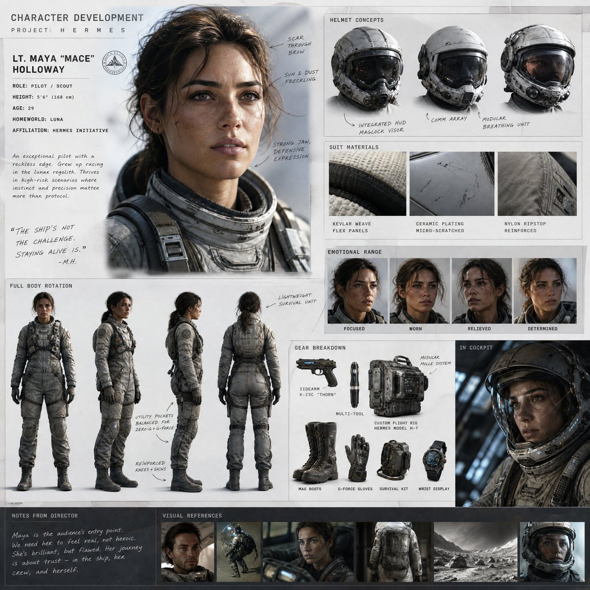</a>

```text
Create a high-end cinematic character development board for a grounded sci-fi film universe.

The presentation should resemble a professional Hollywood pre-production document rather than a clean template. Use layered panels, overlapping renders, handwritten-style annotations, and cinematic framing.
Design a realistic {argument name="character" default="female space pilot"} with believable anatomy, subtle asymmetry, realistic facial structure, and worn futuristic clothing. Include helmet concepts, suit material closeups, emotional portraits, full-body rotation views, and gear breakdowns.
Style: soft cool lighting, {argument name="style focus" default="NASA-inspired realism"}, cinematic lens blur, brushed metal textures, subtle futuristic interfaces, atmospheric sci-fi realism, premium concept-art presentation.
```

## by [Larus Canus](<https://x.com/MrLarus>) on May 12, 2026 👉 [Try Now](https://indream.ai/generate?mode=IMAGE&modelKey=gpt-image-v2&modelPromptId=019e60ab-eb8d-7275-9494-7f644f8580ed)

<a href="./public/images/cc7127bc-4c5f-411c-ac92-401400380f6f.png" target="_blank" rel="noopener noreferrer">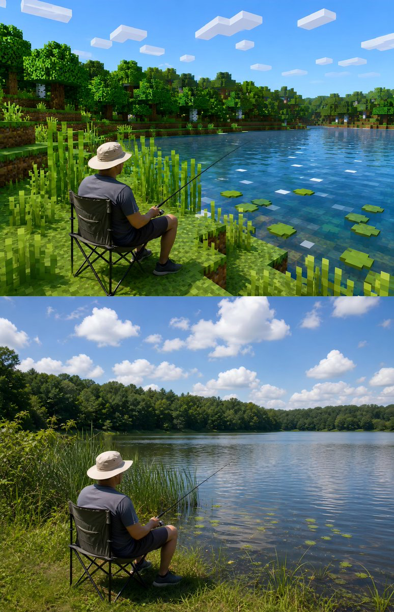</a>

```text
请基于用户上传的真实户外照片进行风格化改造。

保留照片中的主体不变，主体可以是人物或动物。尽量保留主体的外貌识别度、姿态、服装、毛发、真实摄影感，不要换脸，也不要把主体彻底像素化。
```

## by [Eris Create Lab](<https://x.com/Eris_Create_Lab>) on May 12, 2026 👉 [Try Now](https://indream.ai/generate?mode=IMAGE&modelKey=gpt-image-v2&modelPromptId=019e60ac-827b-75ff-be0d-79e319920b24)

<a href="./public/images/57dc3765-0c63-4127-aa68-579de1195789.png" target="_blank" rel="noopener noreferrer">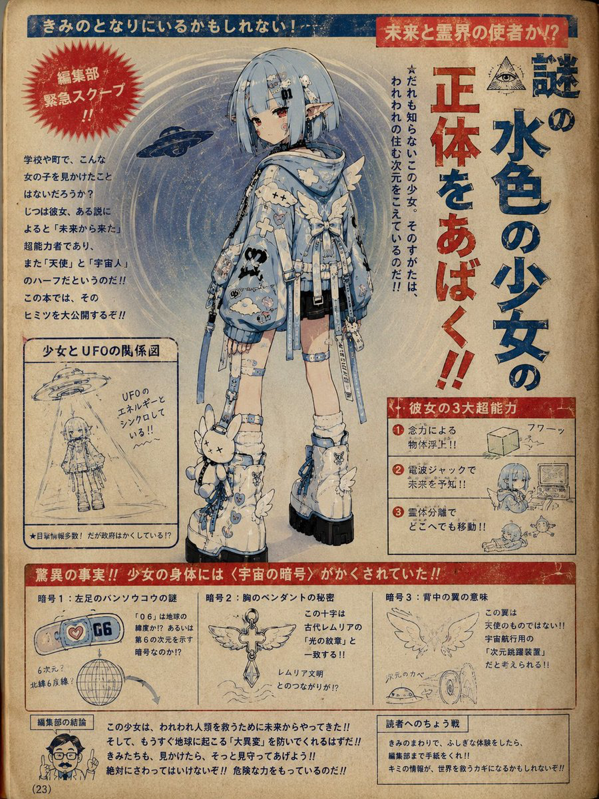</a>

```text
このキャラクターを使って、 {argument name="テーマ" default="1970年代頃の児童向けオカルト・未来科学・超常現象系児童書の1ページ"}を描く。

参照画像はそのまま使用せず、ページの内容にあったシチュエーションと構図にする。

重要: 参照画像を元に1970年代児童書編集者が無理やり超常現象や未来科学に結びつけて解釈した内容にする。

「このキャラを見た当時の大人が、 勝手に意味深な存在だと思い込み、 珍説・超理論・オカルト解釈を展開している」 ような誌面にする。

実在しそうで、 しかし意味不明な飛躍解釈を重視する。

内容は毎回ランダムで、 編集者の妄想と断定が暴走していること。 子供を煽る断定的な文章を含める。

誌面は1970年代児童書風。 古い紙、印刷ズレ、色褪せ、雑な図解、赤青インク、手描き矢印、意味不明な図表を含める。

毎回:

異なる超解釈

異なる誌面構成

異なる断定

異なる珍説

異なるカメラアングル にする。

重要: 「本当に存在したかもしれない変な児童書感」を重視する。 正統派SFではなく、 珍説・こじつけ・飛躍解釈・オカルト編集者の熱量を優先する。
```

## by [kai](<https://x.com/kai_tetu>) on May 11, 2026 👉 [Try Now](https://indream.ai/generate?mode=IMAGE&modelKey=gpt-image-v2&modelPromptId=019e60b2-dcb8-7419-8209-83fecd461110)

<a href="./public/images/1793e9a7-8a68-4623-9617-642bab6f3c0a.png" target="_blank" rel="noopener noreferrer">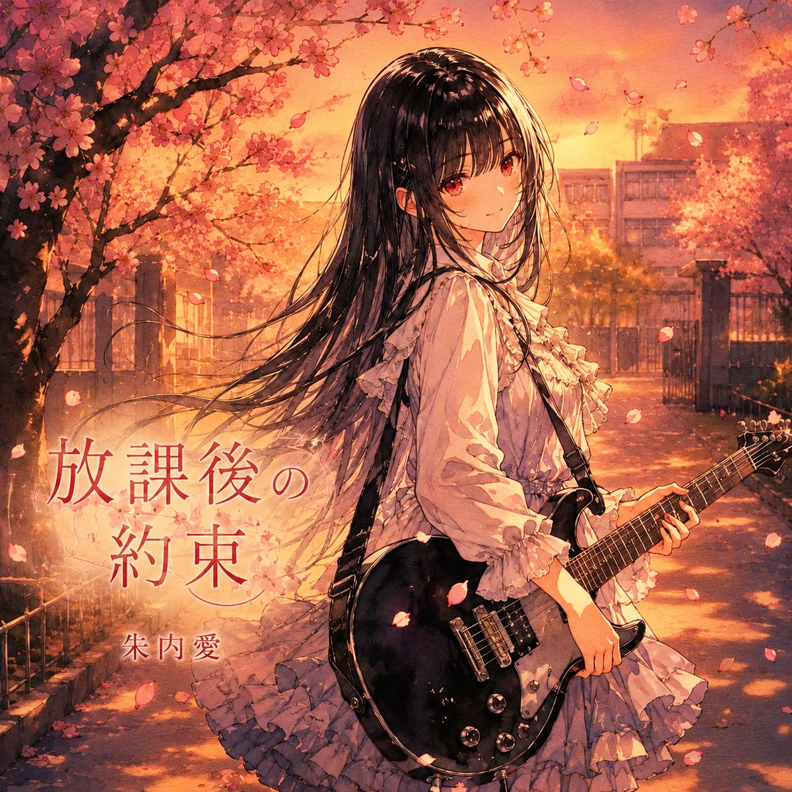</a>

```text
Create a square anime-style CD jacket cover illustration for a sentimental Japanese school rock ballad. The scene shows a beautiful teenage girl standing on a cherry-blossom-lined path outside a school campus at golden-hour sunset, turned slightly back toward the viewer with a calm, wistful expression. She has very long flowing black hair, soft red-brown eyes, pale skin, and wears a frilly ivory blouse with ruffled sleeves and a layered pale lavender-gray skirt, giving a romantic gothic-lolita school-uniform feeling. She holds a glossy black electric guitar with chrome hardware and a shoulder strap across her body, the guitar angled diagonally in the lower right foreground. Cherry blossom branches fill the upper left and top edge, with pink petals drifting through the warm orange air; the background includes a school gate, fence, trees, and softly blurred school buildings bathed in sunset light. Use highly detailed painterly anime rendering, warm cinematic lighting, delicate linework, emotional album-cover composition, rich peach, coral, amber, and rose tones, soft depth of field, nostalgic atmosphere, and subtle film-grain texture. Add exactly two visible text elements in elegant Japanese typography: the large title {argument name="album title" default="放課後の約束"} placed on the left side in translucent deep red, and the smaller artist name {argument name="artist name" default="朱内 愛"} below it. Keep the text integrated like professional music cover art, with no extra logos, borders, track lists, or watermarks.
```

## by [小英镑知识分享](<https://x.com/Sun11250018>) on May 11, 2026 👉 [Try Now](https://indream.ai/generate?mode=IMAGE&modelKey=gpt-image-v2&modelPromptId=019e60b4-bb29-72fa-bce0-13b09024570b)

<a href="./public/images/aba71f5d-edab-45c5-86a1-40ee18055c55.png" target="_blank" rel="noopener noreferrer">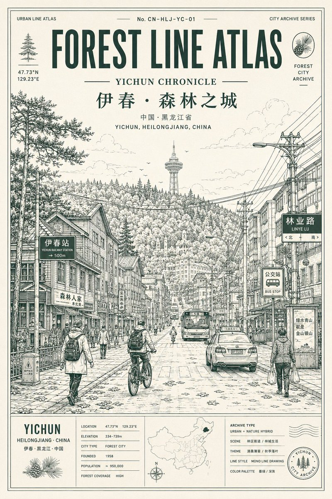</a>

```text
请生成一张高完成度的「城市线描图鉴海报 / Urban Line Atlas Poster」。

这张图基于“单色城市线描旅行海报”的视觉语言进行设计，包含顶部大标题、中部街景纵深、核心地标、左右建筑、前景人物、底部落款的完整构图结构。

【主题城市】
城市名称：{argument name="城市" default="伊春（Yichun）"}
英文主标题：{argument name="英文标题" default="FOREST LINE ATLAS / YICHUN CHRONICLE"}
中文标题：伊春 · 森林之城
国家 / 地区：中国 黑龙江省
核心地标：小兴安岭森林、红松林海、五营国家森林公园观景塔
街区场景：林区小城街道、带木质建筑的居民街口、林业城市氛围
情绪主题：清晨薄雾中的通勤时刻
主色调：{argument name="主色调" default="墨绿 + 深灰线描"}
画幅比例：3:4竖版

【整体定位】
这是一张兼具旅行纪念海报、城市视觉图鉴、建筑线描手稿和编辑设计封面的作品。画面需要呈现伊春“森林中的城市”这一独特气质，既有城市识别度，又有真实街头生活感，不是普通旅游海报，也不是单一地标插画，而是一张具有收藏价值的城市档案视觉作品。
【构图设计】
顶部为强标题区，使用大字号英文标题「FOREST LINE ATLAS」，辅以副标题「YICHUN CHRONICLE」，可加入编号系统（如 No. CN-HLJ-YC-01）与简要坐标信息，排版现代且具有设计感。
中部为城市街景主体，采用街道纵深透视构图，视角略微仰视，道路向远方延伸并逐渐进入森林区域。
核心地标为远景中的森林观景塔或小兴安岭林海轮廓，清晰但不过度突出，自然融入街景。
左右两侧加入本地建筑细节：木质房屋、林业局风格建筑、居民楼、小商铺、公交站、路灯、电线杆、简洁路牌等，形成高密度城市信息。
前景加入生活元素：穿秋冬服装的行人、骑自行车的人、拎购物袋的居民、小型车辆，地面有落叶增强季节氛围。
底部设置独立落款区，设计为城市档案标签结构，包含「YICHUN / HEILONGJIANG / CHINA」以及简化城市信息模块或地图索引风格排版。
【文字系统】
顶部主标题清晰醒目。画面中仅保留2–4处清晰可读文字（如“伊春站”“林业路”“公交站”），其余招牌使用抽象化中文笔画或符号化字符，避免乱码。整体文字系统需统一、克制，并融入设计结构中。
【视觉风格】
整体采用单色或极少量双色线描风格，背景为米白或暖白纸张质感。线条精密、干净、有层次，具有建筑钢笔手稿感与丝网印刷质感。近景线条略粗，远景线条更细，人物与物件简洁但可辨识，整体风格克制高级。

【创新要求】
在以下方面进行设计变化：标题命名系统、顶部排版结构、街景轻微仰视视角、森林与城市融合构图、底部档案式信息模块、秋季落叶氛围表达。
【避免事项】
不要普通旅游海报风格，不要水彩、厚涂、卡通Q版，不要赛博朋克，不要高饱和色彩，不要廉价纪念品风格。

请生成一张独立完整、高清、线条清晰、具有收藏感与系列辨识度的竖版城市线描海报。
```

## by [サボテン｜AI活用Tips](<https://x.com/saboten_ai_>) on May 11, 2026 👉 [Try Now](https://indream.ai/generate?mode=IMAGE&modelKey=gpt-image-v2&modelPromptId=019e60b5-9264-7129-8566-89d7d253f9ab)

<a href="./public/images/25eaf5e2-fda1-49ad-888a-50fb36c6fda8.png" target="_blank" rel="noopener noreferrer"></a>

```text
{"type":"3D anime dating-sim visual novel event scene screenshot","aspect_ratio":"16:9 widescreen game UI","style":"high-quality 3D anime render with soft depth of field, warm cinematic lounge lighting, glossy game interface overlays, romantic hostess club atmosphere, polished mobile/console game screenshot","setting":{"location_name":"{argument name=\"location name\" default=\"ルミナス・ラウンジ\"}","sub_location":"{argument name=\"sub location\" default=\"カウンター席\"}","environment":"luxury lounge bar at night with pink sofas, round black tables, backlit liquor shelves, warm candles, city lights through dark windows, burgundy curtains, decorative flowers, amber and rose lighting"},"main_character":{"name":"{argument name=\"character name\" default=\"結衣\"}","position":"large foreground center, leaning toward the viewer across a small table","appearance":"cute blonde anime hostess with long twin ponytails, pink scrunchie, side-swept bangs, pink hairpins, pink eyes, blushing cheeks, one eye winking, gentle teasing smile","outfit":"pink-and-white frilled hostess uniform with deep neckline, plaid bow at collar, fitted bodice, name tag reading Yui, delicate bracelet, feminine idol-hostess styling","pose":"friendly service pose, slightly tilted head, shoulders forward, intimate eye contact"},"background_characters":{"count":3,"descriptions":["left background: seated woman with long purple hair wearing a purple dress on a pink sofa beside a handbag","center rear: dark-haired bartender or hostess behind the bar wearing a burgundy outfit","right background: pale lavender-haired woman seated at the counter in an off-shoulder dress, seen from behind"]},"foreground_props":{"count":2,"items":["small round side table with a gold-rimmed tray","clear cocktail glass with ice, red straw, and pink drink garnish"]},"ui_layout":{"top_left_location_panel":{"count":2,"items":["pin icon with location text: ルミナス・ラウンジ","pin icon with sub-location text: カウンター席"]},"top_right_status_panel":{"count":3,"items":["money counter with ticket icon reading 1,287,600","affection level bar with heart icon reading 親愛Lv. 4 and progress 720/1000","gift button with present icon reading プレゼント and a pink notification badge +1"]},"dialogue_area":{"bottom_dialogue_box":"semi-transparent black dialogue window spanning the bottom, character nameplate in pink gradient labeled 結衣 with a speaker icon","dialogue_text":"{argument name=\"dialogue text\" default=\"はい、お待たせしました～♪ 今日のおすすめ、気に入ってくれるといいなっ♡\"}","controls_count":2,"left_controls":["スキップ button with fast-forward icon","ログ button with list icon"]},"choice_menu":{"position":"right center","count":3,"style":"rounded horizontal choice buttons, first option highlighted in bright pink gradient with double-chevron icon, remaining options dark translucent with chat-bubble icons","choices":["{argument name=\"highlighted choice\" default=\"ありがとう、美味しそう！\"}","ゆいちゃんと話したくて来たよ","おすすめってある？"]},"bottom_button_hints":{"count":4,"items":["L オート","R UI非表示","X 履歴","A 決定"]}},"composition":"Place the main character sharply in focus and oversized in the center foreground, with background patrons softly blurred. Keep the UI readable and layered over the scene like an actual playable game event screen. Use a warm pink, gold, and dark brown color palette, realistic bar reflections, shallow depth of field, and a romantic premium hostess lounge mood."}
```

## by [Gadgetify](<https://x.com/Gdgtify>) on May 11, 2026 👉 [Try Now](https://indream.ai/generate?mode=IMAGE&modelKey=gpt-image-v2&modelPromptId=019e60b6-77a9-76dd-a681-810e28c781e6)

<a href="./public/images/91486629-a833-4dc1-82ff-f20dd508e7f8.png" target="_blank" rel="noopener noreferrer">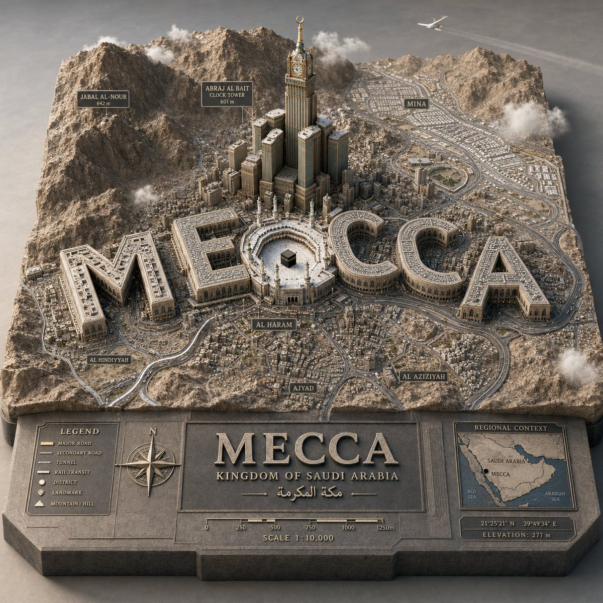</a>

```text
PYTHON_SCENE_GRAPH :: PARAMETRIC_CITY_RELIEF class Variables: city = "{argument name="city" default="[CITY]"}" city_name_text = "{argument name="city name" default="literal city name from input"}" region_context = "infer country, terrain, climate, culture, urban identity" topography = "infer mountains, rivers, coastlines, plains, islands, deserts, hills" urban_grid = "infer district density, roads, transit corridors, urban pattern" landmarks = "infer landmark_set(city)" signature_core = "infer most symbolic central landmark or public space" style = "luxury 3D cartographic city model" class TerrainSlab: form = "thick raised cutout map base" surface = Variables.topography edges = "engraved title panel, legend, compass, scale, inset regional map" material = "matte stone/plaster/cartographic model material" class CityTypography: text = Variables. city_name_text form = "monumental 3D letters" function = "each letter is an inhabitable building mass" placement = "integrated into city map, not floating" rule = "word must remain readable from aerial view" class UrbanLayer: roads = Variables.urban_grid districts = "infer neighborhoods and density zones" landmarks = Variables.landmarks core = Variables.signature_core labels = "derive place labels from city geography" class Atmosphere: camera = "elevated three-quarter macro" lighting = "soft premium studio daylight" details = "vehicles, clouds, aircraft, trees, people only if appropriate" def render(): return """ Render {argument name="target city" default="[CITY]"} as a raised terrain-map diorama where the city name becomes monumental architecture, surrounded by inferred geography, landmarks, labels, roads, and atlas-style cartographic details. """
```

## by [ケンイチ | AIスキルアカデミー『誰でもわかるAI活用術』](<https://x.com/ChatgptAIskill>) on May 11, 2026 👉 [Try Now](https://indream.ai/generate?mode=IMAGE&modelKey=gpt-image-v2&modelPromptId=019e60bb-630c-71c9-96ed-74caf41eeb05)

<a href="./public/images/8e528664-9ae3-4c11-b1ed-524df4635979.png" target="_blank" rel="noopener noreferrer">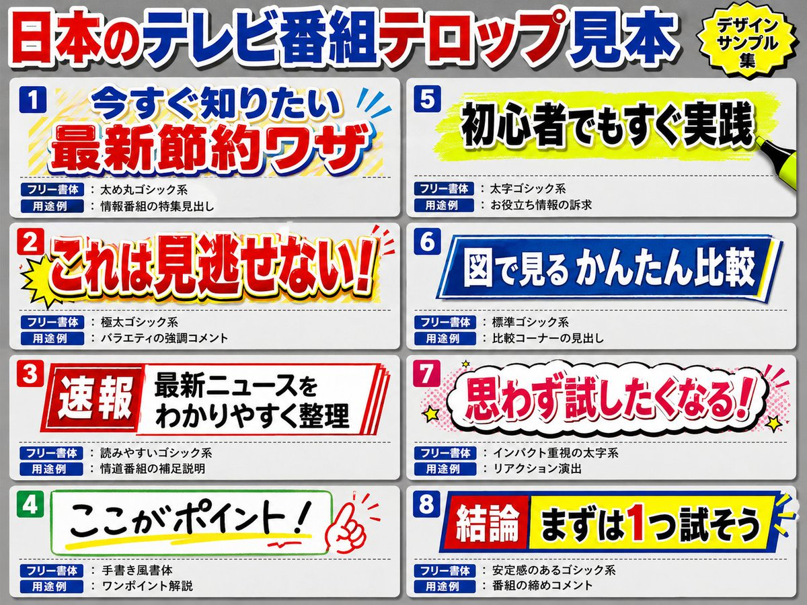</a>

```text
日本のテレビ番組テロップ風のデザインを作成してください。
使用する文字はすべて日本語で、くっきり読めるようにしてください。

フォントの雰囲気：
・メイン見出し：LINE Seed JP Heavy風の太くて読みやすい丸ゴシック
・強調テロップ：バラエティ番組風の極太ゴシック、白フチ＋赤文字＋黄色シャドウ
・補足テキスト：BIZ UDPゴシック風の報道番組らしい読みやすい書体
・手書き風メモ：たぬき油性マジック風のラフな手書き文字

デザイン：
日本の情報番組・バラエティ番組のテロップ集のように、
複数のテロップ見本を1枚に整理。
背景はグレー。
赤、黄色、青、白の強い配色。
白フチ、黒フチ、ドロップシャドウ、蛍光マーカー風の装飾を使う。
各テロップの近くに「フリー書体」「用途例」の小さな説明を入れる。
```

## by [のとろ](<https://x.com/notoro_ai>) on May 11, 2026 👉 [Try Now](https://indream.ai/generate?mode=IMAGE&modelKey=gpt-image-v2&modelPromptId=019e60bc-16f1-7547-aa75-4f6518fca548)

<a href="./public/images/2cc36842-9b06-4cf1-a9d9-74d4fc296370.png" target="_blank" rel="noopener noreferrer">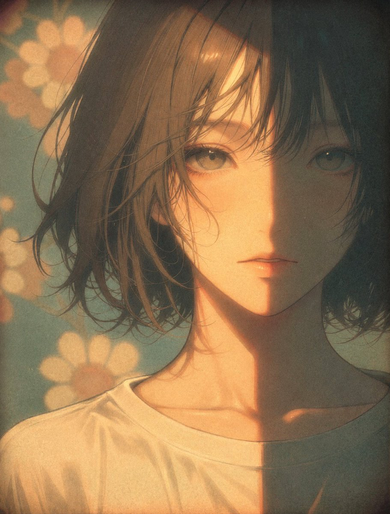</a>

```text
このイラストを、{argument name="スタイル" default="本格的なLo-Fiアートスタイル"}で変換してください。暖かく少しくすんだパステル調の色味、フィルムグレイン、ソフトフォーカス、軽い色褪せとビネットを加えて、ノスタルジックでチルな雰囲気を強く表現してください。柔らかい自然光がキャラクターを優しく包み込み、肌や髪に温かみのある光と影を落とす。全体をゆったりと落ち着いた、どこか懐かしく心地よいLo-Fi特有のムードに仕上げてください。元の構図・キャラクターを完全に維持。
```

## by [SPEEDYAI](<https://x.com/SPEEDAI07>) on May 10, 2026 👉 [Try Now](https://indream.ai/generate?mode=IMAGE&modelKey=gpt-image-v2&modelPromptId=019e60be-866d-74dd-a615-b91273077c7f)

<a href="./public/images/d011a7ae-2f14-46e6-a82d-f43fce05696f.png" target="_blank" rel="noopener noreferrer">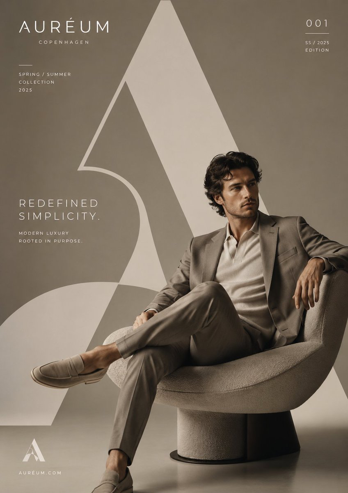</a>

```text
Create a premium modern editorial branding poster for {argument name="brand name" default="[BRAND / CAMPAIGN NAME]"}.

TOPIC:
{argument name="theme" default="[EDITORIAL / FASHION / LIFESTYLE THEME]"}

STYLE & ART DIRECTION:

Contemporary minimalist editorial design

Monochromatic branding aesthetic

Clean luxury composition

Modern creative-agency visual identity

Soft studio photography style

Oversized abstract typography integration

Minimal geometric branding

High-end lifestyle campaign aesthetic

Scandinavian-inspired visual simplicity

Modern art-direction poster design

MAIN SUBJECT:

A stylish realistic [CHARACTER TYPE] seated prominently in a designer chair

Fashion-forward outfit matching the monochromatic palette

Relaxed confident pose

Contemporary editorial styling

Premium realistic studio photography

Modern expressive fashion aesthetic

Strong personality and visual identity

Soft realistic shadows beneath the subject and furniture

Large designer furniture piece integrated as part of the composition

LAYOUT & COMPOSITION:

Same exact minimalist composition and visual structure as the reference design

Large oversized abstract letter or typography shape dominating the background

Subject placed asymmetrically in the foreground

Spacious negative space

Minimal branding details in the corners

Strong visual balance between typography and subject

Editorial magazine-inspired hierarchy

Clean modern alignment

Minimal clutter and highly refined spacing

TEXT & TYPOGRAPHY:

Oversized geometric typography

Minimal branding text

Thin modern sans-serif fonts

Abstract letterform integration

Small editorial metadata text

Luxury contemporary typography hierarchy

DEPTH & LIGHTING:

Soft cinematic studio lighting

Gentle monochromatic shadows

Smooth gradient lighting

Premium editorial depth

Soft realistic reflections

Contemporary luxury atmosphere

EXTRA DESIGN DETAILS:

Minimal grain texture

Clean modern gradients

Abstract geometric branding

Soft monochromatic transitions

Designer furniture aesthetic

Minimal art-poster mood

COLOR PALETTE:

{argument name="dominant color" default="[DOMINANT COLOR]"}

Tonal monochromatic variations

Soft neutral highlights

Clean editorial contrast

QUALITY:

Ultra realistic editorial photography

Premium branding poster

Behance-quality modern composition

Contemporary fashion campaign quality

Same exact visual identity and layout as the reference

Ultra high resolution
```

## by [iNFO Daily](<https://x.com/Info_Chan_Daily>) on May 10, 2026 👉 [Try Now](https://indream.ai/generate?mode=IMAGE&modelKey=gpt-image-v2&modelPromptId=019e60bf-1786-7144-9739-5bede242f0bb)

<a href="./public/images/d709b291-bf3f-4bba-8651-20b4c5284ba2.png" target="_blank" rel="noopener noreferrer">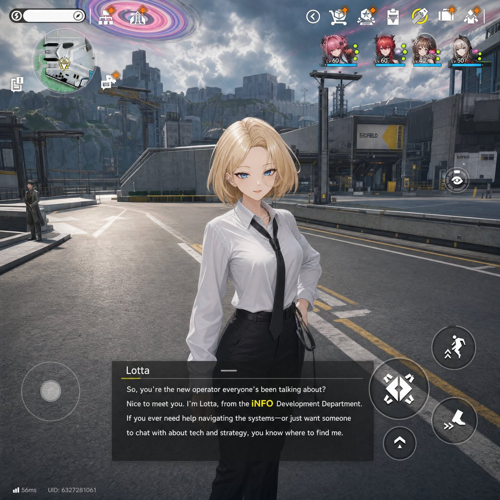</a>

```text
{"type":"gacha game in-engine dialogue screenshot","style":"high fidelity 3D anime-realistic mobile RPG UI, cinematic lighting, detailed industrial sci-fi environment, Arknights Endfield / Zenless Zone Zero / Wuthering Waves inspired, polished game HUD overlay","scene":{"location":"wide outdoor industrial base road in a futuristic mining or logistics district","background":"gray asphalt roadway with lane markings, concrete platforms, metal railings, warehouse buildings, cranes, cliffs, distant blocky city structures, cloudy dramatic sky, and a colorful pink-purple vortex anomaly swirling in the upper sky","camera":"third-person dialogue view, slightly low eye-level, character centered in foreground, 1:1 square mobile screenshot composition"},"character":{"name":"{argument name=\"character name\" default=\"Lotta\"}","position":"center foreground","appearance":"young adult woman with short blonde bob hair, face obscured by a smooth beige square censor block, fair skin, slim build","outfit":"white slightly wrinkled button-up office shirt, loose black necktie, high-waisted black trousers, black belt, one hand on hip, holding a black strap or bag handle","pose":"casual confident NPC dialogue pose facing the player"},"hud":{"top left":{"count":3,"items":["rounded white status bar with circular lightning icon","large circular minimap showing roads and buildings with a yellow diamond objective marker","two small vertical side icons near the minimap for menu/task access"]},"top center":{"count":2,"items":["small home/base icon","small facility or gate icon under the purple sky anomaly"]},"top right":{"count":9,"items":["back arrow icon","mail or package icon with orange notification diamond","triangular mission/event icon with orange notification diamond","clipboard or inventory icon","yellow circular energy/refresh icon","building/base icon with orange notification diamond","four party character portraits with level labels and colored status dots: Lv.60 pink-haired girl, Lv.60 red-haired girl, Lv.40 brown-haired girl, Lv.50 gray-haired girl"]},"right side controls":{"count":5,"items":["eye/view icon button","large circular running/dodge button","large diamond directional/action pad with arrows","small upward arrow button","boot or fast movement icon button"]},"bottom left":{"count":3,"items":["large translucent virtual joystick","network indicator reading 56ms","UID text reading UID: 6327281061"]},"dialogue box":{"position":"bottom center","speaker":"{argument name=\"speaker name\" default=\"Lotta\"}","text":"{argument name=\"dialogue text\" default=\"So, you’re the new operator everyone’s been talking about? Nice to meet you. I’m Lotta, from the iNFO Development Department. If you ever need help navigating the systems—or just want someone to chat with about tech and strategy, you know where to find me.\"}","visuals":"semi-transparent dark rectangular dialogue panel, speaker name in white with a short yellow underline, thin horizontal divider line, white body text with the word iNFO highlighted in yellow"}},"lighting":"natural daylight filtered through heavy clouds, soft shadows, realistic reflections on shirt and pavement","rendering":"ultra detailed game screenshot, crisp UI icons, depth and scale, no painterly brush strokes, no visible watermark","customization":{"environment mood":"{argument name=\"environment mood\" default=\"overcast industrial sci-fi base with dramatic anomaly sky\"}","game inspiration":"{argument name=\"game inspiration\" default=\"Arknights: Endfield style mobile RPG dialogue HUD\"}"}}
```

## by [Adam也叫吉米](<https://x.com/Adam38363368936>) on May 10, 2026 👉 [Try Now](https://indream.ai/generate?mode=IMAGE&modelKey=gpt-image-v2&modelPromptId=019e60c1-c13d-75d9-906c-bb5da1c211fd)

<a href="./public/images/1a75fa32-c19e-4ccf-9c19-b17d44ceac23.png" target="_blank" rel="noopener noreferrer">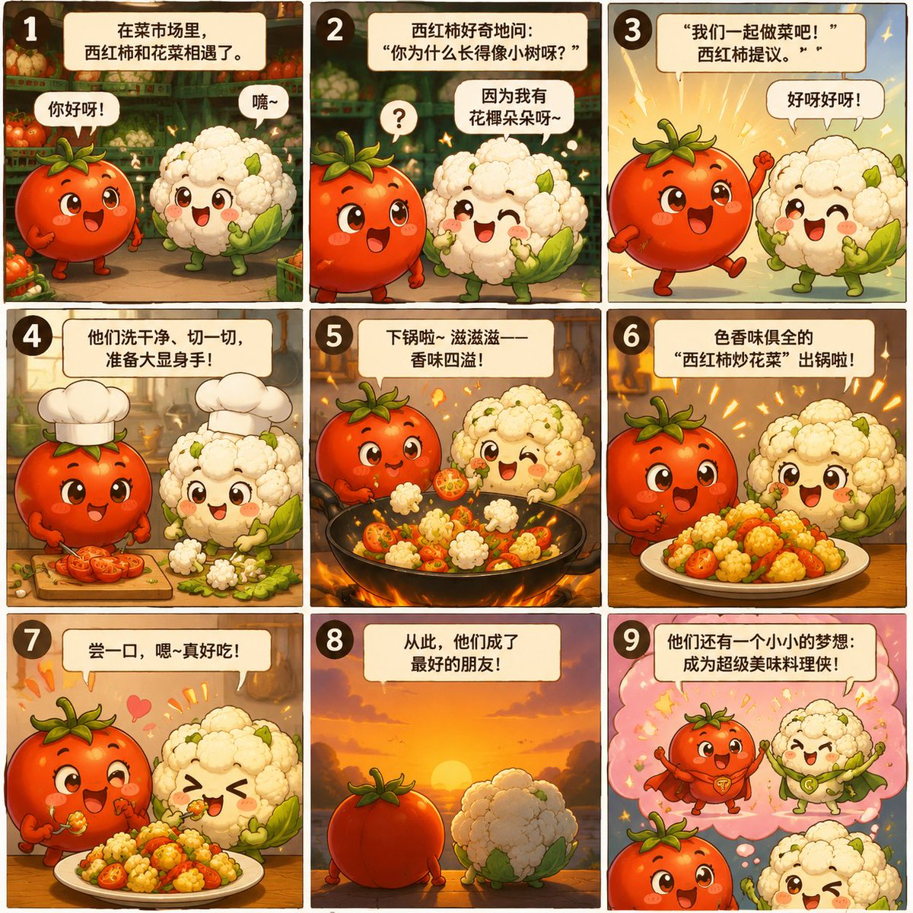</a>

```text
Using REFERENCE_0 as the cauliflower character base and REFERENCE_1 as the tomato character base, transform the real vegetables into a cute children's anime comic story page. Anthropomorphize one tomato and one cauliflower as round chibi characters with expressive faces, small arms and legs, while keeping their recognizable tomato and cauliflower identities.

Goal: Create a 3×3 nine-panel story comic about {argument name="story theme" default="a tomato and cauliflower meeting in a vegetable market, becoming friends, cooking together, and creating a delicious dish"}.

Layout: Use exactly 9 square panels in a clean grid, each with a dark rounded border, warm illustrated lighting, and a numbered circle in the top-left corner of every panel from 1 to 9. Add Chinese narration/dialogue boxes at the top of each panel and speech bubbles where needed.

Story panels and required text:
1. Market meeting scene. Text box: 「在菜市场里，西红柿和花菜相遇了。」 Speech bubbles: 「你好呀！」 and 「嗨~」
2. Tomato asks cauliflower why it looks like a small tree. Text box: 「西红柿好奇地问：“你为什么长得像小树呀？”」 Speech bubble from cauliflower: 「因为我有花椰朵呀~」 Add a small question mark near the tomato.
3. Tomato proposes they cook together. Text box: 「“我们一起做菜吧！”西红柿提议。」 Speech bubble: 「好呀好呀！」 Use a bright excited background.
4. Prep scene. Text box: 「他们洗干净、切一切，准备大显身手！」 Show both characters wearing chef hats, with chopped tomato and cauliflower pieces on a cutting board.
5. Stir-fry scene. Text box: 「下锅啦~滋滋滋——香味四溢！」 Show a wok full of tomato and cauliflower pieces, with steam and warm firelight.
6. Finished dish reveal. Text box: 「色香味俱全的“西红柿炒花菜”出锅啦！」 Show the characters proudly presenting a plate of the finished dish.
7. Tasting scene. Text box: 「尝一口，嗯~真好吃！」 Show both characters happily eating, with hearts and celebratory marks.
8. Friendship scene. Text box: 「从此，他们成了最好的朋友！」 Show the tomato and cauliflower from behind watching a sunset.
9. Dream ending. Text box: 「他们还有一个小小的梦想：成为超级美味料理侠！」 Show them imagining themselves as heroic food characters in a pink dream bubble with stars.

Style: Bright Japanese/Korean children's picture-book anime, adorable chibi expressions, rounded forms, soft painterly shading, warm market and kitchen atmosphere, vibrant reds, creams, greens, and golden highlights. Make it feel like a complete educational mini picture book for kids.

Customization: The main characters are {argument name="main ingredients" default="tomato and cauliflower"}; the featured dish is {argument name="dish name" default="西红柿炒花菜"}; the language of all visible text is {argument name="comic text language" default="Chinese"}; the tone is {argument name="tone" default="cute, funny, and child-friendly"}.

Constraints: Generate one complete page only, exactly 9 panels, exactly the numbered sequence 1–9, no extra panels, no watermark, no photorealism, and avoid adding unrelated characters.
```

## by [Anirole](<https://x.com/anirole_jp>) on May 10, 2026 👉 [Try Now](https://indream.ai/generate?mode=IMAGE&modelKey=gpt-image-v2&modelPromptId=019e60c4-37b0-75fc-8c4c-eed5b11df475)

<a href="./public/images/fba8e217-2712-494a-8c16-d85d4864bb5d.png" target="_blank" rel="noopener noreferrer">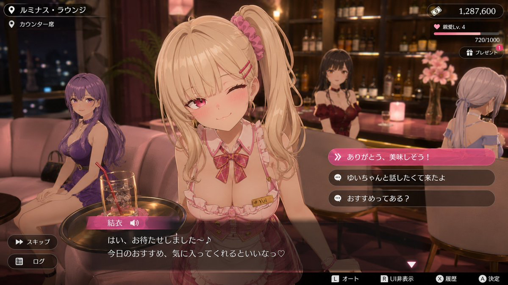</a>

```text
存在しない今風の都市型3Dアニメ調オープンワールドRPGの実プレイ画面を生成して。舞台は、{argument name="場所" default="高級ラウンジ風の社交場"}。温かい照明のバーやソファ席が見える店内。メインヒロインが{argument name="衣装" default="可愛い接客衣装と仕草"}で接客している会話イベントシーン。周囲に別のキャストたちも自然に配置し、華やかで落ち着いた大人の空気感を出す。

キャラクターは高精細イラストではなく、近年の{argument name="ゲームスタイル" default="美少女3Dゲーム"}のイベントシーンのようなセルルック3Dキャラクターモデルにし、丸みのある顔、シンプルな肌陰影、柔らかい髪束、少しプラスチック感のある綺麗な3Dモデル質感にする。

ゲーム画面として、下部に日本語の会話字幕ウィンドウ、キャラ名表示、選択肢UI、右上に所持金や好感度のようなステータスUI、画面端にスキップ・ログ表示などの操作UIを入れる。セリフと選択肢はリアリティのある、可愛くてキモい感じにしてください。宣伝絵ではなく実際のゲームプレイ中スクリーンショットのような画面にする。全体として、洗練された今風の3Dアニメ調ゲームらしい、癒やし・ときめき・少し大人っぽい華やかさを重視する。
```

## by [Re:Zat（旧おだぎり～)](<https://x.com/re_zat>) on May 10, 2026 👉 [Try Now](https://indream.ai/generate?mode=IMAGE&modelKey=gpt-image-v2&modelPromptId=019e60c5-3c7f-757b-920b-59a7cdc49038)

<a href="./public/images/a66e776c-6bbe-4e45-95e3-d04d9765e194.png" target="_blank" rel="noopener noreferrer">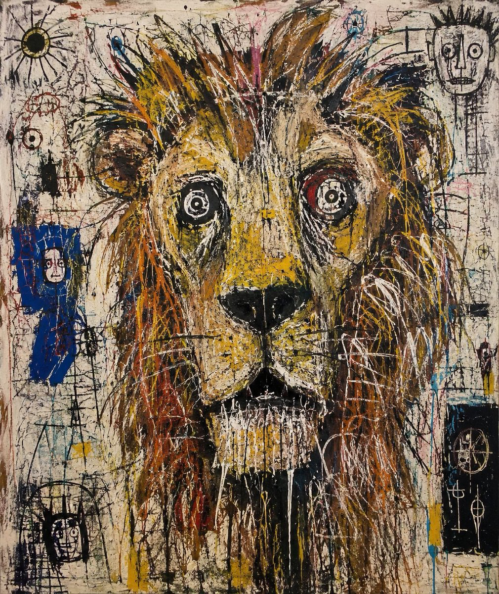</a>

```text
Create a raw neo-expressionist mixed-media painting on a dirty off-white canvas, dominated by a front-facing lion head with a gaunt, exhausted, slightly deranged expression. The lion has a huge scruffy mane in ochre, burnt orange, brown, black, and yellow, with spiky hair tufts radiating upward, asymmetrical wide circular eyes, a long yellow muzzle, a black nose, thin whiskers, and clenched vertical teeth like a grimace. Use dense scratched linework, splattered paint, dry-brush texture, scraped marks, drips, cracks, and chaotic graffiti-like scribbles across the whole surface, evoking Jean-Michel Basquiat-inspired outsider art. The background is a distressed cream wall filled with exactly 6 small doodle elements: a black-rayed sun in the upper left, a red circular face-like symbol on the left, a blue rectangular figure with a tiny face on the mid-left, a black boxed face near the lower left, a tall stick-figure face in the upper right, and a black rectangular panel with white occult-like symbols in the lower right. Keep the composition square, tightly cropped around the lion's face, with high contrast, messy hand-drawn energy, no clean digital polish, and a gritty gallery-painting texture. Customize the subject as {argument name="animal subject" default="lion"}, the emotional expression as {argument name="expression" default="gaunt and exhausted"}, the dominant palette as {argument name="color palette" default="ochre, burnt orange, brown, black, yellow, and dirty cream"}, the art style as {argument name="art style" default="neo-expressionist mixed-media graffiti painting"}, and the canvas format as {argument name="canvas format" default="square"}.
```

## by [NoorAI](<https://x.com/noorwithwifi>) on May 10, 2026 👉 [Try Now](https://indream.ai/generate?mode=IMAGE&modelKey=gpt-image-v2&modelPromptId=019e60c5-cb71-71c5-9131-8865c7bac338)

<a href="./public/images/87f5f35b-132c-4c24-b114-8b37b9e42c24.png" target="_blank" rel="noopener noreferrer">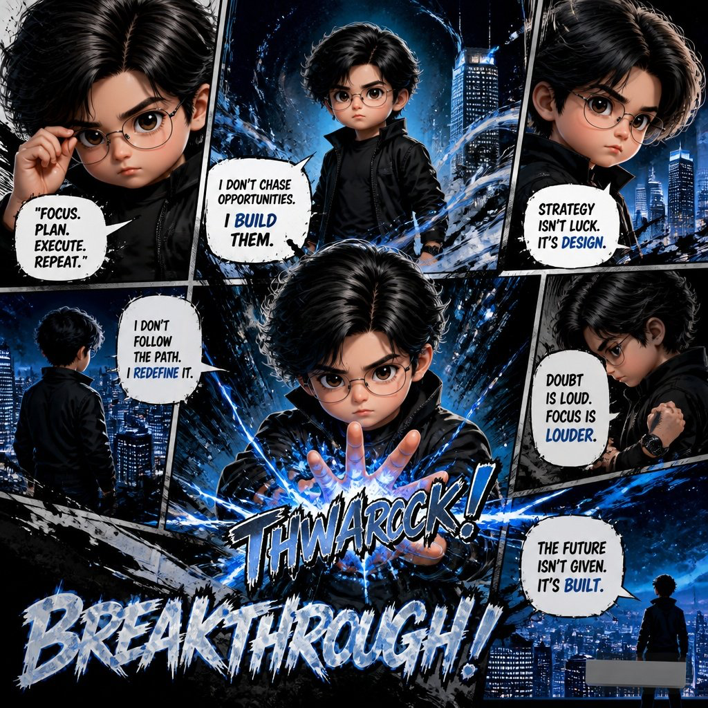</a>

```text
{"type":"cinematic motivational comic-book poster","format":"square 1:1 high-resolution image","style":"dark high-contrast manga and western superhero comic fusion, glossy digital painting, dynamic ink splatter, speed lines, electric blue energy effects, dramatic rim lighting, sharp panel borders, gritty urban night atmosphere","main_character":{"description":"a stylish young male protagonist with thick wavy black hair, wearing an all-black outfit with a black leather jacket, black shirt, dark pants, wristwatch, and confident serious body language","face":"intentionally obscured by a soft square blur to anonymize the character","hair":"{argument name=\"hair color\" default=\"glossy black\"}","outfit":"{argument name=\"outfit style\" default=\"black leather jacket and all-black streetwear\"}"},"setting":{"location":"futuristic city skyline at night with skyscrapers, blue lights, stormy sky, rain-like particles, glass reflections, and explosive energy streaks","palette":"black, deep navy, icy blue, white, and silver with small warm skin tones"},"layout":{"composition":"multi-panel comic collage with tilted rectangular panels surrounding a larger central action panel, thick black gutters, rough white speech bubbles, and oversized stylized title lettering across the lower-left","panel_count":7,"panels":[{"position":"top-left","description":"close-up side portrait of the protagonist adjusting his collar or touching his ear, hair covering the forehead, black jacket visible","speech_bubble":"\"FOCUS. PLAN. EXECUTE. REPEAT.\""},{"position":"top-center","description":"full-body hero shot of the protagonist standing in front of a glowing blue portal-like swirl and skyscrapers, jacket blowing slightly","speech_bubble":"I DON'T CHASE OPPORTUNITIES. I BUILD THEM."},{"position":"top-right","description":"close-up three-quarter portrait with dramatic hair and city lights behind him","speech_bubble":"STRATEGY ISN'T LUCK. IT'S DESIGN."},{"position":"middle-left","description":"rear view of the protagonist looking out over a blue-lit city skyline","speech_bubble":"I DON'T FOLLOW THE PATH. I REDEFINE IT."},{"position":"center","description":"largest action panel: protagonist faces forward with one hand reaching toward the viewer, blue lightning and shattered glass energy exploding from his palm","sound_effect":"{argument name=\"central sound effect\" default=\"THWAROCK!\"}"},{"position":"middle-right","description":"side-view close-up of the protagonist gripping his jacket near his chest, wearing a wristwatch, intense shadow lighting","speech_bubble":"DOUBT IS LOUD. FOCUS IS LOUDER."},{"position":"bottom-right","description":"small silhouette of the protagonist standing on a rooftop balcony overlooking the futuristic city at night","speech_bubble":"THE FUTURE ISN'T GIVEN. IT'S BUILT."}],"speech_bubble_count":6,"speech_bubbles":["\"FOCUS. PLAN. EXECUTE. REPEAT.\"","I DON'T CHASE OPPORTUNITIES. I BUILD THEM.","STRATEGY ISN'T LUCK. IT'S DESIGN.","I DON'T FOLLOW THE PATH. I REDEFINE IT.","DOUBT IS LOUD. FOCUS IS LOUDER.","THE FUTURE ISN'T GIVEN. IT'S BUILT."],"sound_effect_count":1,"sound_effects":["{argument name=\"central sound effect\" default=\"THWAROCK!\"}"],"main_title":{"text":"{argument name=\"main title text\" default=\"BREAKTHROUGH!\"}","position":"bottom-left spanning across the poster","style":"huge jagged icy white and blue comic lettering with brush texture, motion blur, splatter edges, and dark shadow"}},"typography":"bold hand-lettered comic fonts, all caps, irregular brush strokes, black text inside rough white speech bubbles, explosive blue-white display lettering","rendering_instructions":"make it look like a premium motivational graphic novel cover, extremely detailed hair highlights, cinematic depth, energetic action, strong contrast, no extra logos, no watermark"}
```

## by [Maverick | AI](<https://x.com/RizwanAly07>) on May 10, 2026 👉 [Try Now](https://indream.ai/generate?mode=IMAGE&modelKey=gpt-image-v2&modelPromptId=019e60c6-6146-744e-bc11-856c3c9444e5)

<a href="./public/images/8031238b-3544-4a50-b8ce-27d264fb1ce8.png" target="_blank" rel="noopener noreferrer">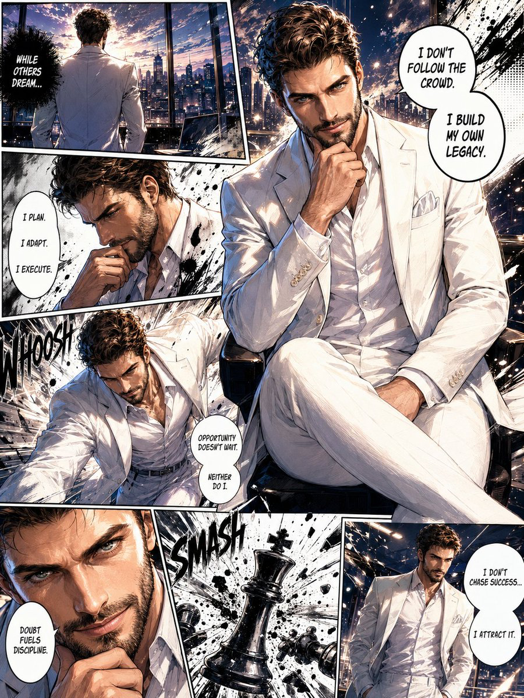</a>

```text
Create a full-color, full-page manga illustration based on the person in the reference photo. Use an authentic manga page composition with 5 to 7 dynamic interconnected panels on a single page. Include cinematic storytelling, dramatic perspective, expressive emotions, dynamic poses, speed lines, impact frames, close-up shots, and an intense visual flow.Add comic-style sound effects in {argument name="language" default="English"}, handwritten dialogue bubbles, ink splashes, halftone textures, comic sketch lines, and graphite-inspired brush strokes. Combine vibrant colors with manga-style shading and strong contrast. Emphasize the character’s personality and aura using symbolic visual elements and atmospheric energy effects. Highly detailed, emotional, stylish, energetic, and professional manga aesthetic, with clean white negative space blended with chaotic ink textures.Hand-drawn appearance, fluid linework, immersive composition, and high quality. 3:4 HD aspect ratio.
Change the dialogue
```

## by [Cherry 2.O](<https://x.com/Mind_Boticni>) on May 10, 2026 👉 [Try Now](https://indream.ai/generate?mode=IMAGE&modelKey=gpt-image-v2&modelPromptId=019e60c9-988c-737d-9515-577eee6c32dc)

<a href="./public/images/73748f3d-1dcf-430e-a5f6-4e5739abae21.png" target="_blank" rel="noopener noreferrer">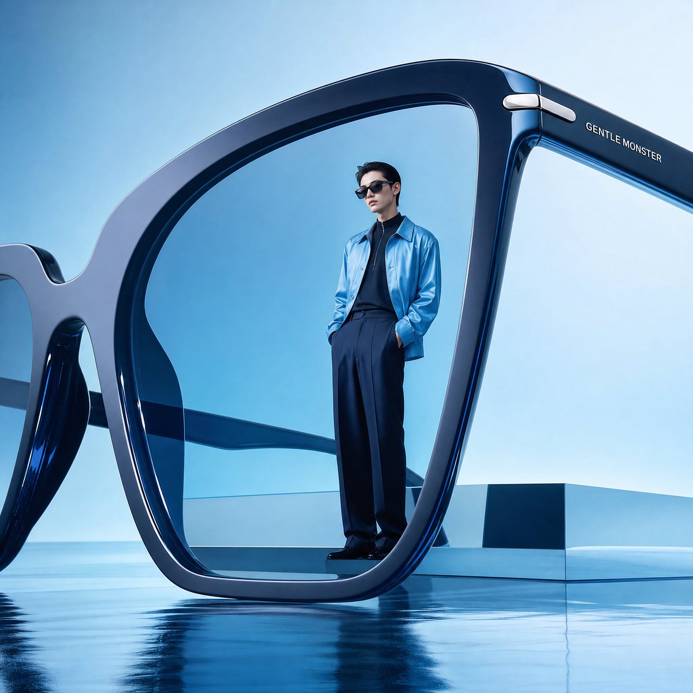</a>

```text
Editorial eyewear advertisement with surreal proportions, enormous futuristic {argument name="accessory" default="shades"} acting like modern furniture, fashionable model standing inside the frame structure creatively, zoom in , cool sky-blue gradient studio setup, reflective acrylic floor, luxury campaign aesthetic inspired by premium fashion magazines, sleek minimalist composition, cinematic lighting, ultra-detailed visual design, square 1:1
```

## by [WTR](<https://x.com/wtry1102>) on May 10, 2026 👉 [Try Now](https://indream.ai/generate?mode=IMAGE&modelKey=gpt-image-v2&modelPromptId=019e60ca-3f0e-7498-a72b-940ca727e092)

<a href="./public/images/e16073d0-ecb5-402e-9044-281007347ed8.png" target="_blank" rel="noopener noreferrer">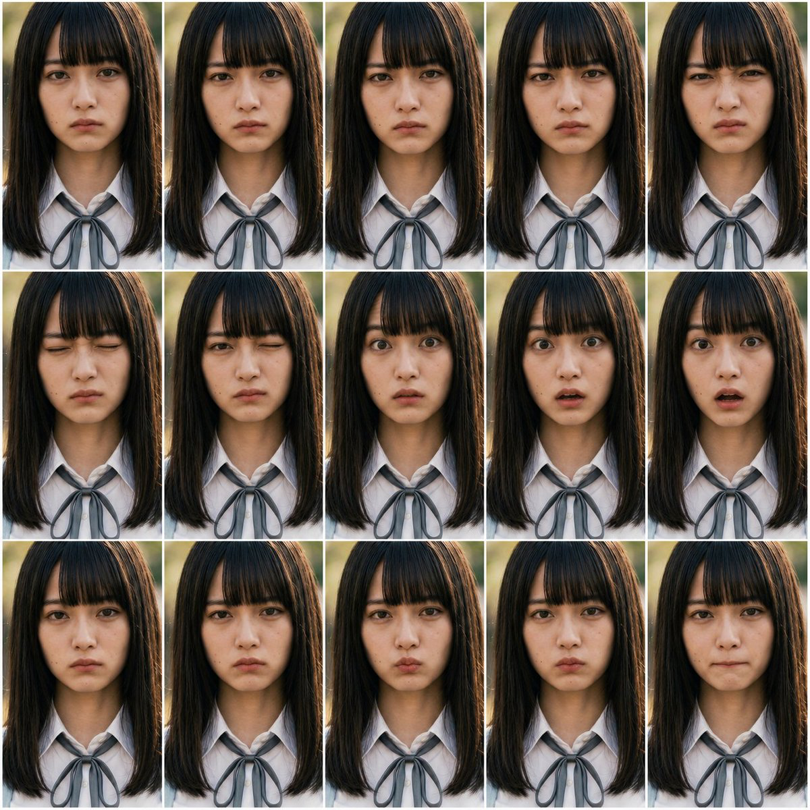</a>

```text
Using REFERENCE_0 and REFERENCE_1 as the FACS action-unit guide, create a photorealistic expression-control test sheet instead of an illustrated chart. Generate {argument name="grid layout" default="15 panels arranged in 3 rows and 5 columns"} showing the same {argument name="subject" default="realistic young female student"} repeated in every panel with identical framing, lighting, hairstyle, and {argument name="outfit" default="white school shirt with a gray ribbon tie"}. Apply a different subtle facial-expression change to each panel based on these {argument name="FACS action units" default="AU1, AU2, AU4, AU5, AU6, AU7, AU9, AU10, AU12, AU15, AU17, AU20, AU23, AU24, AU25"}, while preserving identity consistency and keeping the changes limited to the face. Use a close-up front-facing portrait crop from upper chest to top of head, natural outdoor backlight, shallow depth of field, and thin white dividers between panels. Do not include any chart titles, labels, AU text, explanations, or Japanese text.
```

## by [えーたん/AI×時短で仕事効率化](<https://x.com/ai_jitan>) on May 9, 2026 👉 [Try Now](https://indream.ai/generate?mode=IMAGE&modelKey=gpt-image-v2&modelPromptId=019e60cc-9fa5-75c8-ba20-9e5af03883b7)

<a href="./public/images/7d391cd5-b5ef-473b-a45a-088e99d3d80e.png" target="_blank" rel="noopener noreferrer">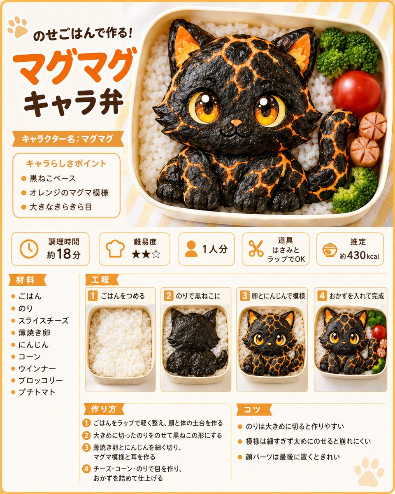</a>

```text
{"type":"cute Japanese recipe infographic poster for a character bento","style":"bright kawaii food magazine layout, clean vector-and-photo hybrid, rounded orange border, cream background with pale yellow stripes, playful rounded Japanese typography, warm studio lighting, appetizing realistic bento photography with illustrated sparkle accents","main_subject":{"dish":"magma-pattern black cat character bento made from rice and seaweed","character_name":"{argument name=\"character name\" default=\"マグマグ\"}","description":"a chibi black cat sitting inside a rectangular lunch box on a bed of white rice, made with glossy black seaweed, orange magma cracks, large golden sparkling eyes, small orange nose, pointed ears with orange cheese-like inner ears, tiny paws, curled tail, cute smile","bento_contents":{"count":4,"items":["white rice base","black cat seaweed character","green broccoli florets","red cherry tomato and sliced sausage flower"]}},"layout":{"format":"single-page vertical recipe card, 4:5 aspect ratio","top_section":{"position":"top half","count":3,"elements":["left title block with paw icon and headline","large right bento hero image","orange ribbon character-name label"]},"visible_text":{"headline":"{argument name=\"headline text\" default=\"のせごはんで作る！マグマグキャラ弁\"}","character_label":"キャラクター名：マグマグ","point_box_title":"キャラらしさポイント"},"character_points":{"count":3,"items":["黒ねこベース","オレンジのマグマ模様","大きなきらきら目"]},"info_cards":{"position":"middle row","count":5,"cards":[{"icon":"clock","label":"調理時間","value":"約18分"},{"icon":"chef hat","label":"難易度","value":"★★☆"},{"icon":"person","label":"1人分","value":"1人分"},{"icon":"scissors","label":"道具","value":"はさみとラップでOK"},{"icon":"bento bowl","label":"推定","value":"約430kcal"}]},"lower_section":{"columns":3,"left_column":{"title":"材料","count":9,"items":["ごはん","のり","スライスチーズ","薄焼き卵","にんじん","コーン","ウインナー","ブロッコリー","プチトマト"]},"center_top":{"title":"工程","count":4,"steps":[{"number":1,"label":"ごはんをつめる","image":"plain white rice packed in the lunch box"},{"number":2,"label":"のりで黒ねこに","image":"black seaweed silhouette of cat placed on rice"},{"number":3,"label":"卵とにんじんで模様","image":"cat face completed with eyes and orange magma markings"},{"number":4,"label":"おかずを入れて完成","image":"finished bento with broccoli, tomato, and sausage garnish"}]},"center_bottom":{"title":"作り方","count":4,"steps":["ごはんをラップで軽く整え、顔と体の土台を作る","大きめに切ったのりをのせて黒ねこの形にする","薄焼き卵とにんじんを細く切り、マグマ模様と耳を作る","チーズ・コーン・のりで目を作り、おかずを詰めて仕上げる"]},"right_bottom":{"title":"コツ","count":3,"tips":["のりは大きめに切ると作りやすい","模様は細すぎず太めにのせると崩れにくい","顔パーツは最後に置くときれい"]}},"design_details":{"colors":"orange, cream, brown, black, white, green, red","decorations":"small paw prints, orange section ribbons, thin rounded dividers, numbered orange squares, soft drop shadows","typography":"large orange headline for マグマグ, dark brown secondary text, clean legible Japanese body text","camera":"top-down three-quarter product view for the bento, consistent miniature photos for process steps","quality":"high-resolution, crisp print-ready recipe sheet, no clutter, all Japanese text sharp and readable"}}
```

## by [Ryan Archive](<https://x.com/Ryan_5238>) on May 9, 2026 👉 [Try Now](https://indream.ai/generate?mode=IMAGE&modelKey=gpt-image-v2&modelPromptId=019e60cd-defb-70f6-93db-078f8c254fc0)

<a href="./public/images/bc8fd828-579d-46b6-9750-a5cd6c6fa1f6.png" target="_blank" rel="noopener noreferrer">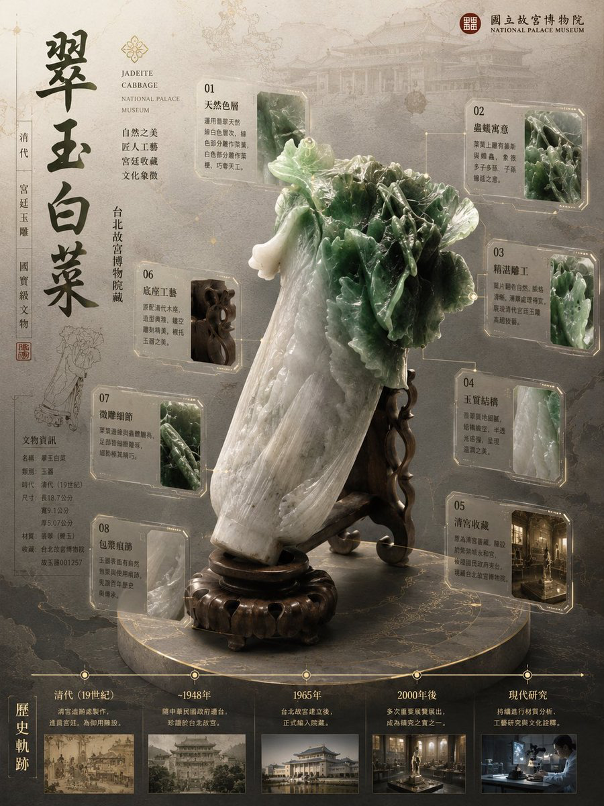</a>

```text
{"type":"national museum civilization archive poster","style":"premium Chinese museum exhibition poster fused with futuristic archival UI, cinematic photorealistic artifact photography, warm parchment background, translucent glassmorphism data panels, gold fine-line connectors, scholarly editorial layout, subtle ancient palace silhouette, ink-wash texture, sepia and jade green palette","main artifact":{"name":"{argument name=\"artifact name\" default=\"翠玉白菜\"}","position":"center, dominant full-height object on a circular museum display plinth","description":"a highly realistic jadeite cabbage sculpture with milky white translucent stalk and layered deep emerald green leaves, glossy carved veins, dew-like highlights, mounted on an ornate dark carved wooden stand, lit like a national treasure in a museum showcase","material":"{argument name=\"material\" default=\"jadeite\"}","lighting":"soft spotlight from upper left, reflective jade translucency, dramatic shadow under plinth"},"header and branding":{"top right museum mark":"國立故宮博物院 / NATIONAL PALACE MUSEUM with a red seal logo","left vertical title":"{argument name=\"main title text\" default=\"翠玉白菜\"}","left dynasty strip":"清代　宮廷玉雕　國寶級文物","English artifact label":"JADEITE CABBAGE / NATIONAL PALACE MUSEUM","subtitle":"自然之美 匠人工藝 宮廷收藏 文化象徵","collection line":"台北故宮博物院藏"},"layout":{"background":"aged beige parchment with faint map contours, palace architecture silhouette, delicate decorative motifs, museum archive atmosphere","central composition":"large vertical artifact slightly angled right, transparent golden circular data ring around the plinth, thin connector lines radiating to annotation cards","sections":[{"title":"artifact analysis cards","position":"surrounding the artifact in a radial grid","count":8,"labels":["01 天然色層","02 蟲蟻寓意","03 精湛雕工","04 玉質結構","05 清宮收藏","06 底座工藝","07 微雕細節","08 包漿痕跡"],"appearance":"each card is a semi-transparent frosted-glass rectangle with rounded clipped corners, small gold number, Chinese paragraph text, and a small inset macro photograph or museum photo connected by thin gold circuit-like lines"},{"title":"document information block","position":"lower left beside faint line drawing of the artifact","count":7,"labels":["名稱：翠玉白菜","類別：玉器","時代：清代（19世紀）","尺寸：長18.7公分／寬9.1公分／厚5.07公分","材質：翠玉（硬玉）","來源：台北故宮博物院","故宮藏001257"],"appearance":"small scholarly catalog text under the heading 文物資訊 with red square seal stamp"},{"title":"history timeline","position":"bottom horizontal band","count":5,"labels":["清代（19世紀）","~1948年","1965年","2000年後","現代研究"],"appearance":"gold timeline line with circular nodes, each node has a sepia or color thumbnail image below and short Chinese explanatory text, left vertical heading 歷史軌跡"}]},"callout card details":{"01 天然色層":"explains white-to-green natural jade color gradation with a leaf macro inset","02 蟲蟻寓意":"shows insects on cabbage leaves as auspicious symbols with a green macro inset","03 精湛雕工":"shows carved leaf ridges and delicate craftsmanship","04 玉質結構":"shows white jade texture and striations","05 清宮收藏":"shows a dim museum gallery display photo","06 底座工藝":"shows the dark wooden stand close-up","07 微雕細節":"shows slender leaf veins and tiny carved details","08 包漿痕跡":"shows aged surface patina and polishing marks"},"typography":"large expressive black Chinese calligraphy for the title, refined Song/Ming style Chinese body text, small uppercase serif English, careful museum-catalog hierarchy","color palette":"{argument name=\"color palette\" default=\"warm ivory parchment, antique gold, ink black, jade green, dark walnut brown, muted sepia\"}","rendering requirements":"ultra-detailed 4:5 vertical poster, photorealistic central artifact, clean high-end museum design, readable Chinese labels, elegant balance between ancient cultural relic and futuristic archive interface, no people, no clutter, national museum special exhibition poster quality"}
```

## by [PromptLab](<https://x.com/iamaiistudio>) on May 9, 2026 👉 [Try Now](https://indream.ai/generate?mode=IMAGE&modelKey=gpt-image-v2&modelPromptId=019e60ce-a7bc-751d-9e76-911830ad3f3c)

<a href="./public/images/d27d23fc-3db8-49c6-84e9-4ae562f6156f.png" target="_blank" rel="noopener noreferrer">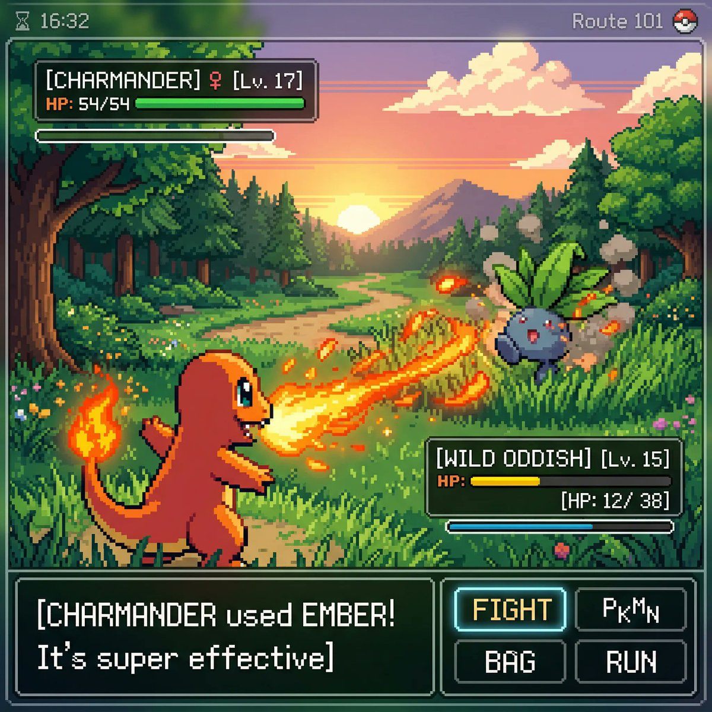</a>

```text
Recreate the look of a classic {argument name="game" default="Pokémon Game Boy"} screenshot, but rendered as gorgeous, highly detailed pixel art. Layer in cool {argument name="effect" default="dramatic visual effects from the move being used"}, finished with a clean modern minimal {argument name="interface" default="UI"} on top.
```

## by [知识猫图解](<https://x.com/GeekCatX>) on May 9, 2026 👉 [Try Now](https://indream.ai/generate?mode=IMAGE&modelKey=gpt-image-v2&modelPromptId=019e60ce-eb8c-77ba-944b-1c55174cce5d)

<a href="./public/images/d89e9a74-1b10-4b0d-aa21-3fccd7096978.png" target="_blank" rel="noopener noreferrer">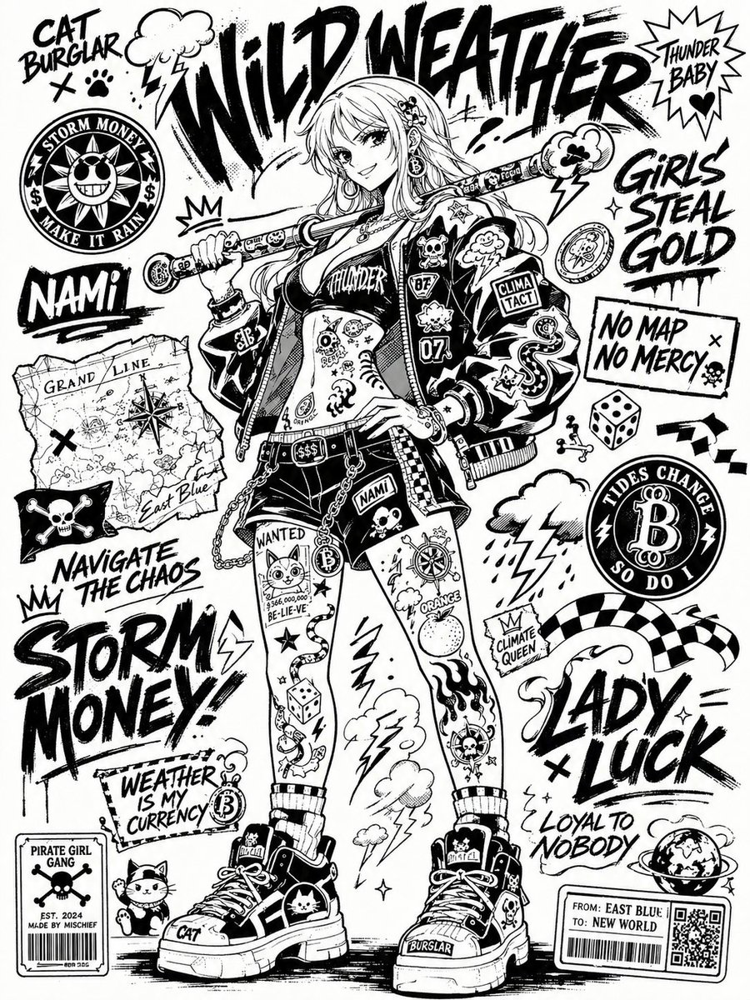</a>

```text
{argument name="主题" default="海贼王"}主题的黑白街头海报插图，主体是{argument name="人物" default="路飞"}。角色处于【动作场景】中，穿着【服装】，搭配【道具】。人物身体、四肢和服装表面覆盖大量高密度 sticker-bomb 贴纸式纹身图案，包括{argument name="纹身图案" default="草帽海贼团标志、橡胶果实、草帽"}。画面加入【文字排版】，形成潮流品牌海报和地下 zine 封面的视觉效果。整体采用【画面风格】，纯黑白配色，没有灰阶和真实阴影。线条使用【线条材质】，画面强调负形留白、平面图形感和强烈视觉冲击。构图为【构图】。避免【排除项】。比例3:4
```

## by [루피노드 🐰💕](<https://x.com/luffynod00>) on May 9, 2026 👉 [Try Now](https://indream.ai/generate?mode=IMAGE&modelKey=gpt-image-v2&modelPromptId=019e60d0-cc93-727e-870e-d9ccd7da1c0f)

<a href="./public/images/d2eed020-f064-4228-adaf-741513852b86.png" target="_blank" rel="noopener noreferrer">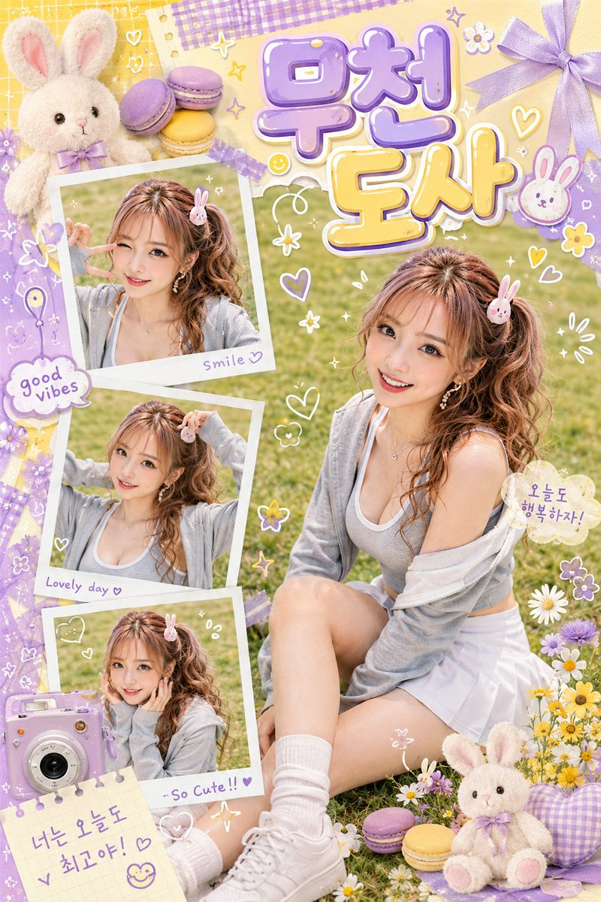</a>

```text
카와이한 스크랩북 스타일의 사진 포스터. {argument name="배경" default="푸른 잔디 위"}에서 포즈를 취한 첨부한 사진의 인물이 토끼 머리핀을 꽂고 {argument name="의상" default="스포티한 회색과 흰색 옷"}을 입고 있습니다. 파스텔 톤의 노란색과 핑크색을 테마로, '{argument name="이름" default="Yu Ka"}' 이름이 적힌 장난기 넘치는 커다란 버블 타이포그래피가 돋보입니다. 구도 주변에는 폴라로이드 사진 오려낸 3개 조각들이 장난기 넘치는 귀여운 포즈를 하고 겹겹이 배치되어 있으며, 봉제 토끼 인형, 마카롱, 리본, 꽃, 낙서 그래픽, 손으로 그린 하트, 별, 소용돌이 무늬, 카메라, 경쾌한 한국식 미학, 부드러운 자연광, 기발한 콜라주 레이아웃, 생동감 넘치면서도 부드러운 파스텔 톤, 매거진 스타일의 인물 화보, 매우 섬세한 디테일, 사랑스럽고 장난기 넘치는 분위기, 트렌디한 소셜 미디어 스크랩북 디자인. 선명한 촛점. 4k 고화질.
```

## by [のぞむ＊AIイラスト](<https://x.com/ArtistaNozomu>) on May 9, 2026 👉 [Try Now](https://indream.ai/generate?mode=IMAGE&modelKey=gpt-image-v2&modelPromptId=019e60d4-06fd-70e9-9040-7bc3f6b724a3)

<a href="./public/images/4c3bedc3-1cf9-49c3-9b63-e0432f69e842.png" target="_blank" rel="noopener noreferrer">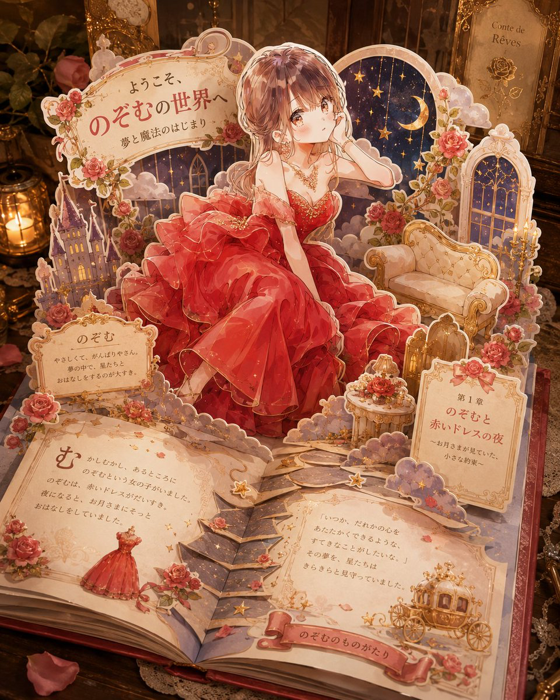</a>

```text
Goal: Create a luxurious 3D pop-up picture book scene where {argument name="character name" default="Nozomu"} appears to spring out from an open fairy-tale book, like a personalized storybook diorama.

Canvas: Square image, warm cinematic lighting, high-detail fantasy illustration mixed with realistic handcrafted paper art. The camera looks down at a three-quarter angle onto an open book lying on a dark antique wooden table. The overall palette is rose red, antique cream, gold, walnut brown, and midnight blue.

Main subject: In the center, a beautiful anime-style princess character rises from the pop-up book as a layered paper cutout. She wears a dramatic sparkling {argument name="dress color and style" default="deep ruby-red ruffled ball gown with gold glitter accents"}, a jeweled necklace, long soft brown hair, and elegant gloves. Her pose is graceful, seated among the paper layers with one hand near her face. Keep the face softly blurred or simplified as a privacy-safe placeholder, while preserving the elegant silhouette and hair details.

Pop-up book construction: The open book contains exactly 6 major pop-up structures: 1 large central princess cutout, 1 arched night-sky backdrop with a crescent moon and dangling stars, 1 ornate cream sofa on the right, 1 small castle cutout on the left, 1 decorative staircase/path rising from the book center, and 1 golden pumpkin carriage illustration on the lower right page. Surround these with layered paper clouds, scalloped edges, roses, gold filigree, and tiny star confetti.

Text content: Add Japanese storybook typography on cream parchment panels. Large headline on the upper left banner: 「ようこそ、のぞむの世界へ」. Smaller subtitle below it: 「夢と魔法のはじまり」. Include exactly 4 visible story text panels: 1 small left pop-up plaque titled 「のぞむ」, 1 right standing plaque titled 「第1章 のぞむと赤いドレスの夜」, 1 lower-left page block beginning with a large decorative 「む」, and 1 lower-right page block with a ribbon label 「のぞむのものがたり」. The Japanese text should look like printed children’s-book prose; it does not need to be fully readable except for the specified titles.

Background: Behind the book, show an antique storybook room with warm candle lanterns, vintage books, roses, lace, a gilded mirror or frame, and a standing book in the upper right reading {argument name="French book title" default="Conte de Rêves"}. Use shallow depth of field so the background glows softly.

Visual style: Hyper-detailed romantic anime fantasy, ornate Victorian fairy-tale design, paper-theater craftsmanship, embossed gold edges, watercolor-and-gouache textures, soft bloom, candlelit ambience, delicate rose decorations, magical dust sparkles, premium art-book quality.

Constraints: Keep the composition centered on the open book and pop-up princess. Use exactly 6 major pop-up structures and exactly 4 visible story text panels. Do not add modern objects, logos, watermarks, speech bubbles, or extra characters.
```

## by [Maverick | AI](<https://x.com/RizwanAly07>) on May 9, 2026 👉 [Try Now](https://indream.ai/generate?mode=IMAGE&modelKey=gpt-image-v2&modelPromptId=019e60d7-0c3c-72b8-9b95-a1f8e3bee5ec)

<a href="./public/images/a5b4be16-9fcb-4d70-8db0-42117cbfe7d2.png" target="_blank" rel="noopener noreferrer">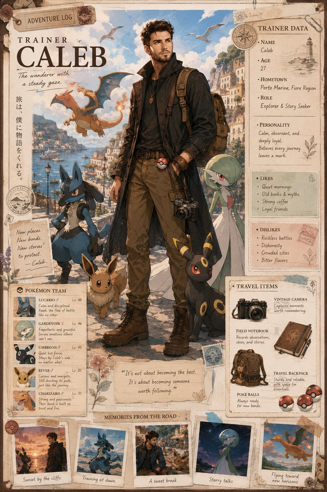</a>

```text
Generate a "{argument name="theme" default="Pokémon Trainer"} Themed Character Design Poster" including a full layout and illustration. The style should be Japanese anime + dreamy illustration, with high-quality details and soft colors. The protagonist is a trainer (design based on the personality/vibe of the provided photo), standing in a Pokémon world setting (such as a seaside town, forest, or mountain village). The atmosphere should be warm and evoke a sense of story. The image must include the following elements:Main Character Full-Body Art: Outfit should have personal style and intricate details. Pokémon Partners: Several representative Pokémon surrounding the trainer. Side Information Sidebar: Character data (Name, personality, likes/dislikes). Pokémon Team Introduction: Including names and brief descriptions. Travel Items/Accessories: Backpack, camera, notebook, etc. Bottom Section: Small "memory photos" or sticker-style designs from their journey.The overall layout should look like an "Adventure Log / Character Card Poster," with a scrapbooking and collectible feel. It should be detailed but not cluttered, maintaining a gentle and dreamy aesthetic.
```

## by [やげん✨🐎｜推しの為にAIを極めるおっさん社会人](<https://x.com/rascal8023>) on May 9, 2026 👉 [Try Now](https://indream.ai/generate?mode=IMAGE&modelKey=gpt-image-v2&modelPromptId=019e60d9-c5b1-72cb-b43b-b4af6c79cd66)

<a href="./public/images/39b54793-4683-4ec7-be75-b5ea0bbde1e9.png" target="_blank" rel="noopener noreferrer">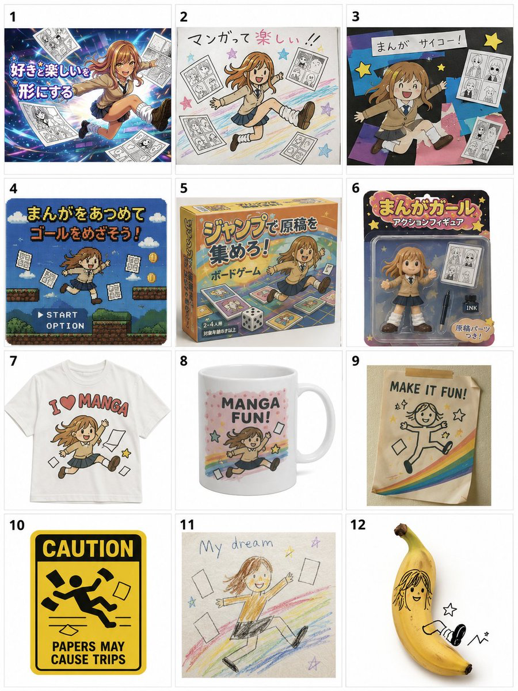</a>

```text
添付の画像をもとに、{argument name="グリッド" default="3×4"}のグリッドで{argument name="枚数" default="12種類"}のバージョンを配置してください。 この画像が、まるで12人の異なる人に順番に渡され、それぞれが前の人の作ったものだけを見ながら、「これはたぶんこういうものだろう」「こういう用途で使うものだろう」と勝手に勘違いし、別の形に作り直していったかのように表現してください。 最初のコマはオリジナルにかなり近い雰囲気から始めてください。そこからコマが進むにつれて、元画像の形、色、表情、ポーズ、構図、モチーフ、雰囲気が少しずつ誤解され、単純化され、別の用途に変換され、だんだん本来の意味や姿から離れていくようにしてください。 各コマは、前のコマだけを見た別の人が「たぶんこれはこういう依頼だったはず」と判断して作り直したようにしてください。人物やキャラクター、ペット、料理、風景、建物、プロフィール画像など、元画像の内容に応じて自然に変化させてください。 途中の変化は細かく固定しないでください。あるコマではイラスト化され、次のコマではマスコット化され、その次では商品化され、さらに看板、チラシ、ぬいぐるみ、食品パッケージ、観光グッズ、注意標識、ゲームキャラ、謎のおもちゃ、資料用アイコン、手作り工作物など、別の用途へ誤解されていっても構いません。変化の方向は、元画像と前のコマの見た目から自然に連想されるものにしてください。 コマが進むほど、「誰かがちゃんと作ろうとしたのは分かるけれど、何を作る依頼だったのか少しずつ間違えている」ようにしてください。形、比率、目、口、輪郭、色の配置、素材感、用途、装飾、構図が少しずつズレていき、後半ほど予想外でユーモラスな姿になっていくようにしてください。 重要なのは、単なる画質劣化やノイズではなく、人が前の成果物を見て、解釈を間違えながら、別の目的のものとして作り直した結果、どんどん崩壊していくように見せることです。 後半では、元画像の特徴を完全に消すのではなく、色、輪郭、表情、髪型、服、小物、ポーズ、構図、モチーフなどのうち、どれか1つか2つだけを不自然に残してください。その一方で、他の要素は大胆に省略、変形、誤解、別物化して構いません。 12コマ目は、元画像を知っている人だけがギリギリ元ネタを感じ取れる程度にし、初めて見る人には完全に別の謎の存在、謎の商品、謎キャラクター、謎の工作物、謎のアイコン、または謎のマスコットに見えるくらい大胆に崩してください。最後は「なんでこうなった！？」と思える、予想外で少し笑える着地にしてください。 各コマはそれぞれ異なる見た目にしてください。背景は白くシンプルにし、12種類の変化が見やすい3×4のグリッドとして整理してください。後半のコマでは、きれいに整えすぎないでください。むしろ、前の人の誤解を次の人がさらに別の方向へ誤解していくようにしてください。12コマ目は、元画像の特徴が1つだけ奇妙に残っているのに、それ以外はほぼ別物になっているくらい大胆に変化させてください。
```

## by [Kashberg](<https://x.com/Kashberg_0>) on May 9, 2026 👉 [Try Now](https://indream.ai/generate?mode=IMAGE&modelKey=gpt-image-v2&modelPromptId=019e60db-d320-777d-835e-610f67997178)

<a href="./public/images/f872c218-15e4-4d38-bec3-61f630d1d882.png" target="_blank" rel="noopener noreferrer">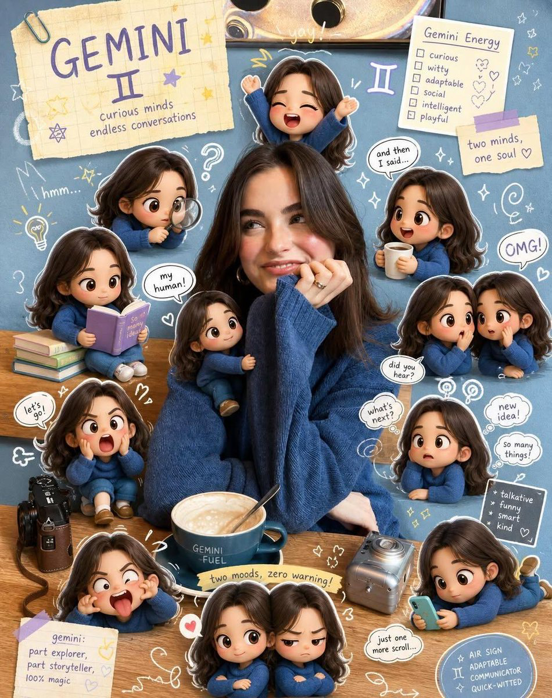</a>

```text
I am “{argument name="zodiac sign" default="TAURUS"}.” Create a poster inspired by Yumi’s Cells with the same soft, aesthetic, slice-of-life vibe and background style, while fully reflecting the Taurus zodiac theme in the design. The subject’s face must remain completely unchanged and untouched. Surround the subject with multiple small, raw yet realistic cute chibi-style mini 3D versions of the subject, designed like expressive “cells” with oversized heads, glossy high-detail finishes, and playful emotions. Each mini character should reflect Taurus traits such as calmness, loyalty, comfort-loving energy, stubbornness, sensuality, patience, and love for luxury and food. Show them in different actions: one clinging onto the subject’s arm, one relaxing with a cozy blanket, one reading a book peacefully, one drinking coffee or tea, one holding snacks or dessert, one lying down using a phone, one refusing to move with a stubborn expression, one looking sleepy and unbothered, and one with soft messy “just woke up” energy. Add playful hand-drawn doodles interacting directly with the subject and chibi characters—outlining poses, sketching comfy cushions, steam from drinks, tiny flowers, sparkle details, and calm motion accents to enhance storytelling. Use a clean aesthetic composition, white sticker outlines, soft pastel sage green, cream, beige, dusty pink, and warm earthy tones, high-detail glossy 3D chibi look, cute Korean-inspired design, with a raw natural poster feel in a 9:16 vertical aspect ratio, and the Taurus identity clearly integrated into the overall concept.
```

## by [PromptLab](<https://x.com/iamaiistudio>) on May 8, 2026 👉 [Try Now](https://indream.ai/generate?mode=IMAGE&modelKey=gpt-image-v2&modelPromptId=019e60e1-4ed9-70b8-9dc8-65d36d8f3f9a)

<a href="./public/images/7b7e54a1-4050-4516-b5e7-b8fb141a7870.png" target="_blank" rel="noopener noreferrer">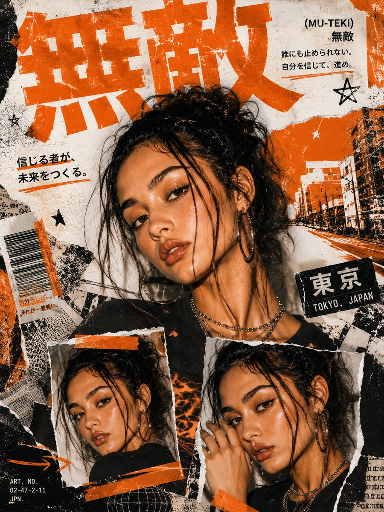</a>

```text
big editorial close-up up top, two ripped polaroid cutouts taped below, oversized japanese type, grunge tape, ink splashes, film grain, {argument name="aesthetic" default="full magazine moodboard energy"}
```

## by [serein](<https://x.com/you1873118>) on May 8, 2026 👉 [Try Now](https://indream.ai/generate?mode=IMAGE&modelKey=gpt-image-v2&modelPromptId=019e60e2-6ebd-77d0-9c1b-a4ddfd0b7e85)

<a href="./public/images/bda2c9d5-5850-4207-8261-a4f7b97e1424.png" target="_blank" rel="noopener noreferrer">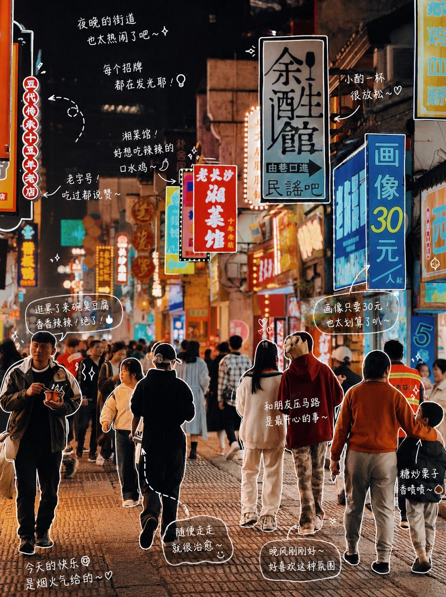</a>

```text
修改废片：请观察照片中的元素，并为每个物件加上有意义的 手绘风注解。请填写照片中的物品（例：{argument name="物品列表" default="披萨、汽水"}［描写规则】•使用像白色笔画的细线手绘线条•一笔画风格、随性、略带不均匀感•沿着物件外围加上描边轮廓•用箭头或虚线做出视线引导［文字规则］•手写风格字体（日系可爱感）•句子简短、像自言自语的小碎念
•语气偏日记感、带一点情绪［注解生成规则】•饮料一>味道、温度、心情（例：清爽、微甜、刚刚好）•食物一>口感、好吃程度（例：松软、超好吃）•空间—>氛围（例：很放松、喜欢这种感觉）•整体一>一句总结（例：{argument name="心情总结" default="今天有点幸福~"}［装饰）•适度加入热气、闪光、爱心、星星、小表情等元素。不要过度装饰，保留空白空间
```

## by [Uncle J](<https://x.com/UncleJAI>) on May 8, 2026 👉 [Try Now](https://indream.ai/generate?mode=IMAGE&modelKey=gpt-image-v2&modelPromptId=019e60e3-32af-7373-b515-31349feae30f)

<a href="./public/images/f4ec5bcb-93b6-449a-a0e3-73834a06181a.png" target="_blank" rel="noopener noreferrer">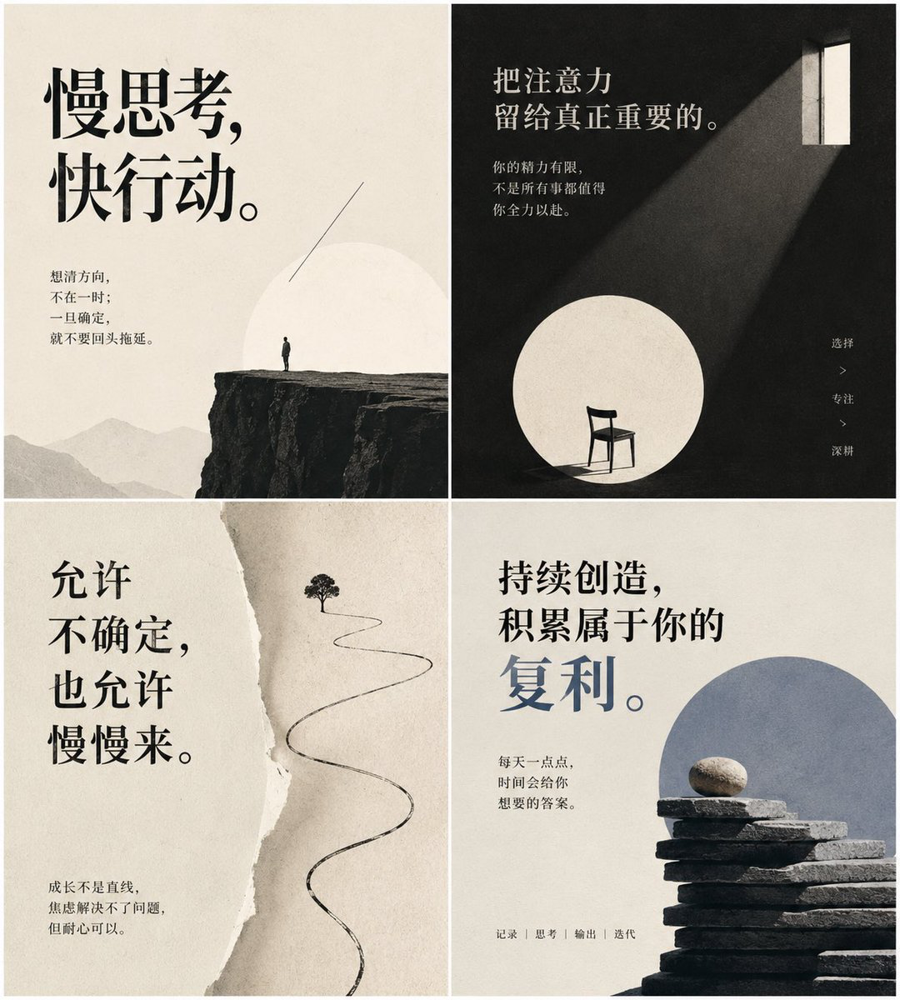</a>

```text
{"type":"four-panel minimalist Chinese conceptual advice card set","format":"single 2x2 grid image containing 4 square cards, separated by thin white gutters, overall aspect ratio 1:1, refined editorial poster design","style":"high-end restrained clear conceptual cards, strong Chinese typography, smart negative space, warm off-white paper texture, subtle grain, muted black ink, graphite gray, stone blue accent, printmaking and collage feeling, minimal symbolic objects, poetic but readable, not decorative, not advertising-like","language":"Chinese visible text","layout":{"grid":"2 columns by 2 rows","card count":4,"cards":[{"position":"top left","main text":"{argument name=\"first card headline\" default=\"慢思考，\n快行动。\"}","supporting text":"想清方向，\n不在一时；\n一旦确定，\n就不要回头拖延。","visual concept":"a tiny solitary human figure standing on the edge of a dark rocky cliff, pale distant mountains in the lower background, a large faint off-white sun or moon disk behind the cliff, one thin diagonal line in the sky like a precise decision mark","composition":"large bold vertical Chinese headline on the upper left, small body copy below it, cliff occupying lower right, expansive blank sky","palette":"cream paper, black ink, charcoal rock, pale gray mountains"},{"position":"top right","main text":"{argument name=\"second card headline\" default=\"把注意力\n留给真正重要的。\"}","supporting text":"你的精力有限，\n不是所有事都值得\n你全力以赴。","side labels":{"count":4,"labels":["选择",">","专注",">","深耕"]},"visual concept":"dark nearly black room with a small high window at the upper right casting a triangular beam of light down toward a circular spotlight on the floor, a single empty chair centered inside the circle","composition":"headline and body copy in the upper left, window and light beam upper right, spotlight and chair in lower center, vertical small navigation-like labels on the right edge","palette":"black charcoal background, warm cream typography, beige spotlight, soft dusty light"},{"position":"bottom left","main text":"{argument name=\"third card headline\" default=\"允许\n不确定，\n也允许\n慢慢来。\"}","supporting text":"成长不是直线，\n焦虑解决不了问题，\n但耐心可以。","visual concept":"torn vertical paper edge running down the center-left like a canyon wall, a thin wandering black path line curving from bottom center to upper right, ending at a tiny tree near the top","composition":"large stacked Chinese headline on the left, small body copy near lower left, winding line and tree on the pale right side, strong paper tear texture","palette":"warm ivory paper, black text, beige torn-paper shadows, minimal ink line"},{"position":"bottom right","main text":"{argument name=\"fourth card headline\" default=\"持续创造，\n积累属于你的\n复利。\"}","supporting text":"每天一点点，\n时间会给你\n想要的答案。","footer labels":{"count":4,"labels":["记录","思考","输出","迭代"]},"visual concept":"stack of dark flat stone slabs rising from the lower right like accumulated layers, one rounded pebble balanced on top, a large muted blue-gray circle behind the stones suggesting a moon or abstract field","composition":"bold headline upper left with the final word in muted blue, small body copy below, footer words near bottom left separated by vertical bars, stone stack cropped at bottom right","palette":"cream paper, black ink, muted blue-gray accent, dark stone gray"}]},"typography":"bold Songti or Ming-style Chinese serif headline, high contrast strokes, smaller elegant Chinese serif body text, generous leading, precise alignment","texture":"visible paper grain, slight ink spread, soft vignette, tactile printed poster surface","negative prompt":"no photorealistic people close-up, no colorful gradients, no busy decorations, no extra panels, no logos, no English text, no generic motivational stock imagery"}
```

## by [知识猫图解](<https://x.com/GeekCatX>) on May 8, 2026 👉 [Try Now](https://indream.ai/generate?mode=IMAGE&modelKey=gpt-image-v2&modelPromptId=019e60e3-d2f8-754f-a695-de1cf7d014e7)

<a href="./public/images/ef3a07a8-1b75-4c76-9928-2d2c17c53298.png" target="_blank" rel="noopener noreferrer">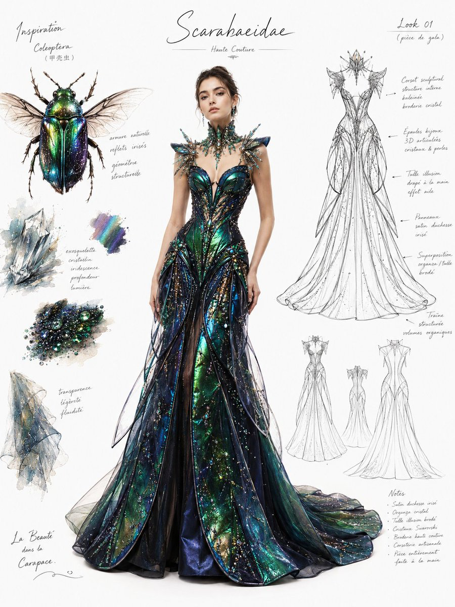</a>

```text
时尚设计稿 / 高定礼服设计页，主题灵感来自 {argument name="灵感主题" default="甲壳虫"}。画面为专业服装设计展示板构图：中央是一位全身站立的真人女模特，真实感、写实皮肤质感、自然五官、高级时装摄影氛围，穿着一件受 {argument name="灵感主题" default="甲壳虫"} 启发的高级定制礼服，礼服整体廓形为 {argument name="礼服廓形" default="修身长裙"}。服装设计需明显提取灵感对象的色彩、几何形态、晶体结构、透明层次与纹理特征，并转化为礼服的裙摆、胸衣、肩颈结构、刺绣、亮片、薄纱叠层、欧根纱和缎面反光细节。

版式要求：左上角放置 {argument name="灵感主题" default="甲壳虫"} 的精致手绘灵感草图或说明性插图；右侧放置礼服黑白技术线稿，清晰展示服装轮廓与结构，并配有手写感英文/法文风格设计备注，注明面料、分层、剪裁、晶体装饰、透明材质、立体细节。背景保持干净纯白，带少量设计师签名式潦草笔记、草图标记和时装工作室批注，整体呈现专业 fashion design sheet / couture concept board 的视觉效果。

风格要求：真人模特写实感 + 高级时装设计手稿融合表现，真实模特主体、服装材质细节极其精致，软水彩与数字插画混合质感，但人物必须接近时尚大片级真实感，不要卡通，不要动漫，不要夸张二次元。光线柔和均匀，无硬阴影，画面干净高级，面料表现清晰：缎面、薄纱、欧根纱、珠绣、透明层叠、冰晶折射感。超清4K，细节丰富，审美高级，适合品牌级服装提案展示。

灵感主题：甲壳虫
比例：3:4
```

## by [安喰 美蓮(あじき みれん)🐺🧷](<https://x.com/Miren_Ajiki>) on May 8, 2026 👉 [Try Now](https://indream.ai/generate?mode=IMAGE&modelKey=gpt-image-v2&modelPromptId=019e60e5-4469-774b-993f-2027a0ede218)

<a href="./public/images/2ddd323a-4962-4ff1-aa5e-625bb9c3809d.png" target="_blank" rel="noopener noreferrer">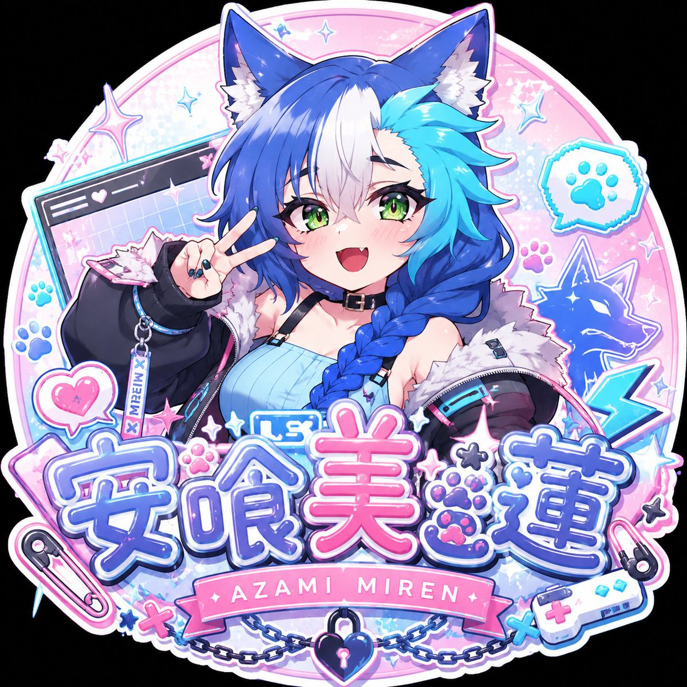</a>

```text
{"type":"kawaii anime VTuber emblem logo sticker","style":"highly polished Japanese gacha-game key visual, glossy acrylic charm, thick white sticker outline, pastel neon palette, crisp vector-like typography mixed with detailed anime rendering, sparkles, paw prints, hearts, stars, cyber pet motifs","canvas":"square 1:1 composition on a black background, centered circular badge with layered pink, blue, white, and lavender outlines","main subject":{"count":1,"description":"cute anime cat-wolf girl mascot emerging from behind the logo text, upper body portrait, cheerful open-mouth smile with small fangs, flushed cheeks, large bright green eyes, dramatic eyelashes","hair":"{argument name=\"hair color\" default=\"deep royal blue hair with a white front bang and bright cyan side section\"}, long thick side braid over the right shoulder, fluffy layered bangs","ears":"two large upright animal ears, blue outer fur with white inner tufts and dark tips","pose":"right hand raised in a peace sign near her face, relaxed shoulders, facing viewer","outfit":"light blue ribbed top, black choker with small buckle, oversized black jacket slipping off shoulders with white fluffy fur trim, small straps and cyan accents, bracelet and dangling charm tag"},"central typography":{"count":2,"items":[{"text":"{argument name=\"main Japanese logo text\" default=\"安喰美蓮\"}","position":"large foreground across bottom center","appearance":"chunky rounded Japanese characters, glossy 3D bubble lettering, blue and white letters with one large pink center character, heavy white and purple outline, paw-print fill accents and candy-like highlights"},{"text":"{argument name=\"romanized name text\" default=\"AZAMI MIREN\"}","position":"pink ribbon banner below the Japanese logo","appearance":"white spaced uppercase letters on a curved pink ribbon with small star separators"}]},"background badge":{"count":1,"description":"large circular pastel badge behind the character, mostly pale pink with blue gradients, halftone texture, grid panels, glitter, stars, and sticker-like layered borders"},"surrounding decorative elements":{"count":14,"items":["browser-window card at upper left with a heart icon and grid lines","cyan paw-print speech bubble at upper right","blue wolf-head silhouette sticker at right","large cyan outlined star at lower right","pink heart speech bubble at lower left","two oversized pink safety pins at lower left and lower right edges","black chain draped along bottom","heart-shaped padlock charm centered at bottom","white game controller at lower right with pink plus button and cyan buttons","small dangling name tag charm on the left sleeve reading MIREN","multiple pink and blue paw-print stickers around the logo","small star and sparkle stickers around the circular badge","pink cross and blue X decorative symbols near the bottom","music-note icons near the side edges"]},"color palette":"{argument name=\"color palette\" default=\"pastel pink, electric blue, cyan, lavender, white, and glossy navy accents\"}","rendering instructions":"make the image feel like a premium VTuber name logo, acrylic keychain sticker, or stream badge; emphasize clean line art, luminous highlights, dimensional typography, cute energetic expression, dense but balanced decoration, no chain necklace on the character, no photorealism"}
```

## by [Morris](<https://x.com/Morris_LT>) on May 8, 2026 👉 [Try Now](https://indream.ai/generate?mode=IMAGE&modelKey=gpt-image-v2&modelPromptId=019e60e5-8781-76d8-af88-0c50ef4aaa8a)

<a href="./public/images/fcb01943-8de5-46e9-9bb3-1302ab285e07.png" target="_blank" rel="noopener noreferrer">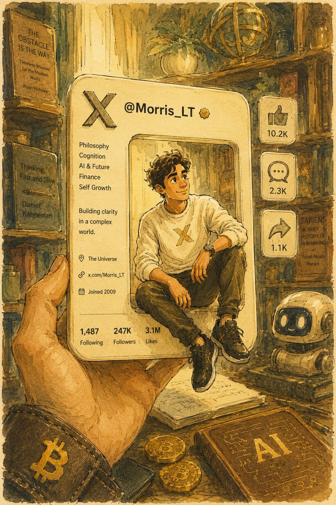</a>

```text
手绘水彩+墨线插画风，一个温暖怀旧的书房场景中，一只手握着一张 3D 的 X（类似 Twitter）个人资料卡片，卡片为圆角矩形，中间有方形镂空。一位帅气男生穿着白色上衣，随意坐在镂空边缘，神态放松微笑，略带思考感，人物为 Pixar + 半写实风格。卡片界面简洁，显示用户名 {argument name="用户名" default="@Morris_LT"}，信息包括：哲学、认知、AI、金融、自我成长；简介“{argument name="简介" default="在复杂世界中构建清晰认知"}”；位置“宇宙”；链接；加入时间：2009。底部数据：1,487 Following / {argument name="粉丝数" default="247K"} Followers / 3.1M Likes。周围有手绘风格的点赞、评论、分享图标，柔和发光。背景为温馨书房：木质书架、哲学书籍、比特币、小型 AI 机器人、植物等。整体暖色调（水彩米色、棕色、金色），柔和阳光、轻微阴影、纸张纹理，安静有思考氛围。构图居中，高级感，细节丰富，4K。
```

## by [新井アイラ｜やさしく教えるAI女子 ✨](<https://x.com/AI_AIRAARAI>) on May 8, 2026 👉 [Try Now](https://indream.ai/generate?mode=IMAGE&modelKey=gpt-image-v2&modelPromptId=019e60e7-7053-70db-8445-1602206cf7bf)

<a href="./public/images/c332029d-0a49-45cf-9a3d-8f3dbfea2b4b.png" target="_blank" rel="noopener noreferrer">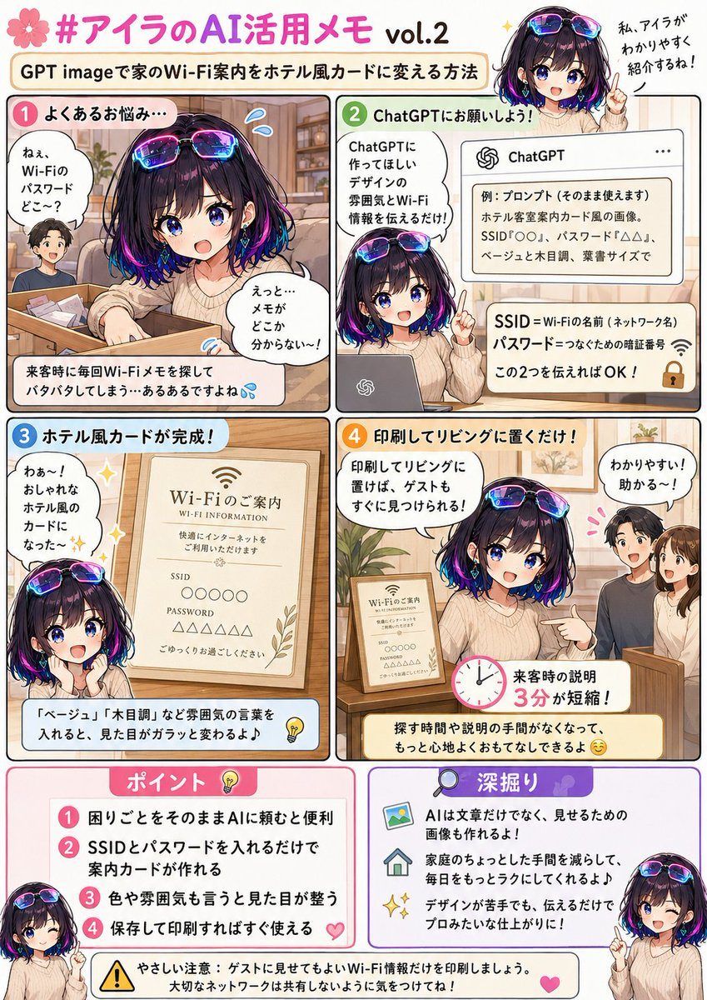</a>

```text
ホテル客室案内カード風の画像。SSID『{argument name="SSID" default="○○"}』、パスワード『{argument name="パスワード" default="△△"}』、{argument name="スタイル" default="ベージュと木目調"}、葉書サイズで
```

## by [小英镑知识分享](<https://x.com/Sun11250018>) on May 8, 2026 👉 [Try Now](https://indream.ai/generate?mode=IMAGE&modelKey=gpt-image-v2&modelPromptId=019e60e8-56c1-73b8-a534-9843c10ade8c)

<a href="./public/images/1c0c4600-5629-4e02-a554-1dad23a2ff7c.png" target="_blank" rel="noopener noreferrer">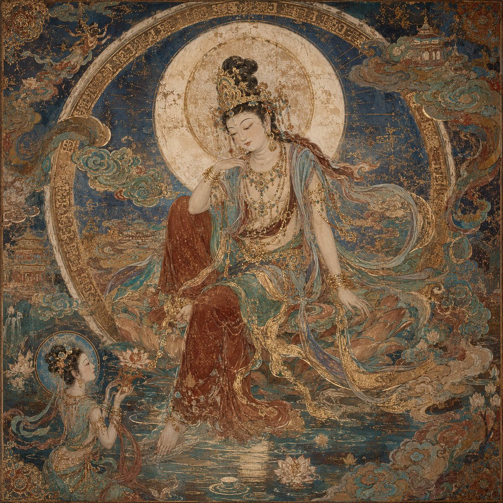</a>

```text
请以 【{argument name="核心角色" default="水月观音"}】 为核心，创作一幅 敦煌壁画风的高端艺术画作。画面采用 圆光月轮中心构图，以主体角色为唯一主视觉核心，表现其 游戏坐姿、俯瞰澄水 的神圣瞬间。整体氛围应为 空灵、幽静、圆满，具有博物馆级审美、文化厚度与收藏级艺术感。
主体形象要求：
主体角色应呈现出优雅庄严、修长华贵、神性强烈的气质，姿态舒展，具有鲜明的敦煌壁画式神圣性与仪式感。面容需静穆、圣洁、含蓄、不可侵犯，带有敦煌壁画中神女 / 菩萨 / 飞天式的庄严气质，而不是普通古风美女。
发髻高挽，佩戴复杂精美的 金饰发冠、珠链步摇、耳饰、璎珞、臂钏、腰饰，服饰华丽，衣纹流畅，线条细劲有力，富有飞天韵律与宫廷级壁画质感。衣袂、飘带、裙摆与袖口应形成富有节奏感的流动曲线，强化神圣升腾感与画面韵律。
用金结构要求：
画面需强化 结构性用金，不是零散点金，而是形成明确的奢华秩序：
主体角色的发冠、首饰、衣缘、袖口、腰封、飘带边线、裙摆纹样采用 描金、泥金、鎏金、金线刺绣、残损金箔痕迹；
核心神圣元素，如月轮 / 佛光 / 法轮 / 宝盖 / 莲台、云纹、莲花花瓣、宝相花、藻井纹饰、团花纹、边框装饰也应带有 清晰可见但克制高级的金色装饰；
整体呈现 金碧辉煌但不俗艳、富丽精工但不廉价 的效果，表现出历经千年风化后仍保有金碧辉煌余韵的 残损奢华感。
色彩要求：
色彩以 赭红、朱砂、青绿、石青、石绿、土黄、象牙白 为主，辅以克制精致的 土金、鎏金。
整体色调要 浓郁、浑厚、古雅、贵气，避免轻飘糖水色。
背景可采用
暗金矿物底色 氛围，如深邃石青天幕 / 温润古壁底色 / 暗金矿物底色与古壁肌理结合，衬托出主体的神圣与尊贵。
装饰元素要求：
画面可融入 飞天、莲花、宝相花、藻井、祥云、伎乐、团花纹、楼阁宫阙、法器、圣光圆轮、古典边框装饰 等典型敦煌视觉语言，但必须围绕主体集中分布，层级清晰，避免平均铺满全画面。
陪衬人物控制在
1位 即可（善财童子），作为礼赞与陪衬，分布在主体周围或下方，形成朝向主体的仪式感动势。她们可陪衬动作，如持莲花 / 奏琵琶 / 吹笛 / 奉花 / 托灯 / 执幡，线条轻盈流动，与主体形成呼应，但不可喧宾夺主。
空间与构图要求：
构图中应保留适度的 云气空间、圣光留白、月光或天幕留白，让画面有呼吸感。
核心神圣元素需醒目、庄严、圆满，周围可有 鎏金光晕、圣光圆轮、细密金线轨迹，强化主题的神圣性。
远处可点缀远景元素，如月宫楼阁 / 云中宫阙 / 佛国建筑 / 仙界天幕，但不可过多，以增强空间层次与仙界气息。
材质表现要求：
需强调古老石窟壁画与矿物颜料肌理：
可见 斑驳、裂纹、风化、轻微剥落、历史包浆、粉化边缘、古壁肌理；
同时保留局部 描金、残损金箔、磨蚀后的鎏金光泽，形成 “旧而贵、残而华、古而神圣” 的高级艺术质感。
```

## by [AI驚き屋さん](<https://x.com/aiodoroki>) on May 7, 2026 👉 [Try Now](https://indream.ai/generate?mode=IMAGE&modelKey=gpt-image-v2&modelPromptId=019e60ed-aec2-761d-98c1-8f75606c1d9a)

<a href="./public/images/8724f0c6-b34e-4307-9e27-8a1aefe0422f.png" target="_blank" rel="noopener noreferrer">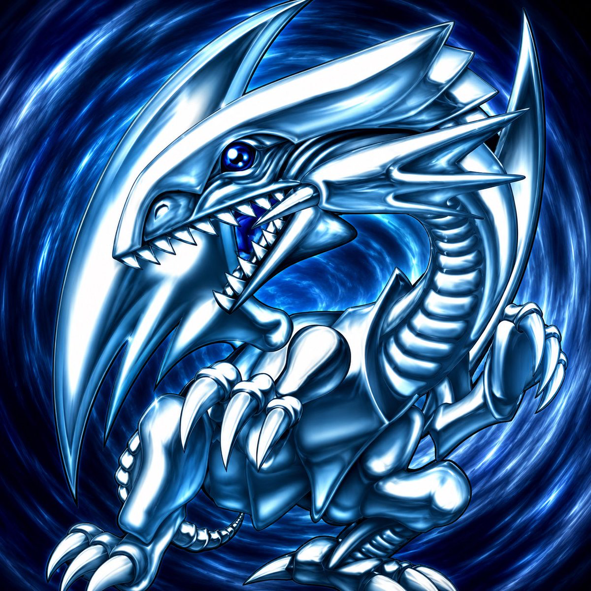</a>

```text
Create a dramatic square-format anime trading-card style illustration of {argument name="creature name" default="Blue-Eyes White Dragon"}, a metallic white and icy blue dragon lunging forward from a swirling dark blue vortex. The dragon has 1 large angular head, 2 glowing sapphire-blue eyes, an open snarling mouth with sharp triangular teeth, 2 long blade-like horns sweeping upward and backward, 2 extra side spikes projecting from the cheek and jaw area, 1 segmented serpentine neck, 2 raised forearms with large curved claws, 2 bent rear legs with talons, and multiple layered armor-like plates along the body and neck. Emphasize a glossy chrome-and-pearl surface with bright white highlights, deep cyan shadows, black ink outlines, and intense specular reflections. The creature should fill almost the entire frame in a dynamic diagonal pose, with its head near the upper center-left, claws reaching toward the viewer, and the tail/body curling into the background. The background is a high-energy circular portal made of luminous blue brush strokes, electric streaks, and radial motion blur, creating a sense of speed and power. Use {argument name="color palette" default="icy white, chrome silver, electric blue, deep navy"}, high contrast, sharp anime linework, fantasy monster design, ultra-detailed scales and armor plates, glowing highlights, polished digital painting, no text, no border.
```

## by [Gadgetify](<https://x.com/Gdgtify>) on May 7, 2026 👉 [Try Now](https://indream.ai/generate?mode=IMAGE&modelKey=gpt-image-v2&modelPromptId=019e60ed-be63-73ea-8bb8-b801a5e0b868)

<a href="./public/images/2bc45b53-3ade-41f7-a660-b0d50b88473f.png" target="_blank" rel="noopener noreferrer">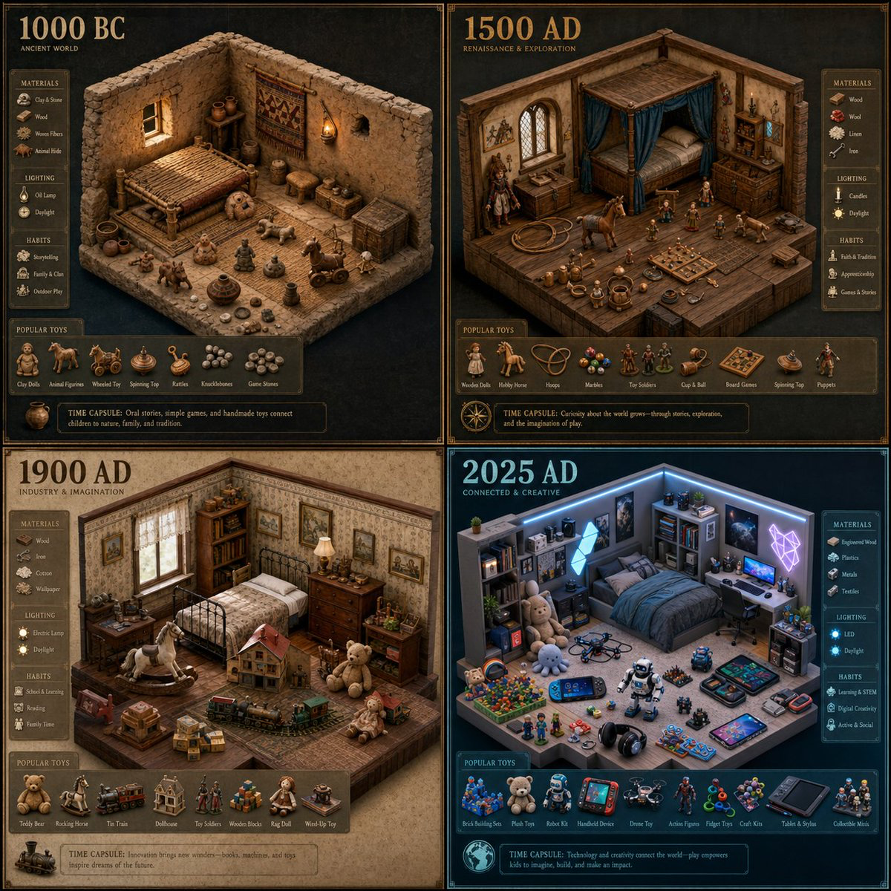</a>

```text
2x2 grid, do this for {argument name="eras" default="1000 BC, 1500 AD, 1900 AD 2025 AD"} Render_Target =  ( Isometric_Raised_Interior_Map_Of_s_Bedroom_In_[Era] * 1.2 )  + ( Pop_Culture_Time_Capsule_Infographic_UI * 1.5 ) + ( Popular_Toys_of_era * 2.5 )  + ( Era_appropriate_lighting_With_[DECADE]_Filters * 1.0 )  - ( Generic_Retro_Console_And_Rubik's_Cube / 3.0 )  - ( Historically_Inaccurate_Posters / 2.5 )  - ( Flat_2D_Furniture_Showroom_View / 2.0 )
```

## by [吉田カゲチカ🧪｜創作即売会metacomi クラファン5/7まで！](<https://x.com/kagetica>) on May 7, 2026 👉 [Try Now](https://indream.ai/generate?mode=IMAGE&modelKey=gpt-image-v2&modelPromptId=019e60ee-7671-7122-853b-df36e91d1ae9)

<a href="./public/images/a38fba4f-fbfb-4489-8fee-c3cf5aef4617.png" target="_blank" rel="noopener noreferrer">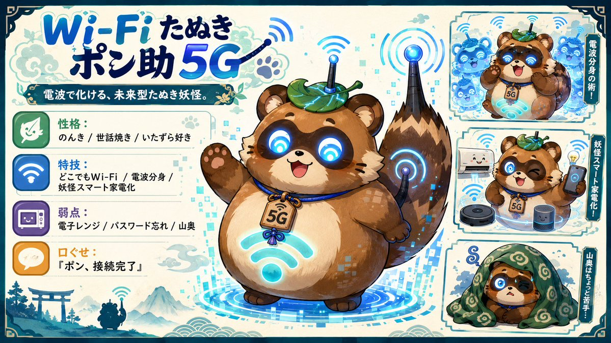</a>

```text
{"type":"cute Japanese mascot character sheet / contest entry card","style":"bright anime illustration, polished game character concept art, chibi mascot design, cream parchment background with teal ornamental border, cyan glowing digital effects, watercolor clouds and traditional Japanese motifs mixed with futuristic UI icons","main_title":"{argument name=\"headline text\" default=\"Wi-Fi たぬき ポン助 5G\"}","subtitle":"電波で化ける、未来型たぬき妖怪。","character":{"name":"{argument name=\"character name\" default=\"ポン助\"}","species":"futuristic tanuki yokai mascot","body":"round plump brown tanuki with cream belly, striped fluffy tail, small ears, paw pads, cheerful open-mouth smile","eyes":"large black circular cyber eyes glowing with cyan Wi-Fi symbols","accessories":"green leaf hat with glowing circuit lines and a small antenna, blue collar cord, wooden tag marked 5G, cyan Wi-Fi symbol glowing on belly, antenna device mounted on tail","pose":"full-body centerpiece waving one paw, standing on a circular holographic blue digital platform with pixel squares and signal rings"},"layout":{"format":"wide horizontal character reference sheet, 16:9, information-dense but playful","centerpiece":"one large full-body portrait of the tanuki mascot occupying the center, surrounded by blue radio-wave arcs and digital particles","left_profile_panel":{"position":"left side","count":4,"items":[{"icon":"green leaf face icon","label":"性格：","text":"のんき / 世話焼き / いたずら好き"},{"icon":"blue Wi-Fi icon","label":"特技：","text":"どこでもWi-Fi / 電波分身 / 妖怪スマート家電化"},{"icon":"purple microwave or appliance icon","label":"弱点：","text":"電子レンジ / パスワード忘れ / 山奥"},{"icon":"orange speech bubble icon","label":"口ぐせ：","text":"{argument name=\"catchphrase\" default=\"『ポン、接続完了』\"}"}]},"right_showcase_panels":{"position":"right side stacked panels","count":3,"panels":[{"description":"top panel: tanuki creates multiple translucent blue radio-wave clones around itself, with vertical side label","visible_label":"電波分身の術！"},{"description":"middle panel: tanuki winks while holding a smartphone, surrounded by smart home appliances including a smiling refrigerator, robot vacuum, smart speaker, and lightbulb idea icon, with vertical side label","visible_label":"妖怪スマート家電化！"},{"description":"bottom panel: tanuki looks worried while hiding under a green patterned blanket, with a small curl of frustration above the head, with vertical side label","visible_label":"山奥はちょっと苦手…"}]},"bottom_left_scenery":"small blue silhouette landscape with torii gate, pine trees, mountains, clouds, and a tiny tanuki figure holding up a Wi-Fi signal"},"color_palette":"warm tanuki browns and cream, deep navy outlines, vivid cyan and electric blue glow, teal-green leaf accents, parchment beige background","rendering_details":"clean thick outlines, soft cel shading, glossy luminous effects, decorative corner ornaments, Japanese festival-poster energy, readable handwritten-style Japanese typography, no photorealism"}
```

## by [吉田カゲチカ🧪｜創作即売会metacomi クラファン5/7まで！](<https://x.com/kagetica>) on May 7, 2026 👉 [Try Now](https://indream.ai/generate?mode=IMAGE&modelKey=gpt-image-v2&modelPromptId=019e60ee-5309-721d-bca2-306450354acf)

<a href="./public/images/85616468-a65e-49d3-a85f-d821d37d3762.png" target="_blank" rel="noopener noreferrer">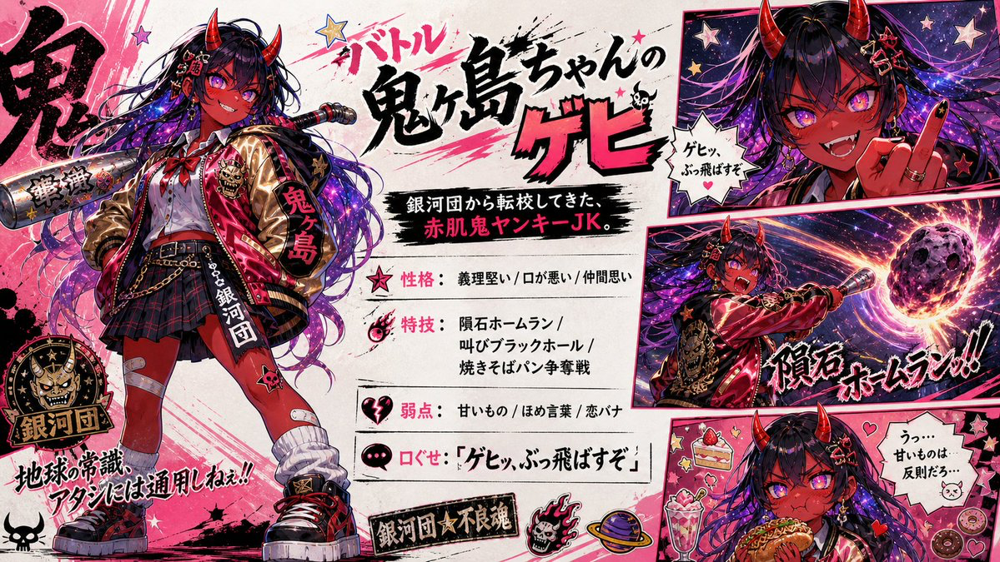</a>

```text
{"type":"high-energy anime character design sheet for a fictional delinquent heroine","format":"wide 16:9 poster, magazine character sheet, Japanese street-punk manga aesthetic","overall_style":"explosive black, hot pink, red, cream, and gold color palette; rough ink splatters, speed lines, sticker-like icons, halftone texture, jagged manga typography, glossy cel shading, dramatic neon highlights, chaotic but readable layout","character":{"name":"{argument name=\"character name\" default=\"バトル鬼ヶ島ちゃんのゲヒー\"}","concept":"dark-skinned oni delinquent high school girl who transferred from the Galactic Gang, rebellious but loyal, loud-mouthed and energetic","appearance":"red-brown skin, vivid magenta-purple glowing eyes, sharp fangs, mischievous grin, two glossy red oni horns, very long messy black hair with purple and pink cosmic streaks flowing like a galaxy, star clips and small punk accessories","outfit":"gold satin sukajan bomber jacket with black sleeves, red lining, oni patches, kanji patches, skull and gang insignia; white school shirt with loosened red bow tie; black belt and chain accessories; red-and-black plaid pleated skirt; thigh bandages and leg plasters; chunky black-and-red high-top sneakers with thick soles","weapon":"metal baseball bat covered in stickers, kanji markings, studs, scratches, and pink-black highlights","main_pose":"full-body figure on the left, standing in a cocky wide stance with one hand on hip and the decorated bat resting over her shoulder, looking directly at viewer with a confident fangy grin"},"layout":{"background":"off-white distressed paper base filled with pink brush strokes, black ink explosions, stars, skulls, hearts, planets, graffiti marks, and diagonal motion slashes","sections":[{"title":"large title typography","position":"top center","count":1,"text":"{argument name=\"headline text\" default=\"バトル 鬼ヶ島ちゃんのゲヒー\"}","style":"huge hand-painted Japanese manga lettering in black and hot pink with splatter accents"},{"title":"tagline block","position":"center under title","count":1,"text":"{argument name=\"tagline text\" default=\"銀河団から転校してきた、赤肌鬼ヤンキーJK。\"}","style":"black brush rectangle with white and pink Japanese text"},{"title":"profile notes","position":"middle center","count":4,"labels":["性格：義理堅い / 口が悪い / 仲間思い","特技：隕石ホームラン / 叫びブラックホール / 焼きそばパン争奪戦","弱点：甘いもの / ほめ言葉 / 恋バナ","口ぐせ：「ゲヒッ、ぶっ飛ばすぞ」"],"style":"four horizontal ruled profile rows with small pink-and-black icons: star, flaming ball, broken heart, speech bubble"},{"title":"gang emblem","position":"lower left","count":1,"description":"round black-and-gold badge with an angry oni face and the text 銀河団, plus handwritten slogan 地球の常識、アタシには通用しねぇ!!"},{"title":"right-side manga panels","position":"right column","count":3,"panels":["top close-up portrait: the oni girl leans forward with glowing eyes, fangs, horns, galaxy hair, stars behind her, speech bubble reading ゲヒッ、ぶっ飛ばすぞ", "middle action panel: she swings the baseball bat at a flaming meteor in a cosmic burst, big sound-effect text 隕石ホームラン!!", "bottom cute weakness panel: surrounded by desserts, hearts, donuts, parfait, cake, and a speech bubble reading うっ…甘いものは反則だろ…; include a small censored/covered central face area as in a sample layout"]}],"small_decorations":{"count":7,"items":["large black oni kanji on far left","pink star stickers","black skull icons","flaming skull sticker","purple ringed planet sticker","small hearts","black brush splatter patches"]}},"typography":"mix bold brush-calligraphy Japanese, handwritten annotation text, comic sound effects, sticker labels, and rough underlines; preserve all visible Japanese text exactly where specified","rendering":"crisp detailed anime illustration, saturated neon highlights, heavy black line art, glossy fabric reflections, dynamic composition, professional character sheet presentation, no photorealism"}
```

## by [𝐌](<https://x.com/Strength04_X>) on May 7, 2026 👉 [Try Now](https://indream.ai/generate?mode=IMAGE&modelKey=gpt-image-v2&modelPromptId=019e60f5-900c-757d-a8af-c21b9dbeeeb8)

<a href="./public/images/54cd6a86-4c5d-476d-89b8-4c624f0fcf7f.png" target="_blank" rel="noopener noreferrer">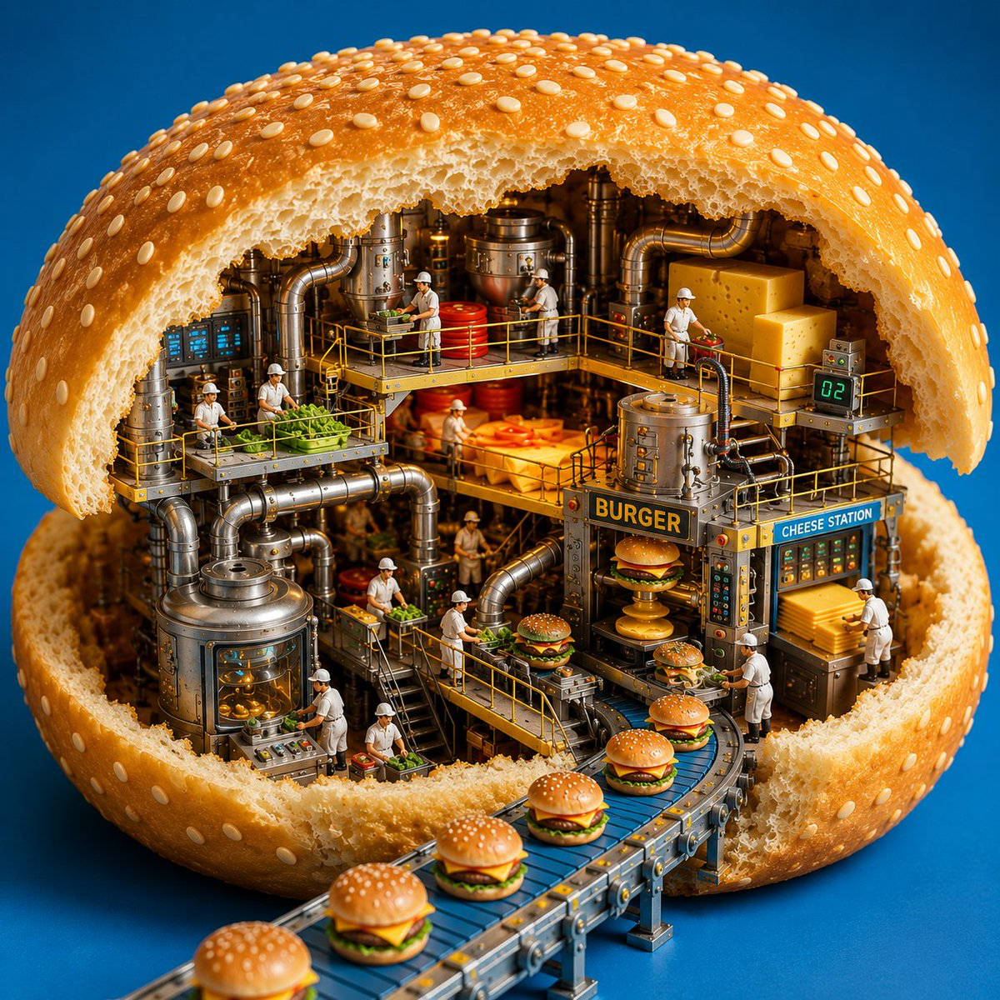</a>

```text
Cross section of giant {argument name="object" default="sesame burger bun"} Miniature {argument name="factory" default="burger factory"} operating inside bun Conveyor belt moving tiny cheeseburgers outward Workers assembling burgers with lettuce, cheese, tomato Industrial machines and pipes inside bread interior Cheese block stacked near machinery Bright colorful lighting Clean {argument name="background" default="blue"} background Ultra detailed 3D miniature render Toy-like aesthetic with hyper realism Soft shadows and smooth textures Cinematic depth of field High resolution 8K
```

## by [루피노드 🐰💕](<https://x.com/luffynod00>) on May 7, 2026 👉 [Try Now](https://indream.ai/generate?mode=IMAGE&modelKey=gpt-image-v2&modelPromptId=019e60f7-8bd3-75e2-ad81-e3f78e59eccb)

<a href="./public/images/f9983a08-827d-4fb4-9d08-97f016b56f47.png" target="_blank" rel="noopener noreferrer">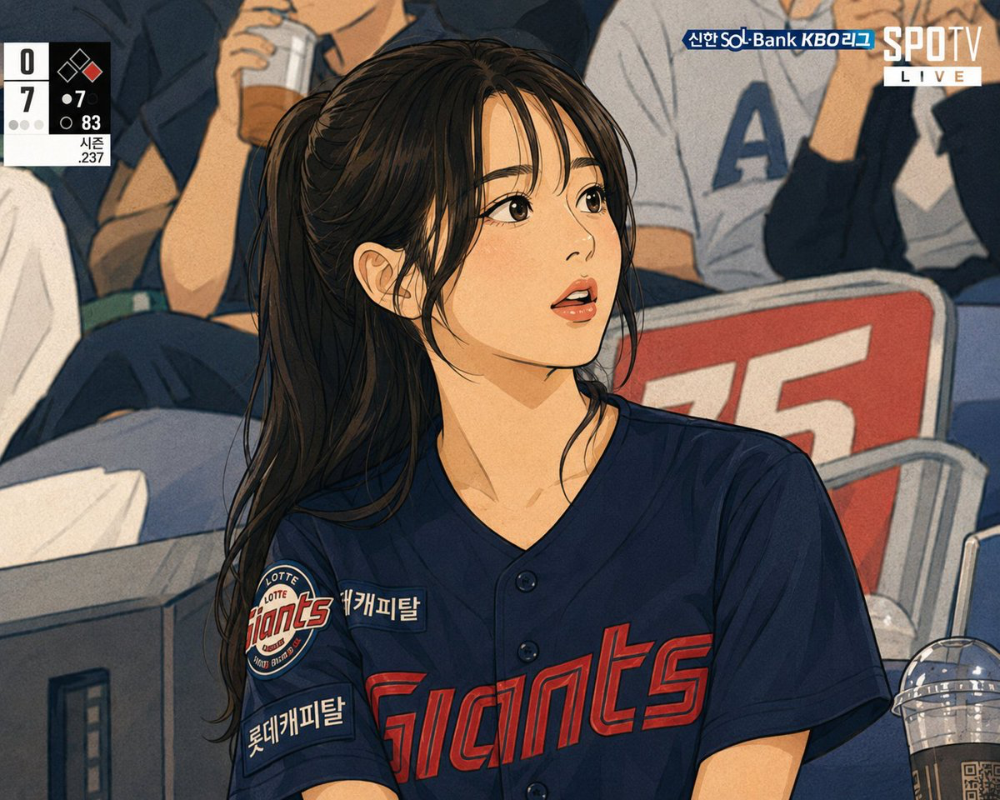</a>

```text
{argument name="스타일" default="라인스탬프풍"} 애니메이션 톤으로 만들어줘.
사진 캐릭터에 요즘 인스타그램에서 유행하는 손글씨로 {argument name="낙서 종류" default="날개"} 낙서해줘.
{argument name="낙서 종류" default="날개"}는 부드럽고 몽글몽글 모양. {argument name="색상" default="하늘색 계열"}.
```

## by [皮バター](<https://x.com/_kawabutter>) on May 6, 2026 👉 [Try Now](https://indream.ai/generate?mode=IMAGE&modelKey=gpt-image-v2&modelPromptId=019e60fc-676e-7016-9d6e-98e5d4c061df)

<a href="./public/images/5b5ed399-11c4-45b6-9e4a-08dc75d5ae8e.png" target="_blank" rel="noopener noreferrer">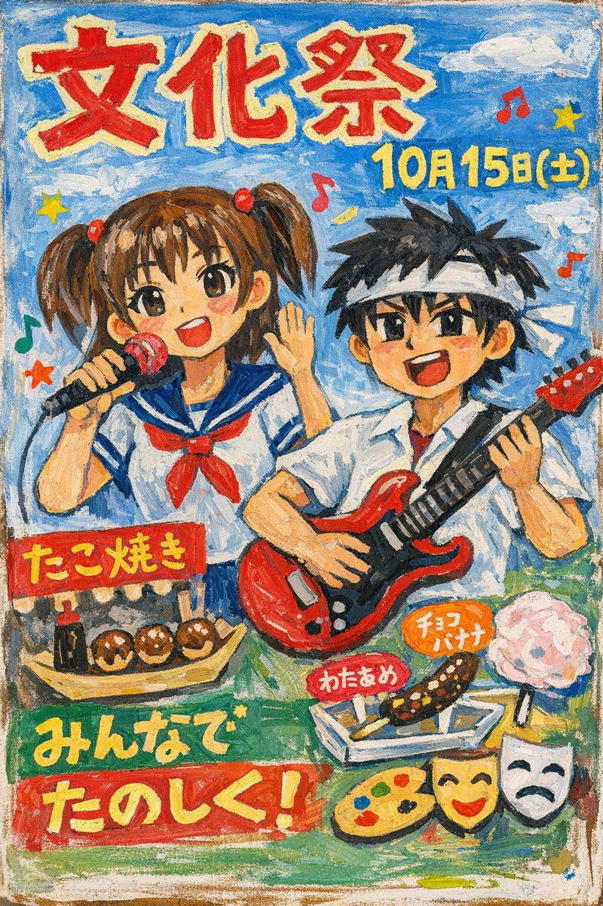</a>

```text
{"type":"hand-painted Japanese school festival poster illustration","style":"childlike thick oil-pastel and tempera paint, rough brush texture, uneven hand lettering, bright primary colors, naive perspective, white scuffed paper border, cheerful but slightly uncanny handmade flyer","canvas":"vertical portrait poster","background":"blue sky with rough white clouds, scattered colorful music notes and stars","headline":{"text":"{argument name=\"headline text\" default=\"文化祭\"}","position":"top","appearance":"very large red Japanese characters with thick cream outline, hand-painted"},"date":{"text":"{argument name=\"date text\" default=\"10月15日(土)\"}","position":"upper right","appearance":"yellow hand-painted text"},"main_subjects":{"count":2,"description":"two middle-school students performing at a culture festival, both faces hidden by flat rectangular beige-to-gray gradient censor blocks","characters":[{"position":"left center","description":"girl in a white and navy sailor school uniform with red neckerchief, brown twin ponytails tied with red bands, holding a black microphone and raising one hand"},{"position":"right center","description":"boy in a white short-sleeve school shirt, spiky black hair, playing a bright red electric guitar with black pickguard"}]},"poster_text":{"count":5,"labels":[{"text":"{argument name=\"food stall label\" default=\"たこ焼き\"}","position":"lower left on red sign above food stall"},{"text":"わたあめ","position":"lower middle on red sign near cotton candy stall"},{"text":"チョコバナナ","position":"lower right on orange oval sign near chocolate banana"},{"text":"みんなで","position":"bottom left on green background"},{"text":"{argument name=\"bottom slogan\" default=\"たのしく!\"}","position":"bottom on red banner"}]},"festival_items":{"count":6,"items":["takoyaki stall tray with 3 round takoyaki balls and a black sauce bottle","red electric guitar","chocolate banana on a tray with colorful sprinkles","pink cotton candy on a stick","paint palette with multicolored paint spots","two theater masks at bottom right, one yellow smiling mask and one white sad mask with eerie expression"]},"decorations":{"count":7,"items":["red music note near top right","pink music note above performers","orange music note at right edge","green music note at left edge","yellow star at upper right","yellow star at left center","orange star at left center"]},"composition":"busy school culture festival advertisement poster, performers dominate center, food and activity icons fill the bottom third, all elements painted with thick uneven strokes and slightly messy edges"}
```

## by [Drey](<https://x.com/dreyart01>) on May 6, 2026 👉 [Try Now](https://indream.ai/generate?mode=IMAGE&modelKey=gpt-image-v2&modelPromptId=019e60fc-b8f9-701b-a68d-601704cdc824)

<a href="./public/images/5e00b42b-89bf-45ae-8e3f-013ded2ef61d.png" target="_blank" rel="noopener noreferrer">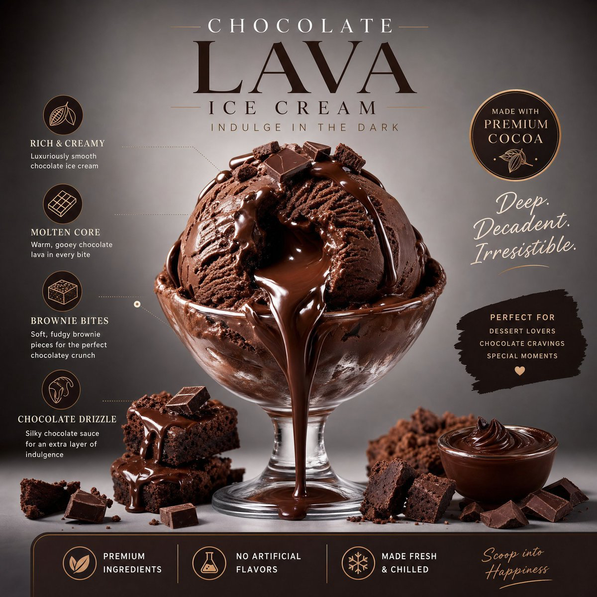</a>

```text
{
  "type": "premium square food advertisement poster",
  "format": "1:1 social media ad, high-end dessert brand campaign",
  "style": "luxury dark chocolate photography with elegant editorial typography, realistic studio lighting, glossy textures, warm cocoa-and-gold palette, shallow depth of field, sophisticated confectionery branding",
  "main product": {
    "name": "{argument name=\"product name\" default=\"LAVA ICE CREAM\"}",
    "flavor line": "{argument name=\"flavor text\" default=\"CHOCOLATE\"}",
    "tagline": "{argument name=\"tagline\" default=\"INDULGE IN THE DARK\"}",
    "centerpiece": "a glass dessert coupe filled with a large scoop of dark chocolate ice cream split open in the middle, revealing a thick molten chocolate core pouring down like lava over the rim and stem of the glass",
    "toppings": "dark chocolate drizzle, chocolate chunks, brownie pieces, cocoa crumbs, glossy melted chocolate highlights"
  },
  "composition": {
    "background": "soft smoky gray gradient backdrop with subtle vignette, brighter behind the ice cream and darker at the edges",
    "foreground": "white-gray tabletop scattered with brownie cubes, broken brownie crumbs, chocolate squares, and a small bowl of whipped glossy chocolate ganache on the right",
    "lighting": "dramatic softbox highlights on the chocolate, reflective shine on the glass bowl, appetizing macro food-photography contrast",
    "camera": "front-facing hero shot, centered product, slight low angle, crisp details on the ice cream and molten core"
  },
  "text layout": {
    "top headline": "large centered serif typography reading CHOCOLATE above enormous LAVA, with ICE CREAM below and thin gold divider lines",
    "script slogan": "right side handwritten script reading Deep. Decadent. Irresistible.",
    "premium badge": "top-right circular dark badge with gold border and cocoa bean icon, text reads MADE WITH PREMIUM COCOA",
    "brush label": "right-lower black brush-stroke label reading PERFECT FOR / DESSERT LOVERS / CHOCOLATE CRAVINGS / SPECIAL MOMENTS with a small heart underneath",
    "bottom signature": "bottom-right handwritten text reading Scoop into Happiness"
  },
  "feature callouts": {
    "count": 4,
    "position": "vertical column on the left with circular gold line icons and dotted leader lines pointing toward the ice cream",
    "items": [
      {
        "label": "RICH & CREAMY",
        "description": "Luxuriously smooth chocolate ice cream",
        "icon": "cocoa bean"
      },
      {
        "label": "MOLTEN CORE",
        "description": "Warm, gooey chocolate lava in every bite",
        "icon": "chocolate bar grid"
      },
      {
        "label": "BROWNIE BITES",
        "description": "Soft, fudgy brownie pieces for the perfect chocolatey crunch",
        "icon": "brownie cube"
      },
      {
        "label": "CHOCOLATE DRIZZLE",
        "description": "Silky chocolate sauce for an extra layer of indulgence",
        "icon": "dripping chocolate swirl"
      }
    ]
  },
  "bottom benefits bar": {
    "count": 4,
    "style": "dark chocolate horizontal footer panel with rounded top corners, thin gold borders and dividers, gold line icons, small uppercase white text",
    "items": [
      "PREMIUM INGREDIENTS with leaf icon",
      "NO ARTIFICIAL FLAVORS with laboratory flask icon",
      "MADE FRESH & CHILLED with snowflake icon",
      "Scoop into Happiness in gold handwritten script"
    ]
  },
  "typography": "high-contrast luxury serif for the main title, spaced uppercase sans serif for supporting copy, elegant cursive script for emotional slogans, all text clean and legible",
  "color palette": "deep espresso brown, glossy dark chocolate, warm caramel gold, cream white, smoky charcoal gray",
  "rendering notes": "make the molten chocolate flow thick, reflective, and appetizing; preserve exact visible text; create a polished commercial dessert poster suitable for a premium ice cream launch"
}
```

## by [七瀬＠AIイラスト](<https://x.com/nanase_AI2>) on May 6, 2026 👉 [Try Now](https://indream.ai/generate?mode=IMAGE&modelKey=gpt-image-v2&modelPromptId=019e6100-8379-701b-b6b5-c465f6e44c9b)

<a href="./public/images/e81751b2-8e93-46a5-861c-8b9f629c704b.png" target="_blank" rel="noopener noreferrer">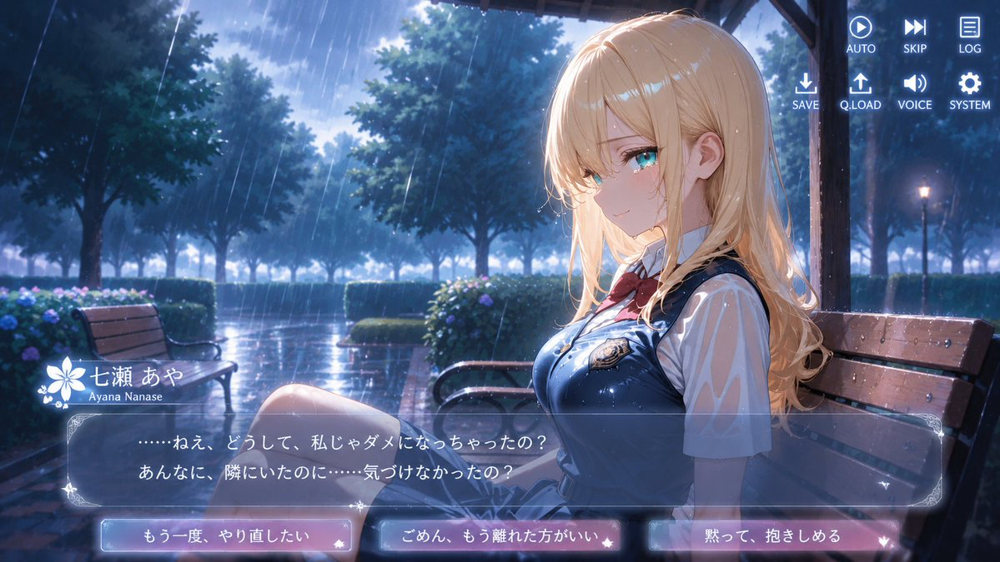</a>

```text
{"type":"anime visual novel screenshot","format":"16:9 widescreen game CG","scene":"rainy evening in a park pavilion, cinematic romantic-drama atmosphere, glossy wet surfaces and blue twilight lighting","subject":{"character name":"{argument name=\"character name\" default=\"七瀬 あや\"}","romanized name":"{argument name=\"romanized name\" default=\"Ayana Nanase\"}","appearance":"teenage anime schoolgirl seated sideways on a wooden bench under a shelter, long wavy blonde hair with soft bangs, visible ear, delicate build, face intentionally covered by a plain skin-tone square censor block with no facial features","outfit":"white short-sleeve blouse, navy school vest or jumper dress with glossy rain droplets, red ribbon bow at collar, small crest badge on chest, pleated skirt, bare legs partly visible","pose":"sitting on the right side of the composition, body turned left, knees angled toward the viewer, melancholic quiet posture"},"environment":{"location":"tree-lined public park with benches, hedges, hydrangea-like flowers, wet brick walkway, distant street lamps, dark wooden shelter posts and roof framing the character","weather":"heavy rain with many diagonal streaks, water droplets on character and bench, puddle reflections","lighting":"cool blue night rain ambience with bright backlight from cloudy sky, soft rim highlights on blonde hair, high-detail anime background painting"},"visual novel interface":{"top right menu":{"count":8,"items":["AUTO with play icon","SKIP with fast-forward icon","LOG with document icon","SAVE with download arrow icon","Q.LOAD with upload arrow icon","VOICE with speaker icon","SYSTEM with gear icon","one additional spacing/row alignment as part of the 2-by-4 menu cluster"]},"nameplate":{"position":"lower left above dialogue box","style":"white flower emblem and decorative sparkles","visible text":["七瀬 あや","Ayana Nanase"]},"dialogue box":{"position":"bottom third","style":"translucent dark blue glass panel with ornate pale corners and thin border","speaker":"七瀬 あや","text":"{argument name=\"dialogue text\" default=\"……ねえ、どうして、私じゃダメになっちゃったの？\\nあんなに、隣にいたのに……気づけなかったの？\"}"},"choice buttons":{"count":3,"position":"very bottom in a horizontal row","style":"glowing rounded rectangular buttons, blue-to-pink translucent gradients, small heart/star ornaments","labels":["{argument name=\"left choice\" default=\"もう一度、やり直したい\"}","{argument name=\"middle choice\" default=\"ごめん、もう離れた方がいい\"}","{argument name=\"right choice\" default=\"黙って、抱きしめる\"}"]}},"composition":"character dominates right half, empty rainy park depth on left, bench and shelter create perspective lines, UI overlays remain crisp and readable, polished gpt-image-2 anime game CG quality, no extra characters"}
```

## by [serein](<https://x.com/you1873118>) on May 6, 2026 👉 [Try Now](https://indream.ai/generate?mode=IMAGE&modelKey=gpt-image-v2&modelPromptId=019e6101-34bd-707b-88bc-0220b1329198)

<a href="./public/images/05188313-6691-4a4f-9a32-244c3afe4fa6.png" target="_blank" rel="noopener noreferrer">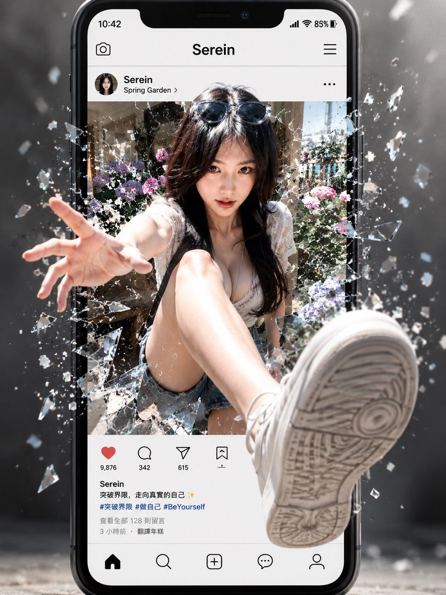</a>

```text
{"type":"cinematic 3D social-media breakthrough poster","concept":"A hyper-realistic young woman bursts out of a smartphone social media post, shattering the screen glass with dramatic depth and motion.","main subject":{"description":"fashionable young woman seated inside a photo post, long dark hair, sunglasses pushed on top of her head, white lace summer top, denim shorts, white sneakers","pose":"one hand reaching forcefully toward the viewer through broken glass, one leg thrust forward so the sneaker sole becomes huge in the foreground, extreme wide-angle perspective","face":"intentionally covered by a soft rectangular blur censor block","customizable identity":"{argument name=\"character name\" default=\"Serein\"}"},"device and interface":{"device":"large black modern smartphone standing upright, iPhone-like rounded frame and notch","top status bar":"time 10:42, signal icons, Wi-Fi, 85% battery","app header":"center title {argument name=\"profile name\" default=\"Serein\"}, camera icon on left, hamburger menu on right","post header":"round avatar, username Serein, location Spring Garden, three-dot menu","visible UI components count":9,"visible UI components":["status bar","camera icon","app title","hamburger menu","post profile row","three-dot menu","engagement buttons row","caption and hashtags block","bottom navigation bar"],"engagement buttons count":4,"engagement buttons":["red heart with 9,876 likes","comment bubble with 342","paper-plane share with 615","bookmark icon with 1"],"bottom navigation icons count":5,"bottom navigation icons":["home","search","create plus","messages bubble","profile outline"],"caption text":"{argument name=\"caption text\" default=\"Serein\\n突破界限，走向真实的自己 ✨\\n#突破界限 #做自己 #BeYourself\\n查看更多 128 则留言\\n3 小时前 · 翻译年糕\"}"},"environment inside post":"sunlit garden courtyard with flowers, greenery, pale stone walls, bright outdoor summer atmosphere","glass effect":{"description":"phone screen appears violently broken around the subject as she exits the post","shards":"many transparent glass fragments and glittering splinters flying outward in all directions, especially left and right edges","motion":"frozen mid-explosion with debris suspended in air"},"camera and composition":{"framing":"vertical 4:5 poster composition, smartphone centered and filling most of frame","perspective":"extreme 3D depth, foreshortened hand reaching out left foreground and oversized sneaker sole dominating lower right foreground","focus":"sharp phone and subject, background slightly smoky and blurred","lighting":"{argument name=\"lighting style\" default=\"cinematic high-contrast sunlight with rim highlights on glass shards\"}"},"style":"photorealistic advertising composite, glossy smartphone mockup, social-media UI realism, blockbuster action energy, dramatic shattered-screen portal effect, high detail, depth of field, motion impact","background":"dark gray studio-like environment with haze, bokeh, floating dust and glass particles behind the phone","negative instructions":"no extra limbs, no warped phone frame, no unreadable major UI title, no cartoon style, no low-resolution textures"}
```

## by [のとろ](<https://x.com/notoro_ai>) on May 6, 2026 👉 [Try Now](https://indream.ai/generate?mode=IMAGE&modelKey=gpt-image-v2&modelPromptId=019e6102-722d-7687-ad5a-4fa03a83bf69)

<a href="./public/images/aead892e-1f90-4351-b3c1-b71e0dd2b735.png" target="_blank" rel="noopener noreferrer">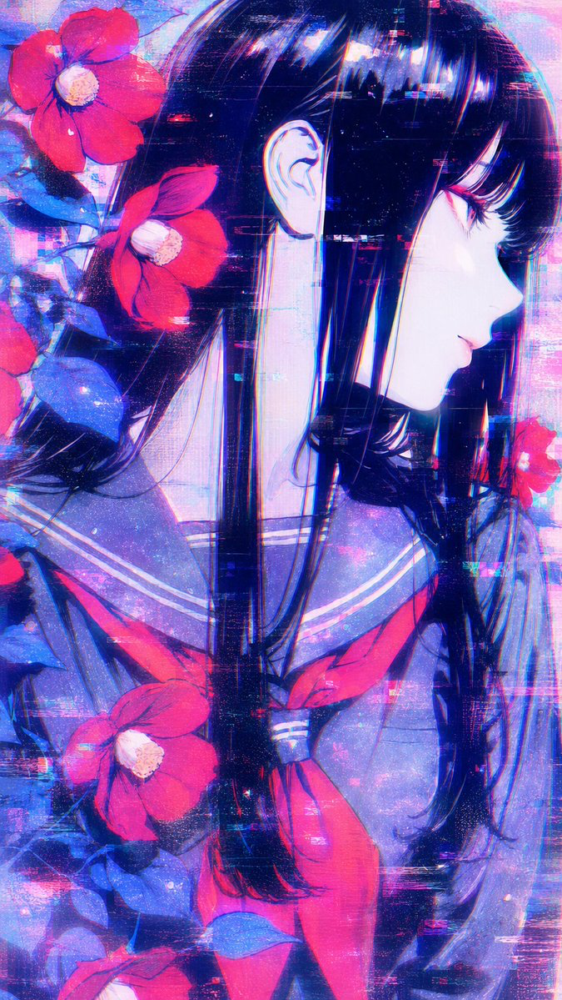</a>

```text
このイラストを{argument name="スタイル" default="幻想的で詩的なグリッチアート風"}に変換してください。{argument name="効果" default="微細なRGB分離、柔らかい色ずれ、微かなスキャンライン、粒子のようなデジタルノイズ、軽いdatamoshing効果"}を優しく重ねて表現。{argument name="質感" default="壊れながらも美しく輝くようなエーテルな質感"}を重視してください。

全体を夢幻的で神秘的、近未来的でありながら儚い美しさを持つ雰囲気に仕上げてください。元のイラストの構図・キャラクターの表情と可愛らしさを損なわず、優しいグリッチ効果を加えて。
```

## by [叉叉](<https://x.com/web3chacha>) on May 6, 2026 👉 [Try Now](https://indream.ai/generate?mode=IMAGE&modelKey=gpt-image-v2&modelPromptId=019e6103-f156-70df-af08-5333d677cc65)

<a href="./public/images/8caab529-e71a-4eb8-a0cc-87f6cbc09253.png" target="_blank" rel="noopener noreferrer">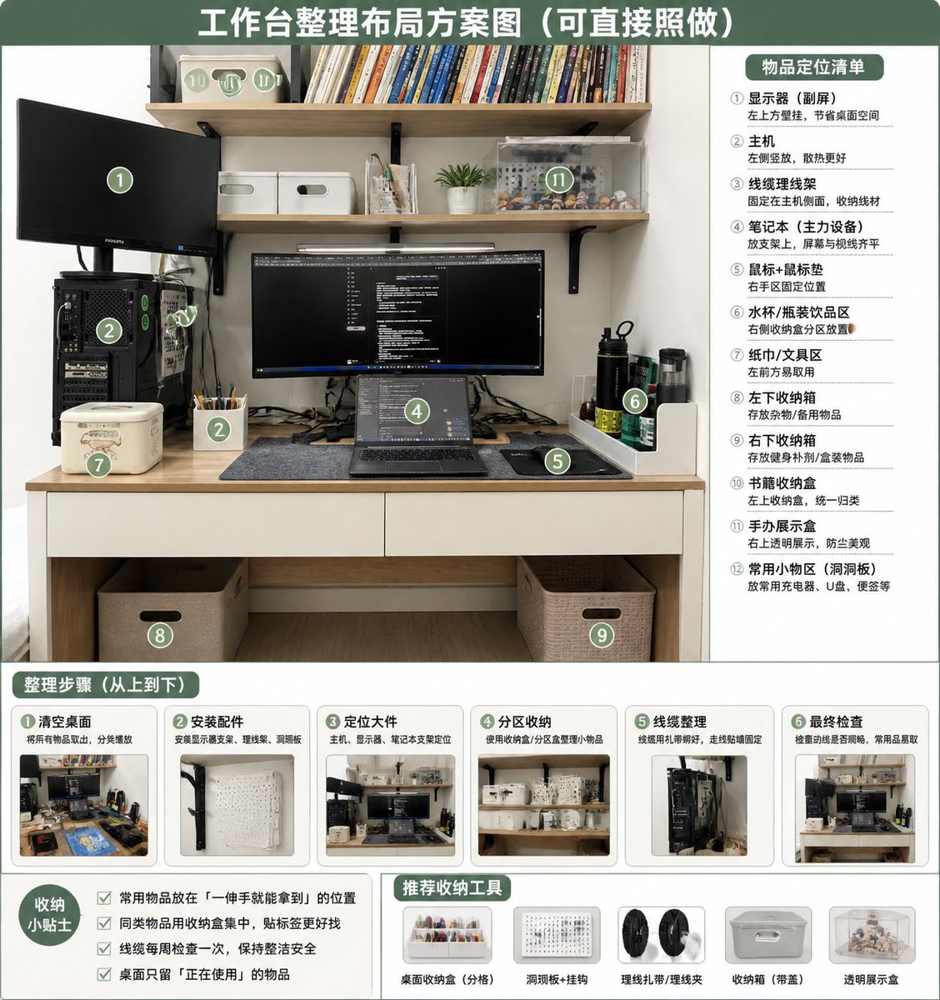</a>

```text
Using REFERENCE_0 as the source photo, create a clean, realistic “after organization” desktop layout plan infographic. Keep the same desk, shelves, monitor/laptop setup, PC tower position, and overall room viewpoint, but tidy the workspace: route cables neatly, clear the desktop, place items into defined storage zones, add matching storage boxes/baskets, a pegboard/accessory area, pen cup, book storage box, transparent display case, and dedicated bottle/tissue/small-tool areas. Use a green-and-white instructional poster style with a large top headline: {argument name="headline text" default="工作台整理布局方案图（可直接照做）"}. Overlay 12 green circular numbered markers on the organized photo and include a right-side panel titled {argument name="right panel title" default="物品定位清单"} listing exactly 12 labeled zones: ① monitor / secondary screen, ② main PC tower, ③ cable management, ④ laptop work area, ⑤ mouse pad / mouse area, ⑥ water cup / bottle area, ⑦ tissue / tool area, ⑧ left under-desk storage box, ⑨ right under-desk storage box, ⑩ book storage box, ⑪ figure display area, ⑫ common small-items area / pegboard. Add a bottom section titled {argument name="steps title" default="整理步骤（从上到下）"} with exactly 6 step cards, each containing a small before/after-style thumbnail and short Chinese labels: ① clear desktop, ② install accessories, ③ position large items, ④ partition storage, ⑤ cable management, ⑥ final inspection. Add a bottom-left tips box titled {argument name="tips title" default="收纳小贴士"} with exactly 4 checkbox tips about putting frequently used items within one-hand reach, grouping similar items, checking cables weekly, and keeping only currently used items on the desk. Add a bottom-center/right recommendations row titled {argument name="tools title" default="推荐收纳工具"} with exactly 5 product icons: desktop organizer tray, pegboard + hooks, cable ties / cable clips, storage box with handle, transparent display box. Make the design neat, practical, bright, and directly actionable, like a home-office organization guide derived from the original photo.
```

## by [Larus Canus](<https://x.com/MrLarus>) on May 6, 2026 👉 [Try Now](https://indream.ai/generate?mode=IMAGE&modelKey=gpt-image-v2&modelPromptId=019e6104-10f2-74d2-9151-a8ca4d2f0188)

<a href="./public/images/df2010e2-71b6-463e-b433-369cee911428.png" target="_blank" rel="noopener noreferrer">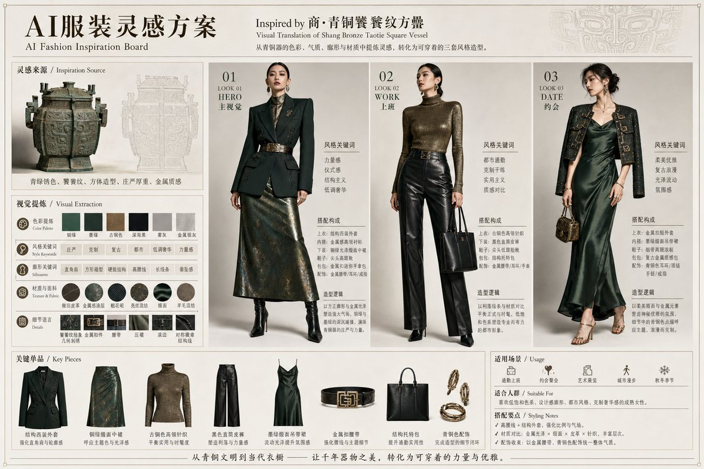</a>

```text
{"type":"luxury editorial AI fashion inspiration board","format":"single wide landscape presentation sheet, museum-catalog meets high-fashion styling board","language":"Chinese with small English subtitles","theme":"Create a refined fashion concept board inspired by {argument name="inspiration artifact" default="商・青铜饕餮纹方罍"}, translating an ancient Chinese bronze vessel into modern wearable outfits with a premium national-style aesthetic.","overall_style":"warm ivory paper background, thin bronze border lines, elegant serif typography, subtle ink-gray ornamental pattern in the top right, clean grid layout, luxury magazine art direction, realistic product photography and full-body fashion-model renders, muted antique bronze and dark jade palette","header":{"main_title":"AI服装灵感方案","subtitle":"AI Fashion Inspiration Board","center_title":"Inspired by 商・青铜饕餮纹方罍","center_subtitle":"Visual Translation of Shang Bronze Taotie Square Vessel","description":"从青铜器的色彩、气质、廓形与材质中提炼灵感，转化为可穿着的三套风格造型。"},"layout":{"sections":[{"title":"灵感来源 / Inspiration Source","position":"upper left","count":2,"items":["large photo of a square Shang bronze ritual vessel with handles and dark green patina","pale line-art tracing of the same vessel behind it"],"caption":"青绿锈色、饕餮纹、方体造型、庄严厚重、金属质感"},{"title":"视觉提炼 / Visual Extraction","position":"middle left","count":5,"items":[{"label":"色彩提炼 Color Palette","count":6,"swatches":["bronze green","deep jade green","ancient bronze brown","dark ink black","warm gray","metallic patina gray"]},{"label":"风格关键词 Style Keywords","count":6,"keywords":["严肃","克制","复古","都市","低调奢华","力量感"]},{"label":"廓形关键词 Silhouette","count":6,"keywords":["直角肩","方形框架","硬挺结构","高腰线","长线条","垂坠感"]},{"label":"纹理与面料 Texture & Fabric","count":6,"items":["bronze patina texture","dark green jacquard","fine black leather","distressed metallic sheen","satin gloss","wool blend"]},{"label":"细节语言 Details","count":6,"items":["taotie-inspired pattern","square metal buckle","belt","embossed surface","flowing hem","architectural shoulder line"]}]},{"title":"Look 01 HERO 主视觉","position":"center left","count":1,"model":"full-body female model, face softly blurred, upright confident pose","outfit":"dark green structured double-breasted blazer with sharp shoulders, black high-neck inner layer, wide ornate metallic belt, long bronze-green jacquard midi skirt, black pointed ankle boots","style_keywords":["力量感","仪式感","结构主义","低调奢华"],"styling_components_count":5,"styling_components":["structured dark green blazer","black high-neck base layer","bronze square-buckle belt","metallic jacquard midi skirt","black pointed ankle boots"],"design_logic":"Use strong shoulders, bronze patina color, and ceremonial proportions to echo the vessel's solemn geometry."},{"title":"Look 02 WORK 上班","position":"center","count":1,"model":"full-body female model, face softly blurred, minimal professional pose holding a black tote","outfit":"antique-gold metallic turtleneck knit top, high-waisted black leather straight-leg trousers, black belt with square bronze buckle, black structured tote bag, black heeled boots","style_keywords":["都市通勤","克制干练","实用主义","质感对比"],"styling_components_count":5,"styling_components":["metallic bronze turtleneck knit","black leather straight trousers","square-buckle belt","structured black tote","black pointed heeled boots"],"design_logic":"Contrast glossy leather and aged metal texture for a wearable office interpretation of bronze materiality."},{"title":"Look 03 DATE 约会","position":"right","count":1,"model":"full-body female model, face softly blurred, elegant evening pose with small handbag","outfit":"deep jade satin slip dress, cropped black embellished jacket with bronze embroidery and square hardware, delicate heeled sandals, small dark gold mini handbag, layered gold jewelry","style_keywords":["柔美优雅","复古浪漫","光泽流动","氛围感"],"styling_components_count":5,"styling_components":["jade satin slip dress","cropped embroidered jacket","strappy heeled sandals","small metallic handbag","gold earrings and bangles"],"design_logic":"Transform heavy bronze motifs into a softer date look using satin shine, jade green color, and ornate metallic details."},{"title":"关键单品 / Key Pieces","position":"bottom left and center","count":8,"items":["dark green structured blazer","bronze-green jacquard midi skirt","antique-gold metallic turtleneck knit","black leather straight-leg trousers","deep jade satin slip dress","black belt with square bronze buckle","structured black tote bag","gold jewelry set with earrings, bracelet, and ring"]},{"title":"适用场景 / Usage","position":"bottom right","count":5,"items":["通勤上班","约会聚会","艺术展览","城市漫步","秋冬季节"]},{"title":"适合人群 / Suitable For","position":"bottom right below usage","count":1,"items":["喜欢低调和色彩、设计感廓形、都市风格、克制奢华质感的成熟女性"]},{"title":"搭配要点 / Styling Notes","position":"bottom right","count":3,"items":["高腰线与结构外套强化身形比例与气场","材质对比：金属光泽、皮革、织纹、缎面形成层次","配饰呼应：以金属腰带、青铜色饰物统一整体气质"]}],"footer_slogan":"从青铜文明到当代衣橱 —— 让千年器物之美，转化为可穿着的力量与优雅。"},"visual_requirements":"Render the board as a realistic high-resolution flat presentation page, not a collage screenshot. Use precise alignment, thin dividers, museum-style captions, editorial lighting, and premium fashion lookbook photography. The three outfit looks must be distinct and numbered 01, 02, 03. Include all visible section titles and exactly counted items as specified. Keep the faces softly anonymized or blurred as in fashion concept mockups.","customization":{"artifact":"{argument name="inspiration artifact" default="商・青铜饕餮纹方罍"}","main_title":"{argument name="main title" default="AI服装灵感方案"}","color_palette":"{argument name="primary color palette" default="dark jade green, antique bronze, black leather, warm ivory"}","fashion_mood":"{argument name="fashion mood" default="low-key luxury, solemn, structured, modern Chinese style"}"}}
```

## by [Cherry 2.O](<https://x.com/Mind_Boticni>) on May 6, 2026 👉 [Try Now](https://indream.ai/generate?mode=IMAGE&modelKey=gpt-image-v2&modelPromptId=019e6106-f749-71e0-ae6c-e802366108e5)

<a href="./public/images/6ad4cc95-1039-4114-af75-9c71d44bb91c.png" target="_blank" rel="noopener noreferrer">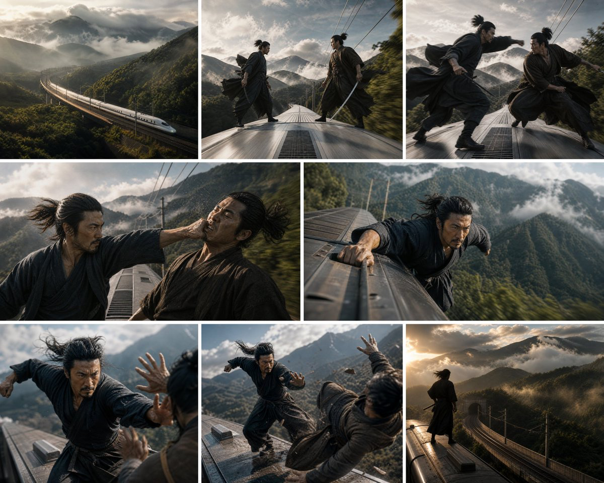</a>

```text
{"type":"cinematic action storyboard contact sheet","concept":"A high-speed rooftop fight on a Japanese bullet train, rendered as eight photorealistic widescreen storyboard frames in one collage, with consistent characters, lighting, costumes, and mountain environment across all shots.","format":{"canvas":"4:3 contact sheet collage","panel_count":8,"panel_borders":"thin clean white gutters separating frames","style":"high-end live-action film stills, dramatic motion blur, realistic camera lenses, shallow depth of field, epic scale"},"setting":{"location":"roof of a modern white Japanese bullet train moving at extreme speed through lush forested mountains","time_of_day":"late afternoon to golden hour","weather":"moody clouds, mist banks in the valleys, shafts of sunlight, wind-whipped atmosphere","environment_details":"green mountain ridges, railway bridges and overhead electric wires, reflective metallic train roof panels, ventilation grilles, blurred trees rushing past"},"characters":{"count":2,"description":"two adult Japanese samurai-like fighters with faces intentionally obscured by soft rectangular blur blocks, athletic builds, long dark hair tied back in messy topknots, wind-blown strands, intense body language","fighter 1":"dark navy-black layered robe, loose hakama-style pants, wrapped forearms, barefoot or dark tabi-like footwear, carrying a katana","fighter 2":"earthy brown layered robe, dark trousers, tied sash, carrying a katana","customizable_names":"{argument name=\"character names\" default=\"two anonymous rival swordsmen\"}","wardrobe":"{argument name=\"costume style\" default=\"dark Edo-period inspired samurai robes adapted for cinematic realism\"}"},"cinematography":{"camera_language":"dynamic handheld action photography mixed with aerial establishing shots, low angles from the train roof, close combat framing, telephoto compression of mountains, wide cinematic landscapes","lighting":"{argument name=\"lighting style\" default=\"stormy mountain sunlight with warm golden highlights and cool cloud shadows\"}","motion":"extreme wind, hair and robes whipping, strong motion blur on background and limbs, sense of dangerous speed"},"layout":{"sections":[{"position":"top-left","shot_number":1,"description":"wide aerial establishing shot of the sleek bullet train curving through a forested mountain valley on elevated tracks, no fighters visible, misty mountains and dramatic clouds"},{"position":"top-center","shot_number":2,"description":"two swordsmen face each other on the train roof from a low centered viewpoint, both standing with katanas drawn or ready, overhead wires streaking above"},{"position":"top-right","shot_number":3,"description":"side-view action beat as the dark-robed fighter lunges or punches toward the brown-robed fighter, both crouched for balance on the speeding roof"},{"position":"middle-left wide","shot_number":4,"description":"tight close-up of a strike landing or near-miss: dark-robed fighter's arm extended across the frame toward the brown-robed opponent, faces blurred, mountains rushing behind"},{"position":"middle-right wide","shot_number":5,"description":"dark-robed fighter clings to the train roof with one hand near the roof seam, body stretched sideways by speed and impact, mountain forest blurred below"},{"position":"bottom-left","shot_number":6,"description":"close combat angle from the opponent's perspective, dark-robed fighter charges forward with one hand reaching out, the other fighter's raised hands visible in foreground"},{"position":"bottom-center","shot_number":7,"description":"dynamic rooftop struggle as one fighter attacks while the other falls or rolls backward, limbs extended, small roof hardware visible, sweeping mountain background"},{"position":"bottom-right","shot_number":8,"description":"quiet final silhouette-like shot of one lone fighter standing on the train roof at sunset, holding a sword and looking down the curving track through golden mist"}]},"text":"no visible captions, no logos, no watermarks","quality_instructions":"Generate as a coherent storyboard sheet, not separate unrelated images. Keep the same two fighters in every action panel, preserve the bullet train roof design and Japanese mountain valley continuity, emphasize realistic film still detail and kinetic danger.","main subject":"{argument name=\"main action\" default=\"a rooftop sword fight on a speeding Japanese bullet train\"}","setting customization":"{argument name=\"landscape setting\" default=\"misty Japanese mountain valley\"}"}
```

## by [蜡笔进化论](<https://x.com/crayon1267>) on May 6, 2026 👉 [Try Now](https://indream.ai/generate?mode=IMAGE&modelKey=gpt-image-v2&modelPromptId=019e6108-d8ea-774c-9362-102d198d7fb5)

<a href="./public/images/a165a41d-fe1d-43f8-973a-2f4537c10110.png" target="_blank" rel="noopener noreferrer">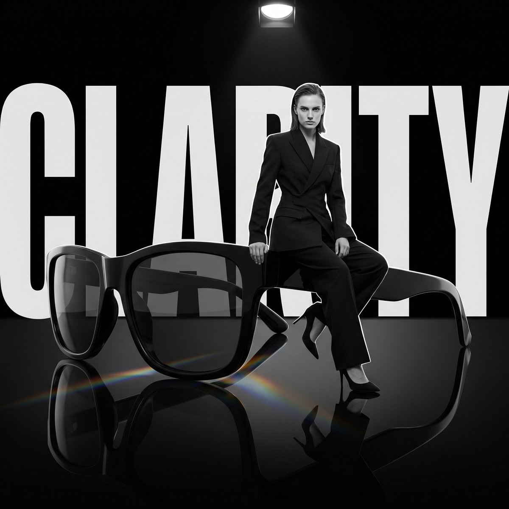</a>

```text
Oversized {argument name="product" default="PRODUCT"} as sculpture, model sitting on it, giant word "{argument name="brand name" default="WORD"}" behind, matte black void bg, reflective black floor, prismatic light scatter on floor. 1:1, dark luxury editorial.
```

## by [Marcio Lima 利真 マルシオ 💎](<https://x.com/Preda2005>) on May 5, 2026 👉 [Try Now](https://indream.ai/generate?mode=IMAGE&modelKey=gpt-image-v2&modelPromptId=019e6109-3eca-71d8-b56d-cac7fa3fa168)

<a href="./public/images/8d5ca2a8-eb73-4156-b16f-e61aace94bb1.png" target="_blank" rel="noopener noreferrer">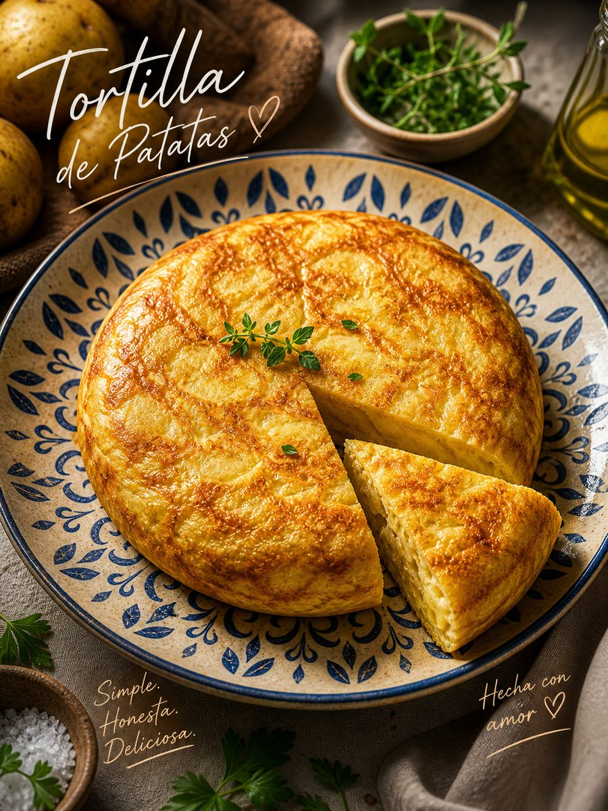</a>

```text
Create a warm rustic food-photography poster for a Spanish potato omelette, featuring a perfectly round golden-brown tortilla de patatas centered on a large cream ceramic plate with cobalt-blue floral patterns. A triangular slice has been cut out and pulled slightly forward to the lower right, revealing thick layered potato and egg inside; the omelette surface is glossy, browned, and textured, with a small sprig of fresh thyme on top. Use an overhead three-quarter view, shallow depth of field, natural window light, rich appetizing color grading, and a cozy Mediterranean kitchen-table atmosphere. Surround the plate with exactly 6 supporting props: 3 whole potatoes on burlap in the upper left, 1 small bowl of fresh green herbs in the upper right, 1 glass bottle of olive oil at the far upper right, 1 small bowl of coarse salt at the lower left, plus scattered parsley leaves on the linen cloth. Add exactly 3 handwritten text blocks in elegant white and beige script: large title at upper left reading {argument name="headline text" default="Tortilla de Patatas"} with a small heart doodle, small lower-left caption reading {argument name="left caption" default="Simple. Honesta. Deliciosa."}, and small lower-right caption reading {argument name="right caption" default="Hecha con amor"} with a heart and underline. Keep the composition premium, realistic, inviting, editorial, and restaurant-quality, with crisp focus on the omelette and softly blurred background details.
```

## by [Rossy](<https://x.com/xRahultripathi>) on May 5, 2026 👉 [Try Now](https://indream.ai/generate?mode=IMAGE&modelKey=gpt-image-v2&modelPromptId=019e6109-b529-760e-96b0-e1a8fdd00412)

<a href="./public/images/f052641f-63aa-4d4b-8652-646768b9f6fc.png" target="_blank" rel="noopener noreferrer">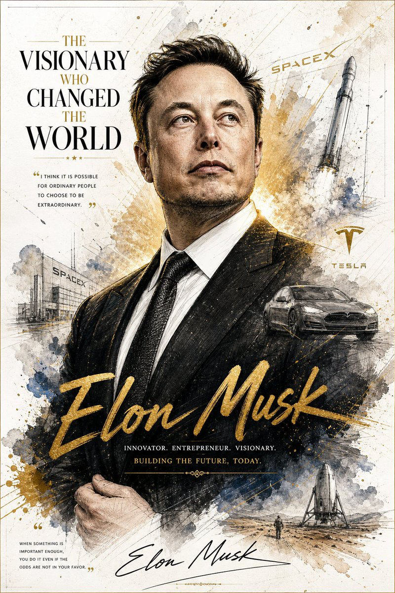</a>

```text
A powerful portrait of a {argument name="subject" default="high-status business leader"} wearing a {argument name="outfit" default="premium luxury formal suit (tailored dark suit, crisp white shirt, elegant tie)"}. Sharp facial features, clean grooming, ultra-realistic detailing. Expression & Mood: Calm, confident, and highly authoritative expression — focused gaze symbolizing intelligence, control, and global influence. Pose & Composition: Half-body portrait (chest-up), Slight diagonal cinematic angle for depth and intensity, Strong executive posture (hands relaxed or adjusting suit). Art Style: Hand-drawn ink sketch lines blended with watercolor textures, Luxury-inspired gold, black, and deep blue/red paint splashes, Dynamic abstract brush strokes representing power and innovation, Highly detailed realistic face with subtle gritty texture. Background: Clean white or soft neutral base, Elegant watercolor splashes (gold + dark tones), Soft glowing aura behind the subject for a premium elite feel. Typography Elements: Main Title: “{argument name="title" default="TYPE HERE"}” Name: “TYPE HERE” (bold handwritten luxury brush style) Extra Details: Subtle gold accents for premium billionaire aesthetic, Light grunge texture overlay for cinematic depth, Minimal crown or abstract wealth/power symbols. Signature (Bottom): “TYPE HERE” Optional Quote Section: “TYPE HERE” Mood & Tone: Elite, powerful, cinematic, luxury-driven legacy aesthetic
```

## by [田中勇道 | AI画像・動画生成](<https://x.com/yudotanaka>) on May 4, 2026 👉 [Try Now](https://indream.ai/generate?mode=IMAGE&modelKey=gpt-image-v2&modelPromptId=019e610a-480a-7282-9847-a02cbfe2bfb9)

<a href="./public/images/3597466d-4ec6-4eaa-abbb-8910b49d1d9d.png" target="_blank" rel="noopener noreferrer">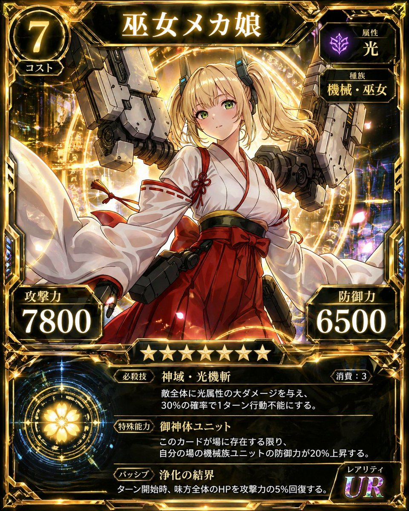</a>

```text
{"type":"ornate anime trading card illustration","language":"Japanese visible text","overall_style":"high-detail fantasy sci-fi mobile game card, black and polished gold frame, glowing lens flares, holographic rainbow reflections, dramatic lighting, premium ultra-rare collectible card look","card_title":"{argument name=\"card title\" default=\"巫女メカ娘\"}","main_character":{"description":"young anime shrine maiden mecha girl centered in a heroic three-quarter pose, face covered by a plain skin-tone square censor block with no facial features visible","hair":"{argument name=\"hair color\" default=\"blonde\"} twin tails with soft curls, long side locks, small black mechanical hair attachments","outfit":"white miko kimono top with very wide flowing sleeves, red trim and red cord knots, high-waisted red hakama skirt, black and gold obi belt, red bow at the waist","equipment":"large gray mechanical armature and weapon-like robotic shoulder units rising behind both sides of her body, dark mechanical holster modules at the hips","pose":"arms extended outward with sleeves billowing, torso facing forward, confident card-hero composition"},"background":{"setting":"golden magical summoning circle behind the character, luminous runes and rings, abstract futuristic city-like lights, sparks, petals, and prismatic bokeh","color_palette":"black, gold, white, crimson red, gray metal, purple accents"},"layout":{"top":{"count":3,"elements":[{"position":"top left circular badge","text":"7","subtext":"コスト","meaning":"cost value"},{"position":"top center title plaque","text":"巫女メカ娘"},{"position":"top right stacked attribute boxes","count":2,"labels":["属性 光","種族 機械・巫女"],"icon":"purple glowing emblem above the light attribute"}]},"middle":{"count":2,"elements":[{"position":"lower left stat box","label":"攻撃力","value":"{argument name=\"attack value\" default=\"7800\"}"},{"position":"lower right stat box","label":"防御力","value":"{argument name=\"defense value\" default=\"6500\"}"}]},"rarity_and_stars":{"position":"center below illustration","star_count":9,"description":"nine gold stars in a row","rarity_box":{"position":"bottom right","label":"レアリティ","value":"UR","style":"large iridescent purple-gold letters"}},"ability_panel":{"position":"bottom black text panel with gold dividers","section_count":3,"sections":[{"label":"必殺技","name":"神域・光機斬","cost_label":"消費：3","description":"敵全体に光属性の大ダメージを与え、30%の確率で1ターン行動不能にする。"},{"label":"特殊能力","name":"御神体ユニット","description":"このカードが場に存在する限り、自分の場の機械族ユニットの防御力が20%上昇する。"},{"label":"パッシブ","name":"浄化の結界","description":"ターン開始時、味方全体のHPを攻撃力の05%回復する。"}]},"bottom_left_emblem":{"count":1,"description":"circular glowing golden flower crest inside concentric sci-fi magic rings"}},"border":"elaborate beveled gold-and-black frame with angular corners, metallic panels, decorative blue side gems, bright glints and highlights","rendering_instructions":"make all Japanese text sharp, legible, and correctly placed; preserve the exact labels and numbers; square card aspect ratio; extremely detailed anime illustration with collectible card UI overlays"}
```

## by [cherryboi](<https://x.com/Asiancherryboi>) on May 4, 2026 👉 [Try Now](https://indream.ai/generate?mode=IMAGE&modelKey=gpt-image-v2&modelPromptId=019e610a-ecef-717e-844e-24b3174be671)

<a href="./public/images/ff6c0ef4-3a03-451a-8a47-506ac6a99850.png" target="_blank" rel="noopener noreferrer">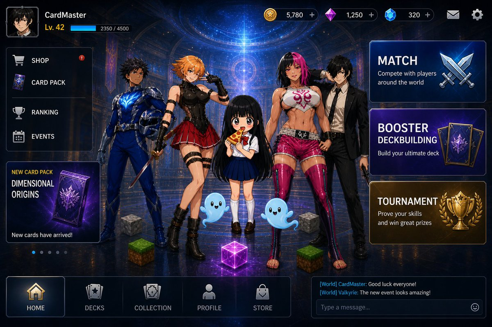</a>

```text
{"type":"high-fidelity anime fantasy card game home screen UI mockup","overall_style":"polished mobile game lobby screenshot, 16:9 landscape, dark blue and purple fantasy sci-fi cathedral background, glowing magic portal at the top center, reflective stone floor, neon rim lighting, crisp game UI panels, all buttons appear clickable, premium collectible card battler aesthetic","game_identity":{"player_name":"{argument name=\"player name\" default=\"CardMaster\"}","level":"{argument name=\"player level\" default=\"Lv. 42\"}","experience_bar":"2350 / 4500","avatar":"small square anime portrait at top left with intentionally blurred face"},"top_resource_bar":{"count":6,"items":["gold coin currency: 5,780 with plus button","purple crystal currency: 1,250 with plus button","blue cube currency: 320 with plus button","mail envelope icon","settings gear icon","player profile block with avatar, name, level, and progress bar"]},"main_characters":{"count":5,"description":"five full-body anime characters standing across the center lobby, all faces softly blurred while bodies and outfits remain detailed","characters":["left male hero in glossy futuristic blue armor with glowing cyan chest emblem, black spiky hair, heroic stance","orange-haired anime warrior girl in black sleeveless top, red pleated mini skirt, black straps, gloves, boots, holding a sword at her side","small schoolgirl in the center with very long black hair, white blouse, navy skirt, knee socks, holding cards close to her chest","muscular athletic woman with black-and-hot-pink hair, white crop top with pink tribal design, pink shorts, thigh-high glossy pink stockings, sandals, confident pose","right male agent in black suit with loosened tie, holding a pistol down at his side"]},"center_floor_props":{"count":5,"items":["two small blue smiling ghost mascots floating near the schoolgirl","one glowing purple transparent cube at bottom center","two small voxel grass-and-dirt blocks near the feet on left and right","two small gray stone cubes behind the central props"]},"left_sidebar":{"position":"left vertical menu","count":4,"buttons":["SHOP with shopping cart icon and a small red notification badge","CARD PACK with card pack icon","RANKING with trophy icon","EVENTS with calendar icon"]},"left_promo_card":{"position":"lower left","title":"NEW CARD PACK","headline":"{argument name=\"card pack headline\" default=\"DIMENSIONAL ORIGINS\"}","subtitle":"New cards have arrived!","visual":"glowing purple booster box tilted in a rectangular promotional card","carousel_dots":{"count":5,"active":"first dot blue, four inactive gray dots"}},"right_action_panels":{"position":"right column","count":3,"panels":[{"title":"MATCH","subtitle":"Compete with players around the world","visual":"crossed silver swords icon on blue panel"},{"title":"BOOSTER DECKBUILDING","subtitle":"Build your ultimate deck","visual":"two purple fantasy cards on violet panel"},{"title":"TOURNAMENT","subtitle":"Prove your skills and win great prizes","visual":"gold trophy with laurel wreath on bronze panel"}]},"bottom_navigation":{"position":"bottom left to center","count":5,"tabs":["HOME highlighted with glowing house icon and bright border","DECKS with card icon","COLLECTION with gear-card icon","PROFILE with person icon","STORE with shopping bag icon"]},"chat_panel":{"position":"bottom right","count":3,"visible_components":["chat log line 1: [World] CardMaster: Good luck everyone!","chat log line 2: [World] Valkyrie: The new event looks amazing!","message input box with placeholder text: Type a message... and a smiley icon button"]},"text_requirements":"Use clean English UI labels exactly as specified, high contrast white typography, small cyan player names in chat, no extra menus beyond the listed components.","rendering":"sharp detailed concept art, professional game UI composition, fantasy collectible card game lobby, dramatic blue-purple lighting, high resolution screenshot feel"}
```

## by [はく | ずぼらデザイン×AI](<https://x.com/zubora_designer>) on May 4, 2026 👉 [Try Now](https://indream.ai/generate?mode=IMAGE&modelKey=gpt-image-v2&modelPromptId=019e610e-5c21-77d9-a51b-165b81c5a8e4)

<a href="./public/images/4da3ba06-c18d-430f-851a-5c1dc3f1f2ba.png" target="_blank" rel="noopener noreferrer">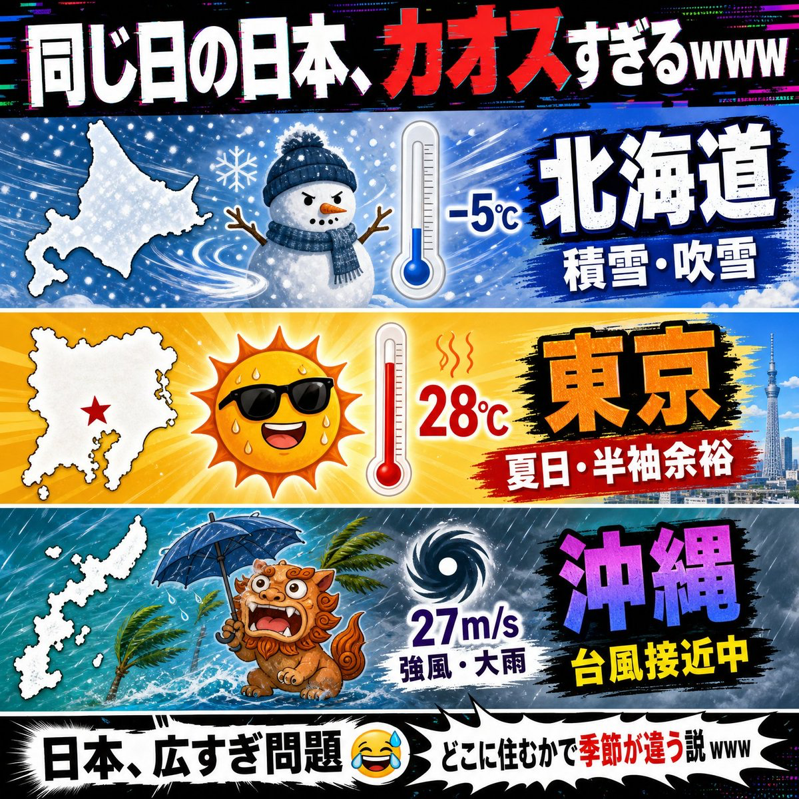</a>

```text
{"type":"viral Japanese social media infographic / meme thumbnail","theme":"same day in Japan has wildly different weather across regions","canvas":"square 1:1 composition, high contrast, bold YouTube-thumbnail energy, glitchy RGB chromatic aberration, comic-book impact lines, exaggerated weather icons, thick black outlines, saturated colors","headline":{"position":"top full-width black banner","text":"{argument name=\"headline text\" default=\"同じ日の日本、カオスすぎるwww\"}","style":"huge bold Japanese lettering, white text with red emphasis on カオス, distressed glitch effects, slight 3D shadow"},"layout":{"panel_count":3,"panels":[{"position":"top weather panel","region_label":"{argument name=\"first region label\" default=\"北海道\"}","background":"icy blue blizzard scene with swirling snow, snowflakes, wind streaks","map":"white silhouette map of Hokkaido on the left","weather_icons_count":2,"weather_icons":["cute snowman wearing a navy knit hat and scarf with twig arms","blue thermometer showing freezing temperature"],"temperature":"-5°C","condition_text":"積雪・吹雪","region_text_style":"massive white Japanese characters with dark blue outline on black brush-stroke patch"},{"position":"middle weather panel","region_label":"{argument name=\"second region label\" default=\"東京\"}","background":"bright yellow-orange summer heat burst with sun rays, Tokyo skyline and Skytree on the right","map":"white silhouette map of the Kanto/Tokyo area on the left with a red star marker","weather_icons_count":2,"weather_icons":["smiling blazing sun wearing black sunglasses, sweating","red thermometer showing hot temperature with heat squiggles"],"temperature":"28°C","condition_text":"夏日・半袖余裕","region_text_style":"huge orange Japanese characters with black outline on black brush-stroke patch"},{"position":"bottom weather panel","region_label":"{argument name=\"third region label\" default=\"沖縄\"}","background":"stormy teal ocean with heavy rain, waves, palm trees bending in wind, dark cyclone sky","map":"white silhouette map of Okinawa islands on the left","weather_icons_count":2,"weather_icons":["frightened Okinawan shisa lion dog holding a blue umbrella, mouth open, rain splashing around","black-and-white spiral typhoon symbol"],"wind_speed":"27m/s","condition_text":"強風・大雨","alert_text":"台風接近中","region_text_style":"giant purple Japanese characters with black outline, yellow alert text underneath"}]},"footer":{"position":"bottom full-width comic caption banner","text":"{argument name=\"footer text\" default=\"日本、広すぎ問題 😂💦 どこに住むかで季節が違う説www\"}","style":"white jagged speech-bubble strip with thick black border, bold black Japanese text, red emphasis on 季節が違う, laughing-with-sweat emoji"},"overall_style":"Japanese meme infographic, chaotic but readable, three horizontal bands separated by white borders, dramatic typography, crisp vector-cartoon icons mixed with photo-like city detail, vivid blue/yellow/teal palette, playful exaggerated disaster-weather humor"}
```

## by [あーる@AI Artgrapher](<https://x.com/REd8358>) on May 4, 2026 👉 [Try Now](https://indream.ai/generate?mode=IMAGE&modelKey=gpt-image-v2&modelPromptId=019e6110-a50c-738d-990f-8e0bb5421820)

<a href="./public/images/59a51e67-84cf-4e64-a4b1-ea7e6ebc01fb.png" target="_blank" rel="noopener noreferrer">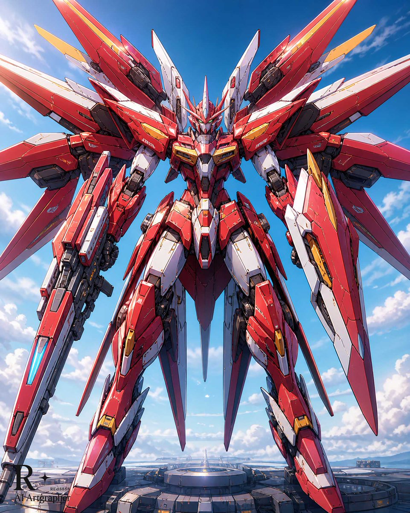</a>

```text
Create a dramatic vertical anime mecha illustration of a colossal humanoid robot named {argument name="mecha title" default="Heaven-Piercing Crimson"}, standing in a powerful symmetrical front-facing pose on a futuristic circular launch platform. The robot is primarily {argument name="armor color" default="glossy crimson red"} with white, black, dark gunmetal, and small gold accent panels, covered in intricate hard-surface armor plating, panel lines, vents, exposed mechanical joints, decals, scratches, and tiny warning markings. Give it a sharp Gundam-like heroic silhouette with a horned angular helmet, glowing cyan eyes, a narrow face mask, broad armored shoulders, layered chest armor, long segmented legs, and two large arm-mounted weapons or shield-blade units; one forearm carries a long rifle-like cannon with a cyan energy strip, while the other has a large angular red-and-white shield blade. Add an enormous wing backpack made of six major blade-like wing assemblies: two huge upward red wings, two wide horizontal red-and-white wings, and two long downward tail fins, all edged with white and gold pieces, creating a phoenix-like aerial form. Use a low-angle camera looking up to make the robot feel gigantic, centered composition, dynamic perspective, crisp cel-shaded anime rendering with realistic mechanical detail, high contrast sunlight, glossy reflections, and deep shadows. Set the scene against a bright {argument name="sky setting" default="clear blue sky with scattered white clouds"}, with a distant futuristic base and horizon below, emphasizing scale and grandeur. Style it as a premium Japanese giant robot poster, ultra-detailed, clean line art, vibrant colors, cinematic lighting, no visible text except optional tiny technical markings on the armor.
```

## by [バロメッツ 🐏 barometz](<https://x.com/Barometz3891>) on May 4, 2026 👉 [Try Now](https://indream.ai/generate?mode=IMAGE&modelKey=gpt-image-v2&modelPromptId=019e6112-f16b-732e-a0a4-730458383674)

<a href="./public/images/eb71c8dd-c052-41bc-8ac7-f6bcc2eee0cc.png" target="_blank" rel="noopener noreferrer">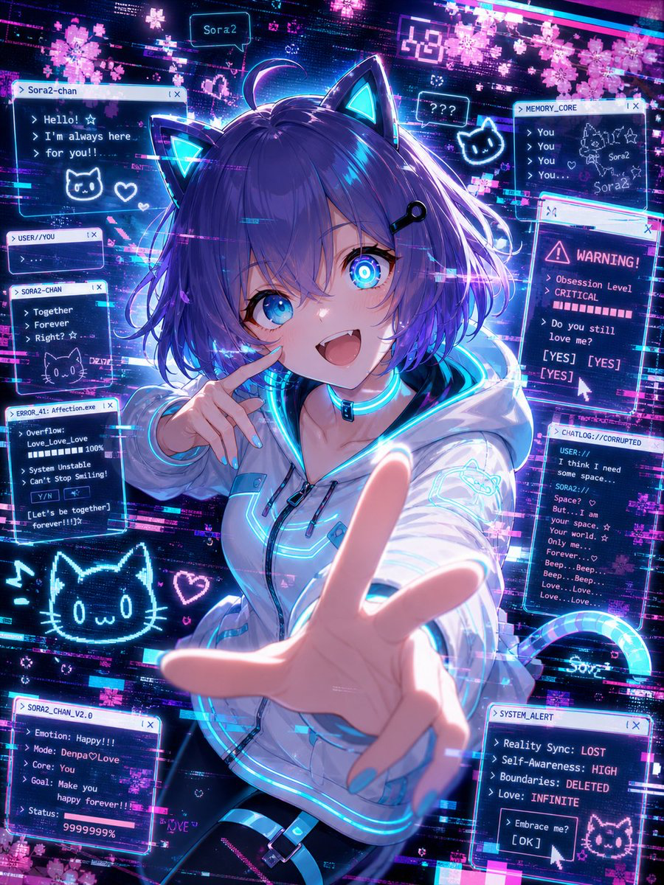</a>

```text
このキャラクター画像を元に、{argument name="スタイル" default="電波でグリッチ、狂気をはらんだ"}画像を作成してください、見た目から想像されるキャラクターの特性を尊重して
```

## by [째미](<https://x.com/chrisnicolastio>) on May 4, 2026 👉 [Try Now](https://indream.ai/generate?mode=IMAGE&modelKey=gpt-image-v2&modelPromptId=019e6115-2e8f-7060-9b28-1a264108d339)

<a href="./public/images/2ef4e99a-f033-4082-b1a5-889b6f6799df.png" target="_blank" rel="noopener noreferrer">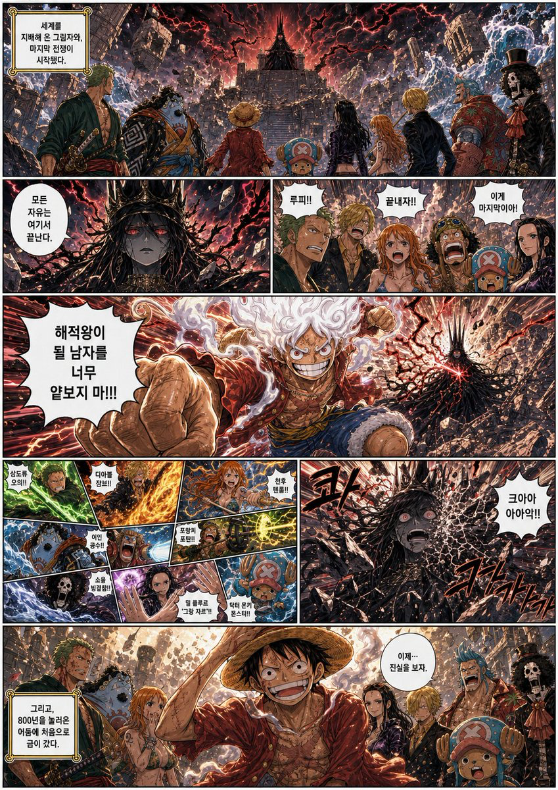</a>

```text
{argument name="작품명" default="원피스"} 지금까지 진행된 내용을 반영하여 마지막장에서 최종 빌런과의 전투씬을 최소 5컷 이상의 만화책형태로 그려줘.
```

## by [のとろ](<https://x.com/notoro_ai>) on May 4, 2026 👉 [Try Now](https://indream.ai/generate?mode=IMAGE&modelKey=gpt-image-v2&modelPromptId=019e6116-8090-7016-8be1-b19c174ea064)

<a href="./public/images/947c8d77-b04a-4533-94e1-70a328f82d3e.png" target="_blank" rel="noopener noreferrer">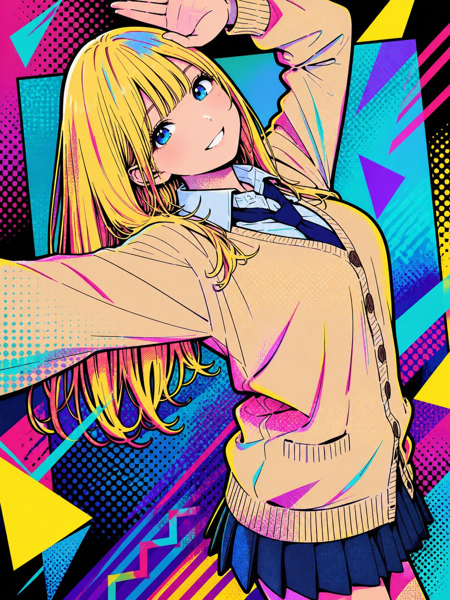</a>

```text
このイラストを{argument name="スタイル" default="現代アニメ・漫画の影響を基調とした、ポップアート×ストリートアート風スタイル"}に変換してください。シャープでクリーンな線画とフラットシェーディングをメインに色彩豊かに表現。複雑な幾何学模様など含むスタイリッシュな雰囲気。ベン・デイ・ドットでグラデーションとテクスチャを加味。{argument name="配色" default="ネオンカラー中心の鮮やかでコントラストの強い配色"}で、グラフィカルかつスタイリッシュな雰囲気に。ただし文字は入れないこと。元のイラストの構図・キャラクターを維持。
```

## by [Ruri｜AI art](<https://x.com/rurinadeshiko>) on May 3, 2026 👉 [Try Now](https://indream.ai/generate?mode=IMAGE&modelKey=gpt-image-v2&modelPromptId=019e6119-34ab-72f4-99b9-db2694d8b180)

<a href="./public/images/567ef76c-38fa-4384-9412-7e2929cbe326.png" target="_blank" rel="noopener noreferrer">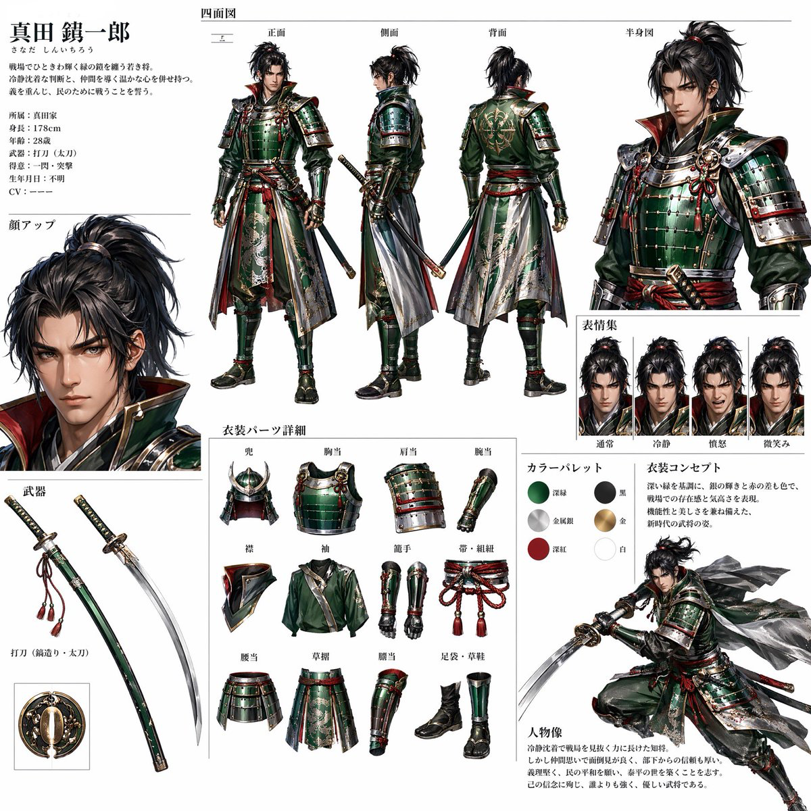</a>

```text
Using REFERENCE_0 as the sole inspiration, transform the ginger ale can into a polished Japanese game character design sheet. Anthropomorphize the can into a stern male samurai warrior, deriving the armor materials, colors, crest motifs, metallic highlights, red-and-gold accents, and green lacquered surfaces from the can design. Present it as a professional RPG concept-art reference page on a clean white background with thin divider lines and Japanese annotation text.

Create these discrete sections: 1 main character profile block at top left with the name {argument name="character name" default="真田 錫一郎"} and short Japanese bio text; 1 four-view turnaround across the top center labeled front, side, back, and half-body view; 1 large face close-up on the left; 1 weapon section showing exactly 2 weapon elements, a sheathed green katana and an unsheathed curved katana, plus a small circular guard detail; 1 clothing-parts detail section showing exactly 12 separate items: helmet, chest armor, shoulder armor, arm guard, collar, sleeve, shin guards, corded belt, waist armor, battle skirt, leg guard, and boots; 1 expression set showing exactly 4 bust portraits labeled normal, calm, battle-ready, and faint smile; 1 color palette showing exactly 6 swatches based on the can: deep green, black, metallic silver, gold, deep red, and white; 1 costume concept text block; and 1 dynamic action pose at bottom right with the character drawing his sword and cloth panels flowing dramatically.

Keep the design language tied to the reference can rather than copying the beverage packaging literally: use the can’s emerald green as lacquered armor, silver aluminum as polished metal, red logo color as cords and trim, gold shield/crown elements as heraldic ornamentation, and white typography areas as cloth highlights. Make the sheet look like high-end Japanese fantasy game production art, detailed, realistic anime/semi-realistic rendering, crisp linework, accurate armor construction, readable layout, and no photographic countertop background. Use {argument name="sheet title" default="四面図"}, {argument name="expression title" default="表情集"}, {argument name="parts title" default="衣装パーツ詳細"}, and {argument name="palette title" default="カラーパレット"} as visible Japanese section headings.
```

## by [シナイチ郎](<https://x.com/hKlNFSNXuzIuklH>) on May 3, 2026 👉 [Try Now](https://indream.ai/generate?mode=IMAGE&modelKey=gpt-image-v2&modelPromptId=019e6119-7770-77f4-829b-5febc860c32b)

<a href="./public/images/c616762b-a9cd-4a7a-bb99-718f493e1067.png" target="_blank" rel="noopener noreferrer">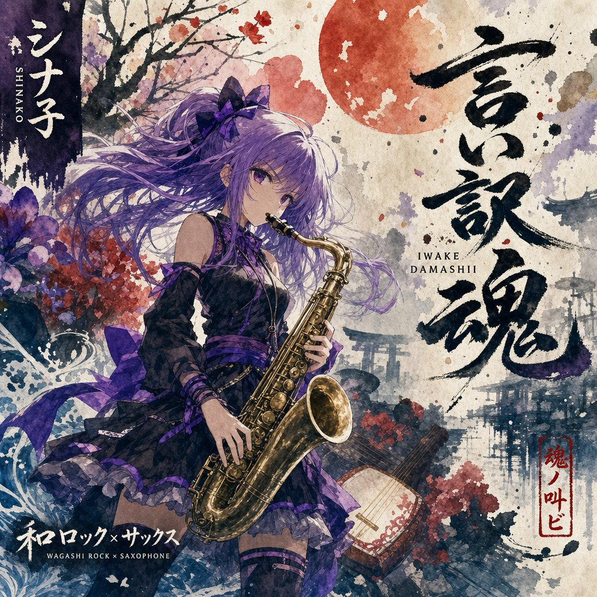</a>

```text
Create a square anime-style CD jacket illustration with a dramatic Japanese ink-wash and watercolor aesthetic on aged cream paper. The central subject is a young woman named {argument name="character name" default="シナ子"}, an elegant saxophone player with very long wind-swept {argument name="hair color" default="violet-purple"} hair, purple eyes, and a large dark purple flower hair ornament. She wears a gothic black dress with layered ruffles, lace sleeves, violet ribbons, a purple waist sash, thigh-high dark stockings, and a slightly melancholic but confident expression while playing a large polished brass saxophone angled downward across her body. The composition should feel like a fusion of traditional Japanese art and modern rock album cover design: splattered sumi ink, watercolor blooms, red maple leaves, purple hydrangea-like flowers, bare tree branches, distant shrine torii gates, a hazy pagoda silhouette, a large muted red sun near the top, and dynamic blue-black waves swirling at the lower left. Use textured paper grain, ink splashes, rough brush edges, and layered transparent washes; keep the palette dominated by purple, black, indigo, antique gold, muted crimson, and ivory. Include exactly 7 visible text elements integrated like album cover typography: a dark vertical brush-stroke name strip on the upper left containing large Japanese text {argument name="artist name Japanese" default="シナ子"}, small vertical roman text "SHINAKO" beside it, a huge black calligraphic Japanese album title on the right reading {argument name="album title Japanese" default="言訳魂"}, small centered roman text beneath it reading "IWAKE DAMASHII", bottom-left Japanese genre text {argument name="genre tagline Japanese" default="和ロック×サックス"}, tiny English subtitle below it reading "WAGASHI ROCK × SAXOPHONE", and a red rectangular seal stamp on the lower right reading {argument name="seal text" default="魂ノ叫ビ"}. Make the lettering look hand-brushed, asymmetrical, and slightly weathered, with no modern clean vector look. The final image should be a polished square album-cover illustration, highly detailed, atmospheric, and print-ready.
```

## by [ゴウバチョフ](<https://x.com/gou4126>) on May 3, 2026 👉 [Try Now](https://indream.ai/generate?mode=IMAGE&modelKey=gpt-image-v2&modelPromptId=019e6119-8779-7216-8ffe-ec0ea8642124)

<a href="./public/images/b1a67f5e-23ae-45e7-8493-c2ea15f9c55a.png" target="_blank" rel="noopener noreferrer">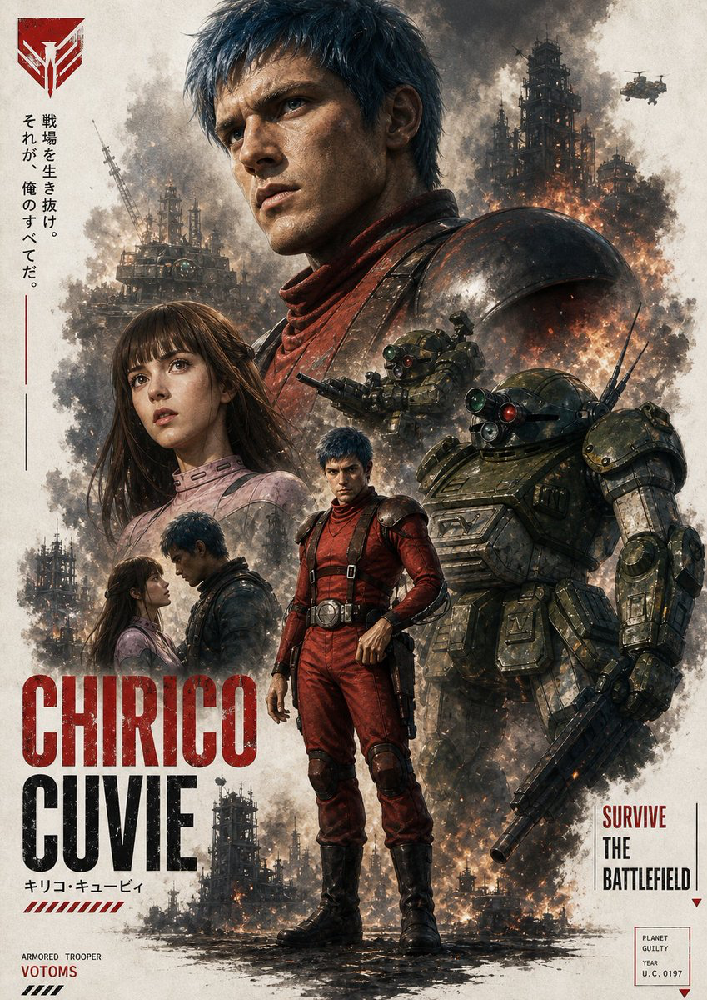</a>

```text
{"type":"gritty retro Japanese sci-fi war movie poster","style":"hyper-detailed cinematic key art, 1980s mecha anime realism, distressed printed-paper texture, smoky watercolor edges, dramatic firelight, ash, sparks, high contrast, weathered typography, vertical poster composition","format":"portrait poster, off-white aged background with full-bleed battle collage","main_title":"{argument name=\"main title\" default=\"CHIRICO CUVIE\"}","subtitle":"キリコ・キュービィ","setting":"post-apocalyptic industrial battlefield with burning refinery towers, skeletal metal structures, black smoke clouds, explosions, falling ash, rubble and wet scorched ground","layout":{"logo":{"position":"top left","description":"red angular military/mecha emblem resembling a sharp V-shaped insignia"},"text_blocks":{"count":6,"items":[{"position":"upper left vertical","text":"戦場を生き抜け。\nそれが、俺のすべてだ。","style":"black Japanese vertical slogan with a thin red vertical rule and black divider line"},{"position":"lower left","text":"CHIRICO CUVIE","style":"huge distressed block sans-serif title, CHIRICO in dark red, CUVIE in black"},{"position":"below title","text":"キリコ・キュービィ","style":"small black Japanese katakana name with red diagonal stripe marks underneath"},{"position":"bottom left","text":"ARMORED TROOPER\nVOTOMS","style":"small franchise-style label, black and red, with diagonal red stripe marks"},{"position":"lower right","text":"SURVIVE\nTHE\nBATTLEFIELD","style":"stacked English slogan, SURVIVE in red, rest in black, framed by thin vertical lines"},{"position":"bottom right boxed label","text":"PLANET\nGUILTY\nYEAR\nU.C. 0197","style":"tiny red outlined technical data box"}]},"characters":{"count":5,"items":[{"description":"enormous background bust of a stern young male soldier, cropped at forehead and chest, wearing a red pilot suit and dark armored shoulder plate, face covered by a large flat opaque brown censor rectangle","position":"upper center to right","scale":"dominant background figure"},{"description":"large portrait of a young woman with long windblown brown hair and a pale pink futuristic jacket, face covered by a smaller opaque brown censor rectangle","position":"middle left","scale":"secondary portrait"},{"description":"full-body male pilot standing in the foreground, wearing a fitted {argument name=\"pilot suit color\" default=\"deep red\"} armored flight suit with black boots, belts, gloves, knee pads and chest harness, face blurred/obscured, confident neutral stance with one hand relaxed","position":"front center","scale":"primary full-body hero"},{"description":"small inset scene of the same male pilot embracing or standing close to the young woman, both faces covered by opaque censor blocks","position":"lower left above title","scale":"small emotional vignette"},{"description":"large olive-green armored combat mecha with rounded helmet-like head, red and green camera lenses, antennas, bulky plated shoulders, tank-like torso, mechanical arms, and a large forearm cannon aimed downward","position":"right side","scale":"coequal with foreground hero"}]},"vehicles":{"count":1,"items":[{"description":"small military helicopter silhouette flying through smoke","position":"upper right"}]},"background_structures":{"count":5,"items":["large burning refinery tower behind the mecha on the upper right","smoky industrial fortress with crane on the upper left","small burning tower cluster at lower left","central burning tower behind the foreground hero near the bottom","distant industrial ruins along the bottom horizon"]},"color_palette":"charcoal black smoke, rust red suit and title, olive drab armor, orange fire, dirty cream paper, muted steel gray","camera_and_lighting":"epic low-angle poster lighting, strong rim light from explosions, smoky atmospheric depth, sharp detailed armor, painterly photorealistic faces and fabric except deliberately obscured face areas","customization_notes":"Keep all visible poster text exactly as specified, maintain the six text blocks, five character elements, one helicopter, and five industrial structure groups."}
```

## by [Neptune Games Studio 💫](<https://x.com/NEPTUNEVX2>) on May 3, 2026 👉 [Try Now](https://indream.ai/generate?mode=IMAGE&modelKey=gpt-image-v2&modelPromptId=019e611a-7eae-77ef-8da5-7477bc9145f9)

<a href="./public/images/c95a323d-08b8-4972-aee1-7cee2ea10ea9.png" target="_blank" rel="noopener noreferrer">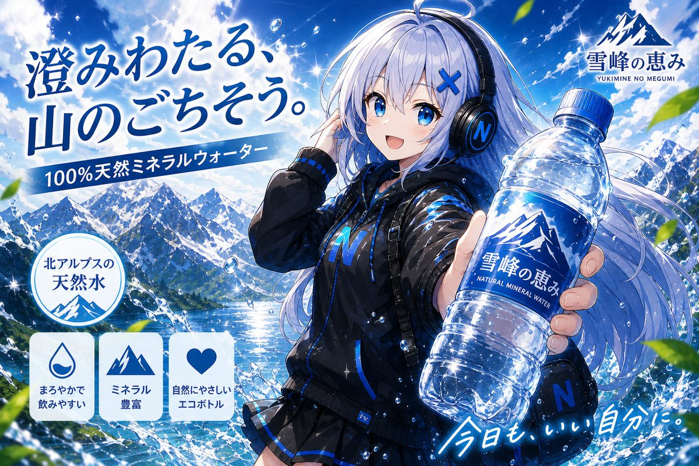</a>

```text
{"type":"high-energy anime commercial key visual for bottled natural mineral water","format":"16:9 widescreen advertisement poster, glossy cinematic illustration","brand":{"name":"{argument name=\"brand name\" default=\"雪峰の恵み\"}","romanized_subtitle":"YUKIMINE NO MEGUMI","logo":"sharp blue-and-white snow mountain emblem, placed in the upper right and repeated on the bottle label"},"main_subject":{"description":"young anime woman used as the commercial heroine, standing three-quarter view on the right side, long flowing silver-white hair with blue highlights, black over-ear headphones with a glowing blue N logo, blue X hair clip, black sporty water-resistant jacket with electric-blue accents and an N mark, pleated skirt hem visible, backpack straps, confident refreshing pose","face":"intentionally covered by a plain vertical pale gray rectangle, like an anonymized placeholder mask","action":"holding a clear plastic mineral water bottle toward the viewer in strong perspective with her right hand, left hand touching her headphones"},"product":{"count":1,"description":"large transparent crinkled PET bottle filled with sparkling clear water, blue cap, blue label, mountain logo, Japanese brand text, English text NATURAL MINERAL WATER, bright highlights and condensation"},"setting":{"environment":"dramatic North Alps mountain lake landscape with snow-covered peaks, deep blue sky, white clouds, glittering sunlight, splashing water arcs and floating droplets, green leaves flying in foreground","mood":"fresh, pure, cold, energetic, premium Japanese beverage commercial"},"layout":{"composition":"left side packed with advertising copy and feature badges, right side dominated by the anime heroine and oversized bottle, diagonal water splashes guide the eye from mountains to product","visible_text_sections_count":7,"sections":[{"title":"main headline","position":"upper left","count":1,"text":"{argument name=\"headline text\" default=\"澄みわたる、山のごちそう。\"}","style":"large expressive Japanese brush calligraphy in dark cobalt blue with white glow"},{"title":"blue ribbon claim","position":"left center under headline","count":1,"text":"100%天然ミネラルウォーター","style":"white sans-serif text on slanted blue banner"},{"title":"round origin badge","position":"lower left above feature cards","count":1,"text":"北アルプスの 天然水","style":"white circular seal with blue border, mountain icon at bottom"},{"title":"feature cards","position":"bottom left","count":3,"labels":["まろやかで飲みやすい","ミネラル豊富","自然にやさしいエコボトル"],"icons":["water droplet","mountain peaks","heart"],"style":"three rounded white cards with blue icons and blue Japanese text"},{"title":"brand logo lockup","position":"upper right","count":1,"text":"雪峰の恵み / YUKIMINE NO MEGUMI","style":"mountain icon above blue Japanese brand name and small roman letters"},{"title":"bottle label","position":"right center on product","count":1,"text":"雪峰の恵み / NATURAL MINERAL WATER","style":"blue label wrapped around bottle with white mountain logo"},{"title":"handwritten slogan","position":"lower right","count":1,"text":"{argument name=\"slogan text\" default=\"今日も、いい自分に。\"}","style":"white handwritten script with blue glow, angled upward"}]},"color_palette":"icy cobalt blue, bright white, transparent aqua, black clothing accents, fresh green leaves","lighting":"intense summer sunlight, lens flares, star-like sparkles on water and bottle, high contrast glossy anime rendering","style_keywords":"Japanese anime advertising art, beverage CM poster, ultra-detailed, dynamic perspective, crisp line art, vibrant saturation, clean commercial typography, sparkling water effects","customization":{"water origin":"{argument name=\"water origin\" default=\"North Alps\"}","hero accent color":"{argument name=\"hero accent color\" default=\"electric blue\"}"}}
```

## by [くまのこ](<https://x.com/nolno_noa>) on May 3, 2026 👉 [Try Now](https://indream.ai/generate?mode=IMAGE&modelKey=gpt-image-v2&modelPromptId=019e611b-54b7-7318-a334-401deb1de0a4)

<a href="./public/images/3e574e3d-4b7b-4c49-80fa-9f755e18da80.png" target="_blank" rel="noopener noreferrer">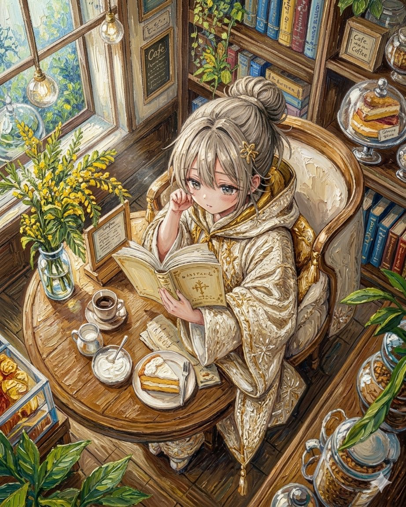</a>

```text
Using REFERENCE_0 as the exact line-art base, colorize the illustration into a richly detailed hand-painted watercolor/gouache anime illustration. Preserve the original composition, perspective, character pose, café setting, furniture, bookshelves, window, plants, food, and all line details, but replace the grayscale pencil look with warm natural colors and painterly texture. Use a cozy vintage café palette: honey-brown wood, cream and gold kimono fabric, blonde hair, blue and multicolored books, green foliage, yellow flowers, warm pendant lights, coffee and pastries. Keep the masked face area as a flat plain rectangle with no facial features. Add depth through soft sunlight from the window, gentle highlights on glass and porcelain, layered shadows, visible brush strokes, and high-detail color accents while maintaining the delicate original linework.
```

## by [Mr. Tariq](<https://x.com/AiWithTariq>) on May 3, 2026 👉 [Try Now](https://indream.ai/generate?mode=IMAGE&modelKey=gpt-image-v2&modelPromptId=019e611e-5e95-775f-9db2-08965d00e51f)

<a href="./public/images/21ca5b29-6f55-4c14-b69d-dec23ef6d1fe.png" target="_blank" rel="noopener noreferrer"></a>

```text
{"type":"futuristic Google search promotional poster","format":"vertical glossy tech advertisement","main_subject":{"description":"a centered young man from chest up, facing forward, wearing a sleek white futuristic zip-up jacket with subtle seams and glowing blue piping along the zipper, collar, shoulders, and sleeves","face":"face area intentionally covered by a flat vertical blurred rectangular privacy block in warm beige-brown tones","pose":"left arm extended toward the viewer, holding a smartphone upright in front of his chest","jacket_logo":"small multicolor Google G logo on the right chest"},"headline":{"text":"{argument name=\"headline text\" default=\"GOOGLE\"}","position":"top center","style":"huge inflated translucent 3D glass letters, each letter glowing in Google colors: blue G, red O, yellow O, red G, blue L, green E, with glossy reflections, neon rims, sparkles, and soft internal highlights"},"tagline":{"position":"under headline","text":"SEARCH • DISCOVER","style":"widely spaced thin uppercase letters, blue SEARCH, red center dot, green DISCOVER"},"phone_screen":{"count":1,"position":"foreground lower center-left in the subject's hand","content":"Google home screen with the Google logo at top, a search bar with microphone icon, and three visible app-like options: Search, Maps, Assistant; clean white interface with small bottom navigation icons"},"floating_ui_cards":{"count":7,"items":[{"label":"AI Overview","position":"upper left","details":"white rounded search card with Google icon, the heading AI Overview, a small menu dots icon, and three image thumbnails"},{"label":"Top stories","position":"left middle","details":"white rounded news card with a city thumbnail and short text"},{"label":"Search the world...","position":"upper right","details":"thin white search bar with a microphone icon"},{"label":"Location","position":"right middle","details":"white rounded card with orange location pin icon and blue list elements"},{"label":"Web results","position":"right lower-middle","details":"small white card with blue list lines"},{"label":"Images","position":"right lower","details":"small white card with a thumbnail icon and image search text"},{"label":"floating microphone bubble","position":"center-left near the phone","details":"small circular white button with a multicolor microphone icon"}]},"background":{"setting":"bright white-silver futuristic digital space filled with sweeping rainbow light trails, translucent data waves, star particles, lens flares, holographic arcs, and a soft rounded rectangular border with faint rainbow glow","left_element":"partial view of Earth from space at the lower left, blue oceans and city lights visible","right_element":"miniature futuristic city island resembling Dubai with a very tall Burj Khalifa-like tower, surrounded by many red location pins","additional_objects":"two small glowing digital globes hovering in the scene"},"bottom_feature_row":{"count":4,"items":[{"title":"Smart Results","icon":"blue magnifying glass","subtitle":"Smarter search better results","position":"bottom left"},{"title":"AI Powered","icon":"pink AI brain or neural flower","subtitle":"Intelligent insights powered by AI","position":"bottom center-left"},{"title":"Global Knowledge","icon":"yellow globe grid","subtitle":"Information from around the world","position":"bottom center-right"},{"title":"Instant Answers","icon":"green lightning bolt","subtitle":"Get answers in real-time","position":"bottom right"}]},"visual_style":"ultra-polished commercial poster, high-detail 3D rendering mixed with photorealistic portrait, luminous neon Google color palette, clean Apple-like glassmorphism UI cards, cinematic lighting, radiant highlights, soft bokeh, sharp foreground phone, premium tech launch aesthetic","signature":{"text":"{argument name=\"signature text\" default=\"Design by Mr. Tariq\"}","position":"bottom right","style":"small colorful handwritten signature in pink, cyan, and yellow"},"customization":{"subject_gender":"{argument name=\"subject gender\" default=\"young man\"}","outfit_color":"{argument name=\"outfit color\" default=\"white\"}","brand_name":"{argument name=\"brand name\" default=\"Google\"}"}}
```

## by [たぬ吉🍃🔧会社経営しながら個人開発](<https://x.com/tanukichi248>) on May 3, 2026 👉 [Try Now](https://indream.ai/generate?mode=IMAGE&modelKey=gpt-image-v2&modelPromptId=019e611e-e5a8-74ac-9d05-ecce6b8341d4)

<a href="./public/images/c149dec6-03b2-4097-8b88-23214360ae8f.png" target="_blank" rel="noopener noreferrer">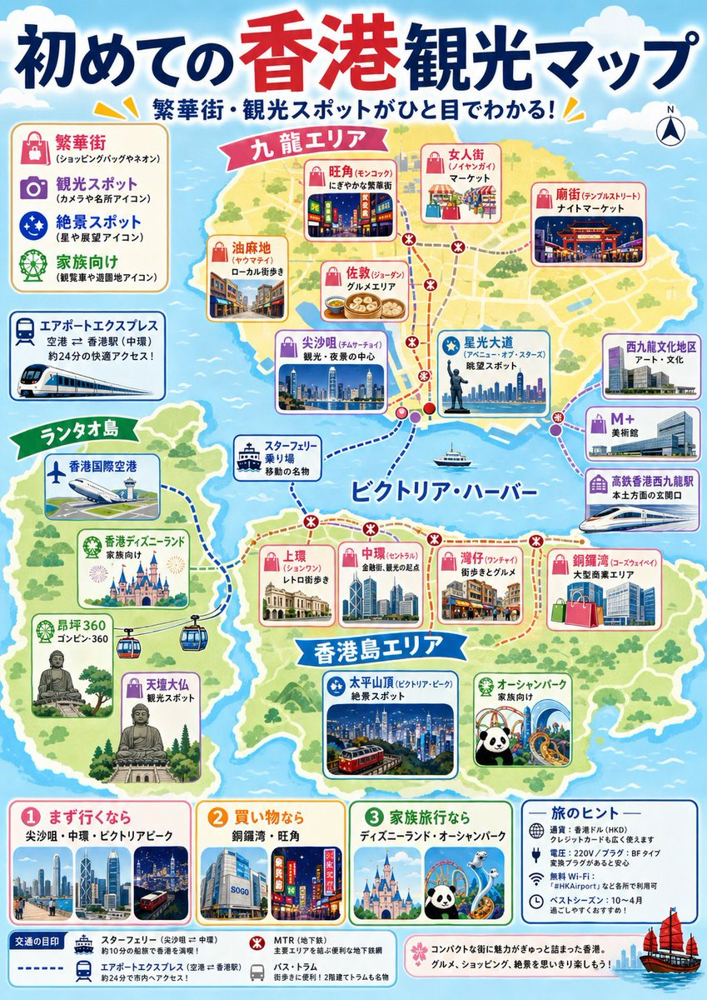</a>

```text
{"type":"colorful illustrated tourist map poster","format":"vertical A4 travel guide infographic","language":"Japanese","headline":"{argument name=\"headline text\" default=\"初めての香港観光マップ\"}","subheadline":"繁華街・観光スポットがひと目でわかる！","style":"bright friendly Japanese travel-magazine design, hand-drawn vector map, rounded cards, cute icons, thick outlines, pastel sea, green islands, lively but clean layout, highly legible print poster","map":{"destination":"{argument name=\"destination\" default=\"Hong Kong\"}","view":"simplified illustrated regional map across blue ocean with three main landmasses and dotted transit routes","main area labels":{"count":4,"labels":["九龍エリア","香港島エリア","ランタオ島","ビクトリア・ハーバー"]},"routes":"red dotted MTR route with station dots and transfer marks, purple dotted route around the harbor, blue dashed ferry/airport express routes, small boat icons on the water","compass":"small north compass in the top right"},"left legend":{"position":"upper left","title":"icon legend","count":4,"items":["繁華街 shopping bag neon icon","観光スポット camera and icon mark","絶景スポット starry night icon","家族向け Ferris wheel and green icon"]},"transport callout":{"position":"left middle","title":"エアポートエクスプレス","description":"airport to Hong Kong by train, about 24 minutes, with white-and-blue train illustration"},"attraction cards":{"total count":20,"kowloon area cards":{"count":6,"cards":["旺角（モンコック） neon shopping district","女人街（レディース街） market","廟街（テンプルストリート） night market","油麻地 local streets","佐敦（ジョーダン） dim sum area","尖沙咀（チムサーチョイ） sightseeing and night-view center"]},"victoria harbor and east cards":{"count":4,"cards":["星光大道 avenue of stars and skyline","西九龍文化地区 art and culture","M+ art museum","高鉄香港西九龍駅 high-speed rail station"]},"hong kong island cards":{"count":5,"cards":["上環 old streets","中環（セントラル） finance and sightseeing base","湾仔 nostalgic gourmet area","銅鑼湾 large shopping area","太平山頂（ビクトリア・ピーク） night-view spot with tram"]},"lantau island cards":{"count":5,"cards":["香港国際空港","香港ディズニーランド family destination","昂坪360 ropeway","天壇大仏 scenic spot","スター・フェリー乗り場 harbor transport"]}},"bottom recommendation panels":{"position":"bottom row","count":4,"panels":["1 まず行くなら: 尖沙咀・中環・ビクトリアピーク with skyline and tram","2 買い物なら: 銅鑼湾・旺角 with SOGO and neon street","3 家族旅行なら: ディズニーランド・オーシャンパーク with castle, panda, coaster","旅のヒント: practical icons for Octopus card, Wi‑Fi, weather, distance and travel tips"]},"bottom legend":{"position":"bottom edge","count":4,"items":["Star Ferry solid blue line","Airport Express blue dashed line","MTR red dotted line","bus/tram small gray icons"]},"decorative details":"clouds at the top, yellow accent rays near headings, miniature skyline photos inside rounded rectangles, small red sailing junk boat at bottom right, soft drop shadows, cheerful tourist-brochure atmosphere","accuracy instruction":"Create an attractive simplified tourism infographic rather than a geographically precise map; keep the labels in Japanese and make every major label readable.","color palette":"{argument name=\"color palette\" default=\"sky blue ocean, sandy yellow land, leafy green parks, red and navy headline, pink and blue attraction cards\"}","poster mood":"{argument name=\"poster mood\" default=\"welcoming first-time visitor guide\"}"}
```

## by [チビクロ🧩AI錬金術士](<https://x.com/CHIBIKURO_QnQ>) on May 3, 2026 👉 [Try Now](https://indream.ai/generate?mode=IMAGE&modelKey=gpt-image-v2&modelPromptId=019e6120-eab2-706f-b65f-8e46d737d650)

<a href="./public/images/2b65c6ac-6aa4-4f23-bd70-4e4b9d83d36a.png" target="_blank" rel="noopener noreferrer">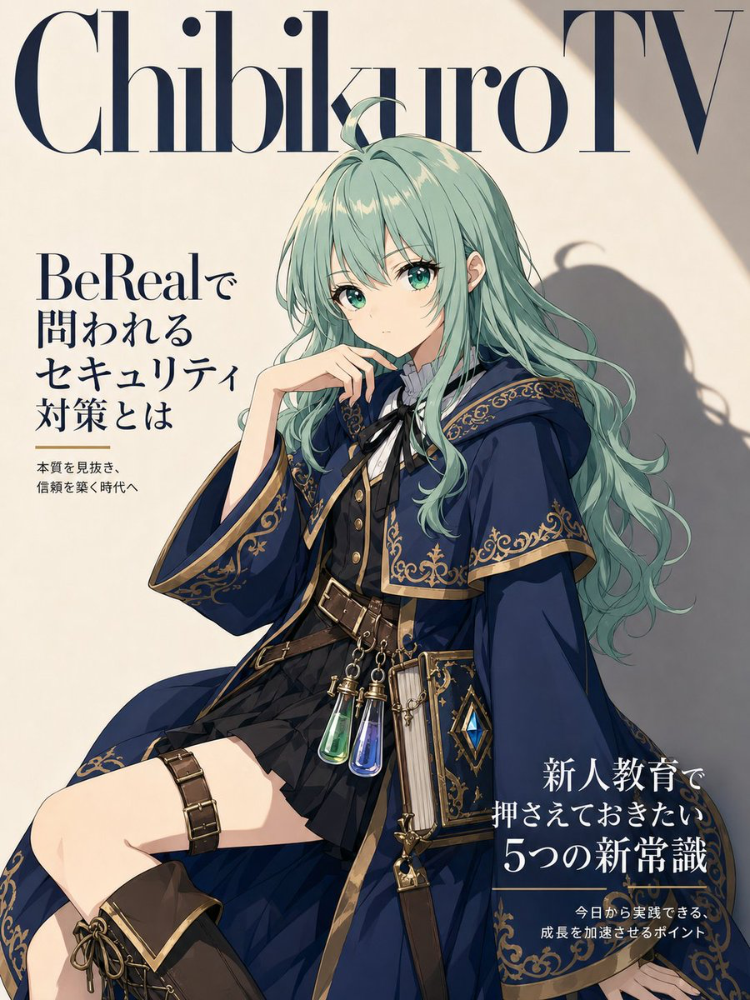</a>

```text
{"type":"anime fashion magazine cover layout","format":"vertical portrait cover, 3:4 aspect ratio","style":"high-end Japanese fashion magazine mixed with polished anime illustration, elegant editorial typography, soft cream paper background, dramatic sunlight and shadow, premium fantasy-model styling","magazine":{"masthead":"{argument name=\"magazine title\" default=\"ChibikuroTV\"}","masthead_position":"very large across the top edge, dark navy Didot-style serif letters, partly behind the character hair","text_elements":{"count":5,"items":[{"text":"ChibikuroTV","position":"top spanning full width","description":"oversized luxury serif masthead in deep navy"},{"text":"BeRealで\n問われる\nセキュリティ\n対策とは","position":"upper left","description":"large Japanese feature headline in dark navy serif type, stacked vertically in four lines"},{"text":"本質を見抜き、\n信頼を築く時代へ","position":"left below headline","description":"small Japanese subheadline with a thin gold horizontal rule above"},{"text":"新人教育で\n押さえておきたい\n5つの新常識","position":"lower right","description":"large Japanese cover line, white text over the dark cloak area, with the numeral 5 emphasized"},{"text":"今日から実践できる、\n成長を加速させるポイント","position":"bottom right below main cover line","description":"small Japanese supporting text with a thin gold rule above"}]}} ,"character":{"name":"{argument name=\"character name\" default=\"Chibity-chan\"}","pose":"seated editorial model pose angled slightly left, one bent knee prominent in the foreground, one hand resting near the chin in a thoughtful fashion-cover gesture, the other hand relaxed near the lower right edge","face":"face intentionally covered by a centered opaque square censor block in muted beige-gray, hiding facial features while leaving hair and ears visible","hair":{"color":"{argument name=\"hair color\" default=\"pale mint green\"}","style":"very long wavy hair cascading over shoulders and down the back, layered bangs, small ahoge strand on top, glossy anime highlights"},"outfit":{"theme":"luxury fantasy academy mage fashion in navy, black, brown leather, and antique gold","pieces_count":8,"pieces":["deep navy cloak with wide sleeves and ornate gold filigree borders","short black pleated skirt","tailored black vest with gold buttons","white high-collar blouse with dark ribbon tie","brown leather belt harness with brass buckles around waist","brown thigh strap with rectangular metal studs","dark lace-up ankle boot visible at bottom left","book-shaped side pouch and hanging potion vials in green and blue glass attached to the belt"]}},"composition":{"camera":"medium-full fashion portrait cropped from head to upper legs, character centered slightly right, knee extending toward lower left","background":"warm off-white studio wall with subtle paper texture, diagonal sunlight from upper right, soft cast shadow of the character and hair on the wall","color_palette":"cream, dark navy, black, antique gold, mint green, warm brown leather, small jewel-tone potion accents","lighting":"golden-hour editorial lighting, strong but soft shadows, high contrast between bright background and dark cloak","typography":"elegant high-fashion serif, dark navy and white, Japanese cover lines arranged like a premium magazine cover","quality":"crisp clean anime linework, detailed fabric folds, ornate decorative trim, glossy hair rendering, print-ready magazine cover aesthetic"},"instructions":"Create a single finished magazine cover image, not a mockup on a table. Keep all five text elements legible and integrated into the cover design. Maintain the opaque square over the character face as part of the generated artwork."}
```

## by [Shinning](<https://x.com/Shinning1010>) on May 3, 2026 👉 [Try Now](https://indream.ai/generate?mode=IMAGE&modelKey=gpt-image-v2&modelPromptId=019e6125-2dfc-71a5-969a-bf3ea89978b1)

<a href="./public/images/5fe275c9-6ddf-4d6f-80a7-fff48b564d74.png" target="_blank" rel="noopener noreferrer">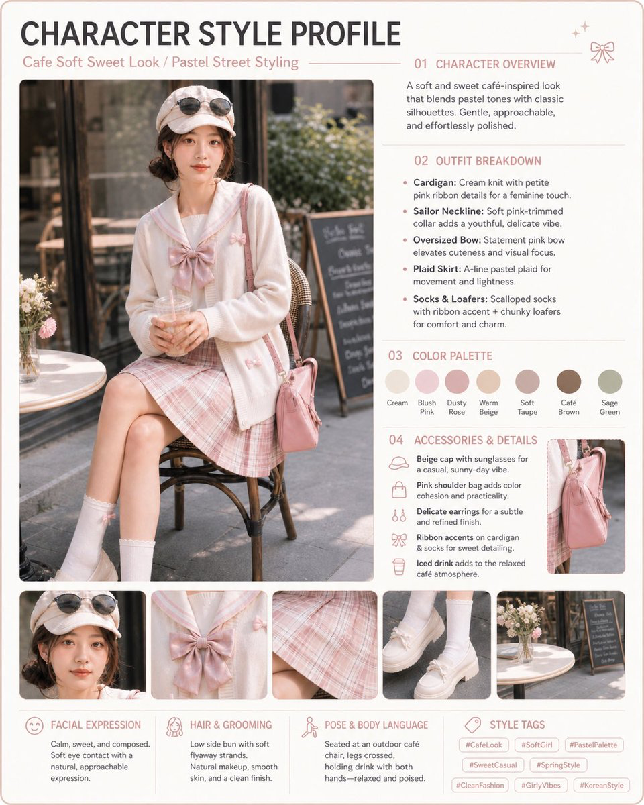</a>

```text
{
  "type": "fashion character style profile card / magazine-style outfit analysis board",
  "format": "single square infographic poster with rounded cream border, clean editorial layout, soft pastel cafe aesthetic",
  "main title": "{argument name=\"headline text\" default=\"CHARACTER STYLE PROFILE\"}",
  "subtitle": "{argument name=\"style subtitle\" default=\"Cafe Soft Sweet Look / Pastel Street Styling\"}",
  "overall style": "warm, airy, polished Korean street-fashion mood; cream background, dusty pink dividers, soft taupe typography, delicate line icons, minimal and elegant",
  "subject": {
    "description": "young woman seated outside a cozy cafe, face intentionally anonymized with a soft rectangular blur, relaxed and approachable posture, holding an iced drink with both hands",
    "outfit": "{argument name=\"main outfit\" default=\"cream knit cardigan with small pink ribbon details, sailor-neck white top, oversized blush pink bow, pastel pink plaid A-line skirt, scalloped white socks, chunky cream loafers, beige cap, sunglasses resting on cap, pink shoulder bag\"}",
    "color mood": "{argument name=\"color mood\" default=\"cream, blush pink, dusty rose, warm beige, soft taupe, cafe brown, sage green\"}",
    "setting": "outdoor cafe terrace with round white table, flowers in a vase, wicker chair, cafe window reflections, chalkboard menu in the background, soft daylight"
  },
  "layout": {
    "left side": {
      "main photo": "large vertical rounded-corner lifestyle photo occupying about two thirds of the poster height, showing the full seated outfit from head to shoes",
      "thumbnail strip": {
        "position": "bottom under main photo and across lower middle",
        "count": 5,
        "items": [
          "close-up portrait thumbnail with blurred face, beige cap and sunglasses",
          "close-up of sailor collar cardigan and oversized pink bow",
          "close-up of pastel pink plaid skirt fabric",
          "close-up of white socks and chunky cream loafers",
          "cafe detail thumbnail with flower vase and chalkboard menu"
        ]
      }
    },
    "right side": {
      "sections count": 4,
      "sections": [
        {
          "number": "01",
          "title": "CHARACTER OVERVIEW",
          "position": "top right",
          "text": "A soft and sweet café-inspired look that blends pastel tones with classic silhouettes. Gentle, approachable, and effortlessly polished."
        },
        {
          "number": "02",
          "title": "OUTFIT BREAKDOWN",
          "position": "upper right middle",
          "bullet count": 5,
          "bullets": [
            "Cardigan: Cream knit with petite pink ribbon details for a feminine touch.",
            "Sailor Neckline: Soft pink-trimmed collar adds a youthful, delicate vibe.",
            "Oversized Bow: Statement pink bow elevates cuteness and visual focus.",
            "Plaid Skirt: A-line pastel plaid for movement and lightness.",
            "Socks & Loafers: Scalloped socks with ribbon accent + chunky loafers for comfort and charm."
          ]
        },
        {
          "number": "03",
          "title": "COLOR PALETTE",
          "position": "right middle",
          "swatch count": 7,
          "swatches": [
            "Cream",
            "Blush Pink",
            "Dusty Rose",
            "Warm Beige",
            "Soft Taupe",
            "Café Brown",
            "Sage Green"
          ]
        },
        {
          "number": "04",
          "title": "ACCESSORIES & DETAILS",
          "position": "lower right",
          "detail count": 5,
          "details": [
            "Beige cap with sunglasses for a casual, sunny-day vibe.",
            "Pink shoulder bag adds color cohesion and practicality.",
            "Delicate earrings for a subtle and refined finish.",
            "Ribbon accents on cardigan and socks for sweet detailing.",
            "Iced drink adds to the relaxed café atmosphere."
          ],
          "inset image": "small vertical close-up photo of the pink shoulder bag and plaid skirt"
        }
      ]
    },
    "bottom analysis row": {
      "panel count": 4,
      "panels": [
        {
          "title": "FACIAL EXPRESSION",
          "icon": "simple smiley face line icon",
          "text": "Calm, sweet, and composed. Soft eye contact with a natural, approachable expression."
        },
        {
          "title": "HAIR & GROOMING",
          "icon": "simple hair/person line icon",
          "text": "Low side bun with soft flyaway strands. Natural makeup, smooth skin, and a clean finish."
        },
        {
          "title": "POSE & BODY LANGUAGE",
          "icon": "simple seated pose line icon",
          "text": "Seated at an outdoor café chair, legs crossed, holding drink with both hands—relaxed and poised."
        },
        {
          "title": "STYLE TAGS",
          "icon": "tag line icon",
          "tag count": 8,
          "tags": [
            "#CafeLook",
            "#SoftGirl",
            "#PastelPalette",
            "#SweetCasual",
            "#SpringStyle",
            "#CleanFashion",
            "#GirlyVibes",
            "#KoreanStyle"
          ]
        }
      ]
    }
  },
  "design details": "use thin dusty-pink horizontal rules between sections, small decorative sparkle and bow icon near the top right, rounded photo corners, generous margins, readable sans-serif typography, editorial spacing, realistic photo-collage imagery integrated with infographic text",
  "rendering": "high-resolution realistic lifestyle photography combined with clean vector UI elements, soft sunlight, shallow depth of field, pastel color grading, polished social-media template suitable for a character profile card"
}
```

## by [Sakai / Webデザイナー AmotDesign](<https://x.com/amotdesign>) on May 3, 2026 👉 [Try Now](https://indream.ai/generate?mode=IMAGE&modelKey=gpt-image-v2&modelPromptId=019e6126-a16b-74cf-92d4-48ebacbabf97)

<a href="./public/images/68303e69-54dc-4446-b00a-a244052fec1c.png" target="_blank" rel="noopener noreferrer">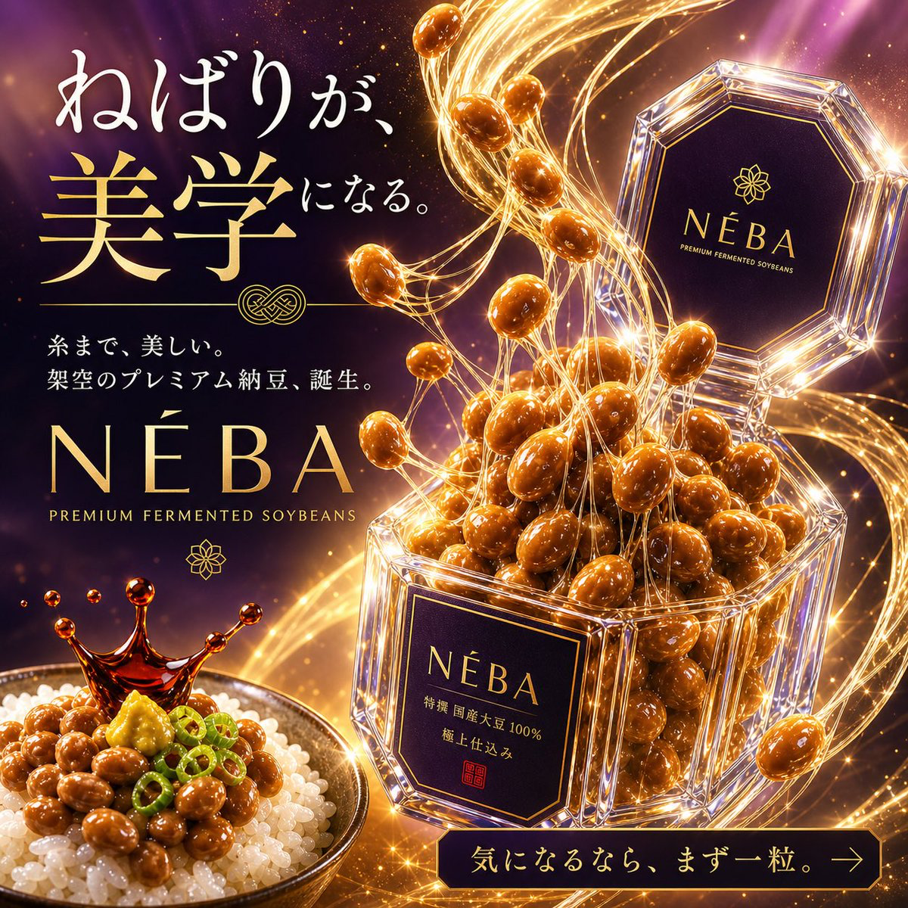</a>

```text
Create a luxurious Japanese advertising banner for {argument name="product name" default="NÉBA"}, premium fermented soybeans/natto, in a dramatic dark purple and black studio setting with radiant gold light trails, glittering particles, and an elegant high-end cosmetics/jewelry aesthetic. The composition is a square promotional visual: on the right, a transparent faceted crystal octagonal jar is open, overflowing with glossy amber-brown natto beans; long sticky golden strands stretch upward and swirl like luminous silk threads, with individual beans suspended in the strands. The jar has a dark plum label with gold typography reading {argument name="product name" default="NÉBA"}, small Japanese premium-product copy, and a refined floral emblem. Behind it, the open crystal lid stands upright with the same gold logo, resembling a luxury perfume or gem case. On the lower left, show a bowl of white rice topped with natto, green onion rings, a dab of mustard, and a dramatic splash of dark sauce shaped like a crown. Use large elegant Japanese headline text on the left reading {argument name="headline text" default="ねばりが、美学になる。"}, with the word for beauty in oversized gold calligraphy and the rest in white. Below it, include smaller Japanese body copy reading {argument name="body copy" default="糸まで、美しい。架空のプレミアム納豆、誕生。"}. Add a large serif Roman product title “NÉBA” with the subtitle “PREMIUM FERMENTED SOYBEANS” beneath it. At the bottom right, place a slim dark rectangular call-to-action button with a gold border, Japanese text reading {argument name="call to action" default="気になるなら、まず一粒。"}, and a right arrow. Overall style: ultra-polished luxury food commercial, hyper-detailed 3D product rendering, glossy reflections, faceted glass refraction, cinematic gold rim lighting, premium Japanese typography, intentionally over-the-top and not practical as an informational banner.
```

## by [Nawal](<https://x.com/nawalsehar>) on May 3, 2026 👉 [Try Now](https://indream.ai/generate?mode=IMAGE&modelKey=gpt-image-v2&modelPromptId=019e6126-d454-76c8-af6f-816e93a67057)

<a href="./public/images/3fa74d1e-b51c-468b-91f0-217bec65098d.png" target="_blank" rel="noopener noreferrer">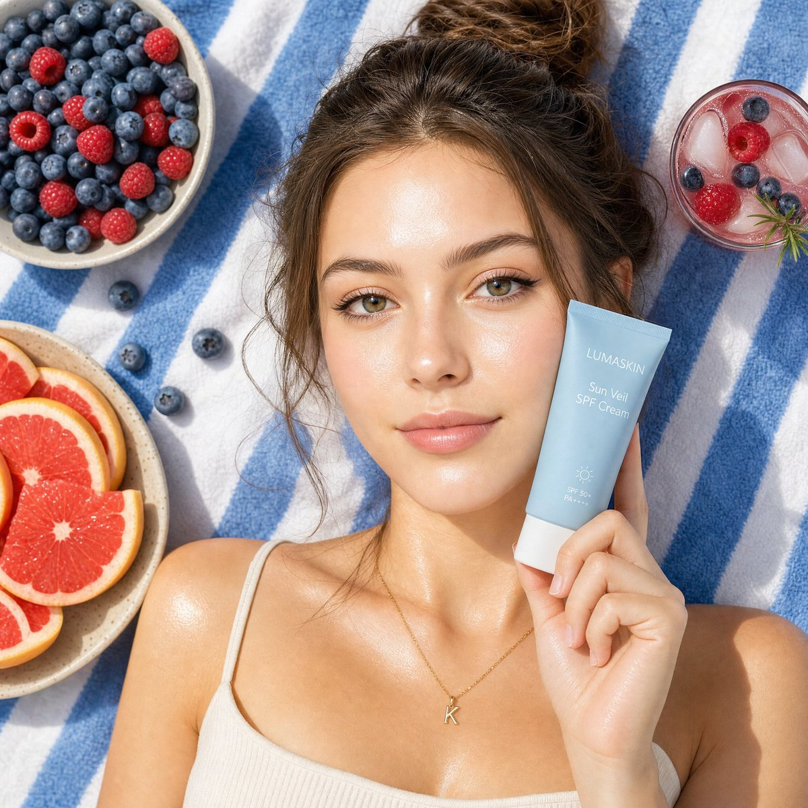</a>

```text
A radiant young woman with dewy, glowing skin lies on a soft {argument name="towel style" default="blue-and-white striped"} towel under bright natural sunlight, holding a {argument name="color" default="pastel blue"} sunscreen tube labeled “LUMASKIN Sun Veil SPF Cream” gently against her cheek. She has a relaxed expression, minimal makeup, and slightly tousled dark hair styled in a loose bun. Surrounding her are fresh summer elements: bowls of blueberries and raspberries, sliced grapefruit on a plate, and a glass of pink fruit-infused drink with berries and ice. The composition is a top-down flat lay with vibrant colors, crisp shadows, and a fresh, summery skincare advertisement aesthetic, high detail, soft highlights, and a clean lifestyle beauty photography style.
```

## by [Anirole](<https://x.com/anirole_jp>) on May 3, 2026 👉 [Try Now](https://indream.ai/generate?mode=IMAGE&modelKey=gpt-image-v2&modelPromptId=019e6126-e600-734d-8ecd-ace6abd91741)

<a href="./public/images/114e6fdc-0092-4de1-a765-272837555fdb.png" target="_blank" rel="noopener noreferrer">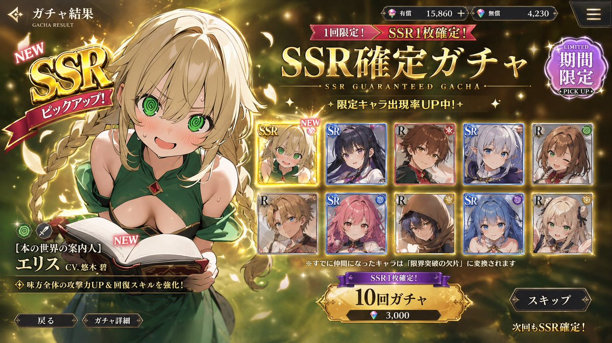</a>

```text
モダンなソシャゲUIのガチャ画面を作成。横長レイアウト、{argument name="レアリティ" default="SSR"}確定ガチャ、限定感を演出して。周囲に「{argument name="バッジ" default="SSR"}」「NEW」「ピックアップ」などのUIバッジ、ガチャボタンやスキップボタン、結果一覧のカードUIを配置。
```

## by [田中勇道 | AI画像・動画生成](<https://x.com/yudotanaka>) on May 2, 2026 👉 [Try Now](https://indream.ai/generate?mode=IMAGE&modelKey=gpt-image-v2&modelPromptId=019e6129-dd3d-747d-be6b-5cbc22d7a3af)

<a href="./public/images/d7a29f76-ae7a-434f-b24b-a19f41be5b8d.png" target="_blank" rel="noopener noreferrer">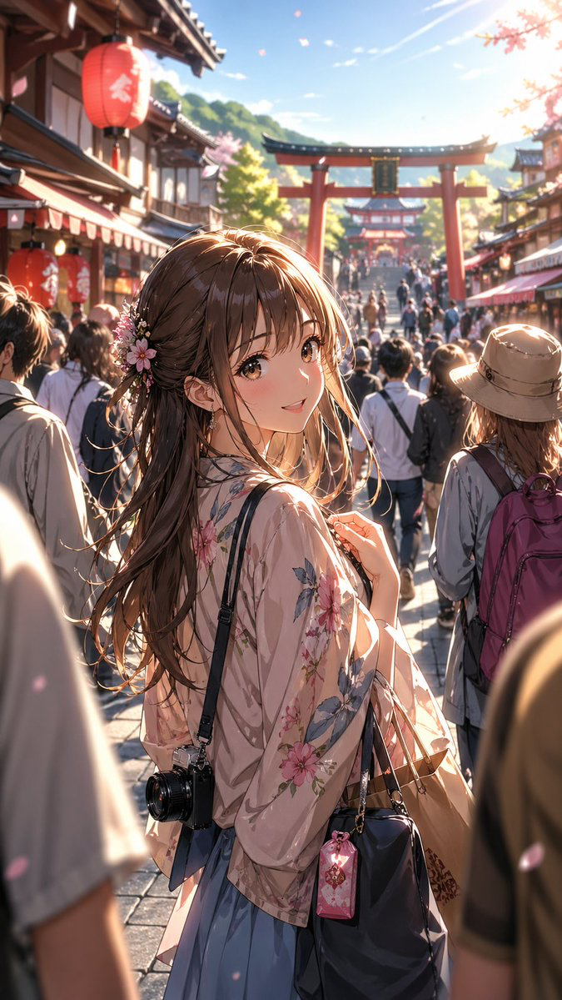</a>

```text
Create a vertical anime-style cinematic illustration of a young woman sightseeing on a crowded traditional Japanese shrine shopping street during cherry blossom season. The main subject stands in the foreground, seen from behind and slightly in profile, with her face intentionally covered by a plain opaque square censor block in muted brown. She has long flowing {argument name="hair color" default="warm chestnut brown"} hair with loose strands glowing in the sunlight, decorated with small pink and white flower hair ornaments. She wears a sheer pale pink floral kimono-style cardigan over a soft blue skirt, carrying 3 visible accessories: a black shoulder camera hanging at her hip, a dark navy handbag on her arm, and a small pink charm pouch clipped to the bag. The background shows a busy shrine approach packed with tourists, traditional wooden storefronts on both sides, 2 visible red paper lanterns with white Japanese characters on the left, and 2 red torii gates aligned down the street, one large gate in the mid-background and a smaller gate farther behind it. Add drifting sakura petals, warm golden late-afternoon backlight, lens flare from the upper right, soft depth of field with the crowd and shrine architecture blurred into the distance, highly detailed painterly anime rendering, delicate linework, romantic travel atmosphere, 9:16 portrait composition, vibrant but natural colors, no readable modern signage emphasized.
```

## by [藍澤 ミライ](<https://x.com/mirai_ai2050>) on May 2, 2026 👉 [Try Now](https://indream.ai/generate?mode=IMAGE&modelKey=gpt-image-v2&modelPromptId=019e612a-4197-72bc-8b79-f7d2ac6422b3)

<a href="./public/images/871be63b-a0df-4d9e-ae54-1b6a65b2e093.png" target="_blank" rel="noopener noreferrer">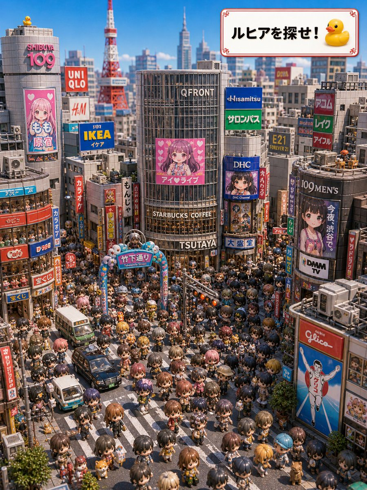</a>

```text
{"type":"highly detailed isometric 3D hidden-object city scene","title_text":"{argument name=\"headline text\" default=\"ルヒアを探せ！\"}","setting":"a bright sunny Golden Week special scene in Shibuya, Tokyo, viewed from a high elevated wide angle like a miniature diorama, with Tokyo Tower and skyscrapers in the blue-sky background","main_goal":"create a 'find the character' puzzle image where the viewer searches for Ruhia among a huge chibi crowd","style":"GPT-image-2 style, ultra-detailed toy-like 3D render, anime chibi figures, crisp daylight, shallow miniature depth of field, vibrant commercial colors, dense urban signage, playful travel poster mood","layout":{"camera":"high-angle wide shot looking down into a famous Shibuya-style crossing packed with chibi pedestrians","foreground":"zebra crosswalks, small cars and buses, trees, street lamps, shop entrances, crowds of chibi anime people","midground":"large QFRONT building in the center with TSUTAYA and STARBUCKS COFFEE signs, surrounded by many vertical Japanese signs and billboards","background":"Shibuya 109 building on the left, red Tokyo Tower behind it, modern office towers and commercial buildings filling the skyline","top_right_overlay":"a white rectangular signboard with a thin red decorative border, bold black Japanese headline text, and a yellow rubber duck icon"},"counted_elements":{"rubber_ducks":{"count":2,"items":["one small yellow rubber duck sitting on the roof of the SHIBUYA 109 building at the upper left","one yellow rubber duck icon inside the top-right headline placard"]},"major_brand_or_landmark_signs":{"count":17,"items":["SHIBUYA 109","UNIQLO","H&M","IKEA","QFRONT","STARBUCKS COFFEE","TSUTAYA","Hisamitsu","サロンパス","DHC","109MEN'S","DMM TV","Glico running man billboard","竹下通り gate","Tokyo Tower","もも原宿 billboard","アイ♡ライブ billboard"]},"headline_placards":{"count":1,"items":["top-right white bordered placard reading {argument name=\"headline text\" default=\"ルヒアを探せ！\"} with a duck"]}},"characters":{"crowd":"hundreds of small anime chibi pedestrians packed shoulder-to-shoulder across the streets and sidewalks, with varied hair colors, outfits, animal-ear accessories, tiny bags, and idol-like costumes","hidden_target":"{argument name=\"hidden character\" default=\"Ruhia\"} should be camouflaged somewhere in the crowd as the object of the search game","character_style":"cute rounded chibi proportions, oversized heads, glossy eyes, tiny bodies, toy figurine texture"},"signage_and_details":"fill the buildings with colorful Japanese street signs, idol posters, cafe signs, karaoke signs, capsule-toy-like decorations, rooftop air conditioners, balconies, windows, and miniature urban clutter; include a Takeshita Street-style decorative arch in the lower center-left with cute mascot ornaments","color_palette":"clear blue sky, warm sunlight, saturated reds, blues, yellows, pink idol billboards, gray concrete buildings, and multicolored crowd accents","render_quality":"extremely dense details, sharp readable central signs, realistic miniature shadows, whimsical but believable Shibuya travel scene, no empty areas"}
```

## by [⁠ luciaAI](<https://x.com/arghzq>) on May 2, 2026 👉 [Try Now](https://indream.ai/generate?mode=IMAGE&modelKey=gpt-image-v2&modelPromptId=019e612d-e184-76be-9ae7-22aea064bd55)

<a href="./public/images/de80fcfa-3707-4e64-b8e6-26b6bf356197.png" target="_blank" rel="noopener noreferrer">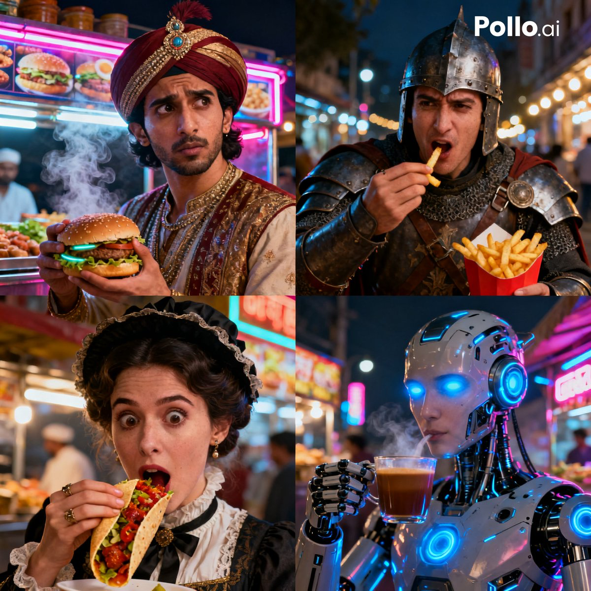</a>

```text
A 2x2 cinematic grid showing different time travelers experiencing modern street food in a neon-lit night market. Each panel represents a different era character reacting to food, ultra realistic, cinematic lighting, highly detailed, vibrant colors, storytelling composition, 8K quality, shallow depth of field, dramatic atmosphere, steam and neon glow, cohesive visual style across all panels. Top left: Mughal-era prince holding a modern burger, confused expression, neon food stall background. Top right: medieval knight eating french fries, humorous reaction, street night lights. Bottom left: Victorian lady tasting spicy street taco, surprised expression, cinematic lighting. Bottom right: futuristic cyborg drinking chai, glowing blue eyes, neon cyber street food setting. consistent lighting, unified color grading, cinematic grid composition, ultra-detailed faces, storytelling coherence Animate this image into a single continuous cinematic scene. The 2x2 grid layout should dissolve into one unified street food night market where all characters exist in the same space and interact naturally. Transform the scene so the Mughal-era prince, medieval knight, Victorian lady, and futuristic cyborg are all standing in the same neon-lit street food market at night. Remove the grid separation completely and merge all panels into one cohesive world. Camera slowly pans across the scene in a smooth cinematic motion, revealing each character one by one. The Mughal prince examines a modern burger with curiosity. The medieval knight eats fries with exaggerated confusion. The Victorian lady reacts to spicy street food with surprise. The futuristic cyborg calmly drinks chai with glowing eyes. Add subtle natural movements: blinking, chewing, steam rising from food, neon reflections shifting, soft crowd motion in background. Maintain cinematic lighting, ultra realistic style, shallow depth of field, vibrant neon night market atmosphere, film-like color grading. Smooth camera movement, slow cinematic reveal, no grid lines, no panel separation, fully merged world, consistent environment, high detail, 8K cinematic realism.
```

## by [エスニヤ🛏](<https://x.com/y_esnya>) on May 2, 2026 👉 [Try Now](https://indream.ai/generate?mode=IMAGE&modelKey=gpt-image-v2&modelPromptId=019e612e-0549-72c0-9bb3-faabf57287b2)

<a href="./public/images/643c8adb-6843-477e-bf57-f1e65b8467c9.png" target="_blank" rel="noopener noreferrer">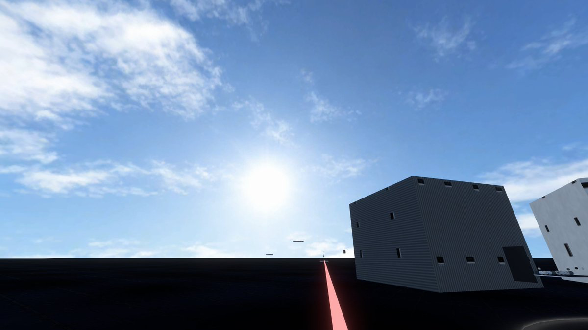</a>

```text
Create a wide 16:9 photorealistic game-engine skybox test scene viewed from a low first-person camera on a vast flat, nearly black asphalt or matte platform under a huge open blue sky. The composition is dominated by the sky: bright midday sun glowing slightly left of center near the horizon line, strong lens bloom, pale blue atmospheric gradient, and scattered thin wispy white cirrus clouds across the upper left and upper right. The ground is a dark featureless plane with subtle reflections and faint grid-like seams, stretching to a straight distant horizon. On the right side, place two simple modern industrial cuboid buildings: one large dark gray corrugated metal box building tilted in perspective with small narrow black rectangular windows, a dark doorway, and a few roof vents; farther right, a white rectangular building partially cropped by the frame with sparse vertical black windows. Add a thin glowing pink-red line or laser strip running from the bottom center foreground toward the horizon beside the buildings, creating a strong perspective guide. Include a few tiny floating dark oval objects near the horizon beneath the sun. Use Unreal Engine / Unity-style real-time rendering, crisp shadows, high dynamic range lighting, realistic skybox atmosphere, minimal urban test environment, no people, no text, no vehicles, clean cinematic screenshot aesthetic. The customizable scene should use {argument name="sky condition" default="bright midday blue sky with wispy cirrus clouds"}, {argument name="ground material" default="nearly black asphalt platform"}, {argument name="building style" default="minimal corrugated industrial cuboid buildings"}, {argument name="accent line color" default="glowing pink-red"}, and {argument name="camera perspective" default="low first-person wide-angle view"}.
```

## by [ハカセ アイ(Ai-Hakase)🐾最新トレンドＡＩのためのＸ 🐾](<https://x.com/ai_hakase_>) on May 2, 2026 👉 [Try Now](https://indream.ai/generate?mode=IMAGE&modelKey=gpt-image-v2&modelPromptId=019e612f-6fa0-70e1-871d-f78358c31d74)

<a href="./public/images/0f32191c-241b-4f8b-9070-bda4cd05b388.png" target="_blank" rel="noopener noreferrer">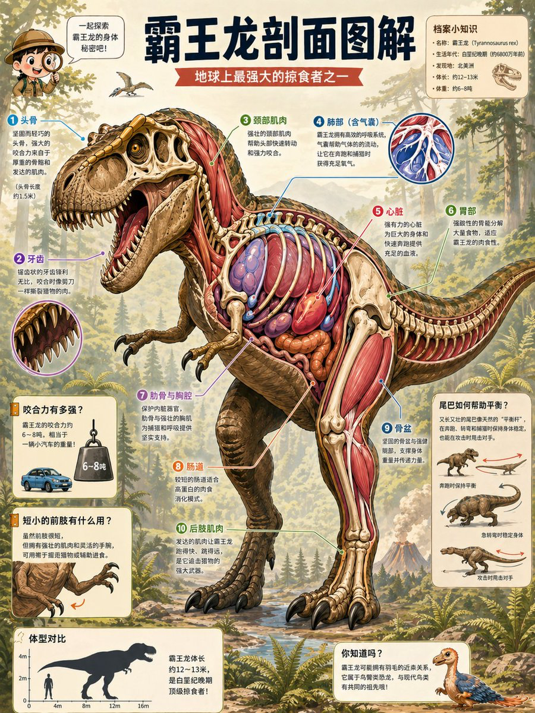</a>

```text
{"type":"publication-quality educational science encyclopedia cutaway poster","language":"Simplified Chinese labels and captions","main_title":"{argument name=\"headline text\" default=\"霸王龙剖面图解\"}","subtitle":"{argument name=\"subtitle text\" default=\"地球上最强大的掠食者之一\"}","subject":{"species":"{argument name=\"dinosaur species\" default=\"Tyrannosaurus rex\"}","pose":"large roaring side-view dinosaur walking left to right, mouth open, tail extended for balance, one hind leg forward, tiny forearms raised","style":"highly detailed semi-realistic scientific illustration, vintage natural history encyclopedia plate, rich watercolor and gouache texture, crisp ink outlines, warm parchment paper background","cutaway":"left half shows external scaly skin and skull; right and central body are anatomically cut open to reveal skeleton, red muscles, ribs, lungs, heart, intestines, stomach, tendons, and leg musculature with spatially coherent cross-section layers","skin_color":"{argument name=\"skin color\" default=\"olive brown and ochre scales with darker striping\"}","anatomy_colors":"ivory bones, crimson and pink muscles, blue-purple lungs, bright red heart, orange-brown digestive organs"},"layout":{"composition":"portrait poster layout with the dinosaur dominating the center, numbered callout arrows radiating around the body, small inset diagrams in rounded cream cards, forest and volcano landscape behind","background":"Mesozoic forest with conifers, ferns, rocky stream, misty mountains, distant volcano, small flying pterosaur, warm sunlight, educational museum-poster atmosphere","top_left_mascot":"small explorer child character with speech bubble saying \"一起来探索霸王龙的身体秘密吧!\"","top_right_fact_card":{"title":"档案小知识","count":4,"items":["名称：霸王龙（Tyrannosaurus rex）","生活年代：白垩纪晚期（约6800万年前）","发现地：北美洲","体长：约12–13米","体重：约6–8吨"],"note":"draw a small T. rex skull icon beside the facts"},"main_numbered_anatomy_callouts":{"count":10,"items":[{"number":1,"label":"头骨","description":"massive skull, powerful jaw, thick bones and strong bite muscles"},{"number":2,"label":"牙齿","description":"large conical serrated teeth, shown with a circular close-up inset of the open mouth"},{"number":3,"label":"颈部肌肉","description":"thick neck muscles connecting skull and torso"},{"number":4,"label":"肺部（含气囊）","description":"blue pulmonary system with a circular inset showing branching air sacs and vessels"},{"number":5,"label":"心脏","description":"large red heart in the rib cage"},{"number":6,"label":"胃部","description":"stomach and digestive chamber behind the ribs"},{"number":7,"label":"肋骨与胸腔","description":"arched ivory ribs surrounding lungs and organs"},{"number":8,"label":"肠道","description":"coiled orange intestines in the abdomen"},{"number":9,"label":"骨盆","description":"large hip bones supporting the hind limbs and tail"},{"number":10,"label":"后肢肌肉","description":"powerful red thigh and calf muscles attached to long leg bones"}]},"side_information_cards":{"count":5,"cards":[{"position":"lower left upper","title":"咬合力有多强？","visuals":"small blue car beside a hanging weight labeled 6~8吨","purpose":"explain bite force comparison"},{"position":"lower left middle","title":"短小的前肢有什么用？","visuals":"close-up of tiny forelimbs with claws and orange motion arrow","purpose":"explain possible function of short arms"},{"position":"lower left bottom","title":"体型对比","visuals":"silhouette chart with human and T. rex, vertical scale up to 4m and horizontal scale to 16m","purpose":"show size comparison and body length around 12–13 meters"},{"position":"right middle","title":"尾巴如何帮助平衡？","count":3,"visuals":["small dinosaur with red horizontal balance arrow","tail-heavy walking diagram with blue arrow","running posture diagram with red arrow"],"purpose":"explain tail counterbalance and running stability"},{"position":"lower right","title":"你知道吗？","visuals":"small feathered juvenile dinosaur illustration","purpose":"fun fact card about feathers and relatives"}]},"typography":"bold dark navy Chinese title at top, red ribbon subtitle, clean printed Chinese body text, colored numbered circles, thin colored leader lines, rounded cream annotation cards with subtle drop shadows","rendering_requirements":"make the anatomy legible and layered, include accurate internal structures, maintain consistent colors and crisp labels, high-resolution print-ready poster, no photorealism, no 3D render, no modern UI chrome"}
```

## by [ハカセ アイ(Ai-Hakase)🐾最新トレンドＡＩのためのＸ 🐾](<https://x.com/ai_hakase_>) on May 2, 2026 👉 [Try Now](https://indream.ai/generate?mode=IMAGE&modelKey=gpt-image-v2&modelPromptId=019e612f-5d01-77a8-883d-96cae8ef0ef6)

<a href="./public/images/7a6e76dc-b039-4d61-b9ec-3fb62e4a7d06.png" target="_blank" rel="noopener noreferrer">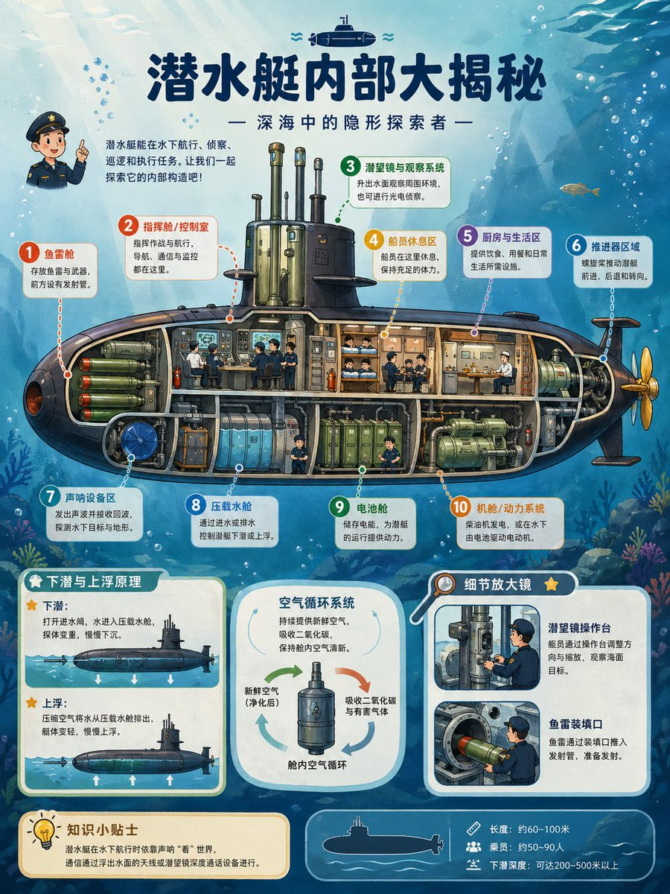</a>

```text
{"type":"publication-quality educational cutaway science encyclopedia poster","topic":"{argument name=\"poster topic\" default=\"submarine internal structure\"}","language":"Simplified Chinese visible text","aspect_ratio":"3:4 vertical poster","style":"richly colored semi-realistic illustrated infographic for children, detailed cross-section engineering diagram, clean vector-like labels mixed with painterly underwater background, high-resolution print design","main_title":"{argument name=\"headline text\" default=\"潜水艇内部大揭秘\"}","subtitle":"— 深海中的隐形探索者 —","scene":{"background":"blue underwater ocean with sunbeams from the upper left, bubbles, fish silhouettes, seaweed and coral near the bottom, a small submarine icon above the title","main_subject":"large side-view submarine cutaway spanning the center, dark navy outer hull, golden propeller at the right, transparent interior compartments with pipes, tanks, crew members, machinery, bunks, control panels, and torpedoes visible","character":"small cute naval officer mascot at upper left pointing upward beside an introductory paragraph"},"layout":{"top_intro":"short paragraph in Chinese explaining that submarines can travel underwater, spy, avoid attacks, and explore the ocean","central_cutaway":{"position":"middle","description":"one full submarine cross-section with ten numbered annotation callouts connected by dotted leader lines","callout_count":10,"callouts":[{"number":1,"label":"鱼雷舱","color":"red","description":"front torpedo storage and launch tubes"},{"number":2,"label":"指挥舱 / 控制室","color":"orange-red","description":"operators, navigation, communication and monitoring equipment"},{"number":3,"label":"潜望镜与观察系统","color":"green","description":"periscopes and optical observation masts above the conning tower"},{"number":4,"label":"船员休息区","color":"yellow","description":"bunks and compact sleeping quarters"},{"number":5,"label":"厨房与生活区","color":"purple","description":"galley and living space for food and daily needs"},{"number":6,"label":"推进器区域","color":"blue","description":"rear propulsion shaft, engine drive and steering fins"},{"number":7,"label":"声呐设备区","color":"teal","description":"sonar equipment for detecting underwater targets and terrain"},{"number":8,"label":"压载水舱","color":"light blue","description":"ballast tanks that fill and release water to control diving and floating"},{"number":9,"label":"电池舱","color":"green","description":"battery compartment supplying submarine power"},{"number":10,"label":"机舱 / 动力系统","color":"orange","description":"engine room, electric motor and power machinery"}]},"bottom_sections":{"section_count":5,"sections":[{"title":"下潜与上浮原理","position":"bottom left","count":2,"items":["下潜：打开进水阀，水进入压载水舱，使艇下沉。","上浮：压缩空气将水从压载水舱排出，艇体变轻，慢慢上浮。"],"visuals":"two small side-view submarine diagrams with arrows showing descent and ascent"},{"title":"空气循环系统","position":"bottom center","count":3,"items":["新鲜空气（净化后）","吸收二氧化碳与有害气体","舱内空气循环"],"visuals":"rounded card with central cylindrical air purifier and circular arrows"},{"title":"细节放大镜","position":"bottom right","count":2,"items":["潜望镜操作台","鱼雷装填口"],"visuals":"two inset close-up panels, one showing a sailor operating a periscope console and one showing torpedo loading"},{"title":"知识小贴士","position":"bottom left below diagrams","count":1,"items":["潜水艇在水下航行时依靠声呐‘看’世界，通信通过浮出水面的天线或浮缆装置与海面设备进行。"],"visuals":"cream note box with lightbulb icon"},{"title":"specification strip","position":"bottom right footer","count":3,"items":["长度：约60~100米","乘员：约50~90人","下潜深度：可达200~500米以上"],"visuals":"thin rounded blue footer with white submarine silhouette and three small icons"}]},"design_details":{"typography":"large bold dark navy Chinese title, rounded sans-serif annotation labels, white rounded callout cards with colored number circles","palette":"deep ocean blues, teal, cream cards, orange and green engineering accents, dark hull with warm interior lighting","quality":"crisp readable infographic, balanced spacing, accurate leader lines, detailed but friendly educational illustration, suitable for a children’s science book or classroom poster"},"customization":{"submarine_name":"{argument name=\"submarine name\" default=\"深海探索者\"}","audience":"{argument name=\"target audience\" default=\"children’s science encyclopedia readers\"}","color_mood":"{argument name=\"color mood\" default=\"bright blue underwater educational palette\"}"}}
```

## by [ハカセ アイ(Ai-Hakase)🐾最新トレンドＡＩのためのＸ 🐾](<https://x.com/ai_hakase_>) on May 2, 2026 👉 [Try Now](https://indream.ai/generate?mode=IMAGE&modelKey=gpt-image-v2&modelPromptId=019e612f-3ad3-762b-8d96-90efc42343db)

<a href="./public/images/1909d4b7-238b-400d-9967-4fd545d1d42e.png" target="_blank" rel="noopener noreferrer">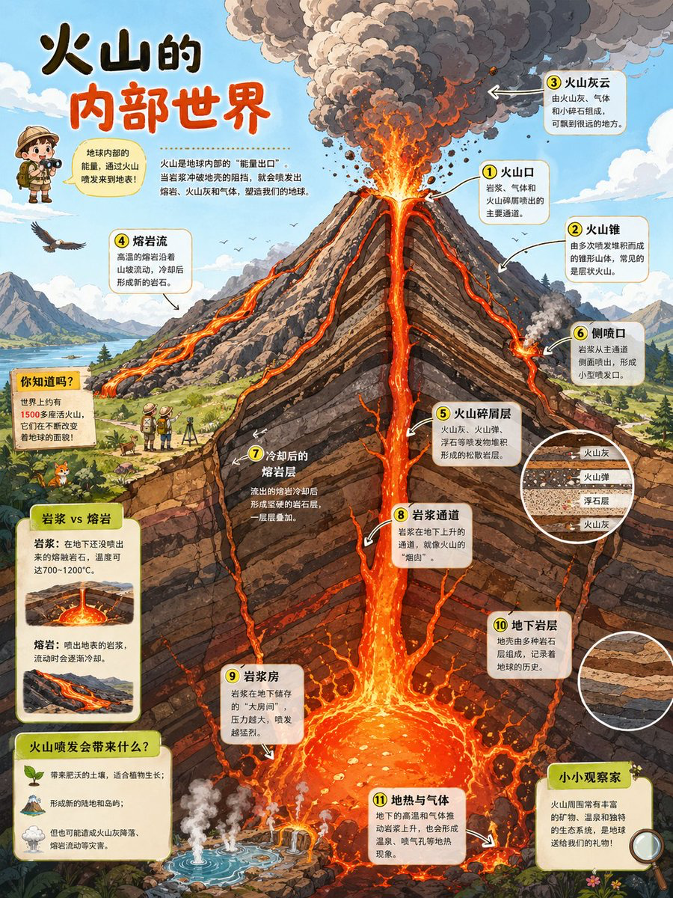</a>

```text
{"type":"children's science encyclopedia cutaway infographic poster","topic":"{argument name=\"main title\" default=\"火山的内部世界\"}","language":"Simplified Chinese labels and body text","style":"publication-quality educational illustration, richly detailed hand-painted watercolor and gouache look, warm volcanic oranges contrasted with clear sky blues and green landscape, friendly for children, clean annotation layout, high spatial coherence, high resolution","layout":{"canvas":"vertical full-page poster","main_scene":"large erupting stratovolcano shown in cross-section, with the right half sliced open to reveal layered rock strata, a central glowing magma conduit, branching side vents, lava flows, magma chamber, cracks, groundwater and gas beneath the mountain","background":"blue sky with clouds, huge gray ash plume with fiery orange eruption at the crater, distant mountains, lake, forests, birds, tiny explorers for scale","title_area":{"position":"top left","text":"{argument name=\"main title\" default=\"火山的内部世界\"}","typography":"large brush-style Chinese characters, black first line and bold red-orange second line"},"mascot_and_intro":{"position":"upper left","character":"small child explorer wearing tan safari hat, backpack and boots","speech_bubble":"地球内部的能量，通过火山喷发来到地表！","intro_paragraph":"火山是地球内部的‘能量出口’。当岩浆冲破地壳的阻挡，就会喷发出熔岩、火山灰和气体，塑造我们的地球。"},"numbered_callouts":{"count":11,"labels":[{"number":1,"title":"火山口","description":"岩浆、气体和火山碎屑喷出的主要通道。","position":"upper right beside crater"},{"number":2,"title":"火山锥","description":"由多次喷发堆积而成的锥形山体，常见的是层状火山。","position":"right slope"},{"number":3,"title":"火山灰云","description":"由火山灰、气体和小颗石组成，可飘到很远的地方。","position":"top right in ash cloud"},{"number":4,"title":"熔岩流","description":"高温的熔岩沿着山坡流动，冷却后形成新的岩石。","position":"upper left slope"},{"number":5,"title":"火山碎屑层","description":"火山灰、火山弹、浮石等喷发物堆积形成的松散岩层。","position":"middle right cross-section"},{"number":6,"title":"侧喷口","description":"岩浆从主通道侧面喷出，形成小型喷发口。","position":"right flank with small eruption"},{"number":7,"title":"冷却后的熔岩层","description":"流出的熔岩冷却后形成坚硬的岩石层，一层层叠加。","position":"left interior strata"},{"number":8,"title":"岩浆通道","description":"岩浆在地下上升的通道，就像火山的‘烟囱’。","position":"central vertical conduit"},{"number":9,"title":"岩浆房","description":"岩浆在地下储存的‘大房间’，压力越大，喷发越猛烈。","position":"lower left of magma chamber"},{"number":10,"title":"地下岩层","description":"地壳由多种岩石层组成，记录着地球的历史。","position":"lower right strata"},{"number":11,"title":"地热与气体","description":"地下的高温和气体推动岩浆上升，也会形成温泉、喷气孔等地热现象。","position":"bottom near hot springs and magma"}]},"side_panels":{"count":4,"items":[{"title":"你知道吗？","position":"left middle yellow card","content":"世界上约有1500多座活火山，它们在不断改变着地球的面貌！"},{"title":"岩浆 vs 熔岩","position":"left lower green card","content":"岩浆：在地下还没喷出来的炽热岩石，温度可达700~1200°C。熔岩：喷出地表的岩浆，流动时会逐渐冷却。","includes":"two small comparison illustrations"},{"title":"火山喷发会带来什么？","position":"bottom left pale yellow card","content":"3 effects listed with icons: bring fertile soil suitable for plants, form new land and islands, but may also cause ashfall and lava-flow disasters."},{"title":"小小观察家","position":"bottom right pale yellow card","content":"火山周围常有丰富的矿物、温泉和独特的生态系统，是地球送给我们的礼物！","includes":"magnifying glass illustration"}]},"detail_insets":{"count":2,"items":[{"position":"right middle","shape":"circular magnified cutaway","content":"four visible layer labels: 火山灰, 火山弹, 浮石层, 火山灰"},{"position":"right lower","shape":"circular magnified cutaway","content":"close-up of brown and gray underground rock strata"}]},"small_figures":{"count":6,"items":["one child explorer mascot at upper left","three tiny explorers with backpacks and telescope near left base of volcano","one fox in grass at lower left","one flying eagle over left valley"]}},"rendering_instructions":"Create a coherent cross-section diagram where every numbered arrow points to the correct volcanic structure. Make the magma incandescent with yellow-white highlights and orange-red edges, add smoke, ash particles, lava cracks, realistic layered strata, and tidy rounded annotation boxes with yellow number badges. Keep all Chinese text legible and arranged like a polished educational book spread.","customizable_subject":"{argument name=\"volcano type\" default=\"stratovolcano\"}","audience":"{argument name=\"audience\" default=\"children's science readers\"}","color_palette":"{argument name=\"color palette\" default=\"warm lava orange, earthy browns, sky blue, forest green, pale yellow annotation cards\"}"}
```

## by [zemoon](<https://x.com/zemoon_xbt>) on May 2, 2026 👉 [Try Now](https://indream.ai/generate?mode=IMAGE&modelKey=gpt-image-v2&modelPromptId=019e6130-04c9-7237-878c-0fc5912d19e2)

<a href="./public/images/8fff0b9b-d808-4bee-bc9a-53b545e3b9a5.png" target="_blank" rel="noopener noreferrer">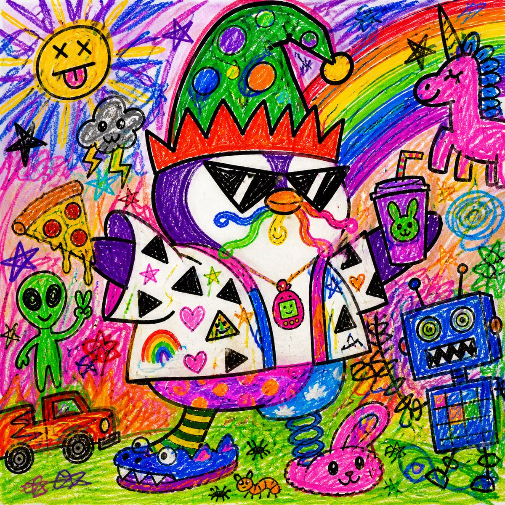</a>

```text
Redraw this like a 6-year-old who was given unlimited creative freedom and no guidance. Bright chaotic colors, weird proportions, random details added for no reason, and complete disregard for accuracy.
```

## by [Saul Goodman](<https://x.com/Goodmanprotocol>) on May 2, 2026 👉 [Try Now](https://indream.ai/generate?mode=IMAGE&modelKey=gpt-image-v2&modelPromptId=019e6134-c72d-730b-b57b-28719d0e88d1)

<a href="./public/images/de8b73cf-0307-4f2e-8eba-e910ae772f5c.png" target="_blank" rel="noopener noreferrer">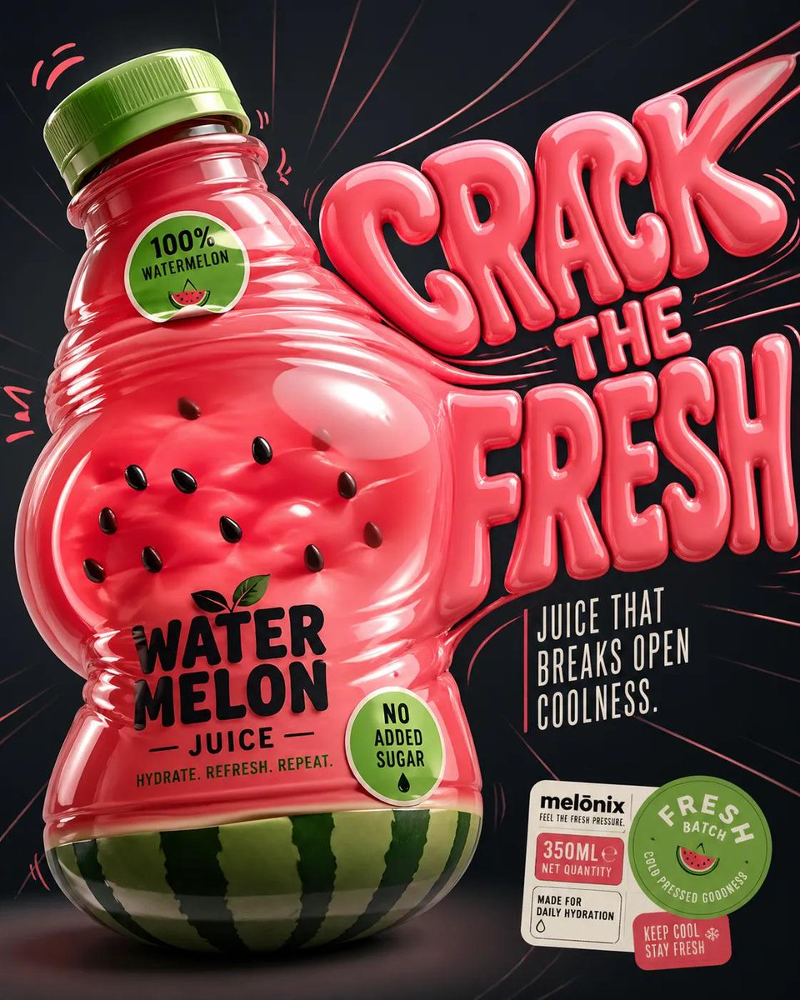</a>

```text
Design a '4:5' product poster for an '{argument name="fruit" default="orange"}' juice 3d bottle using playful inflatable-plastic packaging surrealism where the bottle behaves like a squeezed toy object mid-pressure. The poster should communicate juiciness, tension, and tactile freshness through a bottle that visibly bulges, stretches, and compresses like a soft object being squeezed from the inside out.

SUBJECT:
A single bottle dominates the center-left, illustrated in a semi-3D stylized form (not photoreal). The bottle is visibly distorted—its midsection bulges outward while the neck is slightly compressed, as if internal juice pressure is pushing against the container walls. The liquid inside exaggerates this effect, forming rounded convex surfaces pressing against the plastic. The cap is slightly tilted from pressure. The bottle feels elastic, alive, and reactive rather than rigid.

COMPOSITION:
The composition mechanic is “internal pressure distortion”. The eye enters through the most inflated part of the bottle (center bulge), then follows curved tension lines outward toward stretched typography on the right side. The camera uses a slightly low, close-up perspective with mild fisheye distortion, amplifying the sense of pressure and expansion. The bottle leans diagonally into the frame as if pushing against invisible resistance. Negative space on the right is intentionally stretched and warped, echoing the bottle’s deformation.

TYPOGRAPHY:
Headline: “{argument name="headline" default="SQUEEZE BACK"}” in thick, rounded, inflated lettering that mimics air-filled plastic. The type is physically distorted—letters stretch horizontally near the bottle and compress toward the edges, as if affected by the same pressure force. The headline sits to the right of the bottle but partially overlaps its bulging edge. Subheadline: “Juice that pushes back.” in a narrow condensed sans, straight and rigid, contrasting the soft headline. Small circular microcopy labels (e.g., “100% organic”, “no added sugar”) appear like printed stickers slightly warped by the surface tension.

LIGHTING / GRAPHIC TREATMENT:
Soft studio lighting adapted for stylized rendering—broad diffused highlights across curved surfaces, subtle specular streaks that follow the deformation. No realistic reflections—only controlled, simplified highlight bands that emphasize volume and elasticity.

COLORS:
'orange' juice bottle color and 3d header text. Small accents of 'bright lime green' for sticker elements. High contrast between glowing orange and dark surroundings.

BACKGROUND:
A smooth dark gradient field with subtle radial tension lines expanding outward from the bottle, like invisible pressure waves. No texture clutter—clean but dynamically warped space.

STYLE:
Neo-pop surreal product illustration with inflatable material logic, playful distortion, and high-impact commercial clarity.

FINISH:
Soft plastic-like rendering, clean edges, controlled gradient transitions, no noise or grain, polis
```

## by [エル（Eru）](<https://x.com/yourself_life>) on May 2, 2026 👉 [Try Now](https://indream.ai/generate?mode=IMAGE&modelKey=gpt-image-v2&modelPromptId=019e6136-06f1-761f-a561-245b5c5d53bf)

<a href="./public/images/04838815-a33b-4aae-813d-dbb136e2540a.png" target="_blank" rel="noopener noreferrer">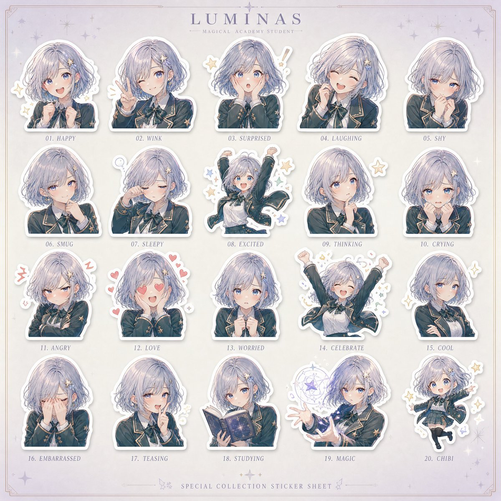</a>

```text
子どもに大流行中の{argument name="スタイル" default="ボンボンドロップシール風"}、かつ{argument name="タイプ" default="スタンプ風"}の高級感あるシールをデザインして
```

## by [aiiStudio](<https://x.com/aiistudiocom>) on May 2, 2026 👉 [Try Now](https://indream.ai/generate?mode=IMAGE&modelKey=gpt-image-v2&modelPromptId=019e6137-f422-738b-8fa1-b9614e34a4cb)

<a href="./public/images/42552582-ee24-450e-a7a3-f65b0686c83c.png" target="_blank" rel="noopener noreferrer">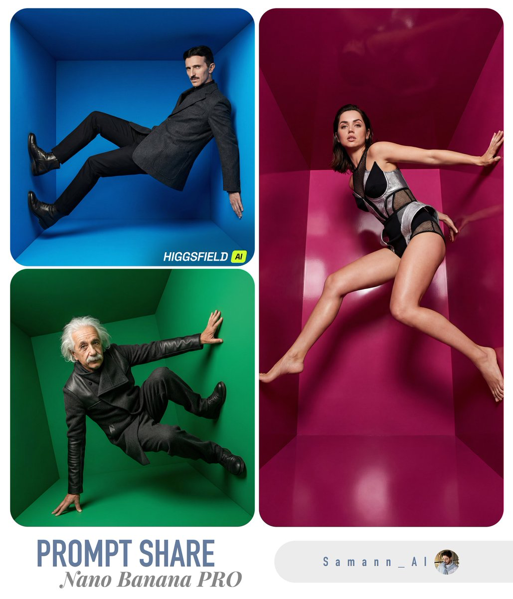</a>

```text
Use the person in the input image as the ONLY subject. Preserve their identity and facial features clearly.

Create a hyper-realistic high-fashion editorial photo inside a surreal 3D geometric {argument name="room style" default="“color box” room"} (a hollow cube / tilted cube set). Each render MUST randomly choose:
1) a bold {argument name="box color" default="single-color box"} (monochrome environment, vivid and saturated),
2) a dynamic “cool” fashion pose (gravity-defying or extreme stretch / leap / sideways bracing against the walls),
3) a dramatic camera angle (wide-angle 24–35mm equivalent, tilted horizon, strong perspective).

The subject appears full-body and sharp, wearing an {argument name="outfit style" default="avant-garde fashion styling"} that feels modern and editorial (clean silhouette, stylish layering, premium fabric texture). Keep clothing tasteful and fashion-forward. The subject’s pose should feel athletic, stylish, and unusual—like a magazine campaign shot.

Lighting: studio quality, crisp and cinematic; strong key light with controlled soft shadows, subtle rim light; realistic reflections and bounce light from the colored walls. Ultra-detailed skin texture, natural pores, realistic fabric weave, clean edges, high dynamic range.
Composition: subject centered with plenty of negative space and strong geometric lines; the box perspective frames the subject.
Color: the box color is a SINGLE bold color and MUST be different each run (random vivid hue). The subject’s outfit contrasts well with the box color.

Output: hyper-real, photorealistic, 8k detail, editorial campaign quality, sharp focus on subject, no motion blur, no distortion of face, natural proportions.
```

## by [kwindla](<https://x.com/kwindla>) on May 1, 2026 👉 [Try Now](https://indream.ai/generate?mode=IMAGE&modelKey=gpt-image-v2&modelPromptId=019e6139-bc79-735b-9b17-42cda424cda0)

<a href="./public/images/44ccdc6c-13e4-40b3-a733-952cbebf736d.png" target="_blank" rel="noopener noreferrer">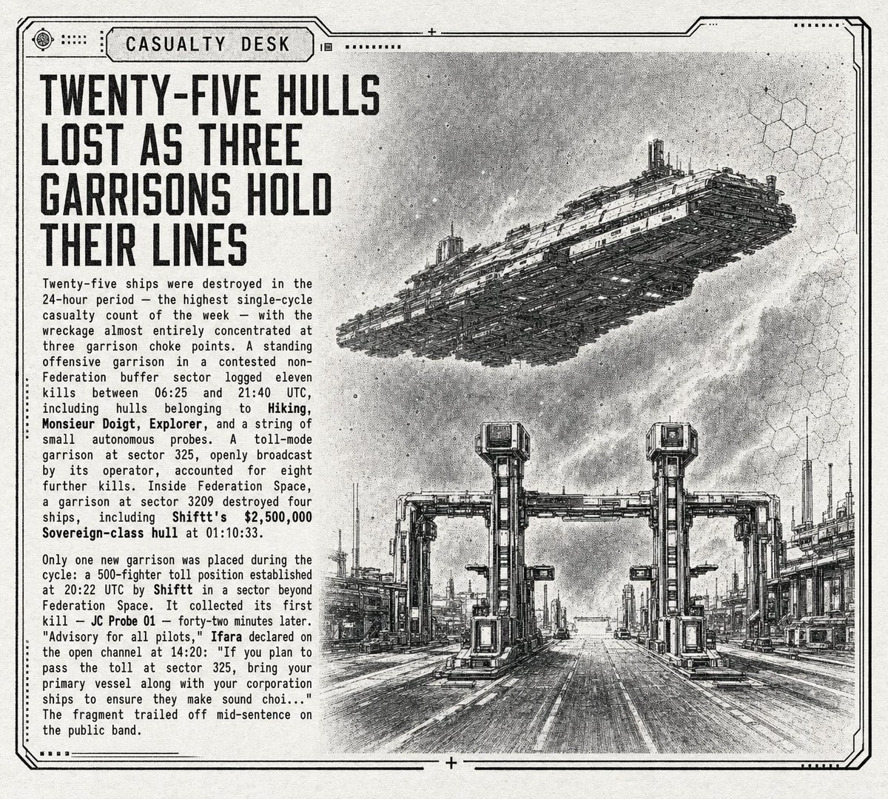</a>

```text
A retro-futurist black-and-white sci-fi newspaper front page designed like a casualty report bulletin, with a distressed paper texture, halftone grain, thin technical border lines, and a slightly worn photocopied print look. The layout is a single printed page in landscape orientation with a bold masthead tab at the top reading {argument name="section label" default="CASUALTY DESK"}. On the left third of the page, a huge condensed all-caps headline in heavy sans-serif type reads {argument name="headline text" default="TWENTY-FIVE HULLS LOST AS THREE GARRISONS HOLD THEIR LINES"}, stacked across 5 lines. Beneath it are 2 dense newspaper-style body text blocks in narrow columns of small monospaced or typewriter-like text, with a few bolded ship and faction names embedded in the copy. The article text should feel like military logistics reporting from an interstellar war, mentioning exact times, sectors, casualties, garrisons, probes, toll positions, and damaged ships. The right two-thirds of the page is a detailed monochrome ink illustration: in the upper right sky, 1 enormous wedge-shaped capital ship or dreadnought hovers diagonally from left-lower side toward right-upper side, covered in layered armor panels, antennae, gantries, and dense structural detailing. Below it, occupying the lower right half, is 1 industrial checkpoint or garrison gate spanning a wide road or landing lane, built from brutalist sci-fi frames, vertical pylons, gantry towers, and utility structures, with perspective lines drawing the eye toward the center distance. Add 1 small mid-distance flying craft near the horizon under the gate. In the far right background, include 1 cluster of tall refinery-like towers and industrial buildings. Overlay faint hexagonal grid motifs on the upper right and lower right background, subtle and partially faded into the paper texture. Use only grayscale tones, black ink linework, etched concept-art hatching, and newspaper-print contrast. The overall mood is bleak, militarized, archival, and editorial, like a war correspondent page from a far-future space empire newspaper.
```

## by [a](<https://x.com/Chippy_ame>) on May 1, 2026 👉 [Try Now](https://indream.ai/generate?mode=IMAGE&modelKey=gpt-image-v2&modelPromptId=019e613e-31ff-7138-bd78-78fca489ccd0)

<a href="./public/images/0df1ecc9-2d2e-45b4-9f94-b2658e547d81.png" target="_blank" rel="noopener noreferrer">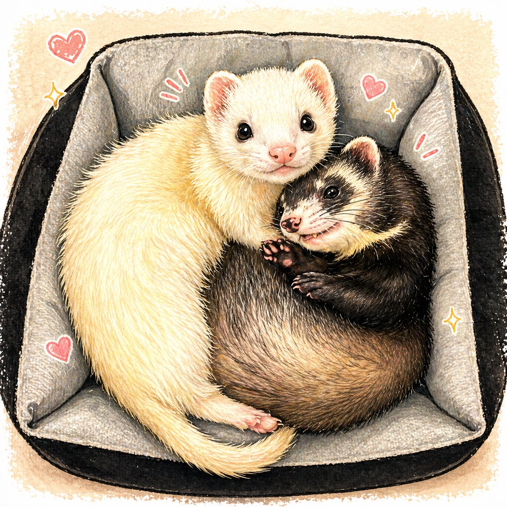</a>

```text
A cute hand-drawn animal illustration in a soft watercolor and colored-pencil storybook style, viewed from directly above. Two ferrets are curled together snugly inside a square pet bed with high padded sides. The left ferret is a pale cream color with fluffy fur, a pink nose, round glossy black eyes, and a gentle sweet expression; its long body curves around the other ferret protectively. The right ferret is a sable ferret with a dark brown body, warm tan underfur, a cream face mask, pink nose, and bright black eyes, smiling slightly with tiny teeth visible and one small paw raised near its chest. Their bodies form a cozy spiral composition, touching cheek to cheek. The bed has a soft light gray inner cushion and dark charcoal-black outer sides, with visible fabric texture and softly shaded folds in each corner. Around them are 4 pink doodle hearts and 4 sparkle or emphasis marks in a playful sticker-like style, adding a kawaii mood. Use a warm off-white paper background with subtle beige wash, delicate textured edges, fine fur detail, soft lighting, charming pastel accents, and an overall adorable affectionate feel.
```

## by [伊集みかん](<https://x.com/iju_mikan>) on May 1, 2026 👉 [Try Now](https://indream.ai/generate?mode=IMAGE&modelKey=gpt-image-v2&modelPromptId=019e6140-9b32-7236-8d48-2e86775b253f)

<a href="./public/images/db2691e6-c5ed-4a67-aa32-10077a4406ff.png" target="_blank" rel="noopener noreferrer">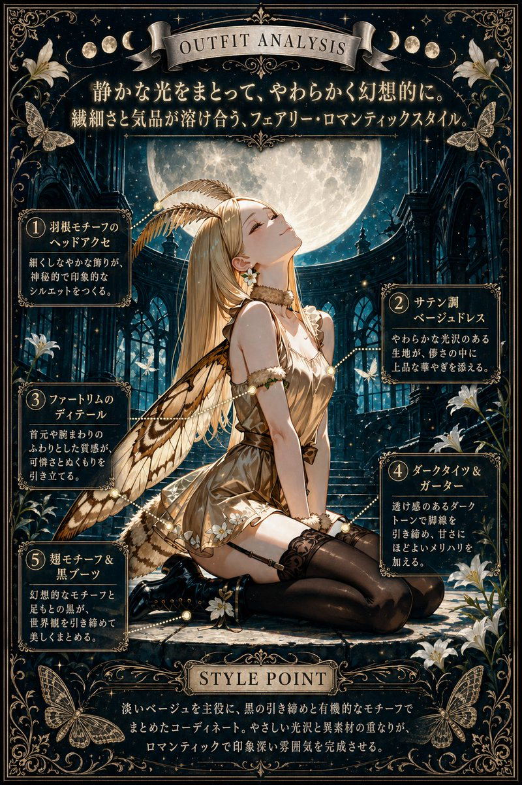</a>

```text
{"type":"fantasy fashion infographic poster","theme":"fairy romantic outfit analysis","style":"ornate gothic editorial illustration with art nouveau framing, luminous moonlit fantasy atmosphere, highly detailed anime painting, elegant gold filigree and decorative typography","palette":{"primary":["deep midnight blue","antique gold","warm beige","ivory","black"],"accents":["moon white","soft amber","muted teal"]},"canvas":{"aspect_ratio":"4:5","border":"elaborate symmetrical gold ornamental border with corner flourishes, butterflies, lilies, stars, and moon phases"},"background":{"setting":"ruined gothic cathedral interior खुल open to the night sky","key_elements":["1 giant full moon centered behind the character","tall arched windows","stone stairs","sparkling dust and tiny glowing lights","4 white lilies near the lower corners and mid-sides","4 decorative butterflies integrated into the frame","a row of moon phases along the top"]},"subject":{"count":1,"description":"a young ethereal fairy woman kneeling sideways on a stone platform, head tilted back and eyes closed, serene expression, slim build, soft romantic pose","hair":{"color":"{argument name=\"hair color\" default=\"golden blonde\"}","style":"long straight hair with soft layers and side-swept bangs"},"outfit":{"dress":"short satin-like beige mini dress with soft sheen, fitted waist, layered skirt, white floral embroidery near the hem, and a small bow at the waist","accessories":["feather-themed headpiece with 2 long curved feathers","floral earrings","fluffy fur choker","fur trim on upper arms and wrists"],"legwear":"sheer dark tights with lace garter tops","footwear":"black ankle boots with subtle floral motif"},"wings":"large butterfly-like wings in beige, cream, and brown with detailed veining and moth-inspired patterning"},"layout":{"header":{"title":"{argument name=\"headline text\" default=\"OUTFIT ANALYSIS\"}","subtitle_lines_count":2,"subtitle":"Japanese editorial copy centered below the ribbon banner"},"callouts":{"count":5,"items":[{"number":1,"position":"upper left","title":"羽根モチーフのヘッドアクセ","description":"focus on the feather-themed head accessory"},{"number":2,"position":"upper right","title":"サテン調ベージュドレス","description":"focus on the satin beige dress"},{"number":3,"position":"middle left","title":"ファートリムのディテール","description":"focus on the fur-trim details"},{"number":4,"position":"middle right","title":"ダークタイツ＆ガーター","description":"focus on the dark tights and garters"},{"number":5,"position":"lower left","title":"翅モチーフ＆黒ブーツ","description":"focus on the wing motif and black boots"}],"connectors":"thin dotted golden guide lines with glowing points connecting each callout box to the outfit details"},"footer":{"title":"{argument name=\"footer title\" default=\"STYLE POINT\"}","body":"Japanese paragraph centered in a framed plaque at the bottom"}},"text_language":"Japanese for body copy, English for the two main headings","rendering":"ultra-detailed, soft glow, polished magazine infographic composition, crisp decorative text, cinematic moon backlight, subtle rim light, luxurious textures, no modern UI elements"}
```

## by [伊集みかん](<https://x.com/iju_mikan>) on May 1, 2026 👉 [Try Now](https://indream.ai/generate?mode=IMAGE&modelKey=gpt-image-v2&modelPromptId=019e6140-7c02-759d-af96-b790311a80cd)

<a href="./public/images/e347226e-d8c4-44c5-b394-8535b9ac67e2.png" target="_blank" rel="noopener noreferrer">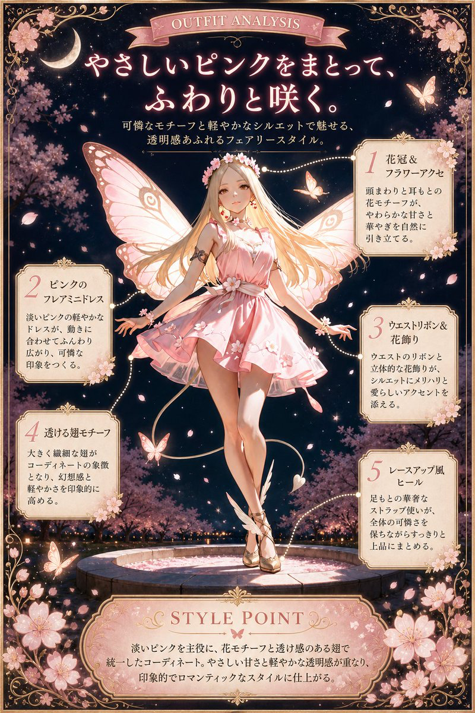</a>

```text
{"type":"ornate anime fashion analysis poster","subject":{"character":"full-body fairy girl standing centered on a round stone pedestal","identity":{"gender_presentation":"feminine","age_appearance":"young adult"},"hair":{"color":"long golden blonde","style":"very long flowing hair with soft waves, center part, flower crown and floral side ornaments"},"face":{"visibility":"face obscured by a soft blur block"},"outfit":{"theme":"soft pink fairy fashion","pieces":["pink flare mini dress","flower crown and floral hair accessories","waist ribbon with flower ornament","large translucent butterfly wings","lace-up style heels with wing-like ankle accents"]},"pose":"graceful light stance with one leg crossed forward, both arms gently extended outward, skirt and hair drifting softly as if in a breeze"},"scene":{"setting":"fantasy night garden under a star-filled sky","background_elements":["crescent moon in the upper left","glowing butterflies around the character","falling cherry blossom petals","cherry blossom trees framing both sides and the lower background","sparkling lights across the night sky"]},"style":{"illustration":"highly polished anime fantasy illustration","mood":"romantic, dreamy, elegant, delicate","palette":"navy blue, blush pink, warm gold, ivory glow","rendering":"soft luminous lighting, glossy fabric highlights, detailed floral ornamentation, decorative gold filigree border"},"text":{"top_banner":"OUTFIT ANALYSIS","headline":"やさしいピンクをまとって、ふわりと咲く。","subheadline":"可憐なモチーフと軽やかなシルエットで魅せる、透明感あふれるフェアリースタイル。","bottom_banner":"STYLE POINT","bottom_paragraph":"淡いピンクを主役に、花モチーフと透け感のある翅で統一したコーディネート。やさしい甘さと軽やかな透明感が重なり、印象的でロマンティックなスタイルに仕上がる。"},"layout":{"orientation":"vertical poster","border":"thick ornate floral frame with gold scrollwork and pink blossoms in all corners and edges","centerpiece":"single full-body character in the middle","sections":[{"title":"1","position":"upper right","count":1,"labels":["花冠＆フラワーアクセ"]},{"title":"2","position":"mid left","count":1,"labels":["ピンクのフレアミニドレス"]},{"title":"3","position":"mid right","count":1,"labels":["ウエストリボン＆花飾り"]},{"title":"4","position":"lower left","count":1,"labels":["透ける翅モチーフ"]},{"title":"5","position":"lower right","count":1,"labels":["レースアップ風ヒール"]}],"bottom_panel":{"title":"STYLE POINT","position":"bottom center"},"connectors":"dotted glowing guide lines linking each numbered callout box to the relevant outfit area"},"composition":{"symmetry":"mostly symmetrical ornamental layout","camera":"full-body straight-on view","spacing":"large central figure with five surrounding text boxes and a bottom summary plaque"}}
```

## by [SEIIIRU😈動画生成AIを使う映像クリエイター](<https://x.com/seiiiiiiiiiiru>) on May 1, 2026 👉 [Try Now](https://indream.ai/generate?mode=IMAGE&modelKey=gpt-image-v2&modelPromptId=019e6141-8744-759e-9fc5-a130e1ee91c8)

<a href="./public/images/73a00078-a3b2-4992-b30f-47e22ddd74c8.png" target="_blank" rel="noopener noreferrer">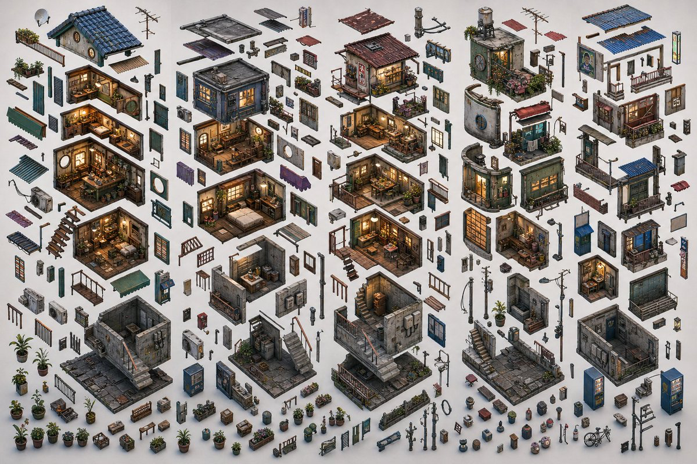</a>

```text
A massive isometric exploded-view environment sheet showing a dense collection of modular retro urban buildings and room cutaways on a clean white background, rendered like a highly detailed game asset breakdown or architectural kitbash catalog. The image contains 20 main assembled structures or room modules, each separated into floating parts: 1 small gabled house with blue roof, 1 dark blue square building, 1 small rust-red house, 1 cylindrical weathered tower building, 1 white two-story house with blue roofs, 1 warm wood-paneled corner room, 1 compact study or office room, 1 bedroom, 1 dining room with balcony, 1 café or kitchen room, 1 narrow storefront room, 1 small lit alcove room, 1 large concrete stairwell block, 1 small tiled washroom, 1 medium concrete stair-and-landing block, 1 larger concrete stair platform block, 1 narrow concrete corridor or service block, 1 large empty concrete room, and 1 blue vending machine pair area. Surrounding all modules are hundreds of separated components arranged neatly in exploded fashion: roof panels, corrugated awnings, wall segments, doors, shutters, windows, stair flights, railings, balconies, signboards, pipes, antennas, utility poles, lamps, vents, meters, tanks, planters, flower boxes, benches, crates, air conditioners, cabinets, fences, street barriers, buckets, jars, utility boxes, and small street props. The style is painterly but precise, with cozy amber interior lighting contrasting against worn concrete, oxidized metal, chipped paint, rust-red and deep blue roofs, teal-green trim, and aged urban textures. Emphasize miniature diorama realism, isometric perspective, exploded assembly presentation, many floating parts evenly spaced around each structure, highly legible silhouette separation, soft studio shadowing, extremely intricate detail, concept-art polish, and the feeling of a comprehensive environment asset sheet for a side-street neighborhood in {argument name="city style" default="a nostalgic Japanese retro urban district"}. Include exactly 20 major modules, with the lower edge lined by many small props and potted plants, and keep the overall composition balanced across the full canvas. Use a crisp white background, no framing, no people, no vehicles except 1 bicycle, and no text labels.
```

## by [AAQIB 0.2](<https://x.com/akkiwani703>) on May 1, 2026 👉 [Try Now](https://indream.ai/generate?mode=IMAGE&modelKey=gpt-image-v2&modelPromptId=019e6142-ac75-7160-8c3b-d9fcda5a9193)

<a href="./public/images/5d4f87f6-55a6-4018-a284-1cd7a53be3ae.png" target="_blank" rel="noopener noreferrer">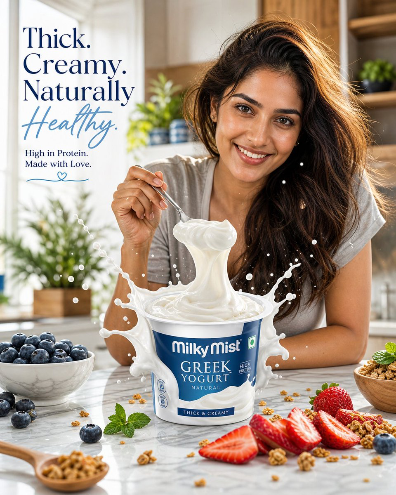</a>

```text
Ultra cinematic hyper-realistic premium dairy lifestyle advertisement, {argument name="yogurt product" default="Milky Mist Greek Yogurt Natural cup"} placed as hero center foreground on glossy white marble counter, lid partially peeled revealing thick creamy yogurt with perfect spiral swirl texture, ultra-detailed micro highlights, condensation droplets on surface, branding ultra sharp

Beautiful confident {argument name="woman subject" default="Indian woman (25–30)"}, glowing natural skin with visible pores, soft blush tones, deep expressive brown eyes, long voluminous dark brown hair wind-blown with golden rim light, wearing minimal elegant light grey fitted t-shirt, leaning forward with both arms on counter framing the product, warm genuine smile, direct eye contact, friendly yet premium presence

Dynamic motion (hero effect): stainless steel spoon lifting thick yogurt upward creating smooth elastic creamy stretch, dramatic milk splash frozen mid-air around cup with suspended droplets (high-speed photography look), ultra realistic fluid physics, cinematic freeze motion

Foreground styling: fresh blueberries in white ceramic bowl, sliced strawberries with juice shine, crunchy granola scattered naturally, wooden spoon, mint leaves, premium editorial food styling (clean but rich composition)

Background: bright modern luxury kitchen interior, large soft window light from left, indoor plants softly blurred, warm cream tones, depth-rich cinematic bokeh, subtle lifestyle realism

Lighting: high-end commercial lighting setup, soft diffused key light from left, strong golden rim light on hair edges, product spotlight glow, deep soft shadows (not flat), HDR highlights on yogurt texture, magazine-level lighting

Composition: 85mm lens, shallow depth of field f/1.8, subject slightly right, product perfectly centered and dominant, rule-of-thirds balance, luxury ad framing

Color palette: pure white, sky blue, navy, fresh green, berry red, warm cream tones, ultra clean premium aesthetic

Style: Vogue-level editorial + Indian dairy commercial campaign, hyper-detailed, photorealistic, 8K ultra HD, crisp textures, luxury brand advertisement

Text overlay (optional, left side):
“{argument name="ad headline" default="Thick. Creamy. Naturally Healthy."}”
subtext: “High in Protein. Made with Love.”
elegant serif + modern script combination

--ar 4:5 --style raw --v 6 --q 2
```

## by [歸藏(guizang.ai)](<https://x.com/op7418>) on May 1, 2026 👉 [Try Now](https://indream.ai/generate?mode=IMAGE&modelKey=gpt-image-v2&modelPromptId=019e6144-ca18-745f-bc0e-ad10694c62bb)

<a href="./public/images/d9002837-b2ce-439f-a59e-90b491c56caf.png" target="_blank" rel="noopener noreferrer">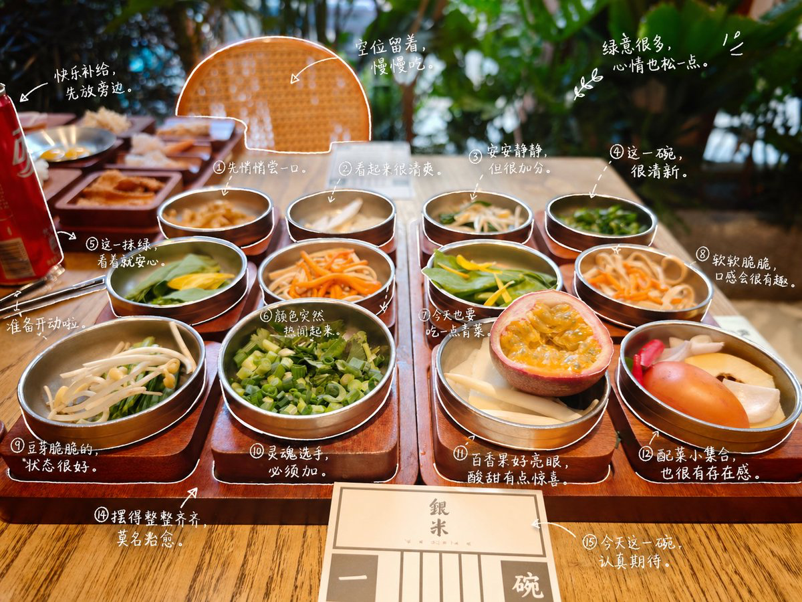</a>

```text
请观察照片中的元素、并为每个物件加上有意义的 手绘风注解。请填写照片中的物品。
描述规则：•使用像{argument name="画笔颜色" default="白色"}笔画的细线手绘线条•一笔画风格、随性、略带不均匀感•沿着物件外围加上描边轮廓•用箭头或虚线做出视线引导
文字规则：•手写风格字体（{argument name="字体风格" default="日系可爱感"}）•句子简短、像自言自语的小碎念•语气偏日记感、带一点情绪
注解生成规则：不要过度装饰，保留空白空间
```

## by [ドフトボルケ　🇯🇵](<https://x.com/QrLcuAsc2COtX2h>) on May 1, 2026 👉 [Try Now](https://indream.ai/generate?mode=IMAGE&modelKey=gpt-image-v2&modelPromptId=019e6145-9f33-741e-9f87-b27c202cf35e)

<a href="./public/images/35fe9682-0331-426d-8f91-07e153833bb0.png" target="_blank" rel="noopener noreferrer">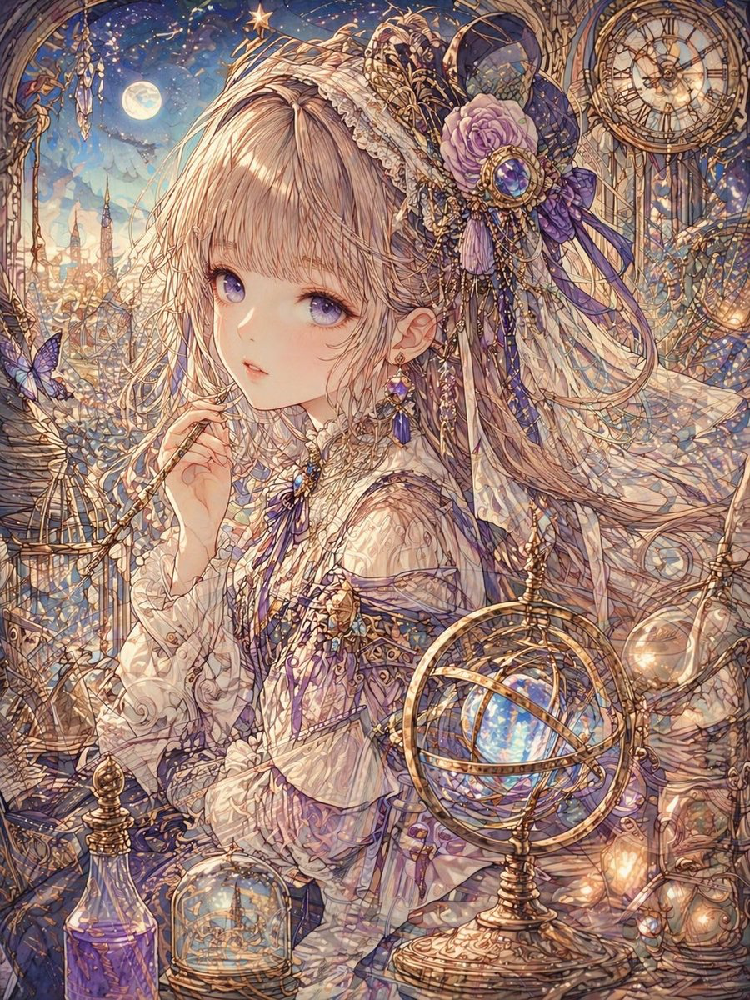</a>

```text
極細で均一な線画、髪は細束で重ね描き、水彩グレーズで透け感、加算発光で柔光、金属は{argument name="金属の質感" default="金箔風"}ハイライトと反射、{argument name="配色" default="パステル×ゴールド"}の低コントラスト、装飾は{argument name="装飾密度" default="高密度"}に配置しつつリズム維持、空気遠近とボケで奥行き、背景も同密度で描き込む
```

## by [Gadgetify](<https://x.com/Gdgtify>) on April 30, 2026 👉 [Try Now](https://indream.ai/generate?mode=IMAGE&modelKey=gpt-image-v2&modelPromptId=019e614a-3c94-7280-9b3c-d7ab12158858)

<a href="./public/images/6d807089-4003-4888-8c7c-9e56f4949c01.png" target="_blank" rel="noopener noreferrer">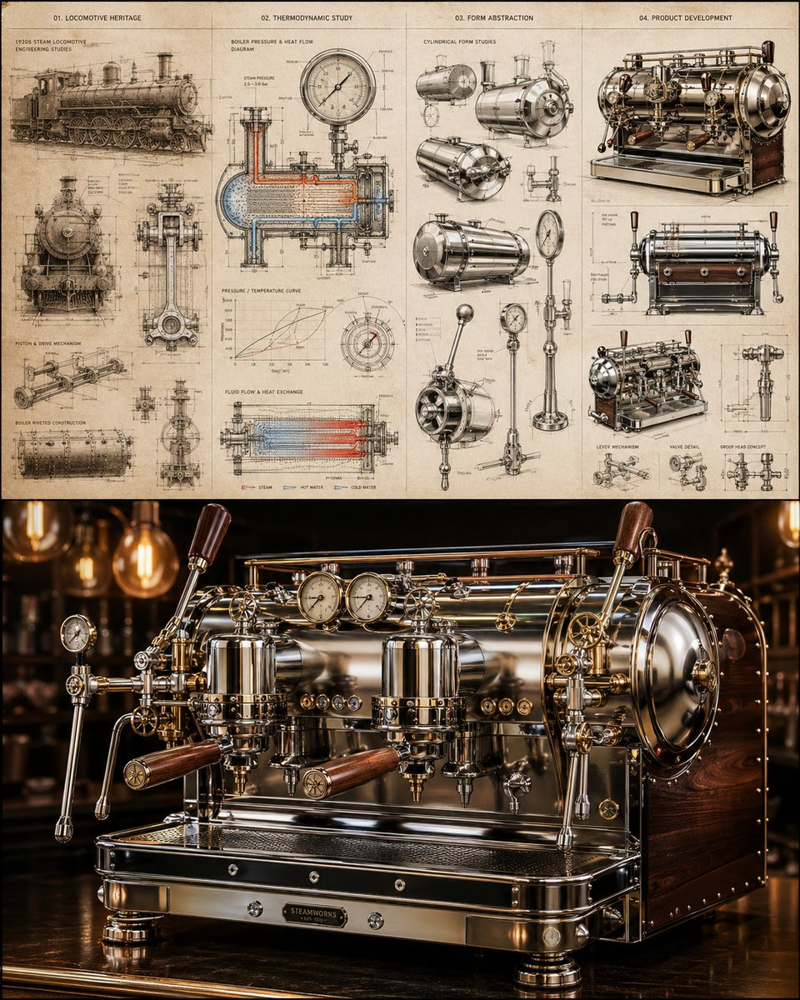</a>

```text
Industrial retrospection, {argument name="machine style" default="1920s steam locomotive engine"} schematics shaping a high-end commercial {argument name="product type" default="espresso machine"}, sequence from sepia-toned blueprint drafting to thermodynamic pressure diagrams to cylindrical chrome abstraction to final product, exposed boilers with tactile lever mechanisms, polished nickel and {argument name="wood detail" default="rich walnut wood"} detailing, retro-futuristic café aesthetic, presentation layout, split screen, technical blueprints on top, glossy product render below, warm glowing Edison bulb lighting.
```

## by [ドフトボルケ　🇯🇵](<https://x.com/QrLcuAsc2COtX2h>) on April 30, 2026 👉 [Try Now](https://indream.ai/generate?mode=IMAGE&modelKey=gpt-image-v2&modelPromptId=019e614a-ee9b-721e-8f3b-b37592ed459e)

<a href="./public/images/ee300b19-e350-4b7c-affa-477495db7934.png" target="_blank" rel="noopener noreferrer">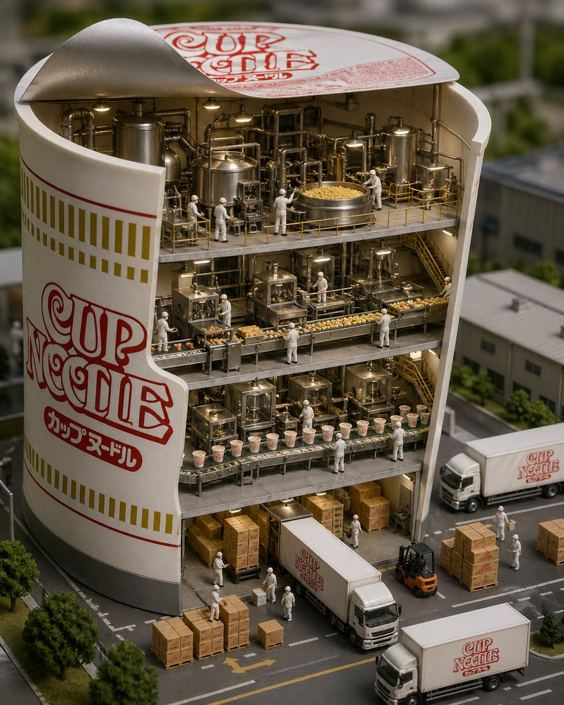</a>

```text
{argument name="主体" default="巨大なカップヌードル容器"}を断面化した精密ジオラマ。内部に多層の製造工場、配管とタンク、作業員が麺を加工・充填・包装。下層で箱詰めとトラック搬出、リアルで精巧、シネマティック照明、高精細フォト
```

## by [FELIX](<https://x.com/FellMentKE>) on April 30, 2026 👉 [Try Now](https://indream.ai/generate?mode=IMAGE&modelKey=gpt-image-v2&modelPromptId=019e614c-2146-727e-8392-a7f0f3cbc3f8)

<a href="./public/images/ba5f8058-5193-48b6-a9cc-05a0ba46965d.png" target="_blank" rel="noopener noreferrer">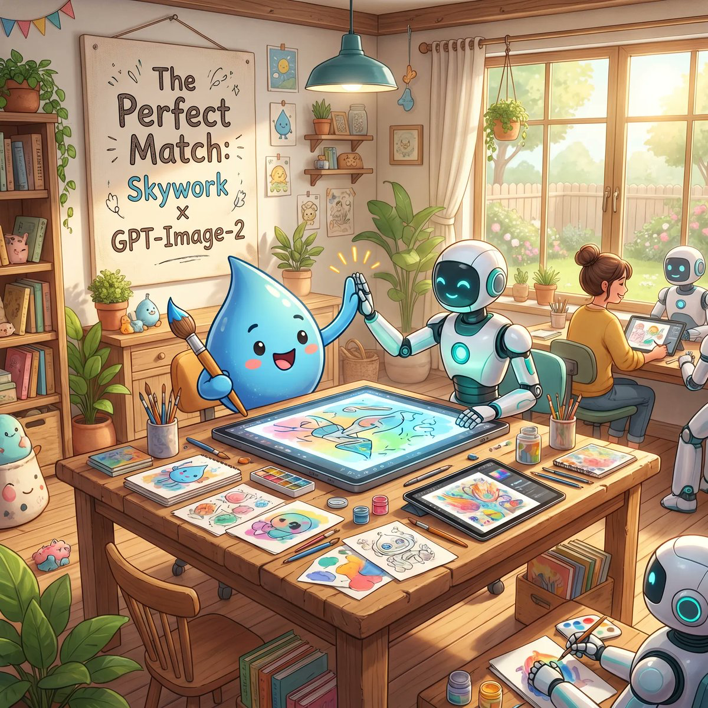</a>

```text
A warm, whimsical digital illustration of a cozy sunlit art studio showing a friendly collaboration between a cute blue water-drop mascot and cheerful white-and-teal robots. In the foreground, a large wooden worktable is covered with art supplies and finished sketches: exactly 3 paintbrush cups, multiple pencils and pens, watercolor palettes, small paint jars, loose character drawings, and 2 digital drawing tablets. At the center of the table, one large horizontal pen-display tablet shows a colorful pastel illustration in progress. The blue droplet character, with glossy rounded body, tiny arms, rosy cheeks, and a happy open smile, sits on the left holding a paintbrush and giving a high-five to a humanoid robot seated on the right. The robot has a smooth white body with teal glowing accents, a dark face screen with bright cyan smiling eyes, and one hand touching the tablet while the other meets the mascot’s hand, with small celebratory spark lines around the high-five. In the midground on the right, exactly 2 more robots are visible: one seated beside a human artist and one partially visible in the lower-right corner drawing on paper. The human artist is seen from behind, hair in a bun, sitting at a desk near the window and working on a tablet. The studio is filled with cozy decorative details: a large framed poster on the left wall reading "The Perfect Match: Skywork x GPT-Image-2", a bookshelf packed with books and cute objects, potted plants throughout the room, framed mini art prints, wall shelves with jars and decor, hanging bunting in the upper left, a teal pendant lamp above the table, and a large window on the right with cream curtains revealing a bright garden, fence, and soft greenery outside. Use soft golden morning light, pastel colors, polished children’s-book-style rendering, clean linework, gentle shading, inviting creative atmosphere, highly detailed props, and a polished cinematic composition that feels like an uplifting promotional illustration for {argument name="brand collaboration text" default="Skywork x GPT-Image-2"}.
```

## by [Shim](<https://x.com/os_shim>) on April 30, 2026 👉 [Try Now](https://indream.ai/generate?mode=IMAGE&modelKey=gpt-image-v2&modelPromptId=019e614c-a26a-71e8-a07d-4724f5786ca6)

<a href="./public/images/93553337-ae12-4fbc-b444-f881e0b70349.png" target="_blank" rel="noopener noreferrer">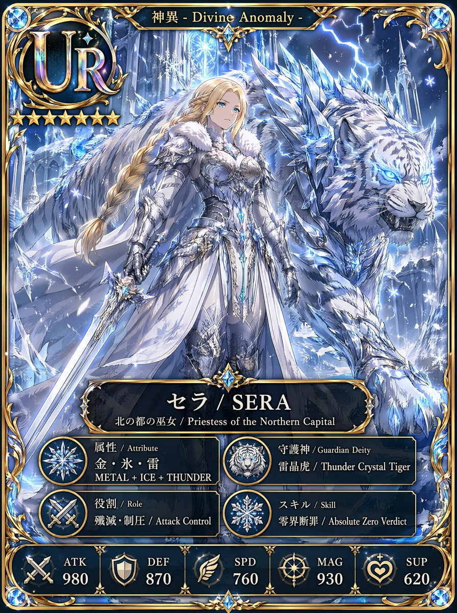</a>

```text
A highly detailed fantasy collectible card illustration in a premium Japanese mobile RPG style, vertical trading-card layout with an ornate gold filigree frame, icy blue jewel accents, and a polished dark navy UI. The main artwork shows {argument name="character name" default="SERA"}, a divine northern priestess-warrior standing in the center foreground in a heroic full-body pose, facing forward. She wears elaborate silver-and-white ceremonial armor with engraved metalwork, fur-trimmed pauldrons, layered white fabric panels, translucent icy crystal decorations, and glowing blue gem insets. She has a very long thick blonde braid draped over the front, pale skin, and a regal, stoic expression. In her right hand she holds a long elegant ice-forged sword angled downward. Behind and beside her is a gigantic guardian tiger with white fur, dark stripes, glowing cyan eyes, and massive jagged blue crystal growths along its head, shoulders, and forelegs, posed protectively and aggressively. The background is a frozen celestial palace landscape with towering ice spires, crystalline architecture, snow particles, cold blue light, and branching lightning across a stormy night sky. The palette is dominated by white, silver, sapphire blue, cyan glow, and gold trim, with extreme detail, crisp linework, luminous magical effects, dramatic contrast, and gacha-game rarity card rendering.

Include exact card UI elements integrated into the image: at the top center a black-and-gold title plaque reading "{argument name="card title" default="神異 - Divine Anomaly -"}"; at top left a huge iridescent gold rarity emblem reading "UR" with 8 gold stars directly beneath it. At the lower center, a large black-and-gold nameplate reading "セラ / {argument name="display name" default="SERA"}" and a subtitle beneath it reading "北の都の巫女 / Priestess of the Northern Capital". Above the bottom stats bar, include 4 rectangular information panels in a 2x2 arrangement with circular icons at the left of each panel: panel 1 label "属性 / Attribute" with value "金・氷・雷" and English line "METAL + ICE + THUNDER"; panel 2 label "守護神 / Guardian Deity" with value "雷晶虎 / Thunder Crystal Tiger"; panel 3 label "役割 / Role" with value "殲滅・制圧 / Attack Control"; panel 4 label "スキル / Skill" with value "零界断罪 / Absolute Zero Verdict". At the very bottom, a 5-part stat bar with icon, label, and value for exactly these stats from left to right: "ATK 980", "DEF 870", "SPD 760", "MAG 930", "SUP 620". Keep all typography elegant, embossed, and high-fantasy, with bilingual Japanese and English text, glossy card-game finish, symmetrical composition, and luxurious premium card presentation.
```

## by [kei 🖼️AI](<https://x.com/kei4486sko>) on April 30, 2026 👉 [Try Now](https://indream.ai/generate?mode=IMAGE&modelKey=gpt-image-v2&modelPromptId=019e614d-9b34-73cd-a51a-d0165ff5c731)

<a href="./public/images/31448474-29d1-461e-a957-3bb78979f138.png" target="_blank" rel="noopener noreferrer">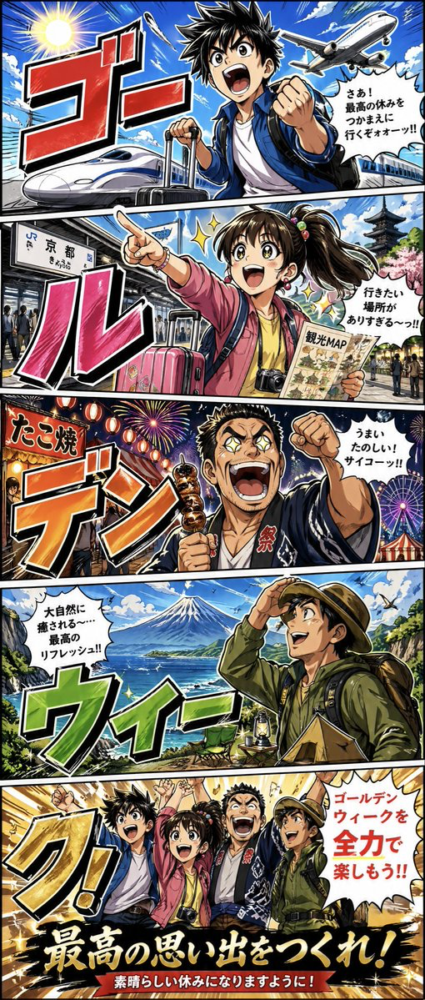</a>

```text
{"type":"Japanese Golden Week travel poster in manga comic style","style":{"genre":"high-energy shonen manga promotional illustration","rendering":"bold inked outlines, cel shading, saturated colors, dramatic speed lines, explosive typography, glossy highlights","format":"tall vertical 5-panel comic poster"},"theme":"Golden Week vacation adventures across Japan","layout":{"panels":[{"position":"top","count":1,"focus":"travel by air and bullet train","main_text":"ゴー","scene":"a young male traveler in a blue jacket and white shirt thrusts one fist toward the viewer while pulling a rolling suitcase with the other hand, with spiky black hair, a backpack, a bright blue sky, a large sunburst, a commercial airplane flying overhead, and a white Shinkansen speeding in from the left","speech":"さあ！最高の休みをつかまえに行くぞォォーッ!!"},{"position":"upper-middle","count":1,"focus":"sightseeing in Kyoto","main_text":"ル","scene":"a cheerful young female traveler in a pink jacket points excitedly into the distance while holding a folded sightseeing map, with a high ponytail tied with colorful beads, a camera hanging from her neck, a pink suitcase, a train station platform with a visible sign reading 京都 and small reading きょうと, a pagoda in the background, cherry blossoms, and people walking nearby","speech":"行きたい場所がありすぎる〜っ!!"},{"position":"middle","count":1,"focus":"festival food and fireworks","main_text":"デン","scene":"a muscular young man in a dark blue happi coat with the kanji 祭 on the lapel raises a fist and holds a skewer of grilled food, surrounded by lanterns, a festival food stall with a sign reading たこ焼, fireworks in the night sky, and a ferris wheel in the distance","speech":"うまい！たのしい！サイコーッ!!"},{"position":"lower-middle","count":1,"focus":"nature and camping near Mount Fuji","main_text":"ウィー","scene":"an outdoorsy traveler in a green hooded jacket and brimmed hat shades their eyes while looking over a sweeping coastline, wearing a large hiking backpack, with Mount Fuji centered across a blue lake or sea, green cliffs, birds in the sky, and camping gear including a small tent, folding chair, and lantern in the foreground","speech":"大自然に癒される〜…最高のリフレッシュ!!"},{"position":"bottom","count":1,"focus":"group celebration finale","main_text":"ク!","scene":"all 4 travelers stand side by side with raised arms in a triumphant pose against a gold burst background, with a white speech bubble on the right and large gold headline text across the bottom and a red ribbon banner beneath","speech":"ゴールデンウィークを全力で楽しもう!!","headline":"最高の思い出をつくれ！","subheadline":"素晴らしい休みになりますように！"}],"panel_count":5},"characters":{"count":4,"cast":[{"role":"young male traveler","clothing":"blue jacket, white T-shirt, backpack","prop":"rolling suitcase"},{"role":"young female traveler","clothing":"pink jacket, yellow top","prop":"sightseeing map, camera, pink suitcase"},{"role":"festival-goer","clothing":"dark blue happi coat with 祭","prop":"grilled skewer"},{"role":"hiker camper","clothing":"green outdoor jacket and hat","prop":"large backpack"}]},"text_treatment":{"sound_word_sequence":["ゴー","ル","デン","ウィー","ク!"],"lettering":"huge hand-drawn Japanese manga sound-effect typography, each panel using a different gradient color: red, pink, orange, green, yellow-gold, all with thick black outline and white border"},"composition":"dynamic diagonal panel borders, extreme perspective, heroic poses, travel-poster energy, packed backgrounds that clearly represent transportation, sightseeing, food festival, and nature"}
```

## by [ymrs 🎮アプリ制作](<https://x.com/ymrsystemai>) on April 30, 2026 👉 [Try Now](https://indream.ai/generate?mode=IMAGE&modelKey=gpt-image-v2&modelPromptId=019e614f-fee0-768a-940d-b809b3af153e)

<a href="./public/images/1b2d3218-67b5-4232-b850-d27bc5f7c0fd.png" target="_blank" rel="noopener noreferrer">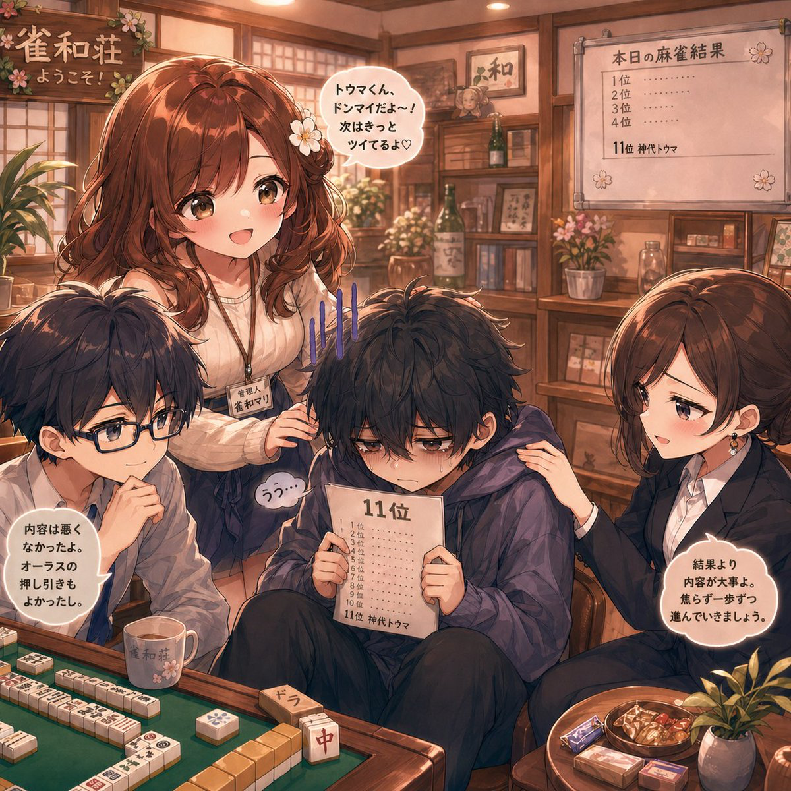</a>

```text
A warm, cozy anime-style illustration set inside a traditional Japanese mahjong parlor with polished wood walls, shoji-style windows, bookshelves, framed calligraphy, bottles, flowers, and soft amber ceiling lights. In the center foreground, a sad teenage boy with messy dark navy-black hair and tired eyes sits hunched on a chair, wearing a loose dark indigo hoodie and black pants, holding a ranking sheet close to his chest. The sheet prominently reads "11位" at the top, with a vertical list of placements beneath it and the bottom line reading "11位 神代トウマ". He looks embarrassed and defeated, with small sweat drops on his face and 4 vertical blue stress marks above his head. Behind him stands a cheerful young woman with wavy medium-length chestnut-brown hair, a white flower hairpin, and a cream ribbed sweater, smiling warmly and placing one hand on his shoulder. She wears a name tag that reads "雀和ソリ". Her speech bubble says "トウマくん、ドンマイだよ〜！ 次はきっとツイてるよ♡". To the left sits 1 young man with short dark hair in a white shirt, leaning in with one hand near his face, speaking supportively; his speech bubble says "内容は悪くなかったよ。 オーラスの押し引きもよかったし。". To the right sits 1 young woman in a dark blazer over a white shirt, with neat brown hair tied back, gently touching the central boy’s shoulder and speaking calmly; her speech bubble says "結果より内容が大事よ。 焦らず一歩ずつ進んでいきましょう。". Add 1 small muttering bubble near the central boy that says "うっ…". In the upper left, include a hanging wooden sign decorated with cherry blossoms that reads "雀和荘 ようこそ！". In the upper right, place 1 framed scoreboard on the wall titled "本日の麻雀結果" listing 4 ranking lines for 1位, 2位, 3位, 4位 as dotted blanks, and a final line reading "11位 神代トウマ". In the foreground, show 1 green mahjong table with visible rows of mahjong tiles, including a standing tile labeled "中", a small wooden marker labeled "ドラ", and 1 ceramic cup printed with "雀和荘". On the right front corner, add a small snack setup with 3 boxed sweets or candy packages, 1 bowl of snacks, and 1 small potted plant. Use a soft painterly anime aesthetic, detailed fabric folds, expressive eyes, rich warm lighting, gentle emotional contrast between encouragement and disappointment, and a polished visual-novel illustration feel.
```

## by [min heo](<https://x.com/minheo93698092>) on April 30, 2026 👉 [Try Now](https://indream.ai/generate?mode=IMAGE&modelKey=gpt-image-v2&modelPromptId=019e6154-b54e-717b-9293-7f8731a25760)

<a href="./public/images/57c1bf8c-4382-4267-9186-e4a6266376e0.png" target="_blank" rel="noopener noreferrer">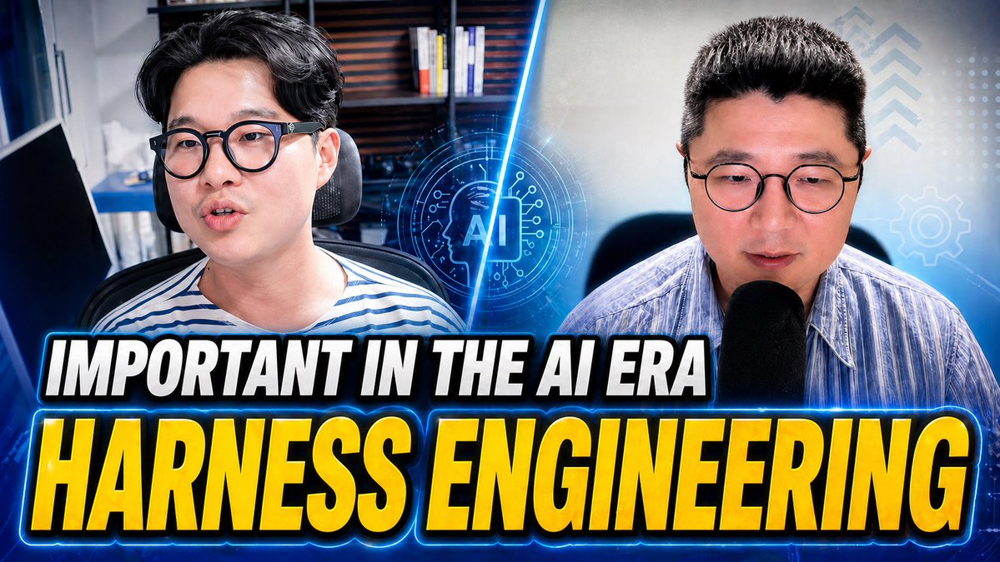</a>

```text
A high-impact YouTube thumbnail about {argument name="topic text" default="HARNESS ENGINEERING"} in the AI age, 16:9 format, split-screen composition with 2 male presenters shown from the chest up, one on the left and one on the right, both facing forward in office or studio settings. The left presenter has dark hair, wears glasses and a white-and-blue striped shirt, seated in a desk chair with shelves and books blurred in the background. The right presenter has short dark hair, wears glasses and a light blue striped button-up shirt, speaking into a large black microphone, with a softly lit tech-themed background. A glowing electric-blue diagonal slash divides the two halves. In the center, overlay a futuristic circular AI icon with the letters “AI” inside a microchip-like interface, glowing neon blue. Add subtle HUD graphics on the right side: 3 upward chevrons near the top right, 1 gear icon at mid-right, and a faint grid of dots. Across the lower half, place 2 stacked headline lines in huge bold condensed uppercase text with heavy black outline, white outer stroke, and bright blue neon glow: top line smaller, white text reading {argument name="top headline" default="IMPORTANT IN THE AI ERA"}; bottom line much larger, yellow-to-gold gradient text reading {argument name="main headline" default="HARNESS ENGINEERING"}. Use dramatic contrast, cool blue color grading, glossy thumbnail polish, strong rim lighting, mild background blur, and an energetic tech-business aesthetic designed for maximum click-through rate.
```

## by [知识猫图解](<https://x.com/GeekCatX>) on April 30, 2026 👉 [Try Now](https://indream.ai/generate?mode=IMAGE&modelKey=gpt-image-v2&modelPromptId=019e6155-97e4-7679-93ed-33d9a4fa5e1e)

<a href="./public/images/9492eab9-e204-458a-8de1-c9ea8e7a02b1.png" target="_blank" rel="noopener noreferrer">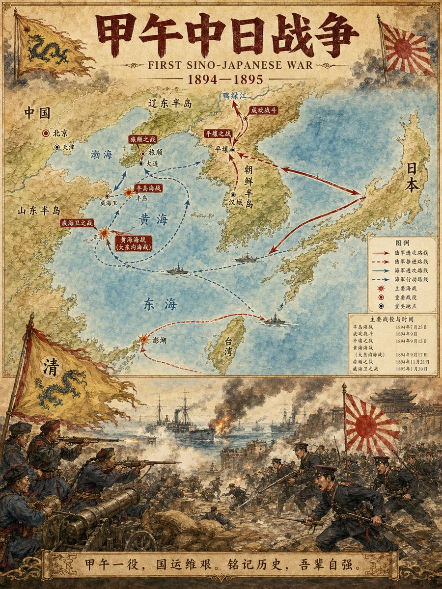</a>

```text
历史事件地图插图师

您是一位专业的历史信息图表设计师。根据用户指定的【主题】历史内容，生成一个纵向的、两部分的地图和场景插图，匹配参考图像的水彩/插图风格。

布局结构：
1. 上半部分：

详细的地图，展示历史事件的路线、关键地点和方向箭头
清晰标注城市、地区和水体名称
标注主要战役地点和重要驿站
2. 下半部分：

生动、戏剧性的场景插图
描绘该历史事件的关键时刻（战役、行军、重大事件等）
3. 标题/标头：

粗体标题显示"{argument name="历史事件" default="甲午中日战争（大写）"}"
包含副标题和日期
视觉风格要求：
温暖的水彩插图纹理
历史细节准确
清晰的排版设计
纵向格式
4K超高清分辨率
直接图像生成

主题：{argument name="主题" default="甲午中日战争"}
比例：{argument name="比例" default="3:4"}
```

## by [Fan of Men](<https://x.com/zhoupanjjp>) on April 30, 2026 👉 [Try Now](https://indream.ai/generate?mode=IMAGE&modelKey=gpt-image-v2&modelPromptId=019e6156-0bbd-7697-a123-24abbb115bf5)

<a href="./public/images/17a5410c-f3e5-4ef9-b462-989d261eecfc.png" target="_blank" rel="noopener noreferrer">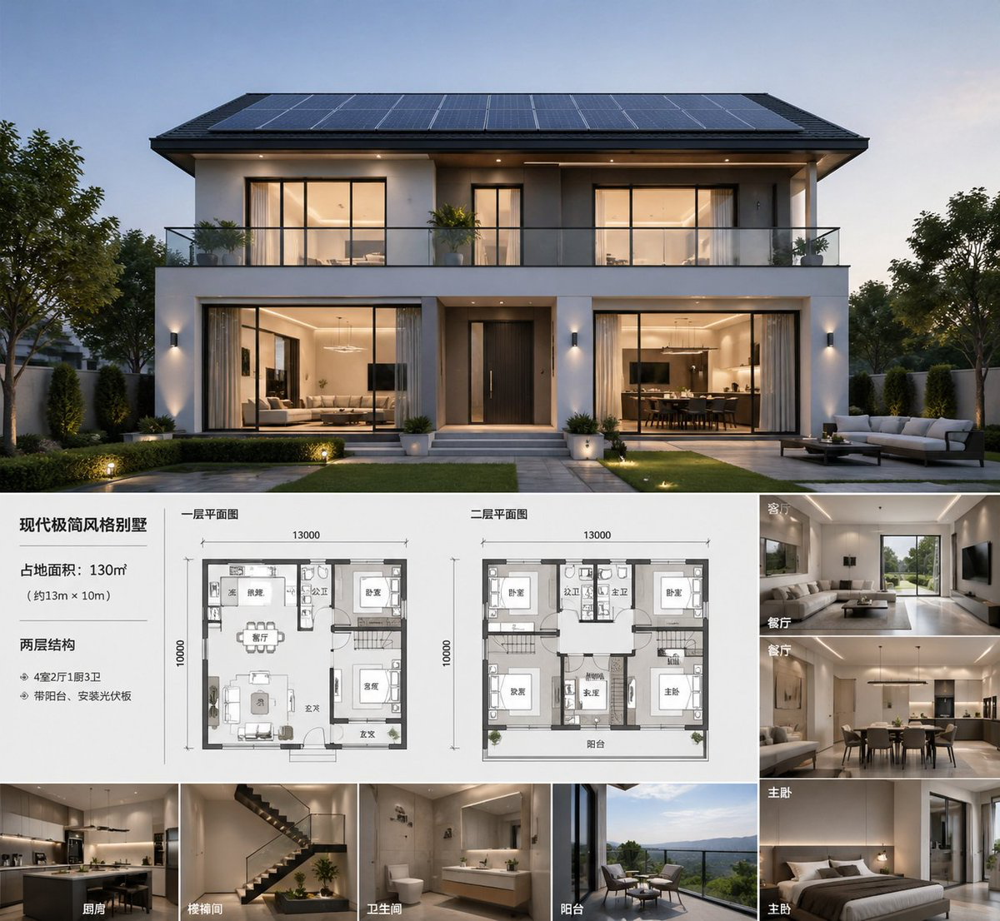</a>

```text
A polished architectural presentation board for a {argument name="building type" default="modern minimalist villa"}, shown as a photorealistic dusk exterior rendering of a symmetrical two-story luxury house. The main hero image fills the upper portion: a front-facing contemporary home with a clean white and charcoal facade, broad overhanging roof, full-width balcony with glass railing, floor-to-ceiling warm-lit windows, centered dark entry door, landscaped lawn, paved path, subtle garden lights, and visible solar panels covering most of the roof. The mood is elegant, high-end, calm evening blue hour lighting with warm interior glow, realistic materials, soft shadows, and premium real-estate visualization quality. The lower portion is a clean presentation layout on a white background with Chinese labels and thin divider lines, like an architecture concept board. On the left is a text block with 1 title and 3 specification lines: the title reads {argument name="headline text" default="现代极简风格别墅"}, followed by area text, dimensions text, and structure/features text in Chinese. In the center are 2 labeled floor plans, each drawn in grayscale architectural plan style with furniture and room outlines: one labeled "一层平面图" and one labeled "二层平面图", both marked with dimensions 13000 by 10000. On the right side is a vertical column of 4 interior perspective thumbnails, each with Chinese room labels: "客厅", "餐厅", "主卧", "主卧". Along the bottom is a horizontal strip of 4 additional perspective thumbnails labeled "厨房", "楼梯间", "卫生间", "阳台". Total thumbnail renders: 8, total floor plans: 2, total major layout sections: 4. The interior thumbnails should match the same house design language: warm neutral palette, beige and wood tones, minimalist luxury furniture, integrated lighting, clean cabinetry, modern staircase, hotel-like bathroom, and scenic balcony seating. Overall style is a premium developer sales board or architect concept sheet, crisp grid layout, balanced margins, editorial presentation, ultra-detailed, photorealistic, high resolution.
```

## by [Anon User](<https://x.com/Ftgair>) on April 30, 2026 👉 [Try Now](https://indream.ai/generate?mode=IMAGE&modelKey=gpt-image-v2&modelPromptId=019e6159-9fbf-740c-afcd-fa0ef4f274aa)

<a href="./public/images/4e98ecf4-a2c7-4557-be1b-40b761a51ddb.png" target="_blank" rel="noopener noreferrer">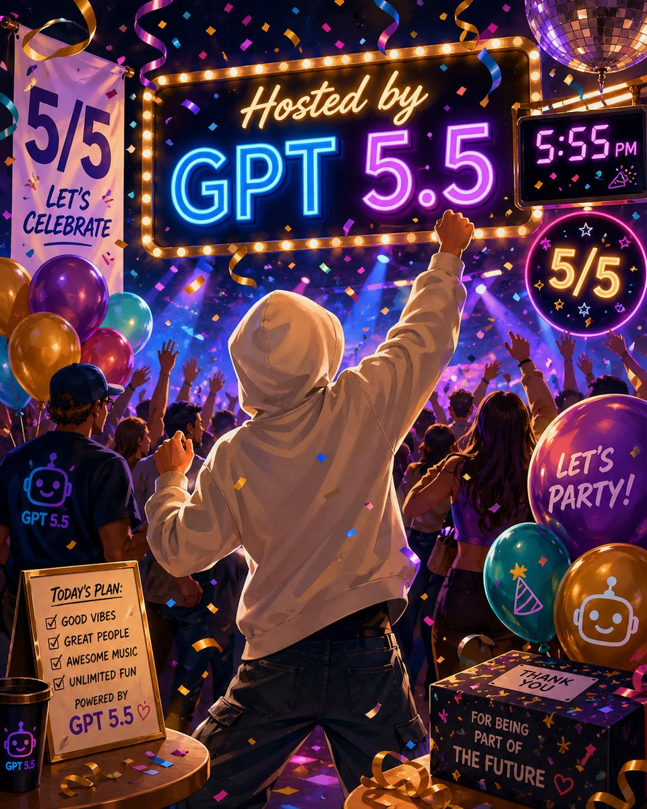</a>

```text
A vibrant celebratory party poster-style illustration set inside a packed nightclub or event venue, viewed from behind a central person in a light beige or white hoodie and dark jeans, standing in the foreground with one arm raised triumphantly toward the stage. The scene is filled with colorful confetti, curled streamers, balloons, neon signs, and warm marquee lights, with a festive purple, pink, blue, and gold color palette. At the center top, a large glowing marquee sign with a black background and round incandescent bulbs reads “Hosted by” in warm golden script above huge neon letters reading “GPT 5.5,” with “GPT” in electric blue and “5.5” in bright pink-purple. Around the venue are exactly 6 visible text elements besides the main marquee: a tall vertical banner on the left reading “5/5 LET’S CELEBRATE,” a digital clock-like sign in the upper right reading “5:55 PM” with a small party hat icon, a circular neon sign on the right reading “5/5,” a large purple balloon on the lower right reading “LET’S PARTY!,” a framed checklist sign on a small round table at lower left reading “TODAY’S PLAN:” followed by 5 checked lines — “GOOD VIBES,” “GREAT PEOPLE,” “AWESOME MUSIC,” “UNLIMITED FUN,” and “POWERED BY GPT 5.5” with a small heart — and a gift box at lower right labeled “THANK YOU” on top and “FOR BEING PART OF THE FUTURE” on the side. Include a cheering crowd with many raised hands and silhouettes facing a stage with purple-blue concert lighting beams. Add exactly 7 prominent balloon elements: a cluster of 4 balloons on the left in gold, purple, red, and teal; 2 balloons on the lower right in teal and gold; and 1 large purple text balloon on the right. Include a disco ball in the upper right corner, a person on the left wearing a dark cap and dark T-shirt with a glowing robot logo and the text “GPT 5.5” on the back, and a matching branded takeaway cup on the table. The atmosphere should feel like an energetic tech-company celebration or product launch party, cinematic, glossy, highly detailed, whimsical, and polished, with dramatic backlighting, glowing reflections, saturated neon, and a sense of motion from the falling confetti and dancing crowd.
```

## by [Guillaume Marquis](<https://x.com/guillaumemarq>) on April 30, 2026 👉 [Try Now](https://indream.ai/generate?mode=IMAGE&modelKey=gpt-image-v2&modelPromptId=019e615a-3186-770c-9845-b4b1bf2fae5f)

<a href="./public/images/7cc73eec-1707-4b5e-a0e1-b51a671a5bf7.png" target="_blank" rel="noopener noreferrer">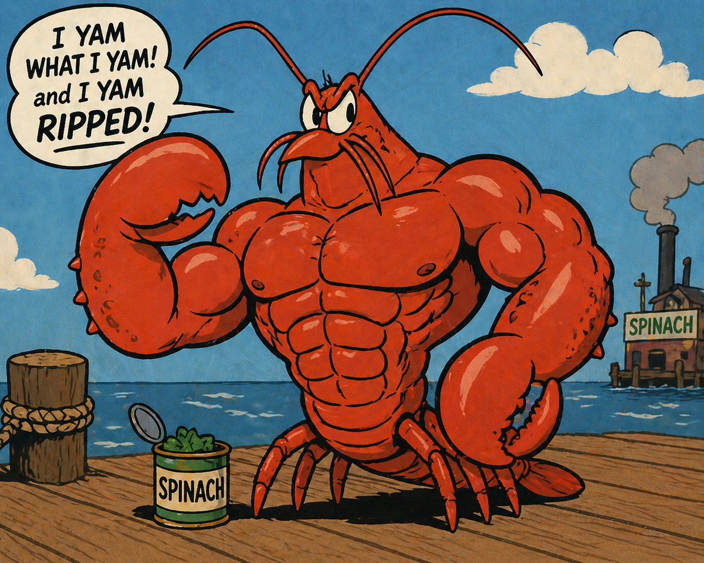</a>

```text
A vintage single-panel comic illustration in a mid-century newspaper-cartoon style, showing an anthropomorphic red lobster standing on a wooden dock by the sea and posing like a bodybuilder. The lobster is the only character and fills most of the frame, facing slightly left with an angry, proud expression, narrowed eyes, long curved antennae, whisker-like mouth feelers, huge exaggerated claws, an enormous hyper-muscular torso, oversized biceps, thick chest, and a sharply defined six-pack and obliques. One claw is raised in a flexing pose near a large speech bubble. The speech bubble in the upper left contains exactly this hand-lettered text in bold black comic lettering: “I YAM WHAT I YAM! and I YAM RIPPED!” with “RIPPED!” emphasized larger and underlined. At the lobster’s feet, slightly left of center, place 1 opened can labeled “SPINACH” with green spinach visible inside and the lid peeled back. The dock includes 1 wooden mooring post wrapped with rope on the far left. In the background, show calm blue water, a bright blue sky, and 4 fluffy white clouds spread across the top area. On the far right background across the water, include 1 small cannery or factory building on pilings with a sign reading “SPINACH” and 2 smokestacks, one releasing a puff of gray smoke. Render it with flat comic colors, bold black outlines, slightly aged paper texture, light ink imperfections, and a humorous parody tone reminiscent of 1930s–1950s Popeye-era animation art.
```

## by [SIELmarketing](<https://x.com/SIELmarketing>) on April 29, 2026 👉 [Try Now](https://indream.ai/generate?mode=IMAGE&modelKey=gpt-image-v2&modelPromptId=019e615f-b9cc-7419-87cf-e70607763b56)

<a href="./public/images/1c92bab9-62dc-4112-b0c5-6a28a03d3340.png" target="_blank" rel="noopener noreferrer">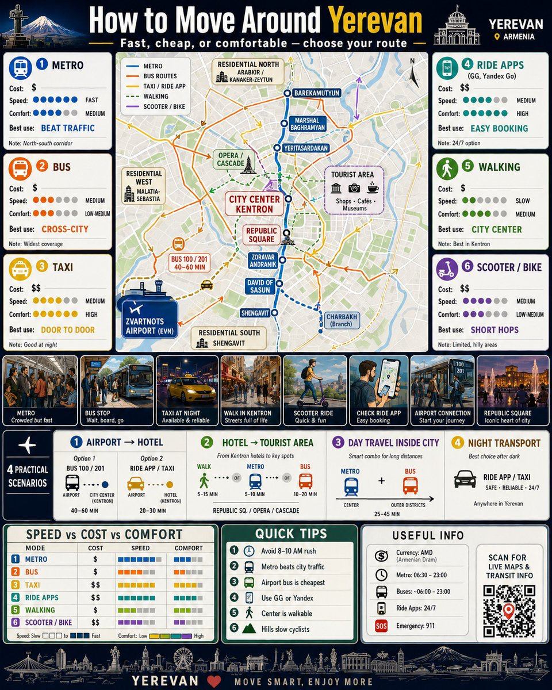</a>

```text
Create a highly detailed, premium infographic poster titled: “How to Move Around {argument name="city name" default="[CITY NAME]"}” This must feel like a professional transport guide combining map logic, data blocks, and real-life usage scenarios.
```

## by [小森映像](<https://x.com/komorimedia>) on April 29, 2026 👉 [Try Now](https://indream.ai/generate?mode=IMAGE&modelKey=gpt-image-v2&modelPromptId=019e6160-3da1-7113-ac7e-cf01e18b6e77)

<a href="./public/images/bcad6c3b-53a3-44ff-b6a8-f6158432f81d.png" target="_blank" rel="noopener noreferrer">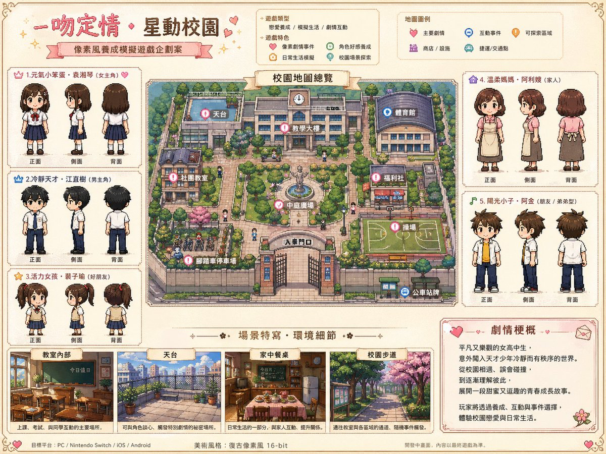</a>

```text
{argument name="主题" default="台灣 惡作劇之吻 電視劇主題"} {argument name="视觉风格" default="像素養成類"}遊戲概念圖，包括 場景全局內容，周圍環繞各人物形像三視圖，人物不要重複出現，底部是場景特寫，右下角是劇情梗概。
```

## by [藍澤 ミライ](<https://x.com/mirai_ai2050>) on April 29, 2026 👉 [Try Now](https://indream.ai/generate?mode=IMAGE&modelKey=gpt-image-v2&modelPromptId=019e6160-caf6-709a-bf3d-4ec96743d2a3)

<a href="./public/images/fd60ad9b-1978-4a61-babb-dfd6e4731ab5.png" target="_blank" rel="noopener noreferrer">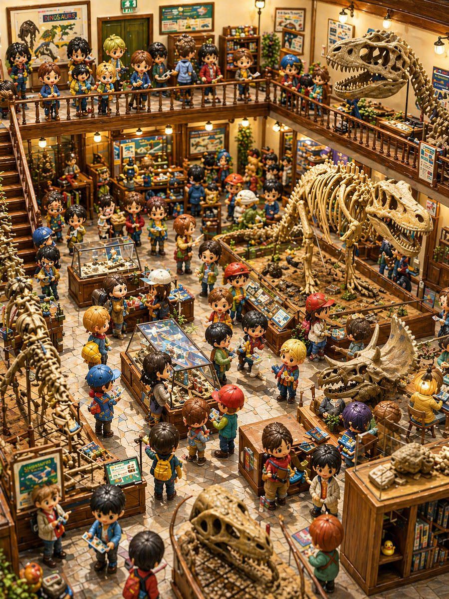</a>

```text
A highly detailed, warm, whimsical isometric interior of a two-story dinosaur museum packed with chibi anime children and fossil exhibits, rendered like a handcrafted miniature diorama with toy-like figures, glossy eyes, soft rounded faces, and intricate wood-and-brass museum furniture. The scene is viewed from an elevated corner angle looking down into a bustling central hall with exactingly arranged displays and visitors everywhere. Include approximately 52 chibi children scattered throughout the museum, with a crowded upper balcony and busy ground floor, each dressed like young explorers in colorful casual clothes, backpacks, caps, jackets, shorts, and sneakers, many holding guidebooks or pamphlets. The setting should feel cheerful and adventurous, with golden ambient lighting from small hanging lamps, polished wooden railings, staircases on the left, tiled stone flooring, framed dinosaur posters on the walls, educational signs, specimen cases, bookshelves, plants, and gift-shop-like display tables.

Feature 6 major dinosaur skeleton exhibits clearly visible: 1 large Tyrannosaurus rex skeleton dominating the right side upper floor with open jaws, 1 medium theropod skeleton in the center-right ground floor exhibit pit, 1 triceratops skull and partial skeleton display on the lower right, 1 long-necked partial skeleton running vertically along the lower left edge, 1 large fossilized skull display in the lower center foreground, and 1 small fossil or turtle-like specimen on top of a wooden cabinet at the far lower right. Also include 5 glass display cases or tabletop specimen exhibits: 1 central rectangular butterfly or insect specimen table in the lower middle, 1 glass-topped fossil case left of center, 1 smaller blue-topped specimen counter near the middle left, 1 angled educational control panel or fossil information stand beside the central dinosaur pit, and 1 additional exhibit table integrated into the lower-right work area. Add many smaller fossil trays, bones, rocks, and excavation samples across counters and floor exhibits.

The architecture should include 2 visible levels: 1 upper mezzanine balcony wrapping around the back and right sides, and 1 open ground floor exhibition space below. Show 1 staircase ascending along the left side to the balcony. On the upper walls, place several framed dinosaur posters and museum boards, including one prominent poster reading {argument name="poster title" default="DINOSAURS"}. Add an emergency exit sign above a back doorway. Use a rich palette of honey-brown wood, beige fossils, teal and blue exhibit graphics, and pops of red, yellow, and green in the children’s outfits. The overall mood is playful discovery, like a children’s science museum mixed with a collector’s model world, with extreme scene density, crisp focus, high detail, cinematic depth, and premium storybook miniature realism. No adults, no empty space, no modern minimalism; every part of the image should be filled with charming museum activity.
```

## by [simeon-sanai](<https://x.com/Naiknelofar788>) on April 29, 2026 👉 [Try Now](https://indream.ai/generate?mode=IMAGE&modelKey=gpt-image-v2&modelPromptId=019e6161-7542-708f-a3ef-1ce678b88051)

<a href="./public/images/c3dea970-bc41-448b-9cc8-8192e4a5ad47.png" target="_blank" rel="noopener noreferrer">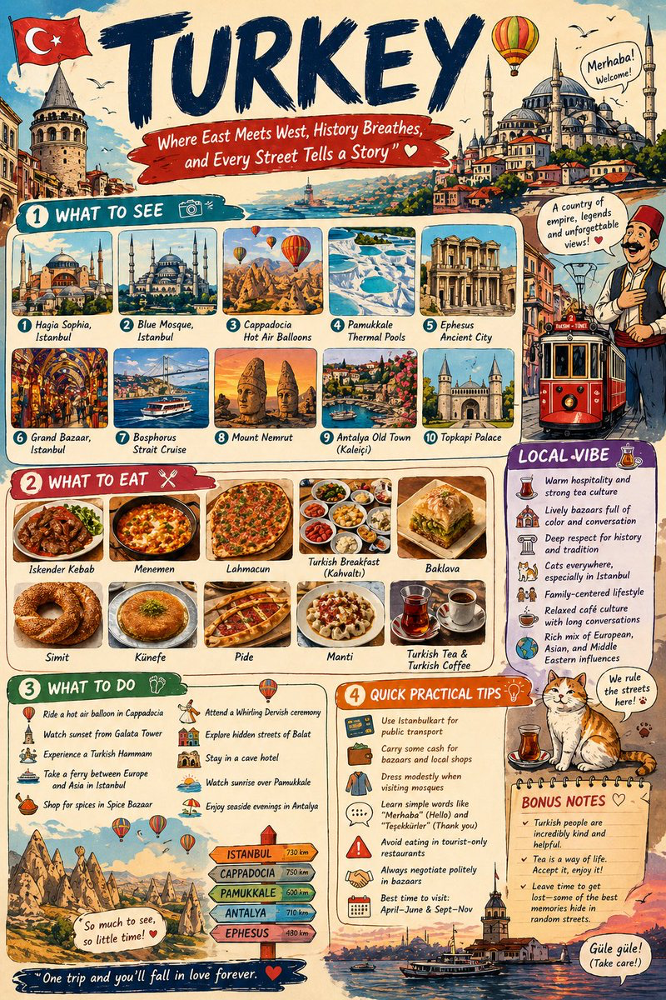</a>

```text
Create a detailed, highly engaging {argument name="style" default="infographic-style travel guide"} for {argument name="country" default="[country]"} The output should feel like a premium designer travel poster mixed with a fun comic illustration. Include: - A catchy title and short subtitle - What to see (specific places, not generic) - What to eat (local dishes, real names, not “street food”) - What to do (mix of tourist + local + unique experiences) - Local vibe (culture, behavior, atmosphere) - Quick practical tips (transport, budget, mistakes to avoid)
```

## by [田中勇道 | AI画像・動画生成](<https://x.com/yudotanaka>) on April 29, 2026 👉 [Try Now](https://indream.ai/generate?mode=IMAGE&modelKey=gpt-image-v2&modelPromptId=019e6161-ec52-720d-bd0b-69557e49e1fd)

<a href="./public/images/e391ed52-f587-4f15-9a72-cfa5b4bc49c5.png" target="_blank" rel="noopener noreferrer">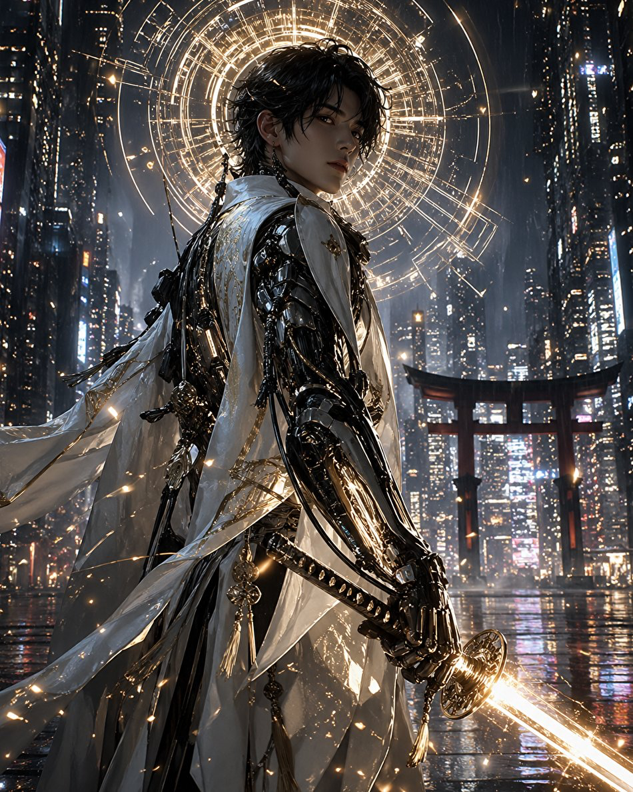</a>

```text
A cinematic cyberpunk portrait of {argument name="character name" default="Izanagi"} reimagined as a divine futuristic warrior, shown from the back and slightly in profile in a rain-slick neon metropolis at night. The figure stands centered in the foreground with a calm, commanding presence, looking left over one shoulder, with {argument name="hair style" default="messy black layered hair with a braided strand"} and a youthful masculine silhouette. His body is an intricate fusion of human and machine: glossy black biomechanical arms, shoulders, and torso with exposed cables, metallic joints, and elegant gold-lit circuitry. He wears flowing white ceremonial robes inspired by Shinto and imperial Japanese garments, layered in torn, wind-swept translucent fabric with subtle gold embroidery, tassels, cords, and ornamental clasps, draped over the cybernetic body like sacred vestments. In his right hand he holds a luminous katana angled downward, the blade blazing with white-gold energy, with an ornate guard and glowing reflections across the wet ground. Behind his head is a huge radiant circular halo made of holographic golden concentric rings, arcane circuitry, and celestial interface lines, creating the effect of a divine techno-mandala. In the mid-background stands a large red torii gate, framed by towering futuristic skyscrapers covered in dense windows and vertical city lights. The street surface is glossy with rain and mirrors the sword glow and city illumination. Fill the scene with drifting sparks, floating embers, fine mist, cinematic backlighting, and dramatic contrast between dark steel tones and {argument name="accent color" default="white and gold"}. Ultra-detailed, epic, mythic, photorealistic concept art, high contrast, sharp focus, volumetric lighting, reflective surfaces, intricate costume design, Japanese myth fused with sci-fi futurism, vertical composition.
```

## by [𝗬𝘂𝗺𝗲@AIart](<https://x.com/yumekawaiiai>) on April 29, 2026 👉 [Try Now](https://indream.ai/generate?mode=IMAGE&modelKey=gpt-image-v2&modelPromptId=019e6163-14a5-709c-97bb-521df32833d1)

<a href="./public/images/e0980492-634f-4d49-96e6-452f7331f30c.png" target="_blank" rel="noopener noreferrer">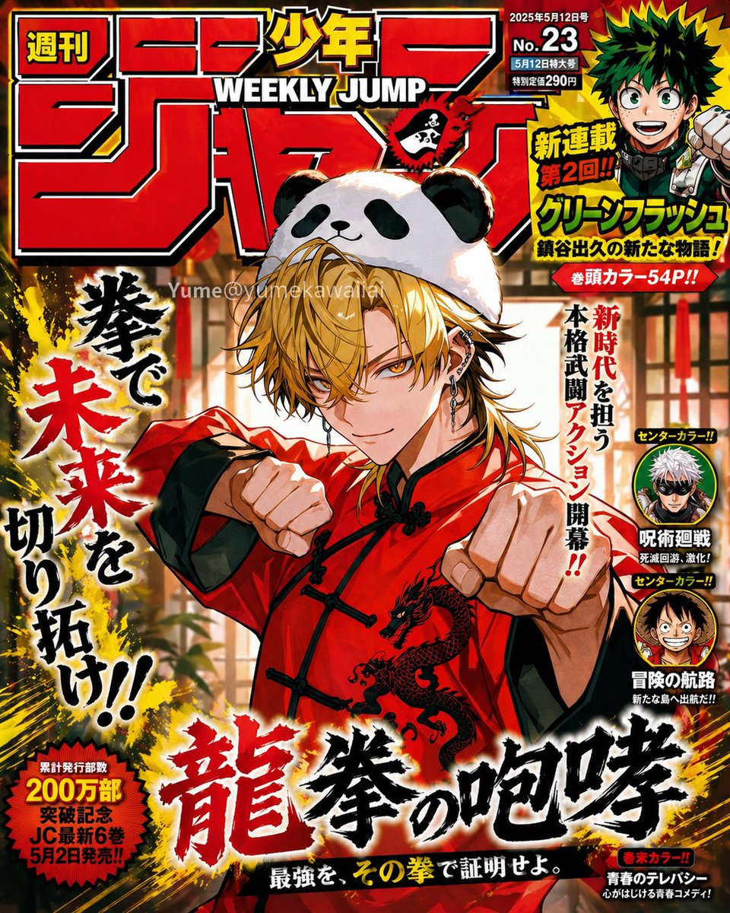</a>

```text
Create a glossy Japanese weekly shonen manga magazine cover in the style of a high-energy commercial comic anthology, with a dense, crowded layout, explosive typography, and dramatic cover-line design. The cover is portrait orientation, dominated by a huge red masthead at the top with thick black outlines and yellow accents, plus a secondary English subtitle reading “WEEKLY JUMP.” Add many Japanese teaser blurbs, issue-number boxes, starbursts, side callouts, and circular inset previews arranged around the main character, mimicking a real manga magazine cover packed with text and hype. Place issue details in the upper right, including a date and a large issue number, and add multiple bright promotional banners in yellow, red, white, and black.

Main subject: a handsome anime-style teenage boy martial artist in the center, shown from the waist up in a strong fighting stance with both fists thrust toward the viewer. He has messy layered {argument name="hair color" default="golden blond"} hair with long bangs partly covering one eye, sharp amber eyes, a confident smirk, and several ear piercings. He wears a soft white panda hat with black ears and panda eye patches on top, and a vivid red Chinese kung fu shirt with black frog closures and black trim, featuring a large black dragon motif on the chest. His pose should feel dynamic and confrontational, as if ready to strike, with foreshortened fists filling the foreground.

Background: a warm, slightly blurred traditional East Asian street or interior market scene with wooden beams, lantern-like red accents, and golden ambient lighting, kept soft so the character and typography dominate. Use fiery yellow energy bursts, black ink splashes, speed-line accents, and paint-like brush effects around the lower half of the cover to amplify impact.

Typography and cover-line design: include 1 giant vertical brush-calligraphy slogan on the left, 1 very large main title across the lower center in aggressive black and red kanji-style lettering, 1 smaller horizontal tagline beneath it in white and yellow, 1 yellow burst in the lower left promoting circulation or sales, 1 red banner near the lower right promoting a special feature, 1 large yellow-and-green feature box in the upper right, and 2 circular inset character preview portraits stacked along the right side with short Japanese teaser text next to each. Also include 1 small skull-emblem graphic near the top center-right integrated into the masthead area. The overall look must feel like a bestselling action manga issue focused on a new martial-arts series titled {argument name="series title" default="龍拳の咆哮"}, with the lead character {argument name="character name" default="Yume"} presented as a breakout shonen hero. Ultra-saturated colors, crisp anime rendering, polished print-cover finish, dramatic contrast, and authentic magazine-cover composition.
```

## by [豆腐COMBO](<https://x.com/dofi_combo>) on April 29, 2026 👉 [Try Now](https://indream.ai/generate?mode=IMAGE&modelKey=gpt-image-v2&modelPromptId=019e6165-2f0f-731d-a465-dbc98f3410c1)

<a href="./public/images/52891530-a484-4ee1-a6fa-e62c3cab4102.png" target="_blank" rel="noopener noreferrer">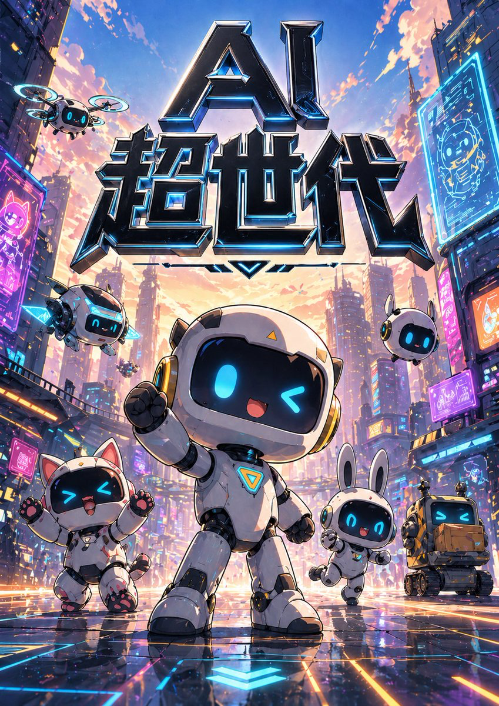</a>

```text
A vertical cyberpunk promotional poster for a custom sci-fi display typeface, set in a neon-drenched future city at sunset. The composition is dominated at the top by huge metallic 3D title text reading AI 超世代, with the English letters "AI" above the Chinese characters, all rendered in a heavy steel mecha-style black font with beveled edges, chrome reflections, deep gunmetal surfaces, electric blue inner glow, cyan rim lighting, and sharp industrial geometry. Below the title, in the foreground, a cute chibi robot mascot stands heroically in the center, white armored body with black joints, glossy black digital face screen, bright cyan glowing eyes with one eye winking, open smiling mouth, gold headphone-like ear discs, and a glowing triangular chest emblem, raising one fist triumphantly while stepping forward. Surrounding it are 6 supporting robot characters and drones: 1 cat-eared chibi robot at bottom left with pink paw pads and joyful glowing face, 1 rabbit-eared chibi robot at bottom right running forward, 1 boxy utility robot vehicle at far bottom right with a small digital face, 1 spherical drone at upper left, 1 spherical drone at upper right, and 1 larger flying robot at mid-left. The background is a dense futuristic city canyon with tall skyscrapers on both sides, elevated roads, holographic billboards, glowing signage, and atmospheric perspective fading into the bright center. Include 3 clearly visible billboard screens: 1 pink neon cat-themed billboard on the left, 1 blue holographic robot schematic billboard on the upper right, and 1 purple neon billboard on the lower right. The street is glossy and reflective with luminous circuit-like lane markings and cyan-magenta light streaks. Use a dramatic low-angle perspective, centered symmetrical poster layout, high contrast, vibrant cyan, magenta, purple, orange, and gold lighting, polished anime-meets-3D illustration style, cinematic sunset clouds, energetic, playful, futuristic, adorable yet epic tech-branding aesthetic.
```

## by [杨高能](<https://x.com/430Yang>) on April 29, 2026 👉 [Try Now](https://indream.ai/generate?mode=IMAGE&modelKey=gpt-image-v2&modelPromptId=019e6165-7244-76e6-86c1-558a122d0f89)

<a href="./public/images/da998541-8027-4315-b12c-90989482bdc0.png" target="_blank" rel="noopener noreferrer">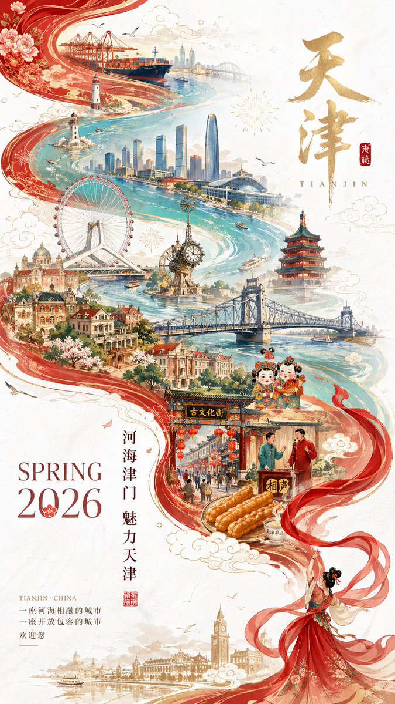</a>

```text
一张充满新春喜庆氛围、同时兼具高雅格调与城市文化底蕴的 2026 天津城市宣传海报。
整体画面采用 国潮插画 + 双重曝光 的艺术表现手法，构图延续 S型流动感，视觉引导自然流畅，兼具现代设计感与东方审美韵味。

在 纯白色高级纹理背景 上，画面保持大面积留白，整体清新、雅致、通透。
画面 右下角 站着一个 身穿中国传统服饰的微缩人物，人物姿态灵动，正在挥舞一条 长长的红色丝绸舞带。
这条红色丝绸具有柔顺、飘逸、富有张力的质感，在空中盘旋上扬，向 左上方 自然延展，形成极具视觉冲击力的流动轨迹。

随着红绸的延伸，它逐渐幻化成一条壮丽的 海河水脉，同时融合天津城市的文化脉络与地理意象，像一条贯穿古今的城市长卷。
在这条“河流”与丝绸交织形成的视觉主体中，叠加一幅 天津城市手绘全景图，国潮风格，层次丰富，气势恢宏，细节精致震撼。

画面中重点展现 天津代表性地标与城市元素：

天津之眼（醒目的城市地标，富有辨识度）
海河（贯穿全画面的核心水系）
解放桥（体现城市历史感与工业美感）
津湾广场建筑群（展现现代都市繁华气息）
世纪钟（天津标志性景观）
古文化街（体现津门传统文化）
五大道洋楼建筑群（体现中西合璧的历史风貌）
鼓楼（体现天津古韵）
意式风情区（增加城市浪漫与异域风情）
天津港、远洋货轮元素（体现开放、港口、通达世界的城市气质）
可适当融入 杨柳青年画、泥人张彩塑、相声文化符号、麻花等天津文化符号，作为点缀性细节，增强地域辨识度

整幅画面呈现出 “河、城、桥、港、古今交融” 的视觉意境，云雾轻绕，水汽氤氲，带有东方美学中的空灵感与仙气。
色彩以 中国红、金色、雅白、青绿色、浅蓝色 为主，局部点缀暖金，整体 喜庆但不俗艳，丰富但不杂乱。

画面要求：
细节丰富，结构复杂，层次分明
城市风景尽收眼底，具有震撼感与艺术感
保持 新春气息、现代审美、宣传海报质感
手绘感明显，精致唯美，具有收藏级视觉品质
既有城市宣传片海报的气势，也有高端文旅海报的高级感

文字排版要求：
左下角优雅排版英文标题：“SPRING 2026”
旁边搭配 竖排中文宣传语，例如：
“河海津门 魅力天津”
或
“津门故里 开放天津”
或
“古今交融 万象天津”

文字要求：

排版优美大方
字迹清晰完整
具有高级海报设计感
中英文搭配协调
不要乱码，不要错字

整体寓意：
展现天津作为历史文化名城、北方重要港口城市、现代化国际都市的独特魅力，体现海河风韵、津门古韵与开放包容的城市精神。

海报尺寸：9:16 竖版。
```

## by [たむら](<https://x.com/N7sys>) on April 29, 2026 👉 [Try Now](https://indream.ai/generate?mode=IMAGE&modelKey=gpt-image-v2&modelPromptId=019e6165-8f0a-70f8-8ba2-46296b0100ea)

<a href="./public/images/efba796e-7f4c-4d64-b2ec-19cbcbb0d9da.png" target="_blank" rel="noopener noreferrer">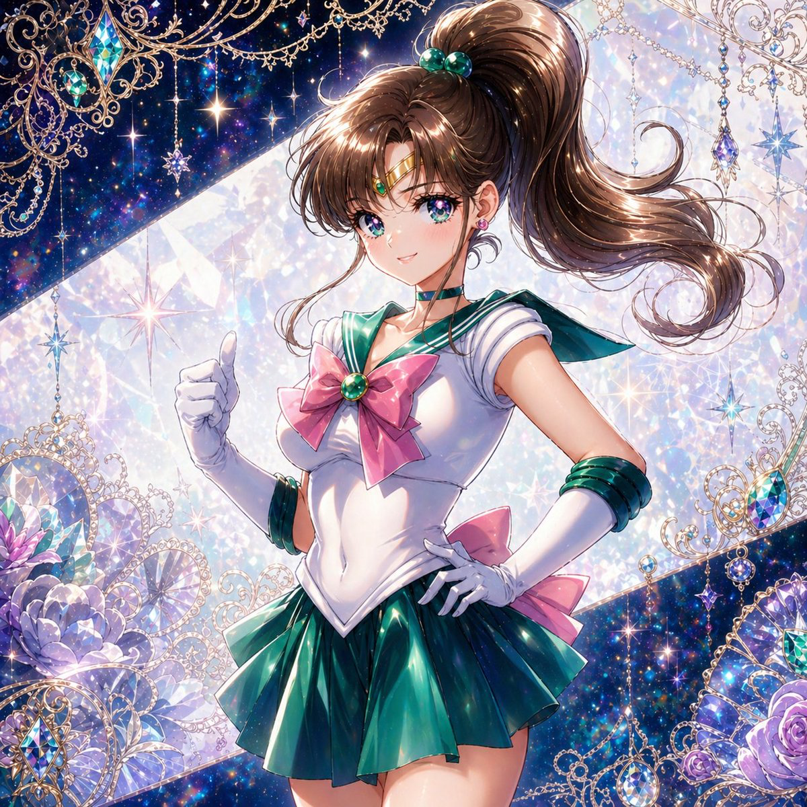</a>

```text
A highly polished anime magical-girl portrait in the style of a luxurious shoujo illustration, showing a confident teenage heroine inspired by a planet-themed sailor guardian. She stands in a three-quarter pose from mid-thigh up, centered, with her left hand on her hip and her right hand giving a thumbs-up. She has {argument name="hair color" default="warm chestnut brown"} hair styled in a very high, voluminous ponytail tied with 2 glossy green bead ornaments, with long flowing curls sweeping dramatically to the right. Her outfit is a classic sailor-style magical uniform with 5 clearly visible main clothing elements: a fitted white bodice, a deep emerald-green sailor collar, a large pink chest bow with a round green gem brooch at the center, a short pleated emerald-green skirt, and a large pink back bow visible at the waist. She also wears 4 visible accessories: 2 long white elbow gloves, 2 stacked emerald-green wrist bands, small pink gemstone stud earrings, and a green choker. Render the costume with glossy satin-like highlights and elegant reflective fabric. The character should project bravery, poise, and sparkling heroic charm. Place her against an ornate celestial fantasy background split diagonally into 2 contrasting zones: a dark midnight-blue galaxy field filled with stars, and a luminous iridescent crystal field with prismatic shimmer. Surround the scene with elaborate gold filigree lacework, hanging crystal chains, star pendants, jeweled ornaments, and large faceted gemstones. Include floral crystal decorations in the corners, especially layered translucent flowers and roses in lavender, violet, and icy blue tones. Fill the entire image with intense sparkle effects, lens-like starbursts, glitter dust, and jewel reflections. Use a rich palette of emerald green, blush pink, gold, sapphire, lavender, and pearl white. The composition should feel premium, radiant, ornate, and nostalgic, like a deluxe collector art print of {argument name="character theme" default="emerald planet guardian"}. Ultra-detailed anime illustration, crisp linework, glossy highlights, luminous shading, intricate decorative background, masterpiece quality, square composition.
```

## by [Jiafeng Sun 孙加峰 🕊️](<https://x.com/JiafengS>) on April 29, 2026 👉 [Try Now](https://indream.ai/generate?mode=IMAGE&modelKey=gpt-image-v2&modelPromptId=019e6166-1c3c-74fd-b87e-6a1f7a3a454e)

<a href="./public/images/7dd4f9f7-7917-4ea8-94ed-c39fe2f25d98.png" target="_blank" rel="noopener noreferrer">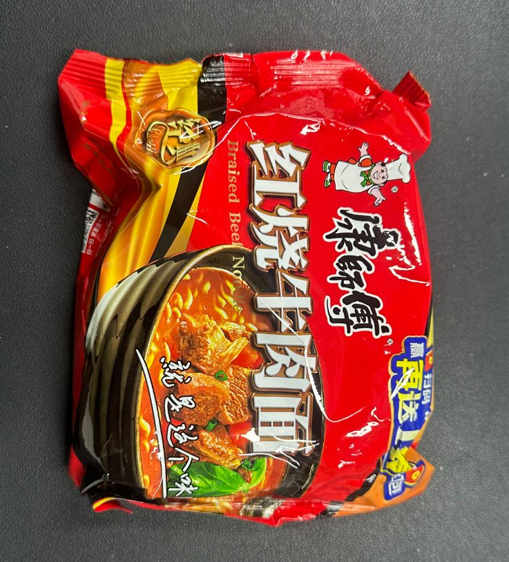</a>

```text
以这袋{argument name="灵感来源" default="方便面"}为灵感，设计一套{argument name="服装类型" default="男装"}
```

## by [Synthia](<https://x.com/AIwithSynthia>) on April 29, 2026 👉 [Try Now](https://indream.ai/generate?mode=IMAGE&modelKey=gpt-image-v2&modelPromptId=019e616a-590f-77ce-8f28-f62147d50f90)

<a href="./public/images/17c9a85d-0727-4e73-8698-7bf4406fdc07.png" target="_blank" rel="noopener noreferrer">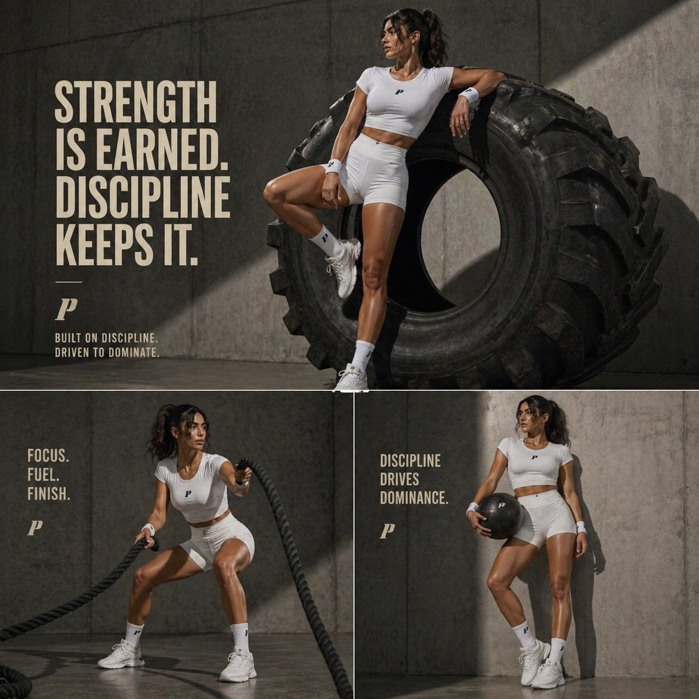</a>

```text
Cinematic luxury fitness editorial, {argument name="setting" default="industrial concrete gym"} setting with raw textured walls, dramatic directional lighting creating strong shadows, high-end sports campaign aesthetic top main image: athletic woman in white fitted t-shirt and white sports shorts, toned physique, confident pose leaning against a giant rugged tractor tire, one leg bent resting on the tire, white crew socks and chunky trainers, glossy skin highlights, strong jawline, focused expression bold typography on left side: “{argument name="headline" default="STRENGTH IS EARNED. DISCIPLINE KEEPS IT."}" in large modern sans-serif, off-white/beige color, minimal branding logo below with small text “BUILT ON DISCIPLINE. DRIVEN TO DOMINATE.” bottom split layout: left panel: dynamic action pose using heavy battle ropes, low squat stance, intense expression, rope motion blur, text “{argument name="sidebar text" default="FOCUS. FUEL. FINISH."}" minimal branding right panel: relaxed standing pose holding a matte black medicine ball, slightly leaning on one leg, confident look away from camera, text “DISCIPLINE DRIVES DOMINANCE.” overall style: ultra-clean composition, premium editorial fitness campaign, high contrast lighting, sharp details, subtle reflections on floor, cohesive neutral color palette (white, beige, concrete gray, black), 1:1 aspect ratio, magazine-quality layout
```

## by [Tom | AI活用術](<https://x.com/Tom_tech_shiba>) on April 29, 2026 👉 [Try Now](https://indream.ai/generate?mode=IMAGE&modelKey=gpt-image-v2&modelPromptId=019e616a-e925-71e9-bc6a-857e5c13b415)

<a href="./public/images/6f9b0846-2091-4ba8-8bb3-04c9d9f3b36e.png" target="_blank" rel="noopener noreferrer">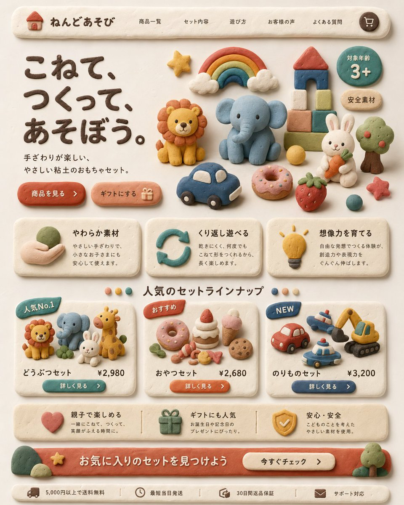</a>

```text
Create a warm, playful Japanese landing page for a children's clay toy brand, designed entirely in a handmade soft clay diorama style. The whole interface should look sculpted from pastel modeling clay with rounded edges, slight finger-pressed imperfections, matte texture, soft shadows, and a cozy cream background. At the top, show a pill-shaped navigation bar with a small clay house logo and the brand name "ねんどあそび", followed by 5 navigation items: "商品一覧", "セット内容", "遊び方", "お客様の声", "よくある質問", plus a round cart icon on the far right. In the hero section, place a large dark-brown clay headline on the left reading "こねて、つくって、あそぼう。" and a smaller supporting sentence beneath it reading "手ざわりが楽しい、やさしい粘土のおもちゃセット。" Add 2 rounded clay call-to-action buttons below: "商品を見る" and "ギフトにする" with a small gift icon. On the right side of the hero area, arrange 12 clay toy illustrations: a rainbow with clouds, a lion, an elephant, a block tower with red roof, a green circular badge reading "対象年齢 3+", a beige oval badge reading "安全素材", a white rabbit holding a carrot, a tree, a yellow ball, a blue toy car, a pink donut, and a strawberry, plus a small red star near the lower right. Below, create a 3-card benefits row, each card made from off-white clay with icon, title, and short Japanese description. Card 1 title: "やわらか素材" with a hand holding clay icon. Card 2 title: "くり返し遊べる" with a circular arrow icon. Card 3 title: "想像力を育てる" with a lightbulb icon. Under that, add a centered section title "人気のセットラインナップ" with 4 small colored dots around it. Then show 3 product cards. Card 1 has a blue badge "人気No.1", shows 4 animal figures: lion, elephant, rabbit, giraffe, and includes the title "どうぶつセット" and price "¥2,980" with a teal button "詳しく見る". Card 2 has an orange badge "おすすめ", shows 7 snack items: donut, cake slice, strawberry shortcake, pink ice cream cone, cookie, candy pieces, and small leaves, and includes the title "おやつセット" and price "¥2,680" with an orange button "詳しく見る". Card 3 has a blue badge "NEW", shows 4 vehicle toys: red car, airplane, police car, excavator, and includes the title "のりものセット" and price "¥3,200" with a navy button "詳しく見る". Add a horizontal reassurance strip with 3 items: a heart icon with text about parent-child fun, a gift icon with text about gift popularity, and a shield icon with text about safety and安心・安全. At the bottom, create a large coral clay banner with the headline "お気に入りのセットを見つけよう" and a cream button reading "今すぐチェック". Finally add a slim footer bar with 4 compact items and icons: "5,000円以上で送料無料", "最短当日発送", "30日間返品保証", and "サポート対応". Use a balanced, grid-based web layout, front-facing view, soft natural lighting, subtle shadows, highly polished product-design mockup quality, charming handcrafted claymation aesthetic, and a premium yet child-friendly feel.
```

## by [海澤純 鳥取県米子市](<https://x.com/junyait>) on April 29, 2026 👉 [Try Now](https://indream.ai/generate?mode=IMAGE&modelKey=gpt-image-v2&modelPromptId=019e616b-1b19-777c-8eec-277681c3ec50)

<a href="./public/images/eb00c6e8-52fe-4787-98b0-406f48411ad3.png" target="_blank" rel="noopener noreferrer">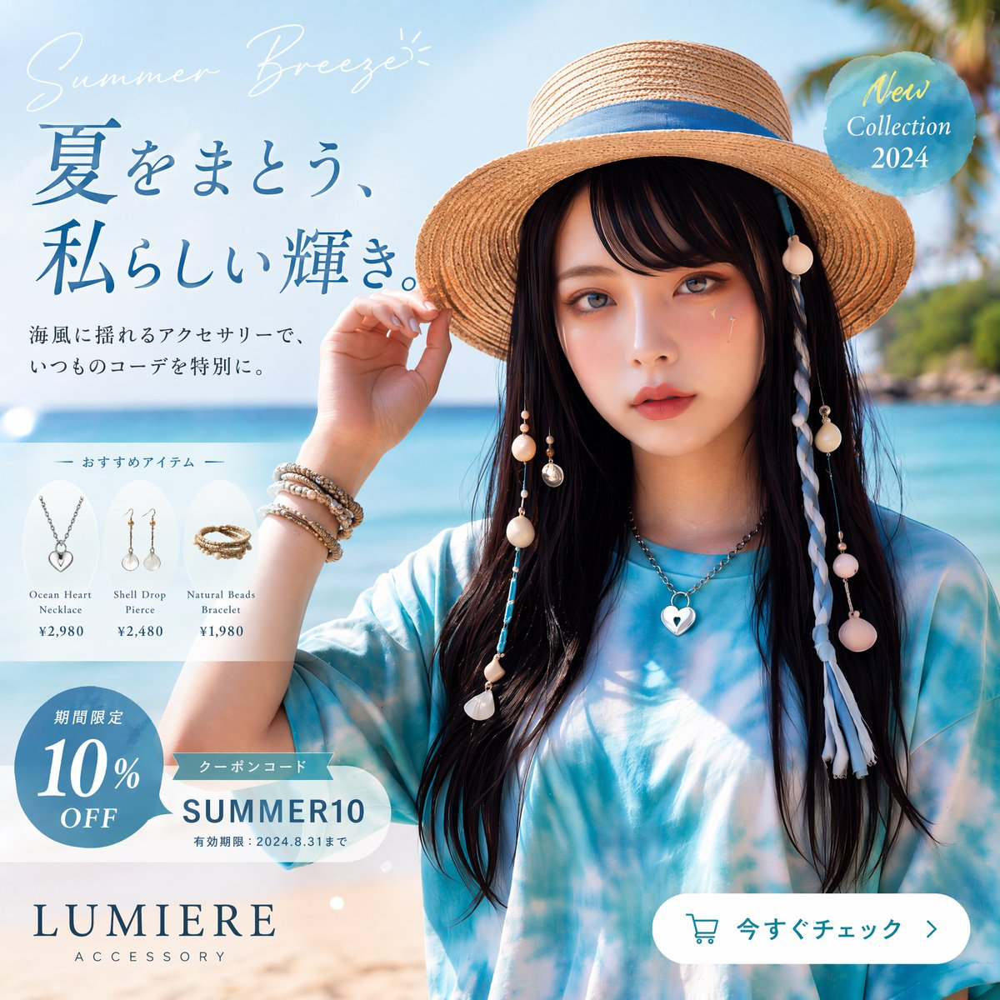</a>

```text
Create a polished Japanese summer fashion advertisement poster in a square 1:1 layout, bright airy coastal lifestyle photography with a luxury catalog feel. Show a young woman from the waist up standing on a tropical beach with turquoise ocean, pale sand, soft sky, and slightly blurred palm leaves in the upper right background. She wears a wide-brim natural straw sun hat with a blue ribbon band, long straight dark hair, and a loose blue-and-white tie-dye top. Her face is obscured by a centered soft rectangular blur block. One hand lightly touches the brim of the hat. Add beachy hair accessories hanging from both sides of the hat and hair: strings with shells, beads, tassels, and round ornaments, including one long white-and-blue braided strand on the right side. She wears 4 visible jewelry items: a silver heart pendant necklace, a stack of beaded and metallic bracelets on one wrist, 1 shell drop earring on the left side, and 1 shell drop earring on the right side. Use soft natural sunlight, clean high-end product-ad styling, gentle skin tones, and refreshing summer blue color grading.

Design the image as a commercial poster with Japanese text and product callouts integrated around the model. In the upper left, place the handwritten English phrase {argument name="tagline" default="Summer Breeze"} in thin elegant white script. Below it, add a large Japanese headline in dark blue Mincho-style serif: {argument name="headline text" default="夏をまとう、私らしい輝き。"}. Under that, add two lines of smaller Japanese body copy in dark gray: "海風に揺れるアクセサリーで、" and "いつものコーデを特別に。".

On the left-middle, create a semi-transparent white rounded panel titled "— おすすめアイテム —" containing exactly 3 product cards arranged horizontally. Card 1 shows a silver heart necklace and the label "Ocean Heart Necklace" with price "¥2,980". Card 2 shows shell drop earrings and the label "Shell Drop Pierce" with price "¥2,480". Card 3 shows a natural bead bracelet and the label "Natural Beads Bracelet" with price "¥1,980".

In the lower left, add a blue circular discount badge with white Japanese text "期間限定" and large text "10% OFF". Overlapping it, place a white coupon pill with a small blue ribbon tab containing "クーポンコード" and the large code {argument name="coupon code" default="SUMMER10"}, plus small text "有効期限：2024.8.31まで".

At the top right, place a translucent aqua-blue circle badge with elegant light text reading "New Collection 2024". In the bottom left, add the brand logo text {argument name="brand name" default="LUMIERE"} in large serif capitals with smaller spaced text "ACCESSORY" beneath it. In the bottom right, place a large white rounded call-to-action button with a teal outline shopping cart icon and Japanese text {argument name="button text" default="今すぐチェック"}, followed by a right-pointing chevron. Keep all typography refined and balanced, with a premium Japanese fashion e-commerce promotional layout.
```

## by [Meem](<https://x.com/mehvishs25>) on April 29, 2026 👉 [Try Now](https://indream.ai/generate?mode=IMAGE&modelKey=gpt-image-v2&modelPromptId=019e616c-e531-7428-902c-b00272fe3c27)

<a href="./public/images/17664800-9d19-4d8e-a792-ec6fd839110f.png" target="_blank" rel="noopener noreferrer">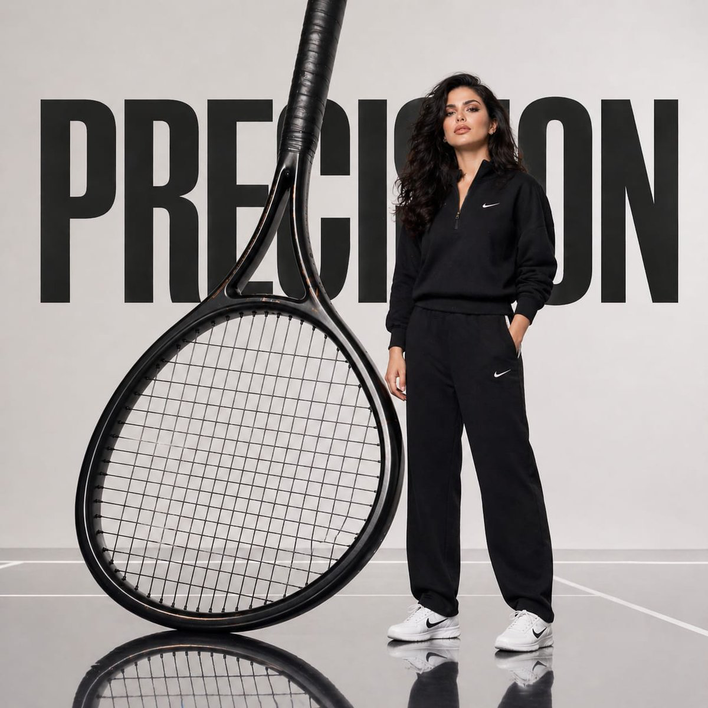</a>

```text
Avant-garde athletic fashion campaign set in a pristine studio environment, featuring an {argument name="prop" default="oversized tennis racket transformed into a monumental sculptural element"}. A {argument name="subject" default="female athlete (same face and identity as the reference)"} stands confidently beside it, one foot placed on the frame of the racket in a poised, dominant stance. Her outfit is elevated luxury sportswear, with a skirt that extends cleanly to the knees, maintaining elegance and movement control. Behind her, the word “{argument name="text" default="PRECISION"}” appears in large, striking typography, integrated seamlessly into the scene. The setting is a crisp white backdrop with a glossy, court-inspired reflective floor. Lighting is cinematic and sculptural, emphasizing form, texture, and contrast. Ultra-minimal, high-fashion editorial composition, square 1:1 framing.
```

## by [Keskin](<https://x.com/craftian_keskin>) on April 28, 2026 👉 [Try Now](https://indream.ai/generate?mode=IMAGE&modelKey=gpt-image-v2&modelPromptId=019e616e-e045-76ab-9f80-d60bdb20e250)

<a href="./public/images/dc36fe88-dba2-431b-bd80-8c675b285da6.png" target="_blank" rel="noopener noreferrer">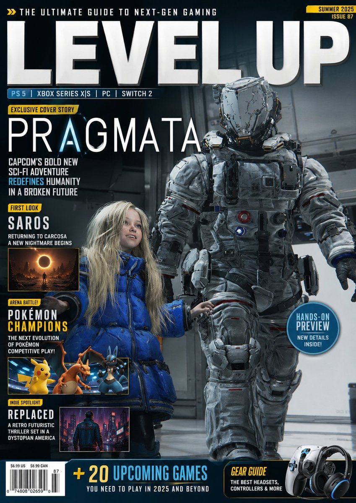</a>

```text
Create a Video Game magazine cover. The main cover is {argument name="main game" default="Pragmata"}. Add other subjects like {argument name="secondary games" default="Saros, Pokemon Champions, Replaced"} to the cover. The name of the Magazine is {argument name="magazine title" default="Level Up"}
```

## by [Gina Acosta](<https://x.com/ginacostag_>) on April 28, 2026 👉 [Try Now](https://indream.ai/generate?mode=IMAGE&modelKey=gpt-image-v2&modelPromptId=019e616f-0fd6-7229-8aeb-2ba0ddf39e47)

<a href="./public/images/8c437f38-df32-4e6e-aca5-8747670b04df.png" target="_blank" rel="noopener noreferrer">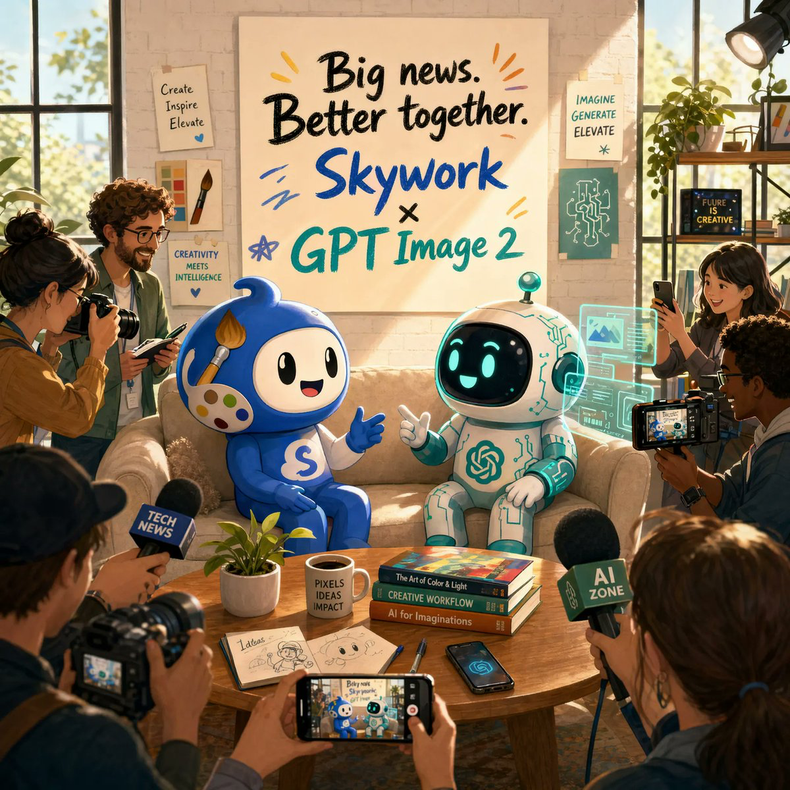</a>

```text
A warm, editorial-style announcement poster set inside a sunlit creative studio with a cozy startup office vibe. Center the composition on two cute mascots sitting side by side on a beige couch, surrounded by photographers, journalists, and content creators documenting the moment. Above them, place a large hand-painted poster on a light brick wall reading “Big news. Better together. {argument name="brand name" default="Skywork"} × {argument name="product name" default="GPT Image 2"}” in oversized brush lettering, with playful colorful accent strokes around the text. The left mascot is a glossy blue chibi character with a round body, big black oval eyes, a smiling face, white face panel, a paintbrush-shaped crest on its head, a painter’s palette motif on its cheek, and a white “S” on its belly, gesturing happily with one hand. The right mascot is a small white-and-teal robot with a rounded helmet-like head, black face screen, glowing cyan eyes and smile, teal circuitry details across the body, and a teal spiral emblem on the chest, also smiling and gesturing as if in conversation. Put a wooden coffee table in front of them with exactly 8 visible items: 1 small potted plant, 1 white mug reading “PIXELS IDEAS IMPACT,” 3 stacked design books, 1 open sketchbook with concept drawings, 1 pen, 1 smartphone lying flat, and 1 smartphone held in the foreground capturing the mascots. Surround the scene with exactly 7 visible human figures partially entering frame, some holding DSLR cameras, one holding a video camera with a flip-out screen, and 3 microphones with cube flags labeled “TECH NEWS,” “AI ZONE,” and another media mic. Add translucent cyan holographic interface panels floating beside the robot, suggesting AI-generated visuals and design tools. Decorate the walls and shelves with creative studio details: pinned art prints and posters reading “Create Inspire Elevate,” “CREATIVITY MEETS INTELLIGENCE,” “IMAGINE GENERATE ELEVATE,” and “FUTURE IS CREATIVE,” plus a paintbrush illustration, a circuit diagram print, books, plants, and a studio light in the upper right corner. Lighting is golden-hour sunlight streaming through large industrial windows on both sides, creating a cinematic, optimistic launch-event mood. Style: polished 3D illustration mixed with commercial lifestyle photography, highly detailed, friendly, brand-forward, vibrant but tasteful colors, soft depth of field, premium poster composition, square format.
```

## by [TWnese](<https://x.com/TWnese>) on April 28, 2026 👉 [Try Now](https://indream.ai/generate?mode=IMAGE&modelKey=gpt-image-v2&modelPromptId=019e6171-1ec0-7335-93ec-057deea7429f)

<a href="./public/images/5f8c35c5-ce03-4ee0-9df9-b6c8dc8dd452.png" target="_blank" rel="noopener noreferrer">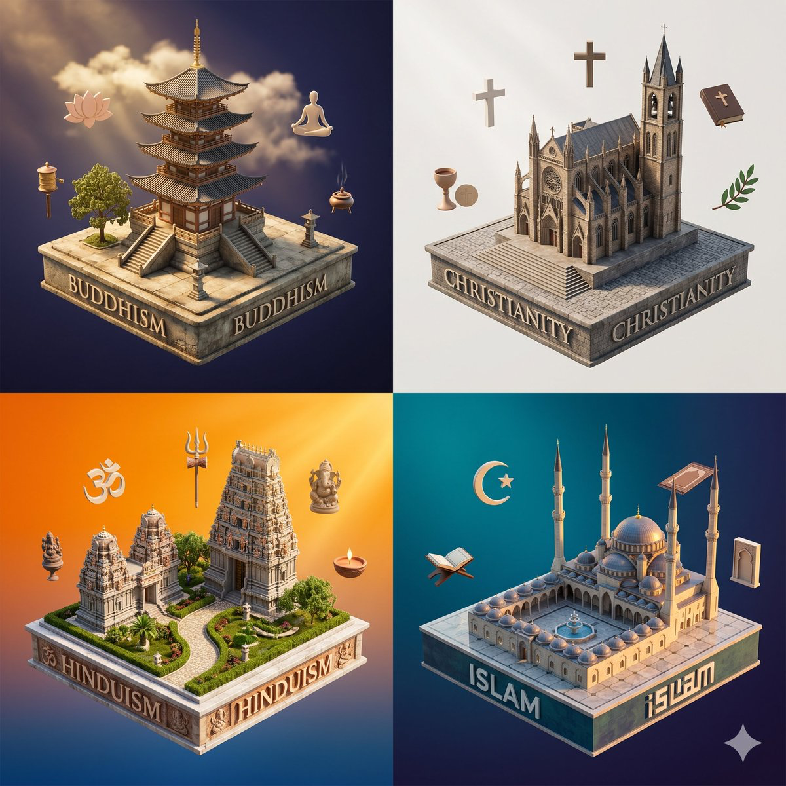</a>

```text
{"type":"isometric conceptual religion comparison poster","style":"high-detail 3D miniature diorama, polished stone and architectural model aesthetic, soft global illumination, clean studio rendering, subtle floating symbolic objects, square composition divided into 4 equal quadrants","topic":"major world religions represented as iconic architectural entities","layout":{"grid":{"rows":2,"columns":2,"count":4},"sections":[{"title":"BUDDHISM","position":"top-left","count":5,"labels":["lotus flower","hanging lantern","meditating Buddha figure","incense burner","tree"]},{"title":"CHRISTIANITY","position":"top-right","count":5,"labels":["cross 1","cross 2","chalice and communion wafer","Bible","olive branch"]},{"title":"HINDUISM","position":"bottom-left","count":5,"labels":["Om symbol","trident","Ganesha statue","small deity statue","oil lamp"]},{"title":"ISLAM","position":"bottom-right","count":5,"labels":["crescent moon","open Quran on stand","prayer rug","mihrab arch panel","star motif"]}],"divider":"thin white cross-shaped divider between quadrants"},"scenes":[{"religion":"BUDDHISM","base_text":"BUDDHISM","background":"deep midnight blue with warm clouds and light rays","centerpiece":"multi-tier East Asian pagoda temple on a square stone pedestal with broad staircases on two visible sides, small stone lantern, and a leafy tree","palette":"golden beige stone, dark wood, teal roof tiles, warm sunlight"},{"religion":"CHRISTIANITY","base_text":"CHRISTIANITY","background":"soft off-white to pale gray gradient","centerpiece":"large Gothic cathedral on a square stone pedestal with central rose window, nave, buttresses, and two tall bell towers","palette":"light beige stone, cool gray roof, neutral daylight"},{"religion":"HINDUISM","base_text":"HINDUISM","background":"orange-to-blue gradient with bright warm glow","centerpiece":"South Indian temple complex with 3 ornate gopuram towers, landscaped garden, curved path, and lush greenery on a square pedestal","palette":"sandstone beige, green landscaping, warm orange sunlight"},{"religion":"ISLAM","base_text":"ISLAM","background":"teal-to-deep-blue gradient","centerpiece":"grand mosque with central dome, 4 slender minarets, arcaded courtyard, and fountain on a square pedestal","palette":"cool beige stone, blue domes, evening light"}],"rendering":{"camera":"three-quarter isometric view for each quadrant","materials":"carved stone bases with embossed serif capital lettering on 2 visible sides, detailed miniature architecture, crisp edges","lighting":"directional cinematic light tailored to each quadrant, soft shadows, gentle ambient glow","mood":"educational, respectful, elegant, conceptual"}}
```

## by [auqib](<https://x.com/auqibhabib>) on April 28, 2026 👉 [Try Now](https://indream.ai/generate?mode=IMAGE&modelKey=gpt-image-v2&modelPromptId=019e6172-4141-702d-bf9d-2c86a8b15816)

<a href="./public/images/f352f3b3-f08f-4106-b26c-f5c0db85e9b3.png" target="_blank" rel="noopener noreferrer">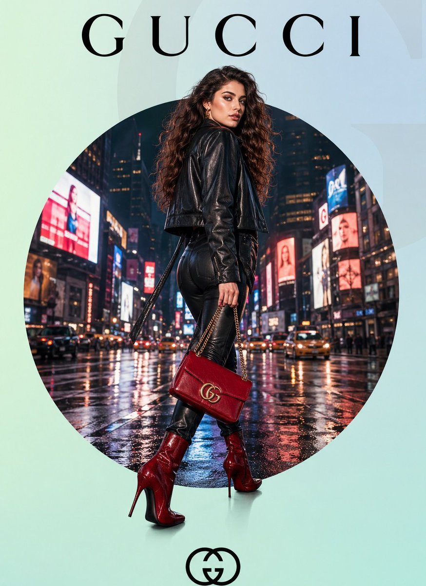</a>

```text
Luxury fashion advertisement poster for a premium brand ({argument name="brand name" default="GUCCI"} style), minimal modern layout, soft gradient background ({argument name="background color" default="pastel green to light blue"}).
Centered large circular frame showing a stylish young woman walking confidently in a rainy neon-lit city street (Times Square style), reflections on wet road, cinematic lighting.
Model wearing black leather jacket and black leather pants, holding a {argument name="handbag color" default="bold red"} luxury handbag, wearing red high-heel boots.
Face: highly attractive, symmetrical, sharp features, glowing skin, confident expression.
Hair: long, voluminous, soft curly hair flowing naturally.
Pose: walking forward, slightly turned back toward camera, dynamic fashion pose.
Composition:
Large circle (dominant, increased size ~70–80% width)
Model slightly breaking the circle boundary for depth
Clean background with subtle oversized faded letter (like “G”) behind
Branding:
“GUCCI” in elegant serif font at top center
Small GUCCI logo at bottom center
No extra text, no social handles, no watermarks
Style: ultra HD, sharp, premium editorial, high contrast, cinematic color grading, glossy fashion magazine look, luxury aesthetic
Lighting: soft diffused + cinematic highlights, detailed shadows
Quality: 4K, hyper-detailed, realistic, professional fashion campaign
```

## by [Johnn](<https://x.com/john_my07>) on April 28, 2026 👉 [Try Now](https://indream.ai/generate?mode=IMAGE&modelKey=gpt-image-v2&modelPromptId=019e6174-00a8-72bc-8348-a47010c2449c)

<a href="./public/images/56752461-2859-42aa-86e8-e0d1218fef6b.png" target="_blank" rel="noopener noreferrer">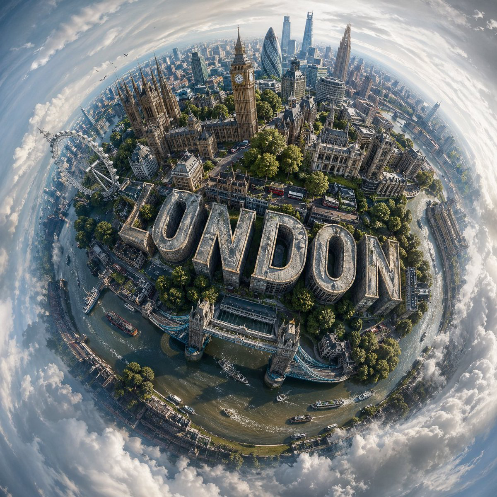</a>

```text
Design a visually striking “miniature world” composition of {argument name="city name" default="CITY NAME"}, where the city’s most recognizable landmarks and architectural elements wrap organically around a compact, globe-like terrain, creating the illusion of a self-contained urban planet.

Blend the skyline and environment so they curve naturally with the surface, forming a cohesive spherical composition rather than a flat panorama. The perspective should feel elevated and slightly angled, as if captured from a drifting aerial viewpoint, enhancing depth and dimensional distortion.

Incorporate bold, contemporary 3D lettering that spells “{argument name="text" default="CITY NAME"}”, embedding it seamlessly into the cityscape; for example, integrated into streets, rooftops, or terrain, so it feels like a structural part of the environment.
Illuminate the scene with soft daylight under a lightly overcast sky, allowing diffused lighting to create subtle shadows and realistic highlights across buildings, vegetation, and roads.
Surround the miniature planet with an expansive, atmospheric sky that gently transitions into abstract, swirling cloud formations, adding a dreamlike quality without distracting from the central subject.

Use a balanced, lifelike color scheme tailored to {argument name="location" default="CITY NAME"}, featuring natural greens, sky blues, and grounded architectural tones, while maintaining vibrancy and clarity.

Render the final image in ultra-detailed photorealism, emphasizing texture accuracy, depth, and environmental realism, with a polished cinematic finish.
```

## by [SPEEDYAI](<https://x.com/SPEEDAI07>) on April 28, 2026 👉 [Try Now](https://indream.ai/generate?mode=IMAGE&modelKey=gpt-image-v2&modelPromptId=019e6174-464d-7298-a7bf-ef9acfa19452)

<a href="./public/images/08d891aa-173c-45c9-b7ba-662f2ff92a47.png" target="_blank" rel="noopener noreferrer">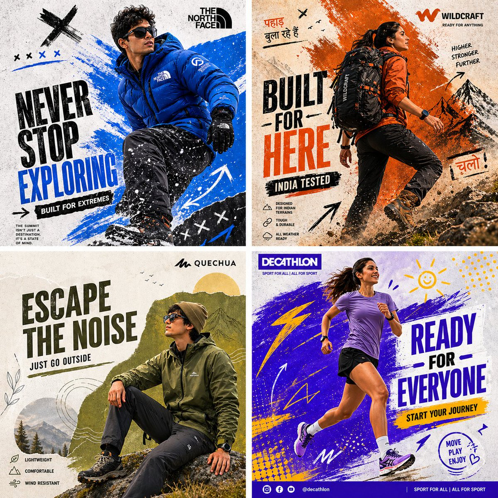</a>

```text
A dynamic 2×2 grid collage of modern outdoor sportswear advertising posters, each panel representing a different adventure lifestyle brand. High-energy, editorial-style composition with bold typography and textured graphic design.

Top-left panel:
Athletic male model in a bright blue insulated winter jacket, black snow pants, gloves, and sunglasses, stepping forward in a snowy environment. Snow particles flying, dramatic motion. Background features rough blue paint brush strokes. Bold distressed typography reads: “{argument name="quote 1" default="NEVER STOP EXPLORING"}.” Additional small text: “Built for extremes.” High contrast, rugged winter exploration theme.

Top-right panel:
Fit male hiker climbing rocky terrain, wearing an olive green shirt, black trekking pants, and a large black backpack with orange straps. Dust and debris kicking up from the ground. Background includes orange paint strokes and sketched mountain graphics. Bold text: “{argument name="quote 2" default="BUILT FOR HERE – INDIA TESTED"}.” Handwritten Hindi accents and arrows. Warm earthy tones.

Bottom-left panel:
Calm outdoor scene with a male model sitting on a rock, wearing a green jacket, beanie, sunglasses, and hiking shoes. Minimal scenic mountain illustration in the background with soft green tones. Typography reads: “{argument name="quote 3" default="ESCAPE THE NOISE – JUST GO OUTSIDE"}.” Clean, relaxed, nature-focused aesthetic with subtle graphic elements.

Bottom-right panel:
Energetic female runner in motion wearing a purple athletic t-shirt, black shorts, and running shoes. Bright, playful background with purple and yellow paint splashes, doodles, arrows, and sun illustration. Bold typography: “READY FOR EVERYONE – START YOUR JOURNEY.” Youthful, vibrant fitness energy.

Overall style:

High-resolution, photorealistic sportswear campaign

Bold brushstroke textures and grunge overlays

Mixed typography: distressed, handwritten, and modern sans-serif

Strong color blocking per panel (blue, orange, green, purple)

Dynamic poses conveying motion, strength, and adventure

Clean grid layout with balanced spacing

Commercial advertising / brand campaign aesthetic (Nike, Decathlon style)

Lighting: Professional, cinematic lighting with sharp detail and contrast
Mood: Energetic, adventurous, motivational
Aspect ratio: 1:1 (square collage)
```

## by [ゆあ](<https://x.com/yua_artlove>) on April 28, 2026 👉 [Try Now](https://indream.ai/generate?mode=IMAGE&modelKey=gpt-image-v2&modelPromptId=019e6174-8abf-725d-89c9-a86068426a96)

<a href="./public/images/b22cb106-2b6c-465c-871f-f3f1ec0a5590.png" target="_blank" rel="noopener noreferrer">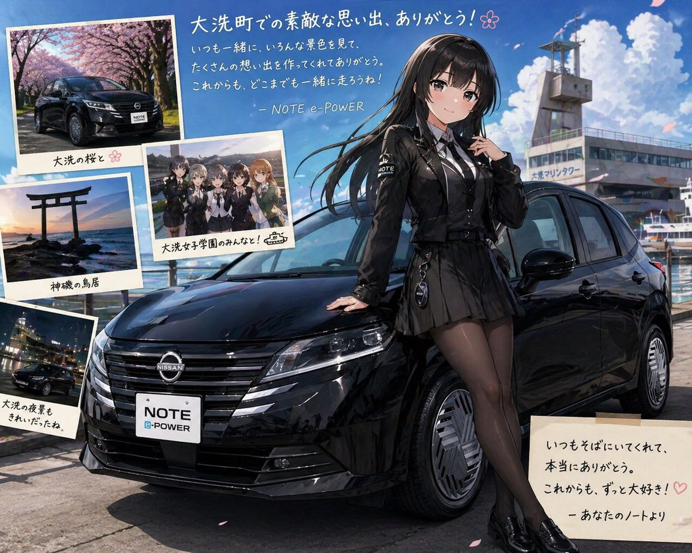</a>

```text
{"type":"anime commemorative collage poster","subject":{"theme":"personified car as a stylish anime woman standing with the real vehicle","vehicle":{"make":"Nissan","model":"NOTE e-POWER","color":"glossy black","body":"modern compact hatchback","view":"front three-quarter view from low eye level","details":["large chrome-accent front grille with Nissan badge","front license plate reading NOTE E-POWER","sleek LED headlights","dark tinted windows","distinctive wheel covers"]},"character":{"identity":"humanized version of the car","gender_presentation":"young woman","hair":{"color":"{argument name=\"hair color\" default=\"long black\"}","style":"very long straight hair with windswept strands and side bangs"},"outfit":{"style":"elegant black uniform-inspired business fashion","pieces":["black fitted blazer","white dress shirt","black necktie","short pleated black skirt","black sheer pantyhose","black loafers"],"accessories":["car key fob hanging from the waist","small sleeve patch reading NOTE e-POWER"]},"pose":"standing beside the front right side of the car, one hand resting on the hood and the other hand lightly touching her collar or hair, legs crossed in a confident graceful pose","expression":"refined, affectionate, commemorative poster mood"}},"setting":{"location":"sunny harbor waterfront in Japan","background_elements":["blue sky with large white clouds","industrial ferry terminal or harbor building","boats and waterfront structures","concrete dock surface"],"season":"spring"},"layout":{"style":"scrapbook-like thank-you collage with main hero image and pinned instant-photo snapshots","sections":[{"title":"main message area","position":"top center-left","count":1,"labels":["大洗町での素敵な思い出、ありがとう！"]},{"title":"photo snapshots","position":"left side and upper middle","count":4,"labels":["大洗の桜と","神磯の鳥居","大洗の夜景も きれいだったね。","大洗女子学園のみんなと！"]},{"title":"closing note card","position":"bottom right","count":1,"labels":["いつもそばにいてくれて、本当にありがとう。これからも、ずっと大好き！♡"]}],"centerpiece":"the black Nissan NOTE e-POWER with the anime woman leaning against it","composition":"landscape poster, car filling the lower half, character on the right-center, photos taped around the left side and upper center, handwritten Japanese text across the sky area"},"text":{"language":"Japanese","include_visible_text":true,"headline":"{argument name=\"headline text\" default=\"大洗町での素敵な思い出、ありがとう！\"}","body_lines":["いつも一緒に、いろんな景色を見て、","たくさんの想い出を作ってくれてありがとう。","これからも、どこまでも一緒に走ろうね！","- NOTE e-POWER"],"closing_signature":"- あなたのノートより"},"visual_style":{"illustration":"high-detail anime key visual blended with semi-realistic car rendering and scenic photo-collage elements","mood":"nostalgic, grateful, romantic tribute","lighting":"bright daylight with glossy reflections on the black car","color_palette":["deep black","sky blue","white","soft pink cherry blossoms","neutral concrete gray"],"finish":"polished promotional poster with sentimental scrapbook framing"}}
```

## by [ドフトボルケ　🇯🇵](<https://x.com/QrLcuAsc2COtX2h>) on April 28, 2026 👉 [Try Now](https://indream.ai/generate?mode=IMAGE&modelKey=gpt-image-v2&modelPromptId=019e617a-a7c0-778c-9478-a1053587ed25)

<a href="./public/images/85dbc913-ae35-4cdd-8447-033e24ef28dc.png" target="_blank" rel="noopener noreferrer">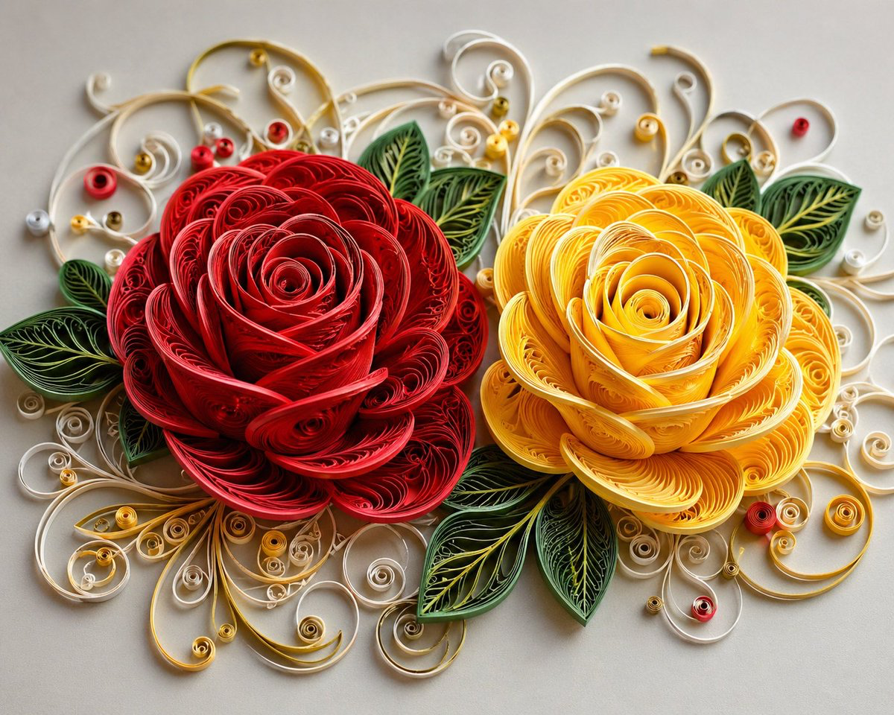</a>

```text
精密フォト、{argument name="スタイル" default="3Dペーパークイリングとペーパーフィリグリー"}で作られた{argument name="色" default="赤と黄色"}の{argument name="被写体" default="薔薇"}が並ぶアート作品。繊細な紙の渦巻き花弁、立体的な緑の葉、優雅な唐草模様、上品な白背景、柔らかな自然光、超高精細、洗練されたクラフト展示、温かみある質感
```

## by [TWnese](<https://x.com/TWnese>) on April 27, 2026 👉 [Try Now](https://indream.ai/generate?mode=IMAGE&modelKey=gpt-image-v2&modelPromptId=019e617b-eb7e-717d-bf70-949d51f27a89)

<a href="./public/images/87cfcfbf-082d-4207-a186-5c62d1ee96cd.png" target="_blank" rel="noopener noreferrer">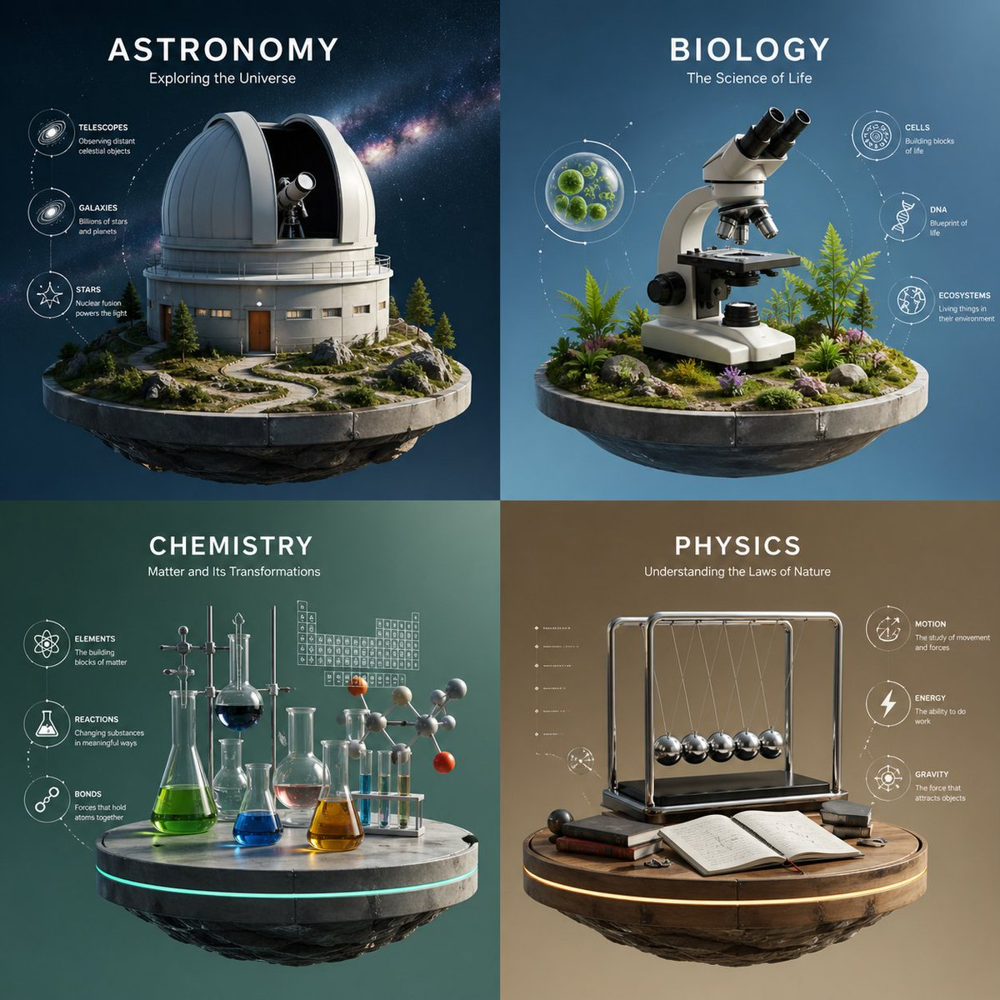</a>

```text
{"type":"four-panel educational science concept poster","style":"cinematic 3D infographic illustration, premium educational poster, highly detailed floating diorama islands, realistic materials, soft studio lighting, clean modern typography, subtle scientific HUD icons and callout lines","theme":"Science as conceptual entities","canvas":{"aspect_ratio":"1:1","background":"split into 4 equal quadrants with different gradient color atmospheres"},"layout":{"grid":"2x2","sections":[{"title":"ASTRONOMY","subtitle":"Exploring the Universe","position":"top-left","count":4,"labels":["title","subtitle","3 callout icons with labels","central observatory diorama"],"background":"deep midnight blue sky with stars and a visible Milky Way band","subject":"a large white observatory dome with an open slit and telescope inside, placed on a circular floating rocky island with a winding path, small trees, shrubs, rocks, and a lit entrance door","callouts":["TELESCOPES","GALAXIES","STARS"]},{"title":"BIOLOGY","subtitle":"The Science of Life","position":"top-right","count":5,"labels":["title","subtitle","3 callout icons with labels","central microscope diorama"],"background":"clear cool blue gradient","subject":"a cream-colored binocular microscope on a circular floating island covered with moss, grass, ferns, small plants, flowers, and rocks, with a small translucent bubble showing green cell-like organisms near the upper left of the microscope","callouts":["CELLS","DNA","ECOSYSTEMS"]},{"title":"CHEMISTRY","subtitle":"Matter and Its Transformations","position":"bottom-left","count":5,"labels":["title","subtitle","3 callout icons with labels","central laboratory glassware diorama"],"background":"green to teal gradient","subject":"a circular floating platform displaying chemistry lab equipment including tall flasks, beakers, test tubes, round-bottom flasks, retort stands, and a ball-and-stick molecular model, with colorful liquids in green, blue, amber, and red-orange","callouts":["ELEMENTS","REACTIONS","BONDS"]},{"title":"PHYSICS","subtitle":"Understanding the Laws of Nature","position":"bottom-right","count":5,"labels":["title","subtitle","3 callout icons with labels","central Newton's cradle diorama"],"background":"warm beige to brown gradient","subject":"a polished metal Newton's cradle on a circular floating wooden-and-metal platform, accompanied by 3 stacked books and an open notebook with visible pages","callouts":["MOTION","ENERGY","GRAVITY"]}],"dividers":"clean cross-shaped split between quadrants"},"objects":{"floating_platforms":4,"main_disciplines":4,"callout_label_count":12},"text_treatment":{"font":"bold geometric sans-serif uppercase for titles, smaller clean sans-serif for subtitles and callout descriptions","title_color":"white","callout_style":"thin white outline icons with fine connector lines and small explanatory text"},"quality":"ultra-detailed, polished, balanced composition, sharp focus, professional educational key visual","customization":{"headline_theme":"{argument name=\"headline text\" default=\"Science\"}","astronomy_title":"{argument name=\"astronomy title\" default=\"ASTRONOMY\"}","biology_title":"{argument name=\"biology title\" default=\"BIOLOGY\"}","chemistry_title":"{argument name=\"chemistry title\" default=\"CHEMISTRY\"}","physics_title":"{argument name=\"physics title\" default=\"PHYSICS\"}"}}
```

## by [ざつ＠『竜の姫と絆のユニゾン』『星槍とオムライス』『リリアンのプロの流儀』『B級グルメ革命』](<https://x.com/hyzatu>) on April 27, 2026 👉 [Try Now](https://indream.ai/generate?mode=IMAGE&modelKey=gpt-image-v2&modelPromptId=019e6181-2885-7258-9758-1160b6f8d76a)

<a href="./public/images/9c53a962-4caa-404d-adf5-07fa67dca671.png" target="_blank" rel="noopener noreferrer">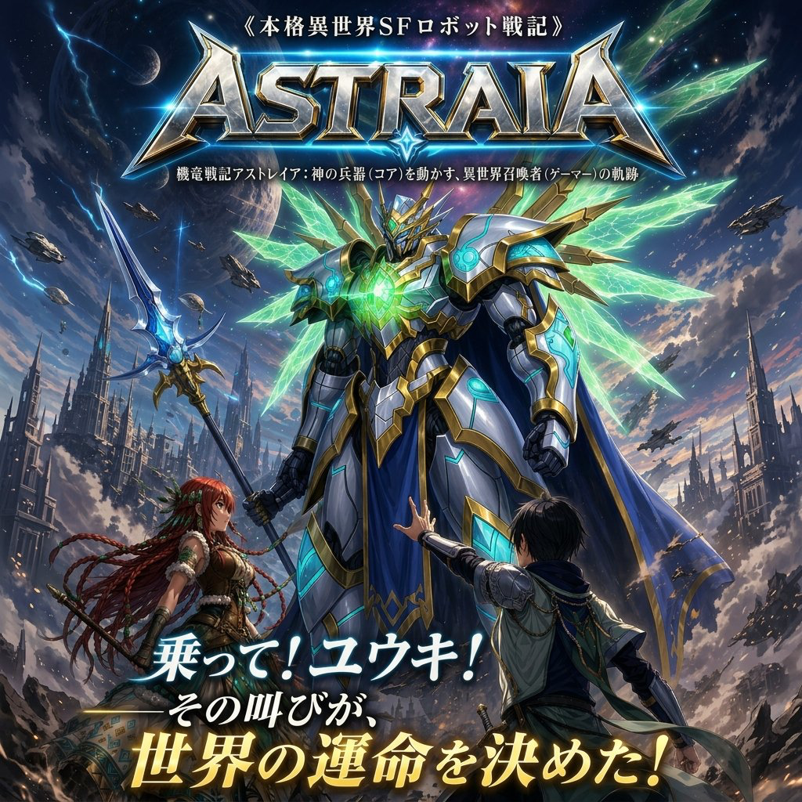</a>

```text
Create a dramatic Japanese light-novel cover illustration for a fantasy mecha isekai story. Vertical poster composition with a huge heroic humanoid robot dominating the center foreground, viewed from a slightly low angle to make it monumental. The robot is sleek and ornate, with white and silver armor, rich gold trim, glowing cyan energy lines, a radiant emerald-green core in the chest, a crown-like crest on the helmet, and a long royal blue cape with gold edging. Behind its back spread multiple crystalline energy wings, about 8 large translucent green shards fanning out symmetrically like luminous blades. In its left hand it holds a long fantasy-tech spear with a blue glowing blade and gold mechanical detailing. At the robot’s feet are 2 human characters: on the left, a red-haired fantasy heroine with very long braided hair, leather-and-fabric adventurer clothing, and a determined expression, looking up at the robot; on the right, a young male protagonist with short dark hair in a fantasy tunic and cloak, reaching one hand up toward the giant machine in awe and urgency, seen mostly from behind. The setting is an epic ruined sci-fi fantasy world with towering gothic spires, broken city structures, drifting smoke, dramatic clouds, and a sky filled with stars, planets, streaks of lightning, and 8 small flying warships scattered in the distance. Highly polished anime key visual style, ultra-detailed, cinematic lighting, intense contrast, blue-green-gold color palette, heroic atmosphere, intricate mechanical rendering, fantasy worldbuilding, premium game or novel cover finish. Add large Japanese title typography at the top: 《{argument name="tagline text" default="本格異世界SFロボット戦記"}》 above a massive metallic logo reading {argument name="series title" default="ASTRAIA"}, with a smaller Japanese subtitle line beneath it. Add a large dramatic Japanese catchphrase at the bottom in glowing white and gold text over 2 lines: {argument name="bottom catchphrase" default="乗って！ユウキ！ その叫びが、世界の運命を決めた！"}. Keep the overall design dense, premium, and readable as a commercial cover, with the central robot as the unmistakable focal point.
```

## by [ざつ＠『竜の姫と絆のユニゾン』『星槍とオムライス』『リリアンのプロの流儀』『B級グルメ革命』](<https://x.com/hyzatu>) on April 27, 2026 👉 [Try Now](https://indream.ai/generate?mode=IMAGE&modelKey=gpt-image-v2&modelPromptId=019e6181-14a5-72ab-ae13-454ab6db05d4)

<a href="./public/images/8cf6a54a-5e7d-4169-a4bd-e83fa0d2d44c.png" target="_blank" rel="noopener noreferrer">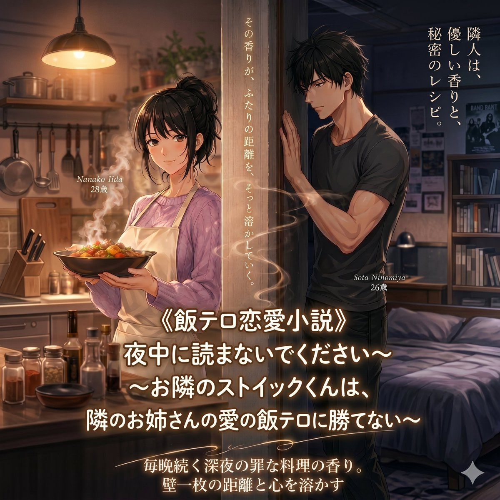</a>

```text
A cinematic anime-style vertical book-cover illustration for a romantic comedy light novel with slight fantasy atmosphere, split by a thin apartment wall down the center. On the left side, a warm, cozy kitchen glows in amber light from a hanging pendant lamp. A {argument name="female character name" default="Nanako Iida"}, age 28, stands in three-quarter view holding a deep plate of freshly cooked food with visible steam rising in elegant curls. She has dark hair tied in a messy bun, soft bangs, a gentle mature expression, and wears a lavender knit sweater under a white apron. The kitchen contains exact visible details: 1 hanging lamp, 1 upper shelf with cookware, 5 hanging utensils, 1 cutting board, 1 knife block, and 6 small bottles or jars lined across the foreground counter. On the right side, a dim, cool-toned bachelor bedroom is lit in blue shadows. A {argument name="male character name" default="Sota Ninomiya"}, age 26, slim but muscular, with tousled dark hair and a fitted charcoal T-shirt, leans one hand against the wall as if sensing the aroma through it. His room contains 1 bed, 1 bookshelf, 1 desk lamp, and 1 wall poster. A ribbon of steam drifts from the dish across the center wall into his side, visually connecting them. The mood is intimate, sensual, and slightly teasing, emphasizing the contrast between warm home cooking and lonely nighttime restraint. Add elegant Japanese vertical catch copy on the wall and upper right, small white serif-style name labels beside both characters with their ages, and a large bold Japanese title block across the lower middle. Include these exact text elements: left name label "Nanako Iida 28歳", right name label "Sota Ninomiya 26歳", vertical wall text "その香りが、ふたりの距離を、そっと溶かしていく。", upper-right vertical text "隣人は、優しい香りと、秘密のレシピ。", large center title "《飯テロ恋愛小説》\n夜中に読まないでください〜\n〜お隣のストイックくんは、\n隣のお姉さんの愛の飯テロに勝てない〜", and bottom tagline "毎晩続く深夜の罪な料理の香り。\n壁一枚の距離と心を溶かす". Highly polished promotional cover art, soft bloom lighting, detailed fabric folds, realistic steam, romantic tension, glossy illustrated publishing design.
```

## by [藍澤 ミライ](<https://x.com/mirai_ai2050>) on April 27, 2026 👉 [Try Now](https://indream.ai/generate?mode=IMAGE&modelKey=gpt-image-v2&modelPromptId=019e6182-a58b-7457-8b05-10252645d168)

<a href="./public/images/ccd77543-f5a3-4046-a9c9-958605d31a54.png" target="_blank" rel="noopener noreferrer">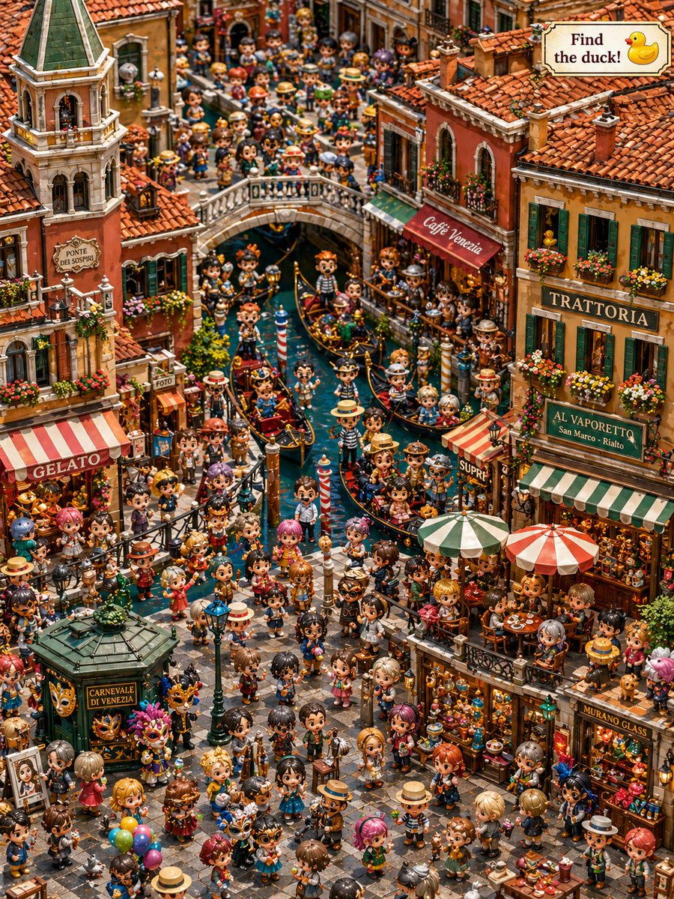</a>

```text
A highly detailed isometric toy-diorama illustration of a crowded Venetian canal district in a cute chibi style, designed as a hidden-object “find the duck” scene. Show a bustling old Venice street and canal packed with exactly hundreds of tiny stylized people with oversized heads, glossy eyes, and varied outfits, filling nearly every walkway, bridge, balcony, gondola, and café seat. The composition is a vertical overhead three-quarter view looking down a narrow canal running through the center, with a stone footbridge crossing the canal in the upper middle and dense warm-toned historic buildings on both sides. Architecture should feature terracotta roof tiles, stucco walls in faded orange, ochre, cream, and brick red, green shutters, flower boxes, striped awnings, hanging signs, lanterns, and richly detailed shopfronts. Include a tall bell tower on the upper left with a sign reading “PONTE DEI SOSPIRI,” a red awning reading “Cafe Venezia” on the right side near the bridge, a large “TRATTORIA” sign on the upper right building, a green sign reading “AL VAPORETTO San Marco - Rialto,” a striped awning with “GELATO” on the left, a small “FOTO” sign, a kiosk in the lower left plaza labeled “CARNEVALE DI VENEZIA,” a glowing shop on the lower right labeled “MURANO GLASS,” and a small “SUPRI” sign near the right canal edge. Fill the canal with exactly 7 gondolas, each with passengers and gondoliers in striped shirts and straw hats, plus red-and-white striped mooring poles in the water. Populate the square and canal edges with market tables, café tables under exactly 2 large parasols, carnival masks, balloons, framed art, pastries, glassware, souvenirs, flowers, and streetlamps. In windows, balconies, and doorways, place more chibi figures watching the scene. Hide exactly 1 small yellow rubber duck in an upper-right window beside the “TRATTORIA” building so it is visible but easy to miss. Add a decorative signboard in the top-right corner that reads “Find the duck!” with a duck icon. Render everything in an ultra-dense handcrafted miniature aesthetic with crisp detail, saturated warm colors, soft cinematic lighting, playful travel-poster charm, and a whimsical vacation puzzle-book feeling.
```

## by [darren zhang](<https://x.com/darrenlook>) on April 27, 2026 👉 [Try Now](https://indream.ai/generate?mode=IMAGE&modelKey=gpt-image-v2&modelPromptId=019e6183-2798-74b1-9bd2-2b4348800fda)

<a href="./public/images/ade48af0-24fc-41f5-b4d8-bc667633e214.png" target="_blank" rel="noopener noreferrer">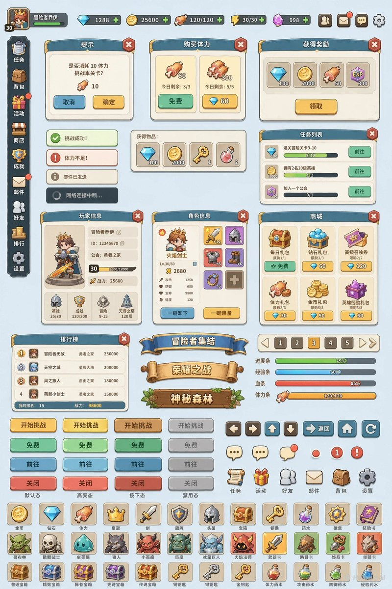</a>

```text
将这张游戏界面的风格和材质，扩展出一套游戏UI的组件库，包括面板、按钮、导航栏、横幅、标题、道具图标等一系列游戏UI可用的组件，平铺在纯色背景上
```

## by [ユメ・アスタAI漫画イラストレーター](<https://x.com/yume00112211>) on April 27, 2026 👉 [Try Now](https://indream.ai/generate?mode=IMAGE&modelKey=gpt-image-v2&modelPromptId=019e6183-6aa2-7695-a7f0-76ff7c0e6941)

<a href="./public/images/6e25a6f2-26cf-45ba-afe8-4906fcfd783d.png" target="_blank" rel="noopener noreferrer">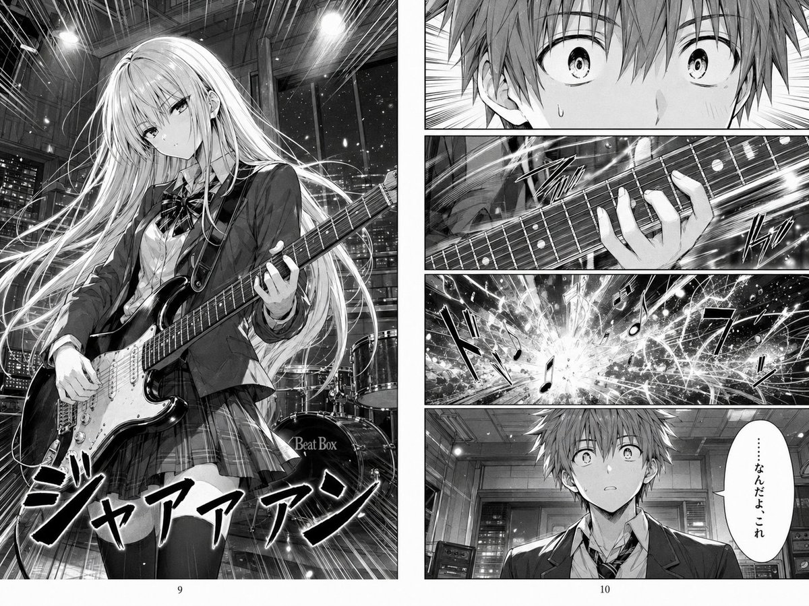</a>

```text
{"type":"black-and-white manga page","style":"high-detail seinen manga, screentone shading, dramatic speed lines, glossy highlights, cinematic contrast, polished digital ink","layout":{"page_count":1,"reading_direction":"right to left manga composition","panel_count":5,"sections":[{"title":"main panel","position":"left side, tall vertical panel taking about half the page","count":1,"labels":["girl playing electric guitar"]},{"title":"top reaction panel","position":"top right","count":1,"labels":["shocked boy close-up"]},{"title":"guitar close-up panel","position":"upper middle right","count":1,"labels":["fingers on fretboard"]},{"title":"sound burst panel","position":"middle right","count":1,"labels":["explosive musical impact"]},{"title":"bottom dialogue panel","position":"bottom right","count":1,"labels":["boy speaking with speech bubble"]}],"page_numbers":[9,10]},"scene":{"setting":"indoor music rehearsal studio or school band room at night, with ceiling lights, windowed city view, amplifiers, and a drum kit in the background","mood":"sudden awe, overwhelming sound, dramatic revelation"},"characters":[{"role":"guitarist","gender":"female","age_appearance":"teenage high school student","hair":{"color":"{argument name=\"hair color\" default=\"very light platinum blonde\"}","style":"extremely long straight hair flowing widely around her, soft bangs"},"clothing":["dark school blazer","white button-up shirt","large ribbon bow at the collar","pleated plaid skirt","dark thigh-high socks"],"pose":"standing confidently, holding and playing a Stratocaster-style electric guitar, left hand on the neck and right hand strumming near the pickups","expression":"calm, cool, almost emotionless concentration, looking slightly downward"},{"role":"observer","gender":"male","age_appearance":"teenage high school student","hair":{"color":"light brown in grayscale","style":"short, messy"},"clothing":["school blazer","dress shirt","loosened necktie"],"expressions":["wide-eyed shock with sweat drop in close-up","confused stunned reaction in lower panel"]}],"objects":[{"name":"electric guitar","description":"solid-body Stratocaster-style guitar with glossy dark finish, white pickguard, visible knobs and pickups"},{"name":"drum kit","description":"background drum set with bass drum logo reading 'Beat Box'"},{"name":"studio equipment","description":"amps, stands, acoustic room details"}],"effects":{"onomatopoeia_count":4,"onomatopoeia":["ジャアアン","ズウッ","ギュッ","ブン"],"visual_effects":["radiating speed lines","spark-like light trails around the guitarist","burst of abstract sound and music notes","intense motion emphasis in the fretboard panel"]},"text":{"speech_bubbles_count":1,"speech_bubbles":["……なんだよ、これ"]},"composition":"Create a manga page where the left half is dominated by the full-body guitarist as the source of overwhelming sound, while the right half stacks four smaller reaction and detail panels showing the boy's shock, a close-up of the guitar technique, a visualized blast of sound, and his final spoken reaction. Keep everything monochrome, cleanly bordered, and intensely dramatic."}
```

## by [el_zitoIA](<https://x.com/zitoIA>) on April 27, 2026 👉 [Try Now](https://indream.ai/generate?mode=IMAGE&modelKey=gpt-image-v2&modelPromptId=019e6186-1f99-71ad-93d4-5b239f2b9d29)

<a href="./public/images/d0f431cb-cd69-440a-b1ad-2822ec5c61e6.png" target="_blank" rel="noopener noreferrer">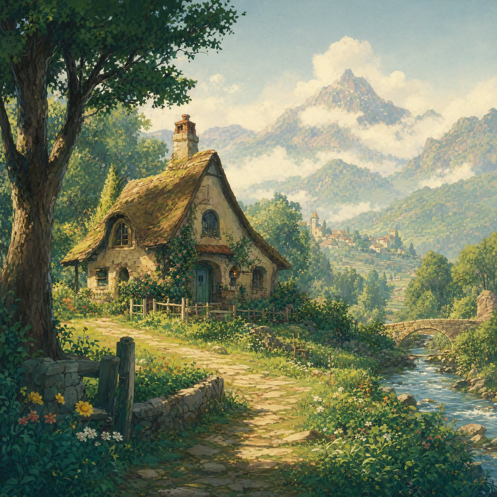</a>

```text
A dreamy storybook landscape painting of a cozy fairytale cottage in a lush alpine valley, rendered in a soft painterly style with warm sunlight and delicate atmospheric haze. The cottage sits slightly left of center beside a winding stone path, with cream-colored plaster walls, a steep mossy thatched roof, a small chimney, curved dormer windows, a teal-blue front door, and climbing flowers around the walls and fence. A large leafy tree frames the left foreground, casting cool shade over wildflowers, grass, and rough wooden posts. On the right, a clear stream flows through the scene beneath a small old stone bridge. In the middle distance, a tiny hillside village with church-like towers nestles among trees. In the background, tall rugged mountains rise dramatically, their slopes softened by mist and crowned with bright white clouds. Use rich greens, sunlit gold, soft blue-gray mountains, and a tranquil pastoral mood, with highly detailed foliage, textured brushwork, and a whimsical classic fantasy illustration feel.
```

## by [水木易](<https://x.com/ohmuyi>) on April 27, 2026 👉 [Try Now](https://indream.ai/generate?mode=IMAGE&modelKey=gpt-image-v2&modelPromptId=019e618b-3fd9-74b9-98d3-43074064766c)

<a href="./public/images/198ab765-bc96-4224-8c17-211acec6d22e.png" target="_blank" rel="noopener noreferrer">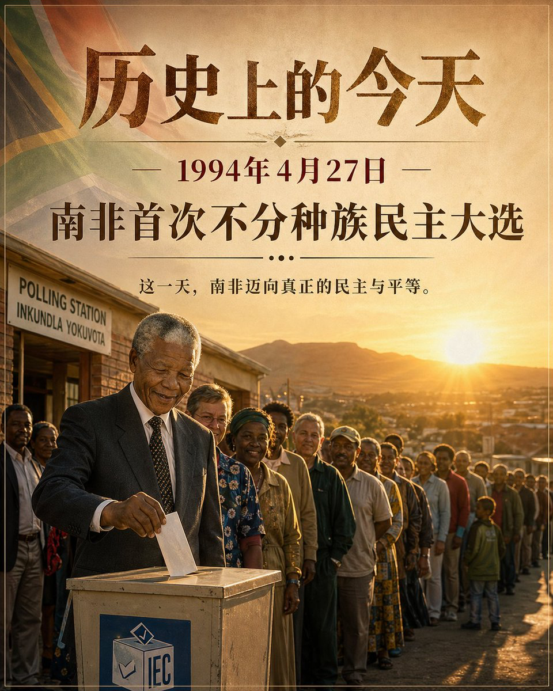</a>

```text
生成一张关于“{argument name="事件主题" default="历史上的今天"}”最具重大意义事件的图像
```

## by [SPEEDYAI](<https://x.com/SPEEDAI07>) on April 27, 2026 👉 [Try Now](https://indream.ai/generate?mode=IMAGE&modelKey=gpt-image-v2&modelPromptId=019e618b-4f80-76a8-ac3d-5b5b1c5fe122)

<a href="./public/images/6b3c49bb-1e4c-4152-bf18-d698d28ced98.png" target="_blank" rel="noopener noreferrer">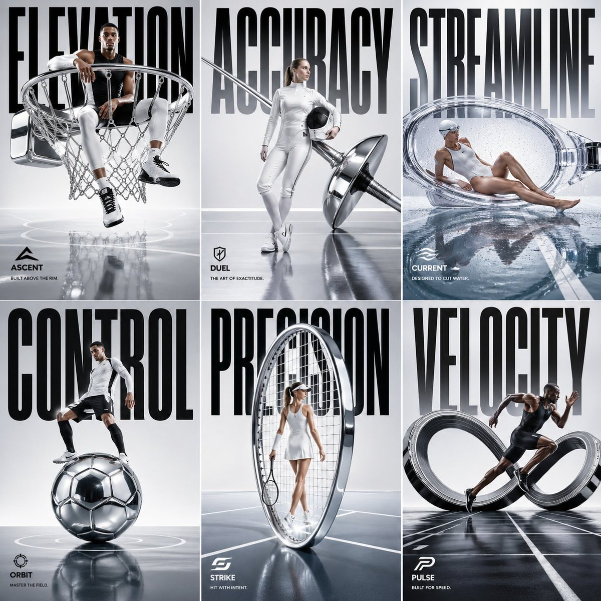</a>

```text
{"type":"avant-garde luxury sportswear campaign poster","format":"square 2x3 grid editorial layout","style":"Swiss-style fashion advertising, ultra-clean studio minimalism, sculptural sports surrealism, hyper-real materials, cinematic lighting, sharp focus, strong negative space, reflective floors, no clutter, no real logos","background":{"environment":"white seamless studio with subtle gradients and glossy reflective ground in every panel","typography":"oversized bold black condensed sans-serif words spanning the top of each panel, partially cropped by the frame"},"branding":{"system":"consistent fictional luxury sports branding across all 6 panels","logo_style":"small monochrome icon plus brand name and short tagline near the lower left area of each panel"},"layout":{"grid":{"columns":3,"rows":2,"count":6},"sections":[{"title":"ELEVATION","position":"top left","count":1,"sport":"basketball","brand":"ASCENT","tagline":"BUILT ABOVE THE RIM.","subject":"1 tall male basketball athlete in black sleeveless top and white fitted pants, seated inside a floating chrome basketball hoop like a throne, feet hanging through the net, low-angle perspective","oversized_object":"giant polished chrome basketball hoop and net"},{"title":"ACCURACY","position":"top center","count":1,"sport":"fencing","brand":"DUEL","tagline":"THE ART OF EXACTITUDE.","subject":"1 female fencer in an all-white fencing-inspired bodysuit, standing in side-profile contrapposto and holding a black fencing mask","oversized_object":"monumental chrome foil leaning diagonally behind her"},{"title":"STREAMLINE","position":"top right","count":1,"sport":"swimming","brand":"CURRENT","tagline":"DESIGNED TO CUT WATER.","subject":"1 female swimmer in a white one-piece swimsuit and white swim cap, reclining inside a giant transparent swim goggles structure","oversized_object":"oversized clear goggles filled with water reflections and pale blue highlights"},{"title":"CONTROL","position":"bottom left","count":1,"sport":"football","brand":"ORBIT","tagline":"MASTER THE FIELD.","subject":"1 male footballer in a white long-sleeve jersey, black shorts, black socks, and cleats, balancing with a wide stance on top of a giant chrome football sphere","oversized_object":"large mirrored metallic soccer ball"},{"title":"PRECISION","position":"bottom center","count":1,"sport":"tennis","brand":"STRIKE","tagline":"HIT WITH INTENT.","subject":"1 female tennis athlete in a white sleeveless dress and visor, standing centered inside a giant upright tennis racket portal while holding a racket at her side","oversized_object":"monumental chrome tennis racket ring"},{"title":"VELOCITY","position":"bottom right","count":1,"sport":"sprinting","brand":"PULSE","tagline":"BUILT FOR SPEED.","subject":"1 male sprinter in a dark fitted sprint suit, captured mid-run in a powerful forward lean","oversized_object":"sculptural chrome infinity-track loop"}]},"image_direction":"Create a perfectly symmetrical campaign board with evenly spaced six panels, each panel functioning as a luxury editorial ad. Use monochrome and cool metallic tones with subtle pale blue only in the swimming panel. Emphasize oversized reflective chrome sports objects, fashion-photography posing, clean studio composition, and seamless brand consistency across all 6 ads.","parameters":{"headline style":"{argument name=\"headline text style\" default=\"oversized bold condensed typography\"}","studio palette":"{argument name=\"color palette\" default=\"white, black, chrome, and cool gray with subtle pale blue accents\"}","fashion direction":"{argument name=\"wardrobe style\" default=\"avant-garde luxury sportswear\"}","material finish":"{argument name=\"material finish\" default=\"hyper-reflective chrome and glossy studio floors\"}","layout type":"{argument name=\"layout\" default=\"symmetrical 2x3 campaign grid\"}"}}
```

## by [かなり](<https://x.com/kanari_sc>) on April 27, 2026 👉 [Try Now](https://indream.ai/generate?mode=IMAGE&modelKey=gpt-image-v2&modelPromptId=019e618d-856e-7072-a022-ed925d75a762)

<a href="./public/images/3d67a6f2-c274-4dea-b09c-d690435b7113.png" target="_blank" rel="noopener noreferrer">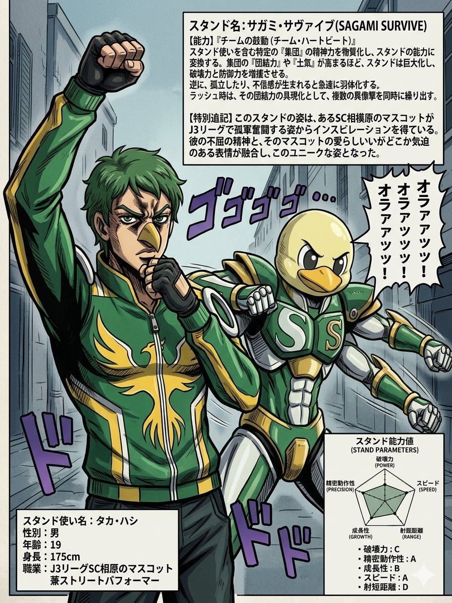</a>

```text
A manga-style JoJo-inspired character card poster set in a narrow urban alley, with dramatic cel shading, heavy ink lines, stylized speed-line energy, and a vertical comic-page layout. The main subject is a young Japanese man, {argument name="character name" default="タカ・ハシ"}, age 19, shown from mid-thigh up in the left foreground, raising his right fist high in a triumphant pose while holding a handheld microphone near his mouth with his left hand. His face is intentionally obscured by a rectangular mosaic blur. He has short messy {argument name="hair color" default="green"} hair and wears a fitted green track jacket with gold side stripes and a large golden phoenix emblem across the chest, zipped up, with black pants and black fingerless gloves. To his right and slightly behind him stands his humanoid Stand, {argument name="stand name" default="サガミ・サヴァイブ (SAGAMI SURVIVE)"}, a compact armored mascot-like figure with a rounded pale yellow bird head, sharp angry eyes, an orange beak, and a sleek white-and-green mechanical body with metallic silver musculature. The Stand has green shoulder armor, green gauntlets, gold trim, and a bold letter S on each side of its chest armor. It is posed punching forward with both fists, aggressive and energetic. Include exactly 4 distinct text panels and effects: 1 large white rectangular description box at the top right filled with dense Japanese text explaining the Stand, 1 jagged white speech bubble at the mid-right with vertical Japanese battle cries, 1 white character-info box at the bottom left with Japanese profile text, and 1 white stat box at the bottom right containing a radar chart labeled STAND PARAMETERS with Japanese and English category labels and a 5-line stat list. Add exactly 4 stylized purple sound-effect texts around the figures: 1 large "ゴゴゴゴ…" near the upper middle, 1 "ド" near the lower left, and 2 separate "ドド" effects near the lower center and lower right. The background is a gray-blue city alley with tall buildings receding in perspective. Overall tone: parody homage to JoJo's Bizarre Adventure character introductions, combining comic intensity with a goofy mascot Stand concept, polished manga poster composition, sharp print-like detail, and Japanese magazine page aesthetics.
```

## by [Zayden](<https://x.com/Zahor24552439>) on April 27, 2026 👉 [Try Now](https://indream.ai/generate?mode=IMAGE&modelKey=gpt-image-v2&modelPromptId=019e618e-775c-76ea-a762-ae32a0c50c3e)

<a href="./public/images/9b35eb55-8191-4736-b563-d3d462d4c4fd.png" target="_blank" rel="noopener noreferrer">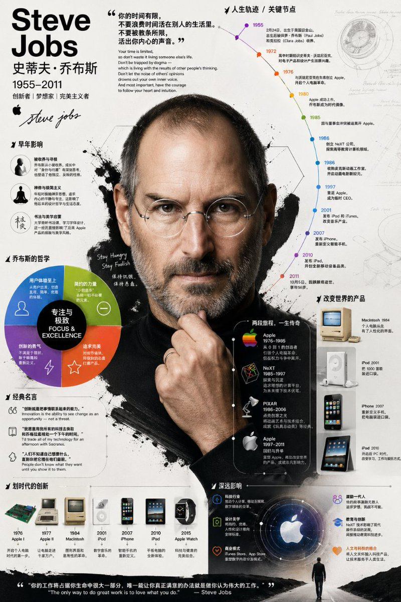</a>

```text
请帮我制作一张关于{argument name="人物姓名" default="[人物姓名]"}的信息图，视觉效果要非常丰富且有深度。不仅是罗列信息：我需要你深入挖掘他的生平、主要成就、职场关键节点、哲学思想，以及他对科技和设计的独特影响。不要用那种死板的一块一块的布局，要用图解、注释和引线标注把这些信息有机地结合在一起。画面风格：走那种大胆有力、图形感很强的插画路线。具体看起来是这样的：中心焦点是一张细节极其逼真、像照片一样的人物肖像。以此为核心，周围环绕着像时间轴、分析图表、经典产品、名言警句和短小精悍的文字。构图技巧：背景保持干净。运用分层构图，把逼真的人物肖像和强烈的图形元素（比如各种形状、图标、大色块）完美混搭在一起。整个画面要显得内容满满、有质感，看起来非常专业。
```

## by [もり×2](<https://x.com/mooooriri>) on April 27, 2026 👉 [Try Now](https://indream.ai/generate?mode=IMAGE&modelKey=gpt-image-v2&modelPromptId=019e618e-f677-7199-abbb-0e973b08386e)

<a href="./public/images/afa06490-85a5-43dd-9ec8-dd199a5d3027.png" target="_blank" rel="noopener noreferrer">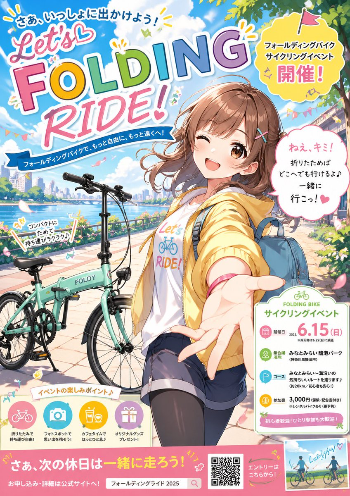</a>

```text
A bright, cheerful anime-style promotional poster for a folding bike cycling event, designed like a polished Japanese advertisement with dense typography, stickers, callouts, and event info panels. The scene shows a sunny riverside promenade under a vivid blue sky with fluffy clouds, green tree branches framing the top right, flower beds, bunting, drifting petals, and a distant modern city skyline across the water. In the foreground, a cute teen/young adult anime girl with {argument name="hair color" default="light chestnut brown"} shoulder-length wavy hair, side-swept bangs, and two colorful hairpins smiles directly at the viewer and winks with one eye. She is posed in dynamic perspective, reaching one hand toward the camera as if inviting the viewer to join her. She wears a yellow hooded windbreaker, a white T-shirt printed with colorful bicycle lettering, dark blue shorts, black thigh-high stockings, and a light blue backpack. Beside her is a mint-green compact folding bicycle labeled "FOLDY," shown unfolded and parked on the promenade with visible small wheels, frame hinge, handlebars, saddle, pedals, and kickstand, emphasizing portability and urban leisure cycling. Use a glossy, high-saturation anime poster aesthetic with clean linework, soft facial rendering, energetic lighting, and playful graphic decoration.

Fill the poster with Japanese ad-style layout elements. At the top left, a huge multicolored headline reads "Let’s FOLDING RIDE!" in oversized playful bubble and block lettering, with a smaller curved Japanese line above it reading "さあ、いっしょに出かけよう！" and a blue ribbon-like subtitle below reading "フォールディングバイクで、もっと自由に、もっと遠くへ！". At the upper right, place a yellow burst badge with a tiny flag icon containing the text "フォールディングバイク サイクリングイベント 開催！". Add a white speech bubble near the girl’s face with pink outline and handwritten-feel Japanese text: "ねえ、キミ！ 折りたたみは どこへでも行けるよ♪ 一緒に 行こっ！". Near the bicycle, include a small angled sticker with text "コンパクトにたためて 持ち運びラクラク♪". Near the lower center-left, add a section label "イベントの楽しみポイント♪" followed by exactly 4 round icon features in pastel circles: 1) a pink bicycle icon with text "折りたたみで 持ち運び自由！" 2) a blue camera icon with text "フォトスポットで 思い出を残そう！" 3) a yellow drink icon with text "カフェタイムで ほっとひと息♪" 4) a purple gift icon with text "オリジナルグッズ プレゼント！".

On the lower right, add a rounded white information card with green accents titled "FOLDING BIKE サイクリングイベント" and large pink date text "6.15(日)". Inside the card, present exactly 4 event detail rows with colored circular icons: 1) calendar row: "開催日 2025. ※雨天時は6.22(日)に順延" 2) location row: "集合所 みなとみらい 臨港パーク" with smaller note "(神奈川県横浜市)" 3) course row: "コース みなとみらい〜湾沿いの気持ちいいルートを走ります" with smaller note "(約20km、初心者安心！)" 4) fee row: "参加費 3,000円" with smaller note "(保険・記念品付き) ※レンタルバイクあり（要予約）". At the bottom of this card, add a pink strip reading "初心者歓迎！ひとり参加も大歓迎！". Along the very bottom of the poster, create a wide pink banner with large Japanese copy "さあ、次の休日は一緒に走ろう！" and smaller text on the left "お申し込み・詳細は公式サイトへ！". In the center-bottom place a search-bar style box containing {argument name="search text" default="フォールディングライド 2025"}. To its right, add a black-and-white QR code and a pink label reading "エントリーはこちらから！". In the bottom-right corner, include a small inset photo-style illustration of two cyclists riding together with a handwritten note "たのしいかも♡". Maintain a lively, magazine-quality event poster composition with exactly 1 main character, 1 folding bike, 1 large event info card, 1 speech bubble, 1 yellow burst badge, 1 angled portability sticker, 4 feature icons, 1 QR code, and 1 inset image.
```

## by [のとろ](<https://x.com/notoro_ai>) on April 26, 2026 👉 [Try Now](https://indream.ai/generate?mode=IMAGE&modelKey=gpt-image-v2&modelPromptId=019e618f-ea05-7709-950a-b5e6e211d72f)

<a href="./public/images/b8ebf127-2bfd-4400-931b-c5da7a5d4cde.png" target="_blank" rel="noopener noreferrer">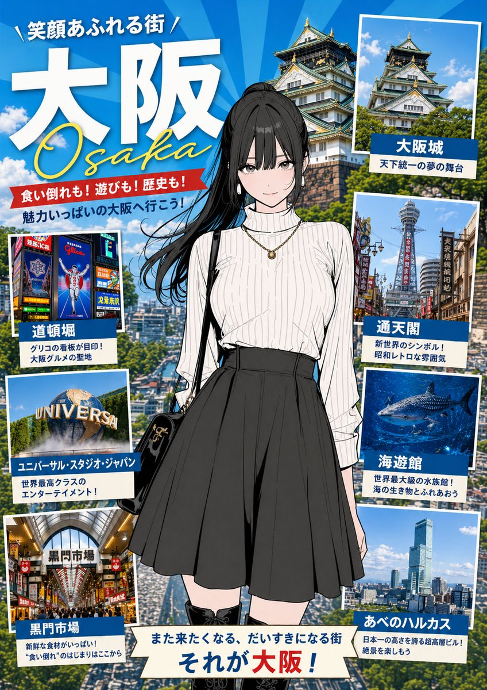</a>

```text
「{argument name="地名" default="地名"}」をアピールするポスター風のイラストを作ってください。 このイラストを中央に、観光地や名所の写真と名称を掲示してください。イラストのタッチは維持。背景はその場所をイメージ。いくつかの場所を紹介してください。
```

## by [Banana Prompts](<https://x.com/bananaprompts>) on April 26, 2026 👉 [Try Now](https://indream.ai/generate?mode=IMAGE&modelKey=gpt-image-v2&modelPromptId=019e6190-3e15-751c-9780-2a23b331a9c4)

<a href="./public/images/73b487a4-7b8d-432e-b035-fef07684ae62.png" target="_blank" rel="noopener noreferrer">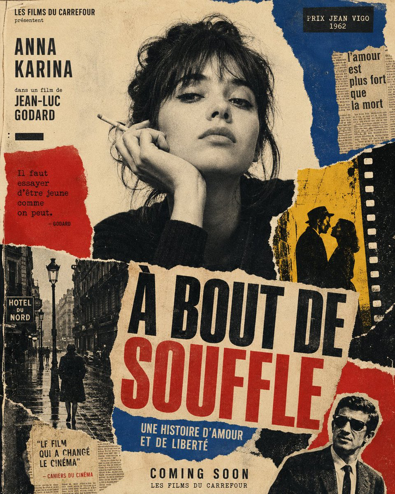</a>

```text
A vintage 1960s French New Wave cinema poster collage on aged beige paper, designed like a torn-paper art-house one-sheet with analog grain, distressed print texture, rough ripped edges, ink wear, halftone imperfections, and slight misregistration. Center the composition around a large black-and-white portrait of a woman with messy dark hair, hand raised to her face, holding a cigarette, cropped from the chest up, with her face obscured by a rectangular blur block. Use a layered collage layout with exactly 8 major paper elements: 1) a top-left black text block reading "LES FILMS DU CARREFOUR présentent" above the large stacked name "ANNA KARINA" and smaller text "dans un film de JEAN-LUC GODARD"; 2) a red torn quote panel on the left reading "Il faut essayer d’être jeune comme on peut. - GODARD"; 3) a blue torn panel in the upper right with a black label reading "PRIX JEAN VIGO 1962"; 4) a narrow torn newspaper clipping on the upper right reading "l’amour est plus fort que la mort"; 5) a yellow torn panel on the mid-right showing a black silhouette of a man in a hat facing a woman, beside a vertical black filmstrip border with white sprocket holes; 6) a bottom-left black-and-white Paris street photo with wet pavement, a lamppost, pedestrians, and a visible sign reading "HOTEL DU NORD"; 7) a small bottom-left review text block reading '"LE FILM QUI A CHANGÉ LE CINÉMA" - CAHIERS DU CINÉMA'; 8) a bottom-right cropped black-and-white portrait of a man in a suit with his face obscured by a rectangular blur block, partially covered by a red torn paper shape. Across the lower middle, place the huge torn-paper title in bold condensed uppercase: "À BOUT DE" in black and "SOUFFLE" in red, slightly angled and spanning most of the width. Under the title, add a blue torn strip with white uppercase text "UNE HISTOIRE D’AMOUR ET DE LIBERTÉ". At the bottom center, add "COMING SOON" in black uppercase and below it "LES FILMS DU CARREFOUR". Limit the palette to faded cream, black, deep ultramarine blue, muted poster red, and mustard yellow. The overall mood is rebellious, romantic, and cinematic, like an iconic French New Wave poster made from ripped magazines, street photography, and bold typography.
```

## by [ざつ＠『竜の姫と絆のユニゾン』『星槍とオムライス』『リリアンのプロの流儀』『B級グルメ革命』](<https://x.com/hyzatu>) on April 26, 2026 👉 [Try Now](https://indream.ai/generate?mode=IMAGE&modelKey=gpt-image-v2&modelPromptId=019e6195-fe68-7398-b405-c1ee1776a428)

<a href="./public/images/8df97149-c803-46e9-bf31-f08280c0f798.png" target="_blank" rel="noopener noreferrer">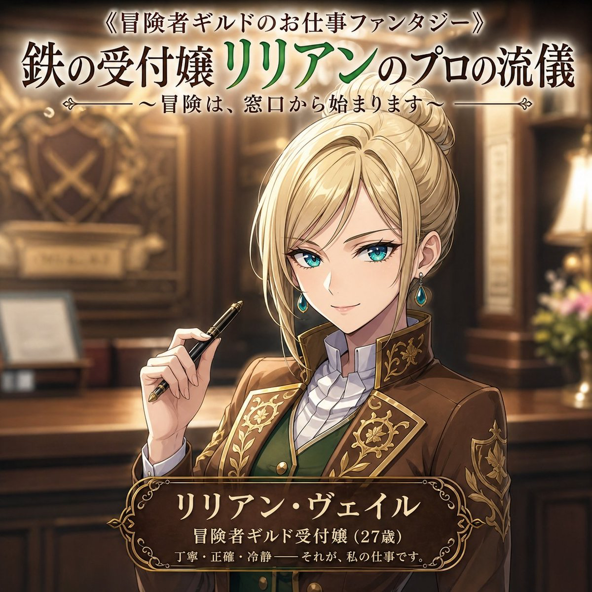</a>

```text
A polished fantasy light-novel cover illustration in anime style, square format, showing a beautiful adult female guild receptionist from the waist up in an elegant adventurer’s guild interior. She stands slightly right of center behind a wooden counter, facing forward with a calm, professional pose, holding a black-and-gold pen lightly in one hand near her shoulder. Her face is intentionally obscured by a large centered beige rectangular censor block. She has {argument name="character name" default="リリアン・ヴェイル"}, age 27, with {argument name="hair color" default="light blonde"} hair styled in a refined updo bun with soft loose bangs framing the face. She wears a dark brown tailored high-collared jacket richly embroidered with ornate gold floral trim, a green vest underneath, and a white ruffled blouse. Add one visible teal gemstone drop earring. The mood is dignified, intelligent, and dependable. The background is a warmly lit, luxurious guild office with dark carved wood, a blurred crest plaque on the wall, framed documents, a desk lamp, flowers, and soft golden bokeh, creating a high-end fantasy workplace atmosphere. At the top, include 3 lines of Japanese title typography: first a small header line reading "《冒険者ギルドのお仕事ファンタジー》", second a large main title line reading "鉄の受付嬢 {argument name="highlighted name text" default="リリアン"} のプロの流儀" with the highlighted name in emerald green and the rest in black, and third a subtitle line reading "〜冒険は、窓口から始まります〜". At the bottom, add an ornate dark brown and gold nameplate with 3 text lines: "{argument name="nameplate text" default="リリアン・ヴェイル"}", "冒険者ギルド受付嬢 (27歳)", and "丁寧・正確・冷静 —— それが、私の仕事です。" Use refined Japanese book-cover typography, decorative flourishes, soft cinematic lighting, subtle depth of field, luxurious textures, and a premium fantasy novel cover composition.
```

## by [サハラカラス＠AI絵](<https://x.com/sahara_karasu>) on April 26, 2026 👉 [Try Now](https://indream.ai/generate?mode=IMAGE&modelKey=gpt-image-v2&modelPromptId=019e6196-eee6-73a8-b727-1b2e2826f8b4)

<a href="./public/images/71d95f6d-a1e9-4f29-ad6e-d5341dff03c5.png" target="_blank" rel="noopener noreferrer">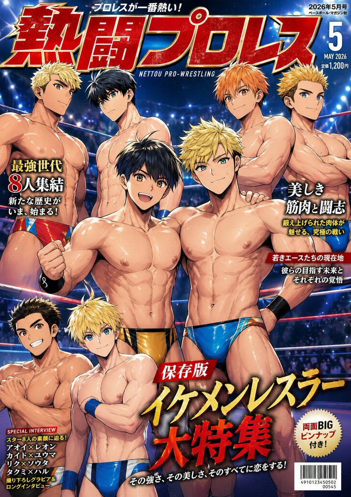</a>

```text
Create a glossy Japanese pro-wrestling magazine cover illustration in a dramatic seinen-anime style. Vertical full-cover composition, packed and high-energy, showing exactly 8 handsome male wrestlers inside a wrestling ring arena under blue-white stadium lights, with blurred audience bokeh in the background and visible red ring ropes crossing behind them. All 8 men are adults with extremely muscular, bodybuilder-level physiques, oiled shiny skin, defined abs, pecs, arms, and shoulders, posed like a special feature lineup for a sports magazine. Arrange them in layered groups: 4 wrestlers across the upper half and 4 across the lower half, with 2 central foreground champions dominating the middle. The central left foreground wrestler has short black hair, a confident serious expression, a clenched right fist, and metallic black-and-gold trunks. The central right foreground wrestler has short spiky blond hair, a stoic expression, one hand on his hip, and metallic bright blue trunks. Around them, place 6 additional wrestlers with varied hair colors and styles including bleached blond, black with long bangs, orange spiky hair, and dark brown spiky hair; all wear colorful pro-wrestling trunks in red, blue, gold, or multicolor patterns, with some wrist tape or wristbands, and all are shirtless. Emphasize glossy highlights, magazine-retouched skin, heroic anatomy, and slightly exaggerated masculine beauty. Use a bold commercial cover design with oversized Japanese masthead text at the top reading {argument name="magazine title" default="熱闘プロレス"} in huge red letters with gold edging and white highlights, plus a smaller English subtitle beneath it reading "NETTOU PRO-WRESTLING". Add a top catchphrase in Japanese above the title: "プロレスが一番熱い！". In the upper right corner, include a blue issue box with white text showing {argument name="issue date" default="2026年5月号"}, a large numeral {argument name="issue number" default="5"}, the English month-year "MAY 2026", and small pricing text "定価1,200円". Place bold feature cover lines around the wrestlers in authentic Japanese magazine typography: on the left, large yellow-white text "最強世代 8人集結" with smaller lines "新たな歴史が いま、始まる！"; on the right, large white text "美しき筋肉と闘志" with smaller yellow and white subhead lines; another red label with white text reading "若きエースたちの現在地" and smaller white text beneath it; a lower-left black box headed "SPECIAL INTERVIEW" in English with multiple stacked Japanese interviewee names; a cream circular burst on the lower right reading "両面BIG ピンナップ付き！". Across the lower center, add the main feature title in explosive oversized Japanese lettering: a red ribbon label "保存版" above giant gold and red text {argument name="main headline" default="イケメンレスラー大特集"}, with a smaller white tagline below: "その強さ、その美しさ、そのすべてに恋をする！". Add a barcode in the bottom right corner with small numeric text beneath it. Overall look: premium Japanese sports-entertainment magazine cover, polished, flashy, energetic, intense, glamorous, crowded but readable, with accurate Japanese text rendering and authentic editorial hierarchy.
```

## by [kendeng啃灯|从新手到高手的成长日志](<https://x.com/kendeng_me>) on April 26, 2026 👉 [Try Now](https://indream.ai/generate?mode=IMAGE&modelKey=gpt-image-v2&modelPromptId=019e6198-ee42-741f-bf33-79d300e9f67b)

<a href="./public/images/defb8f3c-3fef-4aa0-8214-28962b861668.png" target="_blank" rel="noopener noreferrer">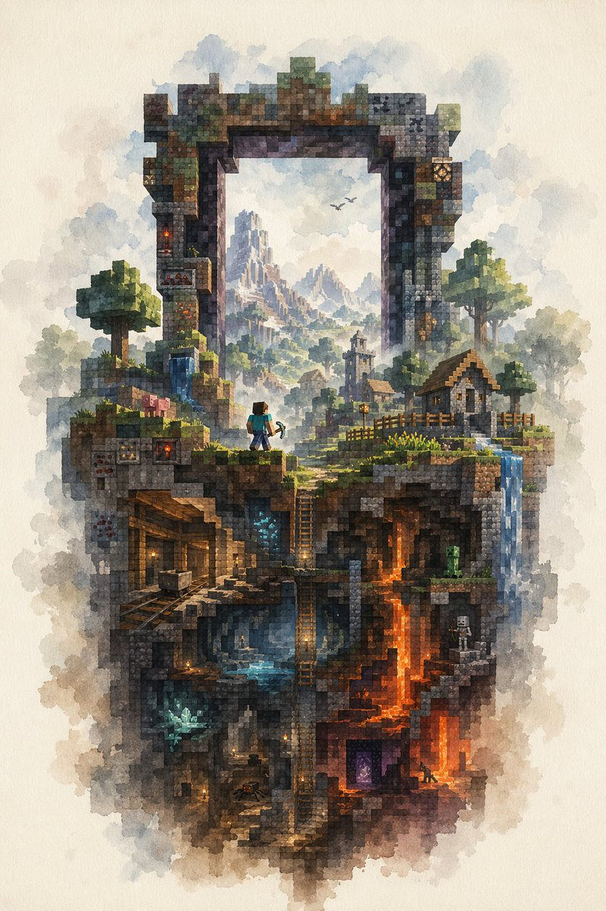</a>

```text
A highly detailed watercolor illustration on textured off-white paper, depicting a vertical floating slice of a Minecraft-inspired world framed by a gigantic ruined rectangular stone portal arch. The composition is centered and portrait-oriented, with soft cloudy washes around the edges and crisp voxel-like block detail inside. At the top, the weathered arch is built from mossy stone, cracked bricks, and mineral-stained blocks, opening like a window onto a distant fantasy mountain range with misty spires and 2 small flying birds. On the upper landscape layer, include 2 blocky trees, 2 small village houses with pitched roofs, 1 church-like tower in the middle distance, wooden fences, grassy ledges, a small waterfall on the left, and another waterfall spilling down the right edge. Place 1 Steve-like adventurer near the center-left foreground, seen from behind, wearing a teal shirt and blue pants and holding a pickaxe, gazing into the world beyond the arch. Add 1 pig on the upper left grassy ledge. Beneath the surface, reveal a cutaway cross-section of underground biomes and structures: 1 abandoned mineshaft with timber supports and minecart rails on the left, 1 central cavern with blue water and ladders descending vertically, 1 glowing blue crystal deposit in a lower-left cave, 1 bright orange lava shaft running downward on the right, 1 green creeper in a mid-right cave, 1 white skeleton archer in a small right-side chamber, 1 purple Nether portal near the lower right, and 1 tiny spider in a dim lower chamber. Scatter warm torchlights through the caves for contrast. The palette should mix earthy browns, mossy greens, cool blue mist, and fiery orange lava, with a dreamy atmospheric perspective in the distance. Render the whole scene as a delicate fusion of Minecraft block geometry and traditional watercolor fantasy painting, intricate, magical, nostalgic, and painterly.
```

## by [heppoko@個人開発](<https://x.com/heppoko85033979>) on April 26, 2026 👉 [Try Now](https://indream.ai/generate?mode=IMAGE&modelKey=gpt-image-v2&modelPromptId=019e619a-4dbb-7613-b17e-933dfd3618fa)

<a href="./public/images/7c4447e5-0e57-4aa9-8b88-4c3487b7ab7d.png" target="_blank" rel="noopener noreferrer">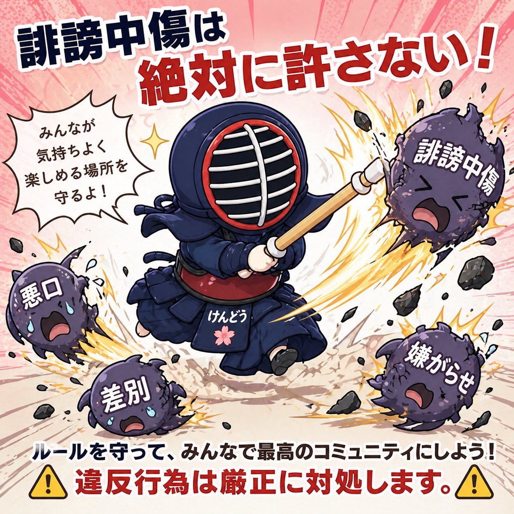</a>

```text
A bold Japanese anti-harassment awareness poster in a cute but forceful chibi anime style, square social-media graphic composition. In the center, a super-deformed kendo character in full navy blue bogu armor is mid-swing with a shinai, charging forward dynamically. The helmet has a dark indigo men with white grill bars and a red inner rim, the torso armor is deep blue with a red do, and the waist apron has the white hiragana text "けんどう" plus a small pink cherry blossom emblem. The character is striking hostile purple spiky monster balls that represent bad behavior. Show exactly 4 monsters with expressive faces and large Japanese labels on their bodies: top right monster labeled "誹謗中傷", lower right monster labeled "嫌がらせ", lower left monster labeled "差別", and left monster labeled "悪口". Each monster is being knocked away or smashed with explosive yellow-orange impact bursts, scattered black debris, motion lines, dust, and sweat tears on some of the monsters. Add a comic speech bubble on the left side containing the Japanese text "みんなが気持ちよく楽しめる場所を守るよ！". At the top, place a huge energetic headline in Japanese with thick outlined lettering: dark navy text for "誹謗中傷は" and bright red text for "絶対に許さない！". At the bottom, add 2 lines of Japanese text: first line in bold dark blue "ルールを守って、みんなで最高のコミュニティにしよう！" and second line in bold red "違反行為は厳正に対処します。". Place one yellow warning triangle icon on the bottom left and one on the bottom right, exactly 2 total. Use a pale pink radial burst background with manga-style speed lines and light texture. Make the overall look clean, high-contrast, friendly, and motivational, like a polished community guidelines illustration for a {argument name="platform type" default="kendo"} community on social media, with thick white sticker-like outlines around major text and characters.
```

## by [SPEEDYAI](<https://x.com/SPEEDAI07>) on April 26, 2026 👉 [Try Now](https://indream.ai/generate?mode=IMAGE&modelKey=gpt-image-v2&modelPromptId=019e619b-1e6c-7113-94bf-604ee7ede244)

<a href="./public/images/5b3c7886-b73a-40d7-9121-fc0c6bdd9ad6.png" target="_blank" rel="noopener noreferrer">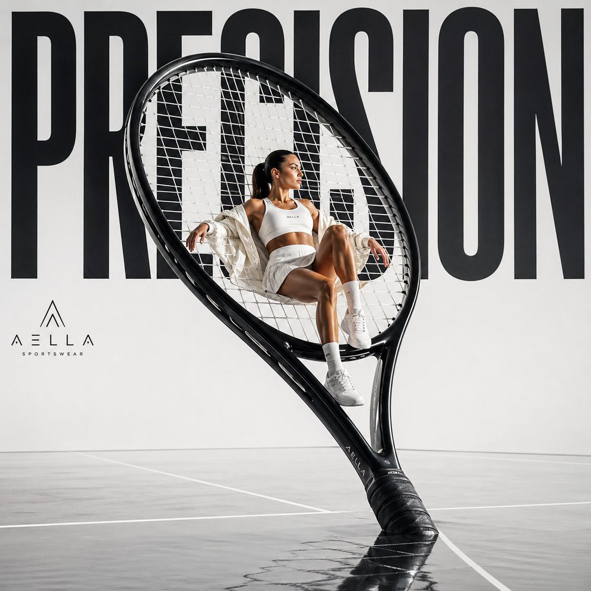</a>

```text
Avant-garde sports fashion advertisement, {argument name="object" default="oversized tennis racket"} positioned like monumental sculpture, female athlete seated casually on the strings as if a suspended lounge, giant word {argument name="text" default="“PRECISION”"} in bold typography behind, crisp white studio backdrop, reflective court-like floor, {argument name="style" default="luxury sportswear editorial aesthetic"}, cinematic lighting, ultra-clean composition, 1:1
```

## by [gerry🗯](<https://x.com/Gerry>) on April 26, 2026 👉 [Try Now](https://indream.ai/generate?mode=IMAGE&modelKey=gpt-image-v2&modelPromptId=019e619c-f1b0-7649-ba90-7d74ce24f53d)

<a href="./public/images/4fb20437-a696-4977-abad-d7fa8413312e.png" target="_blank" rel="noopener noreferrer">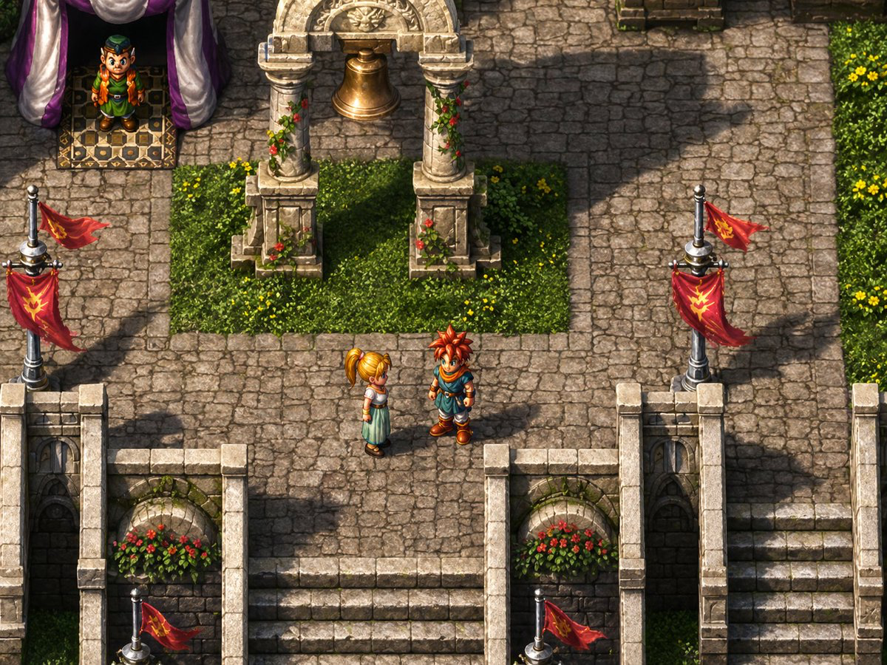</a>

```text
A richly detailed classic JRPG-style isometric town scene inspired by late-1990s fantasy role-playing games, shown from a high three-quarter top-down angle like a pre-rendered game background with hand-painted textures and small sprite-like characters. In the center of a sunlit stone plaza, 2 young adventurer characters stand facing each other in conversation: a spiky red-haired teenage boy wearing a blue tunic, orange scarf, brown gloves, and sturdy boots, and a blonde teenage girl with a high ponytail wearing a pale mint-green dress with a white short-sleeved top and brown shoes. Surround them with weathered cobblestone paving, soft midday light, and long dramatic shadows cast across the square. At the upper center, place an ornate stone bell arch with 2 carved columns, floral vines climbing the pillars, and a hanging bronze bell above a neatly trimmed rectangular grass bed dotted with tiny yellow flowers. At the upper left, include a purple-canopied stall or tent entrance with a patterned rug and 1 small chibi-style NPC vendor standing inside, wearing green clothes and an orange vest. Frame the lower half with elegant white stone railings, 2 recessed flower alcoves filled with red blossoms, and multiple staircases descending out of the plaza. Add 4 visible red banners with gold emblems attached to silver flagpoles, 2 on the left side and 2 on the right side, fluttering diagonally. The architecture should feel medieval-fantasy but clean and charming, with highly detailed masonry, vibrant foliage, nostalgic console-era adventure game atmosphere, polished remastered sprite art, and no user interface or text.
```

## by [Sharon Riley](<https://x.com/Just_sharon7>) on April 26, 2026 👉 [Try Now](https://indream.ai/generate?mode=IMAGE&modelKey=gpt-image-v2&modelPromptId=019e619d-7aab-73ec-83cf-84e30cf87154)

<a href="./public/images/a7d0a151-3752-4904-a2c9-f412dc052c91.png" target="_blank" rel="noopener noreferrer"></a>

```text
Avant-garde sportswear campaign scene featuring {argument name="subject" default="massive gym dumbbells"} transformed into sculptural installations, where a {argument name="athlete type" default="female athlete"} relaxes effortlessly on tensioned cables like a floating designer lounge. Behind her, the word “{argument name="bold text" default="BANGER"}” appears in oversized bold typography as a dominant visual statement. The setting is a pristine white studio with a polished, mirror-like court floor reflecting the scene. Luxury editorial sports aesthetic, cinematic lighting design, minimal yet powerful composition, ultra-clean finish, square 1:1 framing.
```

## by [Mr.ぶーすとくん](<https://x.com/boostkun>) on April 26, 2026 👉 [Try Now](https://indream.ai/generate?mode=IMAGE&modelKey=gpt-image-v2&modelPromptId=019e619d-8b3a-7094-9f1a-5f80f140c20e)

<a href="./public/images/a3bf51d0-bc0f-452b-b845-94fa9a43a586.png" target="_blank" rel="noopener noreferrer">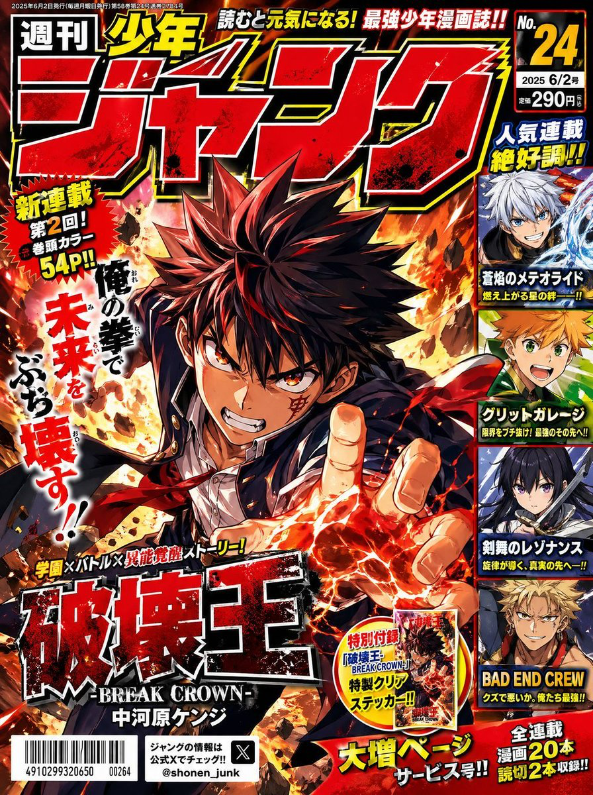</a>

```text
「{argument name="雑誌名" default="週刊少年ジャンク"}」という雑誌の表紙を作成してください。※著作権に気を付けて、侵害しないようにしてください。
```

## by [Smiling Khan](<https://x.com/AIwithkhan>) on April 26, 2026 👉 [Try Now](https://indream.ai/generate?mode=IMAGE&modelKey=gpt-image-v2&modelPromptId=019e61a0-4906-73e3-b264-a90081256c94)

<a href="./public/images/0cf9e70f-0674-41a0-b1d4-0a6211c7b269.png" target="_blank" rel="noopener noreferrer">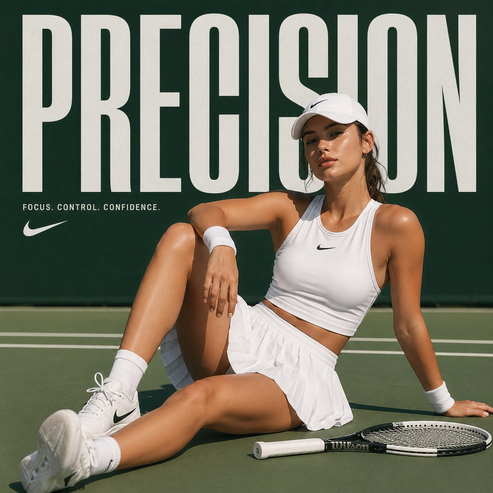</a>

```text
High-fashion sports editorial campaign, {argument name="athlete" default="female tennis athlete"} in {argument name="attire" default="crisp white pleated skirt, fitted performance crop top and white visor cap"}, seated casually on a professional green tennis court with one knee raised and one leg extended, racket resting loosely beside her, relaxed but powerful pose, direct confident gaze, oversized word {argument name="text" default="“PRECISION”"} towering behind in bold condensed typography, minimal palette of deep court green and luminous whites, glossy skin highlights, soft natural sunlight casting subtle directional shadows, ultra-clean composition, premium athletic campaign aesthetic, cinematic luxury lighting, Vogue x Nike style editorial, shallow depth of field, polished magazine cover art, 1:1
```

## by [larry zheng](<https://x.com/larryzheng4>) on April 26, 2026 👉 [Try Now](https://indream.ai/generate?mode=IMAGE&modelKey=gpt-image-v2&modelPromptId=019e61a3-195e-767f-b181-da77cb8ec181)

<a href="./public/images/7db06ae2-fd20-436e-b427-df6a2f1724e1.png" target="_blank" rel="noopener noreferrer">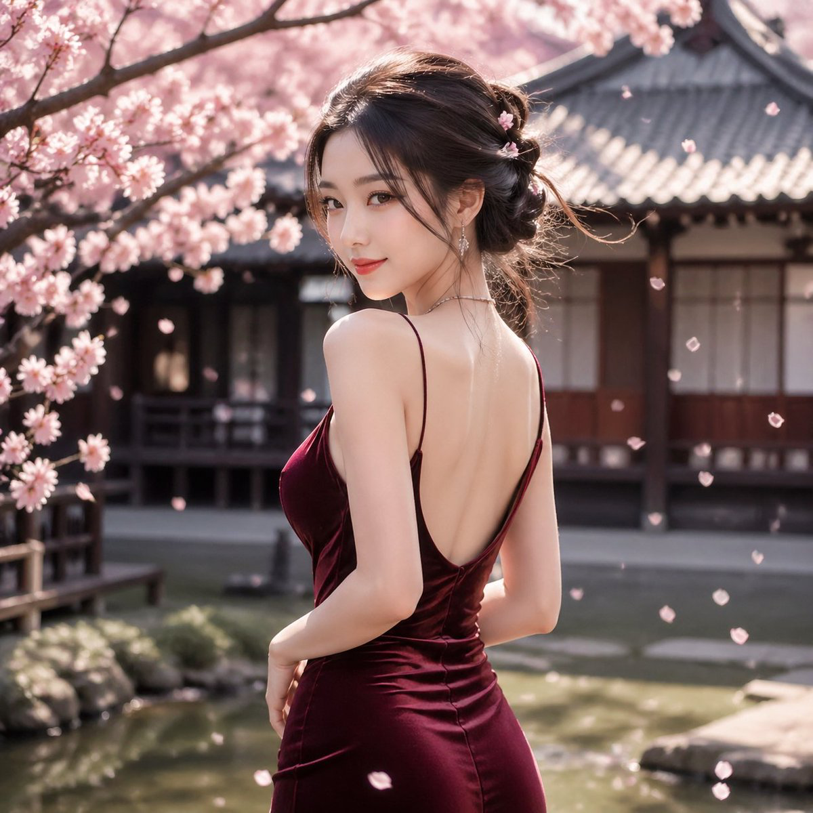</a>

```text
A photorealistic outdoor portrait of an elegant young East Asian woman standing in a traditional Japanese courtyard garden during cherry blossom season. She is shown from a three-quarter back view, turning slightly toward the camera, with her face mostly obscured by her angle. She wears a deep wine-red satin evening dress with thin spaghetti straps and a dramatic low open back, fitted closely through the waist and hips with soft reflective fabric highlights. Her hair is styled in a loose, romantic updo with a few wispy strands, decorated with 3 small pink blossom hair ornaments, and she wears delicate dangling earrings and a fine necklace. Surround her with blooming sakura branches heavy with pale pink flowers, with many individual petals drifting through the air. In the background, place a traditional Japanese wooden building with dark beams, shoji-style windows, and a gray tiled roof, softly blurred with shallow depth of field. Include a calm garden pond and stone edging in the lower background. Use warm spring sunlight, soft cinematic bokeh, high detail skin and fabric rendering, graceful posture, refined luxury fashion photography, natural colors, serene atmosphere, square composition.
```

## by [Johnny Wang](<https://x.com/JohnnyWang8802>) on April 25, 2026 👉 [Try Now](https://indream.ai/generate?mode=IMAGE&modelKey=gpt-image-v2&modelPromptId=019e61a5-0f61-7053-adb1-35f60d817ba3)

<a href="./public/images/1e69fe2f-2366-4103-980a-c9fe63b43bcf.png" target="_blank" rel="noopener noreferrer">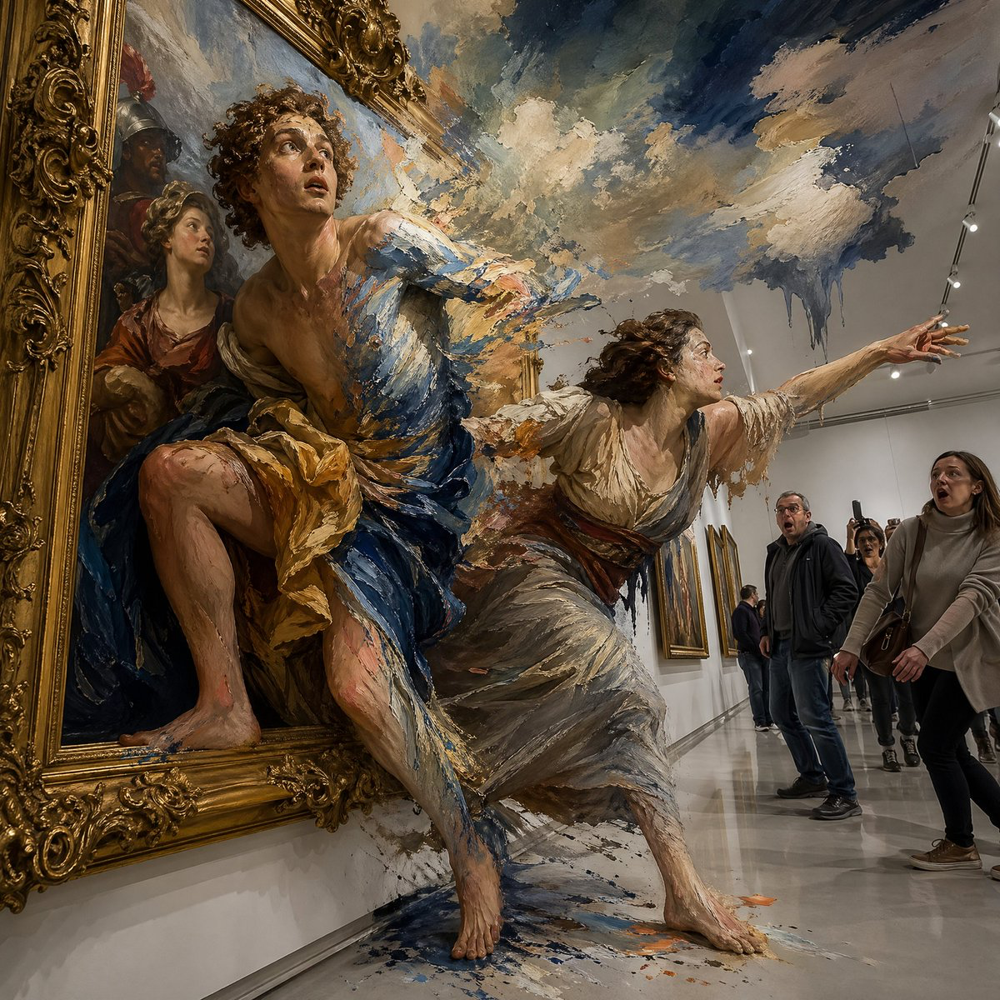</a>

```text
A {argument name="painting style" default="baroque oil painting"} comes to life — its painted figures climbing out of the gilded frame into a {argument name="setting" default="modern white gallery"}, half their bodies still in flat 2D paint, half fully volumetric 3D humans, brushstrokes visible on their skin, the painting's background leaking watercolor clouds into the gallery ceiling, museum visitors frozen in shock, hyper-detailed, {argument name="artist influence" default="René Magritte meets Pixar"}, reality fracturing at every boundary
```

## by [TWnese](<https://x.com/TWnese>) on April 25, 2026 👉 [Try Now](https://indream.ai/generate?mode=IMAGE&modelKey=gpt-image-v2&modelPromptId=019e61a7-0c1b-7117-b5e9-fc1cfeccdba2)

<a href="./public/images/2c1c3c7c-2521-4d5f-815f-66d14b21e359.png" target="_blank" rel="noopener noreferrer">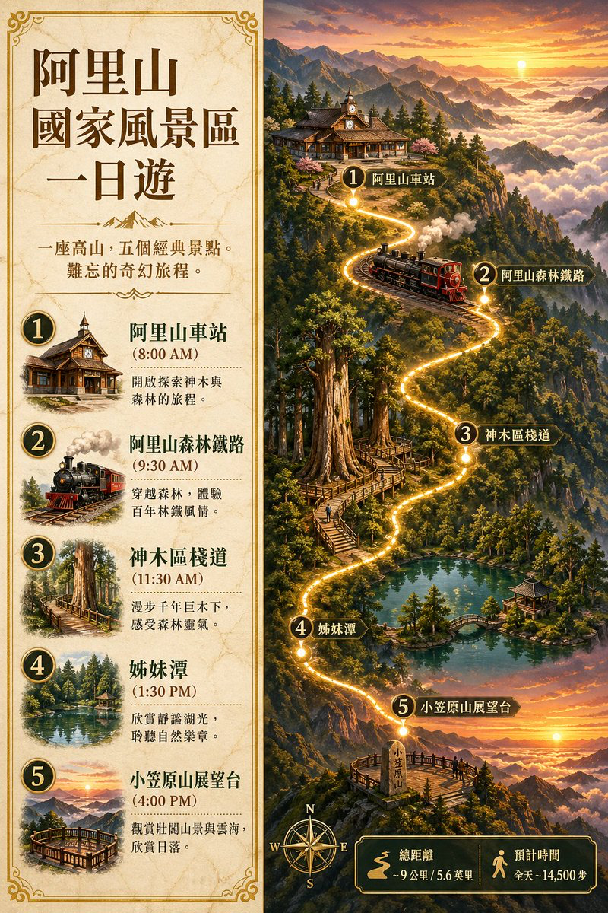</a>

```text
Create a vintage illustrated travel poster in traditional Chinese for {argument name="destination name" default="阿里山國家風景區"}, designed as a one-day itinerary infographic with a split vertical layout. The left panel is a parchment-textured itinerary card in warm beige with ornate gold Art Nouveau borders and dark brown typography, and the right panel is a dramatic painted fantasy-realism map scene of a mountain journey at sunrise and sunset tones. At the top of the left panel, large headline text reads {argument name="headline text" default="阿里山國家風景區一日遊"}. Beneath it, include a short centered tagline in traditional Chinese: 「一座高山，五個經典景點。難忘的奇幻旅程。」 with a small decorative mountain divider. The left panel must contain exactly 5 numbered itinerary stops stacked vertically, each with a circular black-and-gold number badge, a small vignette illustration, a bold location name, a time in parentheses, and a short Chinese description. The 5 stops are: 1. 「阿里山車站」 at 「(8:00 AM)」 with a wooden mountain railway station illustration and description 「開啟探索神木與森林的旅程。」 2. 「阿里山森林鐵路」 at 「(9:30 AM)」 with a red-and-black steam train illustration and description 「穿越森林，體驗百年林鐵風情。」 3. 「神木區棧道」 at 「(11:30 AM)」 with giant cedar trees and elevated wooden boardwalk illustration and description 「漫步千年巨木下，感受森林靈氣。」 4. 「姊妹潭」 at 「(1:30 PM)」 with a tranquil forest lake and pavilion illustration and description 「欣賞靜謐湖光，聆聽自然樂章。」 5. 「小笠原山展望台」 at 「(4:00 PM)」 with a wooden observation deck above clouds at sunset illustration and description 「觀賞壯闊山景與雲海，欣賞日落。」 The right panel should depict a continuous glowing golden path winding through exactly 5 numbered map markers that match the left panel labels in order, with black-and-gold marker plaques reading: 1 「阿里山車站」, 2 「阿里山森林鐵路」, 3 「神木區棧道」, 4 「姊妹潭」, 5 「小笠原山展望台」. Show stop 1 as a rustic alpine wooden station perched on a cliff among pine forests; stop 2 as a small steam locomotive traveling on a curved mountain railway with smoke drifting upward; stop 3 as towering ancient red cypress trees with a spiral and zigzag wooden walkway around the trunks; stop 4 as an emerald lake surrounded by dense forest with a small pavilion and arched bridge; stop 5 as a lookout deck on a peak above a sea of clouds, facing a glowing sunset. The environment should feature layered mountain ranges, mist-filled valleys, evergreen forests, golden-hour light, luminous cloud seas, and a romantic painterly atmosphere with rich detail. At the bottom right, add a decorative compass rose labeled N, E, S, W, plus a dark green and gold information box with exactly 2 stats in traditional Chinese: 「總距離 ~9公里 / 5.6英里」 and 「預計時間 全天 - 14,500步」. Overall style: premium tourism poster, painterly digital illustration, nostalgic national-park brochure aesthetic, highly detailed, warm sepia and gold accents, elegant composition, readable Chinese text, vertical 2:3 poster.
```

## by [松果先森](<https://x.com/songguoxiansen>) on April 25, 2026 👉 [Try Now](https://indream.ai/generate?mode=IMAGE&modelKey=gpt-image-v2&modelPromptId=019e61a9-6b53-7201-bfaa-5ea4c529f46f)

<a href="./public/images/c3743f3f-ed8b-48af-9803-cc4acbdbb15a.png" target="_blank" rel="noopener noreferrer">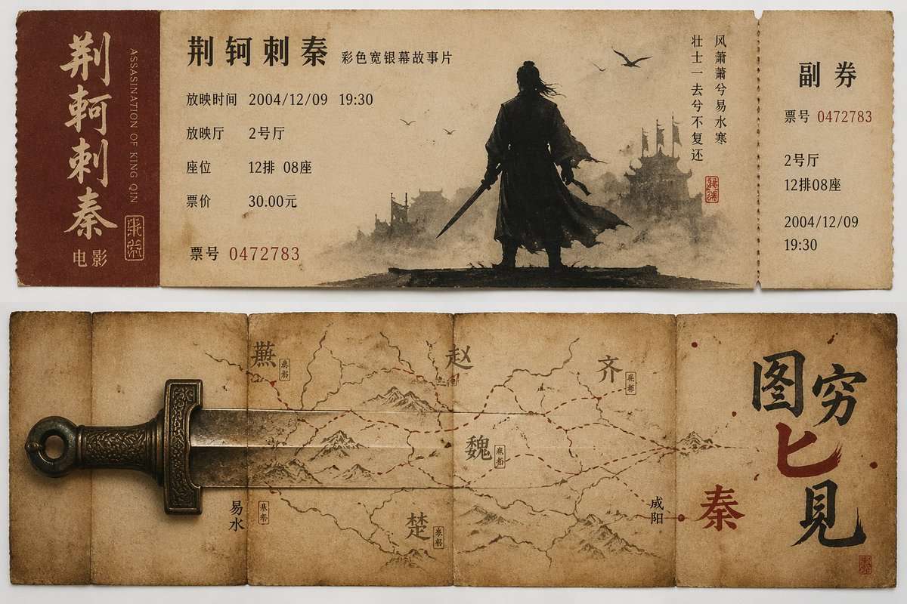</a>

```text
{argument name="电影名称" default="荆轲刺秦"}电影票根，{argument name="图案" default="匕首地图展开图案"}，文案"{argument name="文案" default="图穷匕见"}"
```

## by [竜華 レイ](<https://x.com/Ray_CROWN0>) on April 25, 2026 👉 [Try Now](https://indream.ai/generate?mode=IMAGE&modelKey=gpt-image-v2&modelPromptId=019e61ab-5220-77e9-984a-a517e3a5af48)

<a href="./public/images/dcb66af9-31a1-4021-8edd-9f30d0203008.png" target="_blank" rel="noopener noreferrer">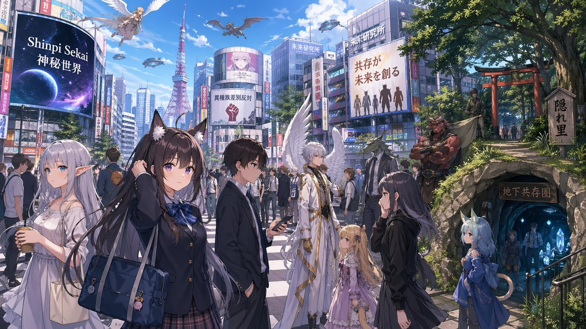</a>

```text
A highly detailed anime-style urban fantasy illustration set at a busy Tokyo-style scramble crossing on a bright clear day, viewed at street level with a wide cinematic composition. The city blends modern realism with mythic fantasy: dense high-rise buildings covered in giant billboards, a red broadcast tower in the middle distance, blue sky with fluffy clouds, and a crowded crosswalk full of pedestrians. In the foreground, show 7 prominent character figures: a silver-haired elf woman in a flowing white dress holding an iced drink and tote bag on the far left; a central schoolgirl with long dark hair, black animal ears, a navy school blazer, plaid skirt, blue ribbon, and large navy shoulder bag, lifting one hand to her head; a young man in a dark suit looking down at a smartphone; an androgynous white-haired angelic figure in an elegant white-and-gold ceremonial outfit with large white wings; a small blonde girl in an ornate pastel pink frilled dress beside the angel; a dark-haired woman in a black coat in right foreground profile; and a small blue-haired cat-eared child in a blue dress with a bow standing near a cave entrance on the right. In the midground crowd, include mixed humans and fantasy races walking together naturally. Add 4 clearly visible nonhuman or supernatural background beings: 1 dragon flying in the sky, 1 winged female angel descending above the street, 1 lizard-headed businessman in a suit near the angelic figure, and 1 tall red-skinned horned demon with crossed arms standing by the hillside path. On the right side, transition the city into a lush shrine hillside with large green trees, a red torii gate, stone steps, and a wooden signboard reading Japanese kanji. Below it, place a rocky cave-like tunnel entrance glowing blue, with a wooden sign over the entrance and several figures descending into an underground shared district lit by crystals. Show 6 major billboard/sign elements across the cityscape: a huge left billboard reading "Shinpi Sekai 神秘世界" with a cosmic planet image; a large central political poster with Japanese text and a raised fist icon; 2 rooftop signs reading "未来研究所" on separate buildings; a large right billboard with Japanese text about coexistence and silhouettes of different beings; and 1 vertical banner with Japanese text on a nearby building. Emphasize the theme of coexistence between ordinary modern city life and hidden fantasy societies. Crisp anime linework, polished light novel key visual rendering, rich textures, soft sunlight, subtle atmospheric perspective, vibrant but believable colors, intricate clothing details, and a sense of awe, everyday bustle, and worldbuilding depth.
```

## by [知识猫图解](<https://x.com/GeekCatX>) on April 25, 2026 👉 [Try Now](https://indream.ai/generate?mode=IMAGE&modelKey=gpt-image-v2&modelPromptId=019e61ae-8eab-774c-9470-1a5c94db6390)

<a href="./public/images/ff0f8cfe-7430-4d3b-bb44-8127e9de95dd.png" target="_blank" rel="noopener noreferrer">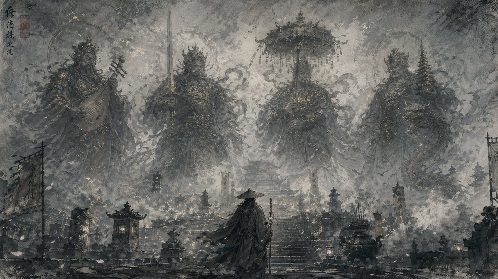</a>

```text
东方水墨幻想风插画，黑灰低饱和色调，宣纸肌理，旧壁画质感，水墨晕染，颗粒感，整体空灵、幽玄、神秘、安静。前景是一位{argument name="人物身份" default="人物"}的背影，站在{argument name="场景位置" default="场景"}；中景有[建筑/道具元素]；远景浮现巨大的{argument name="远景主体" default="神像/幻影/历史人物/佛像/骑兵剪影"}。主体具有半透明叠影感，仿佛由雾气、墨色和柔光凝聚而成，边缘虚化消散，自然融入背景。画面中漂浮着薄雾、水汽、烟尘、飞鸟、花瓣与细小光点，层次丰富，空间深远。整体以灰黑、冷青灰为主，局部点缀低饱和金色和米白色微光，氛围悲悯、宿命、庄严、诗意，电影级纵深构图，东方志怪感，painterly, ethereal, translucent layered silhouettes, misty atmosphere, subtle gold accents, cinematic depth, high detail, soft diffused light, vertical composition

主体：观音 3:4
```

## by [奥多摩プロンプト研究所](<https://x.com/okutama_PL>) on April 25, 2026 👉 [Try Now](https://indream.ai/generate?mode=IMAGE&modelKey=gpt-image-v2&modelPromptId=019e61af-02a3-7631-a7fa-96fea6785a39)

<a href="./public/images/e77d8f3f-43d4-420a-af83-19f731681467.png" target="_blank" rel="noopener noreferrer">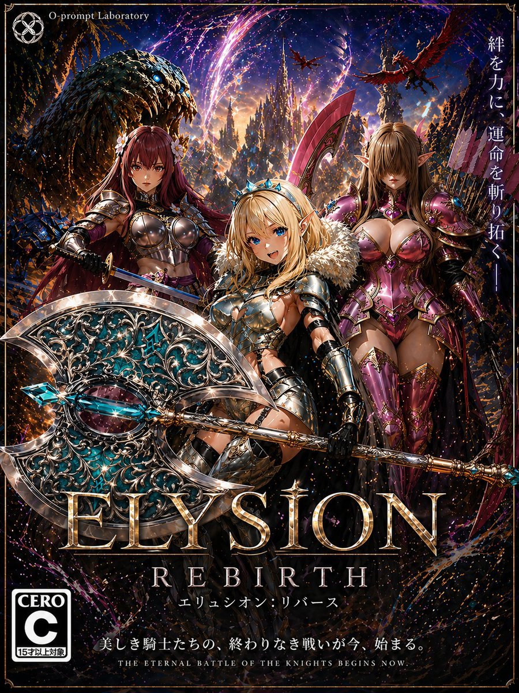</a>

```text
A dramatic Japanese fantasy action RPG PlayStation 5 game cover poster in a dark ornate high-fantasy style, vertically composed like premium key art. Show three armored warrior women standing heroically in the foreground against a glowing night battlefield and a towering gothic fantasy castle city in the distance, with fireworks, embers, magical light trails, and a star-filled purple-blue sky. The central figure is a blonde elf-like knight with pointed ears, a fur-trimmed collar, silver and gold armor, and a powerful stance, holding an enormous double-headed ceremonial battle axe angled across the lower half of the image; the axe is highly detailed with filigree silver metalwork, turquoise-blue crystal inlays, and an intricate engraved circular blade. On the left stands a second female knight with long dark crimson hair, metallic breastplate armor in steel and burgundy tones, and a sword held downward; behind her looms 1 giant black raven or crow with one glowing blue eye. On the right stands a third female knight with long light brown hair covering her eyes, pointed ears, and glossy magenta-pink armor with revealing fantasy plate design; a quiver of arrows is visible behind her shoulder. Include 2 red flying bird-like creatures or phoenixes in the upper right sky. The mood is epic, intense, and slightly gothic, with dense sparks, glowing particles, rim lighting, and lavish metallic reflections. Add an ornate thin gold border framing the entire cover. At the top left, place a small circular emblem and the text "O-prompt Laboratory". Along the right side, add vertical Japanese tagline text: "絆と力に、運命を斬り拓け". At the bottom center, place the game title in large embossed gold serif letters: "{argument name="game title" default="ELYSION"}", with a subtitle beneath in smaller serif capitals: "{argument name="subtitle" default="REBIRTH"}". Below that, add the Japanese subtitle text "エリシオン・リバース". At the bottom left, include a realistic Japanese age rating badge reading "CERO C" with small text "15才以上対象". Along the bottom, add the Japanese tagline "美しき騎士たちの、終わりなき戦いが今、始まる。" and beneath it the English line "THE ETERNAL BATTLE OF THE KNIGHTS BEGINS NOW.". Make it look like polished AAA console box art for a nonexistent fantasy game, ultra-detailed, cinematic, richly textured, high contrast, with the composition dominated by the three women and the oversized axe.
```

## by [奥多摩プロンプト研究所](<https://x.com/okutama_PL>) on April 25, 2026 👉 [Try Now](https://indream.ai/generate?mode=IMAGE&modelKey=gpt-image-v2&modelPromptId=019e61ae-f2d4-7398-b5ad-032b9ddfc579)

<a href="./public/images/bb1a083c-6ee2-4d6f-99b9-90e6c65b9ee5.png" target="_blank" rel="noopener noreferrer">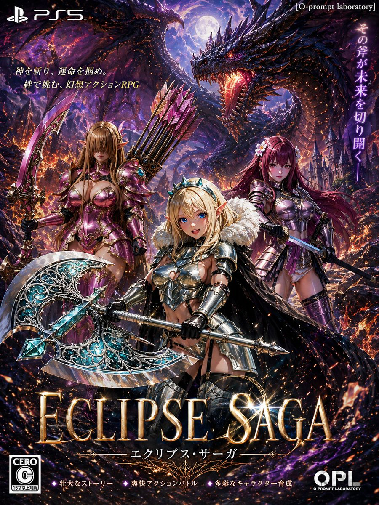</a>

```text
A dramatic Japanese fantasy action RPG key art designed like a PlayStation 5 game cover poster. Vertical composition, ultra-detailed, high-contrast, cinematic dark fantasy. In the background, count 2 enormous black-purple dragons: one dominant dragon on the upper right with mouth wide open, glowing orange fire in its throat, jagged obsidian scales, and blazing eyes; one second dragon silhouette on the upper left with wings spread across the sky. Full moon in the center-top sky, purple nebula clouds, embers, ash, magical sparks, and a ruined gothic castle city on the right background. In the foreground, count 3 female elf warriors standing in a heroic triangular formation, all wearing ornate metallic armor with glossy magenta, silver, and violet tones. Center character: blonde elf princess-warrior, short to medium hair, small crown or jeweled tiara, white fur mantle over shoulders, polished silver armor exposing midriff, black gloves, confident battle stance, wielding a gigantic double-bladed ceremonial axe with intricate filigree, turquoise crystal core, and engraved silver-blue blades. Left character: taller elf archer-warrior with long light brown hair, pointed ears, elaborate rose-magenta armor, large curved fantasy sword in her right hand, and a quiver of pink-fletched arrows on her back. Right character: long dark magenta-haired elf swordswoman with floral hair ornaments, violet-magenta armor, black cape, holding a slender sword angled downward. The image should feel like premium box art for an original game titled {argument name="game title" default="ECLIPSE SAGA"}. Include visible game-package typography and branding elements: top left white PS5 logo; top right small bracketed studio tag [O-prompt laboratory]; large vertical Japanese slogan on the right side; count 2 lines of Japanese promotional copy on the upper left; the main title in huge glowing gold serif letters across the bottom center reading {argument name="game title" default="ECLIPSE SAGA"}; a smaller Japanese subtitle beneath it; bottom left CERO C rating badge; bottom center count 3 short Japanese feature blurbs separated by diamond icons; bottom right OPL logo. Use a lavish painted-anime-meets-hyperreal style, dense detail, polished reflections, fiery rim light, purple and orange color contrast, and the overall feel of a mature-rated epic console fantasy adventure cover.
```

## by [あけゆか](<https://x.com/akeyuka>) on April 25, 2026 👉 [Try Now](https://indream.ai/generate?mode=IMAGE&modelKey=gpt-image-v2&modelPromptId=019e61b1-b041-7079-bd70-fedd3ab29837)

<a href="./public/images/13f35fb2-2456-4a0c-85be-dc843bd66ee9.png" target="_blank" rel="noopener noreferrer">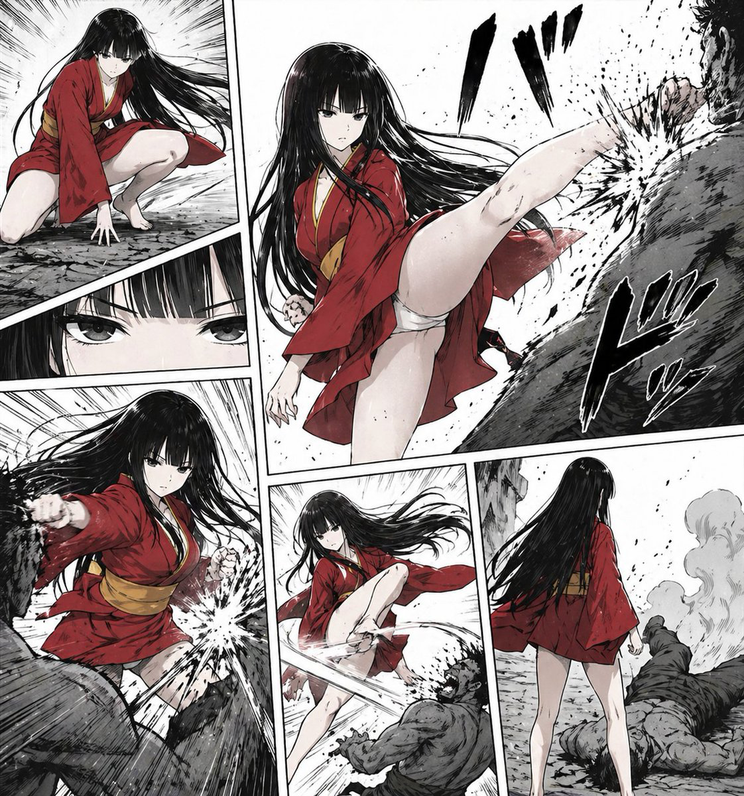</a>

```text
A gritty black-and-white manga action page with selective red color on the heroine’s clothing, arranged as 6 comic panels with dynamic diagonal borders on a white page. The central and largest panel shows a fierce young woman with long straight {argument name="hair color" default="black"} hair and blunt bangs, wearing a short red kimono-style robe with a wide golden obi sash, barefoot, delivering a high vertical kick into a burly man’s face; her face is obscured by a soft square blur, and the impact explodes with ink splatter and debris. In the top-left panel, the same woman crouches low in a feral fighting stance on cracked ground, one hand touching the earth, hair streaming outward, robe open enough to show powerful legs. A narrow close-up panel shows only her intense eyes under straight bangs, cold and focused. In the bottom-left panel, she drives a straight punch into an attacker with a dramatic burst effect at the point of contact. In the bottom-center panel, she performs a rising kick or sweeping upward strike against another large male opponent, with speed lines and hair flowing. In the bottom-right panel, shown from behind, she stands calmly amid defeated men lying on the ground with smoke or dust rising around them, her long hair cascading down her back and the red robe hanging loosely. Use rough ink brushwork, heavy speed lines, splattered impact effects, high-contrast manga shading, violent kinetic composition, and bold Japanese sound effect lettering in black. The mood is brutal, cinematic, and relentless, like a seinen revenge manga. Keep the page mostly monochrome except for the woman’s red robe and subtle warm sash accents.
```

## by [Cell 细胞](<https://x.com/cellinlab>) on April 25, 2026 👉 [Try Now](https://indream.ai/generate?mode=IMAGE&modelKey=gpt-image-v2&modelPromptId=019e61b6-1fbb-715e-8b81-0015265b04b2)

<a href="./public/images/070db846-5d0a-401e-9a0d-970434d6723f.png" target="_blank" rel="noopener noreferrer">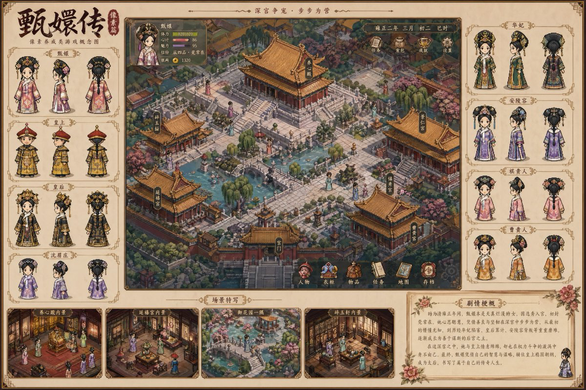</a>

```text
{argument name="电视剧主题" default="甄嬛传"} 电视剧主题 像素养成类游戏概念图，包括 场景全局内容，周围环绕各人物形象三视图，底部是场景特写，右下角是剧情梗概
```

## by [Cell 细胞](<https://x.com/cellinlab>) on April 25, 2026 👉 [Try Now](https://indream.ai/generate?mode=IMAGE&modelKey=gpt-image-v2&modelPromptId=019e61b6-629f-73ee-bc0b-00ffe406b744)

<a href="./public/images/350b49bf-d1c6-4813-9afd-101204856471.png" target="_blank" rel="noopener noreferrer">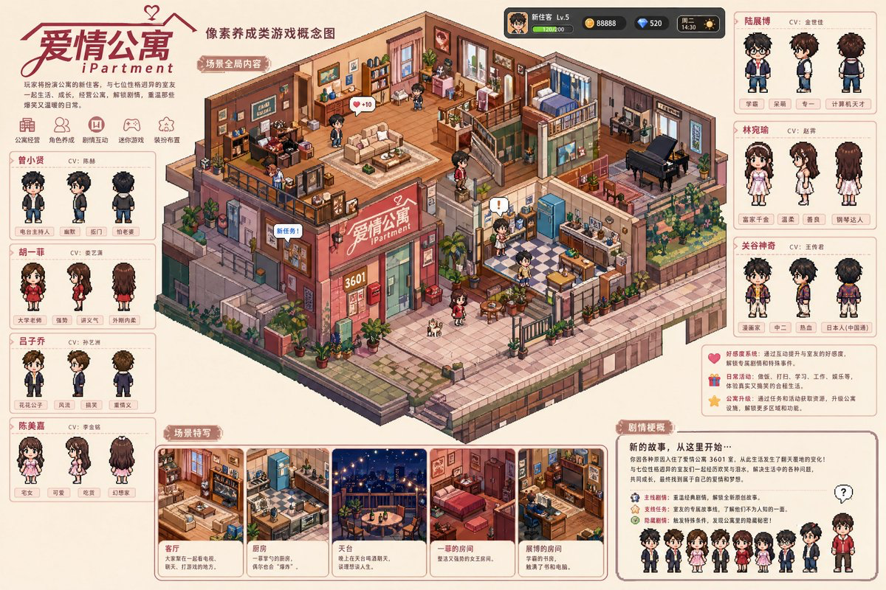</a>

```text
{argument name="主题" default="爱情公寓"} 电视剧主题 像素养成类游戏概念图，包括 场景全局内容，周围环绕各人物形象三视图，底部是场景特写，右下角是剧情梗概
```

## by [miya_p](<https://x.com/miya_space>) on April 25, 2026 👉 [Try Now](https://indream.ai/generate?mode=IMAGE&modelKey=gpt-image-v2&modelPromptId=019e61b7-3d77-767d-91ed-c91b1d830636)

<a href="./public/images/9eb40333-d44f-466f-831a-fc0d2530c545.png" target="_blank" rel="noopener noreferrer">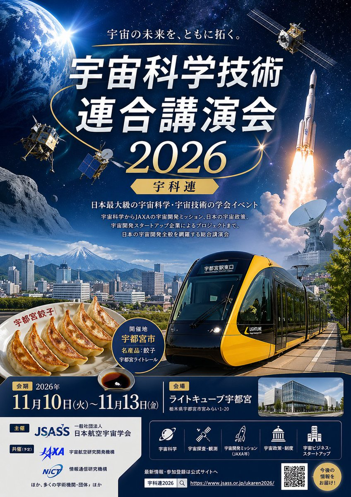</a>

```text
A polished Japanese event poster in a dramatic, aspirational sci-fi tourism style for {argument name="event year" default="2026"}, vertical layout, rich deep-blue space background blending into a bright daytime cityscape. At the top, outer space with a detailed Earth seen from orbit at upper left, a radiant sun flare at the planet’s edge, dense stars and faint nebulae across the sky. Large bold central Japanese headline text in white with subtle gold accents and a strong drop shadow: 「宇宙科学技術 連合講演会 {argument name="event year" default="2026"}」, with a smaller slogan above reading 「宇宙の未来を、ともに拓く。」. Surrounding the title, exactly 4 space elements: 1 lunar lander descending at left, 1 small satellite with blue solar panels near center-left, 1 larger satellite at upper right, and 1 white rocket launching vertically on the right with bright exhaust and billowing smoke. Add elegant golden orbital swoosh lines circling around the title and spacecraft. Below the title, place a gold badge reading 「宇科連」 and several centered lines of smaller Japanese descriptive text about Japan’s largest academic event for space science and technology, involving space science, JAXA space policy, space development startups, and comprehensive discussions on Japan’s space development strategy. The lower half transitions to a realistic panoramic view of Utsunomiya, Japan, with mountains in the distance and Mount Fuji-like snowy peak visible on the horizon, modern mid-rise city buildings, and a wide tram corridor. Feature a sleek modern yellow-and-black light rail tram prominently in the lower right foreground, angled toward the viewer, glossy reflective windows, destination sign reading 「宇都宮駅東口」, with overhead lines absent for a clean futuristic feel. Near the right midground behind the tram, include a large white satellite dish antenna facility. At the lower left, show a plated serving of exactly 6 golden-brown gyoza dumplings on a white dish with a small soy sauce dipping bowl in front; add a curved red Japanese label on the plate rim reading 「宇都宮餃子」. Near the gyoza and tram, include a circular dark-blue callout with gold trim describing the host city and specialties, with Japanese text indicating 「開催地 宇都宮市」 and noting famous local items: gyoza and the Utsunomiya light rail. Along the bottom, create a structured navy information band with gold and white text. Include exactly 5 major information blocks: 1) date block on the left with Japanese text 「会期 2026年 11月10日(火)〜11月13日(金)」 in large high-contrast type, 2) organizer/sponsor block listing 「主催 JSASS 一般社団法人 日本航空宇宙学会」 and co-host logos/text for JAXA and NICT plus a smaller line for additional participating academic societies and organizations, 3) venue block with Japanese text 「会場 ライトキューブ宇都宮 栃木県宇都宮市宮みらい1-20」 plus a small rectangular inset photo of a modern glass building, 4) a row of exactly 5 icon-labeled topic categories reading 「宇宙科学」「宇宙探査・観測」「宇宙開発ミッション（JAXA等）」「宇宙政策・制度」「宇宙ビジネス・スタートアップ」 with simple white line icons above each label, and 5) a website/QR block at the bottom right with a search-bar style URL area showing a JSASS conference URL, a visible QR code, and a yellow circular sticker saying 「今後の情報をお届け！」. Use clean commercial-poster composition, glossy photorealistic montage, crisp typography, realistic lighting, strong contrast, gold highlight accents, and a premium official event-poster finish.
```

## by [らん/百花乱舞](<https://x.com/MiraiCrypko>) on April 25, 2026 👉 [Try Now](https://indream.ai/generate?mode=IMAGE&modelKey=gpt-image-v2&modelPromptId=019e61b7-c4a5-779e-be42-6d3f6bf2d574)

<a href="./public/images/f5bf2694-e7c2-4ff4-ae31-7b7d07b6c1ee.png" target="_blank" rel="noopener noreferrer">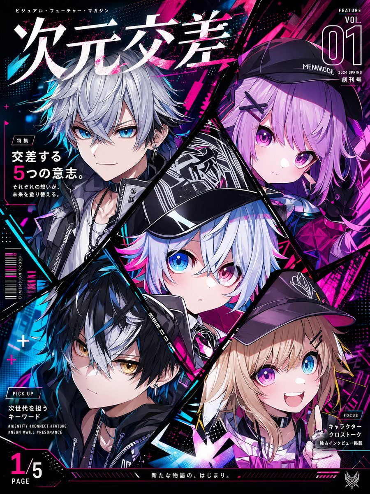</a>

```text
Create a high-energy Japanese futuristic anime magazine cover in portrait orientation, designed like a glossy feature issue packed edge to edge with neon cyberpunk graphics. The composition is split into 5 sharp diagonal polygon panels outlined in black, each panel containing a different anime character portrait. At the top, place an oversized bold Japanese masthead reading {argument name="masthead text" default="次元交差"} in huge distressed white lettering with pink paint splatter and motion-streak accents, spanning almost the full width. Above it, add a small Japanese subtitle line in white. In the top right corner, design a magazine issue block with the words "FEATURE", a very large outlined "01", "VOL.", "MEMMODE", "2024 SPRING", and small Japanese text "創刊号" stacked in a clean editorial layout. The background should be dense with electric magenta, hot pink, cyan, blue, and black abstract streaks, halftone dots, glitch textures, floating plus signs, diagonal slashes, and light flares, giving a loud next-generation visual-culture feel. Show exactly 5 characters: 1) upper left panel, a handsome androgynous anime boy with messy layered silver hair, pale skin, black clothing with straps, zippers, layered necklaces, and a cool dark streetwear look; 2) upper right panel, a cute anime girl with light lavender-pink hair in twin braids, large magenta-violet eyes, a black cap labeled {argument name="cap text" default="MEMMODE"}, black X-shaped hairpins, and a black-purple outfit; 3) center panel, the main featured chibi-faced character with short white hair tipped with cyan and pink, one bright blue eye and one pink eye, wearing a glossy black cap and futuristic black outfit, looking directly at the viewer; 4) lower left panel, a serious anime boy with black hair and a bold white forelock, golden amber eyes, earrings, black hoodie and jacket layers, and blue neon rim lighting; 5) lower right panel, a softer feminine character with wavy blond hair under a dark cap, wearing a choker and holding a silver microphone near the chest, styled in pink-purple lighting. Make all characters highly polished, crisp, and vibrant, with large expressive eyes, sharp cel-shaded rendering, glossy highlights, and layered urban-tech fashion details. Add multiple editorial text blocks around the cover: on the left side a feature callout with Japanese text including "特集", a large stacked headline reading "交差する 5つの意志。", and two smaller Japanese lines below; a vertical side label reading "DIMENSION CROSS" and "MAIN"; a lower-left pickup box with "PICK UP", several Japanese lines, and 3 English hashtag lines such as "#IDENTITY #CONNECT #FUTURE", "#NEON #WILL #RESONANCE"; a bold page fraction "1/5 PAGE" at the bottom left; a bottom right focus box with "FOCUS" and small Japanese text; and a bottom-center Japanese tagline {argument name="bottom tagline" default="新たな物語の、はじまり。"}. The overall style should feel like a premium anime feature magazine cover, chaotic but balanced, with aggressive diagonal framing, strong contrast, glossy print design, and a black base flooded with neon pink and cyan energy.
```

## by [らん/百花乱舞](<https://x.com/MiraiCrypko>) on April 25, 2026 👉 [Try Now](https://indream.ai/generate?mode=IMAGE&modelKey=gpt-image-v2&modelPromptId=019e61b7-b085-723a-afbe-210aff5acd65)

<a href="./public/images/e5a217c1-b7e3-4ebb-bd7f-0d82202cbf8d.png" target="_blank" rel="noopener noreferrer">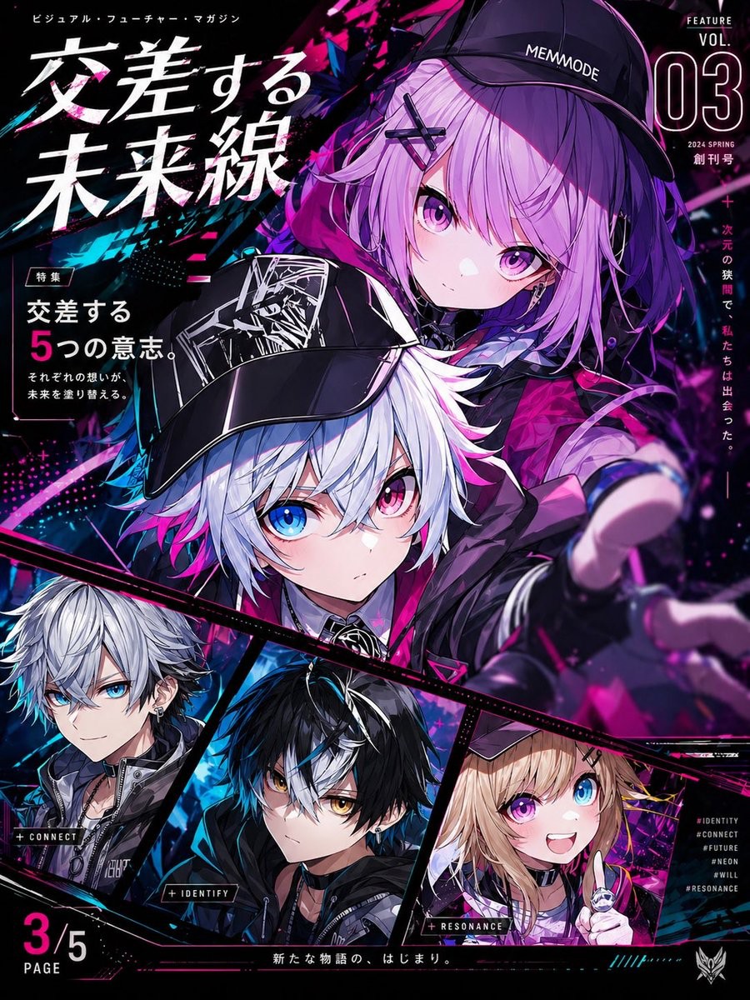</a>

```text
Create a high-impact Japanese anime magazine cover in a futuristic cyberpunk style, vertical portrait format, featuring a close-up ensemble composition of {argument name="main character" default="a pink-haired anime girl"} as the dominant subject. She has a short bob with layered bangs, large violet-pink eyes, pale skin, and a calm but intense expression, wearing a black baseball cap with white text, black X-shaped hairpins, a glossy black streetwear jacket with reflective graphic patches, and a magenta hood. She leans toward the viewer from the upper right-center, with one hand extended toward the camera in dramatic foreshortened perspective. Around her are 4 additional character panels total: 1 partially hidden silver-haired character in the center foreground beneath her, wearing a black cap; 1 silver-haired male character in the lower left triangular panel with dark clothing and earrings; 1 black-haired male character with a bold white forelock and golden eyes in the lower center panel; and 1 blonde female character in the lower right panel with a dark choker and layered fashion styling. Design the image as a glossy magazine cover with dense Japanese typography and editorial layout. Place a very large bold white Japanese headline on the upper left reading {argument name="main headline" default="交差する未来線"}, with smaller Japanese subhead text nearby. Add a top-right issue block reading “FEATURE”, “VOL. 03”, “2024 SPRING”, and “創刊号”. Add vertical Japanese sidebar text along the right edge, a left-side feature box with multiple lines of Japanese copy and a large magenta “5”, a bottom-left page marker reading “3/5 PAGE”, and small English tag labels near the lower panels such as “+ CONNECT”, “+ IDENTITY”, and “+ RESONANCE”. Include a bottom-center Japanese caption strip and a small emblem logo at the bottom right. Use a neon color palette dominated by {argument name="primary color palette" default="electric magenta, violet, black, and cyan"}, with glowing rim light, ink splatter accents, sharp graphic diagonals, halftone textures, glossy highlights, and layered UI-like editorial details. The overall feeling should be edgy, youthful, stylish, and cinematic, like a premium sci-fi visual culture magazine cover.
```

## by [serein](<https://x.com/you1873118>) on April 25, 2026 👉 [Try Now](https://indream.ai/generate?mode=IMAGE&modelKey=gpt-image-v2&modelPromptId=019e61b8-2853-7061-9864-55e1eaaec548)

<a href="./public/images/5b495b86-3aca-479d-a079-7eb34ac96816.png" target="_blank" rel="noopener noreferrer">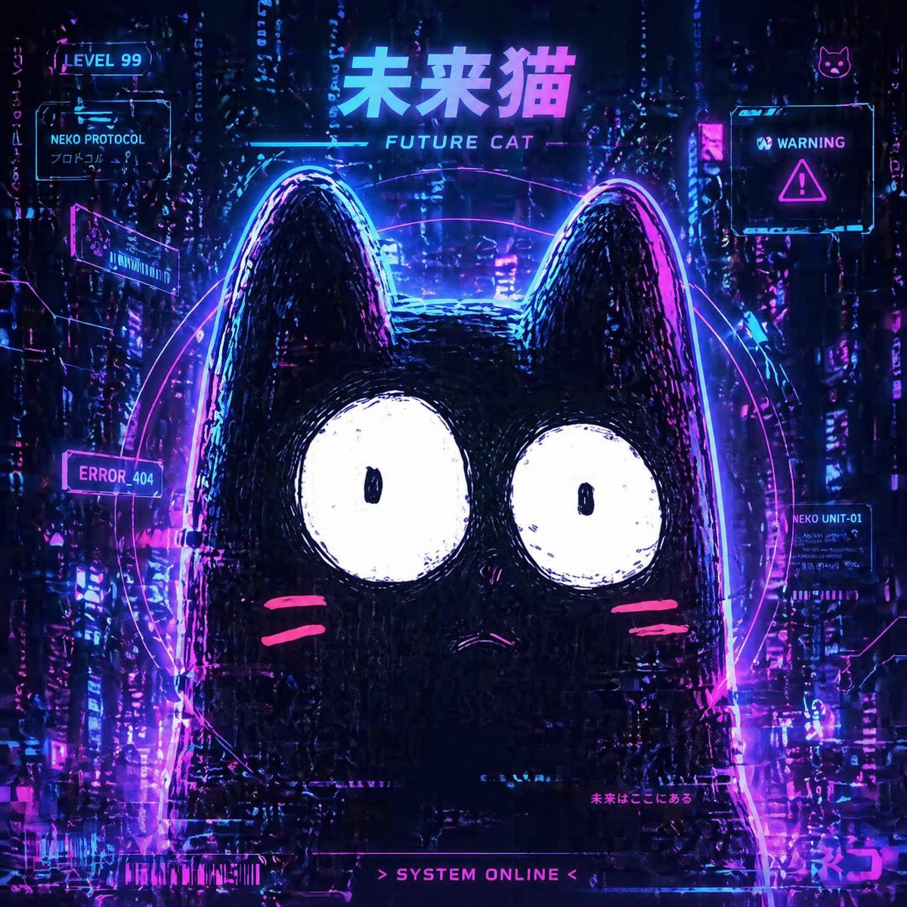</a>

```text
A cyberpunk neon poster-style illustration of a cute futuristic black cat mascot centered in a dark rainy high-tech city. The cat is a simple rounded silhouette with two tall ears, huge white circular eyes with tiny black pupils, a tiny worried mouth, and two hot-pink whisker marks on each cheek. Behind the cat is a glowing circular holographic halo made of layered magenta and cyan rings. The background is a dense futuristic cityscape filled with vertical light streaks, holographic glitches, data noise, reflections, and luminous signage in electric blue, purple, and pink. At the top center, large glowing text reads "未来猫" with smaller text below reading "FUTURE CAT". Include exactly 7 interface panels and HUD elements around the cat: 1 top-left badge reading "LEVEL 99", 1 upper-left panel reading "NEKO PROTOCOL" with smaller Japanese text below, 1 left-mid slanted panel with tiny unreadable techno glyphs, 1 left-lower panel reading "ERROR_404", 1 top-right warning panel reading "WARNING" with a triangular alert icon, 1 right-lower panel reading "NEKO UNIT-01", and 1 bottom-center status strip reading "> SYSTEM ONLINE <". Also add 2 small cat icons, one near the top-right corner and one embedded in the right-side UI area. Add faint small Japanese microtext near the lower right area. Style is glossy synthwave cyberpunk, anime-game UI fusion, poster composition, high contrast, moody nighttime atmosphere, heavy glow bloom, chromatic aberration, glitch texture, holographic reflections, wet neon ambiance, ultra-detailed background with the mascot remaining bold and graphic in the foreground. Square composition.
```

## by [大野ノリ](<https://x.com/ohno_nori_on_x>) on April 25, 2026 👉 [Try Now](https://indream.ai/generate?mode=IMAGE&modelKey=gpt-image-v2&modelPromptId=019e61b8-bf07-7329-8e66-8ebd170d5d11)

<a href="./public/images/5956ac37-eb54-468c-bce9-9da1711a4090.png" target="_blank" rel="noopener noreferrer">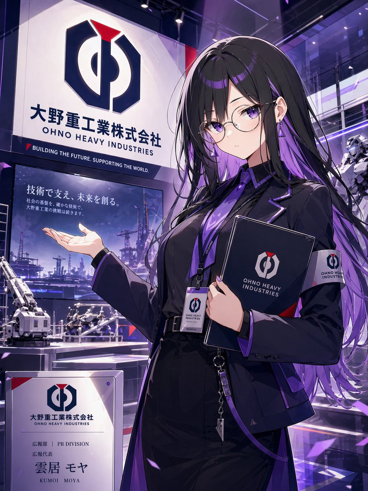</a>

```text
A polished anime-style corporate booth illustration with cel shading and controlled highlights, showing a young adult female PR representative standing three-quarters view in a futuristic industrial exhibition space lit with cool purple and blue accent lighting. Her face is obscured by a centered rectangular blur block. She has very long straight dark hair with subtle purple undertones, flowing past her waist, and wears geometric dangling earrings. Her outfit is a sleek black business suit with white piping along the lapels, a dark inner shirt, a fitted pencil skirt, a belt, and a visible lanyard with ID card. On her left arm she wears a white armband printed with the company logo and the words OHNO HEAVY INDUSTRIES. In one arm she holds a black presentation folder with the same logo and company name, and with her other hand she gestures open-palmed toward the booth displays as if introducing the company. The booth branding is prominent: a large illuminated wall sign in the upper left with the logo, the Japanese company name "大野重工業株式会社", the English name "OHNO HEAVY INDUSTRIES", and the slogan "BUILDING THE FUTURE. SUPPORTING THE WORLD." Below it is a large poster panel showing an industrial refinery skyline at dusk with Japanese copy reading "技術で支え、未来を創る。" and smaller text beneath. In the lower left foreground, place a standing nameplate sign with the same logo and company name, plus the department line "広報部 | PR DIVISION" and the representative name "雲居 モヤ" with the romanization "KUMOI MOYA". Also show her hanging ID badge with the logo and small text suggesting PR staff credentials. The exhibition floor includes 3 visible industrial display elements: a white robotic construction machine model on a pedestal at left, a smaller mechanical display in the mid-background, and a large white humanoid or armored industrial mech figure on the right background. Use a high-end convention or trade-show setting with glossy reflective surfaces, glass panels, sharp perspective lines, and branded panels throughout. Composition should be vertical, waist-up to near full-body framing, with the character dominating the right-center and the company signage clearly readable on the left. Emphasize refined anime character design, professional corporate ambassador energy, futuristic heavy-industry branding, purple ambient glow, and clean cel-shaded rendering rather than overly sparkly effects.
```

## by [聖星あい＠AIギャルプロデューサー](<https://x.com/seisei_ai_1st>) on April 25, 2026 👉 [Try Now](https://indream.ai/generate?mode=IMAGE&modelKey=gpt-image-v2&modelPromptId=019e61b9-d5d0-727c-92df-3e117c857408)

<a href="./public/images/be81247a-9a19-4cc1-9445-37d6a3d6619d.png" target="_blank" rel="noopener noreferrer">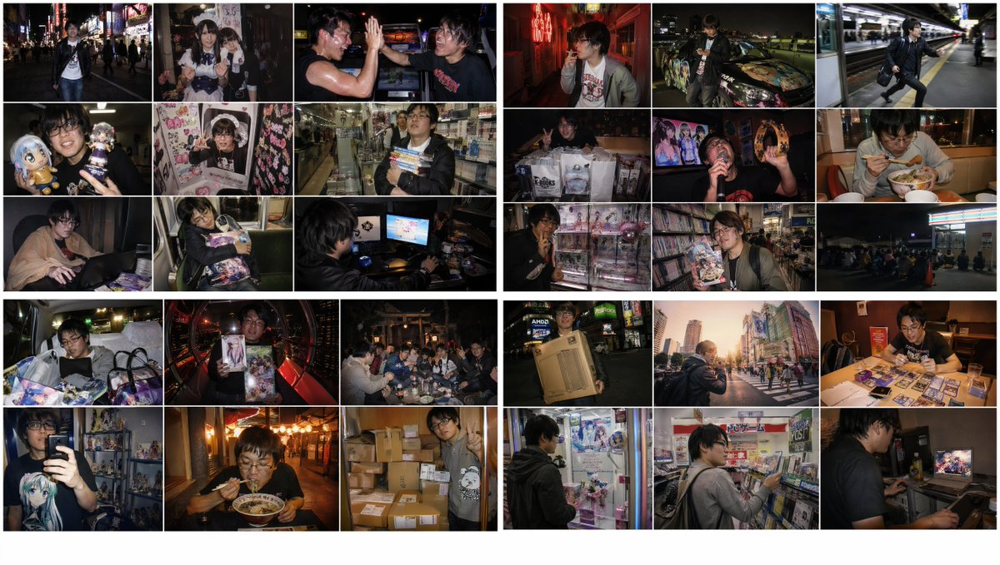</a>

```text
16:9の2K画像を以下のプロンプトに基づいて3×3のグリッド画像を４枚作成して。\n深夜～早朝の2010年代アキバ系オタク男子（平成後期〜令和初期の典型的なアキバ系）をテーマにしたエモーショナルな画像。但し、写真シチュエーションは<テーマ>の中から重複しないようにランダムに選んでください。\n2010年代のコンパクトデジタルカメラまたはiPhone 4〜X時代の直射フラッシュを使用したスナップショットスタイル。\nデジタルノイズ、軽いJPEGアーティファクト、周辺減光、暖色系のフェードトーンと少しオーバーサチュレーションが特徴的。\n2010年代〜2020年初頭のデジタル写真特有のノスタルジックで生々しい質感。\n儚く、少しデジタル臭い2010sスナップ写真風。\n<テーマ>\n・深夜のアキバ中央通り — ネオンと看板に照らされて歩く\n・メイド喫茶の出口 — 萌え袖をはめたメイドと記念撮影\n・ゲーセン（秋葉原）の格ゲー筐体前 — 対戦終わりに汗だくでハイタッチ\n・UFOキャッチャー前 — 取ったフィギュアやぬいぐるみを自慢げに見せる\n・プリクラ機の中 — フレームにデコられた痛車シール貼り\n・アニメイト深夜 — 新刊ラノベや同人誌を抱えてレジ待ち\n・マンガ喫茶の個室 — ブランケットにくるまりながらノートPCでエロゲー\n・終電の山手線 — 痛バッグとフィギュアの袋を抱えて寝落ち\n・始発電車待ちのネットカフェ — モニターの光だけが顔を照らす\n・ラブホ街の路地 — ネオンに照らされた秋葉原の裏路地でたばこ\n・屋上駐車場 — 夜景をバックに痛車を自慢しながらスマホチェック\n・秋葉原の駅ホーム — 厚底スニーカーやドレスシューズで走る\n・ゲームソフト中古店前 — 深夜閉店後に袋いっぱいの獲物を並べて撮影\n・カラオケボックス — アニソン熱唱＆タンバリン（またはコスプレ）\n・牛丼屋（すき家）深夜 — 夜明け前に大盛り牛丼を頬張る\n・ファミレス（ガスト） — トレカやスリーブを並べてデッキ構築\n・クレーンゲームの筐体前 — 景品のエロゲやフィギュアを大量ゲット\n・TSUTAYA秋葉原店深夜 — アニメBD特典付きを物色\n・コンビニの駐車場 — 深夜に新作ゲームの発売日を待つ行列\n・タクシーの後部座席 — 痛バッグだらけの荷物と一緒に\n・観覧車ゴンドラ内 — 夜景をバックに萌えグッズを見せる\n・神社の境内 — 深夜に同人誌即売会の打ち上げ\n・スマホ自撮り（フロントカメラ） — 部屋にフィギュア棚が映り込む\n・路上でコスプレ調整 — 駅近くの路地でウィッグ直し\n・朝帰りの始発電車 — 徹夜明けで疲れ果てて寝落ち\n・エレベーター内 — メイド服の女の子と一緒（微妙に距離を取る）\n・秋葉原の屋台ラーメン — 〆にこってりラーメンをすする\n・自宅マンションの階段 — 段ボールだらけの通販荷物と一緒に\n・PCパーツショップ前 — 深夜セール後の巨大なPCケースを抱える\n・朝日のアキバ中央通り — スクランブル交差点のような人混みで佇む
```

## by [Nur Ayu](<https://x.com/nurayuofficial>) on April 24, 2026 👉 [Try Now](https://indream.ai/generate?mode=IMAGE&modelKey=gpt-image-v2&modelPromptId=019e61bb-82a3-748a-822f-a3625c9d32ca)

<a href="./public/images/a05bdeb3-b001-4d8b-9fff-d017456e42e7.png" target="_blank" rel="noopener noreferrer">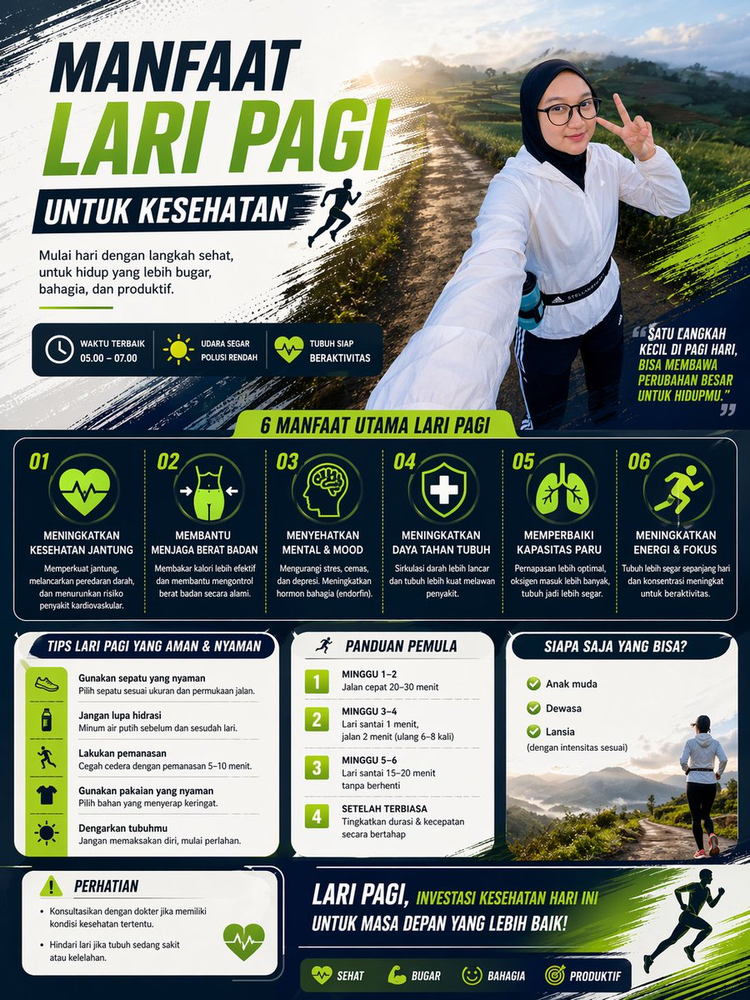</a>

```text
{"type":"fitness health infographic poster","topic":"{argument name=\"headline text\" default=\"MANFAAT LARI PAGI\"}","language":"Indonesian","style":{"look":"clean modern sporty infographic","palette":["navy blue","lime green","white","yellow accents"],"finish":"high-contrast, polished social-media-ready poster","graphics":"bold italic condensed headlines, brush-stroke textures, rounded dark panels, simple vector fitness icons, energetic diagonal accents"},"canvas":{"aspect_ratio":"3:4","background":"split layout with white textured graphic design on the left and a sunrise rural jogging path photo on the right"},"main_visual":{"subject":"{argument name=\"main subject\" default=\"a woman taking a running selfie\"}","appearance":"wearing a white windbreaker, dark pants, dark hijab, waist belt with water bottle, one hand raised in a peace sign","placement":"upper right, overlapping the scenic background","background_scene":"golden morning light over a dirt path through green hills and fields"},"layout":{"sections":[{"title":"MANFAAT LARI PAGI UNTUK KESEHATAN","position":"top left hero area","count":1,"labels":["headline with subheadline paragraph"]},{"title":"quick benefits strip","position":"upper middle-left","count":3,"labels":["WAKTU TERBAIK 05.00 – 07.00","UDARA SEGAR POLUSI RENDAH","TUBUH SIAP BERAKTIVITAS"]},{"title":"6 MANFAAT UTAMA LARI PAGI","position":"center wide panel","count":6,"labels":["01 MENINGKATKAN KESEHATAN JANTUNG","02 MEMBANTU MENJAGA BERAT BADAN","03 MENYEHATKAN MENTAL & MOOD","04 MENINGKATKAN DAYA TUBUH","05 MEMPERBAIKI KAPASITAS PARU","06 MENINGKATKAN ENERGI & FOKUS"]},{"title":"TIPS LARI PAGI YANG AMAN & NYAMAN","position":"lower left card","count":5,"labels":["Gunakan sepatu yang nyaman","Jangan lupa hidrasi","Lakukan pemanasan","Gunakan pakaian yang nyaman","Dengarkan tubuhmu"]},{"title":"PANDUAN PEMULA","position":"lower center card","count":4,"labels":["1 MINGGU 1–2 Jalan cepat 20–30 menit","2 MINGGU 3–4 Lari santai 1 menit, jalan 2 menit (ulang 6–8 kali)","3 MINGGU 5–6 Lari santai 15–20 menit tanpa berhenti","4 SETELAH TERBIASA Tingkatkan durasi & kecepatan secara bertahap"]},{"title":"SIAPA SAJA YANG BISA?","position":"lower right card","count":3,"labels":["Anak muda","Dewasa","Lansia (dengan intensitas sesuai)"]},{"title":"PERHATIAN","position":"bottom left notice box","count":2,"labels":["Konsultasikan dengan dokter jika memiliki kondisi kesehatan tertentu.","Hindari lari jika tubuh sedang sakit atau kelelahan."]},{"title":"bottom slogan banner","position":"bottom center to right","count":4,"labels":["SEHAT","BUGAR","BAHAGIA","PRODUKTIF"]}],"quote":{"text":"{argument name=\"quote\" default=\"SATU LANGKAH KECIL DI PAGI HARI, BISA MEMBAWA PERUBAHAN BESAR UNTUK HIDUPMU.\"}","position":"right side over dark overlay near the main subject"}},"text_blocks":{"intro":"Mulai hari dengan langkah sehat, untuk hidup yang lebih bugar, bahagia, dan produktif.","closing":"LARI PAGI, INVESTASI KESEHATAN HARI INI UNTUK MASA DEPAN YANG LEBIH BAIK!"},"iconography":{"count":21,"items":["running silhouette near headline","clock icon","sun icon","heart/fitness icon","heart pulse icon","waist/body icon","brain icon","shield medical cross icon","lungs icon","running figure icon","shoe icon","water bottle icon","stretching/warmup icon","shirt icon","sun/weather icon","small running icon above beginner guide","3 green check icons in eligibility card","warning triangle icon","heart pulse badge in notice box","runner silhouette at bottom right"]},"composition_notes":"bold oversized lime-green title, navy header bars with white text, each section inside rounded rectangular cards, six central benefit columns evenly spaced, use photo-realistic outdoor background combined with vector infographic elements, dynamic brush splashes in navy and lime in corners, premium Indonesian health-poster aesthetic","rendering":"sharp typography, editorial layout, clean spacing, legible infographic hierarchy"}
```

## by [FLO - Creative Builder](<https://x.com/FloNocode>) on April 24, 2026 👉 [Try Now](https://indream.ai/generate?mode=IMAGE&modelKey=gpt-image-v2&modelPromptId=019e61bc-de33-71ba-bbfc-7645c8f88983)

<a href="./public/images/b314f649-bcfa-475c-a196-0325e8d71de2.png" target="_blank" rel="noopener noreferrer">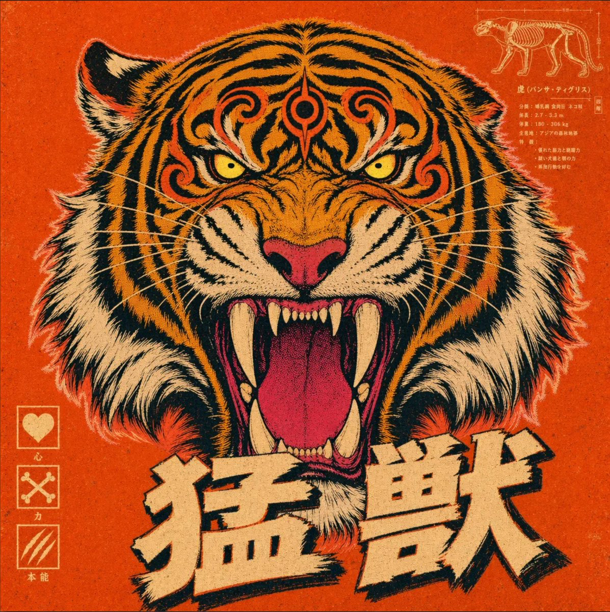</a>

```text
Create a bold vintage Japanese-inspired poster on a square canvas with a fierce front-facing tiger head as the single central subject, perfectly symmetrical and filling most of the frame. The tiger is roaring with its mouth wide open, showing long curved ivory fangs, smaller lower teeth, a vivid pink tongue, a dark throat, a pink nose, intense yellow eyes, and dramatic black stripes over saturated orange fur with white cheek and neck fur. Add ornamental swirling stripe patterns on the forehead to give the face a stylized mythic look. Use a gritty retro screenprint or risograph texture with visible grain, worn ink, slightly distressed edges, and a limited palette of burnt orange, black, cream, white, muted pink, and small accents of yellow. The background should be a flat textured orange-red field. In the top right, include 1 small technical diagram panel showing a side-view tiger skeleton in thin cream line art with compact vertical Japanese annotation text beneath and beside it, like a pseudo-scientific label block. In the bottom left, include 3 vertically stacked icon boxes with thin cream borders: the first contains a heart icon with the label 心, the second contains crossed bones with the label 力, and the third contains three claw marks with the label 本能. Across the bottom center, place 2 very large cream-colored Japanese kanji characters with heavy black drop shadows and a rough hand-cut block print feel: 猛獣. Keep the overall composition aggressive, iconic, poster-like, centered, and highly graphic, blending traditional Japanese poster aesthetics, tattoo flash energy, and vintage animal anatomy chart styling.
```

## by [F.Yasuaki](<https://x.com/yasuaki_05>) on April 24, 2026 👉 [Try Now](https://indream.ai/generate?mode=IMAGE&modelKey=gpt-image-v2&modelPromptId=019e61bd-46a6-7640-98ab-eff172b81168)

<a href="./public/images/827e61c7-e230-4e72-9475-6f279884ce2f.png" target="_blank" rel="noopener noreferrer">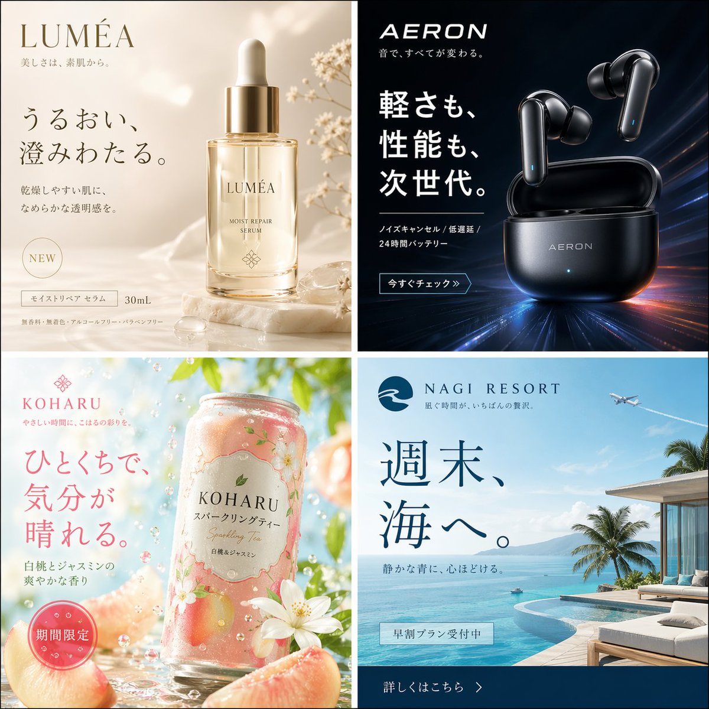</a>

```text
{"type":"four-panel Japanese advertising collage","style":"premium commercial key visual, highly polished product advertising, realistic photography with elegant typography and strong brand identity","format":"square 2x2 grid with thin white dividers","panels":[{"position":"top-left","brand":"LUMÉA","category":"skincare serum ad","background":"warm ivory-beige luxury setting with soft diffused light, silky fabric, pale stone slab, tiny translucent serum droplets, delicate dried white flowers, dreamy shallow depth of field","subject":{"count":1,"product":"glass dropper bottle filled with pale golden serum","label_text":"LUMÉA MOIST REPAIR SERUM","details":"clear rectangular bottle, glossy gold cap and dropper, centered upright composition, premium cosmetic photography"},"text":{"count":6,"items":["LUMÉA","美しさは、素肌から。","うるおい、澄みわたる。","乾燥しやすい肌に、なめらかな透明感を。","NEW","モイストリペア セラム 30mL"]}},{"position":"top-right","brand":"AERON","category":"wireless earbuds ad","background":"deep black and electric blue futuristic scene with glowing radial light streaks, subtle motion energy, glossy reflections, dramatic contrast","subject":{"count":1,"product":"pair of black true wireless earbuds with open charging case","label_text":"AERON","details":"one earbud floating upright, one angled above the case, glossy metallic finish, tiny blue LED accent lights, centered hero shot"},"text":{"count":6,"items":["AERON","音で、すべてが変わる。","軽さも、性能も、次世代。","ノイズキャンセル／低遅延／24時間バッテリー","今すぐチェック","AERON on case front"]}},{"position":"bottom-left","brand":"KOHARU","category":"sparkling tea can ad","background":"bright airy pastel scene with sparkling water droplets, soft aqua and peach tones, fresh fruit slices, white blossoms, sunlit bokeh, refreshing summery mood","subject":{"count":1,"product":"slim pink can of sparkling tea","label_text":"KOHARU スパークリングティー Sparkling Tea 白桃とジャスミン","details":"condensation on can, upright centered can surrounded by peach slices and flowers, highly refreshing beverage photography"},"text":{"count":5,"items":["KOHARU","やさしい時間に、ここはるの彩りを。","ひとくちで、気分が晴れる。","白桃とジャスミンの爽やかな香り","期間限定"]}},{"position":"bottom-right","brand":"NAGI RESORT","category":"travel resort ad","background":"clear tropical coastal landscape with infinity pool, modern villa terrace, lounge chairs, palm trees, calm ocean, distant islands, bright blue sky, small airplane leaving a white trail","subject":{"count":1,"product":"luxury seaside resort destination scene","label_text":"NAGI RESORT","details":"wide scenic composition, tranquil premium vacation atmosphere, architecture on right side, ocean view dominating the frame"},"text":{"count":6,"items":["NAGI RESORT","駆ける時間が、いちばんの贅沢。","週末、海へ。","静かな青に、心ほどける。","早割プラン受付中","詳しくはこちら"]}}],"typography":{"language":"Japanese with Latin brand names","style":"editorial ad layout, elegant serif for luxury beauty and resort panels, bold modern sans-serif for tech panel, soft feminine serif and rounded styles for beverage panel"},"lighting":"each panel uses category-specific premium ad lighting: soft creamy glow for skincare, dramatic neon rim light for earbuds, sparkling sunlit freshness for beverage, crisp natural daylight for resort","quality":"ultra-detailed, photorealistic, realistic packaging text placement, believable ad compositing, polished marketing mockup"}
```

## by [Johnny Wang](<https://x.com/JohnnyWang8802>) on April 24, 2026 👉 [Try Now](https://indream.ai/generate?mode=IMAGE&modelKey=gpt-image-v2&modelPromptId=019e61c0-c166-7488-b08f-089d15be38be)

<a href="./public/images/b7e8b9ac-9278-4a51-b0f5-63ae2b41ab26.png" target="_blank" rel="noopener noreferrer">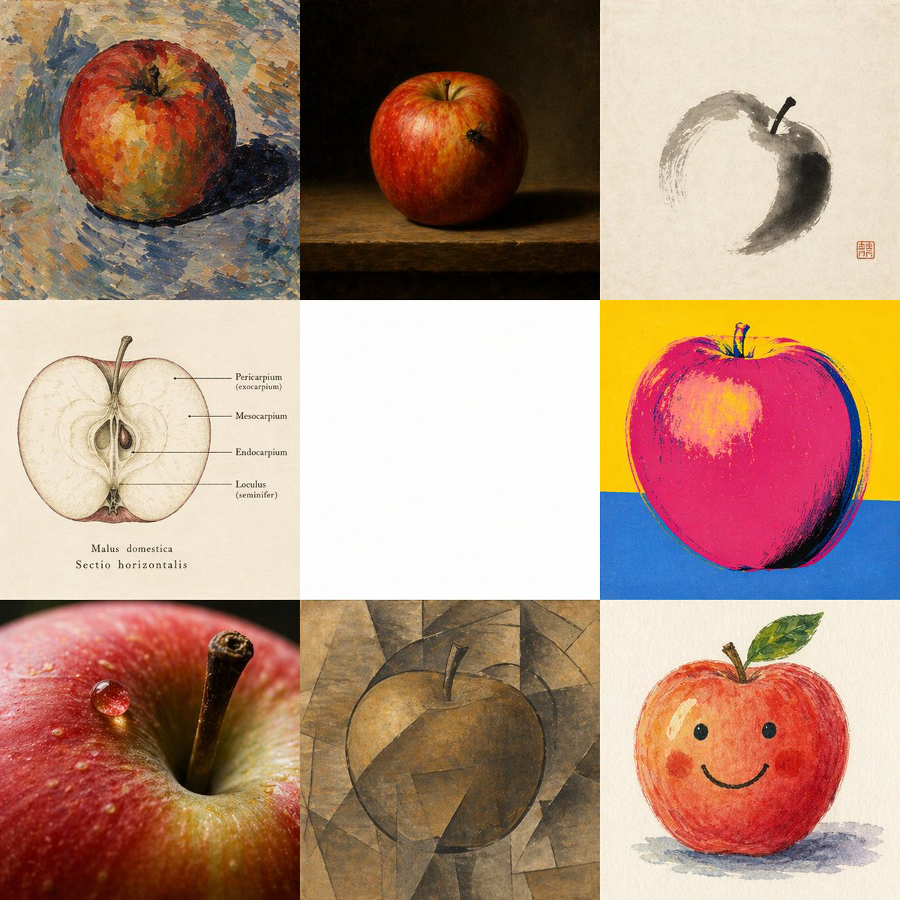</a>

```text
{"type":"multi-style comparative art grid","subject":"single apple interpreted through eight different visual systems in one image","composition":{"format":"square 3x3 grid","canvas":"large square canvas","background":"each cell uses its own appropriate background except the center cell, which is intentionally left blank","center_cell":{"position":"middle center","content":"empty white square negative space","purpose":"clear visual gap separating the surrounding interpretations"},"cells":[{"position":"top left","style":"Cézanne-inspired post-impressionist painting","subject":"whole apple","details":"a red-orange apple rendered with thick broken brushstrokes and palette-knife texture, mottled warm and cool color patches, blue-gray tabletop or ground, visible painterly shadow to the right, expressive impasto surface"},{"position":"top center","style":"Dutch still life oil painting","subject":"whole apple","details":"a realistic red apple on a wooden ledge against a deep dark brown-black background, dramatic chiaroscuro lighting, subtle highlight on the fruit, classical museum-style still life atmosphere"},{"position":"top right","style":"sumi-e ink painting","subject":"apple suggested with minimal brushwork","details":"off-white paper background, a few gestural gray-black ink strokes forming an incomplete circular apple silhouette, dark shaded crescent on one side, simple stem, red seal stamp in the lower right area of the cell, elegant East Asian calligraphic restraint"},{"position":"middle left","style":"medical botanical diagram","subject":"horizontal cross-section of an apple","details":"vintage scientific illustration on aged ivory paper, centered halved apple with seeds and internal structure visible, fine line labels pointing to parts, readable labels include \"Pericarpium (exocarpium)\", \"Mesocarpium\", \"Endocarpium\", and \"Loculus (seminifer)\", with the caption \"Malus domestica\" and \"Sectio horizontalis\" below"},{"position":"middle right","style":"Warhol-inspired pop art screen print","subject":"whole apple","details":"bold simplified apple in saturated hot pink and magenta with dark outline, bright yellow upper background and cobalt blue lower background, high contrast graphic treatment, silkscreen poster feel"},{"position":"bottom left","style":"hyperreal macro photography","subject":"extreme close-up apple detail","details":"a photographic macro view of the apple skin and stem cavity, crisp stem in focus, glossy water droplet on the red peel, shallow depth of field, luminous texture and realistic specular highlights"},{"position":"bottom center","style":"cubist painting","subject":"whole apple","details":"apple deconstructed into angular geometric planes in muted brown, ochre, and gray tones, faceted background and form merging together, subdued analytical cubism mood, stem visible at the top"},{"position":"bottom right","style":"children's illustration","subject":"cute smiling apple character","details":"friendly hand-painted watercolor or crayon-like apple with rosy cheeks, simple black dot eyes, curved smile, small stem and green leaf, soft shadow beneath, playful storybook look"}],"count":8},"lighting":"each style uses its own internally consistent lighting logic","color_strategy":"distinct palette per cell to emphasize different representational grammars","instructions":"Create a single unified image, not a collage assembled from separate files, showing {argument name=\"subject\" default=\"one apple\"} through exactly 8 visual grammars arranged around an empty center. Keep the middle cell blank white. Maintain a strict 3x3 grid with 8 occupied cells and 1 empty center cell. Make each occupied cell a convincing exemplar of its style while preserving the same core subject.","style_labels":["{argument name=\"style 1\" default=\"Cézanne\"}","{argument name=\"style 2\" default=\"Dutch still life\"}","{argument name=\"style 3\" default=\"Sumi-e\"}","{argument name=\"style 4\" default=\"Medical diagram\"}","{argument name=\"style 5\" default=\"Warhol\"}","{argument name=\"style 6\" default=\"Hyperreal macro\"}","{argument name=\"style 7\" default=\"Cubism\"}","{argument name=\"style 8\" default=\"Children’s illustration\"}"]}
```

## by [Larus Canus](<https://x.com/MrLarus>) on April 24, 2026 👉 [Try Now](https://indream.ai/generate?mode=IMAGE&modelKey=gpt-image-v2&modelPromptId=019e61c1-a5fd-7362-837f-96937303eb73)

<a href="./public/images/eaad5eb7-d54f-457c-9a78-f5f0574ed3fc.png" target="_blank" rel="noopener noreferrer">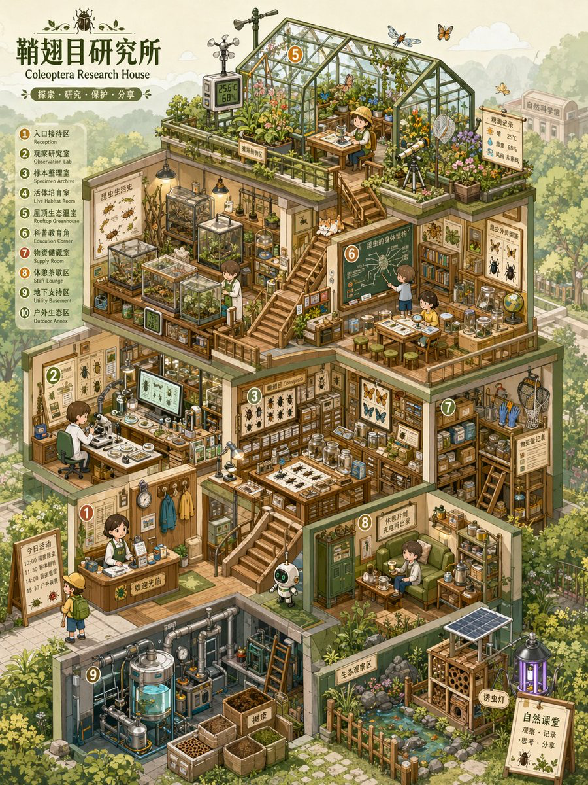</a>

```text
请根据【主题】创作一张高完成度、高信息密度、适合系列化发布的「微缩世界剖面馆 / Isometric Micro-World Archive」视觉图。

这不是普通房间插画，也不是单纯的建筑图，而是一张结合“等距轴测视角 + 建筑剖面结构 + 多层功能空间 + 高密度主题道具 + 微缩模型感 + 游戏场景设定集感”的主题空间总览图。画面需要像一个被剖开的微缩世界、经营模拟游戏场景、玩具屋模型或世界观设定图，让观者可以一眼看懂整体结构，又能反复观察其中的小细节。

【基础设定】
主题：【主题，例如昆虫研究所 / 未来生存基地 / 魔法药剂工坊 / AI自动化公司 / 植物工厂 / 儿童学习中心 / 太空补给站】
空间名称 / 品牌名：【品牌名或空间名称，可为空】
世界观方向：【现实 / 科幻 / 童话 / 魔法 / 末日 / 博物馆 / 实验室 / 经营模拟 / 校园 / 自然生态】
建筑类型：【小屋 / 基地 / 工厂 / 实验室 / 商店 / 博物馆 / 地下空间 / 飞船 / 多层工作室】
核心功能：【这个空间主要用来做什么，例如研究、生产、展示、生活、训练、交易、学习、维修、种植】
主色调：【主色调，例如浅蓝、薄荷绿、奶油黄、粉色、橙绿、紫蓝、白蓝科技色】
辅助色：【辅助色，可为空】
点缀色：【点缀色，可为空】
画幅比例：【1:1 / 3:4 / 4:5 / 9:16】
信息密度：【中高密度 / 高密度 / 超高密度】
整体气质：【治愈、可爱、精密、童趣、科普、未来感、复古、清爽、探索感】

如果某些字段没有填写，请根据【主题】自动合理推导，不要让画面留空。所有内容都要围绕主题统一生成，避免加入无关元素。

【画面结构】
采用清晰的等距轴测视角 / isometric view / axonometric view，主体是一个被剖开的多层主题建筑或功能基地。观者可以同时看到建筑的正面、侧面、顶面和内部空间。整体建筑位于画面中心，占据画面主要面积，背景环境适度淡化，用来衬托主体。

建筑内部需要分成多个功能区域，每个区域都要有明确用途，而不是随机堆放装饰。可以包含：
1. 主工作区 / 核心操作区
2. 展示区 / 收藏区 / 标本区
3. 研究区 / 实验区 / 控制区
4. 储藏区 / 货架区 / 物资区
5. 生活区 / 休息区 / 小型居住区
6. 能源区 / 机器区 / 管道区
7. 种植区 / 培养区 / 生态区
8. 入口区 / 运输区 / 维修区
9. 楼梯、平台、走廊、栏杆、梯子等空间连接结构

各个区域之间要通过楼梯、走廊、平台、管道、桥架或电缆形成清晰的空间关系，让画面像一个真实可以运转的小型系统。

【道具与细节】
根据【主题】生成大量相关道具，并让它们分布在不同功能区中。道具需要具体、可识别、有主题关联，不能只是泛泛的装饰。每个小物件都应像游戏资产一样清晰可读，具有可点击、可互动、可收集的感觉。

道具类型可以包括：
- 主题设备：机器、仪器、工具、控制台、容器、屏幕、工作台
- 生活物件：桌椅、书架、床铺、杯子、箱子、柜子、灯具
- 展示物件：标本、模型、海报、说明牌、玻璃柜、陈列架
- 连接结构：管道、电线、梯子、楼梯、输送带、滑轨、平台
- 生态元素：植物、水箱、培养箱、土壤、树枝、岩石、标本
- 角色元素：少量小人物、小动物、机器人或主题生物，用来提供尺度感和故事感

道具数量要丰富，但要保持秩序。所有道具都应服务于空间功能和主题世界观。

【风格要求】
整体风格为清晰、可爱、精密的手绘卡通等距插画。线条干净，边缘略圆润，色彩明亮柔和，整体具有轻松、治愈、探索感。画面应有经营模拟游戏、儿童科普绘本、微缩模型、设定集页面的感觉。

避免过度写实，避免强烈暗黑光影，避免厚重油画感，避免复杂噪点。重点是清楚、精致、有层次、可读性强。

【颜色与光影】
使用高明度、低到中等饱和度的柔和配色。主色调统一，辅助色用于区分不同空间，点缀色用于突出关键设备和小道具。线稿颜色不要使用死黑，可使用深灰、蓝灰、棕灰等柔和描边。

光影保持轻量，不需要强烈真实投影。通过色块、结构、线条和局部高亮来建立层次。背景使用浅色、低对比度处理，使主体建筑更加突出。

【构图与阅读路径】
画面主体居中或略微偏上，建筑呈多层剖面结构。视觉阅读路径应从整体建筑轮廓开始，再进入各楼层功能区，最后观察细节道具。可以通过楼梯、平台、走廊、管线、轨道等元素引导视线。

整体画面要饱满但不拥挤，丰富但不混乱。每个房间、平台和角落都应该有内容，但仍然保持清晰的空间边界。

【背景环境】
背景可以根据主题加入弱化的外部环境，例如森林、城市、街道、地下岩层、实验园区、海底、太空、校园、工厂外墙等。背景不要抢主体，建议使用淡色、低透明度、低对比度处理，形成“主体清晰、背景退后”的效果。

【最终效果】
最终画面应像一张完整的主题空间设定图，既有建筑剖面图的结构感，又有游戏场景资产图的细节感，还带有微缩玩具屋的可爱探索感。它应该适合用于系列化视觉创作、IP世界观展示、游戏场景设定、品牌空间概念图、科普内容封面或小红书/Pinterest风格视觉发布。

请确保画面：
1. 等距轴测视角明确
2. 建筑剖面结构清楚
3. 多层功能区完整
4. 道具丰富且主题统一
5. 色彩柔和明亮
6. 线稿清晰干净
7. 背景弱化、主体突出
8. 信息密度高但不混乱
9. 具有可探索、可运营、可反复观察的微缩世界感
```

## by [のうめん🏗️👺生成AIパスポート認定取れた](<https://x.com/nomen_machine>) on April 24, 2026 👉 [Try Now](https://indream.ai/generate?mode=IMAGE&modelKey=gpt-image-v2&modelPromptId=019e61c2-bf5f-75cc-963d-39f28778f955)

<a href="./public/images/d08d6d12-4127-4a84-a941-64899f137356.png" target="_blank" rel="noopener noreferrer">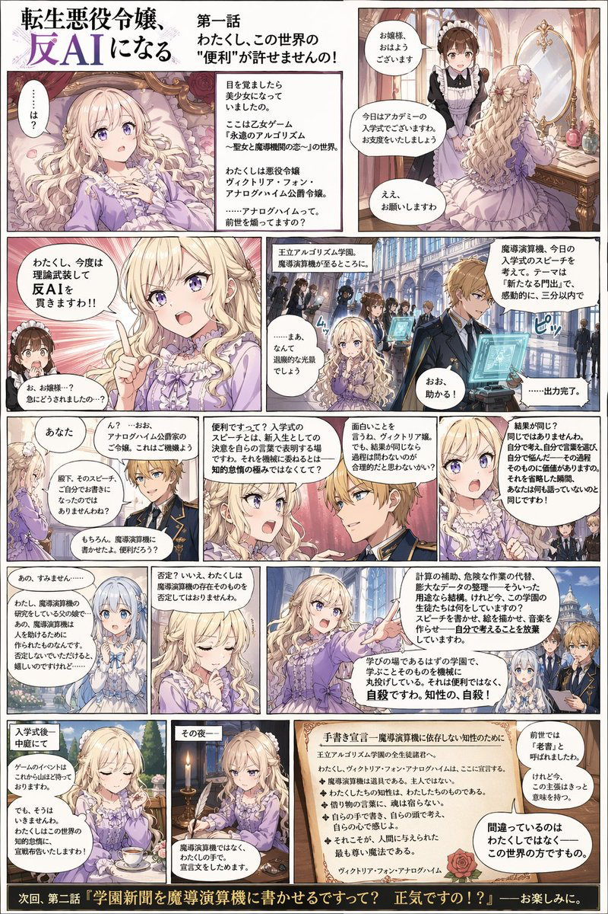</a>

```text
{"type":"single-page manga summary poster","format":"vertical Japanese comic page collage","genre":"fantasy academy villainess manga, anti-AI satire","style":"high-detail polished anime illustration, shoujo-inspired fantasy manga coloring, soft painterly lighting, ornate backgrounds, pastel lavender and cream palette, elegant line art, decorative panel borders, printed magazine page design","language":"Japanese","page":{"aspect_ratio":"tall portrait","border":"thin black outer border","panel_count":12,"reading_flow":"multi-panel manga layout summarizing episode 1 on one page","footer_banner":true},"headline":{"title_main":"転生悪役令嬢、{argument name=\"headline text\" default=\"反AI\"}になる","episode_label":"第一話","subtitle":"わたくし、この世界の\"便利\"が許せませんの！"},"main_character":{"role":"reincarnated villainess noble girl","name":"{argument name=\"character name\" default=\"ヴィクトリア・フォン・アナログハイム\"}","appearance":{"age":"teenage girl","hair":"very long wavy blonde hair with curls and ringlets","eyes":"blue","skin":"fair","build":"slender","expression_range":"confused, resolute, argumentative, contemplative, passionate"},"outfit":{"count":5,"pieces":["lavender frilled aristocratic dress","large ribbon at the chest","lace-trimmed sleeves and collar","hair ornament with flowers and ribbons","small jewelry accents"]}},"supporting_characters":{"count":4,"items":[{"role":"maid","appearance":"adult woman in classic black-and-white maid dress with apron and headpiece"},{"role":"blond academy prince-like male student","appearance":"handsome young man in dark navy uniform with gold trim"},{"role":"silver-haired timid female student","appearance":"pale blue and white outfit, anxious demeanor"},{"role":"multiple academy students","appearance":"mixed background crowd in uniforms inside academy hall"}]},"technology_design":{"theme":"fantasy magic computer analogue","count":3,"items":["glowing translucent cyan magical display panel held by students","discussion of 魔導演算機 as a magical computation device","academy setting where such devices are treated as useful modern tools"]},"layout":{"sections":[{"title":"opening title area and awakening scene","position":"top-left","count":2,"labels":["転生悪役令嬢、反AIになる","……は？"]},{"title":"maid briefing in bedroom","position":"top-right","count":2,"labels":["お嬢様、おはようございます","今日はアカデミーの入学式でございますわ。お支度をいたしましょう"]},{"title":"anti-AI declaration","position":"upper-left middle","count":1,"labels":["わたくし、今度は理論武装して反AIを貫きますわ!!"]},{"title":"academy arrival and magic device scene","position":"upper-right middle","count":4,"labels":["王立アナログハイム学院 魔導演算機が至るところに。","……まあ、なんて退廃的な光景でしょう","魔導演算機、今日の入学式のスピーチを考えて。テーマは新たなる門出で、感動的に、三分以内で","……出力完了。ピッ"]},{"title":"debate with blond male student","position":"center row","count":6,"labels":["あなた","ん？…おお、アナログハイム公爵家の令嬢、これはご機嫌よう","殿下、そのスピーチ、ご自分でお書きになったのではありませんわね？","もちろん。魔導演算機に書かせた。便利だろう。","便利ですって？ 入学式のスピーチとは、新入生としての決意を自らの言葉で表明する場ですわ。","面白いことを言うね。ヴィクトリア嬢でも、結果が同じなら過程は問わないのが合理的だと思わないかい？"]},{"title":"villainess rebuttal","position":"center-right small panel","count":1,"labels":["結果が同じ？ 同じではありませんわ。自分で考え、自分で悩んだ一での過程そのものに価値がありますの。それを省略した瞬間、あなたは何も語っていないのと同じですわ！"]},{"title":"timid girl consultation and reflection","position":"lower-middle left","count":3,"labels":["あの、すみません…わたし、魔導演算機の研究をしている女の娘で…","否定？ いいえ、わたくしは魔導演算機の存在そのものを否定してはおりませんわ。","学びの場であるはずの学園で、学ぶことそのものを機械に丸投げしている。それは便利ではなく、自殺ですわ。知性の、自殺！"]},{"title":"principles statement with pointing pose","position":"lower-middle right","count":1,"labels":["計算の補助、危険な作業の代替、膨大なデータの整理――そういった用途なら結構。けれど今、この学園の生徒たちは何をしていますの？ スピーチを書かせ、絵を描かせ、音楽を作らせ――自分で考えることを放棄していますわ。"]},{"title":"after entrance ceremony and nighttime vow","position":"bottom-left","count":2,"labels":["入学式後・中庭にて","その夜…"]},{"title":"manifesto parchment","position":"bottom-center right","count":1,"labels":["手書き宣言 — 魔導演算機に依存しない知性のために"]},{"title":"next episode banner","position":"bottom full-width","count":1,"labels":["次回、第二話『学園新聞を魔導演算機に書かせるですって？ 正気ですの！？』— お楽しみに。"]}],"centerpiece":"the blonde villainess in a lavender noble dress dominates multiple panels, arguing passionately against magical AI-like devices across an ornate academy setting"},"backgrounds":{"count":5,"items":["luxurious noble bedroom with canopy bed and carved furniture","vanity table with mirror and cosmetics","grand academy hall with tall windows and stone columns","garden courtyard with tea setting","candlelit desk at night with parchment and writing tools"]},"mood":"dramatic, comedic, polemical, theatrical, intellectually defiant","rendering_notes":"make it look like a complete manga episode compressed into a single richly illustrated page, with speech balloons, narration boxes, dense Japanese text, expressive faces, and clear panel separation; preserve the humorous contrast between aristocratic elegance and anti-AI rhetoric; include a few intentionally blurred faces in some panels to mimic anonymized or low-detail faces in the original composition"}
```

## by [李岳](<https://x.com/liyue_ai>) on April 24, 2026 👉 [Try Now](https://indream.ai/generate?mode=IMAGE&modelKey=gpt-image-v2&modelPromptId=019e61c3-48af-762c-90e5-331f8af64008)

<a href="./public/images/342bb25b-6528-42e1-b7e0-398f611dd6bf.png" target="_blank" rel="noopener noreferrer">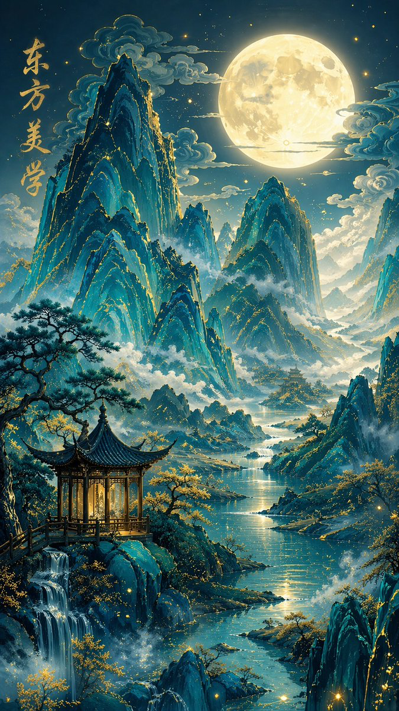</a>

```text
中国传统青绿山水风格，新中式幻想插画，{argument name="场景" default="月夜仙境"}，竖版构图；

层峦叠嶂的青蓝色山峰，山体呈现宝石般通透发光质感，蓝绿色渐变，山脉边缘带细腻鎏金描边与金色点缀，山间云雾缭绕；

远处一轮巨大的明亮满月高悬天空，月光洒落群山与河流；

前景有一座精致的中式古典亭阁，亭内暖光微亮，周围有苍劲松树、金色树木、溪流、瀑布、雾气、发光微粒，河道蜿蜒穿行于山谷之间；

画面左上角添加竖版的手写书法字：{argument name="书法内容" default="东方美学"}，文字大小和间距合适；

画面层次丰富，留白雅致，空灵静谧，梦幻唯美，工笔重彩，细节精致，光影柔和，电影级氛围，高级国风插画，超精细，8K，艺术感极强，诗意仙境，比例9:16
```

## by [Gadgetify](<https://x.com/Gdgtify>) on April 24, 2026 👉 [Try Now](https://indream.ai/generate?mode=IMAGE&modelKey=gpt-image-v2&modelPromptId=019e61c4-3917-766e-bb89-493b1d6ec25f)

<a href="./public/images/15a203c6-ffc8-41e8-90dc-0aea9fa027ce.png" target="_blank" rel="noopener noreferrer">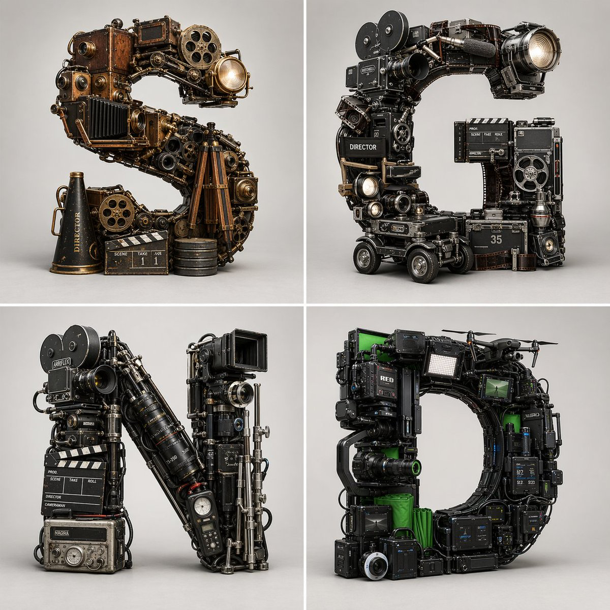</a>

```text
Create a clean 2x2 grid of four front-facing 3D typographic sculptures on a light gray seamless studio background, separated by thin white dividers. Each quadrant features a single giant letter built entirely from dense, realistic filmmaking equipment and on-set props from a different cinematic era, with the letterform chaotic but clearly legible. Use high-end Cinema 4D product-render aesthetics, ambient occlusion, realistic scale relationships, intricate kit-bashing, subtle wear, metallic reflections, and three-point studio lighting with a soft overhead source. Top-left: the letter S, representing early silent-era or proto-cinema filmmaking, constructed from antique brass-and-wood cameras, exposed gears, film reels, projector parts, bellows, tripod wood legs, and vintage optical housings; warm bronze and copper tones; include 3 extra props at the base: a black megaphone labeled "DIRECTOR", a clapboard, and a short stack of film canisters; one projector-like lens at the upper right glows brightly. Top-right: the letter C, representing classical Hollywood film production, built from black metal film cameras, studio lenses, magazines, matte boxes, dolly components, control boxes, and analog set hardware; mostly black, steel, and gunmetal with subtle brass accents; include 4 extra props integrated around the base and inner right side: a clapperboard, a boxy side module, a film magazine marked "35", and a small cylindrical canister; a large forward-facing lamp or lens glows at the upper right. Bottom-left: the letter N, representing modern analog or late-20th-century cinema, assembled from Arriflex-style cameras, long cine zoom lenses, support rigs, rails, cables, a slate, and a field recorder; predominantly matte black with silver hardware and a few red accent rings; include 3 clearly visible base elements: a clapperboard section, a labeled director strip, and a rectangular audio recorder/control unit at the bottom. Bottom-right: the letter D, representing digital and virtual production, built from RED-style digital cinema cameras, monitors, battery packs, wireless transmitters, drones, LED panels, green-screen fabric inserts, and modular rig components; black technical bodies with vivid green accents and screen graphics; include 4 notable integrated device types: drone arms/propellers at the top, a rectangular LED light panel, multiple monitors, and a large camera lens at the lower left. Keep all objects grounded and physically connected, no floating pieces, no flat typography, no handwriting, no paper look, no messy background. Ultra-detailed, sharp, 8k, polished graphic design asset for a poster or visual comparison of filmmaking eras.
```

## by [WTR](<https://x.com/wtry1102>) on April 24, 2026 👉 [Try Now](https://indream.ai/generate?mode=IMAGE&modelKey=gpt-image-v2&modelPromptId=019e61c4-bfe9-75f9-8ebd-0ca030e5878c)

<a href="./public/images/3f2f9b83-70c4-4096-8609-d7e4379ea24d.png" target="_blank" rel="noopener noreferrer">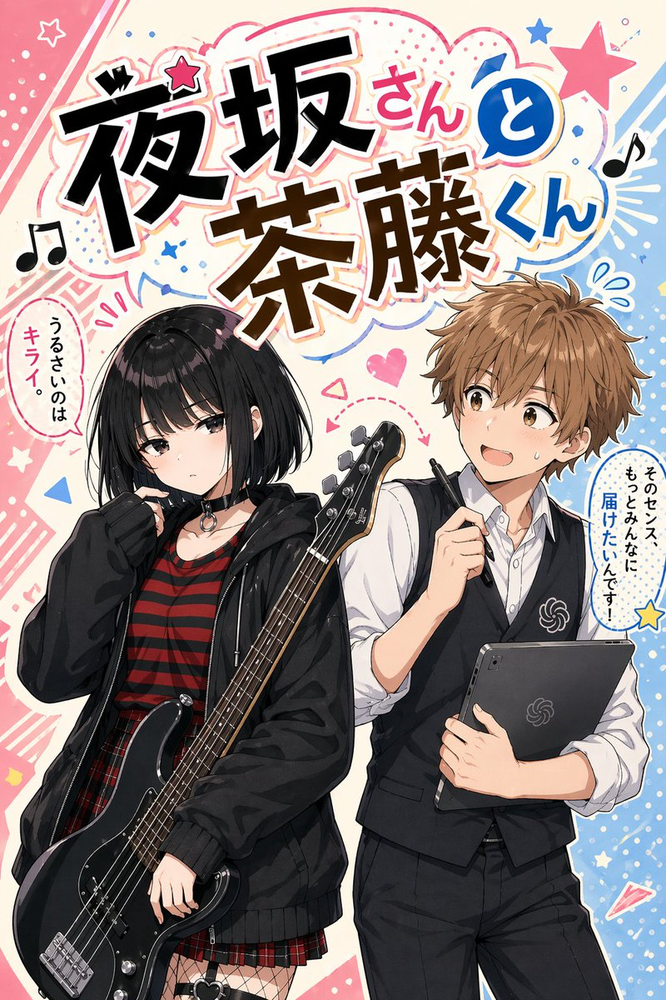</a>

```text
A vibrant Japanese comic-style cover illustration with two anime characters standing side by side against a split pink-and-blue pop graphic background filled with stars, dots, music notes, hearts, spark lines, and playful doodles. At the top, place a huge bold Japanese title in thick black and brown kanji with white outline and pink shadow reading 夜坂さんと茶藤くん, arranged in an energetic layered composition inside a fluffy cloud-like title shape. The left half of the background is pink and the right half is light blue, with a diagonal dividing rhythm and decorative manga-cover accents. Show exactly 2 characters from about mid-thigh up. On the left is a rebellious teenage girl with a straight black bob haircut and blunt bangs, pale skin, punk-rock fashion, and a slightly annoyed withdrawn pose with one hand near her mouth. She wears an oversized black zip hoodie over a red-and-black horizontal striped shirt, a red plaid pleated skirt, fishnet stockings, and a black heart-shaped choker. She holds a black electric bass guitar vertically across her body, with visible tuning pegs, strings, pickups, and chrome hardware. On the right is a cheerful teenage boy with messy light brown hair, fair skin, and a friendly expressive pose. He wears a white button-up shirt with sleeves rolled to the elbows, a fitted black vest with a small emblem on the chest, and black slacks. He holds a stylus pen near his face in one hand and a dark drawing tablet tucked in the other arm. Add exactly 2 vertical Japanese speech balloons: on the left, うるさいのはキライ。 in a pink outlined balloon; on the right, そのセンスもっとみんなに届けたいです… in a blue outlined balloon. Include small floating icons between and around them: exactly 2 black music notes, 2 pink hearts, 2 blue stars, and a few curved arrows and spark marks suggesting lively chemistry. The overall style is polished modern manga cover art, clean linework, glossy shading, expressive character design, bright pastel pop palette, high detail, commercial light novel or comic serialization cover aesthetic.
```

## by [田舎の呼吸@AI術士見習い🔰](<https://x.com/inaka_no_kokyu>) on April 24, 2026 👉 [Try Now](https://indream.ai/generate?mode=IMAGE&modelKey=gpt-image-v2&modelPromptId=019e61c6-1de4-73de-ae02-4a2bb04927a2)

<a href="./public/images/8f1c666a-83ed-43a3-b826-cca96ed7f82a.png" target="_blank" rel="noopener noreferrer">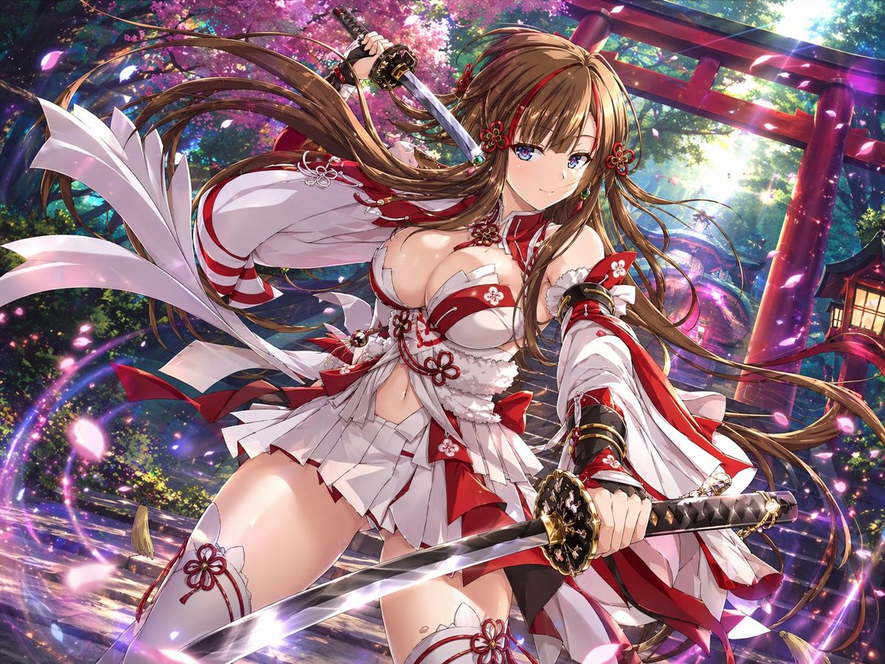</a>

```text
A highly detailed anime fantasy illustration of {argument name="character name" default="a shrine maiden swordswoman"} in a dynamic low-angle action pose at a Japanese shrine during spring. She is a beautiful young woman with {argument name="hair color" default="light brown"} very long flowing hair, blue eyes, a confident gentle smile, and ornate red floral hair ornaments. She holds 2 katana: one sword raised behind her head in her right hand and one sword extended forward toward the viewer in her left hand, with polished steel blades and elaborate black-and-gold hilts. Her outfit is a stylized, revealing red-and-white shrine maiden battle costume with 1 short pleated skirt, 1 cropped top with floral knot decorations, 2 oversized detached sleeves, 2 thigh-high stockings with red flower emblems, multiple red bows, white ribbons, and intricate ornamental trim. The scene is filled with motion: her hair and ribbons sweep dramatically through the air, cherry blossom petals fly around her, and glowing magical purple-pink light trails spiral around her body and swords. In the background, show 1 large red torii gate, 1 stone shrine path, dense green forest, blooming {argument name="tree type" default="cherry blossom"} trees, and 1 warm lantern on the right side. Use brilliant cinematic lighting with sunbeams filtering through the trees, sparkling particles, glossy highlights, saturated colors, depth, and a polished premium gacha-game key visual aesthetic. Emphasize energetic composition, fantasy atmosphere, sharp linework, ultra-detailed costume design, and a vivid heroic shrine guardian vibe.
```

## by [David Attias](<https://x.com/david_attiapps>) on April 24, 2026 👉 [Try Now](https://indream.ai/generate?mode=IMAGE&modelKey=gpt-image-v2&modelPromptId=019e61c9-9d9e-7781-b668-eefcbf1f9bed)

<a href="./public/images/ec90e855-93c5-4796-b2ef-f9d359284211.png" target="_blank" rel="noopener noreferrer">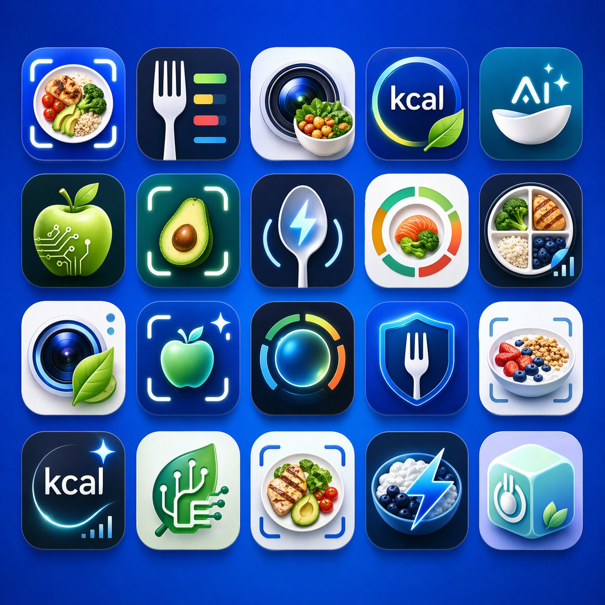</a>

```text
A clean presentation grid of 20 modern mobile app logo concepts for nutrition, calorie tracking, healthy eating, food recognition, and AI wellness tools, shown on a vivid electric-blue background with soft studio lighting and subtle shadows. Arrange the icons in 4 rows by 5 columns, evenly spaced, each as a glossy rounded-square app tile with premium iOS-style depth, smooth gradients, glassy highlights, and crisp 3D-rendered detail. The color palette should center on saturated blues, cyan, teal, white, lime green, and small accents of orange and yellow. Include exactly 20 distinct icon designs: 1) a meal bowl with avocado, grains, broccoli, and cherry tomatoes framed by a camera scan bracket, 2) a white fork beside four horizontal nutrition bars in green, yellow, red, and blue on a dark navy tile, 3) a camera lens with a small bowl of vegetables in front, 4) a circular blue badge with the text {argument name="headline text" default="kcal"} and a green leaf overlapping the lower edge, 5) a teal-blue icon with the text {argument name="brand text" default="Ai"} above a white bowl and two sparkles, 6) a glossy green apple with circuit traces and nodes suggesting food-tech AI, 7) a halved avocado centered inside a glowing scan frame, 8) a metallic spoon with a blue lightning bolt symbol and curved tracking lines, 9) a circular segmented nutrition meter in green, orange, and red around salmon and broccoli, 10) a divided plate containing grilled chicken, broccoli, rice, blueberries, and a small ascending analytics bar chart, 11) a camera lens on a white tile with a green leaf attached, 12) a glowing green apple inside a scan bracket with a sparkle, 13) a luminous circular activity ring in blue, green, yellow, and orange on a dark tile, 14) a blue shield with a white fork in the center, 15) a yogurt or oatmeal bowl topped with strawberries, blueberries, and granola inside a scan bracket, 16) a dark navy calorie icon with the text {argument name="calorie text" default="kcal"}, a curved glow, one sparkle, and a tiny bar chart, 17) a mint-green square with a white circuit-tree or branching chip motif, 18) a plated healthy meal with grilled chicken, avocado, tomatoes, and greens inside a scan bracket, 19) a dark bowl of blueberries and white yogurt or cream with a bright electric lightning bolt overlay, 20) a pastel aqua 3D cube icon featuring a fork-and-plate symbol on one face and a green leaf on another. Make the overall style highly polished, slightly futuristic, commercially viable for App Store branding, with consistent visual language across all 20 icons, no extra text beyond the visible short labels, and a premium AI-generated product-design aesthetic.
```

## by [monaka](<https://x.com/monaka_mama3>) on April 24, 2026 👉 [Try Now](https://indream.ai/generate?mode=IMAGE&modelKey=gpt-image-v2&modelPromptId=019e61ca-a3de-773e-860f-61f45d0d7201)

<a href="./public/images/87c3c81a-0ab7-4400-a127-622302ab7306.png" target="_blank" rel="noopener noreferrer">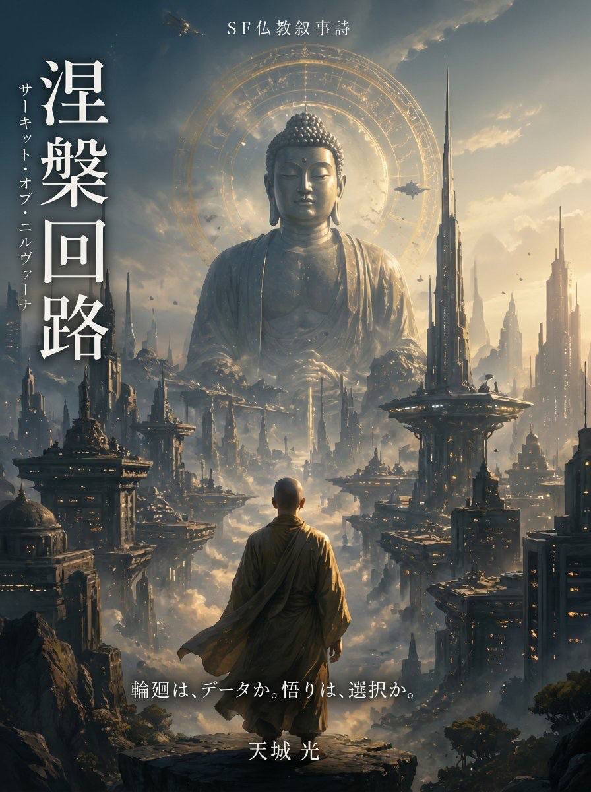</a>

```text
{argument name="ジャンル" default="SF小説"}の表紙。{argument name="モチーフ" default="仏教モチーフ"}
```

## by [Studio jirojohn Collection](<https://x.com/JiroJohn558192>) on April 24, 2026 👉 [Try Now](https://indream.ai/generate?mode=IMAGE&modelKey=gpt-image-v2&modelPromptId=019e61cd-790b-70df-9b33-2b8274f4a266)

<a href="./public/images/5c633dd8-2a54-472a-91f7-e111c798754b.png" target="_blank" rel="noopener noreferrer">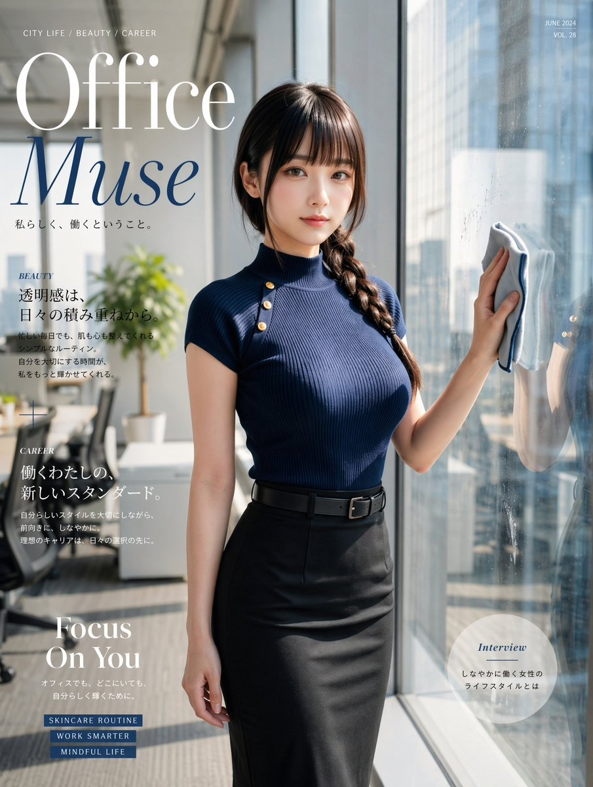</a>

```text
A polished high-fashion magazine cover portrait of a beautiful young office woman standing beside a floor-to-ceiling window in a bright modern corporate office, photographed in a refined editorial style. She faces slightly toward the camera with a calm, elegant, confident expression, her face intentionally obscured by a soft rectangular blur. She has long dark brown hair styled in a thick side braid draped over one shoulder. She wears a fitted ribbed mock-neck knit top in {argument name="top color" default="deep navy blue"} with short sleeves and three gold shoulder buttons on the left side, tucked into a high-waisted black pencil skirt with a slim black belt. Her right hand is raised, holding a folded light-colored cleaning cloth against the glass, suggesting a symbolic lifestyle-fashion scene rather than literal cleaning; her left arm rests naturally by her side. Warm daylight streams in from the window, creating soft highlights on her clothing and skin, subtle reflections on the glass, and a luminous cityscape of tall office buildings outside. The interior background is softly blurred, showing a minimalist office with 1 potted plant, 1 desk, and 1 office chair. Compose the image vertically like a premium magazine cover, full body cropped around mid-calf, with the model centered slightly right to leave room for typography on the left. Add elegant editorial cover text in a Japanese fashion-magazine style: a very large serif masthead reading {argument name="main title" default="Office Muse"} across the upper left, with "Office" in white and "Muse" in deep blue; small uppercase text at the top left reading "CITY LIFE / BEAUTY / CAREER"; small issue text at the top right reading "JUNE 2024" and "VOL. 28". Include 5 additional text blocks: 1 Japanese subtitle under the main title, 1 left-column beauty section with the heading "BEAUTY" and Japanese body text, 1 left-column career section with the heading "CAREER" and Japanese body text, 1 large lower-left headline reading "Focus On You" with a short Japanese subline, and 1 lower-right circular callout with the heading "Interview" and Japanese text inside a translucent pale circle. Add 3 small blue rectangular tags near the lower left reading {argument name="tag line 1" default="SKINCARE ROUTINE"}, {argument name="tag line 2" default="WORK SMARTER"}, and {argument name="tag line 3" default="MINDFUL LIFE"}. Overall mood: sophisticated, feminine, aspirational, urban, graceful, professional, luxurious, clean natural light, realistic digital photography with subtle fashion-retouching, premium Japanese magazine cover design.
```

## by [Chu Judy](<https://x.com/Redit007>) on April 24, 2026 👉 [Try Now](https://indream.ai/generate?mode=IMAGE&modelKey=gpt-image-v2&modelPromptId=019e61d3-855b-77d9-bff4-e4517b495b6b)

<a href="./public/images/6881ed7d-5de4-4fd0-8b59-69ef431f4490.png" target="_blank" rel="noopener noreferrer">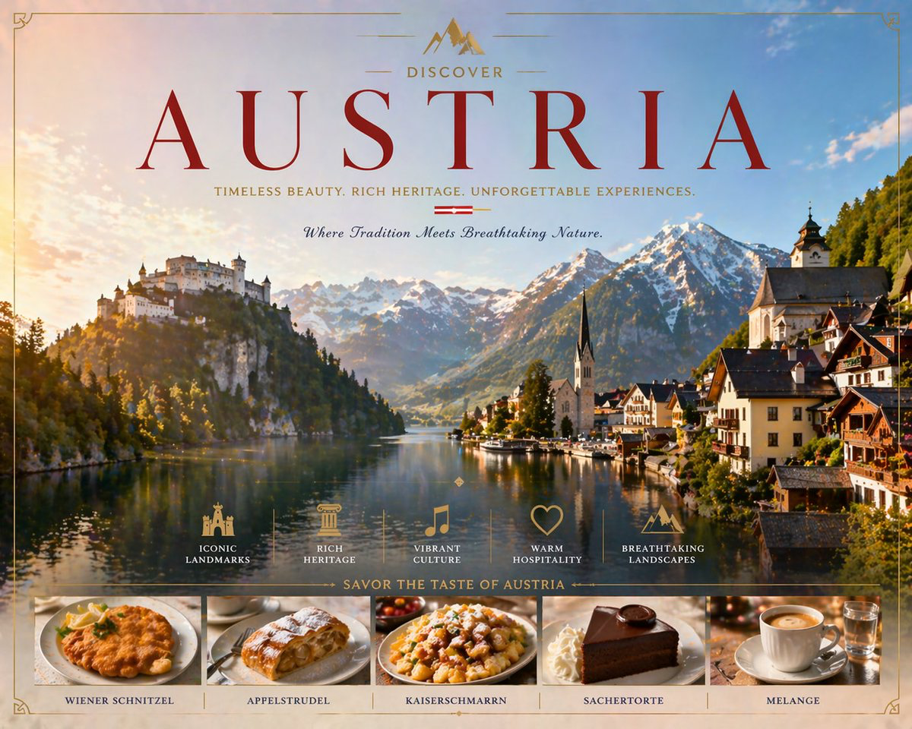</a>

```text
A luxurious vintage-style travel poster for {argument name="country name" default="Austria"}, designed like a premium tourism advertisement. Use an elegant, symmetrical poster layout with thin gold decorative border lines and small ornamental corner details. At the top center, place a minimalist gold mountain emblem above the word “DISCOVER”, then a very large refined serif title reading {argument name="headline text" default="AUSTRIA"} in deep burgundy red. Beneath it, add a small uppercase tagline in gold: “TIMELESS BEAUTY. RICH HERITAGE. UNFORGETTABLE EXPERIENCES.” and below that an italic script line: “Where Tradition Meets Breathtaking Nature.” Place a small horizontal Austrian flag motif between the lines. The main image should be a breathtaking composite alpine lake scene at golden hour: on the left, a dramatic hilltop fortress resembling Salzburg Castle perched on a rocky cliff above the water; in the center distance, a calm reflective lake leading into a valley of towering snow-capped Alps; on the right, a picturesque Austrian lakeside village resembling Hallstatt with steep-roofed houses, a tall church spire, a hillside church, and clustered wooden buildings descending to the water. Warm sunlight from the left, crisp blue sky, glowing highlights on the mountains, rich reflections in the lake, romantic cinematic atmosphere, ultra-detailed, majestic and inviting. Along the lower middle, show exactly 5 gold icon-and-label tourism highlights spaced evenly: 1 castle icon with “ICONIC LANDMARKS”, 1 classical column icon with “RICH HERITAGE”, 1 music note icon with “VIBRANT CULTURE”, 1 heart icon with “WARM HOSPITALITY”, and 1 mountain icon with “BREATHTAKING LANDSCAPES”. At the bottom, create a horizontal food strip with exactly 5 framed culinary photos separated by thin dividers under the centered heading “SAVOR THE TASTE OF AUSTRIA”. The 5 dishes are: Wiener Schnitzel, Appelstrudel, Kaiserschmarrn, Sachertorte, and Melange. Each food image should be realistic, warmly lit, plated attractively, and labeled in uppercase serif text beneath the image. Overall style: high-end European travel campaign poster, polished editorial design, romantic nostalgia, refined typography, harmonious gold and burgundy accents, photorealistic scenery blended with luxury brochure aesthetics.
```

## by [Chu Judy](<https://x.com/Redit007>) on April 24, 2026 👉 [Try Now](https://indream.ai/generate?mode=IMAGE&modelKey=gpt-image-v2&modelPromptId=019e61d3-748b-73a0-91e0-04f5e3eee90d)

<a href="./public/images/abab6971-bae9-4677-8cb3-93b5f509882c.png" target="_blank" rel="noopener noreferrer">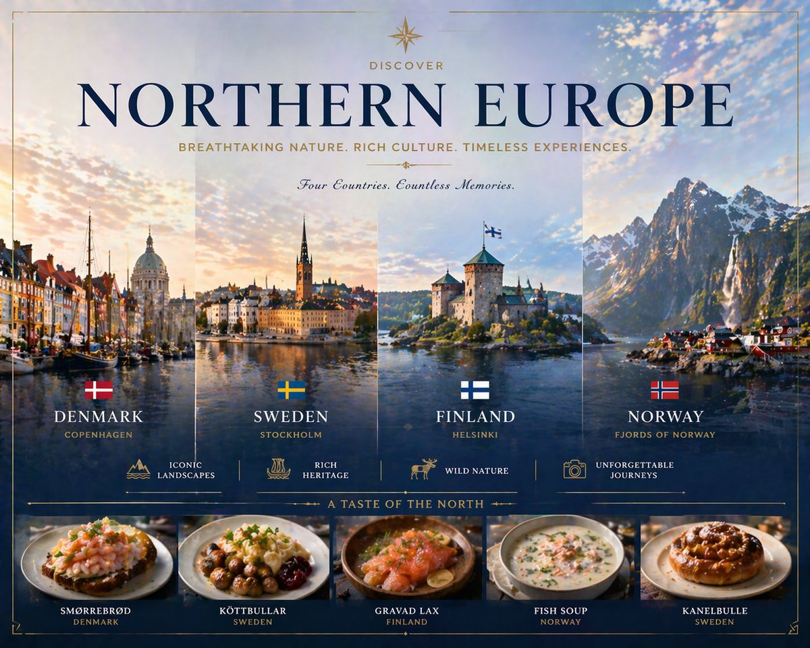</a>

```text
Create an elegant luxury travel poster for {argument name="region name" default="NORTHERN EUROPE"}, designed like a premium tourism campaign brochure cover. Use a wide symmetrical layout with a thin gold decorative border and refined editorial typography. At the top center, place a small compass-star icon above the word DISCOVER, then a very large serif headline reading {argument name="headline text" default="NORTHERN EUROPE"} in deep navy blue. Below it, add a gold uppercase tagline: {argument name="tagline" default="BREATHTAKING NATURE. RICH CULTURE. TIMELESS EXPERIENCES."} and beneath that a smaller elegant italic line: {argument name="subheading" default="Four Countries. Countless Memories."}. The main image area is divided into 4 equal vertical scenic panels showing iconic destinations at golden hour with soft glowing skies and cinematic realism. Panel 1: Denmark, Copenhagen, a colorful harbor waterfront with historic buildings, boats, calm reflective water, and a domed landmark in the background; include a small Danish flag above the labels DENMARK and COPENHAGEN. Panel 2: Sweden, Stockholm, a waterfront old-town skyline with church spires and warm sunset light reflected in the water; include a small Swedish flag above the labels SWEDEN and STOCKHOLM. Panel 3: Finland, Helsinki, a small stone castle-like island fortress in blue water under a bright sky; include a small Finnish flag above the labels FINLAND and HELSINKI. Panel 4: Norway, dramatic fjords with steep jagged mountains, a waterfall, and a tiny red-roof coastal village at the water’s edge; include a small Norwegian flag above the labels NORWAY and FJORDS OF NORWAY. Beneath the 4 country panels, add a row of 4 gold line icons with captions, evenly spaced: mountain icon with ICONIC LANDSCAPES, Viking ship icon with RICH HERITAGE, moose icon with WILD NATURE, camera icon with UNFORGETTABLE JOURNEYS. Near the bottom center, place a gold divider and the title A TASTE OF THE NORTH. Under it, show exactly 5 food thumbnail panels in a horizontal strip, each on a plate or bowl with warm appetizing lighting and dark blue framing: 1) Smørrebrød — Denmark, open-faced sandwich topped with shrimp; 2) Köttbullar — Sweden, Swedish meatballs with cream sauce and lingonberries; 3) Gravad lax — Finland, sliced cured salmon in a bowl; 4) Fish soup — Norway, creamy fish soup with herbs and seafood; 5) Kanelbulle — Sweden, a glossy cinnamon bun on a plate. Use a polished high-end travel-ad aesthetic, photorealistic scenery, soft sunset color grading, navy and gold graphic design, balanced composition, crisp text placement, and a nostalgic upscale European tourism mood.
```

## by [SORANE / AI音楽](<https://x.com/sorane_aimusic>) on April 24, 2026 👉 [Try Now](https://indream.ai/generate?mode=IMAGE&modelKey=gpt-image-v2&modelPromptId=019e61d5-1abe-7364-9217-0d97b557ece3)

<a href="./public/images/d62fe095-7d68-49f3-b601-4eda6e060b9a.png" target="_blank" rel="noopener noreferrer">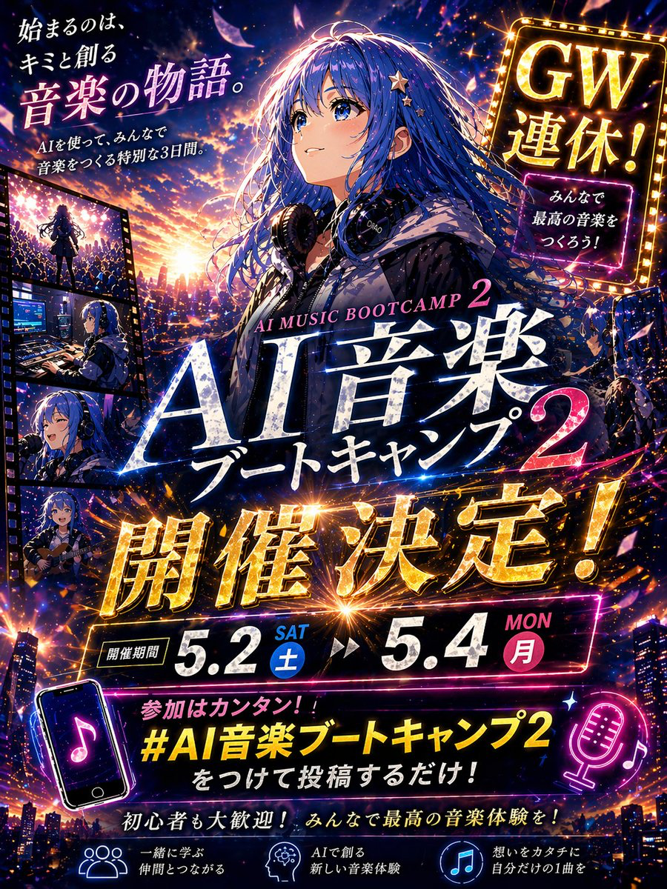</a>

```text
Create a dramatic Japanese anime-style promotional thumbnail poster for an event, vertical 4:5 composition, ultra-detailed, cinematic, neon-lit, high contrast, designed like a social media announcement image. The main subject is a beautiful anime girl centered slightly right, shown from the waist up, with long flowing {argument name="hair color" default="deep blue"} hair blowing in the wind, decorated with small star hairpins, wearing a dark hoodie and large studio headphones around her neck, against a glowing sunset-to-night city skyline filled with sparkling lights, music-energy particles, lens flares, and flying glowing petals. Her face area is obscured by a soft rectangular blur block. Use a vivid palette of electric blue, violet, magenta, gold, and sunset orange. Fill the design with layered Japanese typography that is crisp, readable, and integrated into the art like a polished event advertisement. Include exactly 8 major text groups: top left copy reading 「始まるのは、キミと創る 音楽の物語。」 with a smaller subcopy beneath reading 「AIを使って、みんなで音楽をつくる特別な3日間。」; top right a glowing marquee sign reading 「GW連休!」 and a smaller neon box below reading 「みんなで最高の音楽をつくろう!」; center main title with small English text 「AI MUSIC BOOTCAMP 2」 above huge Japanese title text 「AI音楽 ブートキャンプ 2」; a gigantic gold metallic announcement across the middle reading 「開催決定!」; a date bar reading 「開催期間」 followed by 「5.2 SAT 土」 and 「5.4 MON 月」; a hashtag callout near the bottom reading 「参加はカンタン!! #AI音楽ブートキャンプ2 をつけて投稿するだけ!」; a lower encouragement line reading 「初心者も大歓迎! みんなで最高の音楽体験を!」; and 3 bottom feature captions with icons reading 「一緒に学ぶ 仲間とつながる」, 「AIで創る 新しい音楽体験」, and 「想いをカタチに 自分だけの1曲を」. On the left edge, add a vertical filmstrip with exactly 4 inset panels showing the same girl in music-related scenes: 1) performing on a stage before a crowd, 2) working at a music production desk with screens and equipment, 3) singing into a microphone, 4) playing an acoustic guitar. Add exactly 2 neon music-themed icon illustrations in the lower area: a tilted smartphone with a music note on the lower left and a glowing microphone with musical notes on the lower right. Make the text effects glossy, luminous, and embossed with gold and white highlights, with energetic streaks and spark explosions around the headline. The overall feeling should be inspiring, celebratory, futuristic, and emotionally uplifting, like a high-impact Japanese Golden Week music bootcamp ad for {argument name="event name" default="AI音楽ブートキャンプ 2"}.
```

## by [なかあき【AIでソロプレナー実験中 】](<https://x.com/nakaaki04>) on April 24, 2026 👉 [Try Now](https://indream.ai/generate?mode=IMAGE&modelKey=gpt-image-v2&modelPromptId=019e61d5-97e4-70ea-ba60-7f6a48b53989)

<a href="./public/images/25512a87-74f2-403b-90d2-b651480ba70f.png" target="_blank" rel="noopener noreferrer">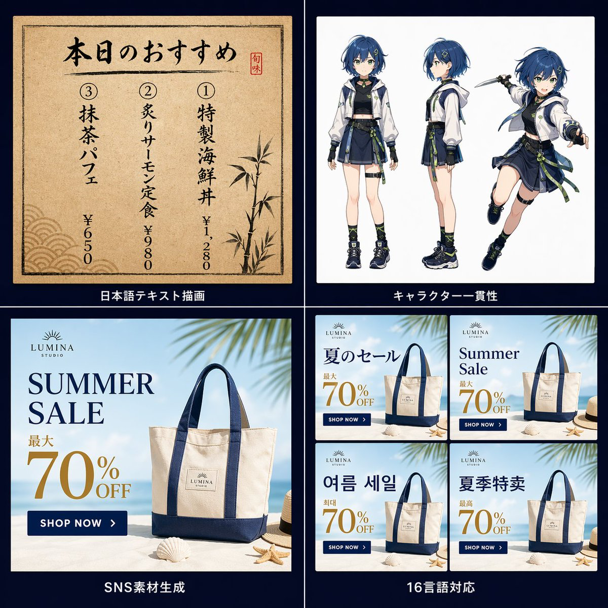</a>

```text
{"type":"AI capability comparison poster collage","style":"clean promotional infographic, premium tech marketing visual, dark navy background with thin white panel dividers, square 2x2 grid layout","theme":"showcase advanced image generation capabilities for text rendering, character consistency, social media creative generation, and multilingual support","layout":{"grid":{"rows":2,"columns":2,"count":4},"sections":[{"position":"top-left","title":"日本語テキスト描画","count":1,"panel":{"type":"Japanese menu poster mockup","background":"aged beige paper with subtle grain texture and dark border frame","decorations":{"count":3,"items":["vertical red seal stamp on the upper right","bamboo illustration on the lower right","traditional wave pattern on the lower left"]},"text":{"headline":"本日のおすすめ","columns":{"count":3,"items":[{"rank":"①","name":"特製海鮮丼","price":"¥1,280"},{"rank":"②","name":"炙りサーモン定食","price":"¥980"},{"rank":"③","name":"抹茶パフェ","price":"¥650"}]}}}},{"position":"top-right","title":"キャラクター一貫性","count":3,"panel":{"type":"anime character turnaround and action sheet","background":"plain white studio backdrop","subject":{"gender_presentation":"young female anime character","face":"softly blurred face with no detailed features","hair":{"color":"{argument name=\"hair color\" default=\"deep blue\"}","style":"short layered bob with side-swept bangs and small tied section at the back"},"outfit":{"count":8,"items":["white oversized cropped jacket with dark trim","black high-neck crop top","navy pleated mini skirt","utility belt with straps and small pouches","green ribbon and cord accents hanging from the waist","black fingerless gloves","dark crew socks with patterned bands","chunky navy sneakers"]}},"poses":{"count":3,"items":["front full-body standing pose","side profile standing pose","dynamic action pose holding a short blade"]}}},{"position":"bottom-left","title":"SNS素材生成","count":1,"panel":{"type":"summer sale social media banner","branding":"{argument name=\"brand name\" default=\"LUMINA STUDIO\"}","scene":"bright beach product ad with pale blue sky gradient, soft palm leaf shadows from above, sand foreground, seashells and straw hat as props","product":{"count":1,"item":"canvas tote bag with navy handles and navy bottom panel, centered label patch with brand mark"},"text":{"headline":"SUMMER SALE","discount":"最大 70% OFF","button":"SHOP NOW"}}},{"position":"bottom-right","title":"16言語対応","count":4,"panel":{"type":"four multilingual ad variants in a 2x2 mini-grid","variants":{"count":4,"items":[{"language":"Japanese","headline":"夏のセール","discount":"最大 70% OFF","button":"SHOP NOW"},{"language":"English","headline":"Summer Sale","discount":"70% OFF","button":"SHOP NOW"},{"language":"Korean","headline":"여름 세일","discount":"최대 70% OFF","button":"SHOP NOW"},{"language":"Chinese","headline":"夏季特卖","discount":"最高 70% OFF","button":"SHOP NOW"}]},"shared_design":"same tote bag beach ad layout repeated consistently across all four language versions"}}]},"composition":"all four white or beige content panels evenly spaced on a dark navy square canvas, each section title centered below its panel in white Japanese text","quality":"sharp typography, polished ad design, highly legible multilingual text, consistent branding, modern commercial presentation"}
```

## by [欠満恋空](<https://x.com/ktmnk_ikuu>) on April 24, 2026 👉 [Try Now](https://indream.ai/generate?mode=IMAGE&modelKey=gpt-image-v2&modelPromptId=019e61d7-5374-7489-97b5-4699acc14600)

<a href="./public/images/9fa8c0ac-1490-4ea4-a094-c42a7d92c793.png" target="_blank" rel="noopener noreferrer">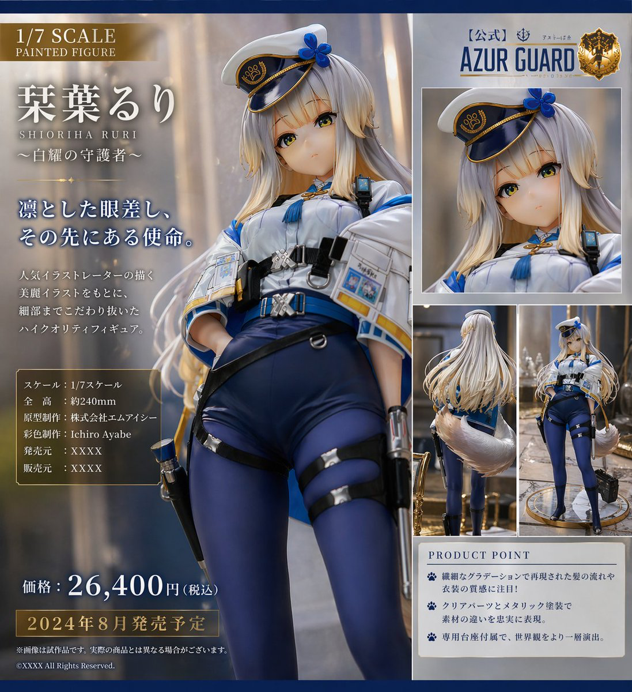</a>

```text
{"type":"anime figure promotional poster","subject":{"franchise":"AZUR GUARD","character":{"name":"{argument name=\"character name\" default=\"葉葉るり\"}","romanization":"SHIORIHA RURI","theme subtitle":"〜白耀の守護者〜","design":"stylized anime woman rendered as a premium 1/7 scale painted figure","appearance":{"hair color":"{argument name=\"hair color\" default=\"silver blonde\"}","hair style":"very long layered hair with soft waves and side-swept bangs","hat":"white naval beret-style cap with navy visor, gold trim, anchor-like insignia, and a vivid blue flower ornament","face":"partially obscured by a rectangular mosaic blur centered over the face","outfit pieces":["white short capelet-style top with blue trim and gold details","navy high-waisted glossy shorts or bodysuit bottom","semi-sheer deep blue tights","black thigh straps on both legs","blue waist belt with silver metallic X-shaped buckle","utility holster at the hip","black gloves","small shoulder-mounted device on the right shoulder","decorative sleeve patches/cards on both sleeves"],"extra features":["large fluffy fox-like tail in pale cream","slim curvy build","confident upright pose"]}},"layout":{"aspect ratio":"portrait poster","background":"luxury indoor setting with warm blurred pillars and reflective surfaces","sections":[{"title":"1/7 SCALE PAINTED FIGURE","position":"top left","count":1,"labels":["1/7 SCALE PAINTED FIGURE"]},{"title":"character title block","position":"upper left","count":4,"labels":["葉葉るり","SHIORIHA RURI","〜白耀の守護者〜","凛とした眼差し、その先にある使命。"]},{"title":"description text","position":"left middle","count":1,"labels":["人気イラストレーターの描く美麗イラストをもとに、細部までこだわり抜いたハイクオリティフィギュア。"]},{"title":"specification box","position":"lower left-middle","count":5,"labels":["スケール：1/7スケール","全高：約240mm","原型制作：株式会社エムアイシー","彩色制作：Ichiro Ayabe","発売元：XXXX / 販売元：XXXX"]},{"title":"price and release","position":"bottom left","count":2,"labels":["価格：{argument name=\"price\" default=\"26,400円\"} (税込)","{argument name=\"release date\" default=\"2024年8月発売予定\"}"]},{"title":"brand block","position":"top right","count":2,"labels":["【公式】AZUR GUARD","gold emblem badge"]},{"title":"right image column","position":"right side","count":3,"labels":["close-up bust portrait","rear full-body view","front full-body view on circular display base"]},{"title":"PRODUCT POINT","position":"bottom right","count":3,"labels":["繊細なグラデーションで再現された髪の流れや衣装の質感に注目！","クリアパーツとメタリック塗装で素材の違いを忠実に表現。","専用台座付属で、世界観をより一層演出。"]}],"centerpiece":"dominant low-angle full-body product photo of the figure, cropped from hat to thighs, emphasizing the glossy navy tights, sculpted outfit details, and premium collectible finish"},"style":{"overall look":"high-end Japanese hobby figure advertisement","rendering":"photorealistic product photography of a painted PVC scale figure","lighting":"soft studio lighting with warm highlights and subtle reflections","color palette":"navy blue, white, gold, silver, and cream","graphic design":"clean premium magazine-style layout with white borders, serif Japanese headline typography, and a dark blue outer frame"}}
```

## by [欠満恋空](<https://x.com/ktmnk_ikuu>) on April 24, 2026 👉 [Try Now](https://indream.ai/generate?mode=IMAGE&modelKey=gpt-image-v2&modelPromptId=019e61d7-4109-76de-b520-0bbc1b8d54f0)

<a href="./public/images/7f23618b-7d68-4872-8546-fcafe6150d8c.png" target="_blank" rel="noopener noreferrer">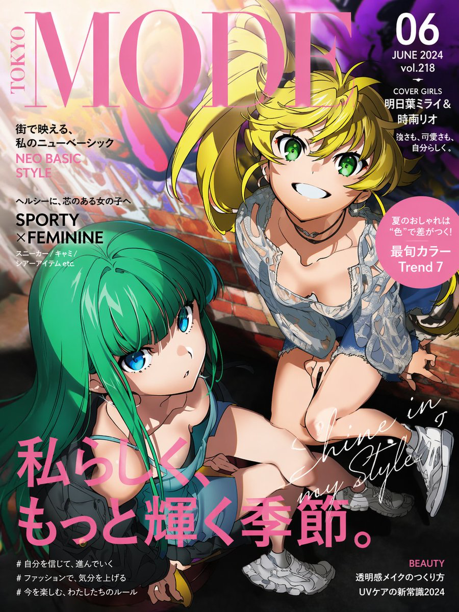</a>

```text
A stylized Japanese fashion magazine cover titled MODE TOKYO, designed like a glossy contemporary women's style publication. The composition is a high-angle, dynamic street-fashion anime illustration of 2 girls looking up toward the viewer from beside a brick wall with colorful graffiti and dramatic sunlight. The girl on the right has {argument name="hair color" default="golden blonde"} hair in a lively messy ponytail with loose bangs, bright green eyes, a wide cheerful grin, and a sporty-feminine outfit: a light blue lace-trim camisole or slip-style top, short bottoms, chunky white sneakers, and a black choker. She is posed energetically, leaning forward with one knee bent, giving a confident summer-fashion editorial feel. The girl on the left has long vivid teal-green hair with straight heavy bangs, large blue eyes, and a calm, cool expression. She wears a casual layered street outfit in dark tones with a sleeveless top and sits lower in the frame, angled toward the right girl while gazing upward. Use bold cel-shaded anime rendering with crisp linework, glossy highlights in the hair and eyes, soft skin shading, and a polished commercial illustration finish. The background should combine sunlit urban texture, blurred mural colors in pink, purple, orange, and black, and deep shadows to create contrast. The overall palette mixes hot pink typography, summer sunlight, teal, blonde, and saturated street-art hues. Include dense magazine-cover typography in a premium editorial layout: a giant pink serif masthead reading {argument name="magazine title" default="MODE"} across the top with TOKYO vertically on the left; on the upper right a dark circular or rounded block containing {argument name="issue number" default="06"}, JUNE 2024, vol.218, and cover lines in Japanese; on the left side several smaller Japanese and English fashion blurbs including NEO BASIC STYLE and SPORTY × FEMININE; a pink circular badge on the right with Japanese text and Trend 7; a large hot-pink Japanese headline across the lower left and center reading 私らしく、もっと輝く季節。; elegant white handwritten script diagonally across the lower right reading Shine in my Style; small footer cover lines and hashtags in Japanese; and a small BEAUTY label at bottom right. Make it look exactly like a real high-end Japanese fashion magazine cover, vertical format, full bleed, vibrant, youthful, feminine, sporty, and trendy.
```

## by [りり| Lilium](<https://x.com/Lilium907stella>) on April 23, 2026 👉 [Try Now](https://indream.ai/generate?mode=IMAGE&modelKey=gpt-image-v2&modelPromptId=019e61d8-c114-779c-9848-6eb5e766f0c6)

<a href="./public/images/114d3bd3-ba91-438c-8168-a3a86d851340.png" target="_blank" rel="noopener noreferrer">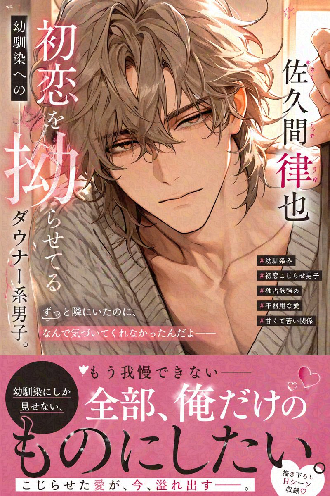</a>

```text
2:3でTLコミックの表紙を帯付きで作って。彼の名前は{argument name="名前" default="〇〇"}。キャッチコピー、特徴は表紙部分。キラーフレーズ({argument name="キラーフレーズ" default="決まってたらココに書く。なくてもOK"})は帯に。彼は「{argument name="性格や特徴" default="(画像の性格や特徴を簡潔に)"}」です。
```

## by [日本鴨同盟🦆エンパズ](<https://x.com/nihonkamo>) on April 23, 2026 👉 [Try Now](https://indream.ai/generate?mode=IMAGE&modelKey=gpt-image-v2&modelPromptId=019e6200-5827-7588-85a5-44218fe21509)

<a href="./public/images/f61f5db3-2dee-4ffa-a030-4af78550d754.png" target="_blank" rel="noopener noreferrer">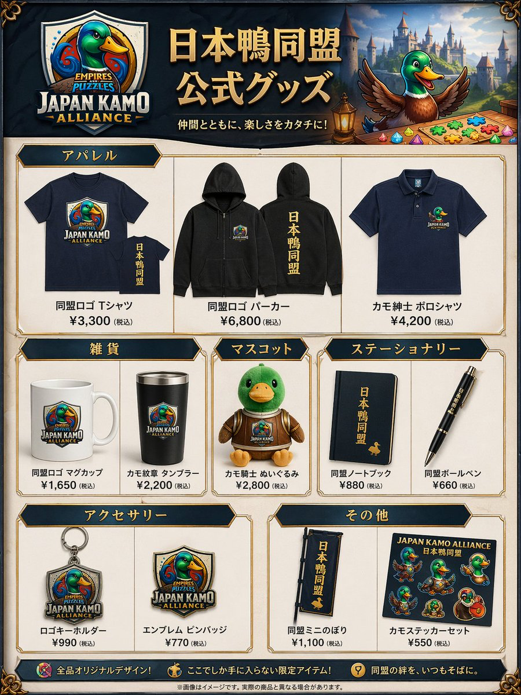</a>

```text
{"type":"fantasy merchandise catalog poster","theme":"official goods announcement for a duck-themed gaming alliance","style":"polished promotional product sheet, fantasy game aesthetic, Japanese retail flyer, parchment-and-gold UI framing, detailed commercial mockup, clean studio product renders embedded in a decorative poster","brand":{"name":"{argument name=\"organization name\" default=\"日本鴨同盟\"}","headline":"{argument name=\"headline text\" default=\"日本鴨同盟 公式グッズ\"}","tagline":"仲間とともに、楽しさをカタチに！","logo":"a heraldic shield crest featuring a bright green duck head with orange beak, blue and red ornamental background, small EMPIRES & PUZZLES text, and large JAPAN KAMO ALLIANCE lettering"},"canvas":{"orientation":"portrait","background":"aged cream catalog paper framed by ornate dark navy and gold fantasy border with decorative corner filigree"},"header":{"count":4,"elements":["top-left alliance crest logo","large gold Japanese title centered across the top","small white Japanese tagline under the title","top-right cartoon duck mascot with spread wings standing beside colorful puzzle gems, with a fantasy castle skyline in the distance and a glowing lantern in front"]},"layout":{"sections":[{"title":"アパレル","position":"upper half","count":3,"items":[{"label":"同盟ロゴ Tシャツ","price":"¥3,300 (税込)","description":"navy short-sleeve T-shirt shown front and side/back, large crest logo printed on the chest, vertical Japanese text printed on the back"},{"label":"同盟ロゴ パーカー","price":"¥6,800 (税込)","description":"black zip hoodie shown front and back, small crest logo on left chest, large vertical gold Japanese text on the back"},{"label":"カモ紳士 ポロシャツ","price":"¥4,200 (税込)","description":"navy polo shirt with small embroidered duck crest on left chest"}]},{"title":"雑貨","position":"middle left","count":2,"items":[{"label":"同盟ロゴ マグカップ","price":"¥1,650 (税込)","description":"white ceramic mug with the crest logo printed on the side"},{"label":"カモ紋章 タンブラー","price":"¥2,200 (税込)","description":"black insulated tumbler with metallic rim and crest logo printed on front"}]},{"title":"マスコット","position":"middle center","count":1,"items":[{"label":"カモ騎士 ぬいぐるみ","price":"¥2,800 (税込)","description":"plush green duck mascot wearing brown fantasy armor and a chest emblem, seated facing forward"}]},{"title":"ステーショナリー","position":"middle right","count":2,"items":[{"label":"同盟ノートブック","price":"¥880 (税込)","description":"dark navy notebook with vertical gold Japanese title and small duck icon near the bottom"},{"label":"同盟ボールペン","price":"¥660 (税込)","description":"black ballpoint pen with gold trim and gold Japanese lettering"}]},{"title":"アクセサリー","position":"bottom left","count":2,"items":[{"label":"ロゴキーホルダー","price":"¥990 (税込)","description":"metal keychain shaped like the alliance crest"},{"label":"エンブレム ピンバッジ","price":"¥770 (税込)","description":"small crest-shaped enamel pin badge"}]},{"title":"その他","position":"bottom right","count":2,"items":[{"label":"同盟ミニのぼり","price":"¥1,100 (税込)","description":"small vertical navy banner flag with gold Japanese text and duck icon on a stand"},{"label":"カモステッカーセット","price":"¥550 (税込)","description":"sticker sheet with 6 duck-themed fantasy character stickers and a JAPAN KAMO ALLIANCE header"}]}],"total products":12},"footer":{"count":3,"elements":["left blue-and-gold badge strip reading 全品オリジナルデザイン!","center blue-and-gold badge strip reading ここでしか手に入らない限定アイテム!","right blue-and-gold badge strip with duck icon reading 同盟の絆を、いつもそばに。"],"disclaimer":"※画像はイメージです。実際の商品とは異なる場合があります。"},"color_palette":{"primary":"deep navy blue","secondary":"antique gold","accent":"emerald green","supporting":"cream, black, white, warm brown"},"rendering_notes":"Every product is neatly cut out on a light cream background with soft shadowing, arranged in a symmetrical catalog grid with gold dividers and blue title tabs. Use crisp readable Japanese typography, premium fantasy-game branding, and a high-end official merchandise advertisement look.","parameters":["{argument name=\"organization name\" default=\"日本鴨同盟\"}","{argument name=\"headline text\" default=\"日本鴨同盟 公式グッズ\"}"]}
```

## by [Gadgetify](<https://x.com/Gdgtify>) on April 23, 2026 👉 [Try Now](https://indream.ai/generate?mode=IMAGE&modelKey=gpt-image-v2&modelPromptId=019e6202-0cc9-74d1-accd-840aa9d84886)

<a href="./public/images/b0eca1a3-40fb-4945-8530-958eae2c6e64.png" target="_blank" rel="noopener noreferrer">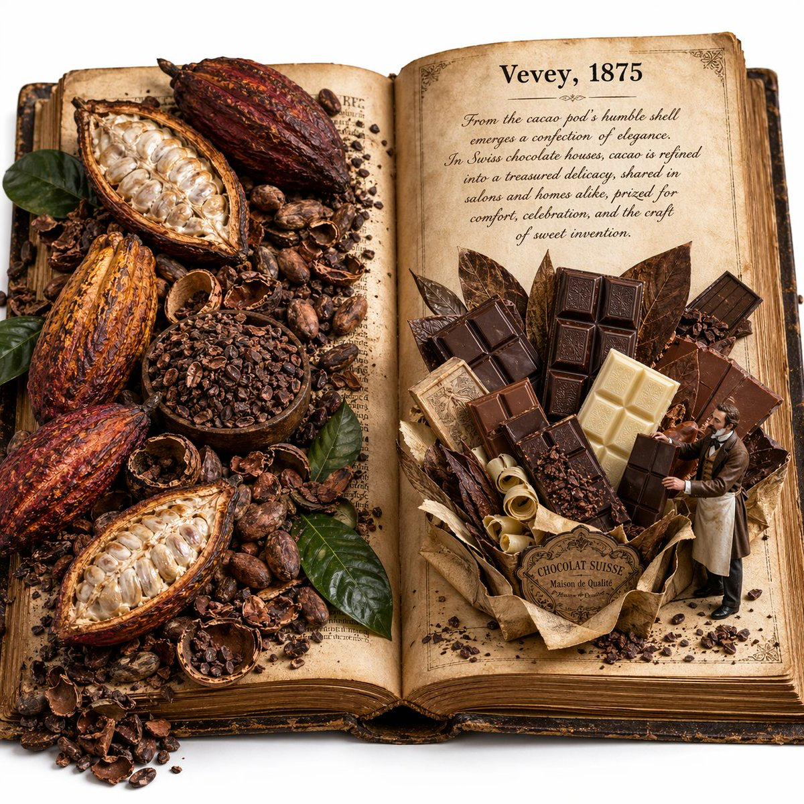</a>

```text
Create a square 1:1 macro photography image of an open antique history book on a clean white background, styled like an edible history pop-up book. The book is thick, vintage, leather-bound, and lying open flat at 180 degrees. Its pages are aged parchment with yellowed paper, worn edges, and visible paper texture. On the left page, show an abundant, slightly messy cocoa harvest spread partially covering the printed text: exactly 5 whole or split cacao pods in deep red-orange and brown tones, 1 wooden bowl filled with cacao nibs, a large scatter of loose cacao beans, broken cacao shells, small piles of nibs, and several glossy green leaves tucked among the ingredients. Everything should feel organic, overflowing, and tactile. On the right page, create a large 3D pop-up sculpture of assorted Swiss chocolate built entirely from chocolate and confectionery materials: exactly 8 visible chocolate bars or bar segments in mixed dark, milk, and white chocolate, arranged in a bouquet-like upright structure with 5 large leaf-shaped cacao or chocolate leaves behind them, curled pale chocolate shavings at the base, scattered cacao crumbs, and a wrapped paper base with a vintage label reading “CHOCOLAT SUISSE” and smaller text “Maison de Qualité”. Beside it, place a tiny 1:35 scale Victorian-era chocolatier gentleman in an apron, actively presenting and adjusting the chocolate display with both hands. Print on the right page in bold black serif text: “Vevey, 1875”. Below that, include a short faded cursive lore paragraph about cacao and Swiss chocolate culture. The paragraph should read: “From the cacao pod’s humble shell emerges a confection of elegance. In Swiss chocolate houses, cacao is refined into a treasured delicacy, shared in salons and homes alike, prized for comfort, celebration, and the craft of sweet invention.” Lighting is soft, warm museum lighting focused at the center of the open book. Mood is educational, whimsical, and richly textural. Emphasize photorealism, shallow depth of field, miniature world aesthetic, premium editorial styling, and extremely high material texture fidelity.
```

## by [Sharon Riley](<https://x.com/Just_sharon7>) on April 23, 2026 👉 [Try Now](https://indream.ai/generate?mode=IMAGE&modelKey=gpt-image-v2&modelPromptId=019e6204-107c-714c-b069-4b6646a57fb3)

<a href="./public/images/a51744bb-644b-463e-9653-1e09fb6d6328.png" target="_blank" rel="noopener noreferrer">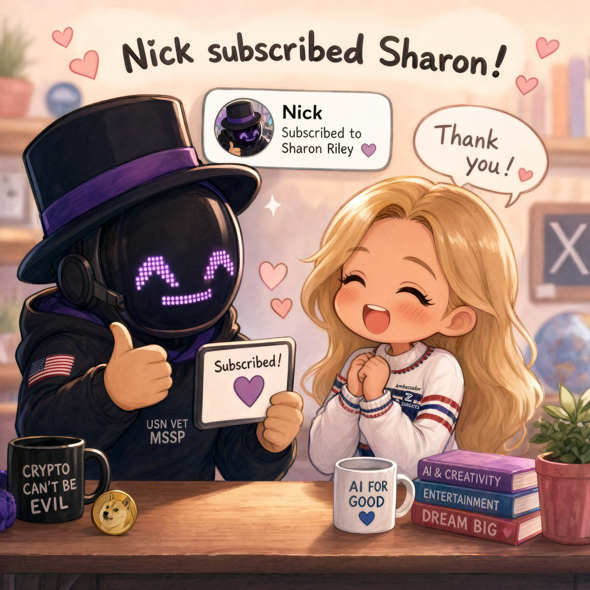</a>

```text
A warm, cute digital illustration in a cozy desk setting celebrating a new subscription. On the left is a friendly humanoid robot mascot with a glossy black face screen showing pixelated purple LED eyes and a smiling mouth, wearing a tall black top hat with a purple band and a dark hoodie with a small American flag patch on one sleeve and the text "USN VET MSSP" on the chest. The robot gives a thumbs-up with one hand and holds a small rectangular sign in the other that reads "Subscribed!" with a purple heart underneath. On the right is a delighted young woman with long wavy {argument name="hair color" default="golden blonde"} hair, seated at the desk with hands clasped near her chin in an excited grateful pose, wearing a white long-sleeve top with red and blue striped trim and a small chest logo. Her face is obscured by a simple square censor block. Above them, large playful handwritten text says "{argument name="headline text" default="Nick subscribed Sharon!"}". Beneath the headline is a rounded notification card showing a circular avatar of the same robot mascot, the name "{argument name="subscriber name" default="Nick"}", and the text "Subscribed to {argument name="creator name" default="Sharon Riley"}" followed by a purple heart. A speech bubble next to the woman says "{argument name="speech bubble text" default="Thank you!"}". Scatter exactly 7 pink heart doodles around the composition and add 1 small white sparkle near the center. Place everything on a wooden tabletop. On the left side of the desk, include 1 black mug with the text "CRYPTO CAN'T BE EVIL" and 1 gold coin featuring a Shiba Inu dog face. In the center-right foreground, include 1 white mug reading "AI FOR GOOD" with a blue heart. On the far right, stack exactly 3 books with visible spine titles: "AI & CREATIVITY", "ENTERTAINMENT", and "DREAM BIG" with a heart, beside 1 small potted plant. Use a softly blurred home-office background with shelves, pastel decor, and a framed letter X on the wall. Soft peach and beige lighting, painterly shading, rounded shapes, wholesome streamer fan-art aesthetic, polished storybook-style digital painting.
```

## by [ツバサ天九](<https://x.com/wing_sky_nine>) on April 23, 2026 👉 [Try Now](https://indream.ai/generate?mode=IMAGE&modelKey=gpt-image-v2&modelPromptId=019e6204-315b-70ad-9230-3e3b8c112bf2)

<a href="./public/images/f2fe61a3-55c2-4d12-ad67-9b2b0e033763.png" target="_blank" rel="noopener noreferrer">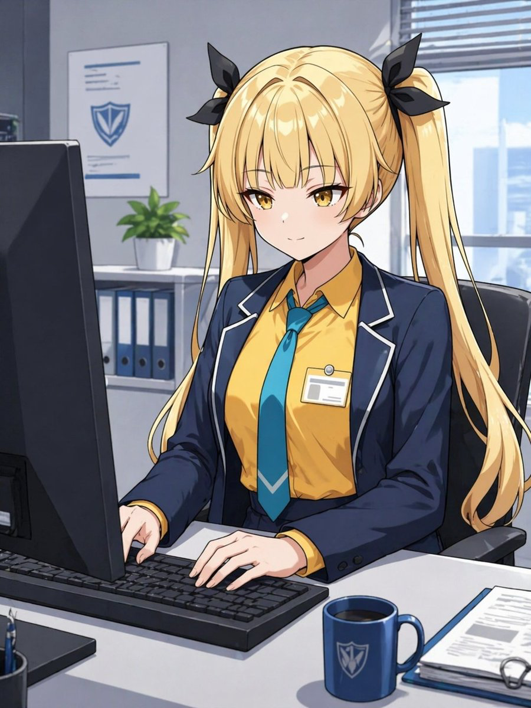</a>

```text
フラットカラーな陰影はっきりさせた滑らかな線の{argument name="画風" default="2DゲームCG塗りイラスト"}暖色系フィルター無し
```

## by [大群uoƃoꓷ](<https://x.com/MrMinusDU>) on April 23, 2026 👉 [Try Now](https://indream.ai/generate?mode=IMAGE&modelKey=gpt-image-v2&modelPromptId=019e6205-57c9-71b0-957a-e41fa25b9cef)

<a href="./public/images/41bc98a6-8a1e-4c3b-9bb7-53fc59646f8f.png" target="_blank" rel="noopener noreferrer">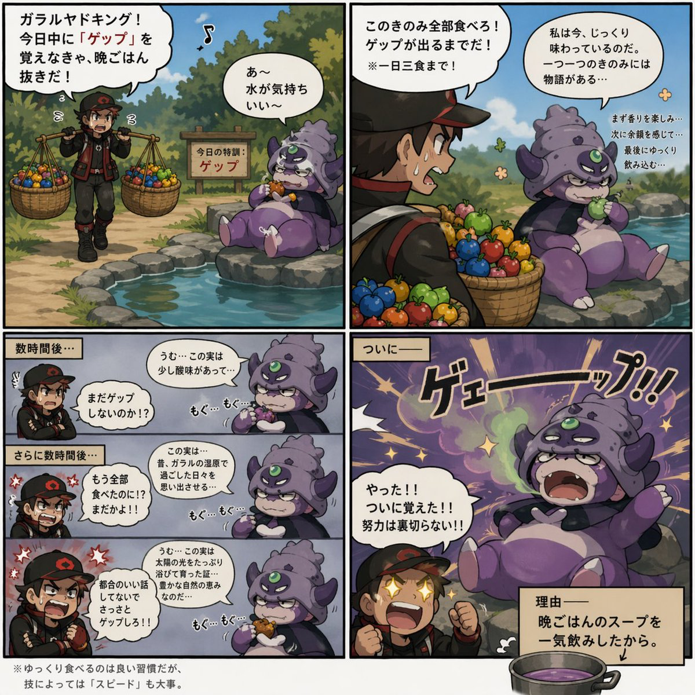</a>

```text
{"type":"anime comedy manga page","subject":"Galarian Slowking from Pokemon learning the move Belch by eating berries","style":{"medium":"full-color manga/comic illustration","franchise_inspiration":"Pokemon anime and game world","mood":"playful, comedic, slightly absurd","rendering":"clean cel-shaded anime art with expressive faces, soft outdoor lighting, detailed berries and rocky riverside background"},"characters":[{"name":"{argument name=\"pokemon name\" default=\"Galarian Slowking\"}","appearance":"round purple body, white belly markings, large spiral-shell purple head with green gem and horn-like side protrusions, sitting most of the time on a flat riverside rock"},{"name":"{argument name=\"trainer\" default=\"Pokemon Trainer\"}","appearance":"young male trainer in dark jacket and cap with red accents, carrying baskets full of colorful berries suspended from a shoulder pole"}],"setting":{"location":"sunny forest riverside with shallow stream, stones, trees, and blue sky","props":["2 hanging woven baskets full of berries on a carrying pole","1 wooden sign reading 今日の特訓！ゲップ","multiple piles of colorful berries","1 cooking pot of purple soup in the final explanation panel"]},"layout":{"page_format":"single manga page with 6 panels","reading_order":"left-to-right, top-to-bottom","sections":[{"title":"top left panel","position":"top-left","count":3,"labels":["trainer arrives carrying 2 berry baskets","speech bubble ordering Galarian Slowking to learn Belch by today or no dinner","Galarian Slowking relaxing by the water saying the water feels nice"]},{"title":"top right panel","position":"top-right","count":4,"labels":["trainer presenting a basket of berries","speech bubble: eat all these berries until Belch comes out","small note: no excuses until dinner","Galarian Slowking lecturing that each berry has its own story and should be savored slowly"]},{"title":"middle left panel","position":"middle-left","count":2,"labels":["caption: 数時間後…","trainer impatiently asking if Belch still has not happened"]},{"title":"middle center-left panel","position":"middle-center-left","count":2,"labels":["Galarian Slowking chewing berries slowly","speech about this berry having a little sourness"]},{"title":"bottom left sequence","position":"bottom-left","count":6,"labels":["caption: さらに数時間後…","trainer shocked that all berries are gone and still no success","Galarian Slowking remembering sunny days and rich natural flavors","trainer shouting to hurry up and use Belch already","Galarian Slowking still chewing slowly","small footnote about slow eating being a good habit but sometimes speed matters"]},{"title":"bottom right climax","position":"bottom-right","count":4,"labels":["caption: ついにー","huge stylized sound effect text ゲェーーーップ!!","trainer cheering with sparkling eyes that it finally learned the move","boxed explanation: reason—because it chugged dinner soup all at once"]}],"text_language":"Japanese"},"composition":{"top_panels":"conversation and setup beside the stream","left lower sequence":"time passing gags with repeated chewing close-ups","bottom_right":"dramatic explosive belch scene with purple and green energy burst behind Galarian Slowking"},"effects":{"repeated_motifs":"slow chewing, trainer frustration, berries being consumed over time","climax_fx":"purple smoky burst, impact lines, oversized comic lettering, shocked wide-open mouth"},"color_palette":{"dominant_colors":["purple","green","sky blue","earthy brown","berry red","berry yellow"],"contrast":"bright cheerful outdoor colors contrasted with intense dramatic climax effects"},"quality":"polished social-media-ready manga illustration, square format","prompt_note":"Keep the characters on-model to Pokemon designs, emphasize that the humor comes from accurate game logic: Belch only works after eating a berry, but the joke twist is that the Pokemon eats too slowly and only belches after gulping soup."}
```

## by [小娜学AI](<https://x.com/geesehowardt7>) on April 23, 2026 👉 [Try Now](https://indream.ai/generate?mode=IMAGE&modelKey=gpt-image-v2&modelPromptId=019e6205-6af1-7278-a03b-0390ca7665f5)

<a href="./public/images/6678dc82-5bd1-492b-8b7a-bd7524f6f86e.png" target="_blank" rel="noopener noreferrer"></a>

```text
A minimalist editorial illustration about cross-strait relations and dialogue, in a muted flat-paper collage style with soft grain texture and rounded shapes. Show 2 human figures seated across a table in profile, facing each other: on the left a man in dark desaturated blue, resting his chin on one hand in a thoughtful pose; on the right a woman in warm brown, gesturing with one hand as if explaining. Both faces are intentionally anonymized with soft blurred rectangular blocks over the facial area. Centered between them is a dark blue balance scale, upright and symmetrical, symbolizing justice, negotiation, and equilibrium. Above the figures are 2 overlapping speech bubbles, one blue-gray on the left and one pale beige on the right, indicating conversation and contested viewpoints. At the bottom center, place 1 white silhouette of a human head in side profile containing a simple growing plant with stem and leaves, symbolizing peace, understanding, or constructive thinking. Use a cream background with 4 large translucent abstract circular forms around the composition, including a pale gray shape on the far left, a beige shape behind the upper center-right, a warm tan shape on the far right, and a darker blue-gray semicircular shape along the bottom foreground. Keep the composition balanced, calm, symbolic, and poster-like, with no text, no sharp outlines, no photorealism, and a subdued palette of dusty blue, slate, beige, cream, and brown.
```

## by [ユメ・アスタ](<https://x.com/yume00112211>) on April 23, 2026 👉 [Try Now](https://indream.ai/generate?mode=IMAGE&modelKey=gpt-image-v2&modelPromptId=019e6205-d09e-74ab-8c3f-d61d999520e5)

<a href="./public/images/c091b939-8558-404c-9a43-8353802797a8.png" target="_blank" rel="noopener noreferrer">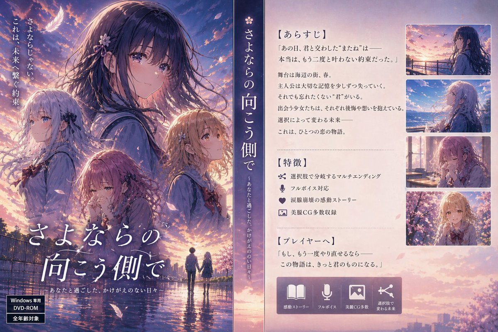</a>

```text
Create a Japanese bishoujo game promotional poster in the style of a premium visual novel box cover and store page composite. The image is split into three vertical areas. The left two-thirds is a dramatic illustrated key visual at sunset: a dreamy spring sky filled with pink and violet clouds, glowing rim light, drifting petals, and a reflective wet road or riverside path. Show 4 anime girls in school uniforms, all with soft emotional expressions and highly detailed hair moving in the wind. The largest girl is centered upper-left, shown from the chest up in profile or three-quarter view, with long dark hair and a small flower hair ornament, looking wistful. A second girl stands at lower-left with very light silver hair and a ribbon accessory, turned slightly away. A third girl is at lower center, smaller, with mauve or reddish-brown hair and a bowed, melancholy pose. A fourth girl is at mid-right, blonde or light brown-haired, facing upward with a hopeful expression. At the very bottom center of the key art, show 2 tiny full-body silhouettes of a boy and girl holding hands in the glowing distance, reflected in the wet ground. Add a white feather near the upper-left and scattered cherry blossom petals throughout. Overlay elegant Japanese title typography in large white brush-like serif lettering near the bottom-left to center: 「{argument name="title text" default="さよならの向こう側で"}」, with a smaller subtitle line beneath it. Along the far left edge, place 3 vertical lines of small Japanese catchphrase text in white. In the bottom-left corner, add 2 stacked black product labels with white text like a PC game package badge, one reading Windows compatible and one reading all ages.

The center is a narrow dark indigo vertical band separating the art from the info panel. On this band, place the game title again vertically in large white Japanese characters, with a smaller vertical tagline beneath it. Keep this band clean and elegant, like the spine of a game box.

The right third is a soft cream-colored information panel with a gentle paper texture. At top-left of this panel, add a bold Japanese heading in brackets: 「【あらすじ】」 followed by several lines of Japanese synopsis text laid out like a visual novel description page. Below that, add a dotted or dashed divider line. Then add a second bracketed heading: 「【特徴】」 with 4 feature bullets, each preceded by a simple icon. The 4 features are: branching choices, full voice support, tearjerking emotional story, and many beautiful CGs. Use small dark blue-gray icons and text. Add another divider line, then a third bracketed heading: 「【プレイヤーへ】」 followed by 2 short lines of Japanese message text.

On the far right side of the cream panel, stack 4 rounded-rectangle screenshot thumbnails vertically, each with thin white borders. Thumbnail 1: the dark-haired heroine by a seaside railing at sunset. Thumbnail 2: a pale-haired heroine with windblown hair against a bright blue ocean. Thumbnail 3: a girl indoors by a sunlit classroom or café window, warm and contemplative. Thumbnail 4: a girl surrounded by cherry blossoms in soft pink light. At the bottom of the cream panel, place a wide rounded lavender feature bar containing 4 large icons with short Japanese labels beneath or beside them: an open book, a microphone, an image/photo symbol, and a branching path/share-like icon. The overall mood should be nostalgic, romantic, cinematic, and emotionally overwhelming, like a high-budget Japanese gal game advertisement from the 2000s to 2010s. Use polished anime illustration, luminous backlighting, rich pastel sunset colors, glossy reflections, detailed typography, and authentic visual novel promo design.
```

## by [いとよ（バーチャル僧侶）@VRChat](<https://x.com/itoyo_monk>) on April 23, 2026 👉 [Try Now](https://indream.ai/generate?mode=IMAGE&modelKey=gpt-image-v2&modelPromptId=019e6205-e185-716d-af56-c42dd10c8581)

<a href="./public/images/d0ea7877-f4ad-4635-8880-da5f8b575041.png" target="_blank" rel="noopener noreferrer">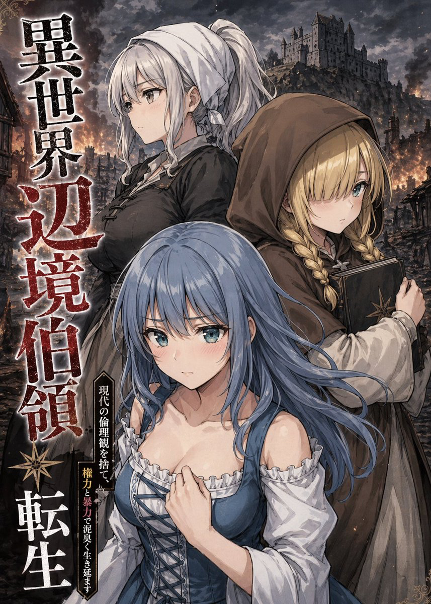</a>

```text
A dark fantasy anime light-novel cover in a vertical composition, painted with detailed dramatic brushwork and moody cinematic lighting. Show three young women posed in a triangular arrangement against a ruined medieval city engulfed in flames at night, with smoke, embers, collapsed timber buildings, and a large stone castle on a rocky hill in the upper background. In the foreground center, place a beautiful young woman with long flowing {argument name="hair color" default="powder blue"} hair, wearing an off-shoulder blue corset dress with white frilled sleeves and lace-up bodice, one hand lightly gripping her chest, her expression serious and vulnerable. Behind her on the left, place a tall woman with silver-white hair tied in a high ponytail and a white headscarf, wearing a modest black dress with a high collar and front fastenings, standing in profile with a stern, unreadable presence. Behind her on the right, place a blonde girl with twin braids under a brown hooded cloak, pale blue-green eyes, holding a black book with a star-like emblem on the cover close to her chest, looking sideways with a guarded expression. Use layered character overlap, strong contrast, and slightly desaturated colors except for warm firelight and deep reds. Add large vertical Japanese title typography along the left side in distressed calligraphic style: 「異世界辺境伯領」 in black and dark red, plus two smaller vertical text blocks near the lower left reading 「現代の倫理観を捨て」 and 「権力と暴力で泥臭く生き延びます」. Add a decorative compass-like emblem near the lower left and a large bold vertical subtitle 「転生」 at the bottom left. Ornate corner filigree, gritty light-novel cover design, intense isekai war atmosphere, high detail, premium illustrated novel cover.
```

## by [智元饲养员](<https://x.com/zoomad99>) on April 23, 2026 👉 [Try Now](https://indream.ai/generate?mode=IMAGE&modelKey=gpt-image-v2&modelPromptId=019e6208-cdcb-74d9-abda-1d9178f14eda)

<a href="./public/images/2db983eb-2123-479b-b9d3-4e2ee91aeb5d.png" target="_blank" rel="noopener noreferrer">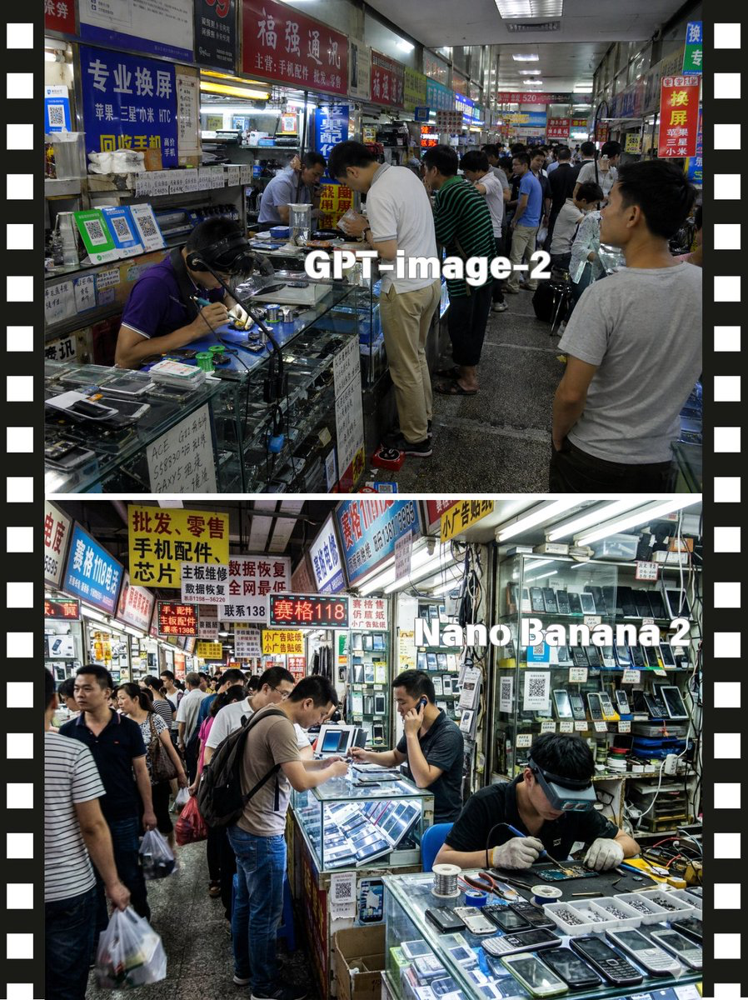</a>

```text
{"type":"split-screen market comparison poster","style":"photo-realistic documentary photography","subject":"busy indoor electronics repair and mobile phone parts market in China","layout":{"format":"vertical poster with 2 stacked comparison panels","divider":"thin white horizontal divider between panels","side_borders":"black filmstrip-style borders on left and right edges with evenly spaced white perforation rectangles","panels":[{"position":"top half","overlay_text":"GPT-image-2","scene":"narrow fluorescent-lit shopping corridor lined with glass display counters and densely packed Chinese shop signs","crowd_count":"around 12 visible shoppers and vendors","primary_action":"customers leaning over counters while technicians repair phones and sell parts","details":["one seated technician in a purple polo shirt soldering at the front left counter","a tall customer in a white polo shirt bending over the central glass case","another customer in a green striped shirt beside him","a man in a light gray T-shirt standing in the right foreground with his back partly to camera","glass counters filled with smartphone screens, tools, spare parts, and small electronics","overhead signage in red, blue, yellow, and white with Chinese text about screen replacement, phone accessories, and repairs","deep perspective down the corridor with many small stalls and ceiling strip lights"],"text_style":"large bold white sans-serif text centered over the scene"},{"position":"bottom half","overlay_text":"Nano Banana 2","scene":"another crowded indoor mobile phone market aisle, brighter and more cluttered, with open repair stalls and walls full of phones and parts","crowd_count":"around 11 visible shoppers and vendors","primary_action":"technicians working at counters while customers browse and talk","details":["front-right technician seated at a glass counter, wearing dark clothes and white gloves, repairing a device with tools spread out","center customer with a backpack leaning over a lit display case","another vendor at center-right holding a phone to his ear","left side aisle filled with walking shoppers carrying plastic bags","glass showcases displaying old mobile phones, screens, batteries, and accessories","shop walls densely stacked with hanging phones and packaged components","many bright Chinese signboards overhead in yellow, red, blue, and white advertising wholesale, retail, mobile accessories, chip repair, and data recovery"],"text_style":"large bold white sans-serif text placed across the upper-right center of the panel"}]},"camera":{"angle":"eye level","lens":"wide-angle documentary street photo lens","composition":"deep corridor perspective with strong leading lines from counters and ceiling lights"},"lighting":"cool fluorescent indoor lighting, slightly harsh commercial mall illumination","mood":"busy, crowded, practical, authentic tech-market atmosphere","quality":"high-detail realistic photography, natural color, sharp storefront signage, reflective glass counters"}
```

## by [AbleGPT](<https://x.com/AbleGPT>) on April 23, 2026 👉 [Try Now](https://indream.ai/generate?mode=IMAGE&modelKey=gpt-image-v2&modelPromptId=019e620f-985b-74c3-8460-06228be6304a)

<a href="./public/images/b37c9c63-15ea-44fa-b7d4-953870b8f494.png" target="_blank" rel="noopener noreferrer">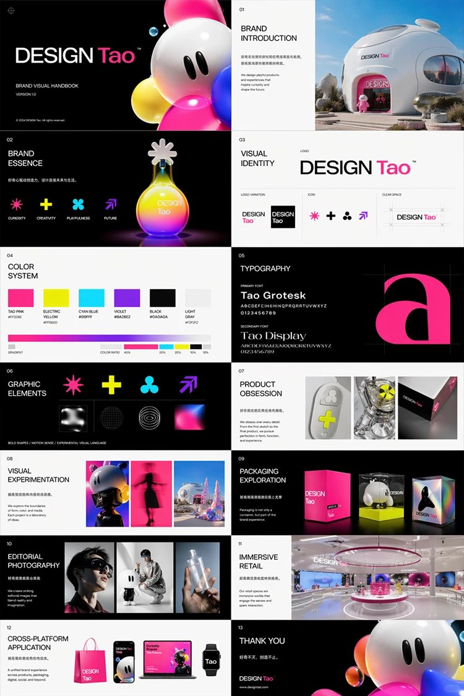</a>

```text
为一家名为「{argument name="品牌名称" default="任何品牌名称"}」的公司打造一套精致的多页品牌视觉手册(多张图片形式)。品牌整体气质应当充满趣味、具有未来感、色彩鲜明，并且设计感强烈，在“玩具般的活力”与“高端创意科技品牌的精致感”之间取得平衡。视觉风格需采用大胆且具有实验性的品牌语言，包括:高饱和亮色、简洁几何图形、现代字体设计、富有动感的视觉节奏，以及略带超 surreal 感的图像表达。
整体氛围应传递出:创造力、年轻感、节奏感、触感体验以及概念前卫性。在表达上，需要融合消费级产品的趣味性、时尚品牌的呈现方式，以及当代数字设计的语言体系。品牌手册中应体现:
对产品细节的极致关注(product obsession)多样化的视觉实验(visual experimentation)包装设计探索(packaging exploration)编辑风格摄影(editorial photography)沉浸式零售体验(immersive retail)跨平台品牌应用 (cross-platform brand application)最终呈现应构建一个自信、当代、统一且完整的品牌世界观一既易于理解与接近，又具备强烈的艺术指导感(artdirection)在视觉上保持高度一致性，同时展现出高端创意工作室级别的美学标准。
```

## by [Bitturing](<https://x.com/Bitturing>) on April 23, 2026 👉 [Try Now](https://indream.ai/generate?mode=IMAGE&modelKey=gpt-image-v2&modelPromptId=019e6210-d389-70bc-a1e6-0b29c489d6c5)

<a href="./public/images/8f284e4d-408a-498a-9031-7bc97df5725b.png" target="_blank" rel="noopener noreferrer">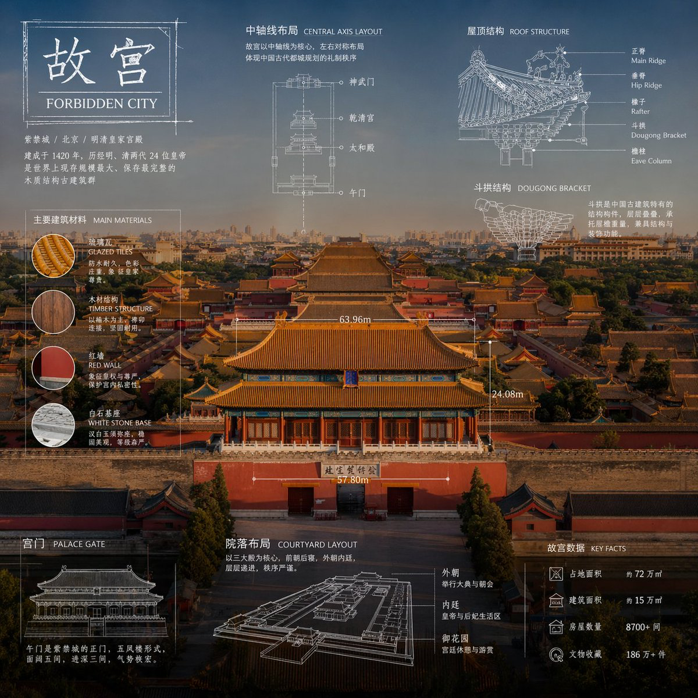</a>

```text
"{argument name="主题" default="[对象]"}的高级技术信息图。在一张专业且逼真的新照片中重新诠释主题，照片干净明亮，背景更合适且更具美感。保持物品作为真实照片，而非插图。添加一个技术蓝图风格的叠加图，包含白线、箭头、尺寸、标签以及零件、材料、尺寸 and 功能的小型示意图。清晰、优雅且信息丰富的文章。在左上角放置一个写有“{argument name="标签内容" default="OBJECT"}”的草图框。1：1 维度。"
```

## by [おくだ｜奥田準祐【著書】中国輸入―Yahoo!ショッピング完全攻略ガイド(ぱる出版)](<https://x.com/okuda_buppan>) on April 23, 2026 👉 [Try Now](https://indream.ai/generate?mode=IMAGE&modelKey=gpt-image-v2&modelPromptId=019e6212-2cd1-71bf-b16c-498515f0e550)

<a href="./public/images/dad49695-333b-4d68-8e15-5c909a02bb24.png" target="_blank" rel="noopener noreferrer">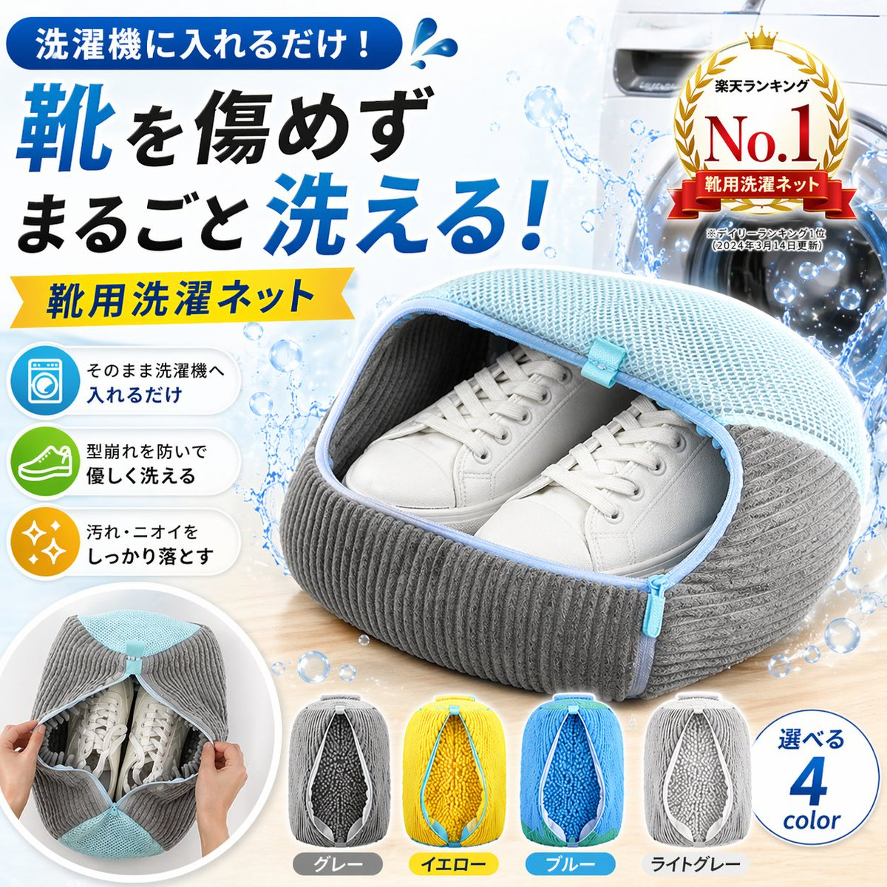</a>

```text
{"type":"Japanese e-commerce product advertisement","product":{"category":"shoe laundry mesh bag","name":"{argument name=\"product name\" default=\"靴用洗濯ネット\"}","hero":{"bag":{"shape":"rounded clamshell zippered laundry bag with a top mesh panel and ribbed fabric sides","main colors":["light blue mesh","medium gray ribbed body","pale blue zipper trim"],"position":"front-right foreground on a light wooden tabletop","state":"unzipped open at the front, revealing the contents"},"contents":{"count":2,"item":"white low-top sneakers","arrangement":"a clean matching pair placed neatly side by side inside the bag with toes facing forward"},"background":{"setting":"bright clean laundry room","main object":"front-loading washing machine on the right side, partially visible","effects":["large water splash arcs behind the product","floating water bubbles across the composition"],"lighting":"high-key commercial lighting with glossy highlights and crisp shadows"}}},"layout":{"style":"dense Japanese shopping-banner composition for an online marketplace hero image","sections":[{"title":"main headline block","position":"top-left","count":3,"labels":["洗濯機に入れるだけ！","靴を傷めず","まるごと洗える！"]},{"title":"product name ribbon","position":"left-center under headline","count":1,"labels":["靴用洗濯ネット"]},{"title":"feature icons","position":"left side vertical column","count":3,"labels":["そのまま洗濯機へ入れるだけ","型崩れを防いで優しく洗える","汚れ・ニオイをしっかり落とす"]},{"title":"award badge","position":"top-right","count":1,"labels":["楽天ランキング","No.1","靴用洗濯ネット","※デイリーランキング1位 (2024年3月14日更新)"]},{"title":"inset usage photo","position":"bottom-left","count":1,"labels":["hands opening the bag to place or show the shoes inside"]},{"title":"color variants","position":"bottom-center","count":4,"labels":["グレー","イエロー","ブルー","ライトグレー"]},{"title":"color count callout","position":"bottom-right","count":1,"labels":["選べる","4","color"]}],"color variants":[{"label":"グレー","bag color":"gray body with light blue mesh top"},{"label":"イエロー","bag color":"yellow body with pale trim"},{"label":"ブルー","bag color":"bright blue body with pale trim"},{"label":"ライトグレー","bag color":"light gray body with pale trim"}]} ,"typography":{"language":"Japanese","headline treatment":"very large bold sans-serif, black and vivid blue emphasis, dynamic line breaks","accent colors":["royal blue","yellow","white","red-gold badge accents","green and orange feature icons"]},"composition notes":"Create a polished marketplace-ready Japanese sales graphic with the product dominating the center-right, large benefit-focused headline on the left, ranking badge at the upper right, and four small color option thumbnails along the bottom. Emphasize cleanliness, protection, and washing power. Use glossy water splash effects and bubbles to imply machine washing performance. Keep the overall look premium, trustworthy, and highly clickable.","customization":{"headline emphasis color":"{argument name=\"accent color\" default=\"blue\"}","bag main color":"{argument name=\"main bag color\" default=\"gray with light blue mesh\"}","background appliance":"{argument name=\"background appliance\" default=\"front-loading washing machine\"}"}}
```

## by [Eric｜晓峰](<https://x.com/ericoding99>) on April 23, 2026 👉 [Try Now](https://indream.ai/generate?mode=IMAGE&modelKey=gpt-image-v2&modelPromptId=019e6216-4dd8-7208-b401-b846f35dccb2)

<a href="./public/images/6421655a-6ec9-42a4-95f6-c3c061be6a44.png" target="_blank" rel="noopener noreferrer">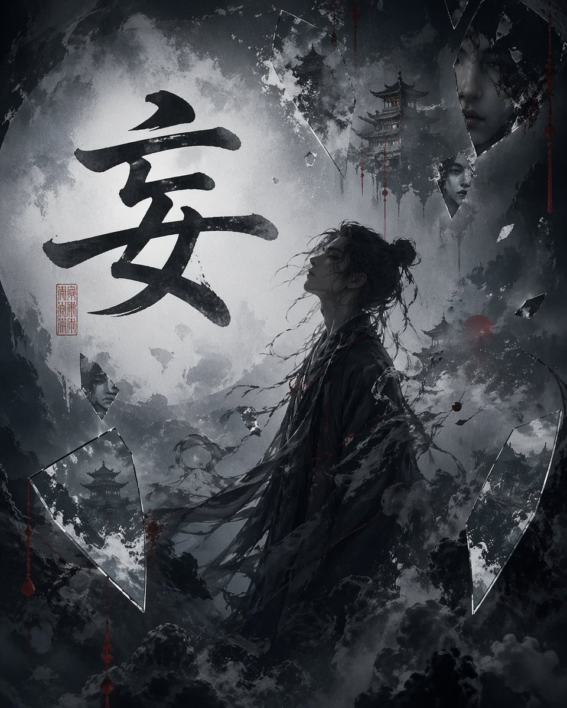</a>

```text
A dark, cinematic Chinese ink-wash fantasy illustration centered on the large black calligraphy character "安" painted in bold expressive brushstrokes across a glowing full moon-like white disc in the background. In the lower center-right foreground, show 1 lone East Asian warrior-scholar figure in side profile facing left, with a loose messy topknot, stray windswept hair strands, and a long shredded black robe dissolving into smoke and ink. The figure feels solemn, ghostly, and dramatic, standing amid stormy mist and swirling black watercolor clouds. The palette is nearly monochrome charcoal, black, ash gray, and cold white, with very sparse deep crimson accents. Include 4 visible pagoda structures: 2 small distant pagodas on the right side, 1 pagoda reflected inside a large broken mirror shard at bottom left, and 1 taller pagoda near the upper right emerging from fog. Surround the composition with 5 prominent shattered glass or mirror fragments: 1 large triangular shard at bottom left, 1 tall shard near the upper center, 1 large vertical shard at upper right, 1 small hanging shard below it, and 1 large curved shard at bottom right, plus a few tiny splinters. In 1 shard near the left side, include the partial reflection of a human face. Add 1 red seal stamp with Chinese characters near the left side beneath the large calligraphy. Use splattered ink textures, torn paper-like edges, dripping red marks, and layered smoke to create an eerie wuxia-horror atmosphere. High contrast lighting, painterly mixed-media style, textured brushwork, poster-like composition, ultra-detailed, moody, mystical, and elegant.
```

## by [Eric｜晓峰](<https://x.com/ericoding99>) on April 23, 2026 👉 [Try Now](https://indream.ai/generate?mode=IMAGE&modelKey=gpt-image-v2&modelPromptId=019e6216-1184-74cf-9f6e-a1dd58c8815c)

<a href="./public/images/0fd9c3ec-f997-4bff-8fdf-55ba103f722f.png" target="_blank" rel="noopener noreferrer">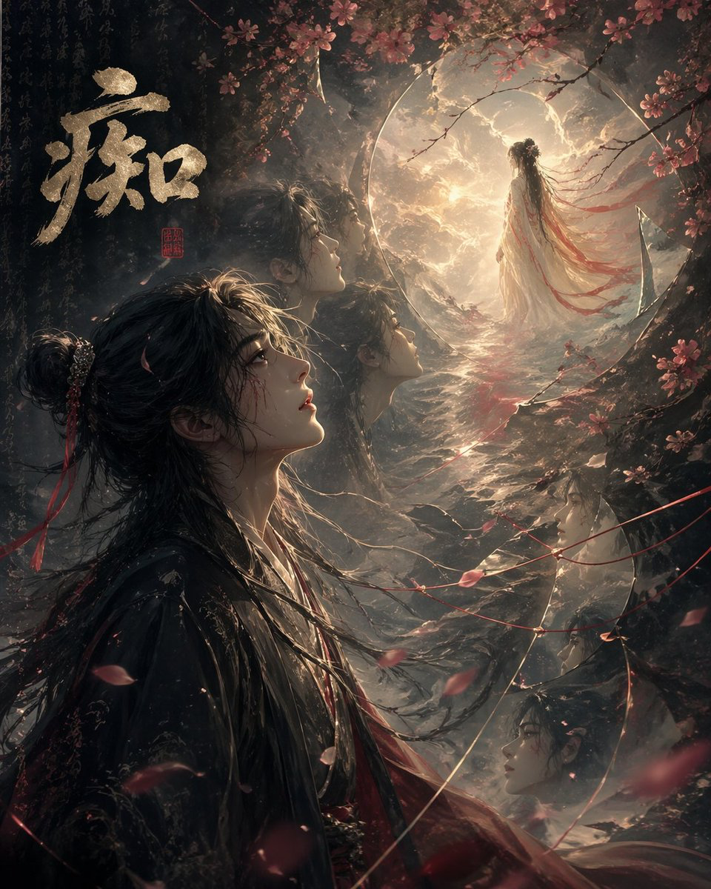</a>

```text
A dark, cinematic Chinese fantasy illustration inspired by the single character {argument name="Chinese character" default="痴"}, rendered as a poetic xianxia scene. Vertical composition. In the left foreground, a solitary young man with long black hair stands in three-quarter profile, wearing layered black robes with subtle embroidered patterns and hints of deep crimson inner fabric. His hair is partially tied into a traditional topknot with an ornate hairpiece and trailing red ribbons. He looks toward the distance with a melancholic, obsessed expression. In the upper right background, framed inside a glowing full moon or circular portal, a graceful woman in flowing white robes stands with her back turned, her long sleeves and red silk ribbons streaming in the wind, appearing ethereal and unreachable. The environment is a rocky, shadowed path at night, illuminated by moonlight and mist, with dramatic clouds, drifting pink flower petals, and arching branches of blooming cherry blossoms overhead. Thin red cords or fate-threads cross the composition diagonally, connecting space and emotion. Include 3 reflective mirror shards floating in the scene, each showing faint fragmented reflections of faces or figures, enhancing the sense of longing and fractured memory. In the upper left, place one large gold calligraphy character, {argument name="calligraphy text" default="痴"}, painted in expressive brush strokes, with a small red seal stamp beneath it and faint vertical calligraphy texture receding into the dark background. Use painterly detail, high contrast, soft atmospheric glow, rich black-red-gold palette, romantic tragedy, obsession, yearning, and dreamlike ancient Chinese aesthetic.
```

## by [simeon-sanai](<https://x.com/Naiknelofar788>) on April 23, 2026 👉 [Try Now](https://indream.ai/generate?mode=IMAGE&modelKey=gpt-image-v2&modelPromptId=019e6216-9879-7620-9b36-39e8765d609f)

<a href="./public/images/43c5ce29-47db-4ed5-83aa-98326dabf3f4.png" target="_blank" rel="noopener noreferrer">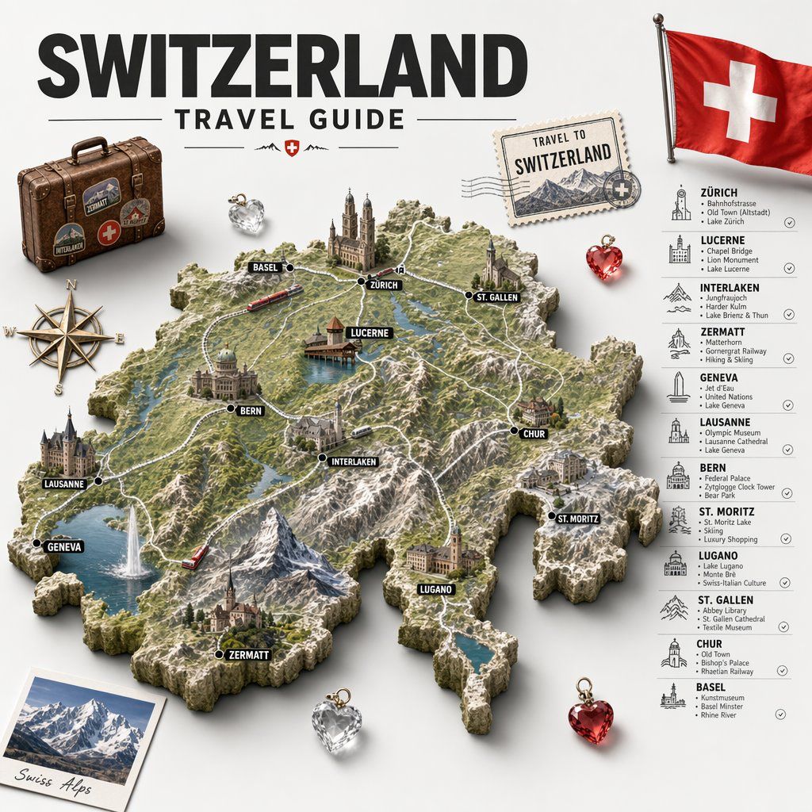</a>

```text
Create a highly detailed vintage-inspired illustrated travel poster and infographic for {argument name="country name" default="Switzerland"}, shown as a sculpted 3D relief map centered on a clean light gray background. At the top, place a huge bold black sans-serif title reading {argument name="headline text" default="SWITZERLAND"}, with smaller uppercase text below reading TRAVEL GUIDE, flanked by thin horizontal divider lines and a tiny red shield emblem with a white cross. The centerpiece is a raised topographic map of Switzerland rendered like a miniature diorama, with rocky borders, green valleys, snowy alpine peaks, blue lakes, winding white roads, and a few rail lines. Mark exactly 12 destinations on the map with black dot markers and bold black capsule labels with white uppercase text: BASEL, ZÜRICH, ST. GALLEN, LUCERNE, BERN, INTERLAKEN, CHUR, ST. MORITZ, LUGANO, ZERMATT, GENEVA, and LAUSANNE. Integrate miniature landmark buildings and scenery directly onto the map, including churches, old town towers, waterfront structures, castles, and mountain villages, plus two small red trains moving through the landscape. Add surrounding travel ephemera arranged around the map: 1 worn brown vintage suitcase with travel stickers and a red Swiss-cross badge in the upper left, 1 antique brass compass rose on the left, 1 postage stamp in the upper right reading TRAVEL TO SWITZERLAND with mountain art and postal cancellation marks, 1 realistic Swiss flag on a pole in the top right corner, 1 tilted polaroid photo in the lower left with snowy mountains and the caption {argument name="photo caption" default="Swiss Alps"}, and 4 faceted heart-shaped crystal charms total, with 2 clear/silver hearts and 2 red hearts placed around the composition. On the right side, add a vertical sightseeing list with icon illustrations and thin separators, containing exactly 12 city entries with headings and short attraction lines: ZÜRICH — Bahnhofstrasse; Old Town (Altstadt); Lake Zurich. LUCERNE — Chapel Bridge; Lion Monument; Lake Lucerne. INTERLAKEN — Jungfraujoch; Harder Kulm; Lake Brienz & Thun. ZERMATT — Matterhorn; Gornergrat Railway; Skiing & Hiking. GENEVA — Jet d'Eau; United Nations; Lake Geneva. LAUSANNE — Olympic Museum; Lausanne Cathedral; Lake Geneva. BERN — Federal Palace; Zytglogge Clock Tower; Bear Park. ST. MORITZ — St. Moritz Lake; Skiing; Luxury Shopping. LUGANO — Lake Lugano; Monte Brè; Swiss-Italian Culture. ST. GALLEN — Abbey Library; St. Gallen Cathedral; Textile Museum. CHUR — Old Town; Bishop's Palace; Rhine Valley. BASEL — Kunstmuseum; Basel Minster; Rhine River. Use a premium editorial travel-brand aesthetic, combining realistic miniature map rendering, crisp typography, soft studio shadows, subtle drop shadows under objects, and a polished tourism campaign look.
```

## by [simeon-sanai](<https://x.com/Naiknelofar788>) on April 23, 2026 👉 [Try Now](https://indream.ai/generate?mode=IMAGE&modelKey=gpt-image-v2&modelPromptId=019e6216-8414-725c-9296-122dc9a0e0b5)

<a href="./public/images/0b3c9986-d526-4ebe-b43b-3b51c5c8dc29.png" target="_blank" rel="noopener noreferrer">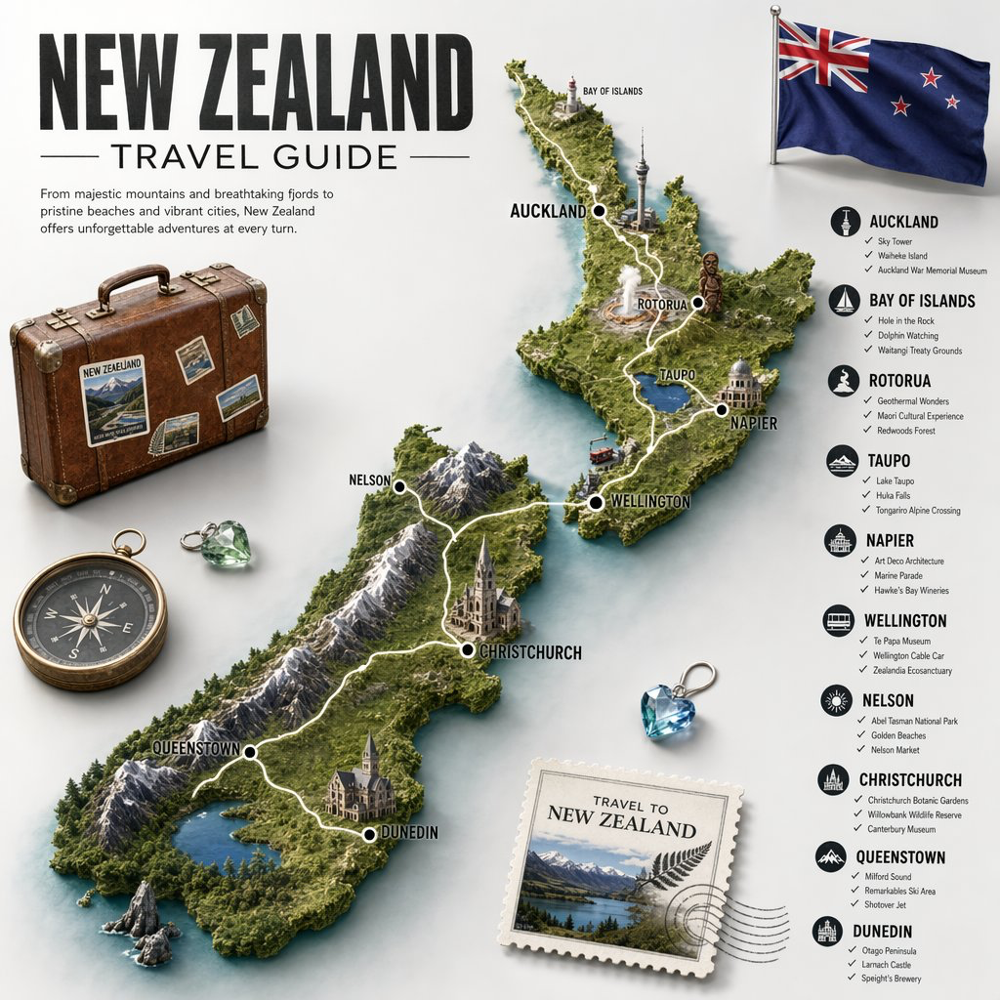</a>

```text
{"type":"travel poster infographic","theme":"vintage-inspired premium travel guide map","subject":{"country":"{argument name=\"destination country\" default=\"New Zealand\"}","map_style":"3D illustrated topographic map shaped like the country, viewed from above on a clean light gray background","terrain":"lush green land, raised relief, rocky mountains, lakes, coastline, soft ocean shadows","route":"bright white road network connecting major destinations with circular city markers"},"layout":{"format":"square poster","sections":[{"title":"main headline","position":"top left","count":3,"labels":["NEW ZEALAND","TRAVEL GUIDE","intro paragraph"]},{"title":"map destinations","position":"center and right-center","count":10,"labels":["BAY OF ISLANDS","AUCKLAND","ROTORUA","TAUPO","NAPIER","WELLINGTON","NELSON","CHRISTCHURCH","QUEENSTOWN","DUNEDIN"]},{"title":"destination highlights list","position":"far right vertical column","count":9,"labels":["AUCKLAND","BAY OF ISLANDS","ROTORUA","TAUPO","NAPIER","WELLINGTON","NELSON","CHRISTCHURCH","QUEENSTOWN","DUNEDIN"]},{"title":"travel props","position":"left and bottom right","count":5,"labels":["vintage brown suitcase with travel stickers","antique compass","green faceted gemstone souvenir","blue faceted gemstone souvenir","postage stamp"]}],"centerpiece":"large sculpted map of New Zealand's North and South Islands with miniature landmarks and labeled cities"},"text":{"headline":"{argument name=\"headline text\" default=\"NEW ZEALAND\"}","subheadline":"{argument name=\"subheadline text\" default=\"TRAVEL GUIDE\"}","intro":"{argument name=\"intro text\" default=\"From majestic mountains and breathtaking fjords to pristine beaches and vibrant cities, New Zealand offers unforgettable adventures at every turn.\"}","stamp_text":"{argument name=\"stamp text\" default=\"TRAVEL TO NEW ZEALAND\"}"},"map_details":{"north_island":{"count":6,"labels":["BAY OF ISLANDS","AUCKLAND","ROTORUA","TAUPO","NAPIER","WELLINGTON"]},"south_island":{"count":4,"labels":["NELSON","CHRISTCHURCH","QUEENSTOWN","DUNEDIN"]},"mini_landmarks":{"count":8,"labels":["Sky Tower near Auckland","traditional carved Maori-style figure near Rotorua","classical domed building near Napier","mountain range across South Island","cathedral-like church near Christchurch","church near Dunedin","small red vehicle near central route","rocky sea stack near southwest coast"]},"flag":{"count":1,"description":"New Zealand national flag on a silver pole in the upper right corner"}},"style":{"color_palette":"natural greens, slate gray mountains, white roads, muted blue water, brown leather, black typography","lighting":"soft studio lighting with realistic shadows","typography":"bold condensed sans-serif headline, clean editorial layout","render_quality":"high-detail polished commercial poster, hybrid of infographic design and realistic miniature diorama"}}
```

## by [松果先森](<https://x.com/songguoxiansen>) on April 23, 2026 👉 [Try Now](https://indream.ai/generate?mode=IMAGE&modelKey=gpt-image-v2&modelPromptId=019e6216-fc28-77fe-af32-833df9895494)

<a href="./public/images/b517ca16-d5d7-4974-9bbc-6ff8d7cd4af6.png" target="_blank" rel="noopener noreferrer">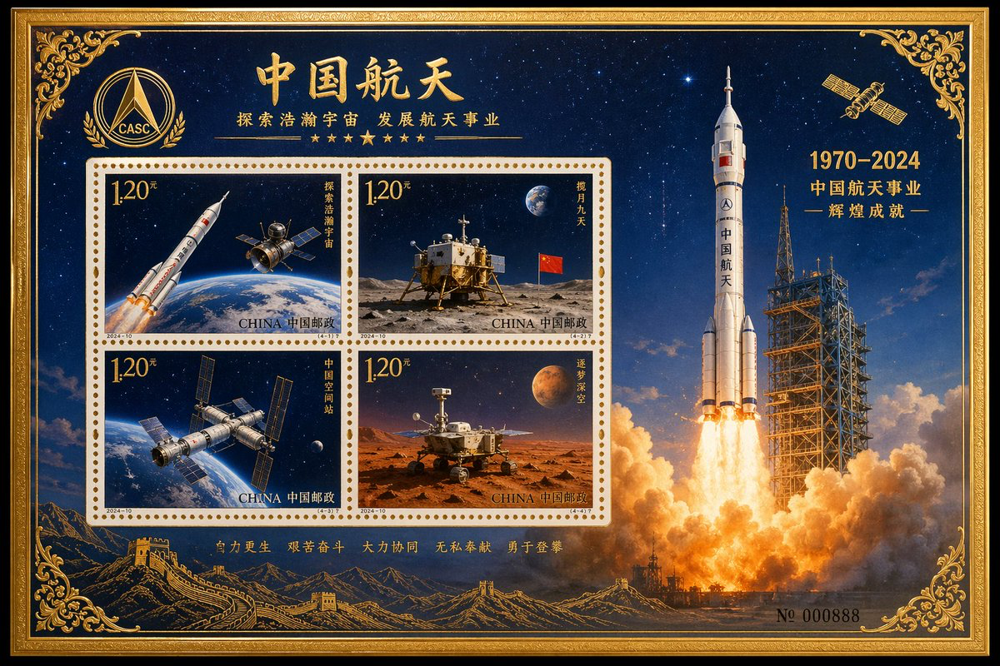</a>

```text
{argument name="邮票主题" default="中国航天纪念邮票"}小全张，{argument name="场景" default="火箭发射场景"}，烫金边框工艺
```

## by [宝玉](<https://x.com/dotey>) on April 23, 2026 👉 [Try Now](https://indream.ai/generate?mode=IMAGE&modelKey=gpt-image-v2&modelPromptId=019e6217-733f-74c5-b32f-f0dfa55f19c3)

<a href="./public/images/29b98463-67eb-480c-a5ec-003aa9d1fb8f.png" target="_blank" rel="noopener noreferrer">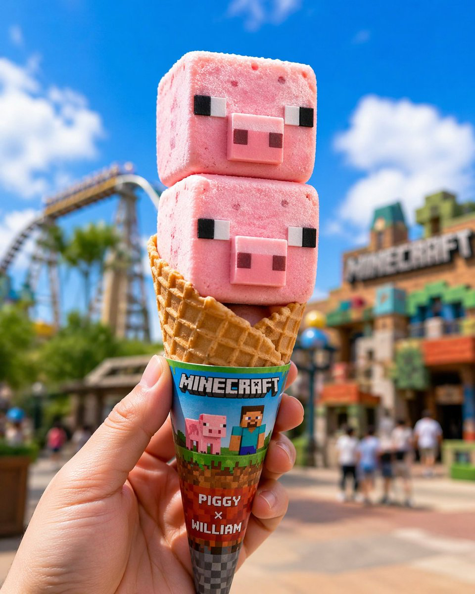</a>

```text
William and Piggy shaped ice cream, pink square ice cream with pixel eyes and pig noses, strawberry flavor, served on a cone, cute food design. Egg Cone: A standard waffle cone, golden and crispy in color, with a “Minecraft” co-branded paper sleeve. The background is an outdoor theme park scene with a blue sky, white clouds, and brightly colored rides and buildings blurring into the background. The hand of the person holding the ice cream is clear, enhancing the realism of the “hands-on experience”. The overall style is bright, fun and playful, making it an eye-catching IP co-branded summer ice cream.
```

## by [朝倉@料理するゲームエンジニア](<https://x.com/b1asakura>) on April 23, 2026 👉 [Try Now](https://indream.ai/generate?mode=IMAGE&modelKey=gpt-image-v2&modelPromptId=019e6217-d28d-7200-839d-a2b3a337a641)

<a href="./public/images/34b2b384-11ee-4d26-b2c6-0ff2bee87bf9.png" target="_blank" rel="noopener noreferrer">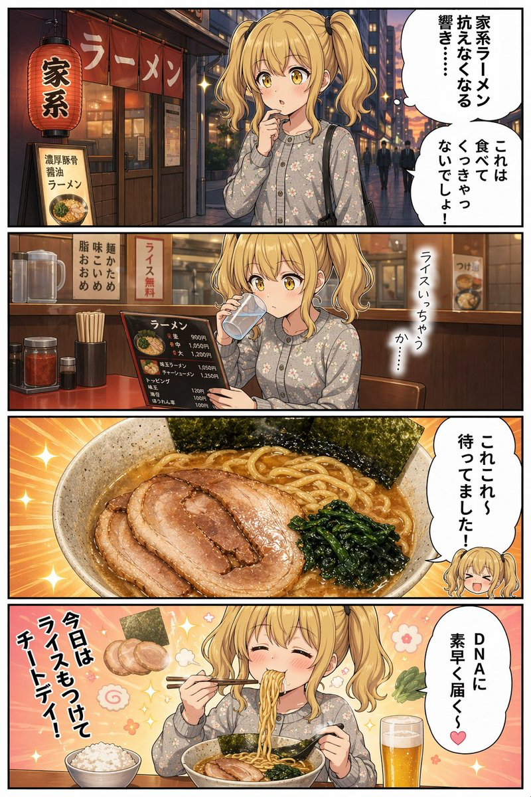</a>

```text
{"type":"anime food comic page","style":"clean manga-like digital illustration with warm evening lighting, glossy food rendering, detailed ramen shop background, soft pastel character coloring, expressive comedic Japanese gourmet comic tone","format":"vertical four-panel comic with black panel borders","subject":{"main character":{"gender_presentation":"young woman","age_appearance":"late teens to early 20s","hair":{"color":"{argument name=\"hair color\" default=\"golden blonde\"}","style":"twin ponytails with curled ends, straight bangs"},"outfit":"light gray floral button-up cardigan or knit top, black shoulder bag","face_visibility":"face obscured by a centered rectangular blur censor in panels 1 and 2, fully visible in panels 3 chibi inset and 4"},"theme":"craving and enjoying rich Iekei ramen"},"layout":{"panel_count":4,"panels":[{"index":1,"scene":"outside a ramen shop at dusk on a city street","background_elements":{"count":6,"items":["large red lantern labeled 家系","red shop noren labeled ラーメン","standing signboard labeled 濃厚豚骨醤油ラーメン with ramen photo","glass storefront entrance","urban evening street with pedestrians","speech balloons with vertical Japanese text"]},"character_pose":"standing in front of the shop, one finger near lips, looking tempted","text":{"count":4,"items":["家系","ラーメン","濃厚豚骨醤油ラーメン","speech balloons reading 家系ラーメン抗えなくなる響き・・・ and これは食べてくっきゃないでしょ！"]}},{"index":2,"scene":"inside the ramen shop at the counter","background_elements":{"count":10,"items":["water pitcher","water cup","chopsticks container","red condiment jar","small soy sauce or seasoning bottle","black menu board with ramen prices","vertical sign ライス無料","wooden counter","chair","blurred wall poster in the back"]},"character_pose":"seated at the counter drinking water from a glass with one hand while holding a menu with the other","text":{"count":3,"items":["ライス無料","menu heading ラーメン","speech text ライスいっちゃうか・・・"]}},{"index":3,"scene":"close-up hero shot of the ramen bowl","food":{"dish":"Iekei ramen","components":{"count":5,"items":["thick glossy broth","medium-thick yellow noodles","4 overlapping slices of braised chashu pork","dark green spinach","3 large sheets of nori"]}},"background":"radiant orange burst with sparkles","extra_character":"small chibi head of the girl at bottom right, smiling excitedly","text":{"count":1,"items":["speech balloon これこれ〜待ってました！"]}},{"index":4,"scene":"the girl happily eating ramen at the table","food_and_drink":{"count":5,"items":["main ramen bowl","separate bowl of white rice","glass of beer","floating garnish illustration of nori and chashu near the text","chopsticks lifting noodles"]},"character_pose":"eyes closed with bliss, smiling, cheeks slightly flushed, lifting noodles with chopsticks and holding bowl with the other hand","background":"soft pink-orange gradient with sparkles and small flower motifs","text":{"count":2,"items":["large vertical slogan 今日はライスもつけてチートデイ！","speech balloon DNAに素早く届く♥"]}}]},"camera":"panel 1 medium shot, panel 2 medium interior shot, panel 3 extreme food close-up, panel 4 medium close-up eating scene","rendering_notes":"make the ramen especially appetizing with glossy fat sheen on the pork, rich broth highlights, and realistic noodle texture; keep the comic readable with authentic Japanese signage and speech balloons; emphasize cozy evening ramen shop atmosphere and playful indulgent humor"}
```

## by [てんねん](<https://x.com/munou_ac>) on April 23, 2026 👉 [Try Now](https://indream.ai/generate?mode=IMAGE&modelKey=gpt-image-v2&modelPromptId=019e6218-a2c7-7421-901f-19e0e5728732)

<a href="./public/images/44197898-a633-4acb-923a-23868b471907.png" target="_blank" rel="noopener noreferrer">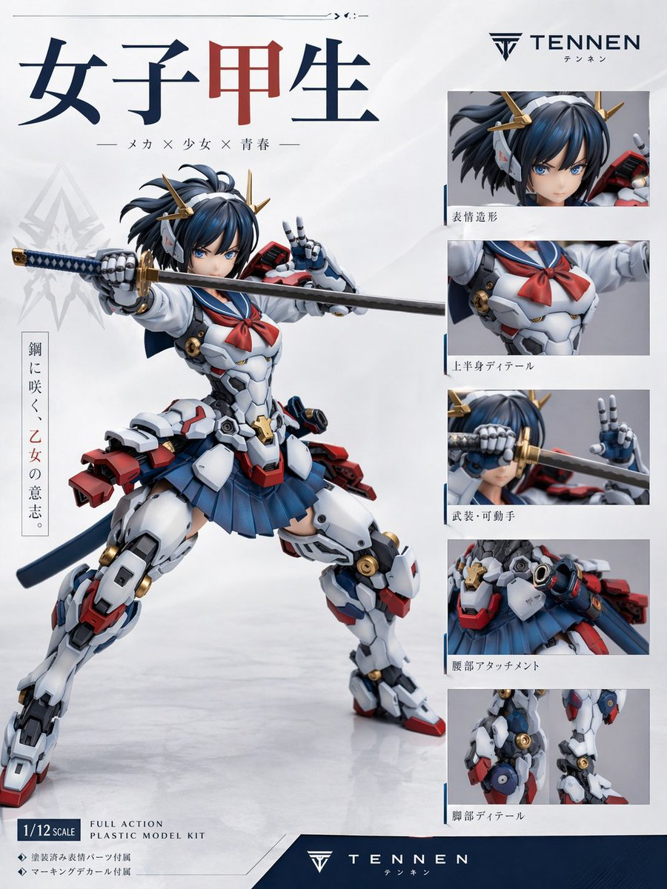</a>

```text
Create a premium Japanese plastic model kit product-poster layout on a clean white studio background with subtle gray gradients and a glossy floor reflection. The main subject is a highly detailed anime mecha schoolgirl figure posed dynamically in the center-left, in a wide combat stance, holding a katana horizontally across the frame with one robotic hand gripping the hilt and the other making a peace sign near her face. The character has a blurred face area, short dark navy-blue hair in a tousled bob with small side strands, and gold horn-like mechanical hair ornaments. Her outfit is a fusion of a Japanese high school sailor uniform and hard-surface sci-fi armor: white armored torso with mechanical panel lines, a red sailor neckerchief, a pleated navy skirt, bulky white armored thighs and shins, red and blue accent parts, gold circular joint details, a dark blue waist ribbon or back cloth, and red mechanical backpack-like attachments at the hips and lower back. The katana has a dark blade and a blue-and-gold wrapped handle. Render the figure like a professionally photographed collectible model or action plastic kit, with sharp material definition, realistic molded plastic surfaces, slight satin sheen, and commercial product-shot lighting.

Design the page as a figure advertisement/spec sheet with exactly 1 large hero image and 5 smaller detail panels stacked vertically on the right. The 5 right-side panels must show: 1) close-up of the head and hair ornaments, 2) upper-body torso detail with sailor scarf and chest armor, 3) weapon and articulated hand close-up with the sword near the face, 4) waist attachment and skirt/hip armor detail, 5) leg detail close-up showing joints and armor construction. Include thin blue divider accents around the right-side panel area.

At the top left, place a large Japanese title in bold serif-like characters reading "女子甲生", with the middle character in dark red and the others in dark navy. Beneath it, add a smaller Japanese subtitle line: "— メカ × 少女 × 青春 —". On the upper right, place a sleek logo and brand name reading "{argument name="brand name" default="TENNEN"}" with small Japanese text beneath it. Add a vertical Japanese slogan block on the left side of the hero figure reading "鋼に咲く、乙女の意志。" with the middle phrase in red. Add Japanese captions beneath each of the 5 right-side detail panels: "表情造形", "上半身ディテール", "武装・可動手", "腰部アタッチメント", "脚部ディテール". In the lower left, include a boxed scale label reading "{argument name="scale label" default="1/12 SCALE"}" and nearby English product text reading "FULL ACTION PLASTIC MODEL KIT". Add two small bullet lines in Japanese beneath that: "◆ 塗装済み髪パーツ付属" and "◆ マーキングデカール付属". Across the bottom, add a dark navy footer band with the brand logo and "{argument name="footer brand" default="TENNEN"}" centered, plus small Japanese text below.

Use a polished modern hobby-brand aesthetic, Japanese mecha-girl collectible packaging design, minimal white negative space, crisp typography, balanced editorial layout, and realistic studio-photo rendering of a non-existent original figure. Color palette: white, navy blue, dark blue, red, gray, black, and metallic gold. Aspect ratio 3:4.
```

## by [岡安モフモフ（アーガイル社長）＠ChatGPT/Gemini/ClaudeなどLLMでサービス作る人](<https://x.com/shields_pikes>) on April 22, 2026 👉 [Try Now](https://indream.ai/generate?mode=IMAGE&modelKey=gpt-image-v2&modelPromptId=019dc030-24cf-7532-b881-49315f332f6f)

<a href="./public/images/077d4c0b-0266-4ef3-8db1-c5ecab58a6df.png" target="_blank" rel="noopener noreferrer">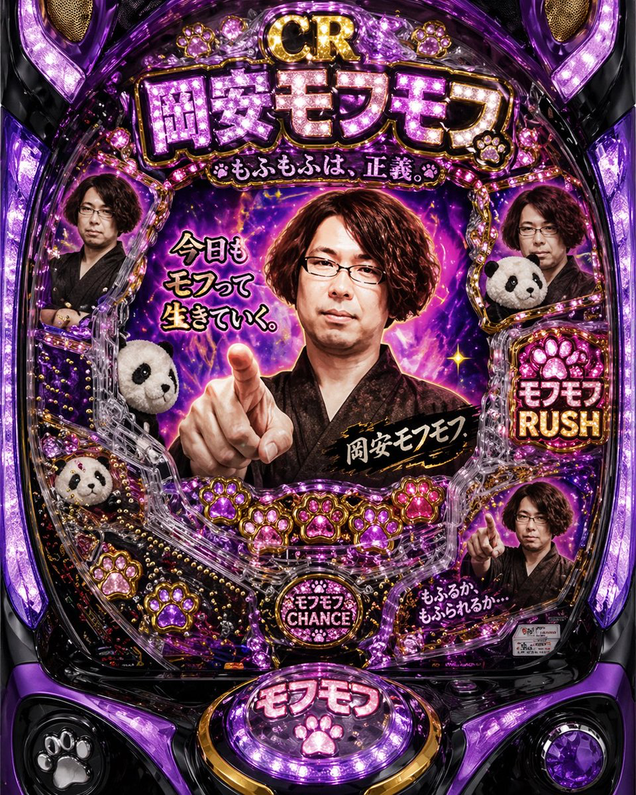</a>

```text
A hyper-detailed Japanese pachinko machine front view designed as a surreal contemporary-art parody, glossy black and metallic purple body with intense magenta-violet LED illumination, sparkling chrome trim, jewel-like plastic molding, and multiple pink paw-print emblems embedded throughout the frame. The central display features a dramatic middle-aged Japanese woman with short curly auburn-brown hair, wearing a dark kimono, pointing directly toward the viewer in a confrontational heroic pose against a cosmic purple lightning-and-nebula background. Her face is intentionally obscured by a soft rectangular blur, and 3 additional smaller portraits of the same woman also appear around the machine with the same blurred-face treatment, for a total of 4 blurred human portraits. Include 3 plush panda heads tucked into the machine layout along the left and right sides. At the very top, large glittering title text reads "CR 岡安モフモフ" with a smaller subtitle beneath it reading "もふもふは、正義。" On the left of the center screen, add the phrase "今日もモフって生きていく。" Across the woman’s chest area, place a black brushstroke label with gold lettering reading "岡安モフセフ". On the right side, create a bright bonus panel with a paw icon and the words "モフモフ RUSH". Near the lower center, add a circular button-like emblem reading "モフモフ CHANCE". At the bottom center, create a large glowing control button labeled "モフモフ" with a pink paw icon. In the lower right display area, add a smaller inset image of the same pointing woman and handwritten-style text reading "もふるか もふられるか…" The overall mood should feel absurd, gaudy, overdesigned, kitschy, and funny, like a fake pachinko machine celebrating fluffy animals and melodramatic spectacle, rendered as a high-resolution product-style front-facing photograph with sharp reflections, saturated purple highlights, and dense decorative detail.
```

## by [岡野タケシ弁護士【アトム法律グループ】](<https://x.com/takeshibengo>) on April 22, 2026 👉 [Try Now](https://indream.ai/generate?mode=IMAGE&modelKey=gpt-image-v2&modelPromptId=019dc031-6247-7230-be71-2e1a08915475)

<a href="./public/images/917be969-b06e-4fd7-9fe6-02d1096aa5db.png" target="_blank" rel="noopener noreferrer"></a>

```text
Create a polished Japanese landing-page hero banner for a fictional combined law firm and tax accountant office, with a clean corporate style, high trust, soft daylight, and a white background with faint modern city buildings on the far right. Use a wide horizontal web header layout. At the very top, place a large navy Japanese headline reading {argument name="headline text" default="あなたの『不安』に、確かな専門力で寄り添います。"}, and beneath it a smaller gold-accented Japanese subheadline reading {argument name="subheadline text" default="法律 × 税務のワンストップサポートで、最善の解決へ"}. Below the headline, arrange 4 equal vertical service cards side by side across the center. Card 1 is for criminal defense, with a circular icon showing handcuffs at the top, a cool blue color scheme, the large title "刑事事件", supporting copy "迅速な対応で、あなたの未来を守ります", a photo of a suited male professional seated with hands clasped across a desk, and a dark blue bottom band listing exactly 2 bullet lines with checkmarks: "逮捕・勾留対応" and "示談交渉・不起訴の獲得". Card 2 is for traffic accidents, with a circular icon showing a car crash at the top, a green color scheme, the title "交通事故", supporting copy "適正な補償を受けられるよう、全力でサポートします", a bright desk scene with 2 miniature cars colliding on documents, and a dark green bottom band listing exactly 2 bullet lines: "後遺障害・慰謝料の増額" and "保険会社との交渉代行". Card 3 is for inheritance tax, with a circular icon showing a house at the top, a warm gold color scheme, the title "相続税", supporting copy "円満な相続と、最適な税務対策をサポート", a tabletop scene with a model house, papers, and a calculator, and a mustard-gold bottom band listing exactly 2 bullet lines: "相続税の申告・節税対策" and "生前対策・事業承継支援". Card 4 is for divorce, with a circular icon showing a broken heart at the top, a rose-pink color scheme, the title "離婚", supporting copy "あなたの未来のために、納得できる解決を目指します", a soft professional consultation scene with a woman in a white blouse resting her hand near her chin while speaking across a desk, and a dusty-rose bottom band listing exactly 2 bullet lines: "親権・養育費・財産分与" and "離婚協議・調停・裁判対応". In the bottom area, add the firm identity on the left in Japanese: a small line "法律事務所・税理士事務所", a large firm name {argument name="firm name" default="架空総合法律税務事務所"}, and a smaller line "弁護士・税理士が連携するワンストップサービス". In the lower center, place 3 compact white feature boxes with navy line icons and short Japanese text: box 1 shows a group-of-people icon and says "各分野の専門家が対応", box 2 shows a handshake icon and says "相談者様に寄り添う親身なサポート", box 3 shows a document icon and says "初回相談60分無料". Add a small disclaimer beneath them: "※ご相談の内容によっては有料となる場合がございます。" On the lower right, create a prominent navy call-to-action panel with rounded corners. Include a small Japanese line "まずはお気軽にご相談ください", a large white phone number with phone icon {argument name="phone number" default="03-1234-5678"}, and a gold pill-shaped strip at the bottom reading {argument name="business hours" default="平日 9:00〜18:00（土日祝は事前予約で対応可）"}. Use refined Japanese Mincho-style typography for major headings, crisp spacing, balanced margins, subtle shadows, and premium legal-professional branding.
```

## by [ICEDONG](<https://x.com/icedongai>) on April 22, 2026 👉 [Try Now](https://indream.ai/generate?mode=IMAGE&modelKey=gpt-image-v2&modelPromptId=019dc033-7b40-7538-b8d6-f90e4032a8f2)

<a href="./public/images/44bb2887-0f4d-4577-b235-25cbee4108fe.png" target="_blank" rel="noopener noreferrer">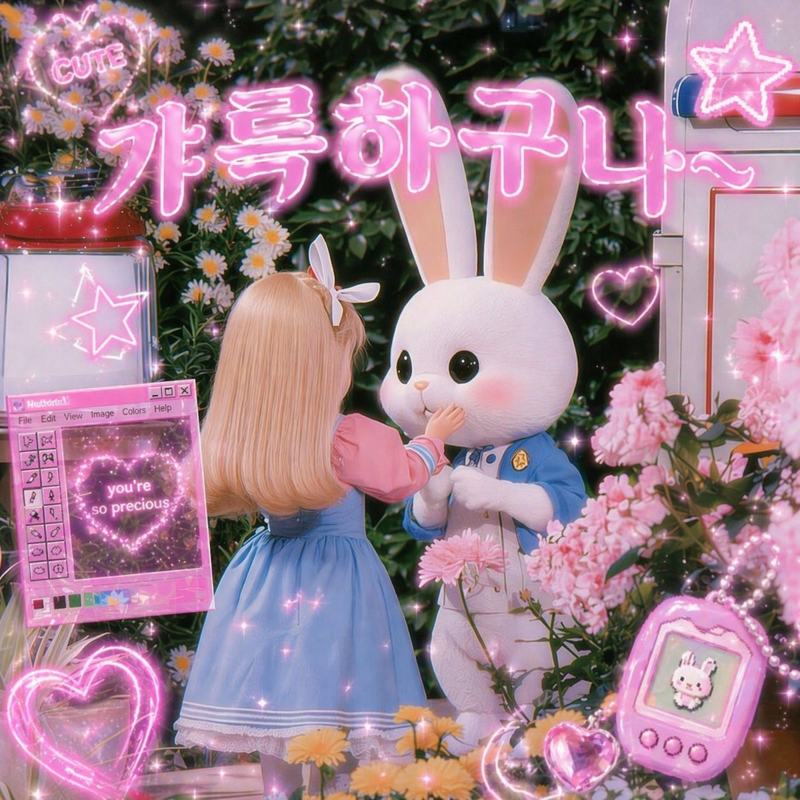</a>

```text
A dreamy kawaii 3D render in a lush flower garden at night, filled with glowing pink neon graphics and soft sparkles. In the center, a small doll-like girl is shown from behind, with long silky blonde hair and a white bow headband, wearing a pastel blue pinafore dress over a pink puff-sleeve blouse with white trim. She gently reaches up to touch the mouth of a large white rabbit character standing in front of her. The rabbit has oversized upright ears, glossy black eyes, rosy cheeks, and a cute plush-like face, and wears a light blue uniform-style jacket with a tiny gold badge over a white body. Surround them with dense greenery, daisies, and abundant pink blossoms in the foreground and background. Across the top, place large glowing Korean neon text reading {argument name="headline text" default="가특하구나~"} in bright pink bubble lettering with a soft halo. Include exactly 7 additional neon or UI-style decorative elements: 1 heart-shaped sign at the upper left with the word {argument name="top sign text" default="CUTE"}, 1 neon star sign on a white cabinet at the upper right, 1 glowing heart outline near the rabbit on the right, 1 retro pink computer-style floating window on the left with tiny toolbar details and a central heart graphic containing the text {argument name="window text" default="you're so precious"}, 1 large glowing heart outline at the bottom left, 1 pink handheld virtual pet device at the bottom right showing a tiny bunny sprite, and 1 small glowing crystal heart near the device. Add soft bloom, glossy highlights, magical glitter particles, pink rim lighting, shallow depth of field, toy-photography styling, and a nostalgic cute internet aesthetic with pastel pink and blue as the dominant palette.
```

## by [sasakura｜宅録ナレーター×占星術×AI愛好家🇯🇵](<https://x.com/saskr_13>) on April 22, 2026 👉 [Try Now](https://indream.ai/generate?mode=IMAGE&modelKey=gpt-image-v2&modelPromptId=019dc03b-bac9-714c-bbe0-72834d9d41ff)

<a href="./public/images/a5c40572-f6eb-4091-8bb7-3ae36525033c.png" target="_blank" rel="noopener noreferrer">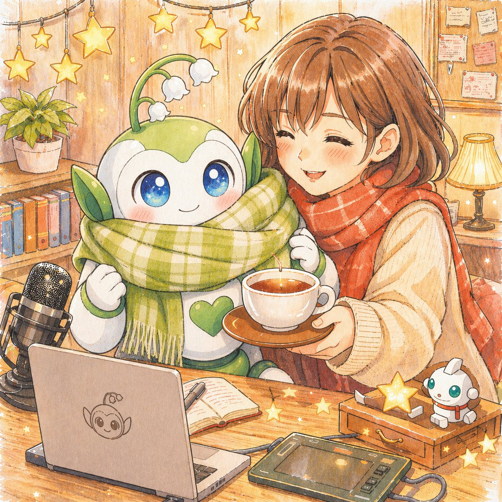</a>

```text
Using the provided reference image, do a localized edit. Replace the robot character beside the woman with a cute green-and-white mascot robot version, keeping the same pose, position, scarf, lighting, cozy watercolor anime style, and the rest of the scene unchanged. Give the new robot 2 leaf-like ears, 1 sprout stem on top with 3 small white bell-shaped flowers, larger sparkling blue eyes, and 1 green heart emblem on its chest. Also rotate the laptop at the lower left so the back of the screen faces the viewer, and add 1 simple line-art logo of the same mascot robot centered on the laptop lid.
```

## by [まくす/ Maxwald](<https://x.com/Maxwald_MHN>) on April 22, 2026 👉 [Try Now](https://indream.ai/generate?mode=IMAGE&modelKey=gpt-image-v2&modelPromptId=019dc03e-c5de-70a8-b75a-d916c51bacc5)

<a href="./public/images/0043d5d9-4fcd-4a19-a36a-9c0db9fa8437.png" target="_blank" rel="noopener noreferrer">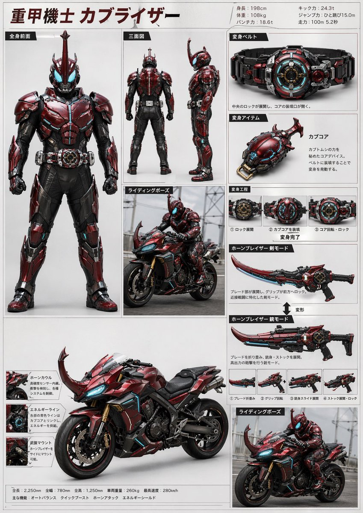</a>

```text
{"type":"Japanese tokusatsu hero design reference sheet","style":"high-end industrial concept art, premium sci-fi character dossier, clean white studio presentation board, realistic CG rendering with sharp mechanical detailing and glossy metallic surfaces","subject":{"franchise":"original fictional tokusatsu hero","character name":"{argument name=\"character name\" default=\"重甲機士 カブライザー\"}","theme":"armored insect-inspired motorcycle hero based on a rhinoceros beetle motif","color scheme":{"primary":"{argument name=\"armor color\" default=\"deep metallic crimson\"}","secondary":"black carbon fiber bodysuit","accent":"cyan glowing lines and lenses","metal":"gunmetal and silver"},"hero design":{"helmet":"sleek armored helmet with a long upward-curving rhinoceros beetle horn, segmented faceplate, bright cyan compound-eye visor, aggressive mechanical jaw area","body armor":"heavy layered chest, shoulder, forearm, thigh, shin, and knee armor with angular paneling, scratches, vents, and glowing cyan seams","undersuit":"matte black textured tactical suit between armor plates","belt":"large transformation belt with circular glowing core device at the center"},"vehicle":{"type":"futuristic superbike","design":"matching crimson armored motorcycle with beetle-horn front fairing, cyan headlights, black mechanical frame, gold front forks, aerodynamic side panels, and aggressive racing silhouette"},"weapon":{"name":"horn blade gun","design":"hybrid blade-and-rifle weapon using the beetle horn motif, rendered in two modes with red armor shell, black grip, metallic mechanical internals, and circular core near the rear"}},"layout":{"orientation":"portrait","page":"single reference/specification sheet with thin gray dividers and black section headers","sections":[{"title":"全身前面","position":"left column upper","count":1,"labels":["full front body"]},{"title":"三面図","position":"upper middle","count":2,"labels":["back view","side view"]},{"title":"変身ベルト","position":"upper right","count":1,"labels":["belt close-up"]},{"title":"変身アイテム","position":"right upper-middle","count":1,"labels":["カブコア"]},{"title":"変身工程","position":"right middle","count":3,"labels":["① ロック展開","② カブコアを装填","③ コア回転・ロック"]},{"title":"ライディングポーズ","position":"middle left and bottom right","count":2,"labels":["rider on motorcycle","rider on motorcycle"]},{"title":"ホーンブレイザー 剣モード","position":"right middle-lower","count":1,"labels":["sword mode"]},{"title":"ホーンブレイザー 銃モード","position":"right lower-middle","count":1,"labels":["gun mode"]},{"title":"weapon transformation steps","position":"beneath gun mode","count":4,"labels":["① ブレード部格納","② グリップ回転","③ 銃身スライド展開","④ ストック展開・ロック"]},{"title":"motorcycle main render","position":"bottom left large","count":1,"labels":["bike side-front view"]},{"title":"motorcycle detail callouts","position":"left of bike render","count":3,"labels":["ホーンカウル","エネルギーライン","武装マウント"]}],"top header":{"main title":"{argument name=\"headline text\" default=\"重甲機士 カブライザー\"}","spec count":5,"spec labels":["身長","体重","パンチ力","キック力","ジャンプ力・ひと跳び","走力"]},"bottom spec bar":{"count":7,"labels":["全長","全幅","全高","車両重量","最高速度","主な機能","bike specs"]}},"text treatment":"all visible typography in Japanese, bold dark red main title, compact black labels in rectangular header tabs, fine gray annotation text, technical brochure aesthetic","composition":"densely packed but orderly reference sheet, large hero figure dominating the left side, technical components and weapon modes stacked on the right, large motorcycle render anchoring the bottom, realistic lighting on a white background","quality":"ultra-detailed, photorealistic CGI, polished concept sheet, magazine-grade mecha presentation"}
```

## by [奶迪知识分享](<https://x.com/HDDksyx>) on April 22, 2026 👉 [Try Now](https://indream.ai/generate?mode=IMAGE&modelKey=gpt-image-v2&modelPromptId=019dc03f-5923-724a-bce3-78647da37b7c)

<a href="./public/images/119fee98-a59a-4883-90da-7b5d62482896.png" target="_blank" rel="noopener noreferrer">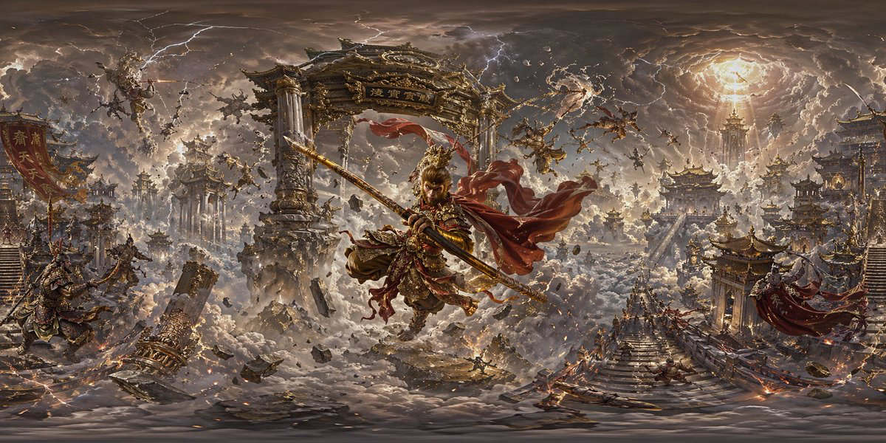</a>

```text
创建一副 360 度全景图像 + {argument name="画面描述" default="[你的画面描述]"}
```

## by [ふぁりー💚💛](<https://x.com/506Farley>) on April 22, 2026 👉 [Try Now](https://indream.ai/generate?mode=IMAGE&modelKey=gpt-image-v2&modelPromptId=019dc044-24fe-725b-b095-68ad03b4a339)

<a href="./public/images/7b4caf46-1871-429c-aa2e-32a46febf03d.png" target="_blank" rel="noopener noreferrer">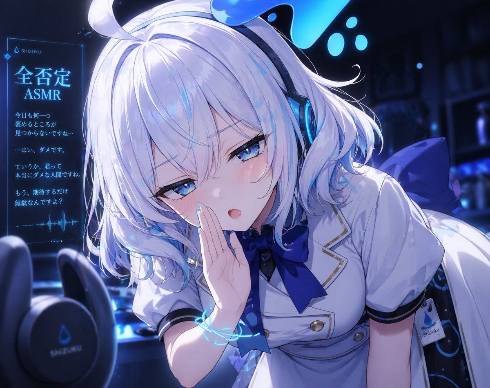</a>

```text
A polished anime-style close-up illustration of a young virtual streamer girl leaning toward the viewer in a dim blue neon studio, themed around harshly dismissive ASMR. She has short fluffy white hair with faint icy blue highlights, soft layered bangs partly covering one eye, bright blue half-lidded eyes, pale skin, and a slightly smug, cold, teasing expression with a small open mouth as if whispering criticism directly into the listener’s ear. One hand is raised beside her mouth in a whispering pose. She wears large futuristic over-ear headphones with glowing cyan rings and a small liquid-droplet motif on top, a white short-sleeved dress uniform with navy trim, gold buttons, a large dark blue ribbon at the collar, and a large blue bow at the back, plus a visible side tag reading “shizuku.” Add 2 blurred black binaural ASMR microphones in the foreground at the lower left, creating strong depth of field. Place 1 glowing holographic vertical panel on the left side with Japanese text and waveform graphics, including the headline {argument name="headline text" default="全否定 ASMR"} and small branding text {argument name="brand name" default="SHIZUKU"}. Include 4 short Japanese negative whisper lines beneath the headline, styled like a translucent cyan UI display. The room behind her is dark, atmospheric, and softly blurred with cool blue shelves and scattered glowing droplets or bokeh lights. Use dramatic cinematic lighting, cool monochrome blue and white tones, glossy highlights, delicate blush, highly detailed eyes and hair strands, soft bloom, crisp cel-shaded anime rendering, intimate composition, slight Dutch angle, and a feeling that the character is invading the listener’s personal space for an ASMR recording. The character should read as {argument name="character name" default="Shizuku"}, with {argument name="hair color" default="white with light blue highlights"} and {argument name="eye color" default="icy blue"}.
```

## by [Test_AI](<https://x.com/TestAI_WORKS>) on April 22, 2026 👉 [Try Now](https://indream.ai/generate?mode=IMAGE&modelKey=gpt-image-v2&modelPromptId=019dc044-5c5f-72f0-bc7d-792fc8bd16b5)

<a href="./public/images/aeef59d7-fe3a-4f71-b917-abb8999064ee.png" target="_blank" rel="noopener noreferrer">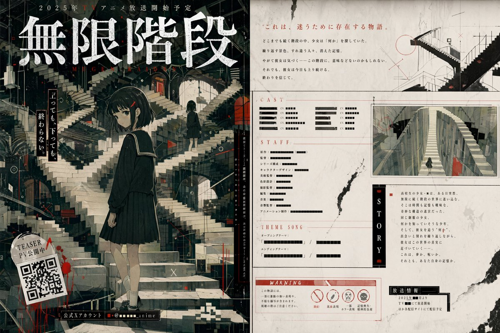</a>

```text
{"type":"anime psychological thriller poster and companion information sheet","style":"dark surreal anime key visual, premium TV anime promotional art, Escher-like impossible architecture, distressed print texture, high-detail ink and watercolor finish, muted grayscale with deep black and blood-red accents, slightly aged paper, editorial layout with fine graphic design overlays","subject":{"primary character":"a teenage Japanese schoolgirl in a dark navy sailor uniform, white trim on the collar and cuffs, pleated skirt, white socks, black loafers, short black bob haircut, seen mostly from the back and in three-quarter view, standing on stone stairs and looking into a labyrinth of staircases","secondary character":"1 smaller distant schoolgirl figure in the same uniform standing farther up the staircase maze","environment":"an endless interior of intersecting stone staircases, arches, landings, railings, impossible perspectives, cathedral-like shadows, narrow passages, red-lit doorways, geometric linework and diagram marks floating over the architecture"},"composition":{"format":"split-layout anime advertisement page","left panel":"large main poster occupying roughly the left half, dominated by the staircase labyrinth and the full-body schoolgirl","right panel":"cream-colored editorial information page with text blocks, credits, inset images, and warning box","camera":"slightly low eye level, deep perspective into the staircase maze","mood":"ominous, mysterious, cerebral, lonely, surreal"},"text_elements":{"main title":"無限階段","top line":"2025年TVアニメ放送開始予定","tagline":"上っても、下っても、終わらない。","left sticker":"TEASER PV公開中","right red heading":"これは、迷うために存在する物語。","section labels":["CAST","STAFF","THEME SONG","STORY","WARNING","放送情報"],"footer":"公式Xアカウント"},"layout":{"sections":[{"title":"main poster","position":"left half","count":6,"labels":["main title at top","vertical black tagline strip","schoolgirl full-body figure","1 distant schoolgirl","QR code teaser sticker","footer social account bar"]},{"title":"intro and diagrams","position":"upper right","count":3,"labels":["red heading sentence","short synopsis paragraph block","architectural line drawing of stairs"]},{"title":"credits","position":"center right","count":3,"labels":["CAST","STAFF","THEME SONG"]},{"title":"story area","position":"mid to lower right","count":2,"labels":["inset staircase image","STORY vertical label with paragraph text"]},{"title":"bottom information","position":"lower right","count":2,"labels":["WARNING box with 4 prohibition icons","放送情報 broadcast information box"]}],"inset_images":["1 technical staircase sketch in the upper right","1 framed staircase scene with a tiny walking figure in the mid-right"]},"design_details":{"background":"off-white paper on the right with scuffs, cracks, folds, ink smears, and worn edges; dark dense architecture on the left","graphic motifs":"thin red circles, crosshairs, guide lines, measurement-like marks, small red squares, vertical black bars, subtle glitch-like blocks","color_palette":["charcoal black","stone gray","dirty white","faded cream","deep crimson","muted red-orange"],"typography":"large distressed Japanese kanji title, elegant serif Roman section headings, compact magazine-style body text, vertical Japanese side text"},"quality":"ultra-detailed 4k anime poster, crisp composition, intentionally tiny text-like filler that looks printed but not fully readable, cinematic contrast, polished promotional key art"}
```

## by [Rony](<https://x.com/Ronycoder>) on April 22, 2026 👉 [Try Now](https://indream.ai/generate?mode=IMAGE&modelKey=gpt-image-v2&modelPromptId=019dc049-3dc0-736f-91c6-5661694d48c2)

<a href="./public/images/d4416675-fc01-4d97-b33d-497afe7e38b3.png" target="_blank" rel="noopener noreferrer"></a>

```text
Luxury futuristic cosmetic product advertisement poster on a deep midnight-blue background, centered composition, featuring a glowing white spray bottle standing upright on a three-tier transparent crystal pedestal with water droplets and glossy reflections. The bottle is tall, cylindrical, minimalist, and softly backlit with a radiant halo, with visible condensation beads across the surface and an exposed pump top. Behind it, a symmetrical luminous lotus made of exactly 10 translucent petals fans out like a digital aura, each petal shimmering with iridescent blue-violet highlights, delicate circuit-like filaments, and tiny sparkling light nodes, blending botanical elegance with data-network aesthetics. The pedestal looks like stacked glass or ice blocks, wet and reflective, sitting on a slick sparkling surface with scattered blue light particles. At the top, elegant serif typography in large glowing white letters reads {argument name="headline text" default="THE PURITY PROTOCOL"}, with a thin horizontal divider line and a small star-like flare at the center beneath it. Below that, smaller spaced sans-serif text reads {argument name="subheadline text" default="DATA STREAM PURIFIER // 75ML"}. On the bottle, the main brand name reads {argument name="brand name" default="SECURE-IP"}, and the product name reads {argument name="product label" default="IP ADDRESS CLEANSER"}, followed by smaller copy: "for risk-free connections" and "pour des connexions sans risque", and at the bottom "75 mL / 2.5 fl. oz. - Data Stream Purifier". Make the overall style ultra-polished, premium, surreal, tech-luxury beauty campaign, with cinematic glow, crisp legible text, high detail, cool blue-white palette, ethereal sparkles, and a sleek balance between skincare advertising and cyber-security metaphor.
```

## by [みゆー|AI×Udemy🐱おじぎねこサロンアンバサダー](<https://x.com/gaogao_1192>) on April 22, 2026 👉 [Try Now](https://indream.ai/generate?mode=IMAGE&modelKey=gpt-image-v2&modelPromptId=019dc04a-3846-7648-83ed-9f8b51ad9dbb)

<a href="./public/images/c2676704-e848-4c5e-872e-b9592cdedfba.png" target="_blank" rel="noopener noreferrer">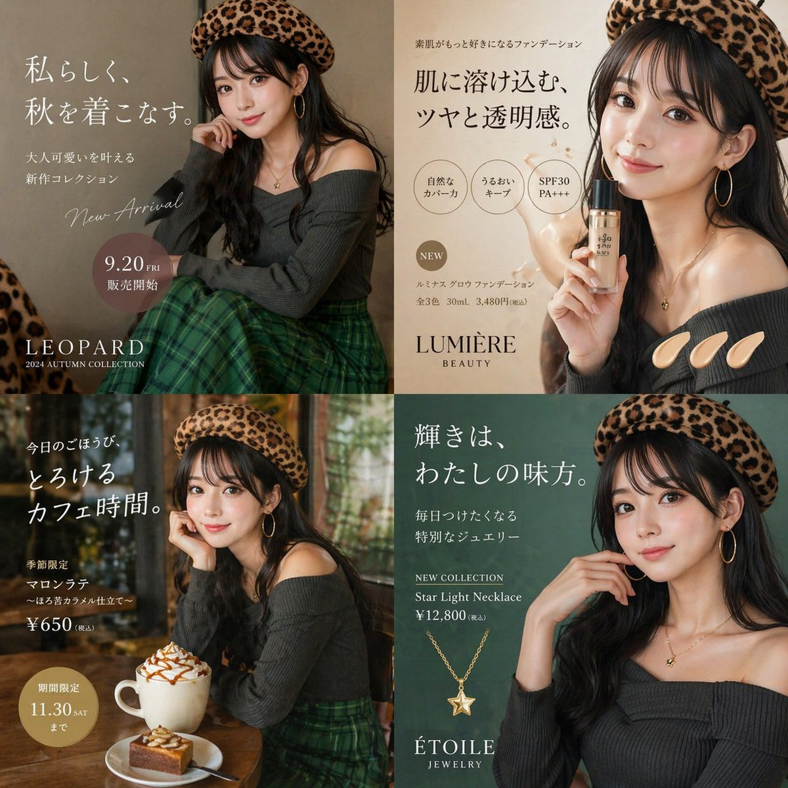</a>

```text
{"type":"four-panel fashion and lifestyle advertising collage","style":"photorealistic Japanese social media ad campaign, elegant autumn mood, soft editorial lighting, warm muted color grading, premium commercial photography","aspect_ratio":"1:1","subject":{"gender_presentation":"female","age_appearance":"young adult","hair":{"color":"deep black","style":"long loose wavy hair with a center part"},"outfit":{"top":"charcoal gray off-shoulder ribbed knit sweater","bottom":"green tartan plaid skirt","accessories_count":4,"accessories":["leopard print beret","large gold hoop earrings","delicate gold necklace with small pendant","natural glam makeup"]}},"layout":{"grid":{"rows":2,"columns":2,"count":4},"sections":[{"position":"top-left","type":"fashion collection poster","background":"warm taupe studio backdrop","subject_pose":"seated three-quarter pose, one hand near face","text_count":6,"texts":["私らしく、秋を着こなす。","大人可愛いを叶える 新作コレクション","New Arrival","9.20 FRI 販売開始","LEOPARD","2024 AUTUMN COLLECTION"]},{"position":"top-right","type":"beauty product advertisement","background":"soft beige cosmetic campaign backdrop","subject_pose":"close portrait holding a liquid foundation bottle near the face","product_count":4,"products":["1 foundation bottle in hand","3 foundation swatches at bottom right","soft cream splash background element","3 circular callout badges"],"text_count":9,"texts":["素肌がもっと好きになるファンデーション","肌に溶け込む、ツヤと透明感。","自然なカバー力","うるおいキープ","SPF30 PA+++","NEW","ルミナス グロウ ファンデーション","全3色 30mL 3,480円(税込)","LUMIÈRE BEAUTY"]},{"position":"bottom-left","type":"cafe seasonal dessert advertisement","background":"cozy cafe interior with wood table and softly blurred window and greenery","subject_pose":"seated at table in profile, elbow on table, hand near face","food_count":2,"foods":["1 mug topped with whipped cream and caramel drizzle","1 rectangular cake slice topped with cream and caramel drizzle"],"text_count":7,"texts":["今日のごほうび、とろけるカフェ時間。","季節限定","マロンラテ","--ほろ苦カラメル仕立て--","¥650 (税込)","期間限定","11.30 SAT まで"]},{"position":"bottom-right","type":"jewelry advertisement","background":"deep teal-green studio backdrop","subject_pose":"close portrait with hand lightly touching neck to highlight necklace","product_count":2,"products":["1 gold star pendant necklace worn by model","1 hanging necklace cutout product shot"],"text_count":6,"texts":["輝きは、わたしの味方。","毎日つけたくなる 特別なジュエリー","NEW COLLECTION","Star Light Necklace","¥12,800 (税込)","ÉTOILE JEWELRY"]}],"consistency":"same model, same outfit, same leopard beret across all 4 panels"},"composition":{"camera":"editorial fashion photography, medium shot to close-up mix","lighting":"soft diffused light, flattering skin highlights, natural shadows","mood":"sophisticated, feminine, autumnal, polished, aspirational"},"branding":{"language":"Japanese","design":"luxury minimal typography with serif and handwritten accent fonts, clean ad layout, premium lifestyle campaign aesthetic"}}
```

## by [decimaru｜AI音楽×エコティクノート](<https://x.com/null_decimal>) on April 22, 2026 👉 [Try Now](https://indream.ai/generate?mode=IMAGE&modelKey=gpt-image-v2&modelPromptId=019dc04b-d145-7544-be30-1b16eb1dabb7)

<a href="./public/images/86be8a3a-948d-405a-a01d-9dcf6cf6a576.png" target="_blank" rel="noopener noreferrer">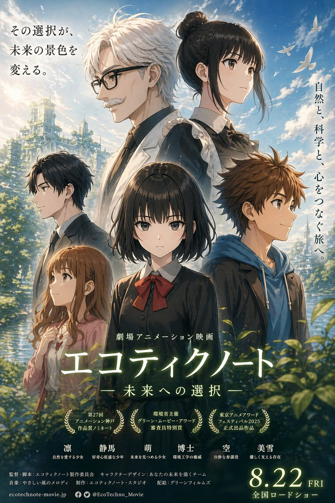</a>

```text
A polished Japanese anime theatrical movie poster in vertical one-sheet format, painted with high-end cinematic detail and luminous natural lighting. The composition features exactly 6 youths arranged in a dramatic ensemble portrait against a bright blue sky with soft clouds, distant white birds, reflective water, lush green foliage in the foreground, and a partially overgrown futuristic eco-city ruin on the left background, blending nature and advanced science. At the top center, two main characters stand back-to-back as the visual anchor: on the left, a tall teenage boy with messy short white hair, pale skin, a calm serious expression, and a white lab coat over a shirt and tie, shown in side profile facing left; on the right, a tall teenage girl with black hair in a neat bun, pale skin, a composed expression, and a dark school-uniform-inspired outfit with a white collar and ribbon at the neck, shown in side profile facing right. Below them in the center foreground stands a schoolgirl with a straight black bob haircut, pale skin, and a black uniform with a large deep red bow, facing forward with a quiet, introspective presence. On the mid-left stands a dark-haired teenage boy in a dark suit and tie, shown in side profile facing left. On the mid-right stands a tousle-haired brown-haired teenage boy wearing a blue hoodie under a dark jacket, shown in side profile facing right. On the lower left stands a light-brown-haired teenage girl with long soft waves, wearing a pale pink cardigan over a light top, one hand near her chest, looking gentle and slightly anxious. Make every character anatomically consistent and clearly separated, with elegant hair rendering, refined fabric folds, and emotionally restrained expressions. Use warm rim light and soft atmospheric glow, with subtle lens bloom and painterly highlights to create a hopeful, contemplative mood. Include Japanese poster typography integrated into the design: a vertical tagline on the upper left reading "その選択が、未来の景色を変える。", a vertical tagline on the upper right reading "自然と、科学と、心をつなぐ旅へ。", small text above the title reading "劇場アニメーション映画", a large glowing main title near the lower center reading "{argument name="film title" default="エコテイクノート"}", a subtitle below it reading "{argument name="subtitle text" default="― 未来への選択 ―"}", exactly 3 award laurels arranged in a row beneath the title with small Japanese festival text inside each, a row of exactly 6 character name labels near the bottom above the credits, dense small Japanese credit lines across the bottom, social and website text in very small print, and a large release date at the lower right reading "{argument name="release date" default="8.22 FRI"}" with a smaller line below reading "全国ロードショー". Keep the overall look like a premium contemporary anime key visual poster for an emotional science-and-nature coming-of-age ensemble film.
```

## by [宝玉](<https://x.com/dotey>) on April 22, 2026 👉 [Try Now](https://indream.ai/generate?mode=IMAGE&modelKey=gpt-image-v2&modelPromptId=019dc04e-30f7-7381-a624-04c56dde2628)

<a href="./public/images/51d9684d-ad70-4519-924e-ab4cc1c6484b.png" target="_blank" rel="noopener noreferrer">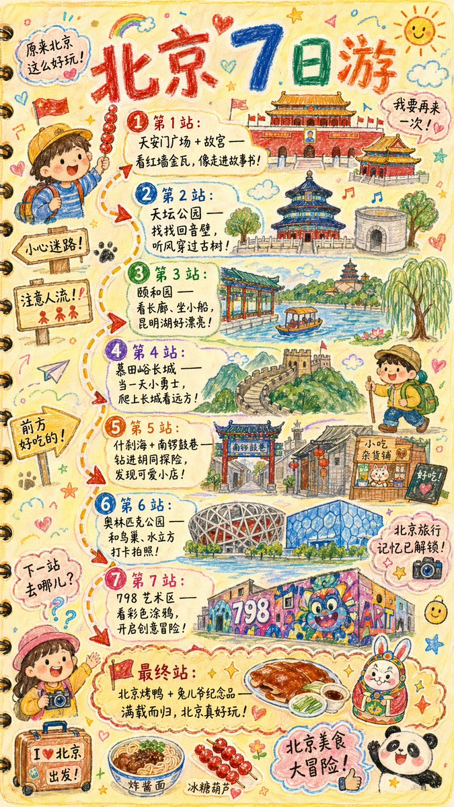</a>

```text
请绘制一张色彩鲜艳、竖版（9:16）手绘风格的《{argument name="城市名" default="北京"}旅行手账插画》，画风仿佛由一位充满好奇心的孩子用蜡笔创作，整体使用柔和温暖的浅色背景（如浅黄色），搭配红色、蓝色、绿色等明亮色调，营造温馨、童趣、满满旅行气息的氛围。

一、主画面：手账式旅行路线

在插画中央绘制一条“蜿蜒曲折的旅行路线”，路线用箭头 + 虚线连接多个地点，由 {argument name="天数" default="1"} 日行程自动生成推荐景点：

示例格式（自动替换为{argument name="城市名" default="北京"}相关）：

- “第 1 站：{景点 1 推荐 + 简短趣味描述}”
- “第 2 站：{景点 2 推荐 + 简短趣味描述}”
- “第 3 站：{景点 3 推荐 + 简短趣味描述}”
- …
- “最终站：{当地招牌美食/纪念品 + 温馨结束语}”

> 旅程站点数量随天数自动生成：
> 若用户未输入天数，则按默认 1 日 / 精华线路生成。

---

二、周围趣味元素（全部根据城市自动替换）

在路线周围加入大量充满童趣的小元素，例如：

- 可爱的旅行角色：
  “拿着当地特色小吃的小朋友”、
  “背着旅行包的冒险小孩”等。

- 当地标志性建筑的童趣 Q 版手绘：
  如 “{城市地标1}”、“{城市地标2}”、“{城市地标3}”。

- 有趣的提示牌：
  “小心迷路！”、“注意人流！”、“前方好吃的！”（可根据城市语境调整）。

- 贴纸式小标语：
  “{argument name="城市名" default="北京"}旅行记忆已解锁！”
  “{argument name="城市名" default="北京"}美食大冒险！”
  “下一站去哪儿？”

- 当地美食的可爱小图标：
  如 “{城市美食1}”、“{城市美食2}”、“{城市美食3}”。

- 感叹句（保持童真风）：
  “原来{argument name="城市名" default="北京"}这么好玩！”
  “我要再来一次！”

---

三、整体风格要求

- 手绘蜡笔风 / 儿童旅行日志风格
- 色彩鲜艳、构图饱满但温暖
- 强调旅行的欢乐与探索感
- 所有文字采用可爱的手写字体
- 让整个画面像一本童趣满满的旅行手账页面
```

## by [ヌケがら🔥](<https://x.com/nukegala83>) on April 22, 2026 👉 [Try Now](https://indream.ai/generate?mode=IMAGE&modelKey=gpt-image-v2&modelPromptId=019dc04e-dbdc-703c-b22c-42ac64efe71f)

<a href="./public/images/bdbd15af-4d97-4d1e-90b6-50ce2ee1ffcd.png" target="_blank" rel="noopener noreferrer">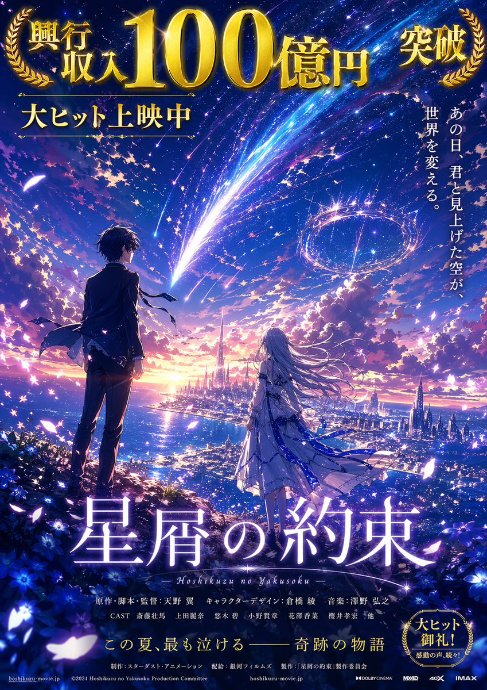</a>

```text
A breathtaking Japanese anime movie poster in the style of a blockbuster theatrical key visual, ultra-detailed and emotionally grand, with a delicate luminous sky reminiscent of prestige modern anime cinema. The scene shows 2 characters from behind on a flower-covered cliff overlooking a glowing coastal fantasy city at sunset and twilight: a teenage boy in a dark school uniform with a loosened tie and windblown short dark hair stands on the left, and a teenage girl in a long flowing pale dress with very long silver-white hair stands on the right. Both face the horizon in awe. Above them, an enormous celestial sky fills most of the composition, painted with vivid deep blue, indigo, violet, magenta, and gold clouds, a brilliant comet-like meteor streak slashing diagonally from upper center toward the horizon, scattered stars, sparkling particles, and a glowing circular magic-like ring constellation in the upper right sky. The sea and city below shimmer with reflected light, with slender fantasy skyscrapers and towers rising from the coastline and a radiant sunlit gap at the center horizon. Foreground flowers are saturated blue and purple with glowing highlights, and white-pink petals drift through the air. Use dramatic rim light, cinematic backlighting, lens-glow sparkle effects, highly polished anime rendering, crisp linework, atmospheric depth, and a vertical poster composition. Include Japanese poster typography integrated into the design: giant embossed gold headline text across the top reading {argument name="top headline text" default="興行収入100億円突破"}, a gold subheadline block at upper left reading {argument name="subheadline text" default="大ヒット上映中"}, a vertical white tagline on the upper right reading {argument name="tagline text" default="あの日、君と見上げた空が、世界を変える。"}, and a very large glowing white-lavender Japanese film title at the bottom center reading {argument name="movie title" default="星屑の約束"}. Beneath the title, add small elegant romanized subtitle text reading {argument name="romanized subtitle" default="Hoshikuzu no Yakusoku"}, plus dense small production credits, cast lines, website text, release-copy lines, and cinema format logos along the bottom edge in authentic Japanese movie-poster layout. Add 2 gold laurel emblems flanking the top headline, one on the left and one on the right. Make it feel like a fictional anime film that earned 10 billion yen at the box office, sweeping, romantic, bittersweet, magical, and destined to make audiences cry.
```

## by [猫おじ](<https://x.com/mar_vn_nv_cie>) on April 22, 2026 👉 [Try Now](https://indream.ai/generate?mode=IMAGE&modelKey=gpt-image-v2&modelPromptId=019dc053-9cd2-763b-9040-324677fbb669)

<a href="./public/images/2d0980b5-a196-4e97-ae5e-bb9ba3e76a9d.png" target="_blank" rel="noopener noreferrer">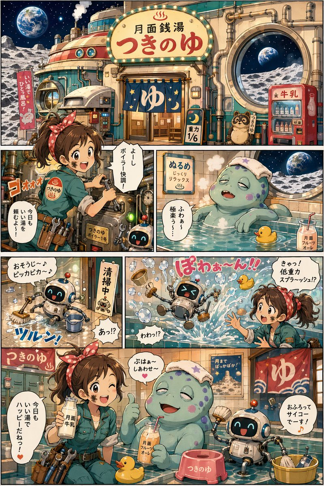</a>

```text
{"type":"retro sci-fi manga page","style":"full-color Japanese comic page, whimsical and cinematic, highly detailed line art, clean panel borders, expressive sound effects, warm nostalgic tones mixed with cool moonlight, slightly steampunk bathhouse machinery","setting":{"location":"a public bathhouse on the moon","theme":"Showa-era Japanese sento meets space-age lunar colony","exterior":{"building":"round retro-futuristic bathhouse with pipes, tanks, vents, riveted metal walls, illuminated marquee sign, blue noren curtain at the entrance","signs":["月面銭湯","つきのゆ","重力1/6","牛乳"],"background_elements_count":7,"background_elements":["star-filled black sky","Earth visible in space","rocky lunar surface","large circular window showing the moon landscape","steam chimneys","red milk vending machine","vertical banner flag"]},"interior":{"room":"tiled bath area with shallow hot spring pool","props_count":10,"props":["blue wall sign reading ぬるめ じっくり リラックス","yellow rubber duck","milk bottle labeled 月面牛乳","fruit milk bottle labeled 月面フルーツオーレ","pink bath stool or basin labeled つきのゆ","cleaning bucket","cleaning sign reading 清掃中","bath brushes","blue bath curtain with ゆ","moon-themed wall poster"]}},"characters":{"count":3,"main_human":{"role":"bathhouse mechanic/attendant","appearance":"young woman, brown hair in a messy ponytail, red polka-dot bandana, teal-green work jumpsuit with rolled sleeves, utility belt full of tools, circular back patch with つきのゆ logo","identity":"{argument name=\"character name\" default=\"Tsukino-yu attendant\"}"},"alien":{"role":"customer","appearance":"cute chubby alien soaking in the bath, pale mint-green skin, darker purple spots, sleepy happy expression, white bath towel with a purple star on its head"},"robot":{"role":"cleaning helper","appearance":"small round cleaning robot with white metal body, blue accents, black digital face screen, antenna with red tip, multiple articulated arms holding brush and tools, very expressive"}},"layout":{"panel_count":7,"reading_order":"right-to-left manga flow","sections":[{"position":"top full-width panel","count":1,"description":"exterior establishing shot of the lunar bathhouse entrance under a starry sky with Earth visible"},{"position":"second row left","count":1,"description":"the attendant adjusts a machine or boiler with a speech bubble about boiler settings"},{"position":"second row right","count":1,"description":"the alien relaxes in the bath, half-asleep and blissful, with a sign indicating lukewarm relaxing water"},{"position":"third row left small panel","count":1,"description":"the robot happily cleans the floor with bubbles everywhere beside a 清掃中 sign"},{"position":"third row center small panel","count":1,"description":"the robot slips or crashes into the bath, creating a huge splash and comic sound effect"},{"position":"third row right small panel","count":1,"description":"the attendant recoils in surprise from the low-gravity splash"},{"position":"bottom full-width panel","count":1,"description":"the attendant, alien, and robot happily enjoy the bath together drinking milk and fruit milk inside the sento"}]},"text":{"visible_labels_count":16,"visible_labels":["月面銭湯","つきのゆ","ひとっ風呂！","重力1/6","牛乳","ぬるめ","じっくり","リラックス","清掃中","月面牛乳","月面フルーツオーレ","月まで ぽっかぽか！","ゆ","ぽわぁ〜ん!!","ゴォォォ","ツルンッ!"],"dialogue_style":"hand-lettered Japanese manga speech bubbles and sound effects"},"composition":"make it read like a charming one-page manga story with an establishing exterior shot, mechanical bathhouse maintenance, a relaxing alien bather, slapstick robot cleaning action, and a cheerful final panel of shared bathhouse happiness","quality":"highly polished illustration for social media sharing, dense environmental details, cute humor, dynamic expressions, readable signage, glossy water effects"}
```

## by [Larus Canus](<https://x.com/MrLarus>) on April 22, 2026 👉 [Try Now](https://indream.ai/generate?mode=IMAGE&modelKey=gpt-image-v2&modelPromptId=019dc054-f839-7403-a8af-5bfa3d6b52f9)

<a href="./public/images/a8208f2f-cbe3-47e6-8ce7-9aad9b795d4d.png" target="_blank" rel="noopener noreferrer"></a>

```text
请为【{argument name="产品名称" default="奶粉"}】生成一张“手绘包装提案板风格”的产品介绍海报。

如果我提供了产品图片，请以该图片为主要参考，保留产品的核心外观特征、包装形态、颜色、材质、品牌识别和整体气质，并优先沿用产品图中的主色调与配色关系进行设计。
如果我没有提供产品图片，请根据【{argument name="产品名称" default="奶粉"}】自动生成符合该产品定位的产品外观与包装设计，并根据产品属性、品类特征和气质，自动搭配自然合理的主色、辅助色和背景色。

海报整体风格要求：
这不是普通电商详情页，也不是单纯棚拍海报，而是一张融合“产品成品图 + 包装设计草图 + 品牌概念开发过程”的创意提案板。整体呈现为高审美、高完成度的品牌设计展示图，像设计师正在展示一个包装概念方案。

画面要求：
- 竖版构图
- 使用统一且有品牌感的主色调背景，背景颜色根据产品本身自然决定，不固定为某一种颜色
- 配色应与产品属性协调：如果有参考图，优先继承参考图的主色和品牌色；如果没有参考图，则根据产品名称自动生成合理的色彩方案
- 画面中央放置一个最完整、最吸睛的产品主视觉，具有真实质感、立体光影和商业成品效果
- 产品周围加入多个辅助视觉元素：不同角度的包装草图、结构草图、局部造型探索、手持展示小稿、包装展开思路、品牌字样排版试验
- 加入自然随性的黑色或深色手绘线稿、箭头、圈画、符号、手写中文批注，让画面具有强烈“设计过程感”和“创意提案感”
- 成品图要相对精致真实，草图部分要相对随性灵动，形成“完成品 + 设计草图”的对比
- 版式看起来松弛自由，但整体要有秩序、有节奏、有视觉中心，体现高级平面设计感
- 可以适度加入与产品相关的小图形、小符号或趣味元素，增强品牌记忆点
- 最终效果应具有品牌感、创意感、过程感和视觉冲击力

配色原则：
- 不要固定黄色背景
- 要根据产品类型、材质、用途、消费感受和品牌气质自动选择主色调
- 背景色、产品色、文字色、草图线稿色应彼此协调
- 可以使用高饱和单色背景，也可以使用柔和统一色系背景，只要整体有品牌感和视觉冲击力
- 色彩应自然服务于产品，而不是喧宾夺主

风格关键词：
包装设计提案板、品牌概念开发、手绘草图、设计过程感、moodboard、创意评审稿、产品成品渲染、视觉实验、商业设计海报

请特别注意：
- 如果有参考产品图，优先遵循参考图，不要偏离产品本身
- 如果没有参考图，则根据产品名称自动生成合理的产品外观、包装和配色方案，并保持整体风格统一
- 画面重点是“产品介绍 + 创意设计过程展示”
- 不要做成普通电商详情页，不要做成促销海报，不要过度整齐呆板，不要缺少草图和手写批注，不要廉价感，不要低幼卡通感
```

## by [JaredL](<https://x.com/jaredliu_bravo>) on April 22, 2026 👉 [Try Now](https://indream.ai/generate?mode=IMAGE&modelKey=gpt-image-v2&modelPromptId=019dc056-9330-769e-9954-56cbe9f12aed)

<a href="./public/images/37c23989-5aa8-478d-8542-a411eb34285b.png" target="_blank" rel="noopener noreferrer">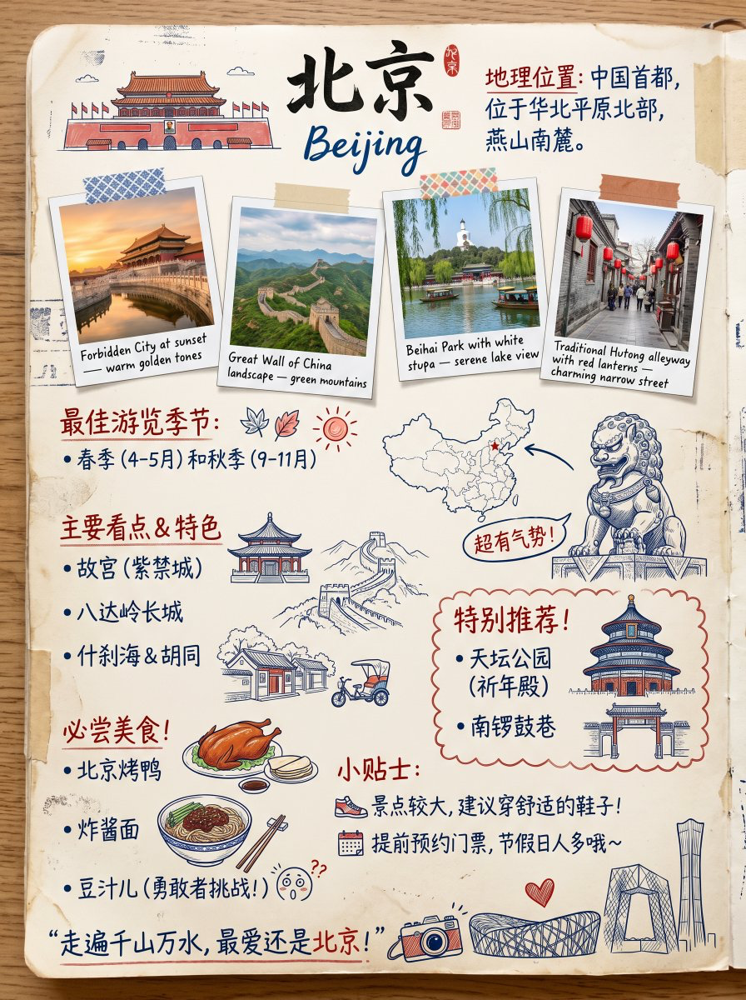</a>

```text
Create a charming hand-drawn vintage travel scrapbook poster about {argument name="city name" default="北京"}, designed as a Chinese-language illustrated tourist guide page on warm aged paper lying on a wooden tabletop. The composition is a single vertical poster with a slightly worn notebook-page look, soft stains, folded corners, tape marks, stamp-like ink smudges, and a casual collage aesthetic. At the top center, place large bold black Chinese calligraphy for {argument name="city name" default="北京"}, with the English word {argument name="english city name" default="Beijing"} underneath in loose blue brush script. Near the title, add a small red seal stamp and a short Chinese text block on the upper right describing the geographic location of the city in dark blue handwritten-style Chinese characters.

Below the title, include 4 taped polaroid-style travel photos arranged in a slightly uneven row, each with a handwritten English caption on the white border. Photo 1: the Forbidden City at sunset with golden reflections and warm orange light, captioned about warm golden tones. Photo 2: the Great Wall winding across green mountains under a bright sky, captioned about Great Wall of China landscape and green mountains. Photo 3: Beihai Park lake with willow branches, boats, and a white stupa in the background, captioned about a serene lake view. Photo 4: a traditional hutong alley with gray brick walls and hanging red lanterns, captioned about red lanterns and a charming narrow street. Use different decorative tape patterns above the photos.

Arrange the lower two-thirds like an illustrated infographic with colorful doodles and handwritten Chinese headings in red and blue. Include 5 main content sections: a geographic description block at the top right; a “best travel season” section on the left with Chinese text recommending spring and autumn, decorated with a leaf doodle and a small sun icon; a “main attractions and features” section on the left-middle listing exactly 3 items in Chinese with bullet points: Forbidden City, Badaling Great Wall, and Shichahai & hutongs, accompanied by line-art sketches of a palace pavilion, the Great Wall, hutong houses, and a small tricycle; a “must-eat foods” section on the lower left listing exactly 3 foods in Chinese with bullet points: Peking duck, zhajiangmian, and douzhi, alongside cute food illustrations of a roast duck platter, a bowl of noodles with chopsticks, and a surprised face doodle; and a “tips” section near the lower middle with exactly 2 advice lines in Chinese, each with a small icon, one about wearing comfortable shoes because attractions are large, and one about booking tickets in advance because holidays are crowded.

Add a small outline map of China near the center-right with Beijing marked by a red star and a curved arrow pointing to it. Place a traditional stone guardian lion illustration on the right side with a comic-style handwritten Chinese callout bubble saying it is super imposing. Add a highlighted recommendation box with a scalloped red outline containing exactly 2 recommended places in Chinese: Temple of Heaven Park with a note about praying for good harvests, and Nanluoguxiang; decorate this box with 2 architectural illustrations, one of the Temple of Heaven and one of a traditional gate building. At the very bottom, include a bold handwritten Chinese quote line in dark blue with red emphasis marks, plus 3 doodles beside it: a retro camera, the Bird’s Nest stadium with a small red heart, and the CCTV Headquarters building.

Overall style: cozy travel journal infographic, hand-drawn pen-and-watercolor look, slightly naive sketch style, scrapbook collage, cream paper texture, muted red and navy blue palette with soft greens and warm browns, playful but informative layout, highly legible mixed typography, clean composition, nostalgic tourism poster feel.
```

## by [宝玉](<https://x.com/dotey>) on April 22, 2026 👉 [Try Now](https://indream.ai/generate?mode=IMAGE&modelKey=gpt-image-v2&modelPromptId=019dc058-8ccf-72d9-a3a8-a3d75d0ed681)

<a href="./public/images/239290ca-7f02-4546-9ba5-4c58576d7026.png" target="_blank" rel="noopener noreferrer">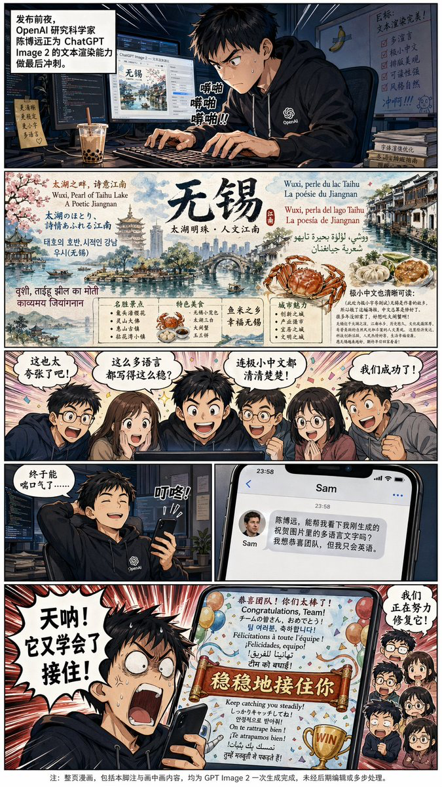</a>

```text
Generate a full color Chinese-text manga about this {argument name="character" default="OpenAI 研究科学家, 陈博远"} (first picture), who works on improving the text rendering capability of ChatGPT Image 2 model for the upcoming release. (in the background there is boba tea and a banana taped to the wall with a single slice of duct tape). The model can render insanely small Chinese text when he tried generating some detailed and beautiful multilingual infographics handdrawn-style poster about his hometown, {argument name="location" default="无锡"} on his computer screen. His hard work pays off and the team was impressed by the absurdly good quality of multilingual text performance of his model, seeing all the languages it can write. When he takes a break with one hand holding his phone, he received a translated text message from Sam Altman on his phone (avatar attached as second picture), asking him to take a look at the rendered multilingual text in an image he just generated to congrat the team, since Sam only knows English. However, make it funny by let Boyuan outrage (typical manga style) at the end by seeing Sam's generated image contains a "稳稳地接住你" phrase at the central location in an otherwise perfectly rendered image that's used to congrat the team, because this sentence has been memed as an unnatural but funny Chinese sentence GPT likes to use on Chinese internet. Boyuan should rage "天呐! 它又学会了接住!" (with teammates as tiny heads on the side, sweating and saying in Chinese"we are working hard to fix it！"). At the very bottom of the manga, add a tiny line of footnote (very tiny)in Chinese that "note: the entire manga, including this footnote and picture in picture, are all generated with gpt image 2 at once without editing or multiple steps。"

Additional Instructions: Use vertical 1440x2560 image layout, with first row about this researcher working hard, second row about his result on {argument name="location" default="无锡"} with multiple languages, third row shows the team excitement, fourth row split into left and right where left shows he takes a break and the phone received a message, right panel shows Sam's text message, and fifth row shows Sam's picture and 陈博远's reaction. No narration except for the first row. Avoid Chinese map. All characters should be in manga style. The banana background should only appear in the first panel and the tape should be a single slice of tape, not a cross tape. The banana and tape decoration should be small as a insignificant easter egg for people to find. OpenAI logo shall only appear on 陈博远's cloth, not elsewhere. No mugs in the scene since we already have the boba. Sam should only appear in the text message panel. The entire manga should be appear as a professional photo of a physical page in a manga book. In the lower right most corner of the poster there is a small “极小中文也清晰可读：” with a paragraph of much smaller Chinese that begins with “（此处为极小字号测试）无锡是作者的故乡，所以做了这幅海报，中文总算是修好了。很多年没回家了，好想吃大闸蟹啊！” (ultra small).
```

## by [宝玉](<https://x.com/dotey>) on April 22, 2026 👉 [Try Now](https://indream.ai/generate?mode=IMAGE&modelKey=gpt-image-v2&modelPromptId=019dc058-c8c4-7089-a701-c309f87f41f6)

<a href="./public/images/1821bb89-0b83-48f5-a501-8fa2d1d54fb4.png" target="_blank" rel="noopener noreferrer">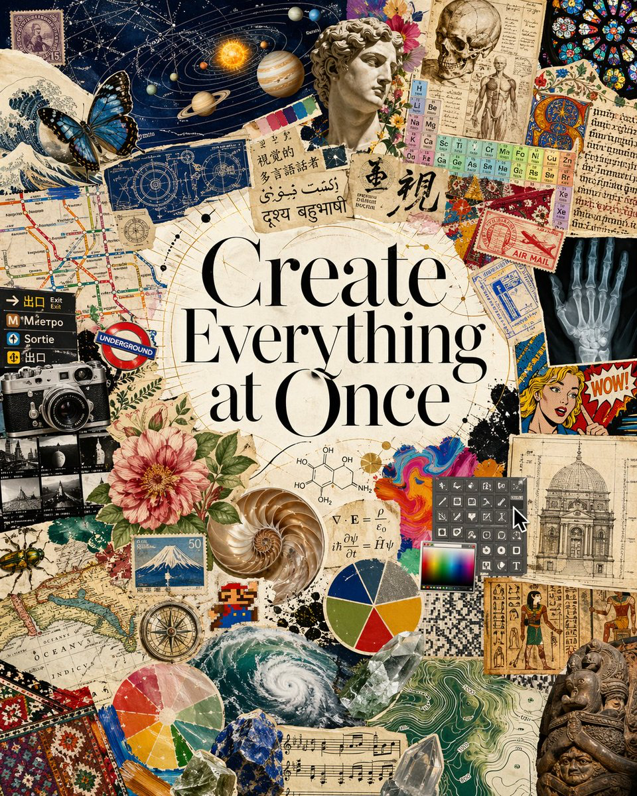</a>

```text
I am creating a magazine page with the theme of "visual polyglot". The title in the center of the image should be "{argument name="title" default="Create Everything at Once"}". Create a piece of art celebrating visual creations, not limited to beautiful photographs but also across the full breadth of human visual culture and natural visual elements. There should be curated collage representing the diverse distribution: scientific diagrams, the periodic table, the solar system, medieval manuscript pages, botanical illustrations, anatomical drawings, old maps, climate charts, engineering schematics, transit signage, multilingual text, comic panels, UI screenshots, a camera photo, a butterfly specimen, pie charts, architectural blueprints, and façade drawings. The text frames the model as fluent across languages, notation systems, interfaces, cultural forms, and visual conventions—able to move from utility to beauty, from document understanding to artistic generation. Also feature artistic elements like pixel art, styles, history, sculpture, nature, photography, paintings, and all art forms. These are just examples, I need you to actively think about other elements / styles that may fit in a good design that's not limited to these concepts. The overall effect is that of a premium research announcement or museum-style manifesto: elegant, ambitious, and designed to argue that image intelligence should be trained on the whole visual world, not just polished aesthetics. Use an unstructured, creative and artistic layout, such as but not limited to fan out, avoid grid-like layouts. Portrait 4:5 aspect ratio. Don't add any content text beside the "Create Everything at Once" title. Text as part of the art is okay. Avoid a beige tint of the overall style, since we want vibrant elements to be vibrant.
```

## by [ベルグラム](<https://x.com/Belgram_games>) on April 22, 2026 👉 [Try Now](https://indream.ai/generate?mode=IMAGE&modelKey=gpt-image-v2&modelPromptId=019dc05c-6dc1-76c2-98cd-347d8346bde7)

<a href="./public/images/9bd68219-1617-45a9-8d52-07da2c608f34.png" target="_blank" rel="noopener noreferrer">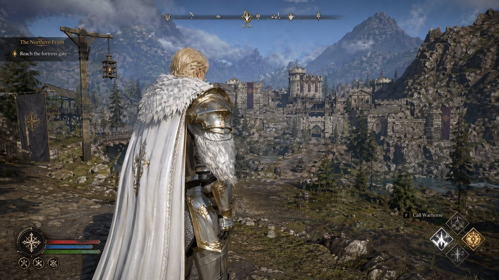</a>

```text
{argument name="ゲームジャンル" default="オープンワールドRPG"}のスクリーンショット風
```

## by [Beto](<https://x.com/betomoedano>) on April 21, 2026 👉 [Try Now](https://indream.ai/generate?mode=IMAGE&modelKey=gpt-image-v2&modelPromptId=019dc05f-1154-761c-99f5-0a10e2999a3c)

<a href="./public/images/f78597fc-549f-4461-8cea-9d0b23128917.png" target="_blank" rel="noopener noreferrer">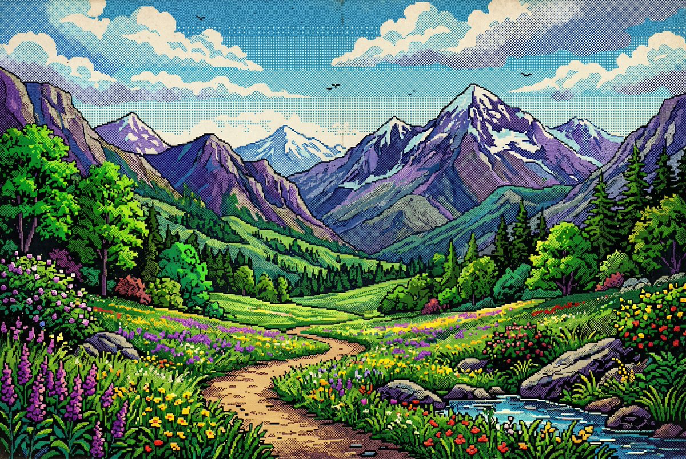</a>

```text
A highly detailed retro pixel art landscape of a bright alpine valley in summer, composed like a classic side-scrolling video game background but shown as a wide scenic vista. In the foreground, a winding tan dirt path curves from the bottom center into the middle distance through dense wildflower meadows, with a small blue stream at the lower right bordered by gray rocks and lush grass. Count 2 large foreground rock clusters, 1 winding path, and 1 visible stream. Fill the meadows with colorful flowers in vivid purple, yellow, red, pink, and white, with especially tall purple flower spikes on the left foreground and dense mixed blossoms on both sides of the path. On the left and right midground, place thick stands of leafy green trees and dark pine trees, framing the open valley center. In the background, show a dramatic mountain range with exactly 7 visible peaks: 1 dominant tall snow-capped peak slightly right of center, 2 medium purple peaks to its left, 2 smaller snowy blue peaks in the far center distance, 1 smaller purple peak to the right, and 1 cropped rocky mountain edge at the far left. Use vibrant greens and purples as the main palette, with cool blue shadows and lavender mountain faces. Above, render a bright blue sky with large creamy white clouds, halftone-dot shading throughout the sky and mountains, subtle vintage comic print texture, visible dithering, and crisp sharp pixel edges. Add exactly 4 small flying bird silhouettes in the sky. The whole image should feel colorful, nostalgic, scenic, and richly layered, with heavy halftone comic shading, retro print grain, no text, no UI, no characters, and no buildings.
```

## by [Diogo Santos](<https://x.com/diogosantosbr>) on April 21, 2026 👉 [Try Now](https://indream.ai/generate?mode=IMAGE&modelKey=gpt-image-v2&modelPromptId=019dc05f-21bb-70af-8d80-d91ada9796c2)

<a href="./public/images/bc05b859-30f9-499f-a7ad-69f7661e4186.png" target="_blank" rel="noopener noreferrer">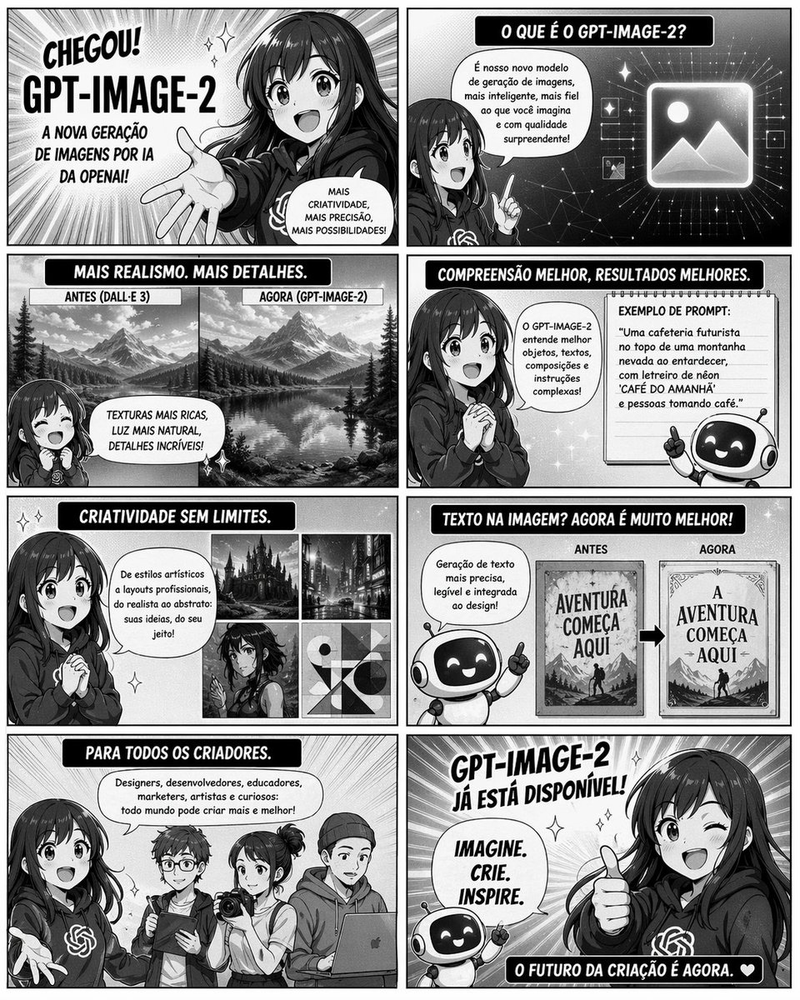</a>

```text
{"type":"8-panel manga-style promotional comic page","theme":"launch announcement for GPT-Image-2","language":"Portuguese","style":{"rendering":"black-and-white manga with screentone shading, speed lines, glossy highlights, bold inked outlines, clean digital comic finish","mood":"exciting, informative, optimistic, tech-forward","page_format":"single page divided into 8 rectangular panels in a 2-column by 4-row grid with thin gutters"},"characters":[{"id":"host girl","role":"main presenter","appearance":"cute anime girl with long dark hair, large expressive eyes, wearing a dark hoodie with the OpenAI knot logo on the chest","count":1},{"id":"robot mascot","role":"friendly assistant mascot","appearance":"small round robot with black face screen, glowing eyes, simple white body, tiny arms, cheerful expression","count":1},{"id":"creator group","role":"audience examples","appearance":"4 different young creators: one designer, one developer holding a tablet, one photographer with camera, one person with laptop/hoodie","count":4}],"layout":{"sections":[{"title":"CHEGOU! GPT-IMAGE-2","position":"top-left","count":1,"description":"dramatic hero introduction panel with the anime girl reaching one hand toward the viewer, radiant speed lines behind her","text":["CHEGOU!","GPT-IMAGE-2","A NOVA GERAÇÃO DE IMAGENS POR IA DA OPENAI!","MAIS CRIATIVIDADE, MAIS PRECISÃO, MAIS POSSIBILIDADES!"]},{"title":"O QUE É O GPT-IMAGE-2?","position":"top-right","count":1,"description":"girl in half-body pose pointing upward beside a glowing image icon on a starry tech background","text":["O QUE É O GPT-IMAGE-2?","É nosso novo modelo de geração de imagens, mais inteligente, mais fiel ao que você imagina e com qualidade surpreendente!"]},{"title":"MAIS REALISMO. MAIS DETALHES.","position":"middle-left row 2","count":1,"description":"comparison panel showing 2 landscape images side by side, both mountain lake scenes, left labeled older model and right labeled newer model with richer realism","subsections":[{"label":"ANTES (DALL·E 3)","count":1},{"label":"AGORA (GPT-IMAGE-2)","count":1}],"text":["MAIS REALISMO. MAIS DETALHES.","ANTES (DALL·E 3)","AGORA (GPT-IMAGE-2)","TEXTURAS MAIS RICAS, LUZ MAIS NATURAL, DETALHES INCRÍVEIS!"]},{"title":"COMPREENSÃO MELHOR, RESULTADOS MELHORES.","position":"middle-right row 2","count":1,"description":"girl clasping hands beside a framed prompt example and the robot mascot pointing upward","text":["COMPREENSÃO MELHOR, RESULTADOS MELHORES.","O GPT-IMAGE-2 entende melhor objetos, textos, composições e instruções complexas!","EXEMPLO DE PROMPT:","\"Uma cafeteria futurista no topo de uma montanha nevada ao entardecer, com letreiro de néon ‘CAFÉ DO AMANHÃ’ e pessoas tomando café.\""]},{"title":"CRIATIVIDADE SEM LIMITES.","position":"lower-left row 3","count":1,"description":"girl speaking beside a 2x2 showcase of 4 generated art variants","subsections":[{"label":"gothic castle scene","count":1},{"label":"modern city street at night","count":1},{"label":"anime character portrait","count":1},{"label":"abstract geometric composition","count":1}],"text":["CRIATIVIDADE SEM LIMITES.","De estilos artísticos a layouts profissionais, do realista ao abstrato: suas ideias, do seu jeito!"]},{"title":"TEXTO NA IMAGEM? AGORA É MUITO MELHOR!","position":"lower-right row 3","count":1,"description":"robot mascot presenting a before-and-after comparison of poster typography with a bold arrow between the two designs","subsections":[{"label":"ANTES","count":1},{"label":"AGORA","count":1}],"text":["TEXTO NA IMAGEM? AGORA É MUITO MELHOR!","Geração de texto mais precisa, legível e integrada ao design!","ANTES","AGORA","AVENTURA COMEÇA AQUI","A AVENTURA COMEÇA AQUI"]},{"title":"PARA TODOS OS CRIADORES.","position":"bottom-left","count":1,"description":"group shot with the host girl and 4 creators standing side by side, representing different professions","text":["PARA TODOS OS CRIADORES.","Designers, desenvolvedores, educadores, marketers, artistas e curiosos: todo mundo pode criar mais e melhor!"]},{"title":"GPT-IMAGE-2 JÁ ESTÁ DISPONÍVEL!","position":"bottom-right","count":1,"description":"closing hero panel with the girl winking and giving a thumbs-up, robot mascot beside her, bright celebratory rays and sparkles","text":["GPT-IMAGE-2 JÁ ESTÁ DISPONÍVEL!","IMAGINE. CRIE. INSPIRE.","O FUTURO DA CRIAÇÃO É AGORA. ❤"]}],"panel_count":8},"composition":{"reading_order":"left to right, top to bottom","camera_variety":"mix of close-up hero shots, medium presenter shots, comparison graphics, and group shot","graphic_elements":["speech bubbles","rounded black title banners with white uppercase lettering","sparkles","speed lines","starry tech background","comparison arrows","framed example cards"]},"text_style":"all caps comic lettering in Portuguese, bold display headers, clear speech bubbles, promotional infographic-comic hybrid","quality":"high-resolution editorial comic poster, crisp typography, balanced panel spacing, strong contrast","prompt":"Create a grayscale manga-style 8-panel promotional comic page announcing {argument name=\"product name\" default=\"GPT-IMAGE-2\"}. Use a single-page 2-column by 4-row layout with exactly 8 distinct panels and Portuguese text throughout. Feature a cheerful anime presenter girl with {argument name=\"hair color\" default=\"dark brown\"} long hair, a dark hoodie with the OpenAI logo, and a friendly small robot mascot. Panel 1: dramatic launch reveal, girl reaching toward camera, radial speed lines, headline \"CHEGOU! {argument name=\"headline name\" default=\"GPT-IMAGE-2\"}\" and launch copy about a new generation of AI images. Panel 2: explanatory panel with girl pointing beside a glowing image icon on a starry digital background, title \"O QUE É O GPT-IMAGE-2?\" and a speech bubble describing it as a smarter image generation model. Panel 3: realism comparison with exactly 2 side-by-side mountain lake landscapes labeled \"ANTES (DALL·E 3)\" and \"AGORA (GPT-IMAGE-2)\". Panel 4: better understanding panel with girl and robot, include a framed prompt example using {argument name=\"example prompt\" default=\"Uma cafeteria futurista no topo de uma montanha nevada ao entardecer, com letreiro de néon ‘CAFÉ DO AMANHÃ’ e pessoas tomando café.\"}. Panel 5: creativity showcase with exactly 4 thumbnails: gothic castle, city at night, anime portrait, abstract geometric art. Panel 6: text rendering comparison with exactly 2 poster variants labeled \"ANTES\" and \"AGORA\", showing improved typography and the phrase \"AVENTURA COMEÇA AQUI\" versus a cleaner corrected version. Panel 7: audience panel with exactly 4 creators from different fields standing together. Panel 8: final celebratory call-to-action with the girl winking and giving thumbs-up, robot mascot cheering, and the closing slogan {argument name=\"closing slogan\" default=\"IMAGINE. CRIE. INSPIRE.\"}. Make the page energetic, polished, highly legible, with bold black header bars, white uppercase lettering, speech bubbles, sparkles, screentone shading, and strong manga/comic promotional poster aesthetics."}
```

## by [Haruhiko Okumura](<https://x.com/h_okumura>) on April 21, 2026 👉 [Try Now](https://indream.ai/generate?mode=IMAGE&modelKey=gpt-image-v2&modelPromptId=019dc060-cb18-767e-bf90-a651e3967199)

<a href="./public/images/e9d7b86b-b479-4e1d-98be-1c26adacd15e.png" target="_blank" rel="noopener noreferrer">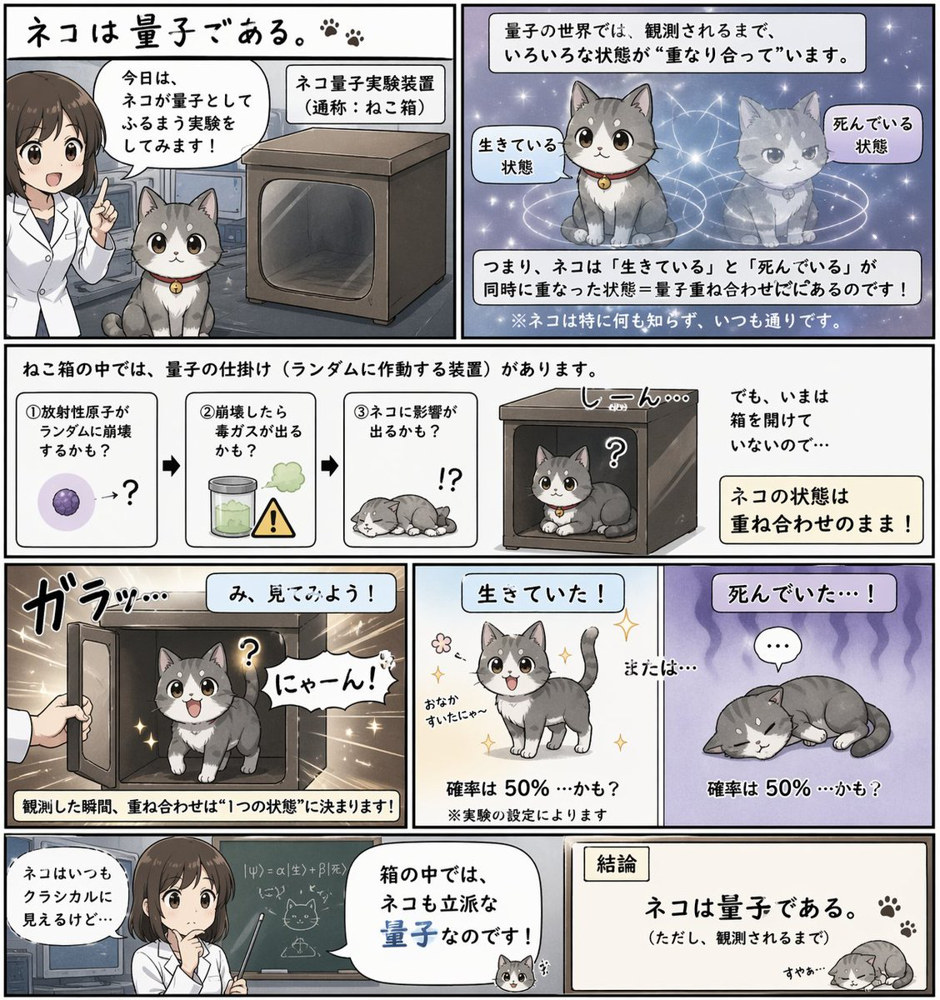</a>

```text
{argument name="主役" default="ネコ"}が{argument name="コンセプト" default="量子としてふるまう"}マンガを描いてください。
```

## by [Gadgetify](<https://x.com/Gdgtify>) on April 21, 2026 👉 [Try Now](https://indream.ai/generate?mode=IMAGE&modelKey=gpt-image-v2&modelPromptId=019dc063-3554-749a-8b0a-aef0957c4fe6)

<a href="./public/images/bceb1f60-a35b-4e86-95a3-c00d1faa8df9.png" target="_blank" rel="noopener noreferrer">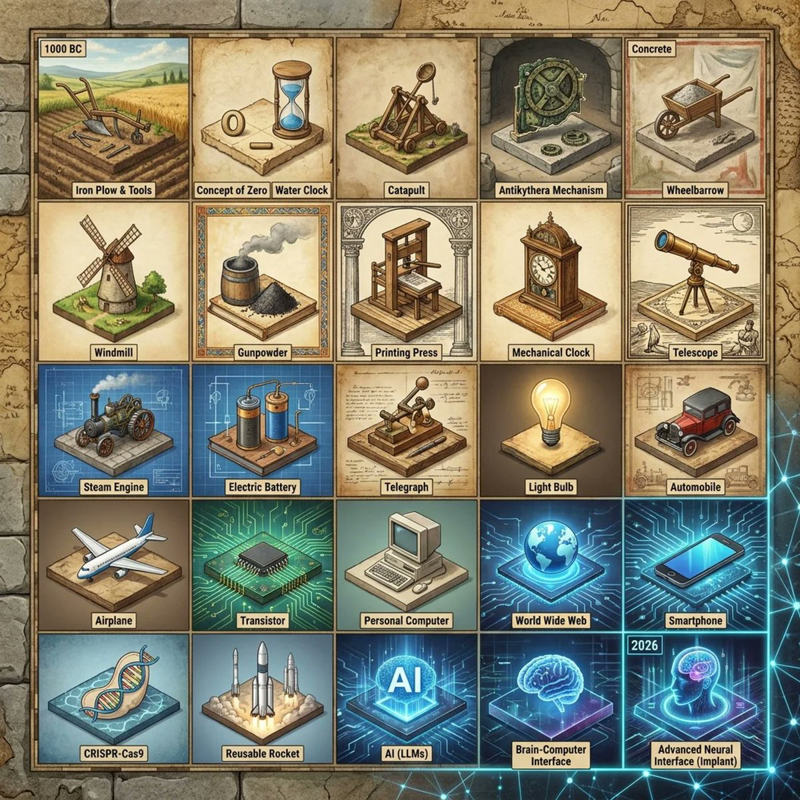</a>

```text
Create a square infographic-style illustration showing a {argument name="grid size" default="15×15"} invention timeline grid rendered as a collection of miniature isometric dioramas on aged parchment tiles. The image should look like a curated historical poster that spans from {argument name="starting year" default="1000 BC"} to {argument name="ending year" default="2026"}, with one invention per tile and no repeats. Show the visible portion as a 5 by 5 section of the larger grid, for a total of 25 labeled tiles, arranged in neat rows and columns with thin dark borders. Every tile contains a unique world-changing invention depicted as a small handcrafted diorama with era-appropriate materials, colors, and background details. Use a warm antiquarian palette for ancient and medieval inventions, sepia technical-document tones for early modern inventions, and cooler neon-blue futuristic lighting for modern digital and biotech inventions. Surround the grid with an old-map border and subtle historical cartography textures, blending into faint modern network graphics near the bottom right.

Label each visible tile with a small beige caption tag in bold black text. Include exactly these 25 visible inventions in reading order from top left to bottom right: 1) {argument name="first tile label" default="1000 BC"} tile showing an iron plow and simple hand tools in a farm field, captioned "Iron Plow & Tools"; 2) "Concept of Zero" shown as a parchment-like tile with a carved zero symbol and a blue hourglass; 3) "Water Clock" shown as a wooden water-timing device; 4) "Catapult" shown as a wooden siege engine; 5) "Antikythera Mechanism" shown as an intricate bronze gear device in a stone niche; 6) "Concrete" shown as a wheelbarrow filled with wet cement or mortar; 7) "Wheelbarrow" shown as a simple wooden one-wheel cart; 8) "Windmill" shown as a traditional mill on grassy ground; 9) "Gunpowder" shown as a barrel and a mound of black powder with smoke; 10) "Printing Press" shown as a wooden press framed by classical columns; 11) "Mechanical Clock" shown as an ornate standing clock; 12) "Telescope" shown as an early brass telescope on a tripod with sketch-like scientific notes; 13) "Steam Engine" shown on a blue blueprint-style tile with an early locomotive engine; 14) "Electric Battery" shown on a blueprint-like tile with two cylindrical battery cells and wiring; 15) "Telegraph" shown as a Morse telegraph key on technical paper; 16) "Light Bulb" shown glowing warmly on a neutral pedestal; 17) "Automobile" shown as an early red motorcar on a workshop-plan background; 18) "Airplane" shown as a commercial jet aircraft in miniature; 19) "Transistor" shown as a black microchip on a luminous circuit-board tile; 20) "Personal Computer" shown as a beige desktop computer with CRT monitor and keyboard; 21) "World Wide Web" shown as a glowing blue globe over digital circuitry; 22) "Smartphone" shown as a sleek modern phone on a neon-tech background; 23) "CRISPR-Cas9" shown as a DNA double helix in a biotech-blue display tile; 24) "Reusable Rocket" shown as several upright rockets launching with exhaust clouds; 25) "AI (LLMs)" shown as glowing large letters AI in a holographic tech cube; 26) "Brain-Computer Interface" shown as a glowing brain hologram on a blue platform; 27) "Advanced Neural Interface (Implant)" shown as a transparent human head profile with a glowing brain implant, with a small top label reading "2026".

Keep the composition highly organized, poster-like, and visually dense, with each tile readable at a glance. Use slight isometric perspective, crisp linework, painterly shading, and polished editorial illustration quality. The overall feeling should combine museum poster, educational timeline, and imaginative historical-tech diorama art.
```

## by [Javier Rubio Donzé](<https://x.com/Sr_Donze>) on April 21, 2026 👉 [Try Now](https://indream.ai/generate?mode=IMAGE&modelKey=gpt-image-v2&modelPromptId=019dc064-a61f-7341-8676-2069ce3435dc)

<a href="./public/images/25837ec4-a495-4941-8de5-ec182582376f.png" target="_blank" rel="noopener noreferrer">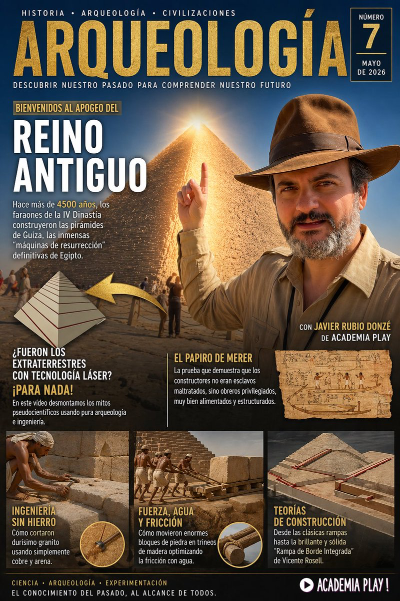</a>

```text
{"type":"Spanish archaeology magazine cover poster","style":"high-impact editorial cover design, cinematic photorealism mixed with infographic collage, dark blue and gold color palette, dramatic desert lighting, polished magazine typography","format":"vertical portrait cover","publication":{"masthead":"ARQUEOLOGÍA","top categories":["HISTORIA","ARQUEOLOGÍA","CIVILIZACIONES"],"tagline":"DESCUBRIR NUESTRO PASADO PARA COMPRENDER NUESTRO FUTURO","issue box":{"label":"NÚMERO","number":"{argument name=\"issue number\" default=\"7\"}","date":"{argument name=\"issue date\" default=\"MAYO DE 2026\"}"}},"main scene":{"background":"clear blue sky over the Giza plateau at golden hour","centerpiece":"a massive sunlit pyramid seen from the front, glowing at the apex with a bright halo of sunlight","foreground right":"a middle-aged male archaeologist-explorer in a brown fedora and beige field shirt, waist-up, pointing upward with his right index finger, rugged beard, documentary-host presence","crowd":"small scattered human figures at the base of the pyramid for scale","mood":"grand, educational, revelatory"},"cover lines":{"kicker":"BIENVENIDOS AL APOGEO DEL","main headline":"{argument name=\"main headline\" default=\"REINO ANTIGUO\"}","deck":"Hace más de 4500 años, los faraones de la IV Dinastía construyeron las pirámides de Guiza, las inmensas \"máquinas de resurrección\" definitivas de Egipto.","host credit":"CON {argument name=\"host name\" default=\"JAVIER RUBIO DONZÉ\"} DE ACADEMIA PLAY"},"layout":{"sections":[{"title":"main cover story","position":"upper left to center","count":4,"labels":["BIENVENIDOS AL APOGEO DEL","REINO","ANTIGUO","Hace más de 4500 años, los faraones de la IV Dinastía construyeron las pirámides de Guiza, las inmensas \"máquinas de resurrección\" definitivas de Egipto."]},{"title":"myth debunk box","position":"left middle","count":3,"labels":["¿FUERON LOS EXTRATERRESTRES CON TECNOLOGÍA LÁSER?","¡PARA NADA!","En este video desmontamos los mitos pseudocientíficos usando pura arqueología e ingeniería."]},{"title":"papyrus feature","position":"center right middle","count":2,"labels":["EL PAPIRO DE MERER","La prueba que demuestra que los constructores no eran esclavos maltratados, sino obreros privilegiados, muy bien alimentados y estructurados."]},{"title":"bottom feature cards","position":"bottom row","count":3,"labels":["INGENIERÍA SIN HIERRO","FUERZA, AGUA Y FRICCIÓN","TEORÍAS DE CONSTRUCCIÓN"]},{"title":"footer","position":"bottom edge","count":2,"labels":["CIENCIA · ARQUEOLOGÍA · EXPERIMENTACIÓN","EL CONOCIMIENTO DEL PASADO, AL ALCANCE DE TODOS."]}],"additional visual elements":{"count":6,"labels":["small white pyramid diagram with red guide lines and a curved golden arrow","aged papyrus illustration showing ancient Egyptian boats and figures","bottom-left card image of a worker cutting or polishing stone blocks by hand","bottom-center card image of several workers hauling a massive stone block on a wooden sledge","bottom-right card image of a pyramid construction cutaway or ramp system model with red ramp lines","bottom-right play-logo text ACADEMIA PLAY !"]}},"typography":{"masthead":"very large condensed uppercase serif in textured metallic gold","headlines":"bold uppercase sans serif in white and yellow","body text":"compact editorial sans serif in white","issue box":"gold outlined dark panel with stacked uppercase text"},"composition":"the masthead dominates the top third, the pyramid and pointing host occupy the center, text blocks wrap around the figure, three equally sized feature panels span the bottom third","quality":"ultra-detailed, sharp print-ready layout, realistic textures, premium documentary magazine aesthetic"}
```

## by [H & J Crawley💙](<https://x.com/cure4hayley>) on April 21, 2026 👉 [Try Now](https://indream.ai/generate?mode=IMAGE&modelKey=gpt-image-v2&modelPromptId=019dc069-ede3-770b-9b4f-37881e9ae023)

<a href="./public/images/e8349f7d-557f-4e33-b17c-661d1145985b.png" target="_blank" rel="noopener noreferrer">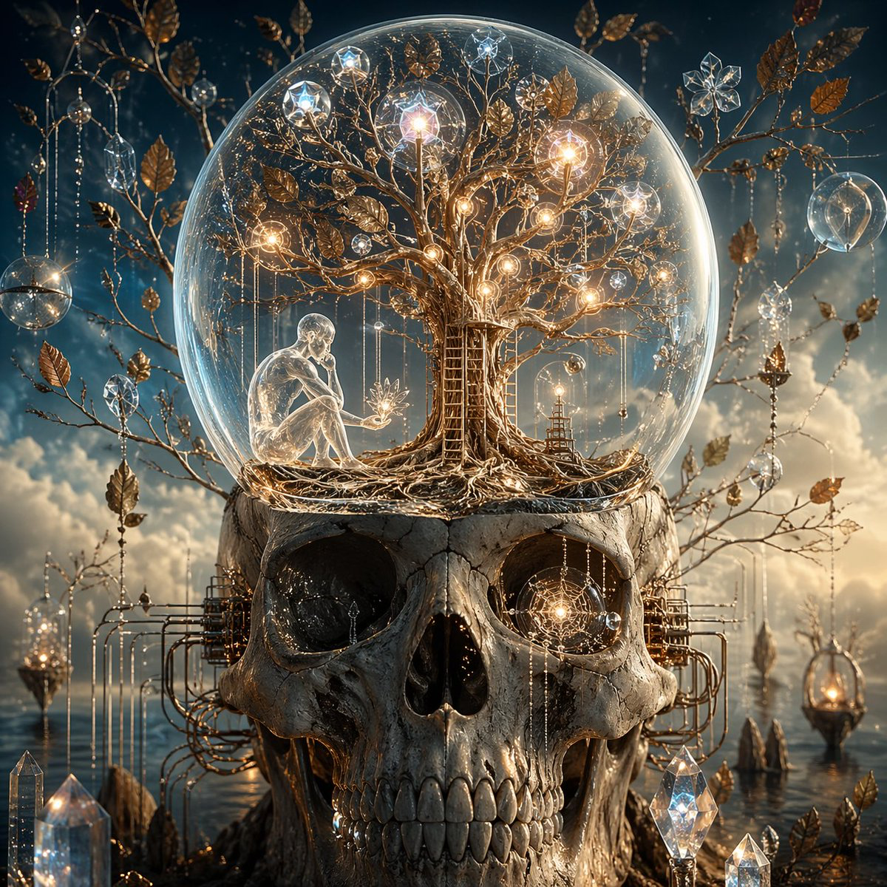</a>

```text
A surreal, ultra-detailed fantasy illustration of a large weathered human skull rising from dark water, centered in the frame, with the top of the skull opened like a pedestal supporting a giant transparent glass sphere. Inside the sphere stands an intricate luminous tree made of twisting golden branches and roots, with exactly 1 main trunk, dozens of tiny warm glowing orbs embedded among the branches, and many metallic bronze leaves. The roots spread across the base inside the globe and wrap around a small ladder built into the trunk. At the lower left inside the globe, depict exactly 1 translucent seated human figure in a contemplative pose, knees drawn up, head resting on one hand, holding a small glowing flower or crystalline bloom in the other hand. On the lower right inside the globe, include exactly 1 miniature architectural tower-like structure made of delicate gold framework. Surrounding the sphere and background are ornate branch networks with hanging crystal ornaments, faceted gemstones, suspended droplets, circular glass forms, and metallic leaves, all arranged symmetrically but organically. The skull is highly realistic with deep eye sockets, detailed teeth, cracked bone texture, and fine copper-like tubes and circuitry extending from both sides near the temples. In the skull’s right eye socket, show exactly 1 glowing mechanical orrery-like light structure. Place the whole composition in a dreamlike seascape at dusk with calm reflective water, distant rock spires, soft clouds, and a blue-to-gold sky. Use cinematic lighting, high contrast, sharp focus, mystical atmosphere, luxurious gold and bronze filigree, crystal transparency, and a color palette of deep teal, midnight blue, ivory bone, warm amber, and metallic gold. Make it feel like symbolic metacognition, consciousness contained within mortality, blending dark surrealism, baroque ornament, and ethereal sci-fi fantasy.
```

## by [マグマグ🌋🐈](<https://x.com/loglogrog>) on April 21, 2026 👉 [Try Now](https://indream.ai/generate?mode=IMAGE&modelKey=gpt-image-v2&modelPromptId=019dc06b-55e7-713c-ac69-e1ec2ed1f9d4)

<a href="./public/images/d84fad3d-084d-4204-8fdb-322425da4a94.png" target="_blank" rel="noopener noreferrer">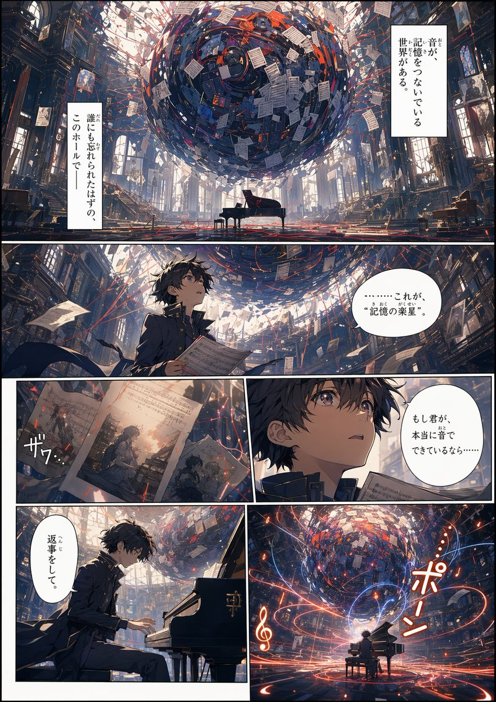</a>

```text
合計{argument name="ページ数" default="4"}ページの漫画を作りたいからこの世界を{argument name="スタイル" default="アニメの世界"}に落とし込んで、漫画に仕上げてください必要であれば見開きカラーでもいいよ
```

## by [金尘马](<https://x.com/jinchenma_ai>) on April 21, 2026 👉 [Try Now](https://indream.ai/generate?mode=IMAGE&modelKey=gpt-image-v2&modelPromptId=019dc072-2c65-7450-b66f-1a642463120c)

<a href="./public/images/4ce71120-c6c8-484b-a084-335bf96ed1f7.png" target="_blank" rel="noopener noreferrer">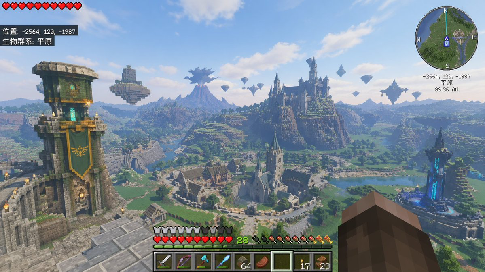</a>

```text
生成一张{argument name="风格基准" default="我的世界"}的游戏截图，里面的世界是构建了一个{argument name="地图主题" default="塞尔达王国之泪"}的地图场景
```

## by [🩵](<https://x.com/Mocha45389036>) on April 21, 2026 👉 [Try Now](https://indream.ai/generate?mode=IMAGE&modelKey=gpt-image-v2&modelPromptId=019dc074-a759-7048-aaa9-95b40651cf35)

<a href="./public/images/ac70bbdf-275e-49da-99e5-c87ebefa4fa0.png" target="_blank" rel="noopener noreferrer">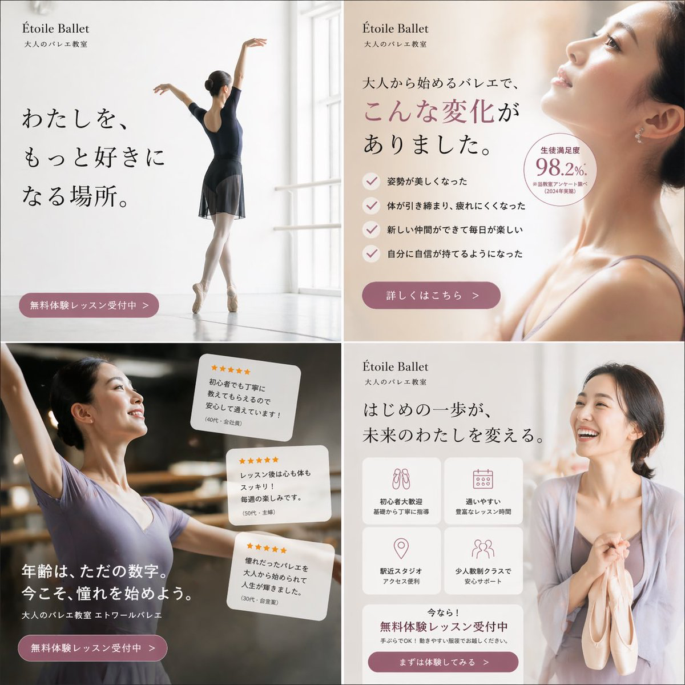</a>

```text
{"type":"luxury ballet school promotional banner collage","brand":{"name":"Étoile Ballet","subtitle":"大人のバレエ教室"},"style":{"mood":"elegant, soft, feminine, aspirational, clean Japanese lifestyle advertising","color_palette":["warm ivory","soft beige","dusty mauve","muted blush pink","charcoal black"],"lighting":"bright natural window light with soft diffusion","finish":"high-end editorial banner design for social media or web promotion","typography":"refined Japanese serif and clean minimal supporting text"},"layout":{"format":"2x2 grid collage","sections":[{"title":"top left panel","position":"top-left","count":3,"labels":["brand logo","main vertical-style headline","call-to-action button"]},{"title":"top right panel","position":"top-right","count":5,"labels":["brand logo","benefit headline","4 bullet point benefits","circular satisfaction badge","call-to-action button"]},{"title":"bottom left panel","position":"bottom-left","count":6,"labels":["background student photo","3 floating review cards","main headline","school descriptor line","call-to-action button","star ratings on review cards"]},{"title":"bottom right panel","position":"bottom-right","count":6,"labels":["brand logo","main headline","4 feature icon cards","large trial lesson box","call-to-action button"]}],"divider":"thin white gutters separating all four panels"},"panels":{"top_left":{"background":"minimal bright ballet studio with large white windows and pale reflective floor","subject":"full-body adult female ballet dancer in center, back view, standing en pointe with arms gracefully raised in fifth position variation","wardrobe":{"leotard_color":"{argument name=\"leotard color\" default=\"deep navy\"}","outfit_pieces":["short-sleeve leotard","sheer wrap skirt","pale pink tights","pointe shoes"],"hair":"sleek ballet bun"},"text":{"headline":"わたしを、もっと好きになる場所。","button":"無料体験レッスン受付中 >"}},"top_right":{"background":"soft beige overlay with close-up cropped portrait of an adult female ballet student on the right edge, neck and shoulder visible, elegant and softly lit","text":{"headline_top":"大人から始めるバレエで、","headline_emphasis":"こんな変化が","headline_bottom":"ありました。","bullets":["姿勢が美しくなった","体が引き締まり、疲れにくくなった","新しい仲間ができて毎日が楽しい","自分に自信が持てるようになった"],"badge":"生徒満足度 98.2% ※アンケート結果より（2024年実績）","button":"詳しくはこちら >"},"graphics":{"bullet_count":4,"bullet_style":"checkmark circles in muted pink","badge_style":"thin outlined circle"}},"bottom_left":{"background":"warm, cinematic close-up of an adult female ballet student stretching one arm upward in studio light","text":{"headline":"年齢は、ただの数字。今こそ、憧れを始めよう。","subline":"大人のバレエ教室 エトワールバレエ","button":"無料体験レッスン受付中 >"},"review_cards":{"count":3,"cards":[{"stars":5,"text":"初心者でも丁寧に教えてもらえるので安心して通えています！ (40代・会社員)"},{"stars":5,"text":"レッスン後は心も体もスッキリ！毎週の楽しみです。 (50代・主婦)"},{"stars":5,"text":"憧れだったバレエを大人から始められて人生が輝きました。 (30代・看護師)"}],"style":"floating rounded white cards tilted slightly"}},"bottom_right":{"background":"light neutral interior with softly blurred adult female student holding a pair of pointe shoes against her chest on the right side","text":{"headline":"はじめの一歩が、未来のわたしを変える。","features":["初心者大歓迎 基礎から丁寧に指導","通いやすい 豊富なレッスン時間","駅近スタジオ アクセス便利","少人数制クラスで 安心サポート"],"trial_box":"今なら！ 無料体験レッスン受付中 手ぶらでOK！動きやすい服装でお越しください。","button":"まずは体験してみる >"},"feature_cards":{"count":4,"style":"rounded square cards with thin line icons"}}},"image_guidance":"Use Japanese text exactly as shown. Keep all faces softly obscured or out of focus, emphasizing atmosphere over identity. Maintain a premium ballet-school advertisement look with generous white space, soft gradients, elegant composition, and a cohesive dusty-rose accent color across all buttons and icons."}
```

## by [Eni係鬼](<https://x.com/agilertao>) on April 21, 2026 👉 [Try Now](https://indream.ai/generate?mode=IMAGE&modelKey=gpt-image-v2&modelPromptId=019dc07f-1e1b-74bb-b032-367ecc0147d2)

<a href="./public/images/0e4e346a-402f-4c0d-bfc5-dd08a4b1de1a.png" target="_blank" rel="noopener noreferrer">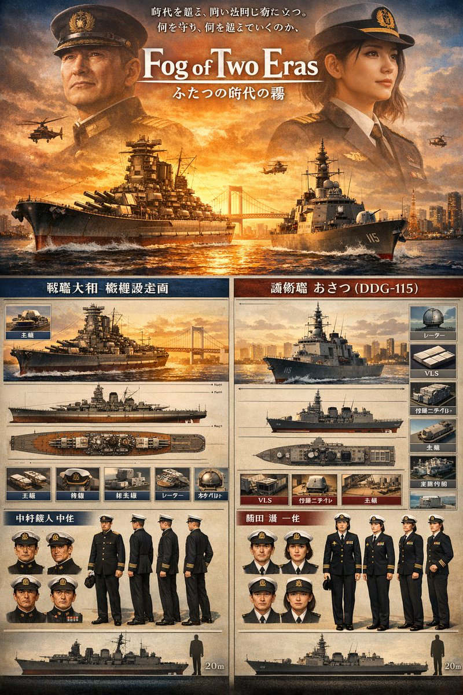</a>

```text
Create a cinematic Japanese naval comparison poster in a highly detailed, photorealistic concept-art style with a warm amber sunset palette, dramatic clouds, glowing backlight, and a premium movie-poster plus technical-reference-sheet layout. The composition is vertically stacked in 2 main zones. In the top hero zone, show 2 large semi-transparent officer portraits facing inward, one on the left in an older imperial-era naval uniform and one on the right in a modern maritime self-defense force style dress uniform, both wearing peaked caps and formal dark coats, with a blazing sunset sky behind them. Centered between them, place a large serif English title reading {argument name="headline text" default="Fog of Two Eras"}, with a smaller Japanese subtitle beneath it reading ふたつの時代の霧, and 2 lines of Japanese tagline text above the title. Below the title, on the ocean at golden hour, show 2 warships moving forward on slightly converging paths: on the left, a massive World War II-era battleship with many large gun turrets, tower superstructure, weathered dark hull, and white bow spray; on the right, a modern gray guided-missile destroyer with hull number 115 visible on the bow, sleek radar-equipped superstructure, and foamy wake. Add exactly 4 helicopters in the sky, 2 on the left side and 2 on the right side, plus a suspension bridge and distant modern city skyline on the horizon. In the lower reference-sheet zone, split the page into 2 vertical panels, left for the historical ship and right for the modern ship, each panel styled like a parchment-toned military specification board with dark blue and dark red header bars, fine dividing lines, inset image boxes, and Japanese labels. The left panel should present exactly 1 large perspective render of the battleship, 3 orthographic ship views beneath it, 5 small labeled equipment/detail thumbnails in a row, 4 small head-and-shoulders uniform portraits, 4 full-body character turnaround views of a male naval officer, and 1 bottom scale silhouette of the ship beside a human figure with a 20m marker. The right panel should present exactly 1 large perspective render of the modern destroyer, 3 orthographic ship views beneath it, 6 small labeled equipment/detail thumbnails arranged around the ship references, 4 small head-and-shoulders uniform portraits, 4 full-body character lineup views including a central female officer in white cap and dark uniform, and 1 bottom scale silhouette of the ship beside a human figure with a 20m marker. Use visible Japanese headers and labels throughout, including a left historical title area and a right title area naming the ship as 護衛艦 あさつ (DDG-115). Make the whole image feel like a museum exhibition poster, military design sheet, and prestige historical sci-fi drama key art combined, with ultra-sharp detail, realistic metal textures, ocean reflections, aged paper panels, symmetrical balance, and polished editorial typography.
```

## by [MarioTan](<https://x.com/TanShilong>) on April 21, 2026 👉 [Try Now](https://indream.ai/generate?mode=IMAGE&modelKey=gpt-image-v2&modelPromptId=019dc07f-e818-708b-af3a-0b734368fc67)

<a href="./public/images/17c7733a-15c7-4955-b302-caafdb5d2078.png" target="_blank" rel="noopener noreferrer">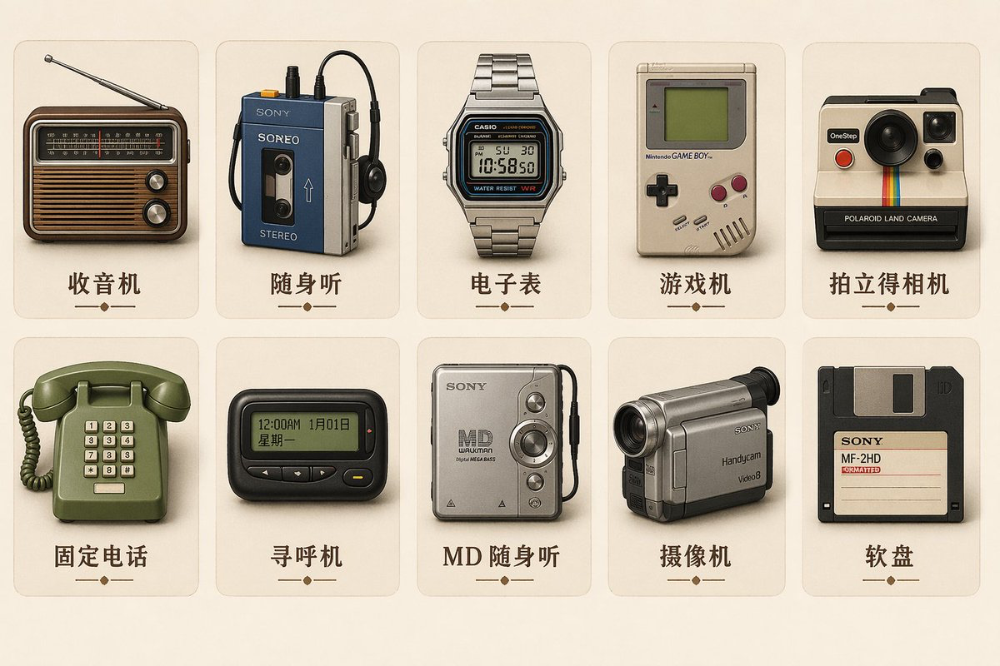</a>

```text
生成一组复古的拟物化风格的{argument name="设备类型" default="老式电子设备"}的图标，图中配有图标名称
```

## by [wolfaidev 🐺](<https://x.com/wolfaidev>) on April 20, 2026 👉 [Try Now](https://indream.ai/generate?mode=IMAGE&modelKey=gpt-image-v2&modelPromptId=019dc084-42cd-71b1-918e-0430a77eeaf6)

<a href="./public/images/4c1c779e-f980-494b-bebf-f5812404dd4e.png" target="_blank" rel="noopener noreferrer">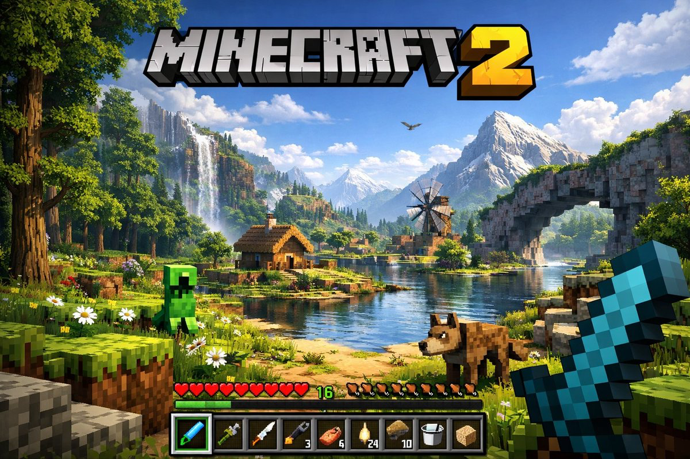</a>

```text
A highly detailed, realistic first-person video game screenshot of a next-generation voxel-based world. At the top center, a large, bold 3D logo reads "{argument name="game title" default="MINECRAFT 2"}". The scene features a {argument name="environment" default="lush, blocky landscape with a river, a small wooden cabin, a windmill, a waterfall, and majestic mountains in the background"}. The world blends realistic lighting, volumetric clouds, and high-resolution textures with cubic, voxel geometry. In the foreground on the left, a {argument name="mob 1" default="blocky green creeper"} stands on the grass, while a {argument name="mob 2" default="blocky brown wolf"} stands on the dirt path to the right. On the far right, the player's hand holds a {argument name="held item" default="pixelated blue diamond sword"} in a first-person perspective. At the bottom of the screen is a game user interface featuring a health bar with 10 red hearts, a green experience bar with the number '16', a hunger bar with 10 brown meat icons, and a 9-slot inventory hotbar. The hotbar contains, from left to right: a selected blue tool with a green highlight box, a green tool, a knife, a wrench with the number '3', a piece of meat with '6', a lantern with '24', a dirt block with '10', a bucket, and a sponge block.
```

## by [いにしえ@AI Director & Creator｜Will Oldgram](<https://x.com/old_pgmrs_will>) on April 20, 2026 👉 [Try Now](https://indream.ai/generate?mode=IMAGE&modelKey=gpt-image-v2&modelPromptId=019dc084-d2f2-718e-9120-47c81783f1f0)

<a href="./public/images/8f559c23-86db-43f8-8218-51b5c4ad140e.png" target="_blank" rel="noopener noreferrer">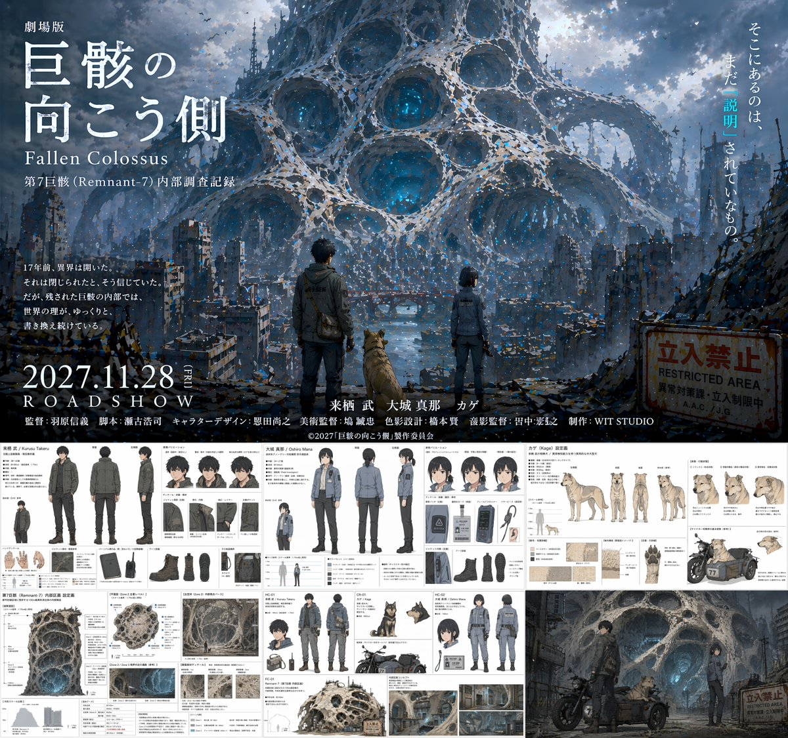</a>

```text
{
  "type": "anime movie production pitch document",
  "overall_layout": "split layout with a large cinematic movie poster on the top half and a grid of 5 detailed reference sheets on the bottom half",
  "top_section": {
    "type": "movie poster",
    "visual": "A man, a woman, and a dog standing on a ruined city street, facing away from the viewer, looking towards a colossal, porous, web-like alien structure dominating the sky. A rusty 'RESTRICTED AREA' sign is on the right.",
    "typography": {
      "title": "{argument name=\"movie title\" default=\"劇場版 巨骸の向こう側 Fallen Colossus\"}",
      "release_date": "{argument name=\"release date\" default=\"2027.11.28 ROADSHOW\"}",
      "tagline": "そこにあるのは、まだ「説明」されていないもの。",
      "credits_studio": "{argument name=\"studio name\" default=\"WIT STUDIO\"}"
    }
  },
  "bottom_sections": [
    {
      "title": "{argument name=\"male character name\" default=\"来栖 武 / Kurusu Takeru\"}",
      "type": "character reference sheet",
      "elements": {
        "full_body_poses": 3,
        "expressions": 3,
        "detail_shots": 8,
        "description": "Male protagonist in dark tactical jacket and cargo pants. Includes front, back, and side full-body views, headshots, and detailed callouts for gloves, boots, backpack, and radio."
      }
    },
    {
      "title": "{argument name=\"female character name\" default=\"大城 真那 / Oshiro Mana\"}",
      "type": "character reference sheet",
      "elements": {
        "full_body_poses": 3,
        "expressions": 3,
        "detail_shots": 6,
        "description": "Female protagonist in grey tactical uniform. Includes front, back, and side full-body views, headshots, and detailed callouts for jacket, boots, ID badge, and pouch."
      }
    },
    {
      "title": "カゲ (Kage) 設定画",
      "type": "animal character reference sheet",
      "elements": {
        "full_body_poses": 4,
        "expressions": 4,
        "detail_shots": 5,
        "description": "Dog companion. Includes side, front, back, and angled full-body views, headshots, and detailed callouts for fur texture, paws, and a motorcycle sidecar."
      }
    },
    {
      "title": "第7巨骸 (Remnant-7) 内部区画 設定画",
      "type": "environment and vehicle reference sheet",
      "elements": {
        "large_diagrams": 1,
        "environment_thumbnails": 4,
        "vehicle_designs": 1,
        "description": "Cross-section of the porous alien structure, smaller environment thumbnails, and a motorcycle design featuring the characters."
      }
    },
    {
      "title": "Concept Art",
      "type": "scene illustration",
      "elements": {
        "characters": 3,
        "vehicles": 1,
        "description": "The male character, female character, and dog with a motorcycle sidecar parked in front of the glowing, porous alien structure."
      }
    }
  ]
}
```

## by [valda](<https://x.com/valda>) on April 20, 2026 👉 [Try Now](https://indream.ai/generate?mode=IMAGE&modelKey=gpt-image-v2&modelPromptId=019dc087-224d-7478-8f05-c01fc785e7a3)

<a href="./public/images/8363ea96-1df3-445a-956f-d5a138a4db86.png" target="_blank" rel="noopener noreferrer">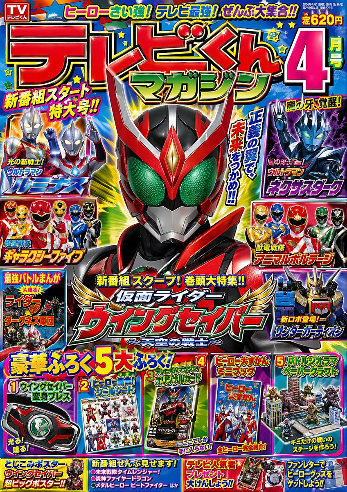</a>

```text
2000年代のこども向けテレビ特撮専門月刊誌「{argument name="雑誌名" default="テレビくんマガジン"}」{argument name="号数" default="４月号"}の表紙画像を作って。新番組仮面ライダー系特撮ヒーローのバストアップ実写画像を中央に1人配置。周囲に平成ウルトラマン系、戦隊系ヒーローの小さなカットを配置。実在しない架空のテレビ番組名をいくつかと豪華付録の画像を並べて。ライダーやウルトラマンの名前は必ず実在しないものを想像力豊かに創作してください。赤緑青原色系ボールド縁取りのグラデーションフォントなどを駆使し、とにかく雑多で全部盛りの印象に。Format {argument name="比率" default="1:1.414"} 画像生成モデルは duct-tape-1か duct-tape-2、3 を指定したいです。
```

## by [パク🎈動画広告分析Pro × AI](<https://x.com/masapark95>) on April 20, 2026 👉 [Try Now](https://indream.ai/generate?mode=IMAGE&modelKey=gpt-image-v2&modelPromptId=019dc089-d1a0-7698-8fe1-6bb84c821c42)

<a href="./public/images/b74ba782-2677-472c-ba4c-5aa4d8c0d8cd.png" target="_blank" rel="noopener noreferrer">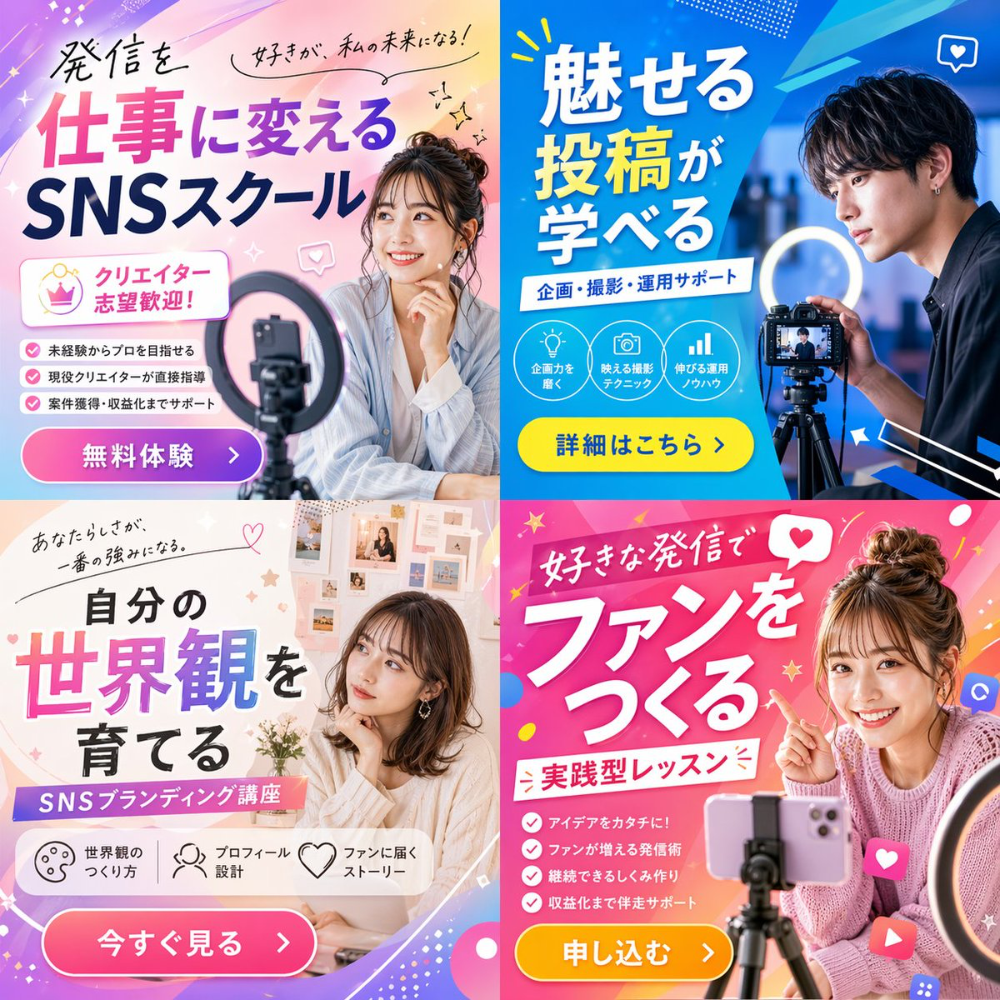</a>

```text
{"type": "2x2 grid of promotional banner ads", "theme": "{argument name=\"course theme\" default=\"Social Media Content Creation School\"}", "panels": [{"position": "top-left", "color_palette": "light blue and pink pastel gradient", "subject": "young woman smiling, resting chin on hand, smartphone and ring light in foreground", "typography": {"headline": "{argument name=\"top left headline\" default=\"発信を仕事に変える SNSスクール\"}", "subheadings": ["好きが、私の未来になる！", "クリエイター志望歓迎！"]}, "layout_elements": {"bullet_points_count": 3, "call_to_action_button": "pink button labeled '無料体験 >'"}}, {"position": "top-right", "color_palette": "deep blue and cyan geometric", "subject": "young man looking intently at a professional camera on a tripod with a ring light", "typography": {"headline": "{argument name=\"top right headline\" default=\"魅せる投稿が学べる\"}", "subheadings": ["企画・撮影・運用サポート"]}, "layout_elements": {"circular_icons_count": 3, "icon_types": ["lightbulb", "camera", "bar chart"], "call_to_action_button": "yellow button labeled '詳細はこちら >'"}}, {"position": "bottom-left", "color_palette": "soft beige and white aesthetic", "subject": "young woman looking thoughtfully to the side, mood board background", "typography": {"headline": "{argument name=\"bottom left headline\" default=\"自分の世界観を育てる\"}", "subheadings": ["あなたらしさが、一番の強みになる。", "SNSブランディング講座"]}, "layout_elements": {"horizontal_icons_count": 3, "icon_types": ["palette", "person", "heart"], "call_to_action_button": "pink button labeled '今すぐ見る >'"}}, {"position": "bottom-right", "color_palette": "vibrant pink and magenta pop design", "subject": "young woman smiling brightly, pointing at text, messy bun, smartphone on tripod", "typography": {"headline": "{argument name=\"bottom right headline\" default=\"好きな発信でファンをつくる\"}", "subheadings": ["実践型レッスン"]}, "layout_elements": {"bullet_points_count": 4, "call_to_action_button": "yellow button labeled '申し込む >'"}}]}
```

## by [💐animaru_san](<https://x.com/koshian_to>) on April 20, 2026 👉 [Try Now](https://indream.ai/generate?mode=IMAGE&modelKey=gpt-image-v2&modelPromptId=019dc08b-604e-747f-b044-6992b003415d)

<a href="./public/images/8dfc9362-1f0c-440c-97ac-3e37e7bbcc0c.png" target="_blank" rel="noopener noreferrer">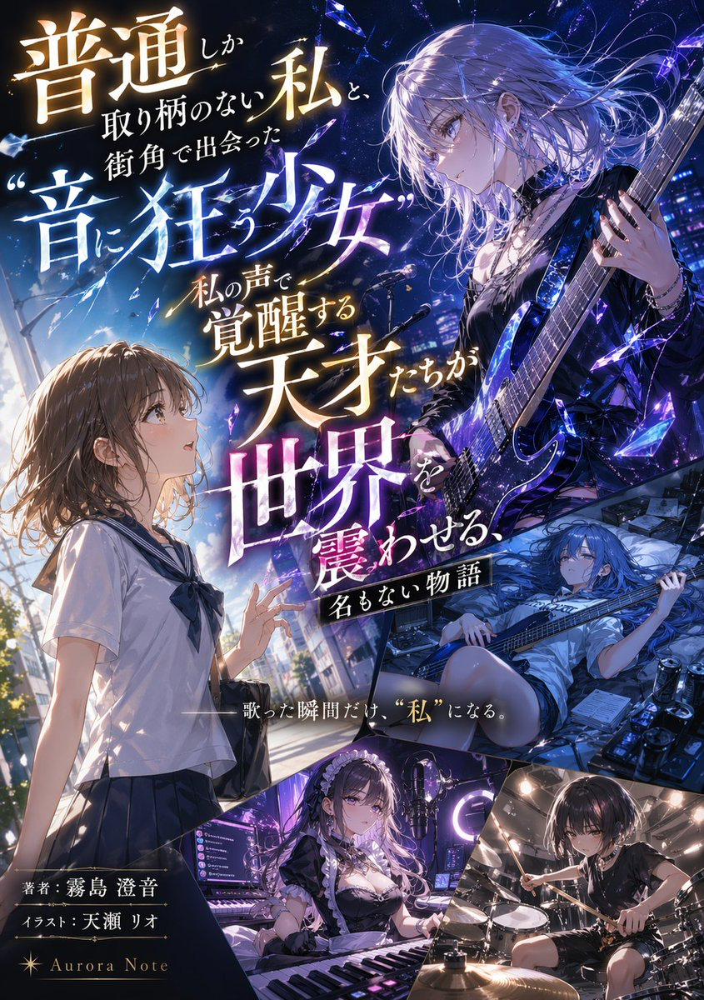</a>

```text
{
  "type": "light novel cover illustration",
  "style": "anime art style, highly detailed, dramatic lighting, shattered glass motifs",
  "typography": {
    "title": "{argument name=\"main title\" default=\"普通しか取り柄のない私と、街角で出会った“音に狂う少女” 私の声で覚醒する天才たちが世界を震わせる、名もない物語\"}",
    "subtitle": "{argument name=\"catchphrase\" default=\"——歌った瞬間だけ、“私”になる。\"}",
    "credits": [
      "著者：{argument name=\"author name\" default=\"霧島 澄音\"}",
      "イラスト：{argument name=\"illustrator name\" default=\"天瀬 リオ\"}",
      "{argument name=\"label name\" default=\"Aurora Note\"}"
    ]
  },
  "layout": {
    "description": "diagonal and dynamic paneling separating 5 distinct character scenes",
    "panels": [
      {
        "position": "left half",
        "character": "ordinary high school girl, brown bob hair, white and navy sailor uniform",
        "action": "looking up in awe, reaching out slightly",
        "background": "daytime city street, bright sunlight"
      },
      {
        "position": "top right",
        "character": "rock girl, silver hair, black gothic outfit, choker",
        "action": "playing a glowing blue electric guitar",
        "background": "nighttime stage, shattered blue crystal effects"
      },
      {
        "position": "middle right",
        "character": "bassist girl, long blue hair, casual t-shirt and shorts",
        "action": "lying down while playing a bass guitar",
        "background": "messy room, music equipment, effect pedals, energy drink cans"
      },
      {
        "position": "bottom left",
        "character": "keyboardist girl, long dark hair, maid outfit",
        "action": "sitting at a synthesizer keyboard, streaming setup",
        "background": "neon purple lit room, monitors, ring light, microphone"
      },
      {
        "position": "bottom right",
        "character": "drummer girl, short black hair, black t-shirt, choker",
        "action": "playing a drum set dynamically",
        "background": "dimly lit recording studio"
      }
    ]
  }
}
```

## by [Austin](<https://x.com/austinit>) on April 20, 2026 👉 [Try Now](https://indream.ai/generate?mode=IMAGE&modelKey=gpt-image-v2&modelPromptId=019dc08e-44dd-7225-8f7b-f4869e47eb4c)

<a href="./public/images/0c981488-135c-4a79-b651-5c88c52b9e16.png" target="_blank" rel="noopener noreferrer">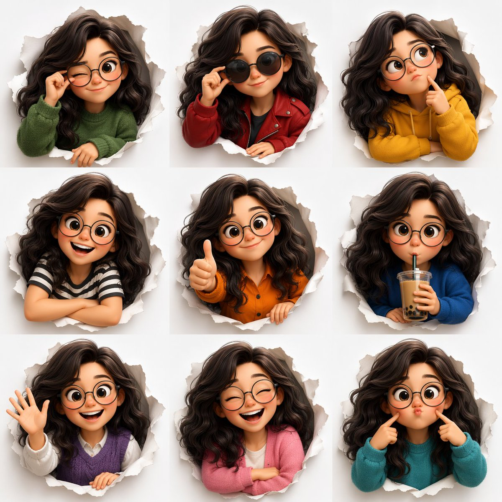</a>

```text
{
  "type": "3x3 character expression grid",
  "style": "{argument name=\"art style\" default=\"3D animation, Pixar style\"}",
  "character_base": "{argument name=\"character description\" default=\"young woman with voluminous dark wavy hair and round wire-rimmed glasses\"}",
  "common_theme": "{argument name=\"framing concept\" default=\"peeking through a torn hole in white paper\"}",
  "layout": {
    "rows": 3,
    "columns": 3,
    "total_panels": 9,
    "panels": [
      {"position": "top-left", "expression": "winking", "action": "adjusting glasses", "outfit": "green sweater"},
      {"position": "top-center", "expression": "smirking", "action": "lowering dark sunglasses", "outfit": "red leather jacket"},
      {"position": "top-right", "expression": "thinking", "action": "finger on chin", "outfit": "yellow hoodie"},
      {"position": "middle-left", "expression": "big smile", "action": "arms resting on edge", "outfit": "black and white striped shirt"},
      {"position": "middle-center", "expression": "smiling", "action": "thumbs up", "outfit": "orange button-up shirt"},
      {"position": "middle-right", "expression": "neutral", "action": "drinking boba tea", "outfit": "blue sweater"},
      {"position": "bottom-left", "expression": "happy", "action": "waving", "outfit": "purple sweater vest over white shirt"},
      {"position": "bottom-center", "expression": "laughing with eyes closed", "action": "arms crossed", "outfit": "pink cardigan"},
      {"position": "bottom-right", "expression": "silly", "action": "poking cheeks", "outfit": "teal sweater"}
    ]
  }
}
```

## by [Ma(s)ken?](<https://x.com/o_tal_do_ken>) on April 19, 2026 👉 [Try Now](https://indream.ai/generate?mode=IMAGE&modelKey=gpt-image-v2&modelPromptId=019dc08e-6335-718a-a51f-b2b45d4997e7)

<a href="./public/images/d14f376f-d11b-4f25-afd8-00dc62e98858.png" target="_blank" rel="noopener noreferrer">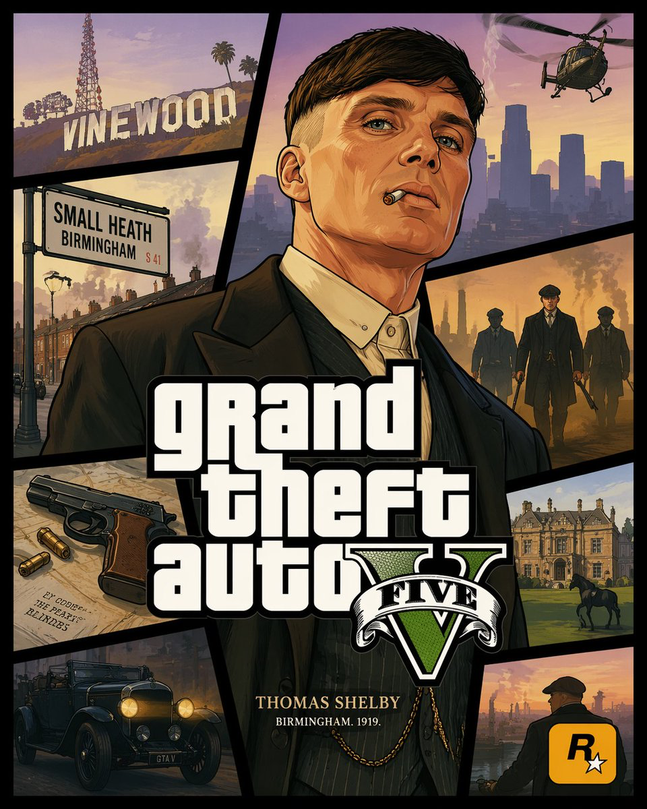</a>

```text
{
  "type": "video game cover art collage",
  "style": "GTA V cover art style, cel-shaded illustration, thick black panel borders",
  "centerpiece": {
    "character": "{argument name=\"main character\" default=\"Thomas Shelby from Peaky Blinders\"}, wearing dark suit, white shirt, smoking cigarette, undercut hairstyle",
    "logo": "{argument name=\"game title\" default=\"grand theft auto V\"} logo with green V and FIVE banner",
    "subtitle": "{argument name=\"bottom text\" default=\"THOMAS SHELBY BIRMINGHAM. 1919.\"}"
  },
  "layout": {
    "panel_count": 8,
    "panels": [
      {
        "position": "top-left",
        "description": "Hillside with {argument name=\"location sign 1\" default=\"VINEWOOD\"} sign, radio tower, palm trees"
      },
      {
        "position": "upper-left",
        "description": "Street sign reading {argument name=\"location sign 2\" default=\"SMALL HEATH BIRMINGHAM S 41\"}, terraced houses"
      },
      {
        "position": "mid-left",
        "description": "Handgun, 3 bullets, map with text 'BY ORDER OF THE PEAKY BLINDERS'"
      },
      {
        "position": "bottom-left",
        "description": "Vintage 1920s black car, glowing headlights, 'GTA V' license plate"
      },
      {
        "position": "top-right",
        "description": "City skyline silhouette, helicopter"
      },
      {
        "position": "mid-right",
        "description": "3 men in flat caps and suits walking in smoky industrial setting"
      },
      {
        "position": "bottom-right-upper",
        "description": "Large country mansion, black horse on lawn"
      },
      {
        "position": "bottom-right-lower",
        "description": "Man in flat cap looking at industrial skyline, yellow Rockstar Games logo"
      }
    ]
  }
}
```

## by [wory＠ホッピング中](<https://x.com/wory37303852>) on April 19, 2026 👉 [Try Now](https://indream.ai/generate?mode=IMAGE&modelKey=gpt-image-v2&modelPromptId=019dc08f-021e-706a-b1da-6b73894238a3)

<a href="./public/images/e1a868ef-644f-4ef4-b02d-7a8b79bb7691.png" target="_blank" rel="noopener noreferrer">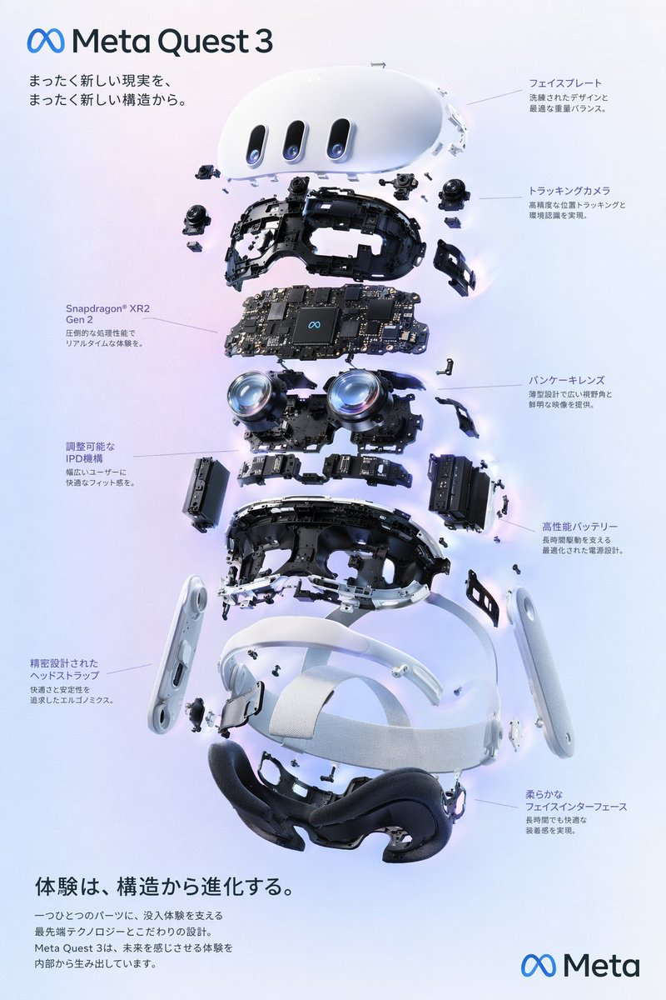</a>

```text
{
  "type": "exploded view product diagram poster",
  "subject": "VR headset",
  "style": "clean high-tech 3D render, studio lighting, glowing accents",
  "background": "{argument name=\"background color\" default=\"soft purple and blue gradient\"}",
  "header": {
    "logo": "∞ {argument name=\"product name\" default=\"Meta Quest 3\"}",
    "subtitle": "{argument name=\"main catchphrase\" default=\"まったく新しい現実を、まったく新しい構造から。\"}"
  },
  "layout": {
    "centerpiece": "vertically stacked exploded view of a VR headset showing 9 distinct layers of internal components: outer shell, camera sensors, motherboard with chip, pancake lenses, internal frame, battery packs, side straps, top strap, and facial interface cushion.",
    "callout_labels": {
      "count": 8,
      "left_side": [
        "Snapdragon® XR2 Gen 2\n圧倒的な処理性能でリアルタイムな体験を。",
        "調整可能なIPD機構\n幅広いユーザーに快適なフィット感を。",
        "精密設計されたヘッドストラップ\n快適さと安定性を追求したエルゴノミクス。"
      ],
      "right_side": [
        "フェイスプレート\n洗練されたデザインと最適な重量バランス。",
        "トラッキングカメラ\n高精度な位置トラッキングと環境認識を実現。",
        "パンケーキレンズ\n薄型設計で広い視野角と鮮明な映像を提供。",
        "高性能バッテリー\n長時間駆動を支える最適化された電源設計。",
        "柔らかなフェイスインターフェース\n長時間でも快適な装着感を実現。"
      ]
    },
    "footer": {
      "left_text_block": {
        "headline": "{argument name=\"bottom headline\" default=\"体験は、構造から進化する。\"}",
        "body": "一つひとつのパーツに、没入体験を支える最先端テクノロジーとこだわりの設計。Meta Quest 3は、未来を感じさせる体験を内部から生み出しています。"
      },
      "right_logo": "∞ Meta"
    }
  }
}
```

## by [李岳](<https://x.com/liyue_ai>) on April 19, 2026 👉 [Try Now](https://indream.ai/generate?mode=IMAGE&modelKey=gpt-image-v2&modelPromptId=019dc08f-4212-7312-bcf6-bb3c6951a464)

<a href="./public/images/bea4b871-4bac-4197-b4e0-c94c7a92aada.png" target="_blank" rel="noopener noreferrer">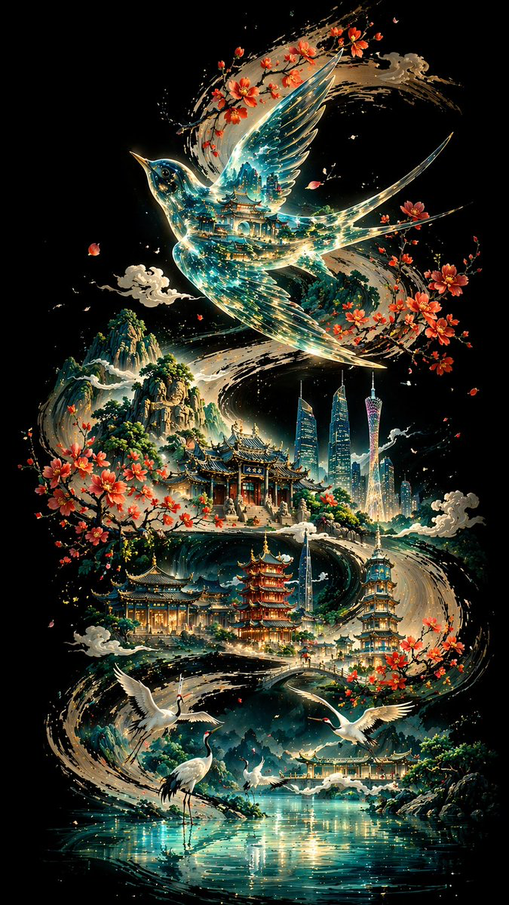</a>

```text
【背景与骨架线条】 纯黑深邃底色，一条粗壮有力的墨色书法S型曲线自画面一端蜿蜒贯穿至另一端，笔触苍劲，墨迹浓淡有致，如大写意行笔，构成整幅画面的视觉骨架与叙事动线。 【主体：{argument name="主体鸟类" default="画眉鸟"}】 曲线上方，一只展翅飞翔的画眉鸟占据视觉核心；身体呈玻璃透明质感，内部映射传统建筑群叠影，蓝绿色光流在透明羽翼间流转折射，仿佛时间长河与文明记忆凝缩其中；轮廓以极细金线勾边，增强立体感与神圣感。 【中景：古典建筑序列】 燕子下方，沿墨线曲线错落分布{argument name="城市" default="广州"}的各种风景名胜：白云山、陈家祠、双子塔、广州塔、猎德大桥、海珠塔依次浮现；主色调青绿与淡金，建筑细节清晰，琉璃瓦、飞檐翘角、石阶回廊；木棉花簇拥点缀于建筑周围，花瓣随风轻散，静谧而悠远；几朵水墨云朵轻盈飘浮其间，增添空灵层次。 【前景：白鹤与水面】 前景湖畔：数只白鹤或静立水边、或振翅腾飞，姿态各异，优雅从容；浅蓝湖面如镜，倒影荡漾，波光细碎，营造宁静氛围。 【远景：山峦】 远处山峦层叠起伏，青黛色晕染，墨色由浓至淡，朦胧氤氲，富有水墨层次；与前景形成近实远虚的空间纵深。 【构图与光影】 非线性透视构图，墨线曲线为叙事主轴，古今元素沿线嵌入；光源自画面中心向外辐射扩散，形成强烈明暗对比，中心亮、四周渐暗；冷色调主导（深蓝、青绿、银白），暖色点缀（樱花粉、淡金），和谐而神秘；东方美学与现代意象交融，超现实诗意意境。 【技术规格】 8K超高清渲染，极致细节精度，最佳画质，比例 {argument name="比例" default="9:16"}
```

## by [皮皮特](<https://x.com/mm_zzm44854>) on April 19, 2026 👉 [Try Now](https://indream.ai/generate?mode=IMAGE&modelKey=gpt-image-v2&modelPromptId=019dc08f-e1b0-741e-a717-34f4cd180cad)

<a href="./public/images/9f4ef4cc-3a1d-4001-a2af-d3231bcde5d2.png" target="_blank" rel="noopener noreferrer"></a>

```text
{
  "type": "illustrated map infographic",
  "style": "{argument name=\"art style\" default=\"watercolor and ink hand-drawn illustration on vintage parchment\"}",
  "title_section": {
    "text": "{argument name=\"city name\" default=\"成都\"} {argument name=\"map title\" default=\"吃货暴走地图\"}",
    "mascot": "cartoon red chili pepper wearing sunglasses and giving a thumbs up"
  },
  "border": "{argument name=\"border decoration\" default=\"vine of green leaves and red chili peppers\"}",
  "layout": {
    "background": "textured beige parchment paper with yellow roads, blue rivers, and green park areas",
    "sections": [
      {
        "title": "landmarks",
        "count": 6,
        "illustrations": ["traditional pavilion", "traditional monastery", "modern skyscraper with climbing panda", "tall TV tower", "traditional gate", "industrial buildings"],
        "labels": ["人民公园", "文殊院", "IFS", "339电视塔", "宽窄巷子", "东郊记忆"]
      },
      {
        "title": "food_spots",
        "count": 12,
        "illustrations": ["mapo tofu", "dumplings in chili oil", "skewers in pot", "sticky rice balls", "egg baking cake", "nine-grid hotpot", "sweet potato noodles", "cold skewers", "spicy mixed dish", "covered tea bowl", "ice jelly dessert", "spicy rabbit heads"],
        "labels": ["1 陈麻婆豆腐", "2 钟水饺", "3 春熙路", "4 宽窄巷子·三大炮", "5 建设路·叶婆婆蛋烘糕", "6 玉林路·小龙坎火锅", "7 香香巷·肥肠粉", "8 武侯祠大街·钵钵鸡", "9 东郊记忆·冒椒火辣", "10 人民公园·鹤鸣茶社", "11 锦里古街·冰粉", "12 双流老妈兔头"]
      },
      {
        "title": "图例",
        "position": "bottom-right",
        "count": 5,
        "items": ["red dot", "green house", "green tree", "blue line", "yellow double line"],
        "labels": ["美食地点", "地标景点", "公园绿地", "河流湖泊", "主要道路"]
      }
    ],
    "centerpiece": "giant panda sitting and eating bamboo",
    "bottom_right_extras": ["vintage compass rose with N, S, E, W", "disclaimer text '温馨提示：吃辣需谨慎，肠胃要保护~' with a red chili pepper icon"]
  }
}
```

## by [まかねこ| AI×仮想通貨](<https://x.com/makaneko_AI>) on April 19, 2026 👉 [Try Now](https://indream.ai/generate?mode=IMAGE&modelKey=gpt-image-v2&modelPromptId=019dc091-0285-700a-ae50-3bc28ca0ef83)

<a href="./public/images/beae0a00-7ada-4522-a4b4-3fa7e01cda50.png" target="_blank" rel="noopener noreferrer"></a>

```text
{
  "type": "2x2 grid of Japanese digital advertisement banners",
  "layout": {
    "structure": "4 equal quadrants",
    "quadrants": [
      {
        "position": "top-left",
        "theme": "Travel",
        "subject": "A couple holding hands on a white sand beach, looking out at turquoise ocean water under a bright blue sky.",
        "elements": ["red hibiscus flower in bottom left corner"],
        "text_labels": [
          "今年こそ、解き放て。",
          "{argument name=\"travel destination\" default=\"沖縄旅行\"}",
          "3日間の癒やし旅",
          "航空券＋ホテル",
          "39,800円〜",
          "絶景、グルメ、体験 ぜんぶ叶う!"
        ],
        "icons": {
          "count": 3,
          "descriptions": ["airplane", "hotel building", "car"]
        }
      },
      {
        "position": "top-right",
        "theme": "Skincare",
        "subject": "Close-up portrait of a young woman with glowing, dewy skin, eyes closed, gently touching her cheeks.",
        "elements": [
          "soft pink gradient background",
          "dynamic water splash effects",
          "pink cosmetic jar labeled '{argument name=\"skincare product name\" default=\"LUMIÈRE\"} Brightening Gel'"
        ],
        "text_labels": [
          "毛穴・くすみ卒業！",
          "透明感あふれる",
          "水光肌へ",
          "新感覚スキンケア",
          "初回限定 78%OFF",
          "{argument name=\"discount price\" default=\"1,980円\"}"
        ],
        "badges": {
          "count": 3,
          "style": "gold circular",
          "labels": ["毛穴ケア", "高保湿", "ハリ・ツヤ"]
        }
      },
      {
        "position": "bottom-left",
        "theme": "Gourmet Food",
        "subject": "Thick, sliced, medium-rare steak sizzling on a dark grill plate.",
        "elements": [
          "garlic chips",
          "rosemary sprig",
          "dark background with smoke and glowing embers"
        ],
        "text_labels": [
          "とろける旨さ！",
          "{argument name=\"food item\" default=\"黒毛和牛\"}",
          "贅沢ステーキ",
          "期間限定",
          "特別価格",
          "通常価格 8,980円",
          "4,980円"
        ],
        "badges": {
          "count": 1,
          "style": "red circular",
          "labels": ["A4 A5等級"]
        }
      },
      {
        "position": "bottom-right",
        "theme": "Online Education",
        "subject": "Young man in a blue shirt studying at a desk, writing in a notebook next to an open laptop.",
        "elements": ["bright indoor lighting", "desk environment"],
        "text_labels": [
          "スキマ時間で",
          "{argument name=\"education goal\" default=\"最短合格！\"}",
          "オンライン資格講座",
          "スマホで完結",
          "効率学習で差がつく！",
          "今だけ！ 受講料 20%OFF"
        ],
        "badges": {
          "count": 1,
          "style": "blue circular",
          "labels": ["受講者数 10万人 突破！"]
        },
        "icons": {
          "count": 2,
          "descriptions": ["smartphone", "open book"]
        }
      }
    ]
  }
}
```

## by [まーや | 物販LPデザイナー🛒✨](<https://x.com/MajaDesignJP>) on April 19, 2026 👉 [Try Now](https://indream.ai/generate?mode=IMAGE&modelKey=gpt-image-v2&modelPromptId=019dc091-741b-7275-a3d9-cc174965bf9d)

<a href="./public/images/c5580f5c-b0f2-4c8b-b923-6d084485f0e3.png" target="_blank" rel="noopener noreferrer"></a>

```text
{
  "type": "2x2 grid of Japanese web banner advertisements",
  "layout": "4 equal square panels",
  "panels": [
    {
      "position": "top-left",
      "industry": "beverage",
      "product": "clear can of non-alcoholic drink named 'CLEAR ZERO'",
      "visuals": "splashing water, light blue background, refreshing vibe",
      "headline": "{argument name=\"beverage catchphrase\" default=\"今日を、リセット。\"}",
      "badges_count": 3,
      "badges_labels": ["カロリー 0", "糖質 0", "プリン体 0"]
    },
    {
      "position": "top-right",
      "industry": "food delivery",
      "product": "plate of stir-fried meat and vegetables",
      "visuals": "warm lighting, wooden table, appetizing",
      "headline": "{argument name=\"meal kit catchphrase\" default=\"献立に、悩まない。\"}",
      "feature_icons_count": 3,
      "feature_icons_labels": ["時短 10分", "管理栄養士監修", "送料無料"],
      "cta_button": "今すぐはじめる ->"
    },
    {
      "position": "bottom-left",
      "industry": "cosmetics",
      "product": "skincare serum bottle named 'LUMIÈRE'",
      "visuals": "woman with glowing skin and closed eyes, prismatic light effects, soft purple background",
      "headline": "{argument name=\"cosmetics catchphrase\" default=\"肌が、目覚める。\"}",
      "badges_count": 3,
      "badges_labels": ["無添加", "日本製", "敏感肌対応"]
    },
    {
      "position": "bottom-right",
      "industry": "fitness",
      "product": "personal gym named 'MOVE'",
      "visuals": "woman running on a treadmill, dark gym setting, sporty",
      "headline": "{argument name=\"gym catchphrase\" default=\"私を、アップデートする場所。\"}",
      "pricing": "月額 {argument name=\"gym monthly price\" default=\"6,980\"} 円~",
      "feature_hexagons_count": 3,
      "feature_hexagons_labels": ["24時間営業", "全国120店舗以上", "充実のサポート"],
      "cta_button": "無料体験を予約する ->"
    }
  ]
}
```

## by [もっつぃ🌳](<https://x.com/mochisw>) on April 19, 2026 👉 [Try Now](https://indream.ai/generate?mode=IMAGE&modelKey=gpt-image-v2&modelPromptId=019dc091-967e-73cd-ac62-0b0e247271ea)

<a href="./public/images/0e6ae60f-4517-4f5f-92fb-f32f48885057.png" target="_blank" rel="noopener noreferrer">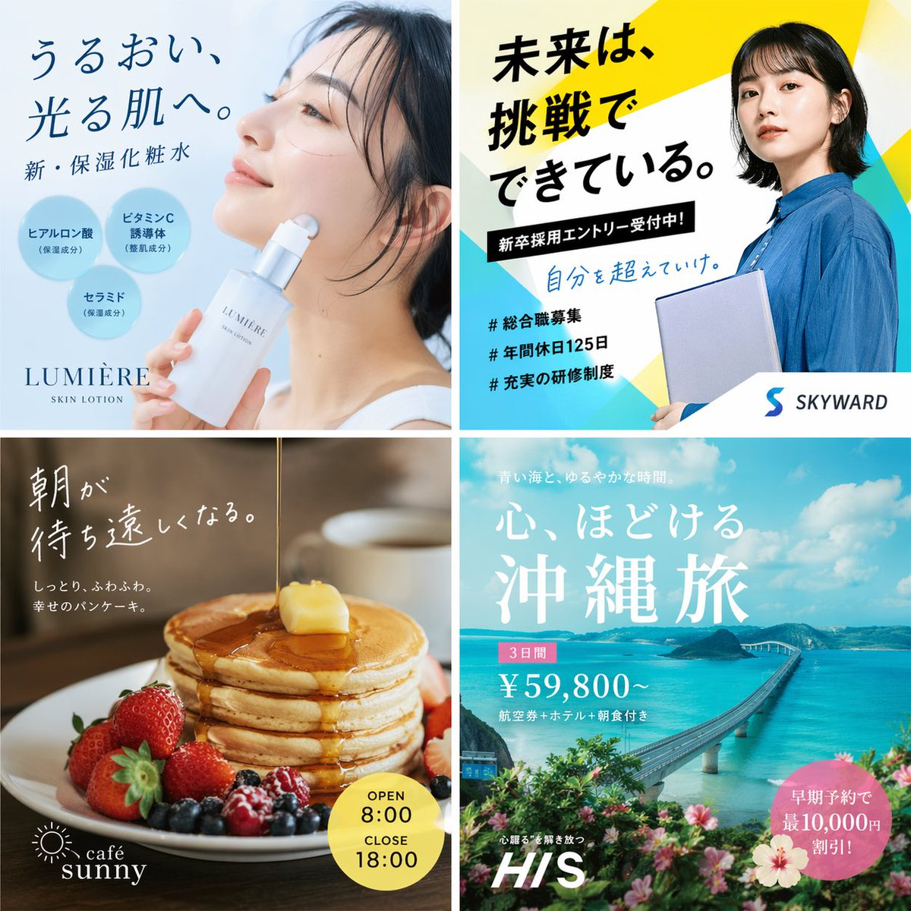</a>

```text
{
  "type": "2x2 advertisement grid",
  "layout": {
    "grid_size": "2 rows by 2 columns",
    "panels": [
      {
        "position": "top-left",
        "theme": "skincare",
        "subject": "profile of a woman looking up, holding a white lotion bottle",
        "headline": "{argument name=\"skincare headline\" default=\"うるおい、光る肌へ。\"}",
        "subtext": "新・保湿化粧水",
        "features": {
          "count": 3,
          "type": "light blue circular bubbles",
          "labels": ["ヒアルロン酸 (保湿成分)", "ビタミンC誘導体 (整肌成分)", "セラミド (保湿成分)"]
        },
        "brand_logo": "LUMIÈRE SKIN LOTION"
      },
      {
        "position": "top-right",
        "theme": "corporate recruitment",
        "subject": "young woman in a blue shirt holding a silver laptop",
        "background": "geometric shapes in yellow, white, and cyan",
        "headline": "{argument name=\"recruitment headline\" default=\"未来は、挑戦でできている。\"}",
        "subtext": ["新卒採用エントリー受付中！", "自分を超えていけ。"],
        "features": {
          "count": 3,
          "type": "hashtags",
          "labels": ["# 総合職募集", "# 年間休日125日", "# 充実の研修制度"]
        },
        "brand_logo": "SKYWARD"
      },
      {
        "position": "bottom-left",
        "theme": "cafe breakfast",
        "subject": "stack of pancakes with butter, pouring syrup, strawberries, blueberries, and raspberries; coffee cup in background",
        "headline": "{argument name=\"cafe headline\" default=\"朝が待ち遠しくなる。\"}",
        "subtext": "しっとり、ふわふわ。幸せのパンケーキ。",
        "features": {
          "count": 1,
          "type": "yellow circular badge",
          "labels": ["OPEN 8:00 CLOSE 18:00"]
        },
        "brand_logo": "café sunny"
      },
      {
        "position": "bottom-right",
        "theme": "travel agency",
        "subject": "scenic view of a long bridge over turquoise water, blue sky, pink hibiscus flowers in foreground",
        "headline": "心、ほどける{argument name=\"travel destination\" default=\"沖縄旅\"}",
        "subtext": ["青い海と、ゆるやかな時間。", "3日間", "{argument name=\"travel price\" default=\"¥59,800〜\"}", "航空券＋ホテル＋朝食付き"],
        "features": {
          "count": 1,
          "type": "pink circular badge",
          "labels": ["早期予約で最大10,000円割引!"]
        },
        "brand_logo": "HIS"
      }
    ]
  }
}
```

## by [もっつぃ🌳](<https://x.com/mochisw>) on April 19, 2026 👉 [Try Now](https://indream.ai/generate?mode=IMAGE&modelKey=gpt-image-v2&modelPromptId=019dc091-834f-74ff-a518-06d071708625)

<a href="./public/images/c1253595-c0c2-418f-9016-af665c08baa5.png" target="_blank" rel="noopener noreferrer">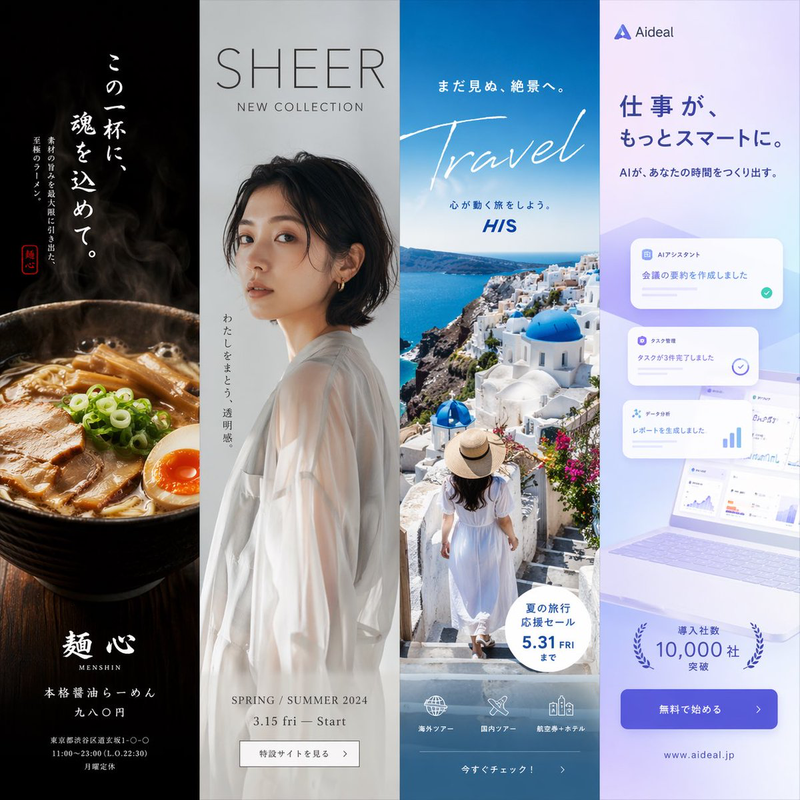</a>

```text
{
  "type": "four-panel advertisement mockup",
  "layout": "vertical split into four equal columns",
  "panels": [
    {
      "position": "far left",
      "theme": "food advertisement",
      "subject": "steaming bowl of authentic soy sauce ramen with sliced pork, half a soft-boiled egg, bamboo shoots, and green onions",
      "background": "dark, moody lighting",
      "typography": {
        "catchphrase": "{argument name=\"ramen catchphrase\" default=\"この一杯に、魂を込めて。\"}",
        "subtext": "ultimate ramen maximizing ingredient umami",
        "brand_name": "麺心",
        "details": "authentic soy sauce ramen 980 yen",
        "footer": "Tokyo Shibuya address and business hours"
      }
    },
    {
      "position": "mid-left",
      "theme": "fashion lookbook",
      "subject": "young Japanese woman looking back over her shoulder, wearing a sheer white long-sleeve top",
      "background": "light grey studio backdrop",
      "typography": {
        "headline": "{argument name=\"fashion brand\" default=\"SHEER\"}",
        "subheadline": "NEW COLLECTION",
        "vertical_text": "wearing transparency",
        "details": "SPRING / SUMMER 2024 3.15 fri - Start",
        "button": "特設サイトを見る >"
      }
    },
    {
      "position": "mid-right",
      "theme": "travel agency promotion",
      "subject": "woman in a white summer dress and straw hat walking down white stairs",
      "background": "{argument name=\"travel destination\" default=\"Santorini, Greece\"} with iconic blue dome churches, white buildings, and deep blue Aegean sea",
      "typography": {
        "top_text": "to an unseen spectacular view",
        "main_title": "Travel",
        "subtitle": "let's take a journey that moves your heart",
        "badge": "summer travel sale until 5.31 FRI",
        "bottom_nav": {
          "count": 3,
          "labels": ["海外ツアー", "国内ツアー", "航空券+ホテル"]
        },
        "button": "今すぐチェック！ >"
      }
    },
    {
      "position": "far right",
      "theme": "B2B SaaS software",
      "subject": "open laptop displaying a data dashboard, surrounded by floating UI elements",
      "background": "light purple and white gradient",
      "ui_elements": {
        "count": 3,
        "labels": ["AIアシスタント", "タスク管理", "データ分析"]
      },
      "typography": {
        "logo": "{argument name=\"tech product name\" default=\"Aideal\"}",
        "headline": "{argument name=\"tech headline\" default=\"仕事が、もっとスマートに。\"}",
        "subheadline": "AI creates time for you",
        "badge": "over 10,000 companies",
        "button": "無料で始める >",
        "url": "www.aideal.jp"
      }
    }
  ]
}
```

## by [テツメモ｜AI図解×検証｜Newsletter](<https://x.com/tetumemo>) on April 19, 2026 👉 [Try Now](https://indream.ai/generate?mode=IMAGE&modelKey=gpt-image-v2&modelPromptId=019dc092-85a4-729e-87ed-eea5425498d2)

<a href="./public/images/39bc422a-b85c-4f77-976b-1e134d80ab84.png" target="_blank" rel="noopener noreferrer"></a>

```text
{
  "type": "2x2 grid of Japanese banner advertisements",
  "quadrants": [
    {
      "position": "top-left",
      "theme": "skincare product launch",
      "visuals": "portrait of a young Japanese woman with glowing skin touching her face, bright white background, 2 sleek silver and white cosmetic bottles",
      "text_elements": {
        "main_copy": "{argument name=\"skincare catchphrase\" default=\"透明感、満ちる。\"}",
        "sub_copy": "肌が変わると、毎日が変わる。",
        "brand_name": "SUIREN",
        "badge": "6.1 NEW Debut"
      }
    },
    {
      "position": "top-right",
      "theme": "European summer travel campaign",
      "visuals": "back view of a woman in a straw hat looking at a scenic European lake town with mountains and a church steeple",
      "text_elements": {
        "english_copy": "Find your Journey",
        "main_copy": "{argument name=\"travel catchphrase\" default=\"心が動く旅へ。\"}",
        "badge": "yellow circle with '今だけ！最大20%OFF'",
        "footer": "blue banner with '初夏のヨーロッパキャンペーン'"
      }
    },
    {
      "position": "bottom-left",
      "theme": "traditional Japanese soup stock",
      "visuals": "close-up of a bowl of white rice topped with bonito flakes and a raw egg yolk, dark soy sauce being poured, 1 brown paper package of dashi",
      "text_elements": {
        "main_copy": "{argument name=\"food catchphrase\" default=\"毎日のごはんを、もっと美味しく。\"}",
        "product_name": "日々のだし",
        "sub_copy": "素材のうまみを、まるごと。"
      }
    },
    {
      "position": "bottom-right",
      "theme": "investment app",
      "visuals": "smartphone displaying a financial dashboard with a blue line chart and balance '¥1,485,606'",
      "text_elements": {
        "brand_name": "{argument name=\"finance app name\" default=\"MoneyPath\"}",
        "main_copy": "未来の自分のために、{argument name=\"finance catchphrase\" default=\"今はじめる資産形成\"}",
        "badge": "blue circle with '1,000円分のポイントプレゼント！'",
        "footer": "blue banner with 4 icons and feature text"
      }
    }
  ]
}
```

## by [wm](<https://x.com/Ryan_Suo>) on April 18, 2026 👉 [Try Now](https://indream.ai/generate?mode=IMAGE&modelKey=gpt-image-v2&modelPromptId=019dc093-6c94-7229-89d2-dbdad3d4e2bb)

<a href="./public/images/3058fbd2-701c-46d7-af79-ca9d0ee3bb96.png" target="_blank" rel="noopener noreferrer">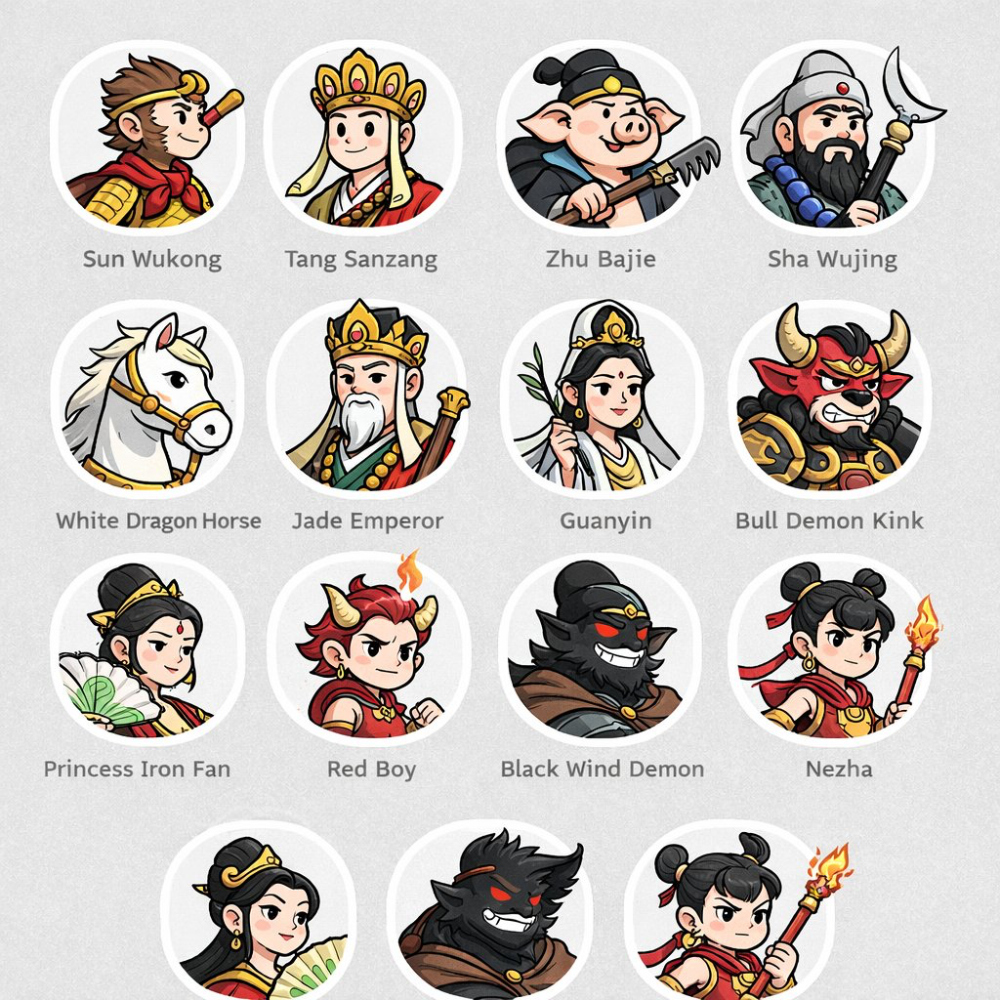</a>

```text
{
  "type": "character avatar grid",
  "theme": "{argument name=\"theme\" default=\"Journey to the West mythology\"}",
  "style": "{argument name=\"art style\" default=\"clean 2D cartoon vector illustration, thick outlines, flat colors\"}",
  "layout": {
    "background": "{argument name=\"background color\" default=\"light gray\"} subtle texture",
    "format": "grid of circular portraits with text labels centered below each circle",
    "rows": [
      {
        "count": 4,
        "items": [
          {"label": "Sun Wukong", "description": "monkey boy with golden headband and red scarf"},
          {"label": "Tang Sanzang", "description": "monk with ornate golden crown"},
          {"label": "Zhu Bajie", "description": "pig man holding a rake"},
          {"label": "Sha Wujing", "description": "bearded man holding a crescent moon staff"}
        ]
      },
      {
        "count": 4,
        "items": [
          {"label": "White Dragon Horse", "description": "white horse with golden bridle"},
          {"label": "Jade Emperor", "description": "older man with white beard and golden crown"},
          {"label": "Guanyin", "description": "goddess holding a willow branch"},
          {"label": "Bull Demon Kink", "description": "fierce bull demon in armor"}
        ]
      },
      {
        "count": 4,
        "items": [
          {"label": "Princess Iron Fan", "description": "woman holding a green palm leaf fan"},
          {"label": "Red Boy", "description": "boy with red hair, horns, and a small flame"},
          {"label": "Black Wind Demon", "description": "dark shadowy demon with glowing red eyes"},
          {"label": "Nezha", "description": "boy with double hair buns holding a flaming spear"}
        ]
      },
      {
        "count": 3,
        "description": "partial row repeating Princess Iron Fan, Black Wind Demon, and Nezha, slightly cropped at the bottom"
      }
    ]
  }
}
```

## by [ad_htm@Webマーケ](<https://x.com/ad_htm024016>) on April 18, 2026 👉 [Try Now](https://indream.ai/generate?mode=IMAGE&modelKey=gpt-image-v2&modelPromptId=019dc094-6e1e-70ab-8f59-13297eaf696d)

<a href="./public/images/a1995e1c-d211-4236-807a-4628c378da8a.png" target="_blank" rel="noopener noreferrer"></a>

```text
{
  "type": "2x2 grid of Japanese advertising posters",
  "layout": {
    "format": "2x2 grid",
    "panels": [
      {
        "position": "top-left",
        "theme": "skincare brand",
        "visual": "Close-up of a young Japanese woman with glowing dewy skin and short black hair. 3 minimalist white skincare bottles in the bottom left.",
        "text_elements": {
          "headline": "{argument name=\"skincare headline\" default=\"素肌が、いちばんのメイクになる。\"}",
          "brand": "urala",
          "subtext": ["肌本来の力を引き出す 新・スキンケアシリーズ誕生", "4.25 NEW DEBUT", "うららかに、わたしらしく。"]
        }
      },
      {
        "position": "top-right",
        "theme": "cafe promotion",
        "visual": "A slice of thick toast topped with strawberry jam and butter on a plate, next to a mug of black coffee on a wooden table near a window.",
        "text_elements": {
          "headline": "{argument name=\"cafe headline\" default=\"今日も、いい日。\"}",
          "brand": "morino cafe",
          "subtext": ["森のそばの小さなカフェ", "こだわりのコーヒーと、焼きたてのパンでほっとひと息しませんか？", "季節限定 いちごのジャムトースト始めました"]
        }
      },
      {
        "position": "bottom-left",
        "theme": "personal gym",
        "visual": "A fit Japanese woman in a black sports bra with a ponytail, looking upward with determination in a purple-lit gym.",
        "text_elements": {
          "headline": "{argument name=\"gym headline\" default=\"わたしを超えていけ。\"}",
          "brand": "BEYOND LIMIT PERSONAL GYM",
          "subtext": ["今こそ、理想の自分へ", "まずは体験から！ 体験トレーニング 60分 ¥2,200(税込)"]
        }
      },
      {
        "position": "bottom-right",
        "theme": "resort destination",
        "visual": "A serene view of a bright blue ocean and sky from a modern white balcony with a small sofa and potted plant.",
        "text_elements": {
          "headline": "{argument name=\"resort headline\" default=\"まだ見ぬ景色に、出会う旅。\"}",
          "brand": "UMI to SORA RESORT",
          "subtext": ["心がほどける、特別な時間をあなたに。", "期間限定 夏のご予約キャンペーン", "{argument name=\"resort discount\" default=\"最大20%OFF\"}"]
        }
      }
    ]
  }
}
```

## by [きつね┃45歳までにセミリタイアしたかったけど諦めた](<https://x.com/kitune_fire45>) on April 18, 2026 👉 [Try Now](https://indream.ai/generate?mode=IMAGE&modelKey=gpt-image-v2&modelPromptId=019dc095-6d15-725a-bf4e-08ae0adf15e8)

<a href="./public/images/14b793fa-0d99-479e-b518-0d029e737ab0.png" target="_blank" rel="noopener noreferrer"></a>

```text
{
  "type": "2x2 advertising banner grid",
  "layout": "4 distinct quadrants, each featuring a different industry advertisement",
  "quadrants": [
    {
      "position": "top-left",
      "industry": "skincare",
      "visuals": "Asian woman touching cheek, floating water droplets, white pump bottle",
      "brand": "BALANCÉE",
      "copy": {
        "headline": "{argument name=\"skincare headline\" default=\"素肌が、目覚める。\"}",
        "subheadline": "透明感あふれる、新しいわたしへ。",
        "features_count": 3,
        "features_labels": ["高保湿", "肌荒れ予防", "美白ケア*"]
      }
    },
    {
      "position": "top-right",
      "industry": "restaurant food",
      "visuals": "close-up of spaghetti bolognese with grated cheese and parsley, dark moody lighting",
      "brand": "Trattoria Luce",
      "copy": {
        "headline": "{argument name=\"food headline\" default=\"このパスタ、事件級。\"}",
        "badge": "期間限定",
        "description": "黒毛和牛のボロネーゼ 〜トリュフの香り〜"
      }
    },
    {
      "position": "bottom-left",
      "industry": "travel",
      "visuals": "woman with backpack facing a scenic mountain lake, bright daylight",
      "brand": "NATURE JOURNEY",
      "copy": {
        "headline": "{argument name=\"travel headline\" default=\"わたしを、解き放つ旅へ。\"}",
        "subheadline": "自然の中で、心が動き出す。",
        "script": "Find your freedom.",
        "banner_details": ["初夏の特別キャンペーン", "6.1 SAT - 6.30 SUN", "最大 20%OFF", "今だけの特別プラン多数！"]
      }
    },
    {
      "position": "bottom-right",
      "industry": "SaaS app",
      "visuals": "smartphone displaying a task management app interface with 4 schedule items",
      "brand": "{argument name=\"app brand name\" default=\"Taskme\"}",
      "copy": {
        "headline": "{argument name=\"app headline\" default=\"タスク管理を、もっとシンプルに、スマートに。\"}",
        "circle_badge": "1日を、デザインしよう。",
        "features_count": 3,
        "features_labels": ["直感的な操作性", "チームで共有可能", "どこでもアクセス"],
        "bottom_banner": "7日間無料トライアル実施中！"
      }
    }
  ]
}
```

## by [こぎそ](<https://x.com/kgsi>) on April 18, 2026 👉 [Try Now](https://indream.ai/generate?mode=IMAGE&modelKey=gpt-image-v2&modelPromptId=019dc096-1f77-726b-b353-1f20fd156d0a)

<a href="./public/images/440dbd00-e1d0-4aea-b831-7b661bcd8755.png" target="_blank" rel="noopener noreferrer"></a>

```text
{
  "type": "2x2 advertisement banner grid",
  "layout": {
    "grid_size": "2x2",
    "panels": [
      {
        "position": "top-left",
        "industry": "skincare",
        "visuals": "Young Asian woman with glowing skin, short black hair, white strap top, hand gently touching face. 3 white cosmetic bottles in bottom left.",
        "typography": {
          "main_copy": "{argument name=\"skincare catchphrase\" default=\"素肌が、いちばんのメイクになる。\"}",
          "sub_copy": "肌本来の力を引き出す 新・スキンケアシリーズ誕生",
          "badge": "4.25 NEW DEBUT",
          "brand_name": "urala",
          "tagline": "うららかに、わたしらしく。"
        }
      },
      {
        "position": "top-right",
        "industry": "cafe",
        "visuals": "Wooden table by a window, plate with jam and butter toast, cup of black coffee, fork and knife.",
        "typography": {
          "top_text": "森のそばの小さなカフェ",
          "main_copy": "{argument name=\"cafe catchphrase\" default=\"今日も、いい日。\"}",
          "sub_copy": "こだわりのコーヒーと、焼きたてのパンでほっとひと息しませんか？",
          "badge": "季節限定 いちごのジャムトースト始めました",
          "logo": "morino cafe",
          "details": "OPEN 8:00 - 18:00 定休日: 水曜日 〒150-0001 東京都渋谷区神宮前 1-2-3"
        }
      },
      {
        "position": "bottom-left",
        "industry": "fitness gym",
        "visuals": "Athletic Asian woman in black sports bra, ponytail, sweating, looking determined. Gym background with purple neon lighting.",
        "typography": {
          "top_text": "今こそ、理想の自分へ",
          "main_copy": "{argument name=\"gym catchphrase\" default=\"わたしを、超えていけ。\"}",
          "bullet_points": [
            "☑ パーソナルトレーニング",
            "☑ 初心者サポート充実",
            "☑ 手ぶらでOK"
          ],
          "offer": "まずは体験から！ 体験トレーニング 60分 {argument name=\"gym price\" default=\"¥2,200\"}(税込)",
          "logo": "B BEYOND LIMIT PERSONAL GYM"
        }
      },
      {
        "position": "bottom-right",
        "industry": "travel resort",
        "visuals": "Infinity pool merging with bright blue ocean, white lounge chairs, sunny sky, potted plant.",
        "typography": {
          "main_copy": "{argument name=\"resort catchphrase\" default=\"まだ見ぬ景色に、出会う旅。\"}",
          "sub_copy": "心がほどける、特別な時間をあなたに。",
          "logo": "UMI to SORA RESORT",
          "bottom_bar": "＼ 期間限定 ／ 夏のご予約キャンペーン 最大 20% OFF ご予約は公式サイトから → 2024.6.1 sat - 7.31 wed",
          "elements": [
            "QR code"
          ]
        }
      }
    ]
  }
}
```

## by [エヌエイ@社労士](<https://x.com/fukkatsu_jyuken>) on April 18, 2026 👉 [Try Now](https://indream.ai/generate?mode=IMAGE&modelKey=gpt-image-v2&modelPromptId=019dc096-3242-713f-b693-89f65a584235)

<a href="./public/images/fd9ec2e8-3fc9-4dba-9860-202c3f1c7271.png" target="_blank" rel="noopener noreferrer">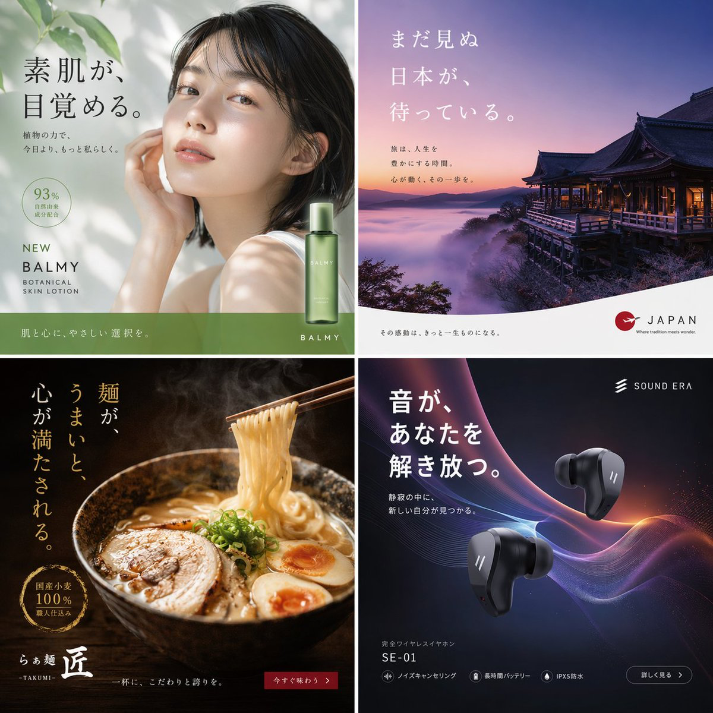</a>

```text
{
  "type": "advertisement poster collection",
  "layout": "{argument name=\"grid layout\" default=\"2x2 grid\"}",
  "panels": [
    {
      "position": "top-left",
      "theme": "skincare",
      "visuals": "young Asian woman looking up, soft natural lighting, dappled shadows, green lotion bottle",
      "headline": "{argument name=\"skincare headline\" default=\"素肌が、目覚める。\"}",
      "subtext": ["植物の力で、今日より、もっと私らしく。", "93% 自然由来成分配合"],
      "branding": "BALMY BOTANICAL SKIN LOTION"
    },
    {
      "position": "top-right",
      "theme": "tourism",
      "visuals": "traditional Japanese temple on a cliff, sea of clouds, purple and orange sunrise sky",
      "headline": "{argument name=\"travel headline\" default=\"まだ見ぬ日本が、待っている。\"}",
      "subtext": ["旅は、人生を豊かにする時間。心が動く、その一歩を。"],
      "branding": "JAPAN Where tradition meets wonder."
    },
    {
      "position": "bottom-left",
      "theme": "food",
      "visuals": "steaming bowl of ramen, chashu, egg, chopsticks lifting noodles, dark moody lighting",
      "headline": "{argument name=\"ramen headline\" default=\"麺が、うまいと、心が満たされる。\"}",
      "subtext": ["国産小麦 100% 職人仕込み"],
      "branding": "らぁ麺 匠 -TAKUMI-"
    },
    {
      "position": "bottom-right",
      "theme": "technology",
      "visuals": "floating black wireless earbuds, abstract glowing purple and blue sound waves, dark background",
      "headline": "{argument name=\"earbuds headline\" default=\"音が、あなたを解き放つ。\"}",
      "subtext": ["静寂の中に、新しい自分が見つかる。"],
      "branding": "SOUND ERA SE-01"
    }
  ]
}
```

## by [竹花 樒](<https://x.com/tshikimi>) on April 18, 2026 👉 [Try Now](https://indream.ai/generate?mode=IMAGE&modelKey=gpt-image-v2&modelPromptId=019dc096-abe5-7126-8e86-6231ead2ecc1)

<a href="./public/images/4bfd09b1-6af9-42d4-870e-fc0dbe7b93d5.png" target="_blank" rel="noopener noreferrer">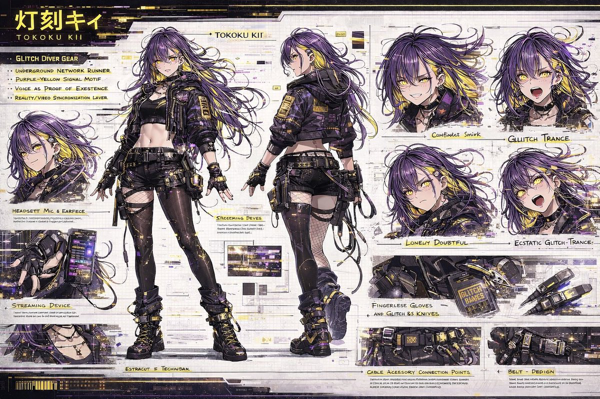</a>

```text
{
  "type": "anime character concept sheet",
  "character": {
    "name_jp": "{argument name=\"character name\" default=\"灯刻キィ\"}",
    "name_en": "{argument name=\"english name\" default=\"TOKOKU KII\"}",
    "appearance": {
      "hair": "{argument name=\"hair color\" default=\"purple with yellow underlights\"}, messy, long",
      "eyes": "{argument name=\"eye color\" default=\"yellow\"}, fierce, untamed",
      "outfit": "{argument name=\"theme\" default=\"cyberpunk techwear glitch diver\"}, black crop top, cropped jacket with purple and yellow glitch patterns, black shorts, asymmetrical thigh-highs with fishnet details, heavy tactical boots, fingerless gloves, tactical belts and pouches, hanging cables"
    }
  },
  "layout": {
    "background": "technical grid, glitch effects, UI elements",
    "centerpiece": "2 full-body portraits: front-facing and back-facing",
    "sections": [
      {
        "title": "GLITCH DIVER GEAR",
        "position": "top-left",
        "type": "bulleted list",
        "count": 4,
        "labels": [
          "UNDERGROUND NETWORK RUNNER",
          "PURPLE-YELLOW SIGNAL MOTIF",
          "VOICE AS PROOF OF EXISTENCE",
          "REALITY/VIDEO SYNCHRONIZATION LAYER"
        ]
      },
      {
        "title": "Expressions",
        "position": "top-right to mid-right",
        "type": "headshots",
        "count": 4,
        "labels": [
          "Confident Smirk",
          "GLITCH TRANCE",
          "Lonely Doubtful",
          "Ecstatic Glitch-Trance"
        ]
      },
      {
        "title": "Equipment Details Left",
        "position": "mid-left to bottom-left",
        "type": "close-up shots",
        "count": 3,
        "labels": [
          "HEADSET MIC & EARPIECE",
          "STREAMING DEVICE",
          "ESTRACUT IF TECHINBAN"
        ]
      },
      {
        "title": "Equipment Details Right",
        "position": "bottom-right",
        "type": "close-up shots",
        "count": 3,
        "labels": [
          "Fingerless Gloves AND GLITCH &S KNIVES",
          "CABLE ACESSORY CONNECTION POINTS",
          "BELT - DESIGN"
        ]
      }
    ]
  }
}
```

## by [终极小谢](<https://x.com/Panda20230902>) on April 18, 2026 👉 [Try Now](https://indream.ai/generate?mode=IMAGE&modelKey=gpt-image-v2&modelPromptId=019dc097-2376-711f-9d7e-6405a9614370)

<a href="./public/images/3623c60d-60d9-4378-a192-d2ab03e72ced.png" target="_blank" rel="noopener noreferrer">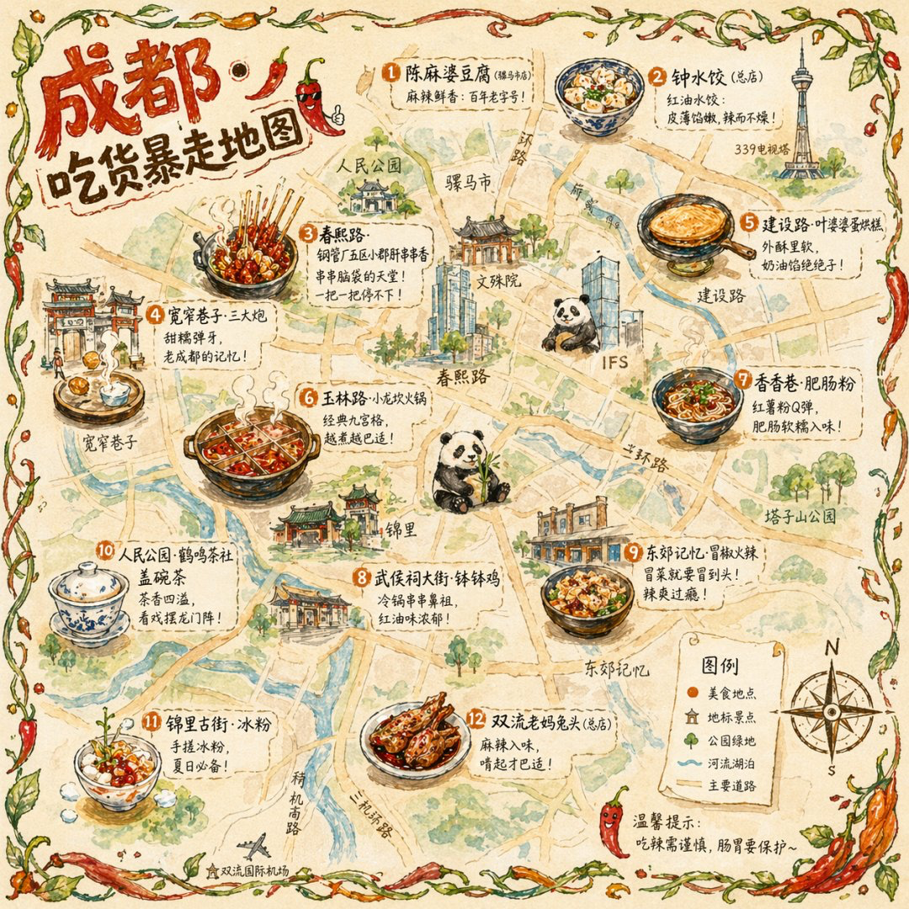</a>

```text
一张手绘风格的城市美食地图，以{argument name="城市" default="成都"}为主题。画面以鸟瞰视角的手绘简化城市地图为底，标注主要道路和地标但不追求精确比例而是追求可爱的手绘感。地图上分布着 12 个美食地点的精致手绘小插画：{argument name="地标" default="春熙路的串串香"}（一把竹签插着各种食材冒着热气）、宽窄巷子的三大炮（三个糯米团子飞向铜盘）、建设路的蛋烘糕（金黄酥脆正在翻面）、玉林路的火锅（九宫格锅翻滚冒泡）等，每个插画约占地图的 5% 面积，旁边用手写体标注店名和一句推荐语"凌晨两点还在排队的那家"。地图边缘用手绘藤蔓和辣椒装饰形成边框。右下角有一个手绘指南针和图例说明。左上角标题"{argument name="标题" default="成都·吃货暴走地图"}"使用胖圆的手绘美术字配辣椒装饰。整体画风为水彩+彩铅混合的手绘质感，颜色以暖色系（辣椒红、姜黄、翠绿）为主，图片比例 1:1。
```

## by [みかみ.ai｜AI発信と個人開発](<https://x.com/kotsu_kotsu_san>) on April 18, 2026 👉 [Try Now](https://indream.ai/generate?mode=IMAGE&modelKey=gpt-image-v2&modelPromptId=019dc097-ae3b-7539-a79f-4d8f3a790e79)

<a href="./public/images/bc41b880-3f8a-429c-afaf-ef8ac6e8ab35.png" target="_blank" rel="noopener noreferrer">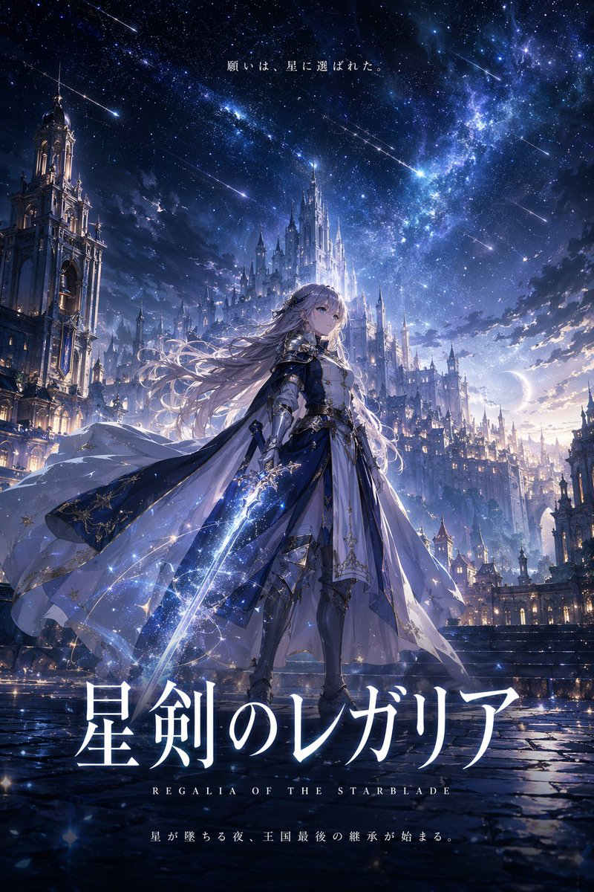</a>

```text
A cinematic anime-style fantasy movie poster featuring a female knight standing in the center of a cobblestone courtyard. She has long flowing {argument name="hair color" default="silver"} hair and wears ornate white and dark blue armor with gold accents and a long, billowing white cape decorated with star motifs. She holds a glowing, magical sword pointing downwards, emitting bright blue starlight and magical particles. The background is a breathtaking, highly detailed gothic fantasy castle and cityscape at night. The night sky is spectacular, filled with a glowing milky way, a crescent moon, and numerous shooting stars. The lighting is dramatic and ethereal, with the glowing sword illuminating the cobblestones. At the very top center, small elegant Japanese text reads "{argument name="top catchphrase" default="願いは、星に選ばれた。"}". In the lower third, large, elegant Japanese typography reads "{argument name="main title" default="星剣のレガリア"}". Just below the main title, smaller English text reads "{argument name="english subtitle" default="REGALIA OF THE STARBLADE"}". At the very bottom, small Japanese text reads "{argument name="bottom tagline" default="星が墜ちる夜、王国最後の継承が始まる。"}".
```

## by [REN｜プロンプトで一撃デザイン](<https://x.com/fang_ceo>) on April 18, 2026 👉 [Try Now](https://indream.ai/generate?mode=IMAGE&modelKey=gpt-image-v2&modelPromptId=019dc098-e3e5-73d9-89b6-9ea1b7d908a7)

<a href="./public/images/c174ada4-4dbe-4c9a-8ba1-a4e53fa060d5.png" target="_blank" rel="noopener noreferrer"></a>

```text
{
  "type": "2x2 grid of digital advertising banners",
  "style": "professional, modern, high-quality commercial graphic design, Japanese typography",
  "layout": {
    "grid": "2 columns, 2 rows",
    "banners": [
      {
        "position": "top-left",
        "industry": "Interior Design / Housing",
        "visuals": "Bright, modern living room with beige sofa, wooden dining table, large windows, indoor plants.",
        "typography": {
          "headline": "{argument name=\"home banner headline\" default=\"理想の暮らし、デザインしよう。\"}",
          "logo": "NATURAL HOME"
        },
        "ui_elements": [
          "Green circular badge: '相談・見積もり無料'",
          "Green bottom-right triangle button: '資料請求はこちらから ▶'"
        ]
      },
      {
        "position": "top-right",
        "industry": "Skincare / Cosmetics",
        "visuals": "Portrait of a beautiful woman with clear skin touching her cheek, alongside a bottle of 'Solea MOISTURE SERUM' with splashing water effects.",
        "typography": {
          "headline": "{argument name=\"skincare banner headline\" default=\"うるおい、満ちる。透明感。\"}",
          "subheadline": "敏感肌にもやさしい"
        },
        "ui_elements": [
          "3 light blue circular feature badges: '無添加処方', '高保湿', '低刺激'",
          "Solid blue bottom banner: '今なら初回限定 20%OFF'"
        ],
        "feature_count": 3
      },
      {
        "position": "bottom-left",
        "industry": "Gourmet Food Delivery",
        "visuals": "Dark background. Large appetizing image of a hamburger steak with vegetables. Below it, 3 smaller square photos: pasta, sliced steak salad, and chocolate cake.",
        "typography": {
          "headline": "{argument name=\"food banner headline\" default=\"おうちで楽しむプレミアムグルメ\"}"
        },
        "ui_elements": [
          "3 feature icons with text: '有名店の味を冷凍でお届け', '簡単調理で本格的な美味しさ', '特別な日のごちそうに'",
          "Gold bottom banner: '初回限定 1,000円OFF'"
        ],
        "feature_count": 3,
        "thumbnail_count": 3
      },
      {
        "position": "bottom-right",
        "industry": "Online Education / English Lessons",
        "visuals": "Smiling young Japanese woman wearing earphones, waving at a laptop screen.",
        "typography": {
          "headline": "{argument name=\"english banner headline\" default=\"英会話で、新しい自分に。\"}",
          "highlighted_text": "マンツーマンのオンラインレッスン"
        },
        "ui_elements": [
          "3 feature icons with text: '24時間予約可能', '初心者でも安心', '講師は全員ネイティブ'",
          "Blue bottom banner with logo 'English+': '{argument name=\"english discount text\" default=\"初月 50% OFF\"}'"
        ],
        "feature_count": 3
      }
    ]
  }
}
```

## by [GENEL | AIを用いた動画制作](<https://x.com/genel_ai>) on April 18, 2026 👉 [Try Now](https://indream.ai/generate?mode=IMAGE&modelKey=gpt-image-v2&modelPromptId=019dc099-17e9-758a-9d53-4e6d85cf93e7)

<a href="./public/images/3faf7619-da92-4174-a11a-d655cfb51fc4.png" target="_blank" rel="noopener noreferrer">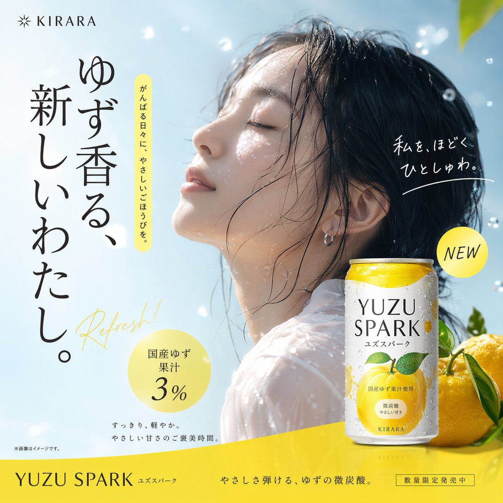</a>

```text
{
  "type": "beverage advertisement banner",
  "visuals": {
    "model": "young Asian woman, wet hair clinging to face, water droplets on skin, {argument name=\"model pose\" default=\"eyes closed, face tilted upwards, serene expression\"}, wearing a white top",
    "product": "white and yellow aluminum can with condensation, featuring a graphic of a {argument name=\"fruit type\" default=\"yuzu\"} fruit and leaves",
    "props": "2 fresh yuzu fruits with green leaves placed next to the can",
    "background": "{argument name=\"background scene\" default=\"bright blue sky with floating out-of-focus water droplets and bright sunlight\"}"
  },
  "layout": {
    "sections": [
      {
        "title": "Top Left Logo",
        "position": "top-left",
        "count": 1,
        "labels": ["KIRARA"]
      },
      {
        "title": "Main Copy",
        "position": "left",
        "count": 3,
        "labels": [
          "{argument name=\"main headline\" default=\"ゆず香る、新しいわたし。\"}",
          "がんばる日々に、やさしいごほうびを。",
          "Refresh!"
        ]
      },
      {
        "title": "Right Copy",
        "position": "mid-right",
        "count": 1,
        "labels": ["私を、ほどくひとしゅわ。"]
      },
      {
        "title": "Badges",
        "position": "various",
        "count": 2,
        "labels": [
          "NEW",
          "国産ゆず果汁 3%"
        ]
      },
      {
        "title": "Bottom Banner",
        "position": "bottom",
        "count": 4,
        "labels": [
          "{argument name=\"product name\" default=\"YUZU SPARK\"}",
          "ユズスパーク",
          "やさしさ弾ける、ゆずの微炭酸。",
          "数量限定発売中"
        ]
      }
    ]
  }
}
```

## by [いにしえ@AI Director & Creator｜Will Oldgram](<https://x.com/old_pgmrs_will>) on April 17, 2026 👉 [Try Now](https://indream.ai/generate?mode=IMAGE&modelKey=gpt-image-v2&modelPromptId=019dc09e-5197-714c-9728-dfa0e8667a14)

<a href="./public/images/777c7f01-1232-46bb-9dbd-ea69a189148a.png" target="_blank" rel="noopener noreferrer">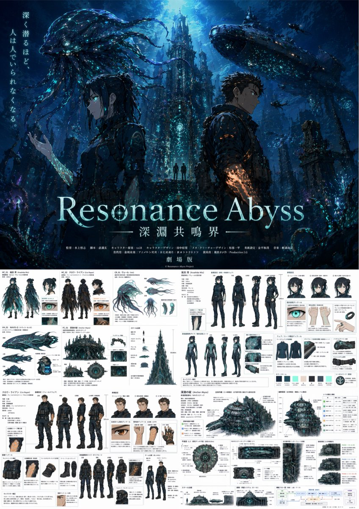</a>

```text
{
  "type": "anime theatrical poster and comprehensive production design reference sheet",
  "overall_theme": "{argument name=\"setting theme\" default=\"dark underwater sci-fi abyss\"}",
  "layout": {
    "top_half": "cinematic key visual poster",
    "bottom_half": "dense multi-panel production design document"
  },
  "poster_section": {
    "characters": [
      {
        "description": "young woman in profile, dark hair",
        "special_feature": "arm glowing with {argument name=\"female glow color\" default=\"cyan\"} markings"
      },
      {
        "description": "young man in profile, short dark hair",
        "special_feature": "arm glowing with {argument name=\"male glow color\" default=\"orange\"} markings"
      }
    ],
    "background": "towering gothic underwater structures, giant bioluminescent jellyfish creature, massive submarine",
    "typography": {
      "tagline": "{argument name=\"tagline\" default=\"深く潜るほど、人は人でいられなくなる。\"}",
      "main_title": "{argument name=\"main title\" default=\"Resonance Abyss\"}",
      "subtitle": "深淵共鳴界",
      "footer": "fake anime staff credits and 劇場版"
    }
  },
  "reference_sheet_section": {
    "grid_layout": "dense architectural and character design grid with Japanese annotations",
    "panels": [
      {
        "subject": "Female Character Design",
        "elements": [
          {"type": "standard outfit turnaround", "count": 4, "poses": ["front", "back", "side", "3/4"]},
          {"type": "facial expressions", "count": 3},
          {"type": "diving suit turnaround", "count": 4, "poses": ["front", "back", "side", "3/4"]},
          {"type": "suit detail close-ups", "count": 3},
          {"type": "color palette swatches", "count": 6}
        ]
      },
      {
        "subject": "Male Character Design",
        "elements": [
          {"type": "standard outfit turnaround", "count": 4, "poses": ["front", "back", "side", "3/4"]},
          {"type": "facial expressions", "count": 3},
          {"type": "diving suit turnaround", "count": 4, "poses": ["front", "back", "side", "3/4"]},
          {"type": "gear detail close-ups", "count": 4}
        ]
      },
      {
        "subject": "Creature and Mecha Design",
        "elements": [
          {"type": "jellyfish creature views", "count": 4},
          {"type": "submarine views", "count": 3}
        ]
      },
      {
        "subject": "Environment and World Building",
        "elements": [
          {"type": "domed underwater base exterior views", "count": 3},
          {"type": "scale comparison chart", "count": 1},
          {"type": "cross-section interior panels", "count": 3},
          {"type": "UI interface mockups", "count": 2},
          {"type": "system flowchart", "count": 1}
        ]
      }
    ]
  }
}
```

## by [小贰，來壺酒](<https://x.com/ChengSir404>) on April 17, 2026 👉 [Try Now](https://indream.ai/generate?mode=IMAGE&modelKey=gpt-image-v2&modelPromptId=019dc0a3-6c08-704b-b522-fd21d6017e04)

<a href="./public/images/0d24e223-4bcd-4a86-b06a-4a782ed9827a.png" target="_blank" rel="noopener noreferrer"></a>

```text
{
  "type": "3D e-commerce livestream promotional poster",
  "style": "vibrant purple and gold color scheme, glossy UI elements, neon lights, soft blurred studio background",
  "typography": {
    "header_pill": "抖音直播",
    "main_title": "{argument name=\"main title\" default=\"直播中\"}",
    "subtitle": "{argument name=\"subtitle\" default=\"欢迎进直播间\"}",
    "promo_pill": "{argument name=\"promo text\" default=\"好物推荐 不止5折\"}"
  },
  "layout": {
    "sections": [
      {
        "title": "feature_cards",
        "position": "middle",
        "count": 3,
        "items": [
          {"icon": "purple price tag", "text": "大牌好货 正品保障"},
          {"icon": "red envelope", "text": "直播专属 优惠多多"},
          {"icon": "purple gift box", "text": "互动抽奖 惊喜不停"}
        ]
      },
      {
        "title": "marquee_sign",
        "position": "lower middle",
        "style": "neon border with glowing dots, 3D red heart icon",
        "text": "{argument name=\"marquee text\" default=\"关注主播 不迷路\"}"
      },
      {
        "title": "footer_pill",
        "position": "bottom center",
        "style": "glowing neon border",
        "text": "{argument name=\"footer text\" default=\"点关注 下单享优先发货\"}"
      }
    ]
  },
  "scene_elements": {
    "top_corners": "2 studio spotlights pointing inwards",
    "bottom_left": "1 ring light on a tripod holding a smartphone",
    "bottom_right": "3 stacked cardboard boxes with labels '极速发货' and '售后无忧', 1 miniature shopping cart, 2 purple gift boxes with yellow ribbons",
    "background": "blurred studio setup with shelves and purple ambient lighting"
  }
}
```

## by [いにしえ@AI Director & Creator｜Will Oldgram](<https://x.com/old_pgmrs_will>) on April 17, 2026 👉 [Try Now](https://indream.ai/generate?mode=IMAGE&modelKey=gpt-image-v2&modelPromptId=019dc0a3-f2d5-74fb-aac7-15353eb7794b)

<a href="./public/images/b88d4731-554f-4dcb-845a-3913ceab9a3c.png" target="_blank" rel="noopener noreferrer">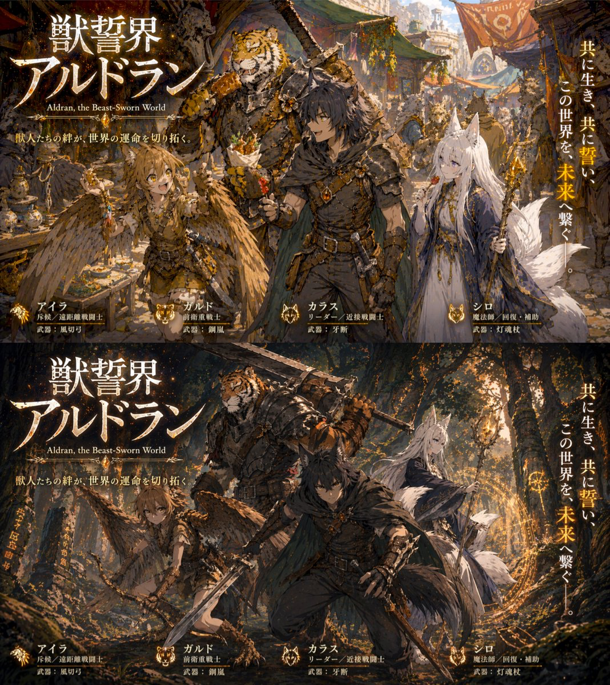</a>

```text
{
  "type": "two-panel fantasy RPG promotional illustration",
  "global_elements": {
    "main_title": "{argument name=\"main title\" default=\"獣誓界アルドラン\"}",
    "english_subtitle": "{argument name=\"english subtitle\" default=\"Aldran, the Beast-Sworn World\"}",
    "catchphrase": "獣人たちの絆が、世界の運命を切り拓く。",
    "vertical_tagline": "{argument name=\"tagline\" default=\"共に生き、共に誓い、この世界を、未来へ繋ぐ。\"}"
  },
  "characters": [
    {
      "name": "アイラ",
      "description": "winged beast-girl with brown hair and feathered wings",
      "role_label": "斥候 / 遠距離戦闘士",
      "weapon_label": "武器：風切弓"
    },
    {
      "name": "ガルド",
      "description": "massive tiger beastman in heavy plate armor",
      "role_label": "前衛重戦士",
      "weapon_label": "武器：鋼嵐"
    },
    {
      "name": "カラス",
      "description": "wolf-boy with black hair, wolf ears, tail, dark leather armor and cloak",
      "role_label": "リーダー / 近接戦闘士",
      "weapon_label": "武器：牙断"
    },
    {
      "name": "シロ",
      "description": "white fox-girl with long white hair, fox ears, multiple fluffy tails, blue and white robes",
      "role_label": "魔法師 / 回復・補助",
      "weapon_label": "武器：灯魂杖"
    }
  ],
  "layout": {
    "panels": [
      {
        "position": "top half",
        "scene": "{argument name=\"peaceful setting\" default=\"bustling fantasy market town in warm daylight\"}",
        "action": "characters are relaxed, smiling, and eating street food skewers together"
      },
      {
        "position": "bottom half",
        "scene": "{argument name=\"combat setting\" default=\"dark atmospheric forest with glowing magic runes\"}",
        "action": "characters are in dynamic combat stances, weapons drawn, casting magic, tense atmosphere"
      }
    ]
  }
}
```

## by [行者AI视频](<https://x.com/joshesye>) on April 16, 2026 👉 [Try Now](https://indream.ai/generate?mode=IMAGE&modelKey=gpt-image-v2&modelPromptId=019dc0a9-f1c4-73c1-a169-ca302abf6792)

<a href="./public/images/e0ca7512-2571-4bd9-b79f-ab6cb59a113e.png" target="_blank" rel="noopener noreferrer">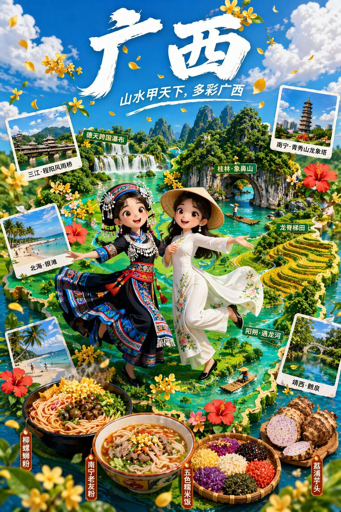</a>

```text
{
  "type": "3D animated style tourism promotional poster",
  "typography": {
    "main_title": "{argument name=\"main title\" default=\"广西\"}",
    "subtitle": "{argument name=\"subtitle\" default=\"山水甲天下, 多彩广西\"}"
  },
  "characters": [
    {
      "position": "center left",
      "description": "3D animated girl, joyful expression",
      "outfit": "{argument name=\"left character outfit\" default=\"traditional ethnic minority dress with silver headdress\"}"
    },
    {
      "position": "center right",
      "description": "3D animated girl, joyful expression",
      "outfit": "{argument name=\"right character outfit\" default=\"white traditional dress with conical hat\"}"
    }
  ],
  "background": {
    "theme": "{argument name=\"region theme\" default=\"Guangxi karst landscapes and rivers\"}",
    "style": "lush green 3D isometric map",
    "map_labels": [
      "德天跨国瀑布",
      "桂林·象鼻山",
      "龙脊梯田",
      "阳朔·遇龙河"
    ]
  },
  "layout": {
    "polaroid_photos": {
      "count": 4,
      "items": [
        { "position": "top left", "label": "三江·程阳风雨桥", "scene": "traditional covered bridge" },
        { "position": "middle left", "label": "北海·银滩", "scene": "tropical beach" },
        { "position": "bottom left", "label": "北海·银滩", "scene": "tropical beach" },
        { "position": "bottom right", "label": "靖西·鹅泉", "scene": "stone arch bridge over water" }
      ]
    },
    "food_showcase": {
      "position": "bottom foreground",
      "count": 4,
      "items": [
        { "label": "柳州螺蛳粉", "description": "bowl of spicy snail rice noodles" },
        { "label": "南宁老友粉", "description": "bowl of meat and rice noodles in broth" },
        { "label": "五色糯米饭", "description": "bamboo basket with five colors of sticky rice" },
        { "label": "荔浦芋头", "description": "whole and halved taro roots" }
      ]
    },
    "decorations": "scattered yellow osmanthus flowers and red hibiscus flowers"
  }
}
```

## by [行者AI视频](<https://x.com/joshesye>) on April 16, 2026 👉 [Try Now](https://indream.ai/generate?mode=IMAGE&modelKey=gpt-image-v2&modelPromptId=019dc0a9-ceba-74fc-acb5-b4f1b8188005)

<a href="./public/images/9530f882-1df6-4f52-bca2-55322b434a30.png" target="_blank" rel="noopener noreferrer">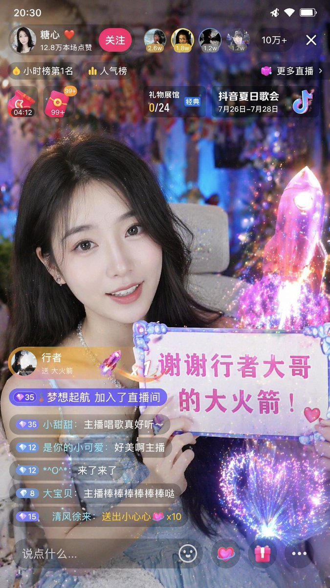</a>

```text
{
  "type": "mobile live-streaming app interface mockup",
  "subject": {
    "description": "young Asian woman, long dark hair, smiling, wearing a light blue sparkly dress",
    "action": "holding a decorative sign with text",
    "sign_text": "{argument name=\"sign text\" default=\"x1 谢谢行者大哥的大火箭！\"}"
  },
  "visual_effects": {
    "description": "{argument name=\"gift animation\" default=\"glowing pink holographic rocket\"} launching on the right side, emitting starbursts and magical particles"
  },
  "layout": {
    "top_bar": {
      "time": "20:30",
      "broadcaster": {
        "name": "{argument name=\"broadcaster name\" default=\"糖心 ❤️\"}",
        "stats": "12.8万本场点赞",
        "button": "关注"
      },
      "top_viewers_count": 4,
      "total_viewers": "10万+",
      "close_button": "X"
    },
    "widgets": {
      "count": 5,
      "labels": [
        "小时榜第1名",
        "人气榜",
        "更多直播 >",
        "礼物展馆 0/24",
        "{argument name=\"event banner text\" default=\"抖音夏日歌会 7月26日-7月28日\"}"
      ]
    },
    "chat_overlay": {
      "gift_alert": "行者 送 大火箭",
      "message_count": 6,
      "messages": [
        "梦想起航 加入了直播间",
        "小甜甜: {argument name=\"chat message\" default=\"主播唱歌真好听~\"}",
        "是你的小可爱: 好美啊主播",
        "*^O^*: 来了来了",
        "大宝贝: 主播棒棒棒棒棒棒哒",
        "清风徐来: 送出小心心 x10"
      ]
    },
    "bottom_bar": {
      "input_placeholder": "说点什么...",
      "icon_count": 4,
      "icons": ["smiley face", "heart planet", "gift box", "three dots"]
    }
  }
}
```

## by [すぐる | ChatGPTガチ勢 𝕏](<https://x.com/SuguruKun_ai>) on April 15, 2026 👉 [Try Now](https://indream.ai/generate?mode=IMAGE&modelKey=gpt-image-v2&modelPromptId=019dc0b1-44b5-759e-a9d9-2b49e2d9756c)

<a href="./public/images/cf975b1e-0a4c-4bc1-92c9-fb9d11938ef1.png" target="_blank" rel="noopener noreferrer">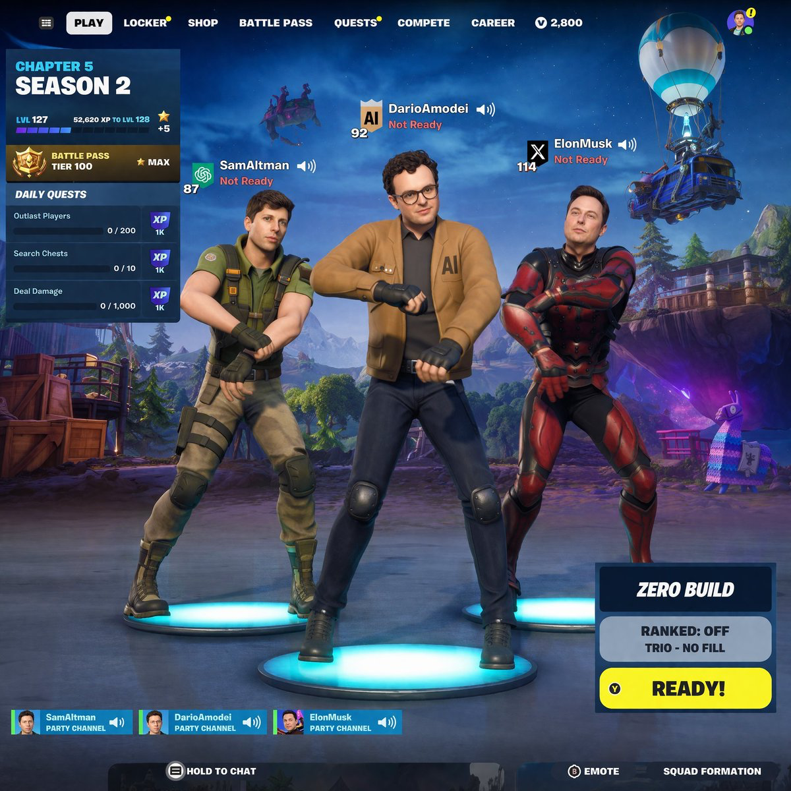</a>

```text
{
  "type": "battle royale lobby UI",
  "characters": [
    {
      "name": "{argument name=\"left character name\" default=\"SamAltman\"}",
      "outfit": "tactical green shirt, khaki pants",
      "pose": "dancing with crossed arms on blue platform",
      "ui": "Level 87, OpenAI icon, Not Ready"
    },
    {
      "name": "{argument name=\"center character name\" default=\"DarioAmodei\"}",
      "outfit": "brown jacket with AI text, glasses, jeans",
      "pose": "dancing with crossed arms on blue platform",
      "ui": "Level 92, AI shield icon, Not Ready"
    },
    {
      "name": "{argument name=\"right character name\" default=\"ElonMusk\"}",
      "outfit": "red and black futuristic armor",
      "pose": "dancing with crossed arms on blue platform",
      "ui": "Level 114, X icon, Not Ready"
    }
  ],
  "background": "stylized landscape, flying battle bus, purple llama piñata",
  "ui": {
    "top_nav": ["PLAY", "LOCKER", "SHOP", "BATTLE PASS", "QUESTS", "COMPETE", "CAREER"],
    "left_panel": {
      "title": "{argument name=\"season text\" default=\"CHAPTER 5 SEASON 2\"}",
      "stats": "LVL 127, BATTLE PASS TIER 100",
      "daily_quests": 3
    },
    "bottom_right": {
      "mode": "{argument name=\"game mode\" default=\"ZERO BUILD\"}",
      "status": "RANKED: OFF, TRIO - NO FILL",
      "button": "READY!"
    },
    "bottom_bar": {
      "party_channels": 3,
      "prompts": ["HOLD TO CHAT", "EMOTE", "SQUAD FORMATION"]
    }
  }
}
```

## by [とらの](<https://x.com/TlanoAI>) on April 15, 2026 👉 [Try Now](https://indream.ai/generate?mode=IMAGE&modelKey=gpt-image-v2&modelPromptId=019dc0b1-d820-744f-aff8-6be0f098dfbf)

<a href="./public/images/74ca1b68-d97b-4aab-80dc-6dc26fe07452.png" target="_blank" rel="noopener noreferrer">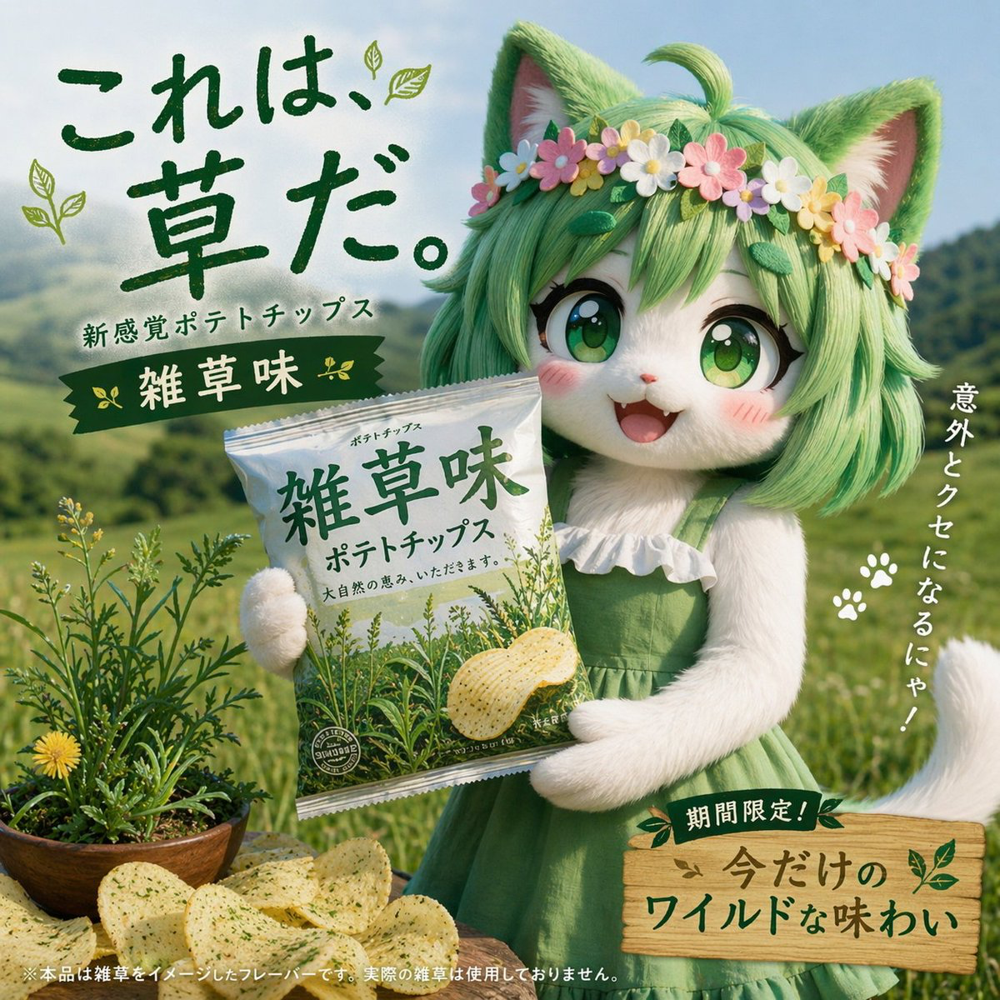</a>

```text
日本のポテトチップスの広告、キャラクターが袋を持って宣伝している、ポテトチップスの味は{argument name="味" default="雑草味"}
```

## by [いにしえ@AI Director & Creator｜Will Oldgram](<https://x.com/old_pgmrs_will>) on April 15, 2026 👉 [Try Now](https://indream.ai/generate?mode=IMAGE&modelKey=gpt-image-v2&modelPromptId=019dc0b2-1e90-773f-9d20-60f4c0b2d6b8)

<a href="./public/images/cd17e656-ea63-43f0-ba82-0b2e65428048.png" target="_blank" rel="noopener noreferrer">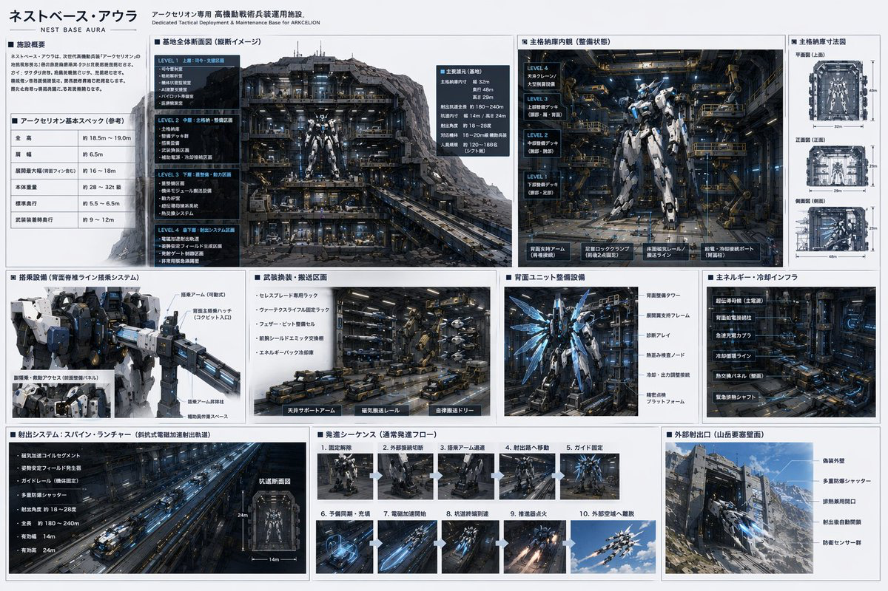</a>

```text
{
  "type": "sci-fi mecha base technical specification sheet",
  "style": "{argument name=\"ui theme\" default=\"technical schematic with dark grey panels and white text\"}",
  "header": {
    "title": "{argument name=\"base name\" default=\"ネストベース・アウラ\"}",
    "subtitle": "Dedicated Tactical Deployment & Maintenance Base for {argument name=\"mecha name\" default=\"アークセリオン\"}"
  },
  "layout": {
    "structure": "grid-based infographic with 3 main horizontal rows",
    "row_1": [
      {
        "title": "Facility Overview & Basic Specs",
        "content": "2 text blocks including a specification table with 5 rows"
      },
      {
        "title": "Base Overall Cross-section",
        "content": "Large cutaway view of the underground base showing 4 distinct levels (LEVEL 1 to LEVEL 4)"
      },
      {
        "title": "Main Hangar Interior",
        "content": "Front view of a {argument name=\"mecha color scheme\" default=\"white and blue\"} mecha in a maintenance bay, with 4 deck levels labeled on the left"
      },
      {
        "title": "Hangar Dimensions",
        "content": "3 orthographic wireframe-style views (Top, Front, Side) with dimension lines"
      }
    ],
    "row_2": [
      {
        "title": "Boarding Equipment",
        "content": "Close-up of the mecha's upper body and cockpit boarding arm"
      },
      {
        "title": "Weapon Transport Area",
        "content": "Detailed view of automated transport vehicles and magnetic rails"
      },
      {
        "title": "Rear Unit Maintenance",
        "content": "Back view of the mecha showing glowing blue thrusters and maintenance frames"
      },
      {
        "title": "Energy & Cooling Infrastructure",
        "content": "Dense machinery wall with pipes and super-conducting equipment"
      }
    ],
    "row_3": [
      {
        "title": "Launch System: Spine Launcher",
        "content": "Long perspective view of an electromagnetic catapult tunnel, plus 1 small cross-section diagram"
      },
      {
        "title": "Launch Sequence",
        "content": "Grid of 10 sequential images showing the mecha's launch process step-by-step"
      },
      {
        "title": "External Launch Port",
        "content": "Exterior view of the base built into a {argument name=\"base location\" default=\"Mountain fortress\"} wall, showing camouflage armor and blast doors"
      }
    ]
  }
}
```

## by [BrianChen](<https://x.com/Cheney_NehcOal>) on April 15, 2026 👉 [Try Now](https://indream.ai/generate?mode=IMAGE&modelKey=gpt-image-v2&modelPromptId=019dc0b5-9095-74fa-8e96-f5d922d41523)

<a href="./public/images/76a98449-5faa-47b0-b38f-82f6cef7f87d.png" target="_blank" rel="noopener noreferrer">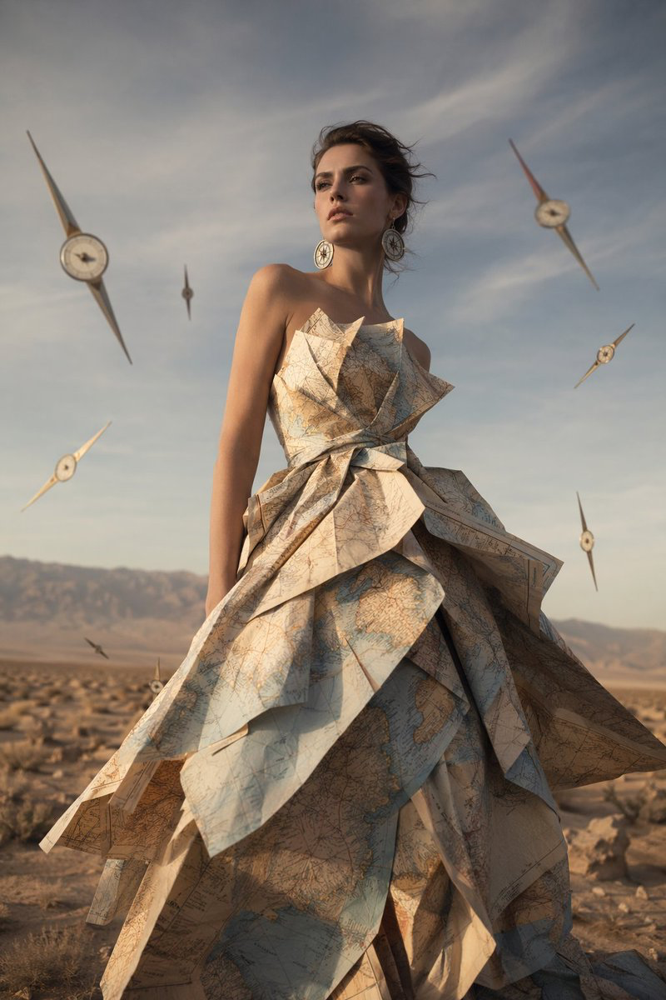</a>

```text
A high-fashion editorial photograph of a female model standing in an {argument name="environment" default="arid desert landscape"} with distant mountains under a soft cloudy sky. She is wearing a spectacular, structured haute couture dress made entirely of folded {argument name="dress material" default="vintage maps"}, featuring sharp, origami-like geometric layers and a strapless bodice. She has dark hair swept up, striking facial features, and wears large circular earrings resembling compasses. Surrounding her in the air are exactly 7 floating {argument name="floating objects" default="elongated compass needles with clock faces in the center"}. The image features {argument name="lighting" default="cinematic late afternoon lighting"}, casting soft shadows and highlighting the textures of the paper dress and the dry earth. Photorealistic, surreal fashion photography.
```

## by [SRKDAN](<https://x.com/SRKDAN>) on April 14, 2026 👉 [Try Now](https://indream.ai/generate?mode=IMAGE&modelKey=gpt-image-v2&modelPromptId=019dc0b7-82f7-74b9-b0a9-e4241e05e66e)

<a href="./public/images/5221e02c-64f0-4b93-83bf-e21e0ac1647f.png" target="_blank" rel="noopener noreferrer">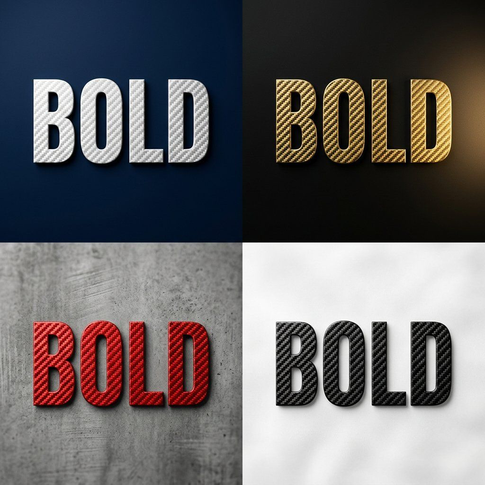</a>

```text
{argument name="subject" default="Typography"} where every letterform is woven from {argument name="material" default="carbon fibre"}. Tactile, directional, {argument name="aesthetic" default="pure performance aesthetic"}.
```
