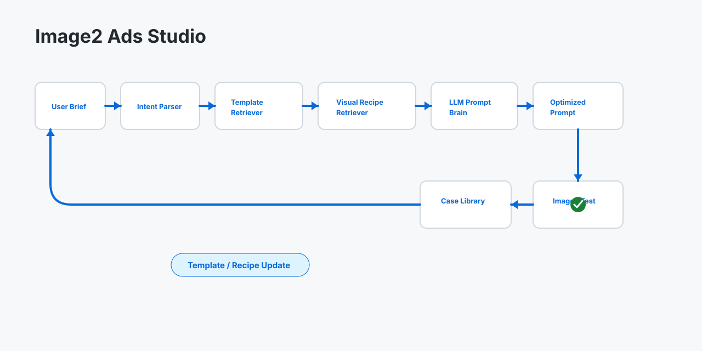
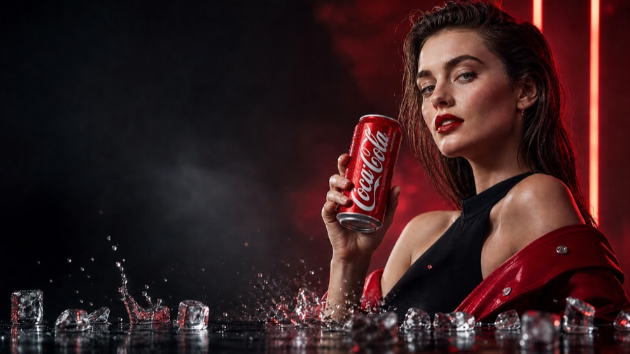
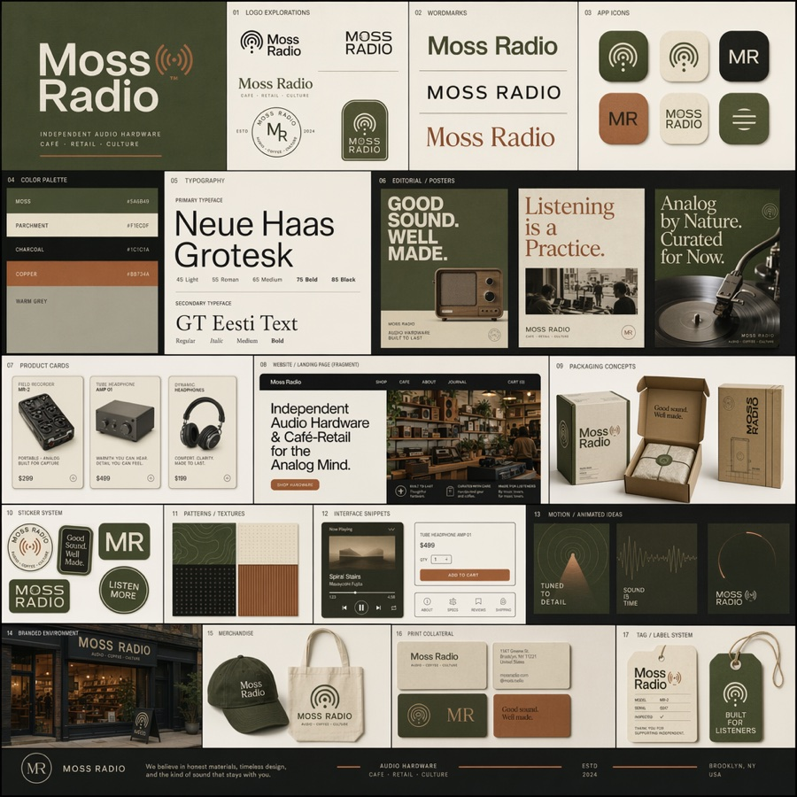
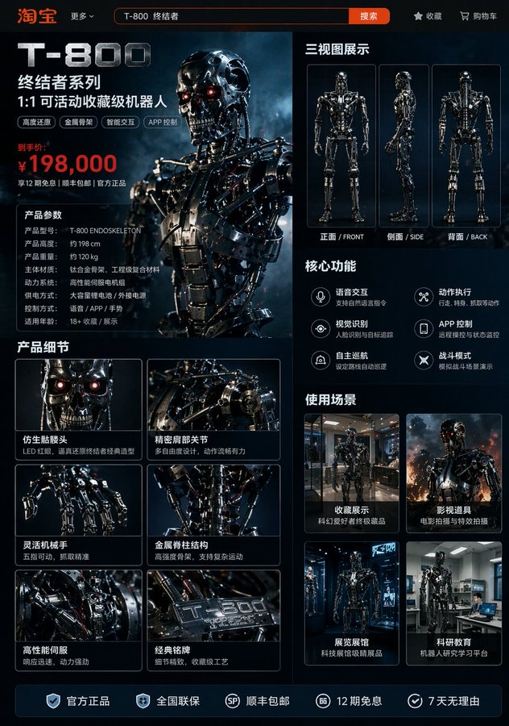
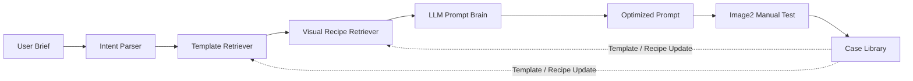

# Image2 Ads Studio

[English README](README.md) | [中文案例库](examples/gallery/cases.zh-CN.md) | [English Gallery](examples/gallery/cases.md)

面向 Image2 广告作图的开源 Prompt Agent：把客户白话需求、文案、行业和参考图，转成去品牌化、可执行、适合商业广告出图测试的优化提示词。

这不是一个“提示词搬运合集”。提示词库适合看案例、找灵感；Image2 Ads Studio 解决的是广告业务里更靠前的问题：客户只说一句需求时，系统如何解析意图、匹配广告模板、提取视觉配方、通过 LLM 重构 prompt，并输出可测试、可记录、可继续集成的作图方案。

这是 **Community Edition**。它开源 Prompt Agent 框架、本地 Web 工作台、当前完整的 320 条业务模板、240 条视觉配方、LLM Prompt Brain 接口、确定性 prompt 校验、参考图策略和公开案例库；商业版提供 ERP 集成、真实生图链路、生产案例库和私有模板治理。



## 我们和提示词仓库的区别

大多数 Image2 prompt 仓库回答的是：“有什么 prompt 可以复制？”

Image2 Ads Studio 回答的是：“给定客户需求、行业、文案、画幅和参考图，Agent 应该如何生成一条可执行的广告作图 prompt？”

| 提示词仓库 | Image2 Ads Studio |
| --- | --- |
| 用于浏览案例和找灵感 | 可本地运行的广告作图 Prompt Agent |
| 从已有 prompt 出发 | 从客户 brief、文案、行业和参考图出发 |
| 覆盖泛创意场景 | 聚焦广告垂类：门头、海报、电商、产品广告、导视、形象墙、商业摄影 |
| prompt 文本本身是主要内容 | Parser、Retriever、Compiler、LLM 重构、确定性校验和生成记录才是核心产品 |
| 通常依赖人工复制粘贴 | 输出 parsed intent、命中模板、视觉配方、设计方案、optimized prompt 和来源策略 |
| 参考案例可能贴近原始素材 | 公开案例 prompt 经过重构、去品牌化、归因标注，并改写为可复用版本 |
| 难以接入业务系统 | 架构上预留 ERP 字段、模板治理、Adapter 和生产工作流 |

## 案例库

公开案例库目前包含 100 个“一张图 + 一份中文 optimized prompt + 一份英文 optimized prompt”的案例，来源包括项目自有概念图和多个库内来源。每个案例都包含预览图、Image2 可用提示词、具体来源标注，以及由本仓库业务模板和视觉配方组成的库内复合来源。

查看完整案例：[中文案例库](examples/gallery/cases.zh-CN.md) / [English cases](examples/gallery/cases.md)

| 预览 | 中文 Prompt 摘录 |
| --- | --- |
|  | **饮品产品广告概念**<br><br>`请生成一张16:9的产品广告，用于饮品广告制作场景，主题为“饮品产品广告概念”。构图：主体必须清晰占据主视觉位置，画面分为主视觉区、标题/文案区、辅助信息区和留白区...` |
|  | **高端家电产品广告概念**<br><br>`请生成一张16:9的产品广告，用于消费电子广告制作场景，主题为“高端家电产品广告概念”。构图：主体必须清晰占据主视觉位置...` |
|  | **电商主图 - 琥珀香水高端广告**<br><br>`请生成一张1:1的产品广告，用于美妆护肤广告制作场景，主题为“电商主图 - 琥珀香水高端广告”。构图：主体必须清晰占据主视觉位置...` |
|  | **电商主图 - 热带柑橘汽水广告海报**<br><br>`请生成一张9:16的产品广告，用于食品饮料广告制作场景，主题为“电商主图 - 热带柑橘汽水广告海报”。构图：主体必须清晰占据主视觉位置...` |
|  | **Moss Radio 品牌识别展示板**<br><br>`请生成一张1:1的海报设计，用于品牌识别广告制作场景，主题为“Moss Radio 品牌识别展示板”。构图：主体必须清晰占据主视觉位置...` |
|  | **Zoo Visitor 导视地图**<br><br>`请生成一张16:9的海报设计，用于文旅导视广告制作场景，主题为“Zoo Visitor 导视地图”。构图：主体必须清晰占据主视觉位置...` |
|  | **E-Commerce Product Detail Page Layout**<br><br>`请生成一张9:16的电商主图，用于消费电子广告制作场景，主题为“E-Commerce Product Detail Page Layout”。构图：主体必须清晰占据主视觉位置...` |

来源与许可证说明见 [gallery attribution](examples/gallery/ATTRIBUTION.md)。Gallery 不是复制来的 prompt 合集：上游 prompt 和图片只作为结构参考，最终公开 prompt 由本项目 Agent 流程重新生成、去品牌化、标准化，并改写为可复用版本。

## 价值

广告制作需求通常不是一句 prompt 能稳定解决的。比如“做一个奶茶店门头效果图”，真正可执行的作图指令需要包含作图类型、行业、文案、画幅、材质、灯光、参考图保留策略和负面约束。

Image2 Ads Studio 的目标是把前期需求整理成结构化广告作图方案，并输出 LLM 优化后的 final prompt，供 Image2 或其他图像生成工具手动测试。

## 功能亮点

- 覆盖广告图文高频场景：门头、海报、展架、背景板、导视、形象墙、本地促销、电商主图、产品广告、商业摄影。
- 开源模板库内置 320 条业务模板和 240 条视觉配方。
- 支持 LLM Prompt Brain，对规则 prompt 做二次优化。
- 支持用户上传图的多模态分析边界。
- 支持确定性 prompt 校验，减少“高级感”“某某风格”这类模糊表达。
- 提供本地 Web 工作台：需求配置、优化提示词、结果预览、检索信号、JSON 下载。

## 快速开始

```bash
pnpm install
pnpm --filter ad-image-agent-core test
pnpm --filter ad-image-agent build
export OPENAI_API_KEY="your_api_key"
pnpm --filter ad-image-agent serve:llm
```

访问：

```text
http://127.0.0.1:5174
```

社区版当前不直接调用真实生图 API。你可以复制优化后的 prompt 到 Image2 网页，并按界面提示上传用户参考图。

## 架构



## 社区版与商业版

| 能力 | 社区版 | 商业版 |
| --- | --- | --- |
| 本地 Web UI | 包含 | 包含 |
| 核心 Prompt Agent 框架 | 包含 | 包含 |
| 业务模板 | 320 条开源模板 | 定制私有模板与治理 |
| 视觉配方 | 240 条开源配方 | 定制私有配方与评分评测 |
| LLM Prompt Brain | 接口与本地服务 | 生产化部署 |
| 图片生成 | 手动测试 Adapter | 真实生图 Adapter 与存储 |
| ERP 集成 | 文档说明 | 字段映射、连接器、部署支持 |
| 案例库 | 公开样例 | 私有评分案例库 |

## License

Apache-2.0。详见 [LICENSE](LICENSE)。
