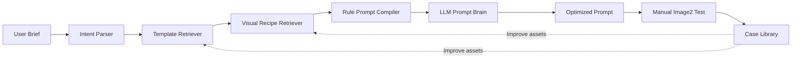

# Architecture

Image2 Ads Studio is a prompt-planning system for advertising image generation.

## Main Components

- **Intent Parser** converts form input into a structured advertising brief.
- **Template Retriever** selects business templates by task type, input mode, reference image role, industry, use case, material, business action, and visual keywords.
- **Visual Recipe Retriever** selects visual recipes that describe layout, subject, scene, lighting, typography, and detail formulas.
- **Prompt Compiler** builds a deterministic rule prompt from the brief, templates, recipes, and constraints.
- **LLM Prompt Brain** refines the rule prompt into a final prompt for manual image-generation testing.
- **Adapter Boundary** currently exposes manual text-to-image and image-edit instructions. Production adapters can be added later.

## Data Flow

1. The user enters a brief, copywriting, industry, aspect ratio, and optional reference images.
2. The core package parses the brief and retrieves templates and recipes.
3. The compiler produces a rule prompt and deterministic checks.
4. The local server sends the brief, matched assets, rule prompt, and allowed image references to the LLM.
5. The LLM returns an optimized prompt, observations, risks, and deterministic checks.
6. The user manually tests the optimized prompt in Image2 or another image-generation tool.
